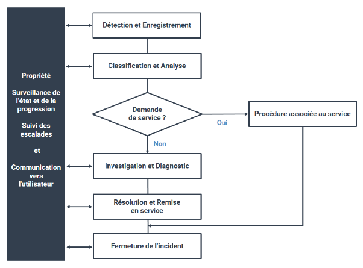
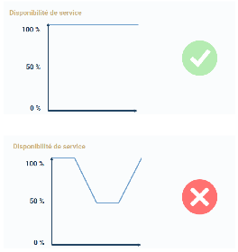
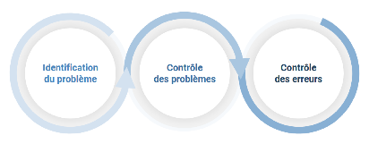

COURS COMPLETS

 

**L’organisation d’un centre de services**

###     ***Contexte***

Le centre de services client joue un rôle important dans la réussite d'une entreprise. Cela implique de prendre soin des clients pour assurer au mieux des interactions agréables et une satisfaction avec l'entreprise et ses produits, services et marques.

Un bon centre de services ne consiste pas seulement à conclure des ventes, mais à s'assurer que les clients sont pris en charge, que leurs besoins sont entendus et à les aider à trouver les bonnes solutions. Dans de nombreux cas, le service client va au-delà du service client de base en établissant des liens émotionnels.

Ainsi, nous verrons ce qu'est un centre de services, et la différence entre un *service desk*, un centre d'appel, un support client, et comment les distinguer. Nous verrons aussi le rôle du centre de services informatiques et ses avantages. Pour finir, nous énumérerons les meilleures pratiques du *service desk* ainsi que le logiciel de centre de services.

Le centre de services informatiques est l'étape primaire qui crée un contact entre les utilisateurs et une organisation IT.

Selon ITIL, entre le prestataire de services et les utilisateurs, le *service desk* est le point de contact unique.

Les services informatiques sont présentés comme des capacités organisationnelles qui permettent d'apporter de la valeur à des clients sous différents types de services.

Un centre de services informatiques gère :

* Les incidents (les coupures de service),  
* Les demandes de services (les tâches habituelles liées au service), sans oublier de traiter les communications des utilisateurs sur différents sujets, comme les pannes ou les changements définis dans les services.

ITIL estime que les centres d'appels et les supports clients sont des centres de services limités qui ne proposent qu'une part de ce qu'un centre de services informatiques peut procurer.

### ***Définition***

###     **Support client**

Un support client est une ressource centralisée élaborée pour apporter à l'utilisateur interne ou au client des informations, du support relié aux processus, des produits ainsi que des services de l'entreprise.

### ***Exemple***

###     **Exemples de support client**

* Le centre de support technique,  
* La fonction de support produit (sous garantie),  
* Le comité d'entreprise pour les employés ainsi que le centre de services pour installations.

Le support client peut être appliqué de différentes manières sous forme de sites physiques, ou par messagerie instantanée, e-mail, site Web, numéro vert.

### ***Définition***

###     **Centre d'appels**

Un **centre d'appels/centre de contacts** permet de gérer les contacts et les clients.

Le bureau a pour mission de gérer une grande capacité de demandes, principalement par téléphone (les demandes peuvent se faire aussi par lettres, messagerie instantanée, e-mails, réseaux sociaux ou fax).

Les centres d'appels entrants sont fréquemment employés pour le service client, le service téléphonique 24h/24 7j/7, le traitement de commandes et le support produit.

Les centres d'appels sortants sont employés pour les études de marché, le télémarketing, le recouvrement de créances, etc.

Une entreprise peut détenir de multiples centres d'appels qui permettent de prendre en charge divers aspects des opérations business.

Ils peuvent être dirigés en interne ou par un sous-traitant.

### ***Fondamental***

###     **Comment les distinguer ?**

La distinction se fait principalement sur ce que couvre la fonction et sa structuration :

* Un **support client** est axé principalement sur l'aménagement de support d'aide et de réparation.  
* Le **centre d'appel** gère les problèmes, qu'ils soient techniques ou non. Les centres d'appels n'interviennent pas de manière physique avec les demandeurs. Cela inclut donc l'utilisation d'une technologie distante pour permettre la communication.  
* Le ***service desk*** gère le support de services IT, mais également les services d'aide réactifs, les tâches habituelles, comme gérer des accès, alimenter des ressources, etc.

Les centres de services IT ont la possibilité d'être des sites physiques où les utilisateurs peuvent venir en personne, ou des sites distants comme un centre d'appel.

(vidéo) Les numéros verts  
Le numéro d’appel vert est un numéro gratuit pour les personnes appelant depuis un numéro de téléphone mobile ou fixe. Le coût de l’appel est assumé par la société qui possède le numéro, le paiement est effectué au destinataire. En france, les appels gratuits sont composés d’un préfixe tel 0800, 0801, 0803, 0804 ou encore 0805\. Ils se présentent également sous la forme de numéro brefs à 6 chiffres avec 3 suites de chiffres ex: 116162 et d’autres à 4 chiffres comme 3132\. Le numéro gratuit marche de la même manière que tout autre numéro de téléphone, les appelants n’ont qu’a composer le numéro dans leur téléphone pour lancer l’appel. La seul distinction réside dans la facturation car les appels ne sont pas à la charge de l’appelant. Il figure sur la facture de téléphone sous la rubrique appel vers des numéros spéciaux et sont facturés à la personne qui reçoit l’appel. Les entreprises utilisent souvent cette pratique pour des campagnes de publicité ou de marketing. Ces numéros verts sont aussi utilisés par les services publics pour accompagner les citoyens ayant des problèmes de santé de dépendance comme les numéros d’informations sur les drogues ou encore l’accompagnement des familles de sinistrés. Quelque soit la taille de votre entreprise, un numéro gratuit peut vous être d’un grand secours, il peut améliorer votre image de marque et votre réputation. Le plus important est qu’un numéro gratuit peut être le facteur déterminant de votre campagne de marketing et augmenté considérablement son retour sur investissement. Il existe de nombreuses raisons pour lesquelles les entreprises mettent en place des numéros gratuits, en tout premier lieu cela peut augmenter la satisfaction des clients, supposons qu’un de vos clients essaye de vous appeler pour éffectuer une commance de l’un de vos produits, signaler un problème ou obtenir des informations, si ce client doit payer de sa poche pour vous contacter, il pourrait s’énerver et raccrocher avant même de vous contacter surtout si li doit patienter, la réputation de votre entreprise pourrait souffrir. En offrant à vos clients la possibilité d’appeler un numéro 0800 gratuit, vous leur montrer que vous êtes disponible, que vous répondez à leurs besoins et que vous améliorez leur satisfaction, ils peuvent vous contacter gratuitement à tout moment. Plus vous simplifiez la vie de vos clients, plus ils sont susceptibles de rester fidèles à votre société et même de recommander votre marque à leur collaborateurs ou amis puis cela peut améliorer la crédibilité, si les numéros gratuits peuvent être utilisés par des entreprises de toute envergure, ils sont tout particulièrement indiqués pour les entreprises en phase de démarrage, comme par exemple les nouvelles entreprises, les starts ups ou encore pour les indépendants.K La création d’un numéro 0800 pour votre société, vous donne plus de crédibilité vis à vis de vos clients. Un numéro gratuit peut égalemment être utilisé pour assurer le suivi des campagnes de marketing, en effet si vous mettez plusieurs campagnes de marketing sur différents médias par le biais de panneaux d’affichages, de dépliants, de publicités radios ou de tout autre support sur plusieurs campagnes lancées en parallèle, il peut être délicat de savoir quelle campagne à susciter des appels, avec un numéro gratuit, vous pouvez créer des postes qui vous permettent de différencier le flux téléphonique en fonction de vos de vos campagnes ce qui simplifie la mesure de leur efficacité. Les numéros verts ont donc plusieurs avantages, toutes les entreprises devraient donc en avoir afin d’améliorer leur image de faciliter la vie des potentiels clients.  
**Quels sont le rôle et les avantages d'un centre de services informatiques ?:**

Le principal rôle d'un ***service desk*** est d'être le premier point de contact qui permet la prise en charge et la surveillance des incidents :

* Répondre aux questions/demandes des utilisateurs,  
* Fournir un canal de communication parmi d'autres fonctions qui permettent de gérer les services et l'ensemble des utilisateurs.

En supplément des fonctions principales, le centre de services IT tient fréquemment un rôle actif qui implique :

* La réception de demande de changement,  
* La gestion de licences logicielles,  
* La maintenance de contrats de support,  
* La gestion des problèmes (assistance).

Dans quelques organisations, le centre de services est assimilé à d'autres processus business comme :

* Accueillir de nouveaux salariés,  
* Gérer les accès aux données,  
* Intégrer des acquisitions,  
* La réception et le départ des partenaires/fournisseurs,  
* La gestion d'entreprise,  
* Le *reporting* et gérer les métriques,  
* Le contrôle des services et de l'infrastructure.

### **Réduction des coûts et extensibilité**

La réduction des coûts et l'extensibilité : ces deux avantages sont très recherchés par les entreprises qui désirent mettre en place un centre de services informatiques.

Lorsqu'un centre de services est bien dirigé, avec un excellent personnel, il peut assumer à lui seul la plupart du travail quotidien de la branche informatique.

### **Rester à l'écoute des utilisateurs**

Le ***IT service desk*** est le premier point de plusieurs processus et de services capitaux pour l'IT. C'est fréquemment l'interface principale qui relie les utilisateurs, les services informatiques et les processus business.

La surveillance de ce service permet d'avoir un retour d'informations sur la satisfaction des utilisateurs, leur avis par rapport aux services, et les différentes fonctions/besoins qui ne sont pas satisfaits, pour pouvoir être clos dans le futur par les services informatiques.

### **Alerte précoce des problèmes potentiels**

Le centre de services traite une énorme quantité de demandes et de problèmes. Ils ont à leur disposition les bons outils ainsi que les bonnes données.

Grâce à ces outils, ils déterminent les problèmes de services et peuvent anticiper.

Le centre de services propose un système d'alerte précoce qui permet la gestion proactive des problèmes, les remplacements de services et la maintenance préventive pour réduire l'effet des dégradations et des pannes sur les utilisateurs.

**Meilleures pratiques du « Service Desk »:**

### **L'engagement vis-à-vis des clients**

Voici quelques engagements à prendre vis-à-vis des clients :

* Comprendre les besoins du client.  
* Portail libre-service disponible 24h/24 pour les utilisateurs.  
* Appliquer les SLA (*Service Level Agreement*) et les classifications dans l'ordre d'importance, pour permettre de gérer en priorité celles qui sont urgentes.  
* Dès le premier point de communication, essayer de résoudre les problèmes pour éviter les transferts, les rappels ainsi que les escalades.  
* Faire des enquêtes de satisfaction client, ce qui permet de savoir ce que les clients pensent des services qu'ils ont reçus.

### **Le reporting et la gestion du centre de services**

* Utiliser les rapports en temps réel, les données du support client, les tableaux de bord. Cela permet d'avoir le contrôle des opérations et d'apporter des corrections afin d'éviter que les incidents n'évoluent en problèmes.  
* Vérifier les processus d'escalade et de transfert.  
* Utiliser les compétences d'analyse de la gestion des services informatiques pour écourter le temps ainsi que les efforts déployés pour concevoir des rapports.  
* Considérer les employés du centre de services en tant que spécialistes de la communication/résolution de problèmes, en leur mettant à disposition les outils adéquats qui leur permettront d'exceller dans leur domaine.

### ***Fondamental***

### **Utilisation de la technologie pour soulager le centre de services informatiques**

* Établir des compétences du flux opérationnel de demandes de services dans le logiciel de support, afin d'organiser les transferts et les escalades.  
* Fournir des compétences d'automatisation pour les réclamations d'utilisateurs courantes (réinitialiser mot de passe, accès, etc.).  
* Utiliser des logiciels de centre d'assistance pour permettre l'enregistrement et faciliter les échanges entre les demandeurs et les agents.  
* Incorporer les systèmes de *service desk* dans la gestion de services informatiques pour apporter aux agents un accès plus élargi aux informations.

### ***Fondamental***

###     **La gestion des connaissances**

* Mettre en place un système de gestion des connaissances.  
* Répondre aux questions qui sont souvent posées par les utilisateurs (FAQ), ce qui permet à l'utilisateur d'avoir accès à une réponse sans avoir à contacter un agent.  
* Actualiser régulièrement des fichiers de connaissances.

**Logiciel de centre de services:**

Le centre de services, aussi nommé *service desk*, pour répondre de manière efficace aux utilisateurs, nécessite une base de technologie robuste.

### **Système de tickets du support client**

Le système de tickets du support client organise les incidents ainsi que les demandes de services dans la totalité des fonctions du centre de services.

Quelles sont les fonctions principales du système de tickets ?

* La gestion du flux opérationnel  
* La gestion des alertes et des escalades  
* La gestion des SLA et des contrats  
* Le routage automatique

### **Gestion des connaissances**

La connaissance est l'atout le plus précieux du centre de services ; la création des données d'une excellente qualité permet de maximiser la performance opérationnelle.

Un système de gestion des connaissances est capital pour centraliser cette ressource et garantir que la connaissance organisationnelle peut être mobilisée par les personnes qui en ont besoin.

Quelles sont les fonctions principales d'un système de gestion des connaissances ?

* Une base de données des connaissance  
* Les flux opérationnels de gestion des connaissances pour fortifier le cycle de vie des connaissances  
* Une base de données des erreurs et des problèmes connus  
* Différentes vues des données pour les utilisateurs et les agents  
* Un système de recherche par mots-clés qui repose sur la description de l'incident

### **Libre-service pour l'utilisateur final**

Un nombre élevé de problèmes et de requêtes amènent les utilisateurs à appeler le *service* *desk*, alors qu'ils ont la possibilité de résoudre le problème eux-mêmes en accédant directement aux informations nécessaires.

Les capacités de support libre-service accordent à l'utilisateur la possibilité de résoudre son problème rapidement, sans contacter un agent.

Elles permettent à l'entreprise d'économiser en réduisant le besoin en agents qui traitent les demandes simples au sein du centre de services informatiques.

Quelles sont les fonctionnalités libre-service les plus courantes ?

* Base de connaissances (recherches)  
* Libre-service (diagnostics)  
* Demande de services (formulaire)  
* Processus courants automatisés

### ***Fondamental***

###     **Gestion du service desk et reporting**

Les fonctions de gestion et de *reporting* sont principalement intégrées au sein du centre de services quand les directeurs de services désirent :

* Optimiser les coûts opérationnels,  
* Déterminer les problèmes qui impactent l'entreprise,  
* Connaître le taux de satisfaction client,  
* Assurer le respect des SLA.

Dans ses fonctions de gestion, le responsable du centre de services doit se procurer une vue d'ensemble des données nécessaires pour l'aider dans ses prises de décisions.

Quelles sont les principales capacités de gestion et de *reporting* du centre ?

* Aptitude à gérer les incidents majeurs  
* Rapports de mesure sur la gestion des appels/les agents  
* Tableaux de bord pour vérifier la disponibilité des services ainsi que leur performance  
* Analyse des problèmes (connus)  
* Rapports des SLA (si elles sont respectées)

**La méthode ITIL (Information Technology Infrastructure Library):**

### ***Contexte***

ITIL est la méthode de gestion des services informatiques la plus populaire au monde. Elle aide les organisations à augmenter leur productivité, efficacité et efficience, et permet un premier pas vers le changement.

En règle générale, L'IT se concentre sur les services dits « *d'infrastructure* ». Au contraire, la méthode ITIL, elle, recommande une **approche plutôt globale de la gestion des services** en considérant l'ensemble du service métier et tous les aspects du service (pas seulement d'infrastructure) pour répondre :

* Aux besoins de service,  
* Aux exigences des clients,  
* Aux niveaux de service (livraison ponctuelle, protection adéquate, etc.).

Nous allons donc voir dans ce cours ce qu'est la gestion des incidents ITIL, ainsi que les principales façons de mettre en œuvre la gestion des incidents. Nous verrons aussi ce que veut dire le terme « *Gestion des problèmes* », la différence entre un incident et un problème et les 3 phases de gestion des problèmes.

### **Qu'est-ce que la gestion des incidents ITIL ?:**

(vidéo) Gestion des incidents ITIL  
La gestion des incidents (IM) ITIL consiste à restaurer les services le plus rapidement possible après un incident. C’est aussi un composant principal du support de service ITIL.  
Les incidents sont des phénomènes récurrents au sein des systèmes et structures, coupures, pannes, matériel déffectueux et plusieurs autres problèmes peuvent être la cause d’incidents. Ces incidents sont soiuvent couteux en temps, en énergie et en ressource. La démarche ITIL est un processus servant à gérer les incidents. En réponse à la multiplication d’incidents et à leurs conséquences, la démarche ITIL à vue le jour. ITIL c’est un ensemble de procédés, de règles et de bonnes pratiques ayants pour but de s’assurer de la bonnes gestion des incidents. Cette gestion des incidents passe par la maîtrise des systèmes d’information. Ces systèmes d’information se chargent à leur tour de coordonner les activités au sein des structures ou entreprises afin d’éviter ou de contrer d’éventuels incidents. Le processus de gestion des incidents permet de poursuivre plusieurs objectifs, d’abord, il vise l’amélioration de la communication entre les entreprises et leurs groupes de soutient au sujet des incidents, ensuite il poursuit aussi la synchronisation des tâches habituelles des entreprises et celles du processus de gestion. Par ailleurs, il cherhce à augmenter la satisfaction que procure aux clients les services des entreprises. Enfin, ils visent une systématisation de la gestion des incidents, c’est-à-dire, la création d’un système indépendant capable de gérer les incidents de manière efficace.   
ITIL considère comme un incident tout évènemment qui survient au sein d’une entité et qui ne fait pas partie de son mode de fonctionnement mais qui est capable de nuire ou qui nuit à l’obtention de bons résultats au sein de l’entité en question.  
Par exemple, au sein d’une entreprise de vente, une rupture de stock est un incident.  
La priorité d’ITIL n’est pas forcèment de régler la cause des incidents depuis la base mais de rendre opérationnel la structure ou l’entreprise au plus vite en contournant la source du problème si possible. La gestion des incidents par ITIL est faîtes suivant 6 étapes:

- étape 1: Identifier et répertorier les incidents  
- étape 2: Déterminer de quel type d’incident il s’agît et apporter les premières solutions  
- étape 3: Une enquête approfondie à lieu afin d’établir un réel diagnostique   
- étape 4: Assure l’éradication du problème détecter   
- étape 5: L’incident est cloturé   
- étape 6: Intervient quand l’éradication du problème à la base de l’incident prend plus de temps que prévu, elle assure le pilotage de l’opération de résolution de l’incident

La démarche ITIL une fois mise en place procure plusieurs bienfaits aux entreprises. Premièrement, elle permet une meilleure gestion des ressources car les ressources sont allouées en fonction des problèmes. Deuxièmemment, grâce aux bases de données pour incidents, des informations seront mieux conservées et circuleront aisaimment. Troisièmmement, avec la démarche ITIL, les incidents sont réduis, ce qui augmentera la performance des entreprises. La liste des avantages n’est pas exaustive, mais voilà les plus pertinents d’entre eux.  
 En somme on doit garder à l’esprit que la démarche ITIL est un processus de gestion des incidents connue pour son efficacité, son objectif principal n’est pas forcément d’éradiquer la source de l’incident depuis sa racine mais de trouver une alternative afin de rendre la structure à nouveau opérationnelle.

La gestion des incidents ITIL est un processus réactif. Vous pouvez utiliser la messagerie instantanée pour diagnostiquer et escalader les procédures de restauration du service.

Ce n'est donc pas une mesure proactive.

Les activités courantes de gestion des incidents ITIL comprennent les actions suivantes :

* Détecter et enregistrer les détails de l'incident,  
* Faire correspondre les incidents aux problèmes connus,  
* Résoudre les incidents le plus rapidement possible,  
* Prioriser les incidents en termes d'impact et d'urgence,  
* Transférer les incidents à d'autres équipes pour assurer une résolution rapide.

### **Pourquoi devrais-je mettre en œuvre la gestion des incidents ITIL ?:**

Il est important, pour tout service informatique, d'avoir un plan de gestion des incidents car nous en sommes jamais à l'abri.

### **4 principales raisons de mettre en œuvre la gestion des incidents ITIL:**

#### **Maintien des niveaux de service**

Lorsqu'il s'agit de respecter les accords de niveau de service (SLA), éviter les incidents est idéal. L'utilisation d'une solution d'atténuation des risques peut vous y aider.

Mais vous devez toujours avoir un plan en place pour maintenir votre service opérationnel, juste au cas où un incident se produirait. C'est là qu'intervient la gestion des incidents ITIL.

Vous pouvez utiliser la gestion des incidents pour décrire comment vous allez gérer les incidents et les résoudre le plus rapidement possible. Bien entendu, l'utilisation du bon logiciel de surveillance d'infrastructure peut vous aider.

#### **Répondre aux exigences de disponibilité des services**

Votre entreprise ne peut pas se permettre des temps d'arrêt imprévus.

Il est important que vous soyez en mesure de répondre systématiquement aux exigences de disponibilité des services.

Les processus de gestion des incidents ITIL peuvent faciliter cette tâche. Vous pouvez utiliser ces processus pour définir comment vous allez détecter les incidents.

Et rappelez-vous, le temps presse.

Envisagez une solution de gestion des performances pour vous aider à prendre le pouls de votre disponibilité.

#### **Augmenter l'efficacité et la productivité du personnel**

L'équipe technique doit être qualifiée dans la gestion des incidents ITIL, et doit aussi avoir les outils nécessaires qu'elle pourra utiliser pour mieux les maîtriser.

##### ***Conseil***

Il faut penser à utiliser un logiciel de gestion des performances et de la capacité. Cela peut aider à libérer du temps pour le personnel, afin qu'il soit plus productif.

Pendant ce temps, vous n'aurez pas à vous soucier de la surveillance manuelle des incidents.

#### **Améliorer la satisfaction des utilisateurs**

Vos clients, ainsi que vos employés, ne souhaitent pas être perturbés par des incidents. En effet, la pratique des processus de gestion des incidents ITIL peut également vous aider à améliorer leur satisfaction.

##### ***Méthode***

L'utilisation de ces mesures vous aidera à vous assurer que les incidents sont évités dans la mesure du possible, ou à accélérer la restauration si ce n'est pas le cas. L'utilisation d'un logiciel de planification de la capacité peut être une étape intelligente pour garantir la satisfaction de vos utilisateurs.

**Gestion des problèmes selon ITIL:**

### **Qu'est-ce que la gestion des problèmes ?**

L'objectif de la gestion des problèmes est de réduire la probabilité et l'impact des incidents en identifiant les causes réelles et potentielles des incidents et en gérant les solutions de contournement et les erreurs connues.

Les problèmes sont liés aux incidents, mais il est important de les différencier dans la manière dont ils sont gérés :

* Les incidents ont un impact sur les utilisateurs ou les processus métier et doivent être résolus afin que l'activité commerciale normale puisse reprendre rapidement.  
* Les problèmes sont les causes des incidents. Ils nécessitent donc une enquête et une analyse pour identifier les causes, développer des solutions de contournement et recommander une résolution à plus long terme.

Cela réduit le nombre et l'impact de futurs incidents.

### **3 phases de gestion des problèmes:**

La gestion des problèmes comporte 3 phases distinctes :

#### **Identification du problème:**

Les activités d'identification des problèmes identifient et consignent les problèmes en :

* Analysant les tendances des enregistrements d'incidents,  
* Détectant les problèmes en double et récurrents,  
* Identifiant un risque qu'un incident puisse se reproduire, lors de la gestion des incidents majeurs,  
* Analysant les informations reçues des fournisseurs et des partenaires,  
* Analysant les informations reçues des développeurs de logiciels internes, des équipes de test et des équipes de projet.

#### **Contrôle des problèmes:**

Les activités de contrôle des problèmes comprennent :

* L'analyse des problèmes,  
* La documentation des solutions de contournement et des erreurs connues.

Tout comme les incidents, les problèmes seront hiérarchisés en fonction du risque qu'ils posent en termes de probabilité et d'impact sur les services.

##### ***Fondamental***

L'accent doit être mis sur les problèmes qui présentent les risques les plus élevés pour les services et la gestion des services.

Lors de l'analyse des incidents, il est important de se rappeler qu'ils peuvent avoir des causes interdépendantes, qui peuvent avoir des relations complexes.

Par conséquent, l'analyse du problème doit avoir une **approche holistique** prenant en compte toutes les causes contributives telles que celles qui ont provoqué l'incident, aggravé l'incident ou même prolongé l'incident.

Lorsqu'un problème ne peut pas être résolu rapidement, il est souvent utile de trouver et de documenter une **solution de contournement pour les incidents futurs**, basée sur une compréhension du problème.

##### ***Définition***

#####     **Solution de contournement**

Une solution de contournement est définie comme une solution qui réduit ou élimine l'impact ou la probabilité d'un incident ou d'un problème pour lequel une résolution complète n'est pas encore disponible.

##### ***Exemple***

Un exemple de solution de contournement pourrait être le redémarrage des services dans une application ou le basculement vers un équipement secondaire.

Les solutions de contournement sont documentées dans les enregistrements des problèmes. Cela peut être fait à n'importe quelle étape, sans avoir nécessairement à attendre la fin de l'analyse.

Cependant, si une solution de contournement a été documentée au début du contrôle du problème, elle devra être examinée et améliorée une fois l'analyse du problème terminée.

Une solution efficace de contournement d'incident peut devenir un moyen permanent de traiter certains problèmes, lorsque la résolution du problème n'est pas viable ou rentable.

Si tel est le cas, le problème reste dans l'état d'erreur connu, et la solution de contournement documentée est appliquée lorsque des incidents liés se produisent.

##### ***Fondamental***

Chaque solution de contournement documentée doit inclure une définition claire des **symptômes** et du **contexte** auxquels elle s'applique. Les solutions de contournement peuvent être automatisées pour une plus grande efficacité et une application plus rapide.

#### **Contrôle d'erreur:**

Les activités de contrôle des erreurs gèrent les erreurs connues et peuvent permettre l'identification de solutions permanentes potentielles.

Lorsqu'une solution permanente nécessite un contrôle des changements, cela doit être analysé du point de vue des coûts, des risques et des avantages.

Le contrôle des erreurs réévalue également régulièrement l'état des erreurs connues qui n'ont pas été résolues, en tenant compte :

* De l'impact global sur les clients et/ou la disponibilité du service,  
* Du coût des résolutions permanentes,  
* De l'efficacité des solutions de contournement.

##### ***Fondamental***

L'efficacité des solutions de contournement doit être évaluée chaque fois qu'une solution de contournement est utilisée, car la solution de contournement peut être améliorée en fonction de l'évaluation.

**L’architecture matérielle des équipements numériques:**

**Introduction à l’architecture matérielle des équipements numériques:**

**Introduction:**

### **Les équipements numériques**

Ce sont des dispositifs électroniques qui traitent, stockent, diffusent ou affichent des informations sous forme numérique. Ces équipements utilisent des signaux électriques pour représenter des données en base de numération Base 2 qu’est le bit (0 et 1).

**Composants essentiels des équipements numériques:**

Voici ci-dessous les composants d’un équipement numérique de type ordinateur. Il faut savoir que la plupart des composants d’un ordinateur se retrouvent dans d’autres équipements numériques. L’ordinateur est basé sur les travaux architecturaux de Von Neumann (modèle de Von Neumann) :

Boîtier : héberge les composants internes, notamment le module d’alimentation, la carte mère, le processeur, la mémoire, les disques durs et les cartes d’extension. On retrouve en facteur de forme ou format, des boîtiers horizontaux, des boîtiers pleines tailles, des boîtiers compacts, des boîtiers Tout en 1, etc.

(Source image : [DELL Technologies](https://www.dell.com/fr-fr))

Alimentation : fournit l’électricité (3V, 5V, 12V) aux composants en convertissant l’alimentation CA (courant alternatif) en alimentation CC (courant continu) inférieure requise par les composants internes. Ils existent le format AT, ATX, micro-ATX, ATX12V, BTX, EPS12V. Ces alimentations comportent des connecteurs pour relier les composants et périphériques internes comme l’enfichable 20-24 broches, MOLEX (PATA), SATA, BERG, PCIe 6-8 broches.

![][image5]

(Image source : [materiel.net](https://www.materiel.net/guide-achat/g6-les-alimentations-pc/5265/))

Carte mère : colonne vertébrale de l’ordinateur. C’est un grand circuit imprimé contenant des canaux (fils) de communication électrique et reliant les composants ensemble. Ces composants peuvent être soudés directement sur la carte mère ou connectés au moyen de sockets, de slots d’extension ou de ports.

![][image6]

(Image source : [malekal.com](https://www.malekal.com/carte-mere-definition-composants-choisir/))

Chipset : circuits intégrés contrôlant les communications entre le processeur et le reste des composants de la carte mère. On a 2 types de chipsets :

* **Northbridge** : permet un accès rapide à la mémoire RAM et à la carte graphique.  
* **Southbridge** : permet au processeur de communiquer avec des périphériques plus lents, comme des disques durs, des ports USB ou des slots d’extension.

Processeur ou Central Processing Unit (CPU) : (micro)puce électronique qui interprète et exécute des commandes. Il est dans un emplacement identifié appelé « *socket* ». Il existe deux connexions possibles en fonction du processeur, entre le CPU et le socket, le **PGA (Pin Grid Array, ou matrice de broches)** ou le **LGA (Land Grid Array ou matrice de pastilles).**

**![][image7]**

**![][image8]**

Actuellement, nous avons des processeurs 32 bits (x86) et 64 bits (x64). Cela veut dire que la largeur des registres est de 32 ou 64 bits sur les nombres entiers. Plus clairement, un processeur 32 bits ne peut pas travailler avec une mémoire de plus de 4 GigaOctets (2^32) tandis qu’un processeur 64 bits peut adresser jusqu’à 16 Eo (2^64).

Il existe 2 grands constructeurs de processeurs (Intel et AMD), d’autres, plus petits, existent également (qualcomm, Nvidia, MediaTek, etc.).

On retrouve de plus en plus d’Unités Arithmétiques et Logiques (UAL) dans un processeur, qui constitue pour chacune, un processeur virtuel (un cœur).

Trois architectures de processeur existent : Intel, AMD, ARM.

De plus en plus, on retrouve, créée par AMD, le processeur graphique et non graphique dans une seule puce appelée APU (Accelerated Processing Unit).

Ventilation : pour refroidir les composants, des systèmes de refroidissement ont été créés composés de ventilateurs associés ou non à un radiateur (Ventirad si association).

Mémoires : toutes les puces mémoire stockent les données sous la forme de bits.

On retrouve de la mémoire à lecture seule programmable (Read-Only Memory \= ROM) ou non qui servira à stocker le programme d’amorçage du système d’exploitation. Ils s’appellent soit le programme BIOS ou le programme U-EFI.

On a aussi la mémoire à accès aléatoire (Random Access Memory \= RAM) qui stocke les données tant qu’elle est alimentée électriquement. L’ajout de RAM améliore les performances du système dans le nombre de données manipulées simultanément. La quantité de RAM est régie par le constructeur.

![][image9]

![][image10]

Les mémoires peuvent être soudées à la carte mère ou être placées dans un slot de mémoire de la carte mère. Les différents types de modules de mémoire sont les suivants : DIP, SIMM, mémoire DIMM et SODIMM. La vitesse de la mémoire a un impact direct sur la quantité de données qu’un processeur peut traiter en un temps X. La mémoire la plus rapide est la mémoire vive statique (SRAM), utilisée comme mémoire cache (L1 à L3) et implémentée dans les processeurs et les disques durs.

Quelques mémoires peuvent détecter et corriger des erreurs issues de données mal stockées (mémoire à parité et mémoire ECC).

Disques durs : périphériques de stockage de masse. De masse, car les disques durs stockent une quantité très importante de données sous forme de bits.

Deux types de stockage existent : Magnétique (= Mécanique) et Semi-conducteur (= Électronique).

On retrouve pour la famille magnétique :

* Disque dur (Hard Disk Drive : HDD)  
* Lecteurs de bandes : utilisées pour l’archivage et sauvegarde de données

On retrouve pour la famille semi-conductrice :

Les disques Solid-State Drive (SSD) qui stockent les données sous forme de charges électriques dans un mémoire « *flash* » semi-conductrice. Trois formats : lecteur de disque, carte d’extensions et m2 (MSATA)

(source image : [ZDNET](https://www.zdnet.fr/guide-achat/les-meilleurs-disques-ssd-m2-de-2023-testes-et-evalues-par-des-experts-39954360.htm))

Les disques normés Non Volatile Memory Express (NVME) qui créent un standard entre les disques SSD, le bus PCIe et les logiciels systèmes.

Les disques Solid State Hybrid Drive (SSHD) qui offrent une alliance entre les disques durs mécaniques et les disques électroniques.

Graphique : Elles sont sous forme de chipset intégré à la carte mère et/ou sous forme de carte d’extension dédiée. Pour les cartes dédiées, elles possèdent leur propre mémoire vive appelée la GraphicDDR (GDDR) et son propre processeur appelé un GraphicPU (GPU). Elles doivent être alimentées par le module d’alimentation.

**Gestion de périphériques:**

(vidéo) Le gestionnaire de périphérique est un outil natif qui répertorie la totalité des composants et des périphériques d’une machine physique, ou d’une machine virtuelle. Il est composé du nom de l’ordinateur issu d’une convention de nommage, ce qui nous intéresse le plus, c’est de savoir dans cet ordinateur de quoi il est composé, en terme de composant et en terme de périphériques. Sur la vidéo on voit un appareil connecté à la machine (sous appareils mobiles) qui est un périphérique extérieur. Il y a aussi les cartes graphiques qui est l’un des composants les plus rapide d’un ordinateur, il est composé à la fois d’un chipset et d’une carte graphique dédiée. On peut avoir au niveau du fond (pas des rbriques) des différences avec notre propre machine. Il y des composants natifs (obligatoires faisant fonctionner la machine), mais on peut rajouter des périphériques externes, on parlera de périphériques d’entrée ou de sortie. Si on a un soucis au niveau de ces composants, on aura une mention qui s’appelle périphériques inconnus parce que le pilote (driver) n’a pas été chargé (il n’a pas été installé ou l’installation n’a pas été bien faite)correctement au prés du système d’exploitation, à partir de là le but est d’installer correctement le driver afin que le périphérique informatique ou le composant soit correctement reconnu auprès du système d’exploitation et que celui-ci à travers le microprocesseur, le disque dur, la mémoire RAM puisse correctement gérer ce périphérique ou ce composant. On a les différentes cartes réseaux, à la fois des cartes réseaux filaire et une carte réseaux wifi (sans fil). Il y a aussi la noyion de clavier. Il y a les différents composants logiciel qui sont importants à certains composants en terme de fonctionnement. Il y a les différents contrôleurs audio. Il y a aussi les contrôleurs de bus USB, avec les différents périphériques USB qui vont être connectés à la machine. Il y les contrôleurs de stockage, plus souvent appelés les disques durs soit mécaniques soit électroniques. Les entrées et sorties audio (ce qui est connecté à la machine) casque, micro. Les imprimantes. Ce qui est important, le microprocesseur, si on a un périphérique pas connu, Il faut installer son driver soit on arrive à le télécharger sur une uatre machine, le mettre sur une clé USB et ensuite aller le chercher, soit on a une connexion internet et on peut le faire directement à partir d’une connexion internet et d’aller chercher grâce au gestionnaire de périphérique l’installation. Donc il faut faire clic droit on peut faire soit à partir des propriétés ou en cliquant sur mettre à jour le pilote. En partant de propriétés on va dans l’ongler pilote puis on clic sur mettre à jour le pilote. On nous propose deux possibilités soit on a télécharger automatiquement le pilote (avec une connexion internet) ou télécharger manuellement en cliquant sur parcourir mon poste de travail pour rechercher des pilotes. Il faut que la totalité des périphériques et composants soient connus et reconnus par notre système d’exploitation pour une utilisation optimale de celui-ci.

**AIDA:**

(vidéo)

On va voir comment utiliser un logiciel qui permet de faire découvrir la totalité des composants et périphériques informatiques gérer par notre ordinateur physique ou virtuelle et gérer les mises à jour. Ce logiciel est AIDA64, il sera en version d’essai puis payant. On le télécharge,  on l’installe (il y a plusieurs versions sur les smartphones, les ordinateurs). Une fois installé, Il fait n scan complet de la totalité de l’ordinateur matériel et logiciel, dans le matériel on va avoir les composants et les périphériques. A partir de là on peut gérer les mises à jours à la fois du premier programme qui est utilisé lors du démarrage d’un ordinateur le BIOS ou U-EFI et les mises à jours des pilotes composants et périphériques. C’est une version du gestionnaire des périphériques de microsoft windows mais beaucoup plus avancé (gestion de logiciels en licenses en plus). On a la possibilité d’avoir un résumé en cliquant sur ordinateur avec les informations qui permettent d’avoir le nom précis des composants, des périphériques et la version (versionning). On peut gérer un nombre de choses au niveau de la mise à jour du BIOS et des pilotes et donc là le logiciel va aller chercher à partir de la carte mère la possibilité de télécharger les drivers et les pilotes des composants et des périphériques. Une sonde est un récupérateur d’information, ça peut être sur des températures, sur l’état de santé de nos différents composants, là il va aller chercher en profondeur ces différentes informations et interroger les composants et périphériques pour faire remonter des valeurs. On voit la chaleur au niveau du processeur et des coeurs, le nombre de rotationt par minute (RPM) du ventilateur, le voltage au niveau du microprocesseur et du processeur graphique et les puissances associées au microprocesseurs et aux processeurs graphiques. Ce logiciel nous permet d’avoir une vue très détaillée et très affinée de notre ordinateur. Pareil au niveau logiciels et au niveau du système d’exploitation. On peut avoir également des informations sur la carte graphique, l’affichage, le stockage…

On voit qu’on a certain nombre d’informations au niveau composant et périphériques et beaucoup plus détaillé que le gestionnaire de périphériques avec une gestion en plus des mises à jour. 

**Différentes architectures matérielles:**

Les ordinateurs de bureau (ordinateurs fixes), ordinateurs portables, appareils mobiles sont des périphériques finaux. Ces périphériques demandent un service et consomment un service et les serveurs qui sont des périphériques actifs (intermédiaires) systèmes, créent le service demandé.

Un ordinateur de bureau possède une unité centrale, un écran, un clavier et une souris. L’unité centrale possède tous les composants (CPU, disques durs, alimentation, mémoires RAM, etc.) qui peuvent être changés pour le faire évoluer (Hardware upgrade). On peut rencontrer des ordinateurs fixes qui ont fusionné écran et unité centrale pour donner un tout-en-un (*all-in-one*). On a aussi des ordinateurs fixes qui sont faits pour du montage vidéo et de l’infographie, et qu’on dote de processeur à calculs plus rapides et plus conséquents, idem pour les cartes graphiques, pour le nombre et l’espace de mémoire RAM, etc.

Un ordinateur portable (transportable) est aussi un ordinateur personnel, mais tout est fusionné en un seul bloc (écran, unité centrale, souris (dispositif de pointage), clavier) et miniaturisé. Le poids (jusqu’à 7kgs) et les dimensions ont été pensés pour réduire l’espace occupé et le rendre déplaçable facilement.

Les appareils mobiles comme les tablettes numériques et les téléphones intelligents (ordiphone \= smartphone) possèdent une alimentation autonome (batteries rechargeables), sont légers, sont de faible dimension et sont indépendants vis-à-vis d’autres périphériques connectés. Toutes les tablettes sont dépourvues de fonctionnalités d’appels cellulaires, ce qui les différencie d’un smartphone.

Les serveurs sont des ordinateurs plus puissants et de meilleures qualités que de simples ordinateurs de bureau, car ils doivent être disponibles tout le temps et répondre simultanément à de nombreuses requêtes (services). Ils sont donc conçus pour s’adapter (scalabilité) et fonctionner sous de multiples contraintes. Ce mot « *serveur* » ne désigne pas un type d’ordinateurs par sa taille ou poids, mais par son ou ses rôles à jouer.

Les constructeurs de ces différents matériels sont : DELL, HP, LENOVO, IBM, TERRAFORM, MEDION, ACER, ASUS, MSI, APPLE, etc.

(Source image : Eiratek)

**Les technologies et les normes de l’architecture matérielle:**

**Technologies embarquées dans les composants:**

Les composants intègrent diverses technologies embarquées pour améliorer leurs performances, leur efficacité énergétique et leurs fonctionnalités. Voici quelques-unes des technologies embarquées couramment présentes dans les composants modernes :

Pour les processeurs :

* Cache : cette technologie intègre trois niveaux de mémoire pour stocker temporairement les données fréquemment utilisées et ainsi accélérer l’accès aux données et réduire les latences de traitement.  
* Dynamic voltage and Frequency Scaling (DVFS) : cette technologie ajuste la tension et la fréquence du processeur en temps réel en fonction de la charge de travail.  
* Énergie : cette technologie ajuste la consommation d’énergie en fonction de la charge de travail et de la température comme la mise en veille de parties du processeur.  
* Instructions avancées : cette technologie inclut des instructions spéciales qui accélèrent les opérations de calculs vectoriels (SSE, AVX) ou les opérations cryptographiques (AES-NI).  
* Hyper-Threading (HT) : cette technologie d’Intel permet à un cœur physique du processeur de traiter deux exécutions simultanément.  
* Pipeline : cette technologie permet d’exécuter plusieurs étapes d’une instruction en même temps. Cela améliore le débit d’instructions et accélère le traitement.  
* Préchargement spéculatif : cette technologie anticipe les instructions futures et effectuer les calculs préliminaires pour accélérer l’exécution. Cette technologie est à la source des attaques « *Spectre* » et « *Meltdown* ».  
* Sécurité : certains processeurs embarquent les technologies de protection contre l’exécution de données (DEP/NX), la technologie Trusted Execution (TXT) et les extensions de sécurité du processeur (Intel SGX, AMD SME/SEV).  
* Simultaneous Multi-Threading (SMT) : cette technologie est du constructeur AMD et est similaire à Hyper-Threading,  
* Turbo Boost / Turbo Core : cette technologie ajuste automatiquement la fréquence du processeur en fonction de la charge de travail.  
* Virtualization Technology (VT-x, AMD-V) : ces technologies permettent de créer des environnements virtuels (machines virtuelles) en isolant les ressources de calculs.

Pour le stockage de type mémoire vive :

* High Bandwidth Memory (HBM) \- Mémoire à large bande : cette technologie permet de superposer en couches, des mémoires. Cette superposition permet d’obtenir des performances élevées par le gain d’une bande passante plus large.  
* Non-Volatile Dual In-Line Memory Module (NVDIMM) : c’est une technologie qui combine la volatilité de la RAM avec la persistance des mémoires non volatiles : cela permet de conserver des données même en cas de coupures d’électricité.  
* Registered DIMM (RDIMM) et Load-Reduced DIMM (LRDIMM) : ces technologies permettent d’augmenter la capacité et la stabilité des mémoires en y ajoutant des registres (mémoire la plus rapide) temporaires.

Pour le stockage de type mémoires de Masse (HDD, SSD, NVMe) :

Hard Disk Drive (HDD) :

* Perpendicular Magnetic Recording (PMR) \- Stockage magnétique perpendiculaire : cette technologie augmente le nombre d’enregistrements parallèles sur les disques durs, permettant ainsi de stocker plus de données sur une même surface.  
* Shingled Magnetic Recording (SMR) \- Stockage magnétique à bardeau : les enregistrements se font sur des couches/pistes superposées, ce qui augmente la quantité de stockage.

Solid State Drive (SSD) :

* NAND Flash Memory : les SSD utilisent des puces de mémoire NAND (type TLC, MLC et SLC) pour stocker des données. Ces puces amènent différents compromis entre capacité, vitesse et durabilité.  
* TRIM : cette technologie permet au système d’exploitation de signaler au disque dur électronique quels blocs de données ne sont plus utilisés, améliorant ainsi les performances et l’efficacité d’écriture.  
* Wear Leveling : cette technologie répartit de manière homogène les cycles d’écritures sur les cellules de mémoire. Cela prolonge considérablement la durée de vie du disque dur électronique.

NVMe (Non-Volatile Memory Express) :

* Interface haute performance : NVMe est une interface conçue pour les SSD, qui donne une latence moindre et des débits de données élevés.  
* Parallélisme : NVMe donne un accès spécifique à chaque process processeur, permettant une utilisation efficace des ressources cœurs lors de l’accès aux données.

Pour les cartes graphiques :

* SLI : créée par NVIDIA, c’est une technologie de superposition de cartes graphiques (notamment de GPU) permettant une gestion performante et affinée des calculs graphiques (texture, ombrage, profondeur) et d’augmentation de puissances de calculs.  
* Crossfire : Idem que SLI, mais créée par AMD.  
* Variable Rate Shading (VRS) : technologie qui ajuste la résolution ou la fréquence d’échantillonnage de l’image, permettant des économies de puissance sans dégrader la qualité visuelle.  
* Tensor Cores / AI Acceleration : technologie embarquant des instructions spécifiques dans les calculs d’intelligence artificielle.  
* CUDA NVIDIA / Stream AMD : technologie donnant aux cœurs graphiques la possibilité de traiter plusieurs tâches simultanément.

**Normes et standards des composants: connectiques:**

Les connectiques des ordinateurs ont un rôle vital dans la communication entre les différents composants et périphériques et également dans le transfert des données (réseau ou autre). Voici quelques normes et standards technologiques mobilisées :

* USB (Universal Serial Bus) et USB Type-C (réversible) et USB PD (alimentation électrique)  
* Thunderbolt  
* HDMI  
* DisplayPort  
* PATA/IDE : connectique de disques durs obsolète  
* SATA  
* M2 compatible SATA, PCIe et NVMe  
* Réseaux filaires : câble coaxial, Ethernet/Ethernet POE (alimentation électrique), fibre optique  
* Réseaux sans fils : WiFi, Bluetooth, RFID dont NFC.

**Comment choisir son équipemment numérique?:**

### ***Fondamental***

* Énergie : choisir des composants optimisés sur le plan énergétique, tels que des processeurs basse consommation ou des cartes graphiques à faible TDP (Thermal Design Power), peut réduire votre empreinte énergétique et coûts d’électricité (Energy Star, 80Plus, DVFS, etc.).  
* Espace : avoir plus de mémoire vive permettra de gérer plus de tâches simultanément (lancement de plus d’applications) sans ralentissement.  
* Évolutivité : vérifier que vos composants soient compatibles avec les composants futurs lors d’une évolution matérielle.  
* Puissance de traitement : choisir des processeurs plus rapides avec plus de cœurs et des cartes graphiques puissantes.  
* Pilotes et support : les fabricants fournissent une garantie, des pilotes et un support adéquats.  
* Prix : allouer le bon budget.  
* Protocoles de sécurité : vérifier que les composants soient compatibles avec la politique sécuritaire de l’entreprise.  
* Type d’utilisation : vos besoins (bureautique, jeux, montage, etc.) jaugeront le choix bas, moyen et haut de gamme des composants.  
* Système d’exploitation : vérifier que vos composants choisis soient compatibles avec le système d’exploitation à utiliser.

**Architectures spécifiques des équipements numériques:**

**Exemples d’architectures spécifiques d’équipements numériques:**

Pour les ordinateurs portables :

* Ultrabook : mince, léger et puissant,  
* 2 en 1 : équipé d’écran tactile et pouvant servir de tablette.

Pour les ordiphones :

* SoC (*System on Chip*) : une puce de circuits électroniques qui intègre le processeur, le processeur graphique, la mémoire vive, le sans-fil et d’autres composants essentiels pour le fonctionnement de l’ordiphone.  
* ARM (Cortex-Apple-Qualcomm) : architecture performante et peu énergivore.

Pour les serveurs :

* Serveur en rack,  
* Serveur Blade : armoire compacte incluant serveurs, éléments de stockage et actifs réseaux.

Pour les superordinateurs (supercalculateurs) :

* Cluster computing : empilement d’ordinateurs,  
* Qu-Bits : pour l’informatique quantique,  
* GPU Accelerated Computing : utilisation de cartes graphiques haute performance pour accélérer les calculs dans les superordinateurs.

D’autres équipements numériques existent et ont leur particularité architecturale comme les objets connectés (IoT), les systèmes embarqués et temps réels, les véhicules autonomes, la robotique et les consoles de jeux vidéo.

**Technologies émergentes et avenir de l’architecture matérielle:**

### ***Complément***

Des technologies émergentes et tendances dans le domaine de l’équipement numérique et de l’architecture matérielle sont susceptibles de bouleverser le paysage de la technologie. Cela présage un avenir passionnant pour l’architecture matérielle et l’équipement numérique. Elles sont susceptibles de transformer la manière dont nous interagissons avec la technologie et d’ouvrir de nouvelles opportunités pour l’innovation dans divers domaines.

On peut retrouver :

* 3D Stacking : on empile les composants au lieu de les éclater sur la surface.  
* Edge Computing : le traitement des données se fait sur les périphériques demandeurs au lieu de tout traiter centralement sur les serveurs externalisés.  
* Électronique organique : matériaux organiques (atomes, cellules, etc.).  
* Flexibles et extensibles : les circuits imprimés flexibles et extensibles permettent de créer des dispositifs électroniques pliables, portables et adaptables.  
* FPGA (Field-Programmable Gate Array) : ces puces électroniques sont programmables pour effectuer des tâches spécifiques avec une efficacité énergétique élevée et de les utiliser dans les calculs intensifs et le déploiement d’Intelligence Artificielle.  
* L’informatique quantique : avoir des bits d’états 1 et 0, superposés.  
* L’intelligence artificielle dans les équipements numériques.  
* L’informatique neuromorphique : les processeurs dits neuromorphiques reproduiront les capacités de traitement parallèle et de reconnaissance de motifs pour des applications telles que l’intelligence artificielle et l’apprentissage automatique.  
* Mémoire universelle/photonique : développe une seule mémoire aussi rapide que le registre en périphérique de stockage de masse, certaines utilisent la lumière.  
* Nanotechnologie : l’utilisation de composants électroniques et de matériaux à l’échelle nanométrique.

**L’essentiel:**

Les architectures des équipements numériques regroupent les conceptions structurées et fonctionnelles des composants matériels qui régissent la base des éléments électroniques modernes.

Elles incluent des processeurs, mémoires, cartes graphiques et connectiques.

Les technologies et normes de l’architecture matérielle, telles que l’USB, HDMI, et les processeurs multicœurs, standardisent la connectivité, les performances et l’efficacité énergétique.

Les architectures spécifiques, comme les SoC dans les smartphones et les systèmes d’exploitation dédiés, répondent aux besoins des domaines comme le jeu, le temps réel et bien d’autres domaines.

L’avenir des équipements numériques est influencé par des avancées technologiques comme l’informatique quantique, les puces neuromorphiques, l’empilement 3D et la conception éco-énergétique, façonnant notre interaction avec la technologie.

**L’architecture logicielle des équipements numériques:**

**Principes logiciels:**

**Introduction:**

### ***Définition***

Un logiciel est un ensemble d’instructions, de procédés et de règles relatifs à un traitement de données.

**Les différents types de logiciels présents dans équipements numériques:**

On retrouve deux catégories de logiciels :

* Les logiciels systèmes qui interagissent directement avec le matériel. Exemples : Microsoft Windows Serveur 2022, Microsoft Windows 11, GNU/Linux Debian, Apple MacOS, etc.  
* Les logiciels applicatifs qui interagissent indirectement avec le matériel et qui peuvent constituer une couche supplémentaire de fonctionnalités au logiciel système. Exemples : navigateur Google Chrome, Filezilla Server, WinRAR, Foxit Reader, OpenOffice, etc.  
  Tout logiciel, peu importe sa catégorie, est soumis à des droits via un contrat de licence.  
  * Licence propriétaire (*owner* en anglais) : l’auteur peut diffuser et modifier le logiciel. Son utilisation est payante.  
  * Licence libre (*open source* en anglais) : peut être utilisé, exécuté, modifié, distribué, redistribué par tous.  
  * Licence gratuite (gratuiciel \- *freeware* en anglais) : logiciel propriétaire accessible gratuitement en utilisation, en distribution et en copie.  
  * Licence partagicielle (*shareware* en anglais) : logiciel propriétaire qui peut être utilisé gratuitement en essai pendant une période donnée. L’auteur autorise la diffusion.

**Interactions entre l’architecture matérielle et logicielle des équipements numériques:**

C’est le niveau d’interactions avec le matériel qui distingue sa classe. Le logiciel système, qui est un système d’exploitation, envoie des instructions au matériel et reçoit des instructions du matériel (composants et périphériques).

Le logiciel applicatif qui est une application, un utilitaire ou un pilote qui s’installe sur le logiciel système et aide les utilisateurs à effectuer des tâches informatiques.

* L’application est un ajout de fonctionnalités non natives dans le système d’exploitation et est utilisée pour effectuer une tâche (ex : la bureautique avec OpenOffice).  
* L’utilitaire, natif ou non au logiciel système, permet l’analyse, la configuration, l’optimisation du matériel informatique (composants et périphériques), d’un logiciel système et/ou applicatif.  
* Le pilote (*driver* en anglais) permet de faire reconnaître un composant et/ou périphériques au logiciel système afin de tirer parti de toutes les possibilités fonctionnelles qu’offre celui-ci.

N’importe quel logiciel peut être un logiciel dit « *standard* » qui se distribue à grande échelle afin de répondre à un besoin de plusieurs personnes physiques et morales. À contrario, n’importe quel logiciel peut être aussi un logiciel dit « *spécifique* » (logiciel métier) qui se crée et se distribue à la demande afin de répondre à un besoin unique d’une personne physique et/ou morale.

![][image14]

**Couches logicielles et leur fonctionnement:**

**Différentes couches logicielles:**

Les couches logicielles sont une hiérarchie de niveaux de logiciels qui interagissent et coopèrent pour faire fonctionner les systèmes informatiques, de manière optimale. Chaque couche a un rôle et des responsabilités bien précises.

Il existe quatre couches logicielles :

* Deux sont déjà connues, la couche matérielle et la couche « *logiciel système \= Système d’exploitation (avec son noyau)* ».  
  Le noyau est responsable de la gestion des ressources matérielles, de la communication entre le matériel et les logiciels, et de l’exécution des tâches de bas niveau nécessaires au bon fonctionnement du système. Le noyau gère la gestion de la mémoire, la planification des tâches, les opérations d’E/S (entrée/sortie), la gestion des processus et d’autres fonctions essentielles. Il fournit une interface « *abstraite* » pour les applications et les pilotes matériels.  
* La 3e est la couche intergicielle (*middleware* en anglais), intégrée au logiciel final, qui fournit des services et des fonctionnalités facilitant la communication entre les logiciels applicatifs et le système d’exploitation. Elle inclut des bibliothèques, des pilotes, des API (interfaces de programmation d’applications) et des protocoles de communication.  
  * La bibliothèque ou librairie logicielle est un ensemble de fonctions/méthodes (code de programmation) utilitaires, de procédures et de routines, regroupées et distribuées afin de pouvoir être utilisées sans avoir à les réécrire à chaque fois. Ex : les fichiers avec l’extension .dll pour Microsoft Windows, .dylib pour Apple MacOS et .so pour Unix, bibliothèque standard du C sont des bibliothèques logicielles  
  * L’API est une interface logicielle qui permet de créer un lien d’un logiciel ou un service à un autre logiciel ou service pour échanger des données et des fonctionnalités. Ex : Google MAPS API, Facebook Graph API, Microsoft Azure API, OpenGL, ODBC, Mantle, etc.  
* La 4e couche est la couche logicielle applicative (*application software layer* en anglais) qui représente les interactions graphiques ou non de l’utilisateur final avec logiciel. C’est la partie d’exécution du logiciel.

(vidéo) Les logiciels systèmes sont les systèmes d’exploitation. Ces couches logicielles sont une hiérarchie de strates à l’ intérieur de la composition d’un logiciel, il y a différents niveaux qui vont concevoir l’empilement, le stack de ces niveaux et la totalité du logiciel. On peut avoir des logiciels qui sont imbriqués les uns aux autres permettant de créer un ensemble systémique. Ces différents logiciels, permettent à un utilisateur de pouvoir analyser, traiter, produire des informations et à certains logicviels de pouvoir piloter du matériel. Il y a 4 couches, au niveau logiciel, d’abord la couche matériel, par exemple l’ordinateur, la couche logicielle système, l’operating système donc le système d’exploitation. Dans le système d’exploitation, on a ce qu’on appelle le noyau, exemple windows 11 est développé en langage de programmation C et C++ pour l’équivalent de 3 millions de lignes de code. Le noyau prend une très grande partie de ces lignes de code. Le noyau c’est grâce à lui qu’on peut gérer ces différents composants et les périohériques à l’aide de pilote (driver) considérés comme la quatrième couche. Il est aussi responsable de gérer l’intéraction entre les composants, les périphériques et les logiciels tiers qui sont considérés soit comme la troisième ou la quatrième couche. Capable de gérer les instructions (donner les instructions au microprocesseur), la gestion de la mémoire, le noyau est le garant d’une bonne gestion de la mémoire (du séquencement des différentes tâches), des opérations d’entrée et de sortie E/S, la gestion des différents programmes et processus sous-jacents. On ne le voit pas directement on est plutôt dans l’utilisation des périphériques externes et du système d’exploitation et des différents logiciels quatrième couche qui permettent d’être en surcouche du système d’exploitation pour utiliser des fonctionnalités qui ne sont pas natives au système d’exploitation ou qui sont meilleures que celles fournies par le système d’exploitation. La troisième couche intergicielle (middleware) qui est généralement intégrée à la quatrième couche donc au logiciel final qui va fournir des services, des fonctionnalités spécifiques et qui va interagir entre le système d’exploitation (aperating system) et la quatrième couche c’est-à-dire le logiciel fina, et donc il est l’intermédiaire en communication. Dans ces intergiciels on va avoir des bibliothèques, des pilote drivers et des interfaces de programmation d’application API ainsi que des protocoles de communication. Dans les librairies logicielles qui est une des composantes logicielle, c’est un ensemble de codes de programmation qui constituent des fonctions qui sont utiles, des procédures et des exécutions répétitives qui permettent de ne pas les réécrire pour pouvoir être utilisées souvent. Exemple, ces bibliothèques vont être les  DLL qu’on a la possibilité d’utiliser ou que des logiciels vont utiliser au sein de microsoft. Généralement ce sont des méthodes, des ensembles de fonction écrites en C. La dernière composante du middleware (intergiciel) les API vont permettre réellement d’établir un échange de données et de fonctionnalités entre un service un logiciel et le système d’exploitation, on a un exemple connu google maps avec l’api google maps. Ces interfaces logicielles entre le logiciel qui a été créé et le système d’exploitation, ou car le système d’exploitation est un autre logiciel ou entre service et service ou entre logiciel applicatif et un autre logiciel applicatif, l’API intervient comme intermédiaire. 

Pour finir on a la quatrième couche qui est généralement celle qu’on utlise le plus c’est-à-dire les logiciels finaux. Là on a réellement interaction soit en ligne de commande soit graphique entre l’utilisateur final et le logiciel lui-même ou le périphérique. Le logiciel applicatif va emmener une valeur ajoutée au système d’exploitation ou certaines fonctionnalités peuvent être considérées comme primitive et donc un logiciel peut être créer pour améliorer cette fonction du système d’exploitaion ou tout simplement emmener une amélioration quui n’existe pas sur le système d’exploitation (native). 

**Principes de fonctionnement des différentes couches et leur rôle dans l’exécution des programmes:**

Les couches logicielles fonctionnent sur le principe d’abstraction, où chaque couche cache la complexité des couches inférieures. Cela a l’avantage de permettre aux développeurs de s’occuper des couches 3 et 4 sans avoir à comprendre les détails techniques complexes du matériel (couche 1\) et du système d’exploitation (couche 2).

Les interactions entre les couches sont basées sur les interfaces logicielles standardisées (API, couche 3\) qui définissent comment elles communiquent et coopèrent pour fournir des services aux programmes en cours d’exécution (couche 4).

Simplement, les couches logicielles travaillent ensemble pour fournir un environnement d’exécution efficacement fonctionnel et une expérience utilisateur conviviale.

**Les systèmes d’exploitation et les logiciels embarqués:**

**Comparatif des systèmes d’exploitation les plus utilisés dans les équipements numériques:**

| Critères | Android | Apple Ios | Apple macOS | Linux | Microsoft Windows |
| ----- | ----- | ----- | ----- | ----- | ----- |
| Développeur | Google | Apple | Apple | Communauté Open Source | Microsoft |
| Type de kernel | Linux | Hybride (XNU) | Hybride (XNU) | Monolithique | Hybride (NT) |
| Interface Utilisateur | Customisé | Springboard | Aqua | Varié (selon la distro) | Windows Shell |
| Gestion des Fenêtres | Intégrée (SurfaceFlinger) | Springboard | Aqua | Divers (X, Wayland) | Aero |
| Langages de programmation | Java, Kotlin | Swift, Objective-C | Objective-C, Swift | Divers (C, C++, Python) | C++, C\#, PowerShell |
| Disponibilité des logiciels | Google Play Store | App Store | Vaste \+ Mac App Store | Vaste (et dépôts tiers) | Vaste |
| Personnalisation | Élevée | Limitée | Moyenne | Élevée | Élevée |
| Compatibilité logicielle | Large (selon compatibilité) | Large (selon compatibilité) | Large (selon compatibilité) | Large (selon compatibilité) | Large (selon compatibilité) |
| Sécurité | Antivirus nécessaire | Antivirus nécessaire | Antivirus nécessaire | Antivirus nécessaire | Antivirus nécessaire |
| Gestion Multitâche | Oui | Oui | Oui | Oui | Oui |
| Noyau | Linux | XNU | XNU | Linux | Windows NT |
| Terminal | Terminal (AIDE) | Terminal | Terminal | Terminal (Bash, etc.) | Command Prompt |
| Licence | Open Source (AOSP) | Propriétaire (Apple EULA) | Propriétaire (Apple EULA) | Open Source (GNU GPL) | Propriétaire |
| Utilisation Principale | Smartphones, Tablettes | Smartphones, Tablettes | Ordinateurs personnels | Serveurs, Desktops, Embarqués | Ordinateurs personnels, Serveurs |

### ***Conseil***

Ce comparatif présente une vue générale et simplifiée des caractéristiques de chaque système d’exploitation. Les versions spécifiques et les évolutions à venir ne sont pas prises en compte dans ce tableau. **Vérifiez les exceptions (et évolutions) sur les sources officielles**, comme les sites Internet de l’éditeur.

Fin mai 2023, pour le côté client, voici les parts de marchés :

* Microsoft Windows : 75,62 %  
* Apple MacOS : 17,9 %  
* Linux : 2,72 %  
* Autres (Chrome OS, FreeBSD, etc.) : 3,76 %

Fin mai 2023, pour le côté serveur, voici les parts de marchés :

* Microsoft Windows Serveur : 10,27 %  
* UNIX ou UNIX-Like : 2,23 %  
* Linux : 86,4 %  
* Autres : 1,1 %

(Sources des chiffres : [*statcounter*](https://gs.statcounter.com/)*et* [*hostadvise.*](https://fr.hostadvice.com/marketshare/os/))

### ***Conseil***

Vous verrez sur le site Internet suivant la liste des distributions GNU/Linux sous forme d’image :  [Wikimedia Commons](https://upload.wikimedia.org/wikipedia/commons/9/96/Liste_des_distributions_Linux.svg)

**Les systèmes d’exploitation spécifiques:**

###     ***Définition***

Un système embarqué (*embedded system* en anglais) est un système informatique spécialisé conçu pour effectuer des tâches spécifiques ou dédiées dans un environnement déterminé.

Un système temps réel (*real-time system* en anglais) est un type de système informatique spécialisé conçu pour exécuter des tâches (spécifiques ou non) avec des contraintes de temps strictes (souvent extrêmement court) et garantir une réponse prévisible et rapide aux événements en temps réel.

Les systèmes d’exploitation spécifiques aux systèmes embarqués et aux systèmes temps réel sont pensés et créés pour répondre aux exigences particulières de ces domaines. En voici quelques exemples (liste non exhaustive) :

Pour les systèmes embarqués :

* eCos  
* Embedded Linux  
* FreeRTOS  
* NuttX  
* ThreadX  
* µC/OS-II & µC/OS-III

Pour les systèmes temps réels :

* eCos  
* Integrity  
* QNX  
* RTLinux  
* VxWorks

**Les tendances et les évolutions de l’architecture logicielle:**

**Nouvelles tendances dans l’architecture logicielle:**

Les nouvelles tendances en architecture logicielle ont évolué pour répondre aux besoins changeants des entreprises et des utilisateurs. Voici une liste de ces tendances :

Pour la virtualisation :

* Conteneurisation : les conteneurs, comme LXC ou Docker, empaquètent et déploient des applications portables simplement. Ils facilitent la mise en place et la gestion d’environnements isolés.  
* Micro-services : l’architecture en micro-services divise les applications en petits services indépendants qui peuvent être développés et déployés de manière autonome. Cela favorise l’agilité et facilite les mises à jour.

Pour l’externalisation (*Cloud Computing*) :

* Edge Computing : les données sont traitées sur le demandeur (ou un intermédiaire) local. Cela réduit la latence et améliore la réactivité pour les applications contraintes en temps.  
* Serverless Computing (« *Function as a Service* », ou FaaS), le fournisseur gère les ressources des serveurs externalisés et le client crée et déploie des applications ou services sans gérer l’infrastructure hébergeante. Les ressources (CPU, RAM, etc.) de celle-ci s’adaptent dynamiquement aux besoins créés.

Pour l’internet des objets (*Internet of Things*) :

* Edge AI : les objets intègrent une couche d’intelligence artificielle (*edge AI*) pour avoir plus rapidement des décisions et réduire leur besoin de connectivité externe.  
* Sécurité IoT : les objet sont quasiment conçus en intégrant dès le début du projet la sécurité (*security by design*). Un effort considérable a été fait sur la gestion des identités et l’authentification.

Pour l’intelligence artificielle :

Tout logiciel informatique embarquera tôt ou tard une intelligence artificielle pour avoir une prise de décision plus sûre, plus rapide puis pour renforcer sécuritairement les échanges d’informations.

Les tendances actuelles en architecture logicielle provoquent positivement une plus grande agilité, une optimisation des performances et une sécurité renforcée. Le cloud, l’IoT, l’IA et la virtualisation font naître des environnements informatiques plus flexibles et réactifs, adaptés aux besoins évolutifs des organisations et des utilisateurs.

**Impact des évolutions sur les performances, la sécurité et les usages des équipements numériques:**

Les évolutions de l’architecture logicielle ont un impact significatif sur les performances, la sécurité et les usages des équipements numériques. Voici comment ces évolutions peuvent influencer chaque aspect.

Pour les impacts sur les performances :

* Amélioration des performances : les évolutions architecturales logicielles, comme la virtualisation, la conteneurisation et l’optimisation des microservices, peuvent contribuer à une meilleure utilisation des ressources matérielles et à une plus grande efficacité des applications. Cela produit une augmentation de la vitesse de traitement et une diminution des temps de réponse.  
* Évolutivité : les architectures logicielles modernes, telles que l’utilisation de conteneurs et de microservices, facilitent l’évolutivité horizontale et verticale. Les applications peuvent être facilement déployées sur plusieurs serveurs ou instances, ce qui permet de gérer efficacement la répartition des charges et la montée en charge.

Pour les impacts sur la sécurité :

* Amélioration de la sécurité : les évolutions architecturales logicielles introduisent souvent de nouvelles couches de sécurité. Ex : la conteneurisation offre une isolation entre les applications et process. Des concepts comme le « *zero trust* » (confiance 0\) sont intégrés nativement en admettant que chaque point d’accès potentiel est non fiable. On peut introduire le concept « *security by design* », en implémentant de la sécurité à chaque couche de développement du logiciel.  
* Vulnérabilités : les architectures logicielles modernes permettent de mettre à jour les composants logiciels. Les vulnérabilités peuvent être corrigées plus rapidement grâce à des mises à jour automatisées, réduisant ainsi la surface d’attaques.

Pour les impacts sur les usages :

* Agilité : les nouvelles architectures logicielles, comme les microservices et le cloud computing, offrent une grande flexibilité et agilité. Les applications peuvent être déployées et mises à jour plus rapidement, ce qui répond aux besoins évolutifs des utilisateurs et des marchés.  
* Expériences des utilisateurs (UX pour User eXperience) : les évolutions architecturales logicielles permettent le développement d’applications plus réactives et interactives, améliorant ainsi l’expérience utilisateur tout en augmentant la relation et la satisfaction des utilisateurs.

Les évolutions de l’architecture logicielle impactent sur les performances, la sécurité et les usages des équipements numériques dans les systèmes d’informations en optimisant les ressources, en renforçant la sécurité des données et en offrant des expériences utilisateurs améliorées.

**Réflexions sur les enjeux et les défis futurs de l’architecture logicielle:**

L’architecture logicielle fait face à des enjeux et des défis divers et variés tandis que les technologies continuent d’évoluer et que les besoins des utilisateurs et des entreprises mutent.

Voici une réflexion sur certains enjeux et défis futurs :

* Complexité : les systèmes d’information deviennent de plus en plus complexes avec l’intégration de nombreuses technologies, services et plateformes. Gérer cette complexité tout en maintenant des performances élevées et une sécurité robuste représente un défi abyssal.  
* Confidentialité : les cyberattaques provoquent l’intégration de mécanismes de sécurité robustes dès la conception pour protéger les données sensibles.  
* Durabilité : le logiciel doit être pensé pour durer et facilement maintenable. Éviter la dette technique et garantir l’amélioration continue.  
* Éthique et responsabilité : il faut concevoir des logiciels qui respectent les valeurs éthiques.  
* Flexibilité : le concept d’agilité est indispensable à mettre œuvre pour les sociétés afin de correspondre aux besoins des parties prenantes. Cela commence par mettre le client au cœur du projet logiciel.  
* Formation : les concepteurs de logiciels doivent se former et veiller pour monter en nouvelles compétences. La transmission du savoir est une valeur fondamentale dans le domaine du numérique.  
* Scalabilité : l’adaptation des ressources automatiquement est obligatoire pour répondre aux demandes évolutives des utilisateurs.  
* Technologies émergentes : elles doivent s’intégrer aux logiciels pour créer ou répondre à un besoin sur le marché tout en garantissant une interopérabilité et une intégration continue.

L’architecture logicielle est soumise à des besoins croissants dans les systèmes d’information, comme la prise en compte de la sécurité, de l’évolutivité, des nouvelles technologies et de l’éthique. L’étude des besoins du marché et des utilisateurs est encore plus d’actualité que la croissance de leur exigence.

**L’essentiel:**

Les architectures logicielles des équipements numériques regroupent les conceptions structurées et fonctionnelles des logiciels qui régissent la base de l’interaction entre utilisateur et matériels.

Ces logiciels sont d’ordre système ou applicatif, permettant soit de communiquer avec le matériel, soit de répondre à un besoin non comblé partiellement ou totalement par le système d’exploitation. Ils embarquent des API. Les logiciels sont soumis à licence pour être utilisés. D’autres droits s’ajoutent en fonction de la licence.

On retrouve les systèmes d’exploitation sur des ordinateurs clients, sur des serveurs, sur des systèmes embarqués et/ou temps réel. En dehors de cela, on parle micrologiciel (*firmware* en anglais).

Les logiciels doivent s’adapter tout comme leur éditeur pour répondre à de nouveaux défis et besoins comme l’intelligence artificielle, la sécurité, l’externalisation et l’amélioration UX.

**Les fondamentaux du câblage réseaux:**

**Port Ethernet:**

### **Découvrir la principale interface réseau**

Pour se connecter de manière filaire à un réseau, il faut des câbles, et donc des prises. Nous découvrirons les différents câbles plus loin. Faisons d'abord un bref passage sur les prises.

Le **port Ethernet** est une prise dans laquelle on vient connecter un câble, qui sert à relier des équipements informatiques qui doivent communiquer entre eux et être reliés à Internet. Notre box est équipée de plusieurs ports Ethernet à l'arrière. Le fait de raccorder un PC avec sa box, à la maison par exemple, constitue une connexion filaire à Internet.

**RJ45** est en fait le nom usuel de la fiche (ou connecteur) qui est sertie à chaque extrémité du câble. Par extension, on donne également ce nom au câble lui-même (le câble Ethernet), et souvent aussi au port Ethernet (la prise dans laquelle il vient se brancher). Cette prise se trouve sur chacun des appareils pouvant être reliés à Internet : box, PC, routeur, switch, console de jeux, TV, etc.

![][image15]

Depuis la catégorie 7, les câbles sont sertis dans de nouveaux connecteurs, compatibles avec les nouvelles prises de la norme **GG45**. Pour autant, les équipements de catégorie **7** et **7a** fonctionnent toujours officiellement avec le format RJ45.

La norme GG45 (GIga Gate 45\) est rétrocompatible avec les catégories inférieures.

| *Prise GG45* |
| :---: |

**Différentes catégories de câbles Ethernet:**

Les câbles Ethernet sont utilisés pour la transmission de données informatiques. Ils servent donc à relier un modem ou une box à Internet, ou à relier différents équipements numériques entre eux. Leur nom « **RJ45** » est une extension du nom des fiches serties à leurs extrémités. Il faut toutefois établir un point de vocabulaire.

Les câbles Ethernet sont répartis en différentes catégories. Ces catégories sont déterminées par leur capacité à transmettre plus de débit sur des bandes passantes plus larges, en fonction de la section de leurs fils, du nombre de paires utilisées, du pas de leur torsade et du blindage. La catégorie et le blindage doivent être inscrits sur la gaine.

![][image17]

| *Tableau des catégories de câbles Ethernet* |
| :---: |

### **CAT.5 \- Le passé toujours présent**

Les câbles de catégorie 5 sont encore les plus répandus, car ils sont utilisés depuis de nombreuses années. Ils restent fiables pour des réseaux domestiques ou des petites et moyennes installations professionnelles. Leur simplicité de fabrication les rend très rentables, car peu coûteux.

### **CAT. 6 \- Le présent presque passé**

Les câbles de catégorie 6 et 6a conviennent aux installations des moyennes et grandes installations professionnelles pour un trafic réseau élevé. C'est aussi la catégorie de câbles réseaux des institutions publiques.

### **CAT.7 \- Le futur déjà présent**

Les câbles de catégorie 7 et 7a sont prêts pour les futures normes de transmission de réseaux pour lesquels il y a un fort besoin de trafic, avec des besoins en bande passante encore plus élevés. Des connecteurs spécifiques ont été élaborés (GG45), mais ne peuvent pas s'implémenter car la norme utilise toujours le RJ45 pour les appareils et les câbles de Cat.7.

### **CAT.8 \- L'avenir du réseau**

Les futures normes de transmission réseaux exigent une augmentation supplémentaire de la bande passante. Ceci a été pris en compte dans la définition de la Cat.8 avec les deux variantes Cat.8.1 et Cat.8.2. Jusqu'à présent, les câbles de Catégorie 8 sont principalement utilisés dans les centres de données (*data centers*), ou comme connexions courtes entre les switchs et les routeurs, en raison de leur courte portée.

**Différents blindages de câbles Ethernet:**

On a évoqué le blindage des câbles dans la partie précédente : nous allons découvrir de quoi il s'agit vraiment et quelle en est l'utilité. Dans le même temps, nous apprendrons comment les reconnaître.

Le blindage d'un câble assure sa protection contre les perturbations électromagnétiques.

Le blindage des paires torsadées les protège entre elles de leurs perturbations respectives, tandis que le blindage général (sous la gaine) protège le câble contre les perturbations environnantes, notamment en cas de passage dans des gaines déjà câblées. Moins de perturbations dans le signal garantit une meilleure transmission.

On peut trouver, dans les catalogues, des câbles Ethernet SFTP. Mais quel est vraiment leur blindage ? Sur quelles parties est-il apposé ? Cette façon de l'écrire n'est pas vraiment lisible.

Pour éviter des erreurs d'interprétation, la nouvelle nomenclature du blindage de câbles est désormais la suivante :

![][image18]

| *Nomenclature blindage des câbles Ethernet* |
| :---: |

### **Le blindage**

Le blindage varie donc selon les catégories de câbles, et on peut trouver plusieurs références.

Plusieurs niveaux de blindage, de U/UTP (soit aucun blindage : ni sous la gaine, ni sur les paires torsadées) à SF/FTP (soit un double blindage : par feuilles et tresses sous la gaine et par feuille sur chaque paire torsadée). Voici leur représentation :

**U/UTP** : pas de blindage de la gaine, pas de blindage des paires torsadées.

**F/UTP** : blindage de la gaine par feuille d'aluminium, pas de blindage des paires torsadées.

![][image20]

**S/UTP** : blindage de la gaine par tresse, pas de blindage des paires torsadées.

![][image21]

**SF/UTP** : blindage de la gaine par tresse et feuille d'aluminium, pas de blindage des paires torsadées.

![][image22]

**U/FTP** : pas de blindage de la gaine, blindage des paires torsadées par feuille d'aluminium.

![][image23]

**F/FTP** : blindage de la gaine par feuille d'aluminium, blindage des paires torsadées par feuille d'aluminium.

![][image24]

**S/FTP** : blindage de la gaine par tresse, blindage des paires torsadées par feuille d'aluminium.

**SF/FTP** : blindage de la gaine par tresse et feuille d'aluminium, blindage des paires torsadées par feuille d'aluminium.

###     ***Rappel***

Maintenant que nous connaissons tout sur le blindage, rappelons-nous de l'introduction de cette partie. Nous évoquions la présence, dans les catalogues, de câbles SFTP. S'agit-il de S/FTP ou de SF/UTP ? Nous savons à présent qu'il y a bien une différence, et que la nouvelle nomenclature permet de mieux faire son choix.

**Câbles droits et croisés:**

Qu'utilise-t-on pour relier un PC à un switch ? Un câble Ethernet, bien sûr. Blindé ou non, suivant les nécessités et le budget.

Cependant, la boutique vend des câbles droits et des câbles croisés, lequel choisir ? C'est ce que nous allons découvrir.

Il existe deux sortes de câbles. Les câbles droits et les câbles croisés. Les embouts des fiches RJ45 sont transparents. On peut voir la couleur des fils qui sont sertis à l'intérieur. Il y a 8 fils qui sont associés par paire. L'un est uni, l'autre rayé de blanc. Il suffit de regarder les connecteurs côte à côte, et d'observer ces sertissages pour les reconnaître.

### **Câbles droits**

Les câbles droits ont le même sertissage sur les deux fiches et servent à relier deux appareils de type différents : un ordinateur à une box par exemple, ou un switch à un routeur.

![][image27]

| *Schéma du sertissage d'un câble droit* |
| :---: |

### **Câbles croisés**

Les câbles croisés ont un sertissage opposé sur les deux fiches, au niveau des paires 1/2 et 3/6. Ils servent à relier deux appareils de même type : deux switchs, par exemple, ou deux PC.

![][image28]

| *Schéma du sertissage d'un câble croisé* |
| :---: |

**Câbles monobrins et multibrins:**

### **câble multibrins**

Nous arrivons au terme des différentes caractéristiques des câbles Ethernet. Le grand public ne connaît peut-être pas cette subtilité, mais les techniciens un peu plus. Les câbles Ethernet sont parfois monobrins et parfois multibrins. Nous allons voir pourquoi.

### **Les câbles monobrins**

Pour le câblage réseau, il y a une distinction supplémentaire à connaître : les câbles monobrins et les câbles multibrins. Le système est identique, mis à part que, dans le câble monobrin, les paires torsadées sont constituées d'un fil à un seul brin. Ces câbles sont donc plus rigides et servent à équiper les faux plafonds et les murs, de la baie de brassage à la prise murale. Ils sont plus performants, car ils génèrent moins d'atténuation. La longueur de l'installation directe ne doit pas dépasser 90 m.

![][image29]

| *Détail d'un câble Ethernet monobrin* |
| :---: |

### **Les câbles multibrins**

Dans les câbles multibrins, les paires torsadées sont constituées de fils multibrins très fins. Plus souples, ils sont utilisés pour raccorder les équipements entre eux, ou aux prises murales. Un câble Ethernet multibrins, auquel on a serti une fiche à chaque extrémité, devient un cordon Ethernet.

| *Détail d'un câble Ethernet multibrins* |
| :---: |

À titre d'information, on peut représenter schématiquement et de manière simplifiée la répartition des câbles monobrins et multibrins avec l'illustration suivante. Ceci peut permettre d'aider à comprendre pourquoi on utilise ces deux sortes de câbles.

![][image31]

| *Schéma simplifié d'utilisation des câbles mono et multibrins* |
| :---: |

(vidéo)

Il existe différents types de câbles en réseau informatique, ils servent à connecter des périphériques réseaux entre eux, que ce soit des ordinateurs ou une imprimante. Biensur il y a le wifi qui permet de relier un réseau LAN cependant les interconnections de réseaux informatiques nécessitent toujours des câbles pour transmettre. Pour information nous sommes dans la couche 1 du modèle OSI. Commençons par regarder quels types de câbles il existe. 

Le câble Ethernet est un support de transmission utilisé depuis longtemps, il se compose de huits fils de cuivre enroulés deux par deux comme de l’ADN soit 4 paires, cela permet d’éviter les perturbations diaphoniques ou électromagnétiques, il est performant et à faible coût donc largement répandu. On l’utilise souvent dans un réseau local pour pouvoir relier plusieurs machines ensemble. 

Il faut savoir qu’il y a plusieurs types de câbles Ethernet, ils appartiennent à une catégorie qui va de 5 à 7a les catégories 8 étant encore peu déployées, elle est calculée en fonction du nombre des fils, du nombre de paires utilisées, du pas des torsades et du blindage. 

En fonction du besoin d’isolation et pour une meilleure transmission, des blindages peuvent être ajoutés à différents niveaux, ainsi on pourra trouver un câble nue sans blindage que l’on appellera U/UTP, un autre avec un blindage complet par une feuille d’aluminium et une tresse sous la gaine plus une feuille d’aluminium autours de chaque paire de fils, SF/FTP, entre les deux on aura différents niveaux de blindage que ce soit autour des paires de fils ou sous la gaine. On retrouve ces sigles sur le câbles lui-même avec sa catégorie. Un câble blindé permet une meilleure transmission car il est moins soumis aux nuisances électromagnétiques et permet un débit allant de 10 à 40Gb/s. Il est cependant moins rigide. Le connecteur généralement utilisé est le RJ45 pour le réseau, le connecteur GG45 apparaît dès la classe 7 mais il est rétro-compatible, Pour la téléphonie c’est le RJ11. 

Il faudra aussi certainement en fonction du type d’équipemment choisir entre un câble droit ou croisé. Le câble droit, servant à relier deux périphériques réseaux de type différent et le câble croisé permettant de connecter deux périphériques de même type bien qu’à présent, l’évolution du matériel permette de faire le câblage sans distinction. 

Parlons du câble coaxial. Deux impédances sont possibles avec ce câble, 50 Ohms pour une transmission de signaux numériques et 75 Ohms pour les signaux TV. Ils possèdent une meilleure protection que la paire torsadée et bénéficient d’une bande passante supérieure. On l’utilise généralement pour une communication analogique ou le raccordement d’antennes. Cependant il peut être présent dans certaines installations de réseaux internet à très haut débit, en point à point donc point d’(émission unique à réception unique, avec un débit allant de 500Mgb/s à 1Gb/s, mais il est de moins en moins présent au profit de la paire torsadée ou de la fibre optique.

Parlons de la fibre optique, on n’utilise pas contrairement aux autres types de câbles de signaux électriques pour le transport de l’information mais de la lumière, trois composants sont essentiels à ce système de transmission, une source de lumière dites émetteur, un support de transmission dit la fibre et un détecteur de lumière appelé récepteur. Il existe deux types de fibre optique, le monomode pour plus de distance car il suit un seul chemin mais est plus cher et le multimode sur des distances inférieures à 5km permettant le passage de plusieurs longueurs d’onde lumineuses, en revanche, ce type de câble ne supporte pas trop d’^tre plié car cela peut l’endomager. En théorie la bande passante de la fibre optique dépasse les 50000 Gb/s et il semblerai que les limites de ce système de transmission ne soient pas encore atteintes. 

**Les bases des systèmes d'adressage IP:**

**TCP/IP:**

###     ***Contexte***

Une adresse IP (*Internet Protocol Address*) est un identifiant attribué à chaque appareil servant à communiquer à partir d'Internet, tel qu'un ordinateur, un téléphone portable et même un réfrigérateur connecté.

Cet identifiant est réglementé par l'ICANN (*Internet Corporation for Assigned Names and Numbers*) qui fournit les plages au fournisseur d'accès entre autres. Une adresse IP est unique, il ne peut pas y en avoir une autre avec la même numérotation.

### **Le protocole TCP / IP**

Le protocole TCP / IP (Protocole de Contrôle des Transmissions / Protocole Internet) est la règle permettant aux adresses IP de communiquer sur Internet et d'acheminer les paquets permettant la communication.

Même s'ils sont cités ensemble, TCP et IP sont deux protocoles différents. TCP livre les données et IP obtient l'adresse à laquelle sont envoyées les données.

Le modèle TCP / IP est composé de 4 couches, appelées suite de protocoles. Ce protocole est proche du modèle OSI (interconnexion de systèmes ouverts), utilisé pour comprendre l'architecture du système en 7 couches.

### ***Fondamental*****Modèle OSI**

**![][image32]**

### ***Fondamental***

###     **Les couches**

* **Couche hôte réseau** : Cette couche est composée de 2 autres couches : physique et liaison. La couche physique définit la partie matérielle de la connexion, par exemple un câble. La couche liaison définit la façon dont sont amenées les données sur la couche physique, par exemple le wifi.  
* **Couche Internet** : Elle permet l'envoie des paquets dans le réseau. Les paquets envoyés aux appareils n'ont pas d'ordre précis, c'est la couche transport qui choisit la façon de les recevoir.  
* **Couche Transport** : Cette couche utilise 2 moyens de transporter les paquets, par TCP ou UDP. TCP est le moyen le plus fiable pour le transport, mais aussi le plus lent. Il amènera les paquets sans risque d'erreur et il peut même utiliser des services supplémentaires, comme recevoir des accusés de réceptions. UDP n'est pas fiable, car on peut perdre des données pendant le transport des paquets, mais il est cependant très rapide.  
* **Couche application** : Elle se sert des applications, la plupart connectées au réseau, pour communiquer avec les couches inférieures. Ces applications utilisent une interface permettant à l'utilisateur de communiquer avec le système d'exploitation.

**Protocoles:**

### **2 protocoles pour les adresses IP**

Il existe 2 types d'adresses IP actuellement, les adresses IPV4 et IPV6.

L'IPV4 est la version la plus utilisée, mais l'IPV6 va bientôt devenir la norme, car le nombre de machines existantes est trop grand pour le type de format proposé par l'IPV4. Il n'y aura bientôt plus d'adresses IP disponibles.

### **IPV4**

L'IPV4 est composé de 32 chiffres (bits).

Par exemple : **11111111.11111111.11111111.00000000**

Pour le simplifier, on le transforme en nombre décimale composé de 4 chiffres compris entre 0 et 255, ce qui nous donne 256 nombres.

L'exemple précédent se transforme en : **255.255.255.0**

Le nombre maximal d'IP qui peut être créé avec l'IPV4 est de 4,3 milliards, un nombre que l'on pensait d'ailleurs inaccessible au moment de sa création.

### **IPV6**

L'IPV6 est composé de 128 chiffres (bits). Comme ce serait beaucoup trop long, on le transforme en 8 groupes de 2 octets (16 bits), séparés par deux points.

Par exemple : **0000:0000:0000:0000:0000:0000:6f26:68ab**

On peut encore plus simplifiée en mettant 2 fois deux points à la place des zéros consécutifs : **::6f26:68ab**

Le nombre maximal d'IP qui peuvent être créées avec l'IPV6 est de 340 sextillions. Cette fois-ci, le nombre d'adresses IP devrait être inépuisable.

**Types et classes d’adresses:**

### **Adresses IP statiques et dynamiques**

Il existe 2 types d'adresse IP : statique et dynamique.

L'IP dynamique est la plus répandue, car elle est fournie gratuitement par le fournisseur d'accès. Elle permet d'avoir une adresse IP temporaire, attribuée automatiquement par DHCP.

L'IP statique est moins courante, c'est une option disponible selon le fournisseur, mais elle est souvent payante. Elle permet d'avoir une IP unique qui ne change jamais. Vous pouvez toujours configurer une adresse IP statique manuellement sur votre appareil.

### **Classes d'adresses**

Chaque adresse IP appartient à une classe d'adresses particulière. Il y a en tout 5 classes : A, B, C, D et E. Les classes A, B et C sont utilisées pour les IP privées et publiques, tandis que la classe D est utilisée par les applications multicast et la classe E par l'IANA (Internet Assigned Numbers Authority) pour un usage inconnu.

### *Attention*

Le réseau 127.0.0.0 est réservé pour le réseau local (*localhost*), et le réseau 0.0.0.0 pour définir une route par défaut sur le routeur.

### *Complément*

Dans le tableau précédant, on peut voir plusieurs choses : les adresses IP privées, les adresses IP publiques et le « */* » qui définit le nombre de bits du masque de sous réseau.

* Adresses IP privées : Les adresses IP privées sont les IP de la classe A, B et C utilisables uniquement dans le réseau local. Ces adresses-là ne peuvent pas être utilisées sur Internet. Il peut exister 2 fois la même adresse privée en même temps, car elles ne sont pas connectées à Internet.  
* Adresses IP publiques : Les adresses IP publiques sont les IP de la classe A, B et C utilisables uniquement sur Internet. Ces adresses-là ne peuvent pas être utilisées en local. Contrairement aux adresses privées, il ne peut exister qu'une seule et même adresse locale, car toutes ces adresses sont sur Internet.  
* Le masque de sous réseau : Un masque de sous réseau (32 bits) sert à diviser une adresse IP en sous réseau, pour trouver les hôtes et les plages d'adresses IP disponibles.

Le /8 de la classe A nous permet de savoir que le masque réseau est de 8 bits, ce qui nous donne : 255.0.0.0

Il en va de même pour la classe B en /16 qui nous donne 255.255.0.0

Et la classe C en /24 qui nous donne 255.255.255.0

(vidéo) Le VLSM

Un masque de sous-réseau va nous permettre de définir une plage d’adresses IP dans un réseau et d’en limiter le nombre d’adresse IP possibles. Plusieurs masques de sous réseau peuvent permettre de créer à partir d’un seul réseau, des réseaux plus petits que l’on peut appeler des sous-réseaux. Le masque est donc important, car il va permettre de séparer la partie réseau de la partie hôte que l’on pourra connecter à ce réseau. De plus les adresses IP ont été découpées en 5 classes nomées A, C, D et E cependant, les deux dernières sont réservées, il nous reste donc 3 classes exploitables avec chacuneson masque de sous-réseau, chacun possédant une annotation en CIDR créée dans le but de gagner de la place dans les tables de routage des routeurs. Il est à noté que l’annotation en CIDR doit être maîtrisée si on souhaite faire du VLSM. 

Qu’est-ce que le VLSM? Cela signifie Variable Lense Subnet Masking ou Masque de sous réseau à longueur variable. Il s’agît comme son nom l’indique de pouvoir agir sur le masque de sous réseau afin de créer des blocs plus petits de sous réseau. Tout à commencé avec l’idée de pouvoir économiser des adresses IP en entreprise, notamment à cause de la pénurie d’IPV4 surtout sur la classe B, en effet, si on se retrouve avec peu de machines dans un réseau voir même de faire des liaisons point par point, par exemple relier 2 routeurs ensemble, nous avons besoin d’optimiser le nombre d’IP à utiliser, donc de faire varier la taille du masque de sous réseau pour correspondre aux besoins. C’est le VLSM. 

Pour illustrer, prenons une adresse de classe B 172.16.0.0/16, en CIDR, ce qui correspond à un masque s’écrivant en octet 255.255.0.0, nous avons besoin de faire une liaison de point à point donc connecter 2 machines dans un réseau. Comme nous pouvons aller jusqu’à 65543 machines en suivant les indications du masque, nous aurons de nombreuses adresses IP perdues. Le VLSM va résoudre tout ce problème, en découpanr les sous-réseaux et en incluant plus (+) de masques de sous-réseau au sein du même réseau donc d’être plus efficace dans la gestion d’IP. Ainsi, si on reprend la même adresse réseau 172.16.0.0, nous pourrons lui appliquer un masque en /30 en CIDR ce qui nous donne un masque en octet de 255.255.255.252 ce qui nous fait 4 IP disponibles. Attention à vérifier la compatibilité des protocoles, afin d’appliquer le VLSM, seuls les protocoles suivants pourront être compatibles à savoir OSPF, Integrated IS-IS, EIGRP, RIPv2 et au routage statique. 

Si on résume, il y a de multiples avantages à utiliser cette technique, elle permet une utilisation efficace de l’espace d’adressage de plusieurs longueure de masque de sous-réseau, la division d’un bloc d’adresses en bloc plus petits, une souplesse dans la conception de réseaux et structure les réseaux d’entreprise. 

**Mise en pratique:**

Maintenant que nous savons comment tout cela fonctionne, nous pouvons nous concentrer sur la mise en pratique.

![][image34]

### **Calcul**

Ce tableau va nous aider à faire des conversions de décimal en binaire.

Par exemple 16 \= 00010000\. On peut aussi dire que 16 \= 2^4.

Prenons un autre exemple, je veux 34 en binaire. Pour cela, je regarde le tableau et constate que le meilleur moyen pour arriver à 34 est de faire 32 \+ 2, je rajoute donc un 1 sous le 2 (21) et le 32 (25) ; ce qui me donne 00100010\.

### ***Attention***

1 octet \= 8 bits. Le calcul en binaire se fait de 2^0 au 2^7 et non pas de 2^1 au 2^8 \!

### ***Exemple***

Maintenant que nous savons convertir un nombre, on peut convertir une adresse IP.

Prenons en exemple, 192.168.0.1 donne 11000000.10101000.00000000.00000001 en binaire.

Le calcul a été fait de cette façon : 128 \+ 64 / 128 \+ 32 \+ 8 / 0 / 1

Le calcul d'un masque de sous réseau se fait de la même façon.

Par exemple, 255.255.255.0 donne 11111111.11111111.11111111.00000000

Maintenant que nous connaissons la base du calcul, on va déterminer la partie réseau et la partie hôte de 192.168.56.128 /24.

On commence par mettre l'IP et le masque de sous réseau en binaire :

* 192.168.56.128 \= 11000000.10101000.00111000.10000000  
* 255.255.255.0 \= 11111111.11111111.11111111.00000000

On additionne ensuite les deux adresses binaires.

### ***Attention***

Pour additionner deux adresses binaires, on regarde nos deux résultats, et là où l'on retrouve 1 et 1, on marque 1, mais si on à 1 et 0, ou 0 et 0, on marque 0\.

Le résultat de l'addition est 11000000.10101000.00111**000.00000000**

Ce qui nous donne en adresse réseau 192.168.56.0

Avec ce calcul, on trouve aussi la partie hôte (en gras) et la partie réseau (au début).

On peut aussi trouver le nombre de machines sur un réseau en faisant un simple calcul.

On prend par exemple le /24. On doit le soustraire par 32 (bits maximums d'un masque de sous réseau). 32 \- 24 \= **8**

On peut maintenant utiliser la formule : 28 \- 2 \= 254

On enlève 2, car cela représente la première adresse (NetID) et la dernière (Broadcast).

Prenons 192.168.56.128 pour trouver le NetID et le Broadcast.

* 192.168.56.128 \= 11000000.10101000.00111000.**10000000**.  
* 255.255.255.0 \= 11111111.11111111.11111111.**00000000**.  
* Pour trouver le NetID, on met à 0 tous les bits de l'IP là où le masque arrive à sa suite finale de 0 (en gras). ; ce qui nous donne 192.168.56.0.  
* Pour trouver le Broadcast, au lieu de mettre des 0, on met des 1 ; ce qui nous donne 192.168.56.255.  
* On trouve alors la première adresse machine 192.168.56.1 et la dernière 192.168.56.254.

Il existe une deuxième méthode pour trouver autrement le même résultat, la méthode du nombre magique.

Prenons 172.25.30.50 /23

* /23 \= 255.255.254.0.  
* On prend l'octet dans l'adresse IP correspondant à l'octet du masque qui n'est pas à 255 (il s'appelle l'octet significatif) ; donc 30 pour l'IP et 254 pour le masque.  
* Le calcul est 256 \- 254 \= 2\.  
* Maintenant, on cherche le multiple de 2 inférieur ou égal à 30\.  
  30 est un multiple de 2, donc le NetID est 172.25.30.0.  
* Pour trouver le Broadcast, on soustrait 1 du multiple suivant, donc 32 \- 1 \= 31\. Le Broadcast est 172.25.31.255.

C'est le même résultat sans le calcul binaire.

**La configuration et la sécurisation d’un réseau sans fil:**

**Introduction:**

### ***Contexte***

Nous utilisons le Wi-Fi tous les jours pour partager des fichiers ou accéder à Internet via des ordinateurs portables ou des smartphones.

Mais comment fonctionnent les connexions sans fil ? Nous allons voir tout cela dans cette partie ainsi que la configuration et la sécurisation d'un réseau sans fil. Il existe en effet de nombreux noms, tels que 802.11, SSID, signal, channel, etc. Par conséquent, un réseau sans fil permet à l'appareil de rester connecté au réseau, mais peut se déplacer sans connecter aucun fil. Le point d'accès transmet ou amplifie les signaux Wi-Fi, de sorte que l'appareil peut être éloigné du routeur tout en restant connecté au réseau.

On peut également dire que le réseau local sans fil (LAN) est abrégé en WLAN, il s'agit donc d'un réseau Wi-Fi local.

En fait, cela permet aux appareils de communiquer au sein du réseau local. Nous allons voir la configuration du réseau sans fil et sa sécurisation.

**Connexion sans fil, ou Wi-Fi:**

Le principe de fonctionnement du Wi-Fi est le même que celui des autres appareils sans fil ou radio.

Il utilise des fréquences radio pour émettre des signaux entre les appareils. Les fréquences radio sont complètement différentes des talkies-walkies, les autoradios, les téléphones portables et les radios météo. Par exemple, votre autoradio reçoit des fréquences dans la gamme des kilohertz et des mégahertz (stations de radio AM et FM), tandis que le Wi-Fi envoie et reçoit des données dans la gamme des gigahertz.

« *Hertz* » est une unité de mesure de fréquence. La fréquence correspond au nombre de période par seconde, c'est-à-dire le nombre de fois que le cycle se répète en 1 seconde.

On parle d'une mesure en « *Fréquence* ». Par conséquent, si le temps entre chaque pic est de 1 seconde, cela signifie que la fréquence d'onde est de 1 Hz ou un cycle par seconde.

Pour le Wi-Fi, les fréquences sont de 2,4 GHz et 5 GHz.

En fait, cela dépend de la norme 802.11(couche physique du modèle d’OSI). Plus la vitesse est élevée, plus la fréquence est élevée, car plus de données transitent.

Pour faire fonctionner le Wi-Fi, vous avez besoin d'un émetteur et d'un récepteur. Habituellement, l'émetteur est un point d'accès, tel qu'un routeur.

### **Modes de connexion**

**Il existe deux modes de connexion :**

* Le mode « *Infrastructure* »  
* Le mode « *Ad-Hoc* »

**Mode infrastructure** : pour fonctionner, le mode Infrastructure nécessite un point d'accès (AP), qui peut être un routeur Wi-Fi, par exemple.

Chaque ordinateur utilisant sa carte réseau se connectera au point d'accès. C'est généralement le modèle utilisé pour les particuliers et les entreprises.

**Mode Ad-Hoc** : en mode Ad-Hoc, chaque ordinateur fait office d'émetteur et de récepteur. En plus de la carte réseau Wi-Fi, la connexion entre chaque ordinateur ne nécessite aucun équipement particulier.

Ce mode est très utile dans le cas de connexions rapides entre ordinateurs. De cette façon, un téléphone mobile avec Wi-Fi peut devenir un émetteur Wi-Fi pour un ordinateur portable.

Le téléphone passe en mode Ad-Hoc pour partager la connexion Internet.

**Connexion au réseau sans fil:**

Nous allons voir, dans cette partie, comment configurer son réseau sans fil pour se connecter depuis un PC en Wi-Fi.

### ***Méthode***

###     **Les étapes de la connexion au réseau sans fil**

**Étape 1** : Dans « ***Paramètres*** », cliquez sur « ***Réseau et Internet*** ».

![][image35]

**Étape 2** : Cliquez ensuite sur « ***Wi-Fi*** ».

![][image36]

**Étape 3** : Cliquez sur « ***Afficher les réseaux disponibles*** ».

![][image37]

**Étape 4** : Vous pouvez voir apparaître les différents réseaux sans fil disponibles.

Sélectionnez le réseau sans fil souhaité et cliquez sur « ***Se Connecter*** ».

![][image38]

**Étape 5** : Entrez le mot de passe demandé, se situant sous votre box ou routeur.

![][image39]

**Configuration du réseau sans fil:**

Maintenant que nous avons établi la connexion Wi-Fi sur le PC, nous allons accéder à la box, ou au routeur, depuis l'interface Web pour configurer et sécuriser le réseau sans fil.

### ***Méthode***

###     **Les différentes étapes**

**Étape 1** : Depuis le navigateur, tapez l'adresse localhost de votre routeur ou box.

Ici, on renseigne l'adresse : « ***192.168.1.1*** » pour une box SFR.

![][image41]

**Étape 2** : Cliquez sur l'onglet « ***Wifi*** ».

![][image42]

**Étape 3** : Entrez l'identifiant et le mot de passe pour accéder à la configuration, ou appuyez 5 secondes sur le bouton « ***WPS*** ».

**Étape 4** : Vous trouverez sur cette page les différentes configurations possibles en choisissant le « ***SSID*** », la possibilité d'activer ou non « ***la borne Wifi*** », l'activation de la « ***diffusion du SSID*** », **le canal** et **le mode radio** pour la **configuration** « ***2.4 GHz*** » et la configuration « ***5 GHz*** » ainsi que **la configuration** « ***invité*** ».

### ***Complément***

Ici, on renseigne les différents paramètres pour une seule ou plusieurs configurations et vous pouvez créer votre réseau invité avec le nom que vous voulez, pour que les personnes extérieures aient accès avec ce réseau sans fil avec ou sans mot de passe, mais il vaut mieux le mettre en place par souci de sécurité.

**Comment sécuriser votre réseau sans fil:**

La bonne nouvelle, c'est qu'il n'est pas très difficile de sécuriser votre réseau sans fil, ce qui empêchera les autres de s'introduire sur votre Internet et empêchera les pirates de prendre le contrôle de vos ordinateurs via votre propre réseau sans fil.

Voici quelques étapes simples pour sécuriser votre réseau sans fil.

### ***Méthode***

###     **Les différentes étapes de sécurisation**

**Étape 1** : La première façon de sécuriser le réseau sans fil est de configurer un mot de passe unique sur votre box.

Lorsque vous êtes connecté à votre box, la première chose à faire, pour sécuriser votre réseau, est de changer le mot de passe par défaut pour quelque chose de plus sécurisé.

Allez dans « ***Maintenance*** » puis « ***Administration*** » et vous pourrez changer l'identifiant et le mot de passe de votre box ainsi que l'accès ou non au bouton WPS.

Cliquez ensuite sur « ***Valider*** » pour enregistrer les modifications.

![][image46]

### ***Complément***

Cela empêchera les autres d'accéder à votre box et vous pourrez facilement maintenir les paramètres de sécurité que vous voulez.

Vous pouvez modifier le mot de passe à partir des paramètres d'administration, sur la page des paramètres de votre box.

Les valeurs par défaut sont généralement « *admin / password* », ou alors en appuyant sur le bouton WPS de votre Box pendant 5 secondes.

### ***Méthode***

**Étape 2 :** Modification de la clé pour la connexion au SSID.

Allez dans « ***Wi-Fi*** » puis « ***Sécurité*** » et changez la clé.

Cliquez ensuite sur « ***Valider*** ». Pour enregistrer les modifications.

![][image47]

**Étape 3** : Le chiffrement du réseau sans fil.

La configuration du système permet également de sécuriser le réseau sans fil. Pour cela, il faut activer le chiffrement du réseau afin d'empêcher les autres ordinateurs aux alentours d'utiliser votre connexion Internet. Vous devez crypter vos signaux sans fil.

Il existe plusieurs méthodes de chiffrement pour les paramètres sans fil : WEP, WPA (WPA-Personal) et WPA2 (Wi-Fi Protected Access version 2).

WEP est un chiffrement de base et donc le moins sécurisé (c'est-à-dire qu'il peut être facilement piraté), mais il est compatible avec un large éventail d'appareils, y compris le matériel plus ancien, alors que WPA2 est le plus sécurisé, mais n'est compatible qu'avec le matériel fabriqué depuis 2006\.

### ***Méthode***

Allez dans « ***Wi-Fi*** » puis « ***Sécurité*** » et choisissez le mode de chiffrement, le plus sécurisé étant le « ***WPA2*** ».

Ensuite, cliquez sur « ***Valider*** » pour enregistrer les modifications.

![][image48]

**Étape 4** : Modifier le nom SSID du réseau.

Le SSID (ou nom de réseau sans fil) de la box est habituellement défini comme « *par défaut* ».

Bien que cela ne rende pas votre réseau plus sécurisé en interne, changer le nom SSID du réseau est une bonne idée, car il sera plus évident pour les autres utilisateurs (validés) de savoir sur quel réseau ils se connectent.

Ce paramètre se trouve dans « ***Wi-Fi*** » puis « ***Configuration*** ».

Dans la partie « ***SSID*** », changez le nom et cliquez sur « ***Valider*** » pour enregistrer les modifications.

![][image49]

### ***Complément***

Une fois le changement effectué, vous serez sûr que vous vous connecterez au bon réseau sans fil, même s'il y a plusieurs réseaux sans fil qui vous sont proposés.

Pour cette configuration, n'utilisez pas votre nom, votre adresse domiciliaire ou d'autres renseignements personnels dans le nom SSID.

### ***Méthode***

**Étape 5** : Filtrer les adresses MAC.

Que vous ayez un ordinateur portable ou un téléphone portable compatible Wi-Fi, tous vos appareils sans fil ont une adresse MAC unique (cela n'a rien à voir avec un Apple Mac) tout comme chaque ordinateur connecté à Internet possède une adresse IP unique.

Pour une protection supplémentaire, vous pouvez ajouter les adresses MAC de tous vos appareils aux paramètres de votre routeur sans fil, afin que seuls les appareils spécifiés puissent se connecter à votre réseau Wi-Fi.

Les adresses MAC sont codées en dur dans votre équipement réseau, de sorte qu'une adresse ne laissera qu'un seul appareil apparaître sur le réseau.

Il est malheureusement possible d'usurper une adresse MAC, mais un attaquant doit d'abord connaître l'une des adresses MAC connectées à votre réseau sans fil, avant de pouvoir tenter l'usurpation.

### ***Méthode***

Dans « ***Wi-Fi*** » puis « ***Filtrage MAC*** », vous pouvez effectuer un filtrage d'adresse MAC, en activant le filtrage (2).

Vérifiez votre adresse avant de rentrer une nouvelle adresse.

![][image50]

### ***Méthode***

**Étape 6** : Réduire la portée du signal sans fil.

Si la box a une portée élevée, mais que vous séjournez par exemple dans un petit studio, vous pouvez envisager de diminuer la portée du signal en changeant le mode de votre routeur à 802.11g (au lieu de 802.11n ou 802.11b) ou en utilisant un canal sans fil différent.

Dans « ***Wi-Fi*** » puis « ***Configuration*** », sélectionnez le « ***mode radio*** » : vous pourrez gérer la portée.

![][image51]

**Étape 7** : mettre à jour le micrologiciel de votre routeur.

Si c'est un routeur que vous utilisez alors, vérifiez occasionnellement le site du fabricant pour vous assurer que votre routeur fonctionne avec le dernier firmware. Vous pouvez trouver la version de firmware existante de votre routeur en utilisant le tableau de bord du routeur à 192.168. \*.

### ***Fondamental***

###     **Se connecter au réseau sans fil sécurisé**

Pour conclure, le filtrage d'adresse MAC avec cryptage WPA2 (AES) est probablement le meilleur moyen de sécuriser votre réseau sans fil.

Une fois que vous avez activé les différents paramètres de sécurité de votre box ou routeur, vous devez ajouter les nouveaux paramètres à vos ordinateurs et autres appareils sans fil afin qu'ils puissent tous se connecter au réseau Wi-Fi.

Vous pouvez choisir que votre ordinateur se connecte automatiquement à ce réseau, de sorte que vous n'aurez pas à entrer le SSID, le mot de passe et d'autres informations chaque fois que vous vous connectez à Internet.

### ***Méthode***

###     **Se connecter automatiquement au réseau sans fil**

Pour que votre réseau soit automatiquement détecté par votre PC ou autres appareils, cochez la case suivante : « ***Se connecter automatiquement*** ».

### ***Exemple***

###     **Connexion automatique au réseau sans fil**

![][image52]

**Les principes de base de la téléphonie IP/SIP:**

**PABX:**

### ***Contexte***

Une entreprise a un important besoin de fluidité et d'efficacité dans l'utilisation des télécommunications. En effet, plus les appels sont bien reçus et traités, plus elle sera en mesure d'être performante, car elle aura un bon échange avec ses clients et ses fournisseurs. Il en va de sa réputation, en grande partie basée sur la satisfaction des clients. De plus, il devient désormais nécessaire de se doter d'outils favorisant le travail à distance et d'outils collaboratifs tels que les messageries instantanées ou la visioconférence. Il est de ce fait primordial d'avoir un bon réseau de téléphonie.

Nous allons donc aborder les notions élémentaires qui nous aideront à comprendre comment fonctionne ce service qui, comme tout service, est basé sur des serveurs et sur un réseau. La téléphonie analogique flirte aussi avec l'informatique et nous verrons comment les deux convergent à la fin du cours. Mais tout d'abord, penchons-nous sur un aïeul de la téléphonie en passe de s'éteindre sur décision de l'opérateur historique France Télécom, devenu Orange, qui a décidé d'abandonner le réseau RTC. Cet ancêtre du téléphone s'appelle PABX.

Le **PABX** est un Autocommutateur Téléphonique Privé (Private Automatic Branch eXchange). Il s'agit en fait d'une grosse armoire dans laquelle les lignes téléphoniques de l'entreprise sont reliées grâce à des cartes. Il existe de petits modèles, semblables à des switches ou des box. C'est en quelques sortes le central téléphonique local. Il a remplacé les « *demoiselles du téléphone* » qui, assises devant de grands pupitres, reliaient deux interlocuteurs en connectant des câbles.

Le PABX a d'autres fonctions que le raccordement de câbles, mais la référence à son ancienneté vient du fait qu'il appartient à l'ancien réseau cuivre de la téléphonie analogique aussi appelé RTC (Réseau Téléphonique Commuté). Il utilise la technique de commutation par circuits : une ligne est ouverte par connexion entre les deux interlocuteurs et la conversation peut durer tant que la ligne n'est pas interrompue. De plus, lorsque l'interlocuteur occupe la ligne pour téléphoner, il ne peut être joint, car un seul pont peut être établi à la fois. La voix est transformée en impulsions électriques pour circuler, les communications passent par des paires de fils de cuivre sur le réseau de France Télécom et les téléphones sont branchés sur des prises en forme de T inversé.

### ***Exemple***

###     **Deux modèles de PABX**

**![][image53]**

Depuis le passage au numérique sur les lignes téléphoniques avec l'ISDN, ou en français **RNIS** (Réseau Numérique à Intégration de Services), nommé commercialement « *Numéris* » en France, le PABX offre tout de même quelques fonctionnalités dont :

* La gestion des appels internes (au sein même de l'entreprise) et externes (depuis et vers l'entreprise) ainsi que la distribution des appels entrants vers les bons destinataires,  
* La mise en place d'un standard avec des fonctions disponibles via une numérotation spéciale (0 pour sortir, 9 pour le standard, etc.),  
* La présentation du numéro de l'appelant,  
* La numérotation interne abrégée (par ex. le 130 pour le service technique),  
* La **SDA** ou Sélection Directe à l'Arrivée, donnant la possibilité pour un appelant de joindre spécifiquement un service de l'entreprise ou un interlocuteur particulier en utilisant un préfixe personnalisé (par ex. le numéro à 10 chiffres se termine par 0500 pour le service RH et 0501 pour la personne qui s'occupe de la paie),  
* La mise en attente en musique,  
* La messagerie vocale, le renvoi d'appel,  
* Le répondeur interactif (« *Pour joindre le secrétariat, tapez 1* »).

Afin de se raccorder au réseau téléphonique *Numéris*, l'opérateur de téléphonie propose des lignes T0 qui permettent de travailler avec 2 communications simultanées et des lignes T2 qui permettent entre 15 et 30 communications simultanées. Il est possible d'aménager en souscrivant à plusieurs offres T0 / T2 qui sont d'ailleurs ouvertes à la concurrence.

L'avantage de ce système est d'être indépendant de la connexion Internet. La téléphonie reste donc disponible même en cas de déconnexions intempestives et, dans certains coins de campagne où l'ADSL est encore faible, le central téléphonique « *traditionnel* » est toujours accessible. S'il continue de fonctionner avec des téléphones numériques, c'est grâce à des convertisseurs qui transforment le signal analogique en signal numérique et inversement. Il existe également des passerelles VoIP.

Toutefois, plusieurs facteurs vont accélérer la disparition du PABX.

* Les coûts d'entretien deviennent trop importants et la maintenance est plus difficile.  
* L'installation d'une nouvelle ligne est lourde à effectuer, à ceci s'ajoute le fait que les marques de téléphones et de serveurs PABX sont souvent incompatibles entre elles.  
* Le coût des communications est significatif.  
* Il ne propose pas toutes les nouvelles fonctionnalités de ses successeurs.

Enfin, et c'est l'argument radical, France Télécom, devenu Orange, ayant décidé d'abandonner le réseau RTC, le PABX n'est plus une solution d'avenir.

*(« La fin du Réseau Téléphonique Commuté concerne : téléphone et fax, lignes d'urgence, télésurveillance, ascenseur, terminal de paiement. Le RTC se compose de 70 % d'usages spécifiques et de 30 % de téléphonie/fax. » [Bureau des Télécoms](https://www.bureau-telecoms.fr/solutions-telecommunications/fin-du-rtc-reseau-telephonique-commute/))*

Il laisse donc la place depuis plusieurs années à son successeur, l'IPBX. Voyons de quoi il s'agit.

**IPBX:**

L'IPBX est né avec l'informatique et se développe avec elle. Son nom signifiant **« *Internet Protocol Private Branch eXchange* »**, il n'utilise plus les lignes analogiques *Numéris*, mais les protocoles de transport basés sur l'IP. La technologie est celle de la commutation de paquets. La voix est transformée en paquets de données et elle est routée sur le réseau Internet par les protocoles IP comme n'importe quelle donnée informatique. Les liaisons se font donc avec des câbles Ethernet et des cordons RJ45 au lieu des cordons RJ11. Ceci apporte de nouveaux avantages tels que :

* La configuration est plus facile que sur le PABX et le système est plus évolutif.  
* Il est plus facile de créer de nouvelles lignes.  
* Les communications et la maintenance sont moins coûteuses.  
* La concurrence dans l'offre de faisceaux de connexions rend les prix plus attractifs.  
* Les services étant fournis par Internet, il est possible de déménager l'entreprise sans changer de numéro.  
* Les services offerts sont plus nombreux et adaptés aux exigences actuelles.

L'IPBX reprend forcément toutes les fonctionnalités de son prédécesseur et il en ajoute bien d'autres. En effet, il devient possible de transférer ses communications d'un téléphone fixe à un portable, de faire des visioconférences, d'utiliser une messagerie instantanée, de dématérialiser un téléphone grâce à un logiciel d'émulation sur PC (softphone), d'avoir des messageries unifiées, de tracer et d'enregistrer les appels, d'utiliser des logiciels de ticketing ou de relation clientèle avec un Couplage Téléphonie Informatique (CTI), etc. Les possibilités sont donc très vastes. Il existe pourtant un impondérable au passage à la VoIP de bout en bout : l'éligibilité à l'offre ADSL et le débit potentiel pour acheminer les paquets.

Nous allons donc aborder à présent, avec l'IPBX, de nouveaux concepts comme ToIP, VoIP, SIP, etc.

### **VoIP : Voice Over Internet Protocol**

La voix est transformée en paquets de données numériques par l'utilisation de CoDecs. Elle transite alors sur le réseau Internet comme n'importe quelle donnée informatique. Elle peut donc être échangée sur des réseaux publics ou privés (comme des VLAN par exemple) et peut également être transmise par câble, fibre, Wi-fi, réseaux mobiles, etc.

(vidéo) QoS et VoIP

A l’heure du tout IP on  a de plus en plus besoin d’une bande passante pour transporter des flux de données assez importants, tout en concervant un certain niveau de service garanti pour chaque utilisateur avec des niveaux d’erreurs acceptables. C’est là qu’intervient le QoS (Quality of Service). Le QoS est la capcité à fournir un service comme ici pour la VoIP (Voice over Internet Protocol) qui soit conforme aux exigences de temps de réponse et de bande passante. On veut garantir d’avoir un niveau de perte de paquets de données acceptable et normalisé pour l’usage qu’on souhaite en faire. Contrairement aux réseaux classiques dits de téléphopnie, le RTC (réseau téléphonique commuté) qui établit une liaison pour un point avec un circuit de communication dédié, on peut anticiper le chemin emprunté par les paquets VoIP sur Internet. Cependant, il faut penser à éviter les problèmes de bande passante et de coupure sur le réseau, car d’autres utilisations sont faîtes en même temps que la VoIP. La QoS va intervenir à l’aide de certains mécanismes pour réserver de la bande passante et garantir un service continu et sans coupures de communication. On parle ici de service garantie ou RSVP (ressource reservation protocole/ protocole de réservation de ressources). Dans la VoIP on a vraiment besoin pour être productif et professionnel d’être capable d’assurer des appels de bonne qualité, de ne pas avoir un réseau complètement saturé. Grâce à la QoS, il est possible de garantir un appel de qualité car on priorise sur le réseau les flux de données audios, mais pas seulement. En effet, d’autres préocupations entrent en ligne de compte et doivent être résolues. La première est la latence ou le retard qui fait que les paquets UDP (User Datagram Protocol), mettent trop de temps pour arriver à destination. Le protocole UDP utilisé pour de la transmission de données bruts ne nécessite pas d’accusé de réception, a une perte de données acceptable et ne gêne pas le fonctionnement de l’application. De plus l’UDP, n’a pas d’ordonnancement des paquets, il faut utiliser un autre protocol comme le RTP (Real Time Transport Protocol), cependant comme le protocole UDP se charge du transport, cela peut s’avérer être un problème en VoIP, cela peut rendre inopérante notre VoIP. La deuxième c’est la variation de latence, on parle aussi de mémoire tampon en fonction de la file d’attente des paquets, et oui la voix n’est pas la seule à circuler sur le réseau. De plus il y a des chemins différents que peuvent emprunter ces paquets ce qui augmente le temps de réponse et si on ne compense pas à l’aide de CoDecs de traîtement de son ou encore de silence, la qualité audio s’en fera ressentir. La troisième c’est l’echo au retour de transmission cela peut s’avérer très désagréable car il peut être très perceptible notamment à cause d’un retard de transmission pouvant aller jusqu’à 400ms. Plusieurs choses peuvent en être la cause, le matériel qui peut être déffectueux, un micro trop éloigné ou alors une bande passante qui manque de vitesse. En effet, pour de la VoIP, la vitesse minimale doit être entre 90 et 156Kbits/s. Enfin la quatrième c’est la perte de paquet, comme nous nous basons sur le protocole UDP, un paquet perdu est un paquet non transmis ce qui coupe tout simplement la communication, mais une fois la QoS active, le routeur grâce au RSVP donne la priorité de bande passante à la VoIP. Les problèmes sont résolus, la conversation téléphonique est de qualité et non interrompu. La QoS est donc essentielle à la VoIP, cette technologie permet de s’assurer que les communications ne puissent pas être interrompues et qu’elles soient de bonne qualité. Vos paquets de données numériques transportant la voix, peuvent alors être transmis et réceptionnés sans entrave.

### **ToIP : Telephony over Internet Protocol**

C'est l'architecture réseau interne d'une entreprise ou d'un particulier qui permet la communication entre tous les appareils VoIP : de l'IPBX au téléphone en passant par les switches.

### **SIP : Session Initiation Protocol**

C'est le protocole qui porte la VoIP, car c'est lui qui ouvre la session, la maintient, puis la ferme en fin de communication. Ce n'est pas SIP qui se charge du transport des données en lui-même, mais il en établit les paramètres, vérifie que les interlocuteurs utilisent du matériel compatible et définit les caractéristiques des données voix, vidéo et data qui seront échangées.

### **Trunk SIP**

Ce sont les canaux utilisés pour raccorder une architecture ToIP au central téléphonique de l'opérateur. C'est la version IP des lignes téléphoniques *Numéris*. Ce sont des faisceaux de canaux non physiques, contrairement au raccordement à un central téléphonique *Numéris* qui se fait par câbles. Il s'agit plutôt d'un service proposé par des opérateurs téléphoniques ou par les Fournisseurs d'Accès à Internet puisque la VoIP utilise le même raccordement qu'Internet (ADSL ou fibre).

**Centrex:**

Le Centrex (CENTRal EXchange) est « *dans les nuages* ». C'est une solution de raccordement via le Cloud. L'entreprise ne dispose plus de son IPBX qui est, en fait, situé dans un Data Center et qui est exploité par un prestataire de services. La VoIP passe en SaaS (Software as a Service). Ceci peut avoir des avantages comme :

* Faire des économies de matériel et de maintenance, surtout en cas d'entreprise disposant de plusieurs sites distants (donc de plusieurs IPBX).  
* Profiter de la mutualisation de l'IPBX avec d'autres entreprises pour faire baisser les prix.  
* Bénéficier de plus de souplesse en cas d'évolution.

Mais il peut toutefois manquer des prestations que peut offrir un IPBX « *à domicile* » comme la remontée des fiches clients, l'enregistrement des communications, la visioconférence, etc.

### ***Exemple***

###     **Schéma du Centrex**

**![][image54]**

**Téléphones:**

Il existe 3 sortes de téléphones dans les entreprises et chacun a ses caractéristiques.

### **Le téléphone analogique**

Le téléphone analogique fonctionne sur l'ancien système : la commutation de circuits. Les vibrations de la voix sont transformées en impulsions électriques. Il ne peut tenir qu'une conversation à la fois. Il est raccordé au PABX à l'aide d'un câble RJ11 et d'une prise en forme de T inversé. Mis à part pour ses fonctions additionnelles (calendrier, horloge, numéros en mémoire, journal d'appels, etc.), il n'a pas besoin d'alimentation extérieure pour fonctionner puisqu'il utilise celle fournie par le câble téléphonique.

### ***Exemple***

###     **Téléphone analogique vu de dessus**

**![][image55]**

**Légende :** Alcatel Temporis 46 (vu de dessus) avec sa fiche en forme de T inversé.

### ***Exemple***

###     **Téléphone analogique vu de dessous**

**![][image56]**

**Légende :** Alcatel Temporis 46 (vue de dessous). On distingue sa prise RJ11 pour la connexion au PABX.

### **Le téléphone numérique**

Le téléphone numérique ressemble fortement au téléphone analogique, car il en est une évolution. Il fonctionne sur le système numérique : la voix est transformée en paquets numériques. Il se connecte au PABX à l'aide d'une prise en forme de T inversé ou à l'aide d'un câble avec une fiche RJ11 côté poste et RJ45 côté prise murale, en fonction du système de câblage de l'entreprise. Mis à part pour ses fonctions additionnelles (calendrier, horloge, numéros en mémoire, journal d'appels, etc.), il n'a pas besoin d'alimentation extérieure pour fonctionner, il utilise lui aussi l'alimentation fournie par le câble téléphonique. Il peut se connecter à un IPBX, mais il ne s'agit pas encore de VoIP.

### ***Exemple***

###     **Téléphone numérique vu de dessus**

**![][image57]**

**Légende :** Toshiba DP-5122 SD (vu de dessus). Il nécessite un câble RJ11 pour se connecter au PABX.

### ***Exemple***

###     **Téléphone numérique vu de dessous**

**![][image58]**

**Légende :** Toshiba DP-5122 SD (vu de dessous). On distingue sa prise RJ11.

### **Le téléphone IP ou IP Phone**

Le téléphone IP se connecte à l'IPBX à l'aide d'une prise réseau de type RJ45 et possède une adresse MAC qui permet de l'identifier sur le réseau. Il fonctionne sur le nouveau système de la VoIP et a besoin d'une alimentation externe, mais il peut également être branché sur un port POE (Power Over Ethernet) qui ajoute une fonction d'alimentation électrique à un port RJ45. Ce montage permet d'avoir un cordon de moins à raccorder et évite d'avoir besoin d'une prise de courant à proximité. Une prise Ethernet est également disponible pour le relier à un ordinateur.

### ***Exemple***

###     **Téléphone IP vu de dessus**

**![][image59]**

**Légende :** LG-Nortel LIP 8815 IP Phone (vu de dessus). Il nécessite une alimentation externe et un cordon RJ45.

### ***Exemple***

###     **Téléphone IP vu de dessous**

**![][image60]**

**Légende :** LG-Nortel LIP 8815 IP Phone (vu de dessous). On distingue une prise Ethernet pour la connexion au réseau IP et une autre pour la connexion à un PC. Il dispose également d'une adresse MAC.

**En résumé:**

Le système de téléphonie analogique sur les lignes RTC est en voie d'extinction. Une solution hybride existe le plus souvent dans les entreprises, qui essaient au maximum de conserver leur infrastructure pour des raisons budgétaires principalement. Elles hésitent entre faire de grosses dépenses pour changer tout le matériel et l'infrastructure afin de passer à l'ère moderne et envisager des économies à terme, ou bien faire des économies tout de suite en conservant ce qui est en place et en achetant un peu de matériel qui permettra de prolonger la compatibilité, quitte à être moins moderne. Du côté des fournisseurs de matériel informatique, leurs propositions essaient de s'adapter à tout besoin potentiel. Certaines entreprises sont donc tentées de repousser le plus longtemps possible l'échéance du passage à la VoIP.

### **Les PABX**

Pour les entreprises qui ont gardé un PABX et une ligne en RTC, les solutions ne sont pas nombreuses. Elles sont reliées à une ligne *Numéris T0* et/ou T2 et elles ont des téléphones analogiques ou numériques raccordés sur une ligne RTC interne par des cordons RJ11. En ce qui concerne les téléphones numériques, plus récents, ils ont un système de convertisseur qui transforme le signal numérique en signal analogique compatible avec la ligne (et vice versa). Des passerelles VoIP sont proposées afin de raccorder le PABX à des trunks SIP en lui faisant croire qu'il est toujours raccordé à une ligne *Numéris*. On peut schématiser le système comme suit :

### ***Exemple*****Schéma de la téléphonie analogique**

**![][image61]**

### **Les IPBX**

Pour les entreprises qui ont un IPBX, elles fonctionnent parfois sur un système que l'on pourrait qualifier d'hybride, car elles sont souvent raccordées à des lignes numériques, même si elles ont du matériel compatible VoIP en interne. Tout ce qui est téléphonie est raccordé au réseau IP de l'entreprise et le routeur trie le flux pour le rediriger vers l'IPBX qui utilise une passerelle pour sortir sur les lignes *Numéris*. Les téléphones numériques étant compatibles, ils peuvent être raccordés au réseau IP par un cordon RJ11 côté poste et RJ45 côté prise murale.

On peut schématiser l'infrastructure (que nous nommerons « *numérique* » pour la différencier) comme suit :

### ***Exemple*****Schéma de la téléphonie numérique**

****

### **La VoIP**

Pour la VoIP de bout en bout en revanche, tout le matériel informatique et téléphonique est connecté au réseau IP interne à l'aide de cordons RJ45 ou sans fil. Il est toutefois fortement recommandé de séparer la ToIP du reste du réseau au sein de l'entreprise pour des raisons de sécurité. Alors que l'IPBX fournit ses services, le routeur effectue le tri et transmet toutes les données sur Internet par la ligne extérieure. Ce qui concerne la téléphonie empruntera les trunks SIP et sera facturé par un opérateur de téléphonie qui peut également être le FAI.

Il existe une autre possibilité de fonctionner avec la VoIP : ne plus avoir d'IPBX à l'intérieur de l'entreprise, et sous-traiter son fonctionnement et son entretien par un opérateur de téléphonie. Hébergé dans un Data Center, on l'appellera alors « *Centrex* ».

On peut schématiser une infrastructure classique de VoIP comme suit :

### ***Exemple*****Schéma de la VoIP**

**![][image63]**

**La communication par e-mail et la visioconférence:**

### ***Contexte***

La communication par e-mail est essentielle de nos jours, car elle garde une trace contrairement aux appels téléphoniques. Impossible de faire l’impasse sur ce **moyen de discussion écrit et virtuel** qui permet de collaborer efficacement avec ses contacts. Quelques règles de rédaction s’appliquent pour garantir une communication synthétique et respectueuse.

Communiquer par visioconférence et messagerie instantanée est devenu indispensable aujourd’hui, tant sur le plan professionnel que personnel. Les distances sont ainsi abolies et il est très facile de **communiquer instantanément** avec une ou plusieurs personnes, que ce soit par écrit ou par vidéo.

Le numérique permet également de travailler en collaboration grâce à des **salles de conférence virtuelles**, idéales pour présenter des projets et en discuter immédiatement avec plusieurs utilisateurs.

**Communiquer par e-mail:**

**Création d’un compte Gmail:**

### **Le choix du nom d’utilisateur**

Nous allons créer un compte Google pour accéder au Webmail gratuit Gmail. Ce compte unique nous permettra également d’accéder aux différents services proposés par Google.

### ***Conseil***

Choisissez un **nom d’utilisateur facile à retenir et pertinent.** En effet, votre adresse e-mail sera composée de celui-ci. Le plus souvent, il sera composé de votre prénom suivi du nom, avec ou sans « *.* » ou « \- ». Sophie Martin pourrait ainsi choisir « *martinsophie@gmail.com* » ou « *sophie.martin@gmail.com* ».

D’un point de vue professionnel, il s’agit également d’un nom d’utilisateur composé de votre prénom et de votre nom. Par exemple, pour la société *GlobalEntreprise*, qui posséderait son propre nom de domaine (partie après l’arobase « *@* »), l’adresse e-mail pourrait être de la forme : « *j.dupont@globalentreprise.com* ».

Petit conseil : évitez absolument les surnoms ou les adresses à rallonge avec des chiffres impossibles à retenir.

### **La composition d’une adresse e-mail**

Une adresse e-mail **est composée exclusivement de lettres** minuscules, de **chiffres** et de **caractères spéciaux** « ***.*** », « *\-* » ou « ***\_*** ». Elle ne contient ni espace, ni accent, ni majuscule, ni d’autres caractères spéciaux. Ainsi, l’adresse « *MartinDupont@gmail.com* » sera interprétée comme « *martindupont@gmail.com* » automatiquement.

### ***Fondamental***

Il est important de distinguer les 2 tirets :

* Que l’on obtient avec la touche 6 du clavier, appelé « *tiret* » ou « *trait d’union* ».  
* Que l’on obtient avec la touche 8 du clavier, appelé « *underscore* » ou « *tiret bas* » (*under* signifie en-dessous en anglais et *underscore* signifie souligner). C’est un moyen mnémotechnique pour se rappeler de son nom.

Elle est composée de 3 parties :

* Une **partie locale** représentant une personne ou un service (prenom.nom ou service-achat).  
* Un **caractère séparateur**, l’arobase « ***\- @ \-*** » signifiant *at* (« *chez* » en anglais). Sur PC, il faut appuyer sur les touches ALT GR et 0 pour le taper.  
* L’**adresse du serveur** ou le nom de domaine de l’adresse e-mail.  
  * Il peut être @gmail.com, @free.fr, @orange.fr dans le cas d’un Webmail. Ceux-ci sont utilisés par les particuliers comme par les professionnels.  
  * Ou @nike.com, @dgfip.finances.gouv.fr dans le cas d’un compte de messagerie associé à un nom de domaine personnalisé, c’est souvent le cas pour les sociétés et institutions.

Les adresses e-mail sont uniques, 2 personnes dans le monde ne peuvent pas avoir la même adresse.

### **La création du compte**

Après avoir passé la première étape, des **options de récupération** vous seront proposées. Certaines sont facultatives, d’autres obligatoires comme la date de naissance. Cela afin de pouvoir accéder à votre compte en cas de perte de vos identifiants de connexion. Il faudra ensuite valider les **règles de confidentialité et les conditions d’utilisation** de Google. Le compte est créé \!

On pourra ensuite se déconnecter et se reconnecter facilement à son compte *via* n’importe quel ordinateur ou appareil mobile.

**Interface de la boîte de réception:**

Dans l’interface, au sein de la partie gauche de l’écran, on retrouve tous les dossiers dans lesquels on peut naviguer. Dans la partie centrale, on retrouve les **listes de messages** ou conversations, avec 3 onglets différents : Principal, Réseaux sociaux et Promotions. Gmail les organise automatiquement selon l’expéditeur de l'e-mail. Ces onglets sont personnalisables et existent aussi sur les autres plateformes Webmail comme Hotmail, Yahoomail, Free, etc.

Enfin, tout en haut, on retrouve une **barre de recherche** interne aux e-mails.

Les dossiers, par défaut, sont les suivants :

* **Boîte de réception (avec ces 3 onglets) :** dossier dans lequel on reçoit les e-mails.  
* **Messages suivis :** liste des e-mails auxquels a été appliqué un indicateur de suivi.  
* **En attente :** liste des e-mails placés en attente de gestion ultérieure, pour qu’ils apparaissent en haut de la boîte de réception au moment choisi.  
* **Messages envoyés :** e-mails envoyés depuis votre boîte e-mail.  
* **Brouillons :** e-mails en cours de rédaction ou en cours d’envoi  
* **Important :** liste des messages signalés importants ou urgents par l’expéditeur.  
* **Planifié :** liste des messages à envoyer à un moment défini.  
* **Tous les messages :** fait apparaître l’intégralité des messages (archivés, envoyés).  
* **Spam** : courriers indésirables. Pour éviter tout problème de virus, les spams sont automatiquement mis en quarantaine par le Webmail.  
* **Corbeille :** e-mails supprimés depuis les 30 derniers jours.

### **Lecture, réponse et transfert des e-mails**

Les e-mails peuvent avoir 2 statuts : **lu** et **non lu**. Quand l’objet est en gras, cela signifie qu’il n’a pas encore été ouvert. Il est tout à fait possible de marquer par la suite un e-mail en non lu pour ne pas oublier d’y répondre après lecture.

On peut cliquer directement sur l’aperçu de l'e-mail pour l’ouvrir. Tout en bas du message, on peut accéder aux boutons « *répondre* » et « *transférer* ».

Avec le menu en haut à droite dans l'e-mail, on peut accéder à plus d’options.

* **Répondre** : pour simplement répondre à l’expéditeur de l'e-mail (objet précédé de « *Re :* »).  
* **Répondre à tous :** pour répondre à tous les destinataires de l'e-mail en plus de l’expéditeur.  
* **Transférer :** permet de faire suivre le message pour le transmettre à une tierce personne (objet précédé de « *Tr :* »). Les pièces jointes sont également transférées grâce à cette option.  
* **Supprimer :** pour placer l'e-mail dans la corbeille.  
* **Archiver :** archive l'e-mail pour qu’il n’apparaisse plus dans la boîte de réception. Il reste consultable dans le dossier « *Tous les messages* ».  
* **Imprimer :** pour imprimer un e-mail ou une conversation.

### **La synchronisation avec le smartphone**

On peut facilement consulter ses e-mails sur son smartphone et sa tablette. Il suffit **d’y installer l’application Gmail** pour accéder à toutes les fonctionnalités, les données étant synchronisées entre tous les postes. Il est également possible d’accéder à ses e-mails *via* le navigateur de la tablette ou du téléphone, mais l’interface est généralement moins ergonomique que l’application conçue spécialement pour cet usage.

Après installation, il suffit de se **connecter à son compte Google** pour avoir accès à ses messages.

**La rédaction d’un e-mail et le respect des règles**

### **Créer un nouveau message**

Après avoir cliqué à gauche sur « *Nouveau message* », une fenêtre pop-up apparaît avec un message vierge. Voici les différentes parties à remplir :

* **De :** expéditeur de l'e-mail (votre adresse e-mail), c’est-à-dire vous \! (Ce champ existe car vous pouvez créer des alias et donc les sélectionner, par exemple : « *martindupont@gmail.com* » ou « *m.dupont@gmail.com* »).  
* **À :** adresse e-mail du ou des destinataires principaux, c’est-à-dire la ou les personnes à qui vous souhaitez écrire.  
* **Cc :** (Copie carbone) adresse e-mail des personnes à mettre en copie, généralement les destinataires secondaires, qui suivent le projet par exemple, mais ne sont pas directement concernés. Cette option est choisie pour mettre en copie les chefs de projet, par exemple.  
* **Cci :** (Copie carbone invisible), ou **Ccc** (Copie carbone cachée) **:** adresse e-mail des personnes à mettre en copie cachée. L’avantage de cette option est de masquer les adresses e-mail aux autres destinataires. Très utile lors de l’envoi d’une newsletter, car les différents destinataires n’auront pas accès aux autres adresses e-mail de la liste de diffusion, garantissant ainsi la protection des données personnelles des contacts.  
* **Objet :** titre de l'e-mail. Il est à rendre le plus court et attrayant possible, sinon il ne pourra être affiché en entier, surtout sur les petits écrans comme sur les smartphones.  
* **Contenu de l'e-mail :** corps du courrier électronique, dans lequel vous pouvez taper du texte, insérer des images et des liens (partie blanche, en dessous d’objet).  
* **Envoyer :** ou programmer l’envoi.

![][image64]

Source : [Gmail](https://mail.google.com/) \- Nouveau message

### **Les règles de rédaction**

Il y a quelques règles de rédaction fondamentales à appliquer aux e-mails. Voici les plus importantes :

* **Type de message :** il faut bien différencier le message personnel destiné à une personne proche de l'e-mail professionnel. Cela influence le ton et les formules utilisés.  
* **Formules de politesse :** les formules de politesse employées dans les courriers postaux ne sont pas appropriées dans un e-mail. On commence plutôt par un « *Cher Monsieur,* » ou un « *Bonjour Mme S,* », et on clôture par un « *Cordialement* » ou un « *Bien à vous* ». Selon la proximité avec le correspondant, on peut aussi utiliser « *Bonne journée* ».  
* **Courtoisie et respect :** les mots et phrases en majuscules sont à éviter, car elles font ressentir que l’interlocuteur hurle ou ordonne. Même chose pour les points de ponctuation répétés « *\!\!\!\!* » « *????* ».  
* **Relecture :** l’orthographe peut se vérifier automatiquement, mais rien ne vaut une relecture pour vous assurer de la qualité de votre message. Et surtout, évitez les abréviations et/ou langage SMS pour une communication professionnelle. L’image que votre interlocuteur aura de vous n’en sera que meilleure.  
* **Emojis ou émoticônes :** composés des smileys (petits personnages exprimant différentes émotions) et des icônes figuratives, ils sont synonymes de proximité avec votre interlocuteur et sont à utiliser avec parcimonie.

### **La mise en forme d’un e-mail**

* **Faciliter la lecture :** l'e-mail doit être épuré et sobre au niveau de sa mise en forme. Le contenu doit être synthétique et organisé en paragraphes. Pensez à utiliser puce et numérotation.  
* **Polices de caractères :** à toujours garder le plus sobre possible, en utilisant les polices par défaut.  
  Quelques options de couleur ou de style peuvent être appliquées pour mettre en valeur certaines parties du message.  
* **Signature :** pensez à toujours signer vos e-mails. Votre service de messagerie vous permet généralement de configurer une fois pour toutes votre signature type avec : votre nom, vos coordonnées, le nom de votre entreprise et votre logo.

**Pièces jointes et liens de téléchargement:**

### **Attacher un fichier à un e-mail**

On peut ajouter une ou des pièces jointes à un e-mail et ainsi transmettre photos, fichiers audio, dossiers de presse, etc.

Attention, car les pièces jointes sont limitées généralement à 25 Mo, ou moins, par e-mail. Il est d’usage d’ajouter dans le texte de l'e-mail que vous avez ajouté des PJ et d’en souhaiter « *Bonne réception* ». Il est important de garder en tête que la majorité des e-mails ne sont pas sécurisés par défaut, ne les priorisez donc pas en cas d’envoi d’informations ou de documents confidentiels.

### **Le lien de téléchargement**

Si les fichiers à transmettre sont trop volumineux, on peut facilement passer par des plateformes de stockage, comme Google Drive, Dropbox (**stockage permanent**), Wetransfer ou transfert.free.fr (**stockage temporaire**, disponible sur le serveur quelques jours seulement).

On peut ainsi obtenir un lien de téléchargement ou envoyer directement le fichier par e-mail *via* la plateforme. Certaines de ces offres permettent en plus de sécuriser les fichiers avec un mot de passe.

**Création d’une réunion avec google agenda:**

Google Agenda permet de créer une réunion ou un rendez-vous et d'y **inviter des contacts par e-mail.**

Une fois la réunion créée avec la date, l’heure, le lieu et une description, puis transmise, l’invité pourra répondre à son tour d’un simple clic s’il participe ou non.

Le créateur du rendez-vous recevra par e-mail une notification et il lui sera aussi possible de voir la liste des invités et leur disponibilité en double-cliquant sur l’événement créé.

Cette fonctionnalité de réponse par e-mail est disponible que si l’invité utilise Gmail ou un autre type de messagerie.

**Configuration du compte de messagerie:**

**La création de libellés dans Gmail:**

Les libellés permettent **d’organiser les e-mails** par thèmes et sous-thèmes

On clique sur « *Créer un libellé »* pour en créer un nouveau que l’on pourra renommer. On pourra ici choisir d’imbriquer ce libellé sous un autre, il deviendra ainsi un sous-dossier ou sous-thème. Par exemple : « *Factures »* peut être imbriqué dans « *E-commerce ».*

On peut leur **attribuer une couleur spécifique pour les reconnaître** plus facilement. Il suffit alors de cliquer sur les options du libellé créé, puis sur « *Couleur du libellé ».* C’est également dans ce menu qu’on retrouve les options d’affichage, de modification et de suppression.

En cliquant sur le libellé, les e-mails qui lui sont attribués vont s’afficher dans la fenêtre centrale. Lorsque ceux-ci sont affichés dans le dossier « *Tous les messages »,* le libellé en couleur apparaîtra dans l’aperçu de l'e-mail à côté de l’objet. Cet outil est très efficace pour classer les e-mails par projets ou clients.

Pour attribuer un libellé à un e-mail, il faut cliquer sur l’icône dans la barre supérieure, il est alors possible de choisir un ou plusieurs libellés selon ses besoins. On peut également faire un clic droit sur l’aperçu de l'e-mail dans la boîte de réception et cliquer sur « *Ajouter le libellé ».* Enfin, on peut aussi le glisser directement dans le libellé souhaité : l'e-mail sera en plus automatiquement archivé.

**Gestion des contacts dans Gmail:**

### **Les contacts**

Pour gérer les contacts dans Gmail, il faut passer par l’application associée Google Contacts. Celle-ci permet de créer des **fiches complètes d’information** par personnes, en ajoutant un e-mail personnel et un professionnel, plusieurs numéros de téléphone, sa société et sa fonction.

D’autres champs peuvent également être ajoutés comme des liens vers des sites web, une adresse postale, un surnom, une date d’anniversaire, etc.

Les fiches de contact ainsi créées peuvent ensuite être modifiées, partagées, exportées ou supprimées.

Il est intéressant d’ajouter un e-mail dans les contacts afin d’éviter que celui-ci ne se retrouve à un moment dans les courriers indésirables (SPAM).

### **Les listes de diffusion**

Les libellés de l’application Contacts fonctionnent comme des listes de diffusion. Ils permettent de **regrouper des contacts en les catégorisant**. Lorsque l’on envoie beaucoup d'e-mails aux mêmes destinataires, on peut créer une liste pour les ajouter d’un seul clic au lieu de rentrer les adresses e-mail une par une. Un même contact peut se retrouver dans plusieurs libellés.

**Installer le client de messagerie Thunderbird:**

### **Webmail ou client de messagerie ?**

Un **Webmail** est un service accessible *via* le navigateur web. Il donne accès aux e-mails depuis n’importe quel ordinateur, smartphone ou tablette, sous couvert d’une connexion internet.

Un des Webmail les plus connus et utilisés est Gmail (Google), mais tous les FAI proposent le leur, comme Zimbra (Free) ou SFR Mail. Ce choix est avantageux pour sa simplicité d’utilisation et sa facilité d’accès en connexion nomade.

Les e-mails sont ici stockés directement sur le serveur du service auquel vous êtes affilié.

Selon le Webmail utilisé, l’interface est souvent légèrement différente, mais les sections et dossiers restent similaires.

Le **client de messagerie**, ou logiciel de messagerie, nécessite l’installation et le paramétrage d’un programme sur l’ordinateur. Il va récupérer les e-mails depuis Internet pour les stocker sur votre poste. Le travail hors connexion sera ici avantagé (même si de plus en plus de Webmail proposent cette option) et certains logiciels proposent des fonctionnalités plus avancées que les Webmail.

### **Les protocoles IMAP et POP3**

IMAP et POP sont des **protocoles internet standardisés** de la communication par e-mail. Lorsque l’on utilise un client de messagerie, il nous demande au moment de l’installation (en paramétrage manuel) de choisir entre ces 2 protocoles. Il est conseillé de choisir IMAP.

Voici leurs caractéristiques :

**IMAP**

* Les e-mails sont accessibles sur plusieurs ordinateurs et smartphone,  
* Plusieurs personnes peuvent accéder aux e-mails grâce aux identifiants de connexion du compte,  
* Le client de messagerie est en connexion continue avec le serveur.

**POP3**

* Les e-mails sont téléchargés puis retirés du serveur,  
* Le client de messagerie se connecte seulement avec le serveur pour récupérer les données.

**Organisation en dossiers dans Thunderbird:**

Par un simple clic droit dans l’arborescence sur la gauche de l’écran, on peut créer un nouveau dossier ou sous-dossier selon la sélection effectuée avec le curseur de la souris. On peut ainsi **organiser ses e-mails en dossiers dans lesquels ils seront archivés.**

On retrouve également dans cette arborescence tous les dossiers classiques : messages envoyés, brouillons, corbeille, etc.

On glisse simplement les e-mails dans le dossier concerné pour les « *sortir* » de la boîte de réception et les archiver pour les retrouver plus facilement ultérieurement.

Dans le cas d’un compte Gmail importé sur Thunderbird, les **dossiers se synchronisent avec les libellés** Gmail, ils apparaissent alors sous la forme suivante : *\[Gmail\] nom du libellé.*

**Gestion des contacts avec Thunderbird:**

Pour gérer les contacts dans Thunderbird, il suffit de cliquer sur le bouton « *Adresses* » dans la barre supérieure. On peut alors créer un nouveau contact ou une nouvelle liste de diffusion.

La création d’un nouveau contact permet de **créer une fiche d’information sur une personne**, en ajoutant ses coordonnées et d’autres informations complémentaires si nécessaire. Elle permet de consigner tous ces éléments pour les retrouver plus rapidement et permettre la saisie automatique dans les champs des formulaires.

La création d’une liste de diffusion permet d’ajouter une sélection d’adresses e-mail pour réaliser des envois groupés rapides. Au lieu de chercher et de rentrer les adresses manuellement, on peut choisir d’envoyer un e-mail à une liste de diffusion. On peut ainsi créer et manager autant de listes que nécessaire.

**Visioconférence et chat:**

**Messagerie instantanée avec Slack:**

### **Chat (ou tchat)**

La discussion instantanée permet de **converser directement avec d’autres utilisateurs** connectés au même service *via* un identifiant et après invitation. C’est ce qu’on appelle un ***chat*** (parfois écrit tchat en français pour le différencier de l’animal). On y communique par écrit en rédigeant des messages.

Ces derniers se déroulent désormais, dans une grande majorité d’outils, dans des salons ou canaux qui permettent de regrouper les personnes, qu’il s’agisse de discussion privée (2 personnes) ou en groupe (plusieurs personnes).

On peut ainsi obtenir des réponses immédiates si le correspondant est également en ligne (ce que l’on appelle une discussion synchrone) ou des réponses différées si ce dernier est hors ligne (appelé discussion asynchrone). Ce moyen de communication offre **plus de réactivité que les e-mails,** mais ces derniers sont privilégiés pour la transmission d’informations importantes.

On peut également ajouter des participants aux conversations écrites, audio et vidéo et ainsi discuter à plusieurs en même temps.

On retrouve des **chats sur de nombreux sites**, comme les supports d’assistance pour obtenir de l’aide (chat sur les sites e-commerce par exemple), les jeux en ligne pour discuter entre joueurs (comme Steam), ou encore la gestion collaborative de projets (comme Slack). Ils sont alors intégrés directement au service web.

### **Slack**

Slack est un outil de communication professionnelle, organisé en canaux, permettant les conversations écrite, audio, vidéo privée ou avec plusieurs interlocuteurs.

Les canaux font partie de l’espace de travail propre à chaque entreprise ou service.

Ces derniers possèdent un équivalent, fonctionnant sur les mêmes principes, pour les particuliers et plus axé vers les étudiants avec Discord (les canaux sont des salons et les espaces de travail sont des serveurs).

Après connexion à l’aide d’un compte Slack ou d’un compte Gmail, on retrouve les canaux directement depuis l’accueil. Il est alors possible de rejoindre d’autres espaces de travail ou d’en créer. Cependant, la version gratuite de Slack reste limitée.

**Visioconférence avec Google Meet:**

Google Meet est un outil gratuit qui permet de **communiquer par visioconférence** grâce à une webcam sur PC ou la caméra sur smartphone / tablette, ainsi qu’avec un micro. On a ainsi la possibilité de voir notre ou nos interlocuteurs dans le cas d’une conversation de groupe. L’écran est alors divisé pour diffuser la vidéo en direct de chaque invité.

Google Meet propose également un **service de chat** lors des visioconférences. Cela facilite la transmission d'informations, documents et liens aux autres participants.

Ce dernier faisant partie de la suite Google Clouds, il est parfaitement intégré avec les autres services Google et permet par exemple de planifier une réunion avec une ou plusieurs personnes grâce à Google Mail, Contact et Agenda.

Enfin, Google Meet propose également les fonctionnalités de présentation de document et de partage d’écran, particulièrement utiles pour du support à distance.

### ***Remarque***

La création de compte Google Meet est directement liée à votre compte Gmail, néanmoins vous pouvez créer un compte Google avec une adresse extérieure comme « *michel.jean@outlook.fr* ».

### ***Complément***

D’autres outils comme Teams, Skype, Slack, Discord ou encore WhatsApp sur smartphone et PC proposent de communiquer par chat et visioconférence.

**Salle de conférence en ligne:**

Le service gratuit Greenlight, accessible depuis [Big Blue Button](https://demo.bigbluebutton.org/), permet de faire des **présentations en direct** en invitant un grand nombre de participants. Il faut alors se créer un compte pour pouvoir organiser et gérer une salle de conférence en ligne.

Très utilisé par les plateformes e-learning pour interagir avec les apprenants, il l’est aussi dans des sociétés pour présenter un nouveau projet aux collaborateurs mondiaux.

La salle de conférence virtuelle offre de nombreuses fonctionnalités, comme :

* La présentation de documents et fichiers multimédias,  
* La prise de note et le dessin d’illustration en direct,  
* La communication avec les participants par chat ou visioconférence,  
* Le partage d’écran,  
* Le téléchargement de fichiers,  
* La liste des participants connectés,  
* La gestion des droits des participants.

**Collaborer avec les apps Google:**

(vidéo)

La mission de Google est “d’organiser l’information à l’échelle mondiale et de la rendre universellement accessible et utile”, mais le moteur de recherche adossé à sa régie publicitaire Adwords s’est greffé une galaxie de services et d’applications en ligne. Oui Google Search porte d’entrée vers le web, le moteur de recherche de google permet des recherches par mots clés, expressions, par questions (recherche sémantique) pour répondre à nos recherches. Google permet les requêtes avec des opérateurs boléens par exemple les guillemets qui permettent de faire des recherches sur des expression exactes et propose aussi une interface de recherche avancées, recherche géolocalisée, vidéo, actualités, knowledge cards et Google c’est aussi des outils fantastiques comme google streetview, google hearth et recherche vocale. Le Google brain un projet d’intelligence artificielle grâce à 16000 ordinateurs connectés le google brain est capable d’élaborer des concepts nouveaux sans que personne ne lui ai jamais enseigné à partir de ce qu’il voit et apprend sur internet. C’est peut-être bientot un cerveau artificiel avec les mêmes capacités que celui d’un être humain. En attendant la singularité, on va se poser dans ce qui suit les bonnes questions, comment fonctionnent certaines apps de Google, comment les utiliser, quelles sont leurs fonctionalités essentielles.

**Le respect et la manière de faire respecter les bonnes pratiques élémentaires de sécurité:**

**Gérer l’utilisation de vos mots de passe:**

### ***Contexte***

Pour rester en sécurité lors de l'utilisation de supports numériques, il est important d'adopter les bons gestes. Connaître les bonnes pratiques de sécurité et les appliquer, c'est assurer la protection des données personnelles et de l'entièreté du réseau dans lequel vous vous trouvez (que ce soit en entreprise ou à votre domicile).

### ***Fondamental***

Toutes les 39 secondes, une cyberattaque est émise dans le monde. On considère que 27 % des cyberattaques ont été causées par une erreur ou une négligence humaine. Les petites entreprises sont toutes aussi vulnérables que les grandes entreprises. Tout le monde peut être victime d'une attaque, cela n'arrive pas qu'aux autres.

Aujourd'hui, la majorité des entreprises ne peuvent plus fonctionner convenablement en cas d'interruption du système d'information et la perte de données peut entraîner de lourdes pertes financières. En appliquant les bonnes pratiques informatiques et en restant vigilant, vous assurez votre protection, celle des autres ainsi que celle de votre entreprise.

Un mot de passe est un outil d'authentification permettant de distinguer un utilisateur autorisé d'un utilisateur non autorisé. Un mot de passe sert à prouver son identité. Bien choisir son mot de passe est primordial, car les logiciels et les outils de contournement des mots de passe sont de plus en plus sophistiqués.

Un mot de passe fort doit respecter plusieurs critères :

* Être composé de 12 caractères au minimum.  
* Être composé de caractères différents (majuscules, minuscules, chiffres, caractères spéciaux).  
* Ne pas figurer dans le dictionnaire.

### ***Fondamental***

###     **Les bons gestes en entreprise**

* Ne laissez jamais les mots de passe par défaut (imprimantes, serveurs, switches, box, etc.).  
* Déterminez les règles de composition du mot de passe pour les utilisateurs.  
* Sensibilisez les utilisateurs pour qu'ils ne conservent plus les mots de passe dans des fichiers ou sur un post-it.  
* Informez les utilisateurs qu'ils ne doivent pas pré-enregistrer les mots de passe dans les navigateurs.

### ***Remarque***

Aujourd'hui, nous utilisons des dizaines, voire des centaines de mots de passe et se souvenir de tous ces mots de passe peut être fastidieux. Pour éviter un oubli, il est conseillé d'utiliser un gestionnaire de mot de passe. Il vous permettra de sauvegarder vos mots de passe tout en les gardant en sécurité.

**Penser à mettre à jours les logiciels:**

Dans le cadre de l'utilisation d'un système d'exploitation (Windows, Linux, MacOS, IOS, Android, etc.), d'un logiciel ou d'une application, de nouvelles vulnérabilités apparaissent tous les jours. Pour pallier ce problème, les éditeurs proposent aux utilisateurs des mises à jour corrigeant des failles de sécurité. Pour rester en sécurité, il est donc important de mettre régulièrement à jour vos appareils. Pourtant, de nombreux utilisateurs ne procèdent pas à ces mises à jour, ce qui laisse le support vulnérable et exploitable par les attaquants.

### **Les bons gestes en entreprise**

* Mettez en place une politique de mises à jour régulières :  
  * Dans le cadre d'une entreprise avec un service informatique, celui-ci sera chargé de mettre à jour, dès que nécessaire, les systèmes d'exploitations, les logiciels et applications utilisés par l'entreprise.  
  * Si l'entreprise ne possède pas de service informatique, ce sont les utilisateurs qui devront mettre à jour leurs outils de travail, sous l'autorité du chef d'entreprise.  
* Téléchargez toujours les mises à jours sur le site de l'éditeur.  
* Configurez des mises à jour automatiques, dès que cela est possible, sur les logiciels de l'entreprise.

**Bien connaître les utilisateurs et les administrateurs:**

Sur un ordinateur, on distingue les droits « *utilisateurs* », qui restreignent celui-ci à une utilisation basique du poste de travail, et les droits « *administrateurs* », qui donnent accès à tout le système d'exploitation.

* Pour une utilisation quotidienne (naviguer sur Internet, lire ses mails, utiliser un logiciel bureautique, jouer), un compte « *Utilisateur* » suffira largement.  
* Pour intervenir sur le fonctionnement et le paramétrage de l'ordinateur (gérer les comptes utilisateur, modifier la politique de sécurité, installer ou mettre à jour des logiciels, etc.) il vous faudra passer en « *Administrateur* ».

### ***Conseil***

En tant qu'Utilisateur, si vous souhaitez modifier un paramètre réservé à l'Administrateur, le mot de passe Administrateur vous sera demandé. Si vous êtes à l'origine de ce compte et que vous connaissez le mot de passe, vous n'aurez pas besoin de changer de compte.

### **Les bons gestes en entreprise**

* Réservez les comptes « *Administrateur* » au service informatique.  
* Donnez aux employés des comptes « *Utilisateurs* ».  
* Supprimez les comptes anonymes et génériques (stagiaire, DRH, presse, etc.).  
* Donnez un nom permettant de connaître l'identité de l'utilisateur et de l'administrateur.  
* Encadrez l'arrivée et le départ de tous les employés au sein de l'entreprise.

**Sauvegarder régulièrement:**

### ***Définition***

###     **Donnée personnelle**

« *Une donnée personnelle est toute information se rapportant à une personne physique identifiée ou identifiable. Mais, parce qu'elles concernent des personnes, celles-ci doivent en conserver la maîtrise.* »

### ***Complément***

Définition complète de la donnée personnelle sur le site de la [CNIL](https://www.cnil.fr/fr/definition/donnee-personnelle).

Afin de sécuriser vos données personnelles, assurez-vous de faire des sauvegardes régulières (quotidiennes ou hebdomadaires) et gardez-les sur un support différent de celui contenant originellement les données. En cas d'attaque pirate, vous disposerez toujours de vos données personnelles.

### ***Fondamental***

###     **Les bons gestes en entreprise**

* Veillez à ce que toutes les données importantes présentes dans le système d'information soient dupliquées sur un serveur de sauvegarde.  
* Placez le serveur de sauvegarde dans un lieu différent des autres serveurs, pour garder vos sauvegardes en cas d'incendie, de vol, inondation, etc.

### ***Conseil***

Vous pouvez stocker vos données personnelles sur un « *cloud* » (ou « *informatique en nuage* »). Néanmoins, ces sites peuvent être victimes d'attaques pirates et cette situation implique des risques spécifiques (problème de confidentialité des données, incertitude sur la localisation des données, irréversibilité des contrats, indisponibilités des données, etc.).

**Vigilance et sécurité:**

### **Avoir un accès Wi-FI sécurisé**

L'utilisation du Wi-FI est une pratique régulière pour bon nombre d'utilisateurs. Pourtant, il faut garder à l'esprit qu'un Wi-Fi mal sécurisé vous rend vulnérable. Un utilisateur mal intentionné pourrait s'infiltrer pour intercepter vos données à votre insu ou utiliser votre connexion Wi-Fi pour effectuer des opérations malveillantes.

### ***Fondamental***

###     **Les bons gestes en entreprise**

* Privilégiez une connexion filaire.  
* Ne laissez jamais une personne externe à l'entreprise se connecter au Wi-Fi principal.  
* Utilisez un mode de chiffrement robuste comme WPA2.  
* Créez un réseau « *interne* » et un réseau « *invité* ».  
* Donnez un identifiant unique à chaque utilisateur.

### **Rester vigilant avec son smartphone et sa tablette**

L'utilisation de smartphones et de tablettes est de plus en plus répandue dans les entreprises. C'est pour cela qu'il est important de respecter quelques règles élémentaires de sécurité :

* N'installez que des applications provenant de *marketplaces* certifiées (Google Play, Apple Store, etc.).  
* Vérifiez, avant de les télécharger, à quelles données elles pourront avoir accès.  
* Mettez un code PIN et un schéma pour le déverrouiller.  
* Mettez l'extinction automatique de l'écran à 15 secondes maximum sans utilisation.  
* Effectuez des sauvegardes régulièrement.  
* Ne pré-enregistrez pas les mots de passe.

Sur smartphone, il est important de rester vigilant pour ne pas se faire avoir par une tentative d'hameçonnage, *SimSwap*, *vishing*, etc.

### ***Définition***

###     **Hameçonnage (phishing)**

L'hameçonnage (*phishing*) est une pratique frauduleuse visant à envoyer des e-mails censés provenir d'entreprises connues, ou de proches, afin d'inciter des personnes à révéler des informations personnelles, telles que des mots de passe ou des numéros de cartes de crédit.

Les tentatives de phishing sont faites par spam téléphonique. Souvent, il vous est demandé de répondre à un SMS ou de rappeler un numéro surtaxé. Certains peuvent se faire passer pour des entreprises, comme des banques, pour vous demander de fournir des informations personnelles, comme votre numéro de carte bancaire. Il est important de ne jamais divulguer ces informations par téléphone, car il est impossible de vérifier qui est votre interlocuteur. Également, si vous recevez un code par SMS, ne le transmettez jamais à un tiers, il est totalement personnel et confidentiel.

### ***Définition***

###     **Fraude par échange de carte SIM (SimSwap)**

La fraude par échange de carte SIM (SimSwap) est une escroquerie qui consiste à voler virtuellement la carte SIM d'une personne ciblée. Pour effectuer son escroquerie, le pirate usurpe l'identité de sa victime et contacte son opérateur téléphonique. Il prétend que celui-ci a perdu sa carte SIM et que son téléphone a été volé.

Également connue sous le nom « *port-out scam* », d'échange de carte SIM, de « *simjacking* », le simswap exploite la capacité des cartes SIM à être redirigée de manière transparente par les fournisseurs de services de téléphonie mobile d'un appareil à l'autre, même s'ils portent des numéros de téléphone différents. En règle générale, les opérateurs utilisent cette fonctionnalité lorsque les clients achètent de nouveaux téléphones, changent de service, perdent leur appareil ou subissent un vol. En transférant les messages entrants, les fraudeurs peuvent facilement accéder à vos comptes les plus sensibles, en effectuant des contrôles d'authentification à deux facteurs basés sur des SMS. L'objectif principal de la fraude au SIMSwap est généralement un gain financier, souvent sous la forme de vol d'informations bancaires et de cartes de crédit. Cependant, parfois, elle peut être destinée à embarrasser ou à humilier la victime lors de la compromission des comptes de réseaux sociaux.

### ***Définition***

###     **Phishing vocal (vishing)**

La tentative de **vishing** est un phishing vocal impliquant un appel frauduleux ou un message vocal (utilisant la technologie VoIP (voix sur IP)) se faisant passer pour une entreprise de confiance et vous incitant à révéler des informations personnelles dans l'urgence.

Pour se protéger face à ce genre d'attaques, des gestes simples peuvent être mis en place :

* Ne répondez pas aux appels, e-mails ou SMS vous demandant de renseigner vos informations personnelles. Il peut s'agir d'escrocs cherchant à obtenir vos informations personnelles (compte bancaire, carte de crédit, code confidentiel, etc.) Si vous avez un doute, contactez l'entreprise en utilisant un numéro que vous savez réel.  
* Ne mettez pas toutes vos informations personnelles sur les réseaux sociaux. Ne publiez pas votre nom complet, votre adresse, votre numéro de téléphone. Un pirate pourrait utiliser ces informations pour répondre aux questions de sécurité requises pour vérifier votre identité.  
* Configurez un code PIN sur votre carte SIM. Cela pourrait protéger celle-ci des modifications non-autorisées.  
* Utilisez une double authentification renforcée. Privilégiez les authentifications à multi-facteurs, tout en gardant à l'esprit que l'authentification par SMS peut être dangereuse. Utilisez une application d'authentification.  
* Utilisez des mots de passe uniques et forts.

### **Protéger ses données lors de déplacements**

Il est souvent pratique d'emporter ses appareils nomades lors de déplacements (ordinateur portable, smartphones, tablettes) mais leur utilisation doit se faire dans la plus grande vigilance afin de ne pas se faire voler de données personnelles.

### ***Fondamental***

###     **Les bons gestes en entreprise**

* Avant de partir :  
  * N'emportez que le matériel nécessaire.  
  * Sauvegardez vos données sur un autre matériel, pour les retrouver en cas de perte.  
  * Apposez un signe distinctif sur votre appareil, pour ne pas l'échanger par mégarde.  
  * Vérifiez que vos mots de passe ne sont pas pré-enregistrés.  
* Pendant le déplacement :  
  * Ne laissez jamais vos appareils sans surveillance.  
  * Ne laissez jamais le Wi-Fi et le Bluetooth activés.  
  * Retirez la carte SIM et éteignez vos appareils, si vous êtes contraint de vous en séparer.  
  * Informez votre entreprise en cas de saisie de votre matériel par des autorités étrangères.  
  * N'utilisez pas du matériel offert avant de les avoir fait vérifier par un service de sécurité de confiance.  
  * Refusez la connexion d'équipements appartenant à des tiers sur vos propres appareils.  
* Après la mission :  
  * Changez le mot de passe utilisé lors de la mission.  
  * Effacez l'historique d'appels et de navigation.  
  * Faites analyser vos équipements après la mission.  
  * N'utilisez jamais de clés USB offertes, elles sont susceptibles de contenir des programmes malveillants.

**Utiliser sa messagerie prudemment:**

### ***Définition***

###     **Hameçonnage**

« *C'est une technique utilisée par des fraudeurs pour obtenir des renseignements personnels dans le but de perpétrer une usurpation d'identité.* »

### ***Complément***

Définition complète de l'hameçonnage sur [Wikipédia](https://fr.wikipedia.org/wiki/Hame%C3%A7onnage).

Les attaques informatiques proviennent souvent de courriels frauduleux. On parle souvent de l'hameçonnage (ou « *phishing* » en anglais).

Pour arriver à leurs fins, les pirates informatiques utilisent l'ingénierie sociale.

### ***Définition***

L'ingénierie sociale est une stratégie utilisée par les cyber-attaquants qui repose sur l'interaction humaine et consiste à amener les gens à enfreindre les pratiques de sécurité standard. Lorsqu'elles réussissent, elles permettent aux attaquants d'obtenir un accès légitime et autorisé à des informations confidentielles.

Que ce soit en entreprise ou à domicile, il est important de respecter un bon nombre de précautions lors de la réception de courriels (mails) :

* Vérifiez l'identité des expéditeurs (alias et adresse mail). En cas de doute, contactez l'émetteur du mail directement.  
* N'ouvrez jamais de pièce-jointe avant d'avoir vérifié l'identité du destinataire.  
* Vérifiez la cohérence du titre et du format du fichier par rapport à ce que vous recevez habituellement.  
* Méfiez-vous des liens que vous recevez par courriel. Ne les ouvrez qu'en étant sûr de leur provenance.  
* Soyez d'autant plus vigilants si le site en question vous demande des informations personnelles.  
* Ne divulguez jamais vos informations personnelles via courriel (code confidentiel, carte de crédit, mot de passe, etc.). Des mails frauduleux peuvent être envoyés aux couleurs de votre banque, ou des impôts, en vous demandant des informations personnelles. Il s'agit de phishing.  
* N'ouvrez pas les mails de type « *appels à la solidarité* », « *alerte virale* », « *chaînes de lettres* », etc.  
* Après le téléchargement d'une pièce jointe, lancez une analyse antivirus avant son ouverture.

### ***Attention***

N'ouvrez jamais une pièce jointe avant d'être sûr qu'elle provienne d'une source fiable. Il pourrait s'agir d'un virus ou d'un *ransomware*. Vous pourriez perdre toutes vos données et détruire votre ordinateur.

### ***Définition***

###     **Ransomware**

C'est un type de logiciel malveillant conçu pour bloquer l'accès à un système informatique jusqu'à ce qu'une somme d'argent soit versée.

**Téléchargement et vigilance:**

### **Toujours télécharger des programmes sur le site officiel des éditeurs**

Il est important de toujours télécharger sur le site de l'éditeur. En effet, en utilisant un site tiers, vous prenez le risque de télécharger un programme contenant un virus ou un cheval de Troie.

### ***Définition***

###     **Cheval de Troie**

Un cheval de Troie est un type de logiciel malveillant (*malware*) qui est souvent déguisé en logiciel légitime. Les chevaux de Troie peuvent être utilisés par des cyberattaquants qui tentent d'accéder aux systèmes des utilisateurs. Les utilisateurs sont généralement trompés par une forme d'ingénierie sociale pour charger et exécuter des chevaux de Troie sur leurs systèmes.

### ***Fondamental***

Que ce soit en entreprise ou à domicile, il est important de respecter quelques bonnes pratiques :

* Téléchargez vos programmes sur des sites de confiance.  
* Décochez toutes les cases et refusez l'installation de logiciels complémentaires.  
* Restez vigilant avant de cliquer sur les liens sponsorisés.

### **Rester vigilant lors de paiements sécurisés**

Lors d'achats sur internet, vos données bancaires sont susceptibles d'être interceptées par un pirate informatique. En entreprise ou à domicile, pour éviter cela, il est important de respecter quelques bonnes pratiques :

* Vérifiez la présence du cadenas dans la barre d'adresse de votre navigateur Internet.  
* Assurez-vous que la mention **https://** apparaît au début de L’URL du site.  
* Vérifiez que vous êtes bien sur un site fiable. Si vous souhaitez vous rendre sur le site de la Fnac, vérifiez que L’URL est bien [www.fnac.com](https://www.fnac.com/) et non pas www.fmac.com, qui contient une faute d'orthographe.

### ***Exemple***

***![][image65]***

Ici, tous les critères sont respectés pour penser qu'il s'agit d'un site fiable (cadenas, https, bon orthographe).

**Usage et identité numérique:**

### **Séparer usage personnel et usage professionnel**

De plus en plus, les entreprises incitent les employés à prendre leurs appareils personnels pour travailler. Pourtant, cette pratique n'est pas sans risques.

### ***Fondamental***

###     **Les bons réflexes**

* Ne mélangez pas messages électroniques professionnels et personnels.  
* N'hébergez pas des données professionnelles sur les équipements personnels (clé USB, disque dur externe, etc.) ou stockages personnels en ligne (cloud).  
* Ne connectez pas de support personnel sur un ordinateur de l'entreprise.

### **Prendre soin de son identité numérique**

Tout ce que vous déposez sur Internet est susceptible d'être utilisé contre vous. C'est pour cela que contrôler son image et ses données est très important.

Il faut donc rester vigilant :

* Remplissez uniquement les informations nécessaires dans les formulaires.  
* Ne renseignez pas toutes vos informations personnelles et professionnelles sur les réseaux sociaux.  
* N'utilisez pas les mêmes adresses mails pour tous vos usages.

### ***Fondamental***

###     **Conclusion**

Respecter ces bonnes pratiques et rester vigilant permet d'utiliser son ordinateur, smartphone ou tablette en toute sécurité. En entreprise, tous les employés doivent être conscients de l'importance d'appliquer ces pratiques au quotidien. Une formation ainsi que des rappels réguliers des bons gestes (affiches proposées par l'ANSSI, mails de rappels) peuvent être mis en place dans l'entreprise pour limiter les risques.

Vous pouvez retrouver l'ensemble de ces bonnes pratiques dans le livre de l'[ANSSI](https://www.ssi.gouv.fr/guide/la-cybersecurite-pour-les-tpepme-en-treize-questions/).

Ainsi que le [guide des bonnes pratiques à usage des hautes autorités](https://www.ssi.gouv.fr/administration/bonnes-pratiques/).

(vidéo) Conseils pour créer une culture ‘risk aware’ en entreprise

Pour bâtir une entreprise solide et efficace, la sensibilisation des employés sur les éventuels risques en entreprise est d’une importance capitale. Il faudra donc leur apprendre la culture d’entreprise pour instaurer une équipe homogène. Pour cela, certains conseils pourront vous aider dans ce projet. Dans un premier temps vous devez informer vos employés sur les risques liés à l’utilisation d’outils techniques, chacuns d’eux doit connaître les règles sécuritaires à adopter en face de ces outils. Non seulement ils seront à l’abris des dangers graves telle que les ransomware, mais ils protègeront en plus l’entreprise. La connaissance des avantages liés à la gestion des risques est d’intérêt général. De plus vous devez aussi mettre en place un système qui va leur permettre de vite signaler les risques, notamment de réception de mail de phising. Les consignes à suivre doivent être énnoncées clairement pour une mise en application efficace comme prévenir les employés de ne pas ouvrir les e-mails provennant de l’adresse malicieuse qui a été remontée à la prévention des risques. Le recours à une technologie avancée favorise les rapports de communication. Le processus de signalement est un moyen mis à leur disposition pour signaler à temps les risques, lorsqu’il est complexe, ils auront des difficultés à l’adopter. La création d’une culture ‘risk aware’ passe également par la mise en place d’un commité des risques, ces membres doivent provenir de plusieurs services. Pour cela, il faut penser à créer une plateforme qui recueuillera toutes les informations sur les risques. La communication des intervenants, permettra de détecter les menaces. Ces dernières suivent un traîtement le plus vite possible pour la sécurité des employés. Par ailleurs l’installation d’une technologie qui est en mesure de fournir les données à risque s’avère indispensable, cela permet de regrouper toutes les réclamations, l’audit interne et la sécurité en un seul endroit. Vous aurez une idée claire sur les dangers qui vous menacent, par conséquent, la culture consciente des risques restera optimale dans la société. Il faut aussi penser à intégrer des incitations et des attentes dans les plans de performance pour mieux gérer les risques. Les employés chargés de détecter les risques peuvent recevoir des prîmes, c’est un signe d’encouragemments pour le travail qu’il effectuent. Pour finir, la création d’une culture ‘risk aware’ d’une entreprise consiste à mettre en place des dispositifs fiables de détection de risques. La sensibilisation des employés s’inscrit aussi dans cette logique. Votre entreprise propèerra dans une atmosphère pacifique. 
</detai
QWgAAAAn5Bd3Zgadmgdp4AAAAAElFTkSuQmCC>

[image3]: <data:image/png;base64,iVBORw0KGgoAAAANSUhEUgAAAZwAAAChCAYAAADz0gn+AABJp0lEQVR4Xu19B5ckxZXu/hTY1e5bo/PWvPfOSkIWhBVICIHMCo9AQsJ7gZCQBIIZmMEJDwJmYAzjDcN4771rP+19d1W1q2rfc19+mRXdUTcj0lRlme6O75zvdHWZrKy8N+5340ZkxN+RgYGBgYFBAfB3/AkDAwMDA4N8wAiOgYGBgUFBYATHwMDAwKAgMIJjYGBgYFAQGMExMDAwMCgIjOAYGBgYGBQERnAMDAwMDAoCIzgGBgYGBgWBERwDAwMDg4LACI6BgYGBQUFgBMfAwMDAoCAwgmNgYGBgUBAYwTEwSOP8+fM0YXFsfIJa4ik60ZCgrWfaaen+Bl+uO9pMO8s66bT1mcTAiH2M8Ynz9jENDAwcGMEJgKHRcRocGaO+wVGbCCix/mGbcYsp6zUEGIPpheZYivZUdtL6Yy204lCTS0SiIo6N7zhRH6fhUeMnBrMXRnAsQCxSw2PUlhikuo4BOtvUGxkbupKUSI5agjVO4+Mm2y0W0NtAonD0XIw+O+AWhUJz3bFmqmzto34rgTEofaCnis6q81em85xBMMxKwYHANHanXOJQSDZZ2fWYEaC8Y6/Vg+HBvhS54UQLDY+Z3k8xMWYlJcN2NSN3wpY4nkEmZoXgIAFBdnsu4t5LVDzX3k89yRF7/MAgN+ASYvwFJSwe1KcD0fs6Whuze9wG+QF8BMne8JhbKPJJfN/ouNMrmq2YsYIDo8atIM6D+3TgoBVsZrFPZoWxiQnacjrYAP904WcWe1Om5BYFkMwNKUSgmMTY8GwTnxknOBiUPddemj2ZsMT4D7r4BnqMjk/QppOtrmA9k7jqcBNVtPbyn27gA/RinAk/pc8hK27NhhL7jBAcZAmx/hEqa3YH7ZnAMotGeDIBoVl7rNkVnPNF9DZQ7lp2oDGDhZ6AUNsxwC+FAQOSTh7QcyHKm37kn8mFOH8hPR9sr6Hd5R0zptw+7QWnvnNm9GaCsLy5zx7rmc1AY9xwPH/jM5tPtdGphhg1dfZQZ7yX4j191NfXT/39/dZfPHYTr/Va74lZ723v7qHGjoR9jC9O5KfnBaGD3xtMYXxiInTJjItGamiEkoNDNJBMUf/AgGVX0LK7j+1t4v0Wk6lBGhwapsHhUdfx+ff78WxTD72w+qzNORbXHGniP3vaYdoKDmrbPCBHSfQqyq0eU0ULBvV7qb6jlxo7+6xA1EstXb3U1m0x1mv/X2e9Xt3qvBfE5/B5fswoiQHI2QTkd2iAPPhmS/RMVlsN+HRjgpJWgOGBRMfe3t4M8td1hIDtLGunlRHe74P7e0Zm+cw2S2dcgVrHTAEYtcRlmAYGki5b6Zit7VOplC1AGJsNI0BvbKqcFByZ+6u7pu3Yz7QTHBgiH6Wzho4+iiWsHkQvmOlY2bKnBxlyL3XF+6zjRy9CFS19VoObpp4XApj8EUXpav2xZjs56I57Bwtux1zIj+0c3+kJHaiKZsr2xpOts+5eENzawAO0jiLAJ1NDnr0VbrtcyY8POj2iARoaHpkUIH6+4py50Micu6aM6qZhL3faCA4crKq1zxV0syF6IPVW4Ikl3E7S09OjZSKRUJK/j5N/B763ts05D35u2bAlPjhtMx4vQExR4uIBNgxXH26iQzVdrpIYt4mf7aO0PyifS11bnDYcz308qrtvmF/CGYcgs80mBWZo1BGZvinbczsEtT+3eS62l+2P3s/QyJT4CAHCRBEuMiq+sbHS/p3TBdNCcLACAA+y2bC1q1fZe+FOwp1KZjwezyB/nZMf2/3dvdQei0ZIZ9KyKR09g66AGoZHz3XbvdVsRIbbMJ/2ByfPz2JTR8L1W8Jwb2UXv5QzBn5CMyk2VgCWRSao7bntOLnt/ezPj8+/X7Y9iPLeyKgjOlxY/LjiUCO/XCWJkhYc9GoqW3ILxhhj4SLDHYE7CncqMBaL+ZJ/RuWQ/Lvl80L5DT0v/hvCEFOppzuO1cVcgTQoT9V1ZzRiVbDhNuA24jbkdtaRf44fl38vPy/5nOvaYrT+WHbjPWuONM+osZ0g5TME6QHWm/GzPbcPt18Y+/PP+Nmfn5ds/22nml2CEoTz1pXZN7iXMkpWcOBEmJXFA2pQYkwm0RPM2bycq7u7OzT5MXROqHNAW3g6sv/tmDo7XadRHqrpdgXQINx+ts2eJRYk0OTT/vzzQWzP7S+CD8Z6yhq6aFkW41f4zMDQ9F+tYHTMW2zs0tngCPX1D2QlNDq7R2F72f462/PzxLnvL291iUlQvri2jKra+vhlLBmUpODE+oZdQTQoMTivczTZ2VSOJjtPV1eXlp2dnZPkrwnqHFEVgHQOCOerzaHHM51EB6e68lCjK3D6EZMJEJh1wUZl+1Kwf5AAJP+mQ1Udrt8ehLGB6Tuug5shucDIxNiFfI1K0fay/cPafu2hens6NBeVINxZ1sEvZ0mgpAQH4REzr3jgDMKumFpodE6mcjDZmWR2dHQEIv+cyjm5E6ockTsgSoKYks1/cxDWd5Z+iQ33FmUzC62lsydwoNEFGF0widL+qmCks79XAMJkkx1nwt/bU13CGa8KfiU0TGmWZ5vJ14m3fXFtVW3fz+5R2F62Pxch+dx0bR+sbemmuWvcouLHVzdUlNws1pIRHEzrzGbaMHoAOmfTBRqVo8nO097ePsm2trbQlD+vc0juhHLw8XK+bGa2Vbf3l+y0WdywxwOkH7eeblMGGy40XoGG2yMq+6tsr7O/LgD5CU82EwuOnIvxS19ygI9iBQkuMJNCg1lnKJ8pbC/s75Vg6pKLKOwexv5y21clHbq2v+pgvUtU/IgeErbmKBWUhOCg9MODpB9rWmGEKadTCY1wOF2g4Y4mO05ra+skxWdFgx8cHJykcHzxHfLndE6oc76ggQezr8KKM95fSo4HNHYnXYHRi7hR07nz3x1wVPZXBZsg9pdtCOJzOB6+J5lMZthffD/eg2N42T9M8PEKPOL3H60JV2Zbf7yFm6BkAM/kAsPFRvzusLYP0/ZVtsfn8T0DAwNa2+NYKtsL+3uJD2/74ncI+8u/FePSC3bWuITFjx29Q/ySFwVFFxwM+vHg6McOqXwmO5tOZGRn83IyvA/3a4yORjOvHcdBgJKFSOWEKgcMEnyymdFWKisUtCVSroDoxd1l+l5N0ECjCjKyXfA52GtsLPfBdmTrCEo4P3y3/D1eAiQHH5X95d+Oa3GuNdyMvs9LUHTsa6UQGVtoJmefZdpetAVd2+ftXm77shgIm+AzuCcmqrY/PDxsny+3Pbe/3O5l8ZGTTlXbL2/odImKHxu6i19eL6rgxAfCTQ5AOYk7nC7Y6JxNDjR4jKBQSCCY4dxUwUc+X1l4VM4nBx5+nfyIskUxgVk0PBB6EcvC6AKOKth42V8ONHjf+HhhBRgJDQ8+XHjk4MPtzwOPuC64wZVfNx0xXlYqQEmVi4wsNvLsM5Xt/dq+nGTICQbeF0ViEQboIfHEI1fbv7NZvfyNjlh6q5gomuD0pcLtVYP1y1QO5+VsIBcZGLfQIqMDsiCcsxyAZAdUOZ9OdLByAb9mXuwr0tbGWC2CB0AdMWsNJQSvgOOV1cpJhmjo+Ayue7ExYQVaZNTi3FQBSGd/VeABMYWaX0MdsaVDseE1XsNnoHnZXtX2eYLR0tJiv2dkpPj3qaBHJ8SHJx5y7OK2B8Xvl+1/pKrdJSxePNPYw0+pYCiK4CRC9mzE/TS6zEZktVxo5IwG7y9loFGJc1X1esRv9Mp4cO8Rv3Y6Ykyn0PMIeq0kgwc+HbHumV+w4WKjCjbimkZVKskXcP5y8AG9Ao/K/rhWp+qCr8+GXlGxoOvZTN5X42F73vb9bI/gXqpA4oFz5kmHHMtE2/dKOlo746GmUB+ti/NTKQgKLjjJoeBjNuj+YekX2em4s+kcTjjb0NBQyc7Q4sB5opuvcz6vwCOuEW4a5ddRxULvrzNgZaw84OmIVZXFvTWqgMPtz20vgg0eo0FPF/DMl9s/SODBNWvvDj6LbcvptoInHrqejTNe40zEkW2va/tyj5b3ZtGjQVuaLm0ffmoLh8b2ctsHhfDKtgff2VLlEhcdWxMpfhp5R0EFJzWMPR7cwU/FqpZMZ9M5nC7Y4HPTGRi8Fs4nl1lE4BGOpwo8mMmlm8WG55PpBQILdWMoync80Om47XSrK+CEzWzxeDoJjQr4rUI0dYFH2J4HHly77nhP4Hubdld08q/PG+BzXGiE2GA/GZXtw7b9UimZZwv8Rq+eLuhl+092nXOJi47d/YUtLxdMcND8efDTEUvI64IN79VwZ8P/MwnyILNf4MnIdvvU5TXe0POdAWLbXB7gdDzbMLUOGg82oKpXy3u0pVCjjxLit8nCIwcenu0K+zvXMPh42eEC3KeDafnc/4TYqFZ0VrV9Va9GtH20lZkCtEu5xBqk7YvrBq44EPyenTyHgAwURHDC3GfT3OWd3cgOBwqHw+NSGAzOBzCTSjQuubejczxZdCqkG0VR1uKNHcwnsMw6D24qbjzRklPAwWszFZhc4BV4cG1UgQfXsiMWvLyGwJ8v6O6z8RIbUPw20fbFb5dtj/+ne49WBwwJyMIT1PbgF8caXeKiY6Hu0SuI4NS09buERcXa9uAOJ2c2pTwoGCVEmY0HHiE6ItvlmS7GwvBX7LWhYj5woDrYQpybT+nLaML2ql6NsP9MDTYcqvq+LumQRaehPe665jrmC9zfgoqN8Gtd25/u5bOgwO8Oa3tw2f5al7io+OGOc/wr84K8C05rPNheNvKim3KwkTNbVbAp9dlHUQO/V1Vi8xIdEXggzDrRiXoSAaa982CmIvbxkCcIiPMOIjb4P98lwVIDbOgVeFT2x7WtaQl2g+iGE9HfGIp9mri/OWM2U9s7q9q+zvaifDrb2j56ul5Jh050gi6Js/VMO//KyJFXwUEQ48KiIgayw2Q34qLPZoigK7rZwum448lBB0SdWyc6GG+JCjyQqYhB7WwDzkwuoQWBHHi87C8nHPsq2l02ULGiNboJN6pxG7/VA3S2F0nmbG/73PbC/rqeDq4xtqTmAqNid19+l8DJq+DoZkrJrGSz0eRgI4uN7HB4r8HUvTuqbEeV6QrnG0gmtaITRY8BU215EFMRqx8H7dnIvVrUtWc7YCc56eD21yUdW0+1uOygInbXzBW6JWsGku6pzyrbi2Aqt318ZraD295LdGTbv7GxwiUwnFiVOp/Im+AE3WZAld1wp5MzWzw2mAKuUdigAw4Oj7gCgWAuwKZfPHipWNPszEhTBRxQJzaFXo6k1IHrEiTwiOscdObatrO5l1e4X4HOuI2/2Kh6tXjOYApepXWV7XEDPRcYFd/YVMW/KjLkRXDgWFxYVIwnpgQHF0d2OlXPxmS2avBZTHIvRwRwleig8at6OiOj2Q3CI/PigUvFPeXOQpw84IA84MhiM1smB4QFrpuX/XngQbvjNlGxvjP7yTi6cRsvsfFq+/BxAzdk2wdJOLAiARcYFeN52qo6csFB0OHCoqLYx0YEQuF0PLsRDjeT5tjnA6oZbDzogMLxZNHhgQHMprR2rqPfFbQ4l7NxG6/sVhYbA2/gmgUVHVz7U7XBlsDJ9uZg7k9gf3/mJAGvRENu+/BtAz3EtZJFR2d7cPEe/xtDsUxONjHAD5ELTp2VFXFx4ayy97JxZziyw4mAYxwuOHA9ZcfzCjoi8CAI6EQnDOCbPFipKL6XJxteAcf0bIIB109nf2F7WXSCrDC9tzJ8GUu1NXRSM0lA1fblMhreZ+APYfugZfX3tvovgbNkXz3/mpwRqeAE7d2IjdN0DieLDd5jEBxcdITzeYlOakg9njMaYtbaF8f9B6MPVrUrA46X2BR6+4DpDHkwmQcenehwG6k4OhZc8DHTkfsRL6V5JRqm7WcPYfsgCUcs0eMSGBWj7uVEKjhBtj/uTG+eJhxOFhzZ4XDhcKEMwoMHHdBLcGzRyaGXg33TeZBSkQcdYX8RdHh2a8bssgMvrYqEQ1xvWXAOVPpPld4YYisD7j8g39NGZ3thfzEYbhAe4trxhIO3fdhib1mLS2A4399ew78iJ0QmOIMBFubEni1+2a0IlsbhcgOuIw86KscTzpdMpZSiE2R6LLZ+5kGKszvhbKImZ7jyuA1PNsyYXfZAVspFR2S6uOZypguuO+pvvyCZrmqigO5+G972RaJh2n5uQPnZy/ZcdD7eWe0SGc4o782JTHCCLF/Toyil4UKoSikGuQGOJ7rXPNNVOZ5XL8cr1uB1Hpw4j5/rUAYcnf1NwMkdYg0ur/KKnHBwm3Hu8VlRWnXPDS+lcdurEk1TRs0dWIEhqO274v6ltSiXvYlEcDCNlosLZ1N6x05VditnOHC4mbbib7EglsERjieyHd1Aok50hj1q+DvOepdklh1o1AYcVSkN+5gYRANcW7m8ost0wTP1/ruFem1NPjLmTlT6kymX7Xnbl20PX52pC/AWGri+QW2/IcAin6mRaO5/i0Rw/G7yxIoDcjmFd6flDAfvMYgOYu2twL0czQQCHXhQ4jxR2+kKOjzZkO1v7reIFrpMV5TWpuzSS58p7CcTi7HqwP3Fq3ejs70po0YLucLhZXvYCCsMcJGR+deNlfzwWSFnwYkH2C66tds/wzGltPxBZJA82+GZTthezvazHa6gxKkKOKpSGmyPvwbRAuUpcW29Eg5w55lWl/04VRgZc4/d8M3UuO1524d/GkQPucIhRIfbHjYKMoHgXHv2NwIL5Cw4XFxUVAUc4XAiw8GFmS1LjRcaWA5GlelyxxPOF6SXgxsCeTDiPCn1bkSyIWe4wv4i2TD32+QHogchiw6uP2zBAw+3IWdiwF3y4n4CcrGR275INGTbz7aVnwsFcY39Eg7YiguMirkiJ8EJshp0V2Iqw9VltybDyT9w3XU1XREQhOP196u3MRiTBKGzd8gVjDj5tgNyssF7N/jfIH/gvRyecICw1eFq717r8oONGcdVbRk9kMpcnJP3boztC4ugvZwTNR0ugeGM5bgldU6C09SddAkMZ9Dejclu8wuxZa1wPCE63PEmezkKwQEFtpz2niywu8xZ2VfOcHXlFFNKzT/Eent+mS5uCOS25MQEAQHuH0HGbnjvJsiUa4PsgZVagtgeNsOSNlxkZPKEIyxyEhwuLpz16U3VeMDhvRvQIP+Ac6l6OaK0IguObrM2sbYWD0KcqoDD7S9KPWZmUmGgynRVY3nLDrjtKRPLVwGqqdB86wGeaPLeDZ4zyD9UtlcJztK9/juE5oKsBSfe7z9ZgAcckeHgB8PhRO/GZDiFg19pRTierpczNDpu72HEg5DMtUeaMgRHFhvTuyke+IxFuawqJxxNHd5bUkOQAEwk4f6h6t3ItjdtvzjADECd7eVkI8gWBqcbs19yKGvB8ZsKXdGc2bvhXWoRcEz9trDgjid3r4WthOgkB4dcAQVc5bPo47GaqRs9dRmuCDhmKmxhESTTBblNOVW9m+TQqLZ3o+rZ4n0GhQO3vaqsBr76eblLZGS+/kUFP3RgZCU4QRbp9Fug04zdFA/yWI7O8RAMVNtR9w2OuoIPp3Bclf1FsoHvNzd5Fh4Yy8G190s4dvhMkW6OJV2Cg8kmKsGRE0257ZveTWEBm6h6OVxw4j3+qw9g6/BskJXgjASYncadDg4t12/N2E3xACfDtRcBQHY8ubSiKqu1JgZdwUfmmsNTKwuIAMYzXGF/lHgMCgt5nTWvXk5NS7fLtjL3VHRl+AWfLCBsLwSH295UNoqDILaHDf0mD/Qks1sNJivBqe3w3vOmqsWd3XKnww832wUXD7qymktwUoMZgWVnmfe0WXkXV57h8t6tyXCLAxH0VQmHCDp+s9VWH2nO8Ivk0IhLcLwqG8b2xYFsey/BeXtzpUtkZC7aU88PHQhZCQ4XGM7u9L03xulKF7BBkEyH93J44OEUAUclOKZ3WxoQC7uqSiuy/bltZWJ6rCw4qnXTdLY3E0WKB6w8oUo2hd2F7asau1wiw5kNQgvO2Jj/Qp1eTgeKH2xQPGA1YbmWrxIcITpCcFLD3oKz8lBmOU3Xu4X9zZ3lxQVswBOOWMyyFZLDeMKidw8HXHe0RTuFGuuycduLyQJmvbzigpfV5OqGnGxygeHMZkHP0ILT0TPkEhiZ8vbRcsDhWY5Zgrz44EFHOB4XnOSgs9RNeYv30idbTjUrBUfVuzUoLmAn2AKCAfot3BmW5Q2dk21fJJqmslEaQAwW7R7UCQ5mo3GRkbn9TPjVYUILjt/4jbxQpyrDNQGndMAFR/Ry5K613cMZHLR7OZtOtrkCi8yqpm77/eLzsuCIZAPfh/8NiguxZ8q2U95T3LNlt9Vbkm0PmlJqaUDslaQrqYpkc1+594Ken+6p44f2RWjBwVYDXGRkxtKDxl4BB48Nig/YCI4nAoLseLLgiLKa386ecu8GVCUb+D4stWFQfIjSyoqDblvmQtz4y0vporKB5wyKD9iej+OIXo4QnOaOuEtkZM5fX84P64vQgsMFhrMnfbJywOFOZ2q4pQE+gOgnOJ9p6vWCqnIaFxw4uimnlgZED/dck/e6eGEZi7ttDx+D7c3YXWlAV92QBQd7JHGR4QyLyAVn6mT1Ga4JOKUDVaYjBAcUgtOXGnEFFpmrPCYMiB6UKaeWFsSCnrDNlhPevdegXGf1bkTbN2N3pQsxhoe2zwVHTja5wHCGRSjBCbIdgSrgFMPputo6aeGeesru9iSBCXrglR306Mpa+79kT4xum7+Drnh+F8Wry+maeXvZ+0Pi/Hn66dzt9PqhOH+lYIBtdJmO7Hjx3qQruMg8UNmekWzoSip4PBtw8kgZLdg3tbLuts/W01fv/4RKbTEX0cNtbfe+vyooMZ1WLqXDp0QpHZwNaC47Qq8s2ECTUyMOLqILvn2j/JaiQ+yRxasbsJto9+CLPjuBnm0Ot65aKMFpSwy6BEZmbbtbcPigYdSC8+Cr2+ial9yB/+yxs3TZX7ZT6NGCjk667LltdKDV2Qzud2/upOd3Og3lReu7LntuF7XFU0S9LXT1/P3yJwOh+kS1ffwm+8TO060vbqO154pXYoS9gmQ6rV0JV3CRea4lNumk+KxOcIo5ftNTX0Nfu/9jK/A7vOyP66aCQgh0tx+yP69bqP39l5fQt55eRVdb77l/UZn9XKkKjtzD3X6q2WXXsPRKNvB80dBTQRd+50Y78IP/dvv7/B2BkGyusD+/o56/4qD689fogkt+Ra/85g76z3vecp4sQcHh92LJ4ziy4Gw41ugSGZkrD+tagRqhBKes2S0yMjvj+gxXCA4YJbjg7NpdQc+sOEMHjmQKzuFD1fTMslO08GCT80Rnk/3/WG8X/Xn5Kfrb3mb76Wc+OWILwn0LTlC51cOZv/IUzdvUSIvXn6UfW89fNncPPbOhhqiqxv68wJEjzvFXnZhasqPXCuQvrTpNf1p1llr6JuzpoI+8v98+/uNLTtk9nGetz7x/0hlIHenvs9//wtpy6kqXunfvPmsdt5yOH3O+72h7tOLE19bSCc7puk5XcJEJQZIFRzV+V9wpsUP0LUsAfvT2YeroSVFLY4stGjcvq3FeHh+mVxfvpMc/2k3t/U6/eO+63fT4x/up8vBxeuL97bS5HAGzjR58Y4X92Xut54bGiB63/paP9tNTH+ywPzc2GKP5C3bS0wv3UseA
NQrgge/VSxWtp6L30dzLcficoXACCapw8abplLZK9yI3M1i07ZbneOGxX8APy6669SWrGTrDnee6O2z9uUB84YLCs1puKT97zaVOV7HvvJz8tN990u970TLUMR25yONeihctsOXfOQgPMuJpJahPt9wtMNuqNCMZNBHDjO54yeYapXc7LQOVL915p75Pz1C9ZKcuWrjIFzHXhWrDkmHEKOjp+4MBvcaiCon/BEOnVT9W9AqifrmOsDyocpr+xUlVEI6W/Qqpn7/4Gq14Krr79VBnp76y/fs6+/Quklz7Xo5eCfZD+VwqG2jFDFFwGr5RxrlIFVsWoMVKuUCrT98Hj8lHVCqSxUkkGpn5PoxUwExQw4/W7Glc7USbq9zZJFWutKiWeq9Hvc8qUqVJdXW2/wx/84AcWB/OYz3sNnoZa8ryNeY3kfkn7a27J95rL3quWPG9jXiO5Xy471tYgeB595Amp1B/0CO3I+WNzJ8ldHuBhG0vuJrlzZR0wlRRXpI3HZJxh1VXjtAMYp+cbJ6PKx0tZyVg1/aOUjrY/DeAp046+pCQYbjO38vJxuo0gf43U1EyTUXqOqupavaOr0eU4veubKONrp5iNUzDU6PusHj0+/BkrRpuxXlk9XsaO188xcYbUqDIbM26K2mQZp5+tWju6Cj1fDeeZOFVGllbItFlzpYfeSdNZcmcLfEoVSrjZ7rv3AVM3e3Zfbm42OkIeAx5SwontkHQQu9tc8bh7LRd4YsWThE0+8PAY+KByWDp8kkoH6DhgcoEnWAAPHSpGRz550gwzVC2dLVDitzBKr+v6dZutAyftne8bhUHnDmyGDyu2fYYNLTaXats2nWTkiDJLi7/nE/fLXXd+Ui679GoDRnFRhaXN79p5mULmVgXKA/K97/5IPnYbMZEn5OnPfVlfZ5vCaY/ccvMd8vWvfUu+9c3vK/wfVfV5r17/W+w5jmf/G2+4zWz+vCWye9flsmH9Vnsdbo7IisSVyjpxSpadO/WQr331m/L5p7+i399ue379ui1mq1auN2MbS97/mtUbZe2aTfb8li27ZI9C6ir9/q9RaO7RG5ArFV6XXXmdbNy2S+pX6ne+fLUsXLpSps+aZ78xfm9YqV6fEfpfGazXaoBetz76G+veq790UYXVVX97LC9RKLZStdVMVVlrVWSdu/WW/txM6TVm2RNlqPthHDtAITVEbxZHlJSbyho8XG/SihRQCqPi8kopUxBV6Y0CNmq0qqUq/W/oknhbeXm5/a4YO4U7jkG+KJ5kR5PL3quWPG9jXiO5X9L+mlvyveay96olz9uY10jul8uOteUFD+fCnURHO1jv0gDJGO3M6VyADO6SkaoSMCBUXlYVwKM/dp7DSH0uK602KymutmB+cZHuB0TUKsoVHJV6zrLRUqQdD9AAKmVlYyxuA4CI51RU8IfQfasm6J31VF2SDqx/3NG6HMN4lokKJL3rVgM6NQoThxDPsX2cbqudMF3v+Gbond4cmYzLb3qdTFWjM5irHdTMOQtkhq7PmrtAATVRFi5ZJl269DAFB2Bx56DicOHgornrzntM5QAcligd7pIxEgx2bN+lndJ2iyEAHcrqLFu2XGGD4iG+QzIBrjaP3XjmGllmuNICWBwuMWxi87RqVzpYUsm4kWI9Zcp0W06dOs0UzNQpbJuWylzj8UxTJZi7SnGbTtBrOmf2PFUOeu2rxtpv4uabPmbgRSXMq1ukSmWiQYlj2Z/jcLuimIiZLV+2xmzlinUGktWrNhho6OwZq4UBjJtu/JgB4757HzT4sM9TT37B1M6n7ntIHn/ss/LwQ5/Rm6MnbXn/px6Wf/zGd+TLX/q6/MNX/tHgwzlRUagm3J/lqgTIrES1lpVVmsohVokLjeM+ff8j+j1eY3BZtnS1vT8AA1wAF6Bx+KzR9+3wwdas2ajGUh8rjJerMluG23ftJlm9fovZqnV6vKq4pSvWykrdf7Xut0a3Y+txC6tt0Pe5Ud8vxuN1uHz1RmaTPua51Xq+Jaq8Zs6eL9Nm6m9XjeWU6XOkVq85N1Fj9fNVja2ValUxQKW4osqgM6q6RspUFZXoY+CDlVeOMfhUjRmn/6exlhAyZsxYufzyy9MxoMNHQqFckgySA2zfTeeTryXPm7RcLblP0v6aW/K95rL3qiXPm8uSLfl8LjvW1iB4qEFGhlJxMYMoi21cDZ0vfnR84oyTYWAmd4u4UgbgbuuLFaYGZA6VQQNGmA3snzHca/37DbEMNIxstH762LPRcIElM9QKCkbadrb5vhjbcL2RhIBbjmXShg4tNRs5stJcdcXF+udTtQXcgFxFRU1KZdVKEUqtHDfFOIMa/nvu1kmI6NG9r7kWuUO+6srrDTRu1JLDPXPZpVcF8Oy81Dq9zdp54K7ZQOdj8Z0VQkUDEjXIDMNCzbhQO27evJDeTDZatgXIxDEc1E2cTBBbKHuTDR6DzmQsqJnsdVc4xOWAxTQztjmExo+fZOcBUhV0Xnqj8eADj2rH/7h2/A8ZTFBGgGbG9LmmkFjHiP953I/nPG6EIgFss2fNl4ULiPktk5kz6mTB/HpbnzN7gXX6uLrYBryAwrq1m+31eA4w8Lw/XrcWGGw04HBDgHtu8qRplthQoXf8pMETg+ratYeVd8KVB0BRqrjTVioYULLBvbbaQOnAAZSAZsvGHbJpvX6vaxUa+l54P4CI51fra69UwAAZBxAGcOqXr5EluO50yWPfvkrfMzDyY3yJEb/EiGV6HJPXWKPHEIskfklMM8t0++oNW2Slwm7V+s2yVvfB/DVWpOKj2Cp9zLnWrGWpYNTf6J13f1xeYSDtgTdtnFI83klS433oI95Bn9PoluzcGurkkvsk7W+hJd/z+/n+k+dvzGsl92vMMflaXvDQbr75VkuHJbmguLhM//hLLCj7oQ+dIB/58EkWdG9zSUerDFBYMFwKVfYPLhiWrgYwbLB2+oPLZAgpzLocNqTcLAChOPjDhzGAsdS2OUAcFGSsDRtWZussUT9s833JbCsurkrDA7XEEqDwHDAhy43MNrLaJkyYqXCZZNluZLqxHDt2srnzeDx2LKppornmUExk2PXqNcCAQwaeL4lv4RYCNBjQwXCz7d1zhUEnCR5cUmS0OXhCcVIHj2ewBejkAo9Dxl1pbg6djNssWKi5lgFOUDph3I2rm1zGc+xL8oA/9ufInKqtnWjvh+wrsqruv/8BK/ZKrIVOu7qqxtyzqB5uVFDCJKCghAAPMBqjSrWqssYUMY9HV483Y5AwYKodP8UUEhmGuGkBFUAjTgOMgBigYokRbyGWA7jYDigAGhUyiO8AT1zEKByy4AAPqd+AiMG0X/2Hf0xnJWJ8Z6giXGqbNm43mAWgBbhg9YtWpG1Z/WqDHtAxt5x25A6eGCBJoLDuwMFYRwVhMYjiBJkkYEikARrxNlSRHb8uYzz2c5rSUkOZsT/wIqlmzVp9bg1JO2vlscefkFdff032M3hWwXOYQbKpAa7HwfP+tOR7fj/ff/L8jXmt5H6NOSZfywseVdQ2LqUglQJaXFRqf2JgwwDQEz56ilUvoBwO4EEVDFeQmClUGAszcli5jBg2Km0jh1eaARGMRACzFGDS2/UxRrp0nD5dSjxIwYK5Ow4DOMCDNOoxYyaZOVB4nv1DmvWkVJxoitmECTMMPiwB02jtIGsnTLXYEW661pd0kC6WudTDlB2fs327LlYhgYC2A8cBBHhQO9wtk2Lt4EHtcBeOq23p0uVpleOqh0GeIZkgUzk7Hn8TUqGzoZPJSItda9ngceA4dGLAAJZcloRNvD/gYcn7KSsrt1ReygHZmCX97CQm4H7DzUpshwQB3LNABrCwZFxUSfEogw9AYp3sSB4DImKBwGhUxRiLB/EYEHE8gAFOQAwwuRsQKHE8+/IcS7YDD9x9wBCFTlLBgAEFun6JpUuThUd5o6c/9yVTO/VLVlhCA8BCLQETB42bu9Y2b9guG9dtNduwLqguwMRzgGdVCiYOFDd3tbkKcjhhvj/mYLLjOV/KXKV49ibbAIhDhCXgseNU6bglwebHYIALBbVh41az+qUr5IknPyuvvfF6pjpDSu0cDZ5j73Qa25Kd2zvt5JLHv5tzvZ8t+d7ez/eZPH9jXiu5X2OOydcaBA+uNgpjMsYA8NChUB0axXPSiacphC628jR0EHbXqn/wau1cqkfVSJVadVWtjKmeLGNHT0nbmDFTDAhVVePNnVVFh6T7xckEAAQDHgAhNiAxebJ2OlPnGjTYxnLSpFn2HMoFqPAY82NYnzq1TtfJ7JqfejxXO1kytcJyinZmpHbPmbtQZs2eb+DB1QZ4UDtAp3Wr9pZKft21IavKp2rwrDZ3tTl43M32bsHj7rV3Ap5cKicJnCR8cu3LIFCqAHB+BnySAUX6LWNHMNQQMKoku6q00sCDlZVWWV09DMgABnfH8ZjfDo+BCs8BJE/FBySAh+2oGSDDc+yDAvKUfrajfhxC4bjJpr4Yh4V7mJRo4NOmDbXmutj4HqbnIGMO8GAoUzLXcLetWB5cbK5mAA9wQf04eNav2WzxHvZBaS2tX5VWPEnwOFAAj8MnVj9uMZSABEoHVeJutdhigKRBsi4FGgUO7jZzuaXeh7vb3FUHrFxJrd+A+tmq73+tPP35L8of//wnUzy42ygJFAabHl1a5/1qyc7tnXZyyePfzbnez5Z8b+/n+0yevzGvldyvMcfka3nBwyRUd9/9CSkpQYWMMPDg88fVduIJp1ql6SbnXGilc3A9cScLeKq0c6mq0E5GjcQBwFMzZmraSA4I4Km1zDOzapIGJqeVSDzoc+LEmWmIZAAyV6ZNq7Pn2MbjmTMXmAEVbPZsCnAyXoaA/jqzxYvXaKe9WG2hqSLghhJCFQGzidppARxs+oy5VkWhuwIH8BCEpg4cJX8ALUFw0n5JLHA3WwwfBw8ZX3RmxBxi8ACZkFTA+8yAh9I1WDZ0ssETQwcI+DLEdYKFmm3BbebgieGCemnIHEC+LynTZD1RoHTCBJRkuZWomTRpsg1qxAhMh9fELTZRwUG8hzjRTDNgAChQNiRp8LsB4qge1gEU2W1sw8WG+4xMNKDDcRi1+XieTDn2YckxQI3zso39+D3i5iMRBDcbSt3TppmaA/gwkPTBBx828Lg6BTieqeeg8ew21tO2WjvxVRvN1qWy23yffOCJVU9azaSAFCuedGICcFAguIJCyQAMh4aDxlxrnCtlPF6xdmM6vhMrHs5n542OT7vocLOtRkWtl8888ZT89ne/T5f78QoIoQrCsXc076QlO7d32sklj2/MuZL7vdtjGjrOW3L/ho5NPt/Qvrla8pjGHJ/crzHH5Gt5wYPiATwkFjCimlIxBJgZbIfiAT4U4mzWtLV1xOHOdZyZu1FqgEkEHIx0aCAzZgzZZsGAgIMmVjCoEIBgamQKdcPq0urEVQ/bpk+flwYOBoAWLFiuymFpehuwWbhwpe4/32AFcDzWAwR5D1OnzZEl9StN9cycNU+at2gjPXv2t0KjKB7iWcCHz0v6LtCJEwsAjyse3G25wMPI/2zwxINFc4Mn1FDLTpVOqpygcDIWCoVmK50YOoAkl6FaMIePx3WCEQsbJ0xAV1RUlC5VQxkZSuZQqy121fHecZt5Oja/ERQjkMBdCTAw3GqAh3W2YwCE7aiYphe3skQWXJ2MCcNlx2+McwMllJLHgFhHQXFciBdNNvcfad4+tQYDUBlIOmzoCJtwkO/NM9/4vhhbREKCJxPkcrehdNLwSW23xIJUckHsaovNYzxJhYMCYt1B5IonBpa7yeJsuHhbVnzIYzsp8MTHGIBSFsPHz4eyeuTRJ+SF3/5elc5bwY7E4GH5/rdk5/ZOO7nk8Y05V3K/d3tMQ8d5S+7f0LHJ5xvaN1dLHtOY45P7NeaYfO0o8PiJ3NUGeFA8JcX422tsnpsPf/hEOe3Us+xPzBQE3GnyZ8etgU+fDiD42nGhEW8JwAnQmSqjaybb+JkxBKDHBaXjsRYMJQNYHC6AxdVM2i02hdH3QeWwDqjYD5VDlQM3ngdOLAHP1Knz7DV4TV6HY4EdrzVp0kyZN3+JVU+YMnWWNNMOqn37rumkAk+k4A6d5AIUT+xqA0AoHk8wwHXjbjZiBz4rqs986krHx+bkKtiZKdqZncHmwPHxOA4bBw/KBDUSq5sYLKiWXBbqqgXL9xyVsEtKSqyGWefOzNnTzUrNUN6FqgY1NbXpAagoHlxkZKoNLhxh02mQ0syYHq4n7kvUJNu4zqhLVCUDkLl5IUng5JPOsONO+Oip9nsDYLjf+J2xdLfczBn6O9HfCLEgMuZwfZGZBoRw/TEei2oEGOOMSIBAmWJ8Xygec4mm3GyryB6LwOPxHVNBazK2bk2I7aThBCQiYDg0YnWTy8UWKx7MVUoSOn6uXNvTz2NRjCf5PO44h4+729ZvJH17h4HnwYcekxf/+Gc5RO036ryloBPs2DuaY2nJTu3ddHC05Dkac77kfu/2mHd6XL6W3K8xx9CS+zbmuOR+jTnm7Vpe8HBOyvuTTk1WG+ABKiieD38ogAe/OdMduIuD5APuRrkLra4iU4l4DeomxHbcqsdOMviMVrWDedZZDB8Hj8dggIcrF2zOnMXmTgMoHIfbLHbZufvNQcXxs2YtMvAAKU9M8JgSCQjjx0+1cj0YcR6qYxPjIVWcdGruuqmyzZ35tdcE6MRuNgePp1PH4OEOmqnCs8ETqk1TzDPAJ0DHVU52mZvcasdda0AH2LgBB8ATq5uMcmFOm/FvazGEMN82fnytVYBG6VC0s02bdlYvDfBQ6aK2dlJqVH/IUEOZ0Pmjapg0EAVp8yOl6vWRns71xY0GfAARygblQ+znwx8+ST7yYabQONHUD246fnO40/guABFuOkoxUZIJAHEjhDLleZ82g0HAlORB8TAYGBihTMlkc3XKdxWAc7TaeTfgcWsIPA6fXOBpCDK5rDHgSbra0uDZsEMeevgz8ocXFTxH8oHH7b1vyc7t3XZ0yXM05nzJ/d7tMe/0uHwtuV9jjqEl923Mccn9GnPM27W84KHdccddpnYMPCXlFihmRk/Ac/JJp1ttK6pM88fmj44iwj2C4U4JSQOT0qpnDO628dOtakBNbRjoZqpHYYHLy80h5BYnFgARd6250gEcPuAUI+PNAeTxJIxBqKNGMfh0omXPeUkexgyRNTdlymyrGYfqmT1ngYGHdGo6xxg8dIgkF8Rqp7Hg8VTqjOIJVaQdPJ5UkKyt1hB4XOEcC3iSUInhkg88uNo4D6oG9yspyR06dDYlQQ0zYiqkLqNyfNAphgIhkQAQMDkfqsWvpSsdXJioHRQQqpLqAsRvUErAikkHHTyFBcPtN+buOmI+KCRqAc7Q3wa1Akv1d+AxJPbzcVhkYVKrjbp7DITGNeqDTB08fFco1FzQea/Ak88+SPBs2LDdoIM98uiT8rvf/1EOHwE5byXA8/4qn2Tn9m47uuQ5GnO+5H7v9ph3ely+ltyvMcfQkvs25rjkfo055u1aXvBwzttvv9PAw6RnTAmAvxzFg9oBPExrQEo1f/CQtQRwAnQqR4VxNXT0VB5giVWOnmSKp2rMRDUej7f4iicVAAwHkUMnhpInGHich3VcZm7unkMVsR4DDFff5MlBCaGWcMURB+I4zj1t2lxzswGdqdNmS4uWba1kjt+Z01nSQdKRoXji2I4b0HFXG50Z8R06Me6i48SCOIMN8ISqBJnYTqx4WA8FP4/OYmsIPBMnZsduAEbGjlY4GDGcmhrKp4wz821hPUwix6RyuGAHDiy0YpkeO0FB+ADS6dMoBhtcYJ6JBkg+/KGTzG2Gmw0QeAo1APHxPsRpUEr8jgDWiSecJiedeLod161rb1PVngXHeXHhkc4/r26JLFywXNXVDFM+uNsYgMo5UVUoLWbCBTy9e/U38HgGIjcJgIdYHLXZcLe54omh0xjwxOnUbwcdh4yrn3gfd72tXJs6z7pNqSoIEVwaskaCx239eqCj12HjTnn88c/Lc8/
kFzh4YuDkAk8SPvHA0bgeW5xU4KnTDh7ca8G1Rko88ZrhwV3m7jOAM4RxWCOsNFJuG6I2WAoLC031OHg6dSI+RtWC9gZlsv1i8ITBpAwkDVNfM24G6Jx+2jmWXYb6wDym5uBB8SzTTrl3r34Gno9+9EQDzwUXXGR1A0mx9gQGwNO6ZWcpGlFtY4UoUIrS8jE8vC7Zdrw24AFyJMM4eFA6gIelTdiXAo/BR6GzHLWaAlBQPAE6AUBuR7vOlplrzYEToFKv4HHgLKlfmbJVVifQDQhlQLTeDPCYpeaNcuiwjuUaA2SgyQEejx/FMSlUGtl7zM0DeNbpDdOTT31efvkrFA/ICUog3MVjcafauN40efePMvBjjxxp3Pl4Lt++uR6zr+1Prw8ojoJEdst+GqV3OG3+2QGKv4fAmLfMgurxawR4sj9z+pjjzVpe8NAAT+xq406zebPW5morLasK0HHlwwBMhY6rnRg8bg4gn27aZycNiie42Vzx+NJiP1ODOy02q82mBoDSlpoYDv8+RvwGm8vUCCkXWy7wMJZkmf7RF8xfaqm8KB7gc9aZ51lmFWm9Dh5LLlDwXHbZFSn3WgY8u3btyQIPVQt88Ggc43mvwZN0s+UDD242wAF4gI2bQadwuI3NwY4GD/X6AniGDBmSdrUR97rkknZ2XQAPsT6P7WRcbUHtAABUB9NXA3SUB0bMxcEDsIjxzJm9QL+TlZbUgavtpJNOMVcb4OnXb4DFfTgfQEPVtm/bQ0YODxPBuWXAM8tS/QEPY7BCrTbSqTOKh+oFzEDaOPCEBIFs8BwNn5zgqc+onTR4lmBHgyfAJ4Bn+VKFyTJ3tzUOPEnXm1kEntjYZtUY1oWJ4YDPE08+Lb9+5jdp8BxJQ+e9AU98rAPCLV9LHhu/dr7HZik4vFfgyTrAwXMYwGWuT7Il39/fe2sQPJdffnla8QAeRpE3a9ZKlU5FqBRQVG7gKa8IY3dc8cTG9oyLLVOLLaifEO/BzeYqCNXj43zS0ySkwGNxHFU2rnRis8SDVLKAwWbOYnO5sQQ8xHfc2E5cB5Xjime5dhCM4wE8uNlIMgA8zDnDmKUYPAymxbXm2WyudgDPtm3bDDyM4QE8STcbM4+6my0Jm1zQScZ4PKOtIfB4hQLiOw4cN3eZARoHjkFHPyNjc3JboVqBmQOob99+llzQulWATkinHmMwADoM8AwDSBlLQ5LBdIuzoHiYgRQXG2VrUDxMN+EDQwG+u9oAD9UyUDzA56KLmlqMh/mAiMWRWICiJTV7SGGpudiCey9kswVX20xLfAF6Dh6GAQCeYv39hoKuuy2rLWS0Zb6vel1iS/SmIdgKswCOsJ5trmJWRq60UPk8VD9fpbbC5nrKWJgXitlwsWwArTNbVr/ezF13SVsKCIktrcxURnDoZI3/YVtK5cQZdK54Vq8OrrsNqv4efewpef6F38lh7SwPa0d6ON2pHg2ezPajzd1TmbiHbw/xkBATyQZPEi6xefN9/RyHDh1Kn+uoDj4JnqixLzEdg2tkh/TzYgcPH0rbocMHzeUWfzZ3wUniuvi53XK+r7/j1iB4yNSisyKVtkxVDkFdXG0oHlSOK55SYjujatKKJ7Yw/XWAjQMnCZ58iic9v040D4+DZ8r0kGSAOXhsOoSUWXIB0AFAczJJBSwBD6oH+GDcNYdEA9brDTx0WGQ+MbARVUAaL3fKlAsqiRRPBjx7ZOdOxvBsk82bNzcKPPmAk4QOg0dZutpJgsdL5HhZHI/tYDF4UDooFgdPFnQGDbX4CQZsfB11g2vNzeHTp09fC/63bt3WOnIGkRLjccUT0qqD6nHFE4OHdGbgA3iaNQ2lcAAPLk6+A6afBvoktHz4wx81VxvgQfGQYo0q4rwAhjRpJpmjRpuXyGEZKhjMtJlxY8XDDUQMnq1bdllWWxI8wCYJnsXYUgCyvAFbkWVMqR4mHVxhU21gzHLrRgamT0qYDaG1ZvWLU5ZywbmScqvH9ZeAjysd1tnO0pIKdBnHoywZYrnXpiPxQMGzabt8+oFH5YXfvhg6ZTM6ztjeHjzeMXvnHD936NABOXBgvxw8uD8BJ4CSeZxtKI7Q3g48cSfvwf9c4DGo5rBDevzBI276WBUNIDr8FjA6kIbQkSMHQyzoMJ8j8/54ed7LoUMH7bM6sIJiOg6gBsFDejDBZBQP6dQxeHC1pWulKYQoCOrJBbGRVOBKx91s7mrzhAJXPJ7FZlUNoiKfxHjcXP1MZm6eyPVmQGIunsjF5javTv/o81bYlMgsPZ0aIwnBlRGKh7ttwEMHSiyCxAI6ZpIL6GA7dugqI4YXm8Jx1eNuNhILHDzuaju6XE7D4Elms3nVAsyrFTh44ikQcoEHNxuuUh974+DBGgJPbDF03FA8vXv3seB/mzbtDTooQdLrUTrZWW1Up5hiMKIszkknnm7uNtQO1QMAT9OLW1nxz5qxE9PgQfEwjgfFA3RQPCQXMHYIly/nY/9ZM+fbmKzS4jGpaTZCxQLG8YTKFDMsW46MOl4DyDHoGfCQSr5t6y4DD2N4SKVengIPGYiL1Bbr98YymL43M5QKs9Tms1jR6M3NIk/xX56GjaX/pyweAhBDaPHiNbJ4kSoms6CE3G0XJyMAHoePgwfokGDAY55jaeOCVP3kBA/lgdZukbXrthl4PnnvA6p4/iDE0a2/zgJN0o6GDkZn651udscb4MJzmIMIi2GVy2IFkcuOfm8Zy9WSwHHbfzjYvkOHzQ4cVOAcOhKUz5HgfuNz2Hs/vE/eePMV2b+f9w9w3ABj5vPEn//vveUFD1/Unj17LCaAn58BpPzhW+rdYll5lYFnBONAUorHqlDrNuATu9ocPG5xjCdWPOkyOox0T5lP5JZMm8YAj2e7pWM9UWwHxeNWN3epxXYAj1lK5SThUzd3sXV6uHtw4zh4PMYDeFA9RUVlBp7YHDxktG3atOmoGI+DJ47x5FM6Dp5kbTY3Lw4aFwaNwYObLR6z45lsFttRtQN4gA3GZ8NIoKASeWyueNzNxvqAAQPMevXqnVY8uNpIMKDMjadTozSYNydMDIfLbZpltQEeFA+VA1A8KBBKEVH2BpCgZHBzEmdDbXKzQzV0q9V2cTPp3LmrXicGpOLOm2g3Cgz6pQpCGDMUpkQI8R29KZkyO+1qI53aFQ/V1ak1GLvaHDwejwM+R4FH1cr8FGAW6j4LFwGSejPW48exqolBk23MSMvU7ExWGNYz49FWBUv9bl0NxTEhc8spOBbVr0xDxgGEiw0IOYzcvQZsvIacg4dxRwwgXbN2q6zfsM3A85vnfmsxnmChY0dZHDzInX5QGw4e71yBByrGQeLbAcr+/W/KG2+8pkpnnxxACWgH/sprr4Z1Pdeb+/fJvv37ZZ8qoT+99Gd58Y9/lOdeeF6e+c2zZj/52U/lf37yv/KTn/5UfvP8c7bP62++YccfOHjIjntj35sGB87z0iuvyB//9Cd58cUX5YUXXpDnnnvOls8//7w8p/a8rr/wu9/K7/7wB/nDH1+UP778kvz51VfkDT0PsHnptTflzYOoH1EIvSUH9Dq8qZ/94CEy3t6y135jH69/QPYf4DPrvgd1v/2H9bMelH379um1QNmx3GfK6Dh4Qntb8NBZGXhU8fBHBzylZZUGGapFx+Bx6ORytXlWG9BxdYPSyZVG7eYwYhyPj+VJqx5VOMkUa2I8cWKBDxDF1eaJBSgeoJMLPPPqQho14KEOWABPYRZ4SMUFwp4+fazgQfG8n+DxagXvFDxkjWEZAA004LjLDeiwRPGgPgAPCSdcGwYVO3hwgyXB44rHYzwYyQWAh3Rq1JKDh+w2KhlwPipTM4C0RYtWprLq6uabu23M6PEGKBQMBWodPLymg4fv8e3Ag+LB1WbgWRamJ+e7MvjkBA/b8oNn3vzFKVtylB0FHsaNNQSeBambpflBDcXgYR33G1ABPBhuQI/ruPsNGM3X900qNfEbYk9xrAfw1C9ZafHORXpOarY99vhn5Q8v/tnUDl6qw3r3D3CSjc4WTQRsXn/9VXn11ZfTd/YOHF9mOl2iKGKgcO/Xa2+8bo8BCpD56te/Jg8/+ojc/YmPyw033Shbtm2VRUsWy/gJtfpfr5P7H/i0Aujn8urrr6m9rpAK7xUDCL9+9ln53vd/KI8+/pg88MBDcs8998gtt9xqFUdImrr8iivlqmuultvvvEsefOhheepzn5Wv/dM35Qf/8iN59oXfKnwOycuv77PlAX3Lbxw4bOB548BBhUyI+bgafPFPAZAHdDsuvZdfesOuzauvvm6uNj7vgYNvHAdP1PKChzsaXG10VMR4CKjzZ2/dup252kguSIOH6gXlATzJBIPs8TtB8WSmx2bgqKue4GKLwePVDOI06ti1FpvNQppwsWEBQostnTpOLvCxPg6doIwWp4PbdJR0kEnwoHhKSrLBA3QCeKhKHcBzLDGeJHSwZFHQZKkcj/HEpXI8m80HjXoKtUMH9WrxncHUqhsa3Gsp6AzoX2jAIXh/tA1Q6582wEOMBwiQ1QZ46MwdPCGxYEoKPAE6GNeSKayJ8zh4PMZDqrODJ6RUL9b9w0RwseIhoQFFUlU5xqobzKtbZDChAoJntHlygYMHVxvxJVQVbj2+R6ogAB6bwmJLcLVZxYKlYaAvxVwX6PeVbQEw8xcAEGyRwmShGkuHDVU0wvMOGypruNl4syxjdtwlWUa1jQAhqm+sSN0wLTcYxbGgtEuOmFPK3K1GjGfJstU2kHSdwsZgpKBBfaXL8aQy2lA9xHg2bNhhFarXrNki93/6Efn1M8/L62/gRtqvnS3q5bDdxb/+uiqBNwHNm/LSS6/I73//e1MVKAnsF7/4hTyrHf9//ud/yo9//GOzf/3Xf5Xvfe978uSTT8pdd90lN918q1xx5dWyUW/QAPgMVbFcS7+mm7dsk8suv1K2639qz97L5GqAoft/7PY75a67Pyl33PlxW378E/fKtdfdKDfedJusXbfRxlpt275TtmzdYd/FgoXEcxfrTSkVSfRmaNxEqR6tN8Sja2TMWOb6Gi0l5ZUyvLhUBms/N1Bvsnv06S/d1QqHF8sc/R6377lcPvXQY/Llr/+TPPn0F+Xhx5+U+xRmt95xt+y97AqFNTcfi/U/v01277pC/vD7PxuRABHQNQV4GMWzX8Kg1ADhXNlvfy8tL3hQPLt27TIXC/OvjBxZYuN4AA/jeEguIL7DEvDYxG4RcFA7DCBNl89JASh7LE+24kmCJ22R2nHFA2xwucUgwtUWAydjoXLB7JkpAKUy3mLwoICYFgHocBdNbIDkAlxtdMzEeLww6ogRJQaatwMPs4/mAo9ntCXBE2ewudrJBZ2k2iGrLXazeTYb0PHYjoPH1E5h4dHQaRA8GegwfgdzV1vbNh3smrirDXcZFpSP3lzUhHhPPvCgeBjTE4OHcTzcCBQWjDDwoHiYGqFp0+b6un30mkyV6qoaAw+QYi4gCrx6NWorw5TKbqMMEooH8FBp3MFz9lnnJcCz+Sjw4BYNYHHLwKVunv5WuIlQ9ZUxBjJnmw9wzlLmWbYwZGOmbI7+NrEAIEo+uVLPDR5U0DyFiSsbhw9GjIclAAI8JDqQLh0PgAU6bEfpUxlhxYpNet5VslWvC6rnMe1kn3jys/Lggw/J3XffLVdffY1VX+e3vnPnbvvdcxPGNsa2USR3167dVih3+/YdsnnzFv1PbLM46KWXXmZJOddee52C4lb5xD2fkhtuvEXu/vi9cuddnzCA3PepB3T7fQaUT93/oDzy6BPy8COP6/YH5ZP33q/P3a/AuVcfPyQPPPiYLdl2x52fkHvve8BchLff8QmD0t0fv09uvuUOufGG2+SG62+V6667Wa659iYF2LWye88VCqddFs/avF1/Azv3ypYde2Szfu6NW3bK6g1bZMP2XbJx2y5bX6E3Jus277DH6/V59t/OPE7628FW6+9nXh0u/WXy///7/xp4cLfhWty3743j4Em0vOChoXjopCgSWlJcZmVMKJkzSu82cbWhelA5JaWpGUUVOK540uN5KseLzSKq5qnVmThPpnyOp1LHyQWeTp0rq431WAV5cgFBZTcbPDorjONB6QCdXODBiPsQqKYjQ/V4cgGZVXTKXp2aDpbKBV4UNNvVlh883pnF4IldbEnwoHbi9OlkfTZPKvAabZ5G7VWoY/AAnFjt8J26i82hA2CPBg4DRQekYYP17dvXrEePnqY+AA8q0Gv4kUHmioeOn2mnHTxUoGYm0TidGrXCkowzjvMBpCgWKogDMQdP8+Yt7T0xAyrxRly/lNgJ0yJQ0inU/8MAT5iIjvl4xpmrjYGjATzt5cwzmhh4SC5gAGmYeZQ05lBF3GJxuEVTlgRPAMt8hcq8yBaYBeAAleAK9jjkUa5hcw8HF3Fu+CxNg4cODRdcMgMOw9UGXADQDH0N1A4AWqhAmcjNmv4/AFNceop5rZhKnrJWdpNIqasqxttN0t/iQoMc43nmL1hs7salS5fZ73bz5q0KlJ0GkOuvv9HWb7nltrTdccddcu+9n5JPfOKTctNNt9jy4x+/R+65R2Fx3/32+O67P6FguU+uu/5mAwR2080fs20fu/3uFDTulVtvu9P2ARQYELntY3crpD4pl19xrezYeakBZJMCAYgAUVSk35AyVQpTqnATScyW6w1k3c1osa5UEobbWv3MG7fulDUbt8q6bTtl7aZtBp61m3bISmZrVatbtFxBtFmBs1sVpb729stl6fLNelNXJn16DZbPPvVl+cXPnxHK/xw48Kaqxpet+kESPH/PLre84MHVRnowHRdB5lGjqlUVLLFxPBWjMlULcoHHy+ageBw8Pog0O7ttWtricTwOn3QsaEKY5jpWPpbZFq175QKvWODgsbTq2QE4rnjiVGss1Glj7A7HzjXVQydI9hUDSJOKhzFNuWM8GfBQmRrw+JQImbl45qfVThI8cQZbsi5bDJ23c7MBHocObjYHj2Wz4WYrCCrO1Y5BJwWeAJqM9e3b38bsOHCS4MHVxjXBXPFw7TDiLbHiyRfjATzEc4gNWQcxa76Bh2kUAJmDp1mzFvYeR48ea+Ah1Xqa3ngAPapUjx9H1YRU4dkUeOh0PMZDtXHcetw8nHH6OQaerXr3SnIBrjYGrS7BbZK6QeC7yoZPNngcOMQcMH8cg2fWbBJgMoOcZ+lnM3MY2eOFwU18FHjqzUiOwTwGBBTc2AZoZqmqIsYzWzteVM40vTkbPKxYOlDBXX+7rOOdYAZf/pssh1C1QrcPHjLSrl9p6RhhGvqaGiYerLMY1LLlq2Ttug36mw5loPit79yxO6V2Lk1lBe60OakYhIuCZNuNN9wqV1x+jdnll12dtssuvUquvup6uV6fR33s2XulKp2bFTC3mMpChfG6m/WcnoGHQkM1Tp5CXccwVT2eECsgzH9crxU3qVwPxjUBY66Lx8OIg1nNO30OcMfXrm7BMr12i2XmHAWW3nhOnjbXihmPnTBFxk6eJtUTtK+aMl3mqCKcrK81cWqd1K/YKEuWb1Do7JR1G/R/v+s6uemWexWwD8knP/GwfPELX7e6bSHxIoCGrLcQ4yHmcxw8ecGDPxfw0JFRJXh0dY2Bh2kRcLX5GJ4YPNw9VY8eb8Y6k7T5LKKZhAIvAhoGjrrFA0bD5G2ZitWudtLjdfQP6642326ZbZF7DeiwtASDlKsNywee4GpjfYFlttFx4mrjLh23FPPAOHiKRpamB43+rYHH3GwFATqNB0+ATZ8+fWyJ8nHwtGrVxpQgMR5K5vi0CACIzh8VElKrM7XaPKsNI8YDeHr3GmDHEZMhuSAGD/GdU085064/lRVIKvDkAuoHApLSkkp7rZDMEGI8Dh6P8QAeFA9ZcEnwUJka8CxOgYfvCUVzbOAJiicAJ5NtmSntRBwyBZpGgScV83GrC4kIDh+W7I/imaQA9iSDOu24UToDCoZJT71xwlpe0kF69Opv04gwr1W79l2kQ8du0qNnP5tmBDdk+9Q8WW3bdtXvWH8rg0dYIlF5RZUqyhL9Xc6wOB7xNa4/6/+PvfcOk+s67zQpWSTBBGYQAImcQQBEIhKBRuhu5BwIELkbQKOBbnRCajRCIzdyBgnmIImSxlE7lsOs0+5o/ViSgyxb0sheez22dzxjW7ItigEgxbPf+536VZ0qdAOg7PnDO+oH33Nv3aquLty697zn96Wzwu6/5dyf9vepg6rYQFeQzf4Yw0uywT4Pz6EoaYUEoOgHd9AgBFxQK837j/i4MWZskY8rqBWMiaUWfsS7wfkAJt4AeA1ZovEcABTOj84Z55PxhLGGcUdjCmORPDDTps3zpCg66M+YvShMKp4ZJkya5ttJpbMcOkvXlIcyU8Eonl17j4STF14Kl668Gc5efCVceuGtcOLUi+Hw0Yu+PXf+lXD58mvh1371t8I7P3w/G+MBNNc+fC8DnlTx/K/70yZ4SHsnM2u8dyee7LNZLraOHbtE2BTPCnSkJqkA43H6haaW/ZKBU+aLRwmppgdT1pvAxMXCY1RMYTcDQSlbYGpW+BgIMRtyGNlFyNYVEUDym3yj7W9ww6Xh3avtQqaLwcaKLT6APnD/I96GX4pH2VvchGlsR/u4HQAPdTwOnvqYXEAwHPDEVGpmvTnotFbD01pWWwqdm8V3BB5BR5lsWbVD9pq72FgcLwGP2Yjho/JgI+BEG2r2lINnyBDAMzB069Y9dOnSLbsCKYABNNHNFVeZjX3bVvjfI74DfGibA9iBDqqHBfc456gdVCfvA8iYANx22+0eG6K1DsoFkHAcuAEqgMISB0BK4JPKwlA81CtRa6SFDO+5+34fOAEPDUJpl0NWG4rHocPSFWQflucrGamZVNWsXMWEKE6K4tIdgCVedytWxOsuZzZpWp5/zF3ExCjT9k/+PrjygFmuES4JCsqOY+vxmYoq39IxgS2/SxIBgzvuJbwTTw192hdMZDvwyaG+BUL3P/Bo6GLXNAoI5TPKJlnEbuW1eHrUM2G4XRfUQQEn3JRMEugmjouTlXkpqgb+nFd6GWKPPtIp9OrVLzzRpUfo3sOgN2S4/b1BYcDAIWHoMJvQjLD7avQzYe68RQaaqR707/x4N4Pg4DDy6bEGGlyBiww8Nol4blVYtHiZ3dekx6/xei0sLmsfSy5ki55dFWabyh47vjiMHF1kSq8kjHlmShg9brLvA5aiydND8dQ5Dpxl9v2sKa8KlVXbwtYdze42O3jkTDh26kI4ee75cOr8C+HE2cthf8vpsPfwydB87GzYc+h0OHDsQjh4/GI4cMTU2rlXwrlLb5hyuxxaWs6Gt976QiB8Q3JfrnP1NR2Ixhibsf8Vf9oEDz8CD757iu1omdPNLrARNmiNGEn6LYNaiQ1wsUko/dqACxCaPHmGg4nHHAdOcrkJMupmAGS4aJRCnWa1aeYSm4rmlrZOX6f9FD68ht9jX5J8xYpyU0jx8erVlW6ryHhbs8ndcKSsEhOiWShxAWbaKXiyiicT42kNPLTLEXjq6+lMHFOpFTdYYzPjFDICUBrfEXQU51HhaCF4FN9JwZMWjqYJBdnYjtfijE5iOznwjBgh6Mi9NiKBjsAzzJMMhgx5ysDzpKc4E/RH8bQGHl8ILnMM8Nz+mbvd3UbxKEkFGO4vpU4DEsBDrGfc2IkOEuJCwAp1xOcFOBxPwcOaPjqe6xU
jUuGVGG3vykYM3N801Mo4408eb26WeR1YZ0ceq5Rsn4BhOrHHG//fklMsole6WXAj5rssX
[image11]: <data:image/png;base64,iVBORw0KGgoAAAANSUhEUgAAAT8AAADVCAIAAACubGCsAACAAElEQVR4XuS9B1Qb17qwfW5iY0CgAqJjsI0BYxsD6g11QFR3x44rvRgMuLfEcZp7S+LEvWB6EQh1CdE72CROz0k75+Skxy1OuyfJ9797RoxlYSc55X7fXetfedZee7a2RiNlnv2+e88M/lPra11OaK4jWl7rxNG86kzLWMcDab7WPhZOtrd2tBs5fJXIq+32YndTOgKpded9PNxefEICArthlXgDV8bT5Uhey9wJS13y+w3TWZjj+rbW/cuf73r6nUoKqzl/usPV3W7u7uEQ4/Yhx1/RvFzVs+dQVd/1L9vHfsTDLNiLQ3iLbX+GRbCFmZ2xkbWRgYWzi7+9a6iLb6R3eIJ3aLYCg899VP/2d8cGRpat2+WFmgqwVpAwhADwW17+4JJ0afXLoEq83j9H5VVE5JXkGKWwVv4flXNWQdjHXrH6lUT6H2ucCWVHJOIjwLvB/dGit6GoLbnEDxh2LwJKa39XAb3z7G1UfPwv/Kqujo2Rga2qsr6xvp2pvpWemqGhhpGZlomo19jI3dTQxdjfUd9LWtDLQt9TXNdNQNNdQeRfMXdb13s3z+qs4TFw+f/+H4R9dOf3a9+5PZWYcfhA+2fHjl/pfHclebeGw3ohs7huv4hB0ZWmSJmFa1EVYyQhuksvegM5kVCRHkBGvVORyGcRV0jjy07Wiex96zZVUcBm8EoZZhH6mpfe7svlM65znt2w4sqZjT7By7usffnH2V191X1T9CvRdPs2y40AesZ3Jcfa962akaYfWuYvxFFquu99m84P9t6jMCtJLsLdlmgDaGcLqKrI6/MlaXKrDf3q/5wN7/uPai6kLdzHKeXa5yxGquG+
[image12]: <data:image/png;base64,iVBORw0KGgoAAAANSUhEUgAAAa8AAADzCAIAAAC+Mg5uAACAAElEQVR4Xuy9d1RbV773Pf+8zzPPvXcSN3oVRUhCvYvewRhjDDaYajCmNyEJdQnROxhjqsE0GxcM2DT37rgnmUmbJDOTmSQzk2QmmcxMqu04z/vbZ4OMke1kcu9917prvSffnLV1dCQd5HM+5/vdTT9LzkjncXhr16x3ZzADozclZ2Q1NDT09/c3NjbuTM8I8PPP3ZUFKi8pNmp1Bo1Wo1DLymWy8gpZubKsVFFSXF5WJpOWK01V1YePjN+9d+PmzWvVpqrErUkVUqVeZQCZdFV6jQlk0FZV6muw9PpqrbZap6sxGBqMxsbKyhajoc2gb9HrG3W6Oq22TqdrqDS0NDW2d3Z0HZ44eO703KXzCxfPzc/PTg0ODLa37Wts6FDr6rX6RrW2Xi43xG1NpNPZbmS6iwfNg8oCuVOYbl4MNzILRPJk4oI7mQHCZU8qm+LN4fA4HC7Lyclh/dp1niS3zNSMGkNjbXVbbW173LZ0oU8oic60y43LfKChB9nTwcnRyd4hIy2juak9Z3ehWyha4kVFqJlPZICZH4OcX6OVFdnSwW7tm3ZbUNbAqU2NVZUNlZb3eiH7+yWBoNOqb6ms7e3ukWPNYWVmNxo3UqdRqLUDQcvIq1P+OgCCOw2STS4olW0wyks6KhVmXUqgwaCMtao1bXrtIawkcjosMbeh+qzIz98SL1ux4aw6OhwyM4occNQMzzzzT19cnk8lyc3P/QWD3cXopkg+LMQ1dzkB3Mz83KyCAqxnQ30WF+X9oUNDssN8Pw45XjShhXvGRp/b19iH7DNEXOnvO9Gl+0gH7DIrcvVbWpq6rkunptaFvQBCBSAIukELXLl3mF+afXly5ezisGXLt+6cRMgwMUgPYP4sIqQqFSdkD4wQ4WjQuXpoi7ITMhNjZ8QF/3x229eu3DoimMVNfjKZGvi4fse5bb2VscHaELkMSf7ky4A1tXH1xnmzG0sKppAkpEH/iYNZ3KzzUIIUVzo54CP0Ln7Xli2mDlieU0eZqDCnRHBMTAxoVkAuzgiEoOtfXYDgPm4JVAOjiJ5xDhKTxdiC2XPRbLNaHGNYGCIO2kfhiMNoHQZzbXGYu9tfRgXsTovZEh+VnLheLBdbbdb9+w+BSwgJD27k1rjrEgetsXnlwHwKeGhnoL9qVV1VZCjSA67Dl5GQ3xDPLAppauik14ChqCKsQrrjcX1x/oKqxgMPhENO0EpyG2q2SLU1Y0cMVmm6DYop/rgswVttzw6Nw2qgZ4n6RjnpaZPjY99+9bSAg4PCPT18uRyhgC92d/Pm88RcroANn4F8IZofG4fi/BcN1fW1FTWF2bkWhsbgRm9cvnrnJ2JsamFpZWlpZmJkZmphYGFgbG0BkNzQxNjMgr4iIsLMR/7TqYh9rqupqqBtRrjdIxrv97NMV1hIQPyxKIUsp6Wp6v7E2cvDMzw0PCsje2BocmMb2EVjc2gHB8zD/SMCvnmDCsf45gR4weB1EhDygzS0o25rG0EQ1+bWxvbu1i59h8ago5Ixkw3gA/wxOfgcVgRBEK9evI6ZQRyCJzmIQxCuvFXCk53VvIXCUygE8QIybxzDSRSeoiFeRObVkXmu8H9Dw3psT95JnaXeh3SagBVozREXD4X4F8K+aGVjLQCxGq4tDbWtjXWvXnZ0tbcBH5vra1+91/mBEFsZZDPQdAyr06yuLLJ19IST4sbmBYX1QLFFAsLsiWZaE5CYyemEGmtrGwDAm5zuIksd65hrrm1pr2sGt1jzpIJDZ5HxppCgRUVFJSQWTXHVhIaHhYUxRkeHB/pfDva/HBnsHYcbBvLz0
[image13]: <data:image/png;base64,iVBORw0KGgoAAAANSUhEUgAAAg8AAACGCAYAAABaBWmbAACAAElEQVR4Xuy9h1sVabY+ev+F+7vn/OacM2fO6Zme6dwznbNtzraxtW3bnHPCnDOKARVRkqAkBSRHkSg5Sc4oiiIoiARRwLDu967atdm7SHsjoHbX+zzrqb2rvkrfDuutFf8fUqFChQoVKlSoMAL/j3KFChUqXh2eNddTenwsHbO/RKcuhlP23TrlEBUqVKh45VDJgwoVrxHWrd5E/xo5h94aMJ3+Omg1WSffUg7pWbx4TnVV5ZSWkU/PXrxQbjUML55STcVtKq6opefKbSpUqPhdQiUPKnoNt9Miae0BKwPFg4oetygP8YfCiye36W+CNIA4fDZ+MX0xZTu5Zd9VDutRPGt+RFb7NtL7g2dRVnX35r+5poz2bN5Io9fZUMnDbhIQFSpUvFFQyYOKXsP1SG+asHi7ngycNF8ox9n04+zNim2nKPNRs/IQfxy01JDzgZ307uiVdCmrXrm11/D8WTNFuFnTT7PWU0XjM+Vmg/DsyQPytj9Fa6wuU3WTcqsKJZof1dG6BYIkLj5Njc3dm3MVKl41VPKgok8RYm0qyIMJeRTfV276Y6Oxik5t3UIfjdtBKerU/K6hkgcVvweo5EFFn6JT8tD8kFbvP0NrjzlRzI2Hio0veNvq/bbkEF5Ez1qqyMHiDNlezqfmZy/I55IHbTtoJbZbUVROOT193r75/MWL51RffZu2mEljt51y4z/w9tz9L8TKuIjLZHrUjkzMztIptzB6Lta1N7Z9vKC6ypt0yc2Nth6ypq0WrnQhLJ2Pq4v6skxavcw/FD9Mlg6bO/p31il8gD1r338xa6kHBdsqyBTCRAMjzOrNS4NiT3hpsgHSAbEBfzucrTuv7z/Ff35XSHvfUX/3YH8+d0vmUDU1nZsQUr/sAxA0a85FcyuDsQ0rD4VxLJMrGfycNiHElvIgy//f3nt2N3F2YaP/5JwP58N5y3pXnpLmoLkN3f4S5CDqRGjtXsjLU1+RJUzRdFmhqh3Mbtj501mfpvAdDhL8vf9enXO9hbHSQhvq7a9YJ[[[[[[[XE3qaB4VF6NjEs5jWfuttbaayU
[EKjvGIReqgG7E8TVYEKD+lqYjv4RqKkaYmeMdj5
[image15]: <data:image/png;base64,iVBORw0KGgoAAAANSUhEUgAAAWgAAACMCAYAAABRRzP1AACAAElEQVR4Xmy9dXxV17b2f9733lN3pbgFCe4SQgjE3d3diCcEi+HBXQoU6j3UaHt6ari7BychQIAQ150ted5nzJ3d9t7f74/xWSt7r7lsr/UdzxxzzJF/nHazxSlPO5zytld2zH0Gjrha46DrNBxwm4aDzlY47DoDxz3tcdLLAWd8nXHGz0XZCf590tvxfyyPe9jhBLc94+WICz4uuOjnjEv+TrgU4IwL/o4462uPc7KknfFzUH+f9bHDWW87buuIK4EuuMxtrwa5qnbn+P3FACfV9jzXz7PNRV8HXPZzQmmAC24GueNWiBtuBLngWqAzrnDby9z2Eu1qsCuu8POrwbI/Z1zn9/dC3HE/nBblifvx/iiP9cO9hEDcTA7C1aRAXE0Pxc3sKFxJDsT1aE+Uh7rhUaQPnsT640lCEKrSw/GEVp4ShDsZESjN5La0y1nRuJwTi8vBHrgf6oXH3L5qZhjqcuPQVDIPlXkJeJgejbszI3EzJQLn44NwgvaVrx1+tpuCB2E+eBYXiNvqDUXS7c9D67I5KsRRz2M+ig5QYx45fbvB/Gkb2NU+yK73/iAXnKbivsNzEBVbQQfwlIrlI9DgeRHUf6a/qajSxFyDhlFbuU0OFWJcdh8ewXahAqJr9/S+wfO7vSCOgpQiBSlYkrhUJ0ZtPTL9BeVIMHy2px59R+3OH1V95sxM1rB3D375p0x3pXasu7/P7BWRghLBIeECT7u+tBVtCqgGOyCL4CwjdQv7tykgPzMuLQ3OsD1pjfNAojneBtJZwFTC7j8t2dgIhzXMF3C8ymZCn06u2fWx3uA/76M24mvE2L7VeefjDi8fekAlS5O2T01wVAt23zOKp4vZcNQ7ueFAs9dKCAscpjiKqAtcIZu4bGtKIzdjaI4T6SHbkWK/wbkary7U+Lo17BSIBcSGAAb+RK89N/PC0S5+LhawXmIpWPJo2jIOIUT286hc+dl9BdfF3V8BcdShnEjOMhfJiZxMyEFT/YV4EnFNlVXWt2rUs7FKrqEEoktYu1yOzdpaTBUWYTQzF/kObggkMNsc2kgEOPD3d0N3ZgSdbT3CzuwX9no5o0ORaHAT/IBxtzpMWHo668kJSzKdzZFRPogfz0GETThhoKrw7d8nbETS8H3OD+6x4CaDvLtrhpiTsuuAILsB/h3A+lffpiEYGb08MKWd2tkP5iL6R17+NJIDB+TXfIAupbhHRHlPF3sYZyzeLA07RZg0Va3yEWrlMbJOQJrbgugIds6fC1tV+mQNvd8EPY3bsFogvKKRivkNVdBUz4Tz6qlv4+Hp7mn
[image16]: <data:image/png;base64,iVBORw0KGgoAAAANSUhEUgAAALUAAADnCAYAAABYFRdVAACAAElEQVR4Xuy9B5Rc1Z3trRxbanVW56RuqZWFiE5jxtlv7PHzjMesscdmjAFjwGAbTDRgwGQsMkIIhATKWa3UOeecc5bUauXQuVvab+9z67QazHxv1lvzkUvrrFvhVnWp6nf33f9wTo3BF5cvLp+xy5gP3vHF5YvLp/3yBdSfgMvFixf/bnvhwgWOixgeHnZdvzSGhobM/dpvUNcvDGOA9w9f5OMXuf/FAe43wBca4laP6/6LGOLWvvYH/+Zn6fIF1J+wy2jYHACd7aXbDuyjIR8eFtAXDbiC+CJhvnhhkGOAY4gHwSCI+vteZ/Tf+KxdvoD6E3D5oGq+fysYnXGBiqzbw8MOqA7Azv2O+nI72M/Rh+GhXt7WPlRts+VzhqXczoHwwb/1Wbp8AfX/w+WDSvdf3rb7m6F/rq32sduLl+zAaOA0HNvgAHnBZSWkwv39vQR7EIOEV2N4mOAS2MG+XvScPYX+86fRe+4E+ntOEfDzfFh+OZTtaKDy1dCvW7g1tq15Hb/9j59Qof+Ej4bQJhZrKJbuQrRWc+N6T+BqpiWgv068A5KGe7gWkhxIeqi00uV1Bn8tQvsE+316ONkLXTh3rrK2g/5tKTTyDIY6jEY6jWEwn2zIkTEObpgLZezzk8t12Ay6xACedhgdUTV1IHP5cUwpeYJ5bAX8EvK4+kqNdo6ZqoyRi1/T58uN52dlRpdKbU8mINsitK/z/zoaRv8XUf0vQf3li7N7NnUiByFYKJoGtpuQ/eOIxfPfRh/Gdhx7AY5QdEMjRQ24FRZrjY3Mdz2/tq5D28cR7njuzGtNjOFwSIb/XwU1JydyRTel3K0v3sT75OTPsuXEeiG20QukJ4UiNSEIb+MCkZoYqk372eSfWjjGDsWyxGHlzpmPh/FlYOG8W5syYij07t2Lu8IityRUntra6KtmNgNaN1s3YuWhcKVCbwa31w8[[[[[[[GYPX[GYPX[GYPX[GYPX9V32H0
[GYPXc6Kt0UYW1iNPWO1khdFKvXwTutIYl7c+/dDUuMyzkjsgaStK+pHUuHuLIP9JAHR6dM8A4U/VZ4PWy8cwMnOBqooazKMJaI1d1DQ1T6GPm4WcsaP12/5NBx9ObjAalkUnIpadLreeYInF1Yuel4L2i7TevSP1bxBjxX/0834WC
[image18]: <data:image/png;base64,iVBORw0KGgoAAAANSUhEUgAAAloAAAEDCAIAAABiUD0fAACAAElEQVR4Xuy9h39cx33uff+a3JT3vrGd5F77JnacG6faSa4dv765cZxEtKol2ZJlW24qJEWKIilRoiiSYG9ibyLRCBC9l93FArsLbK/Yju294X3mDHB4cA4WBEhggaV+z+chP7vnzMyZmcXOd3+nzPyXeRKJRCKRPvf6L/INJBKJRCxBx+6eSYMj33Mw3DvkhGnme9tUVwyIWeBHdSSTHlsVhPhM3dB9Rom41Ng6d24ilnbL6VXaa5jyT4h06FWESc5XARaHrMkIv8eW3jvMAcs6P8MWYcFy+3iFSHmyZQbK5ZM7iTwDAh1q8KjXJpwh4CA6bd8UC5jmPbqJlDz8oUiLIxnEDOu0O4zkC7Ml5jWxwy5vGdyuEioyDWGxELfvs
[image19]: <data:image/png;base64,iVBORw0KGgoAAAANSUhEUgAAAYgAAADgCAIAAACW8WbyAACAAElEQVR4XuxdB1wU1/Pf69zRO4qIiL33rggCYsUSe6yxRGOMKXbpvbc7OmiMib1X4BoQE2O6JiYxamJUlGKlHvU/897deYLxZ4rG5H/zGde9t2/fvl32fXdm3rwZpklPetKTnl4yYpoX6ElPetLTP016YNKTnvT00pEemPSkJz29dKqEgKV6SE5CT67g8ft3xKm/5OXDMux4Blbn80Haswi8E
GPS/IIZLJYLrWik2gWG+LiYHbMJoilFVVI53YRl5hAY6cvY2LNx7S34rD2u+3bh26y4ev36LWyTZkpOT8ep1Kp69TSLp9BoP3xLovEzAdZJL1wlgzt28g9txj3Du0i0CyEvYd/Q4dhw9K7qwtx+/gdVbt2HH8YNYt/sQwkW/0lasWr8Ry1etw6LI1ZgfuRwLloXBY+4CkkTeMLf3hL6lI6wcPGHv7IW584Kwjp7jqSunaIPnoZs2WudwD4FmLQ6ffoytdGC9IJbQTQxk9P07AhFm1O9J4n7Eu48f6RqdJFAZR+/YewKZUfr5UQhJT7cd4GDle+6fotPc0sIGanoENPpm0LdzgqmdG2xJRrr4LiTQWIz5S5YhOGo1IqO3YAXJrTXRG0RAOCY2FtFbYhG2fj2CV61DUNQK+AQHwnPeYjh7Boqyep6QaOzgDj1ra+hZ0vthwi78drDyWIK23l6UVZJUep2PTduu4Ni5B/AP3gO/RTEE8DsRvuYw9h28jvSMYjrR+oiVsGz5hD9+/0NUOXd2jKCxYQitTWP0mrLEIdD+g5nJVzEf6vffpQJFHELHUdceI7urojMGgtnrxJR2MboShnosbilJMpMyhElCQsfGRb3c3nsv6pJluduwvnftc7d0fBEJhISQSY6f/dxzr6Wre8/Ze+213rph1y5s3n8AO/cKe9ktEurATdiw/yDW7b4By3bskZ/Zqere1ogEW1ZbhwUrNwqDkfeil0mYUkXdBiyp34JtOx5ENtNd/HE+0YPfXd2jdxkp/K5KU+BgUuSIzIN87xAS6X602cJo6bAgEY2qhafmRSG51QAMyiYC95WS9feNYtAxb1AaYPTcKj7X89IMLOUlMCNgEo8hnE0jmk7AFwnAYrfDE7Aj7HeqcO4y2qTW5rnsKyZBGZK/RAsWQR2QwRuBdLm8qClntcoCOycgdIG0WbT+af7NswaQjZw3BoFp80/LPe1pxsOrxcNrW2weoPweNxocwYQiOVUbhLvxZXgyMV4XjaaPnT1Dgt76YbFyjyhdnQI5fYHgirE3+Xxw0PnQjohcyyh7veHKfT9xzqKgbF4Low3iueVGWjMG14xizHmr9GpY0wicW6PMRgFMicLOUk0JxRsL4Psa22yw6jRp1UCPUnGOdUDG7MpNcGicwWbqVGAykh4VEmPzEuMeME0IppDkiKNkiUkSfDBXF1YqQDcDN9xV40z0bkWPFCovZ97wvzrgYTD05z06KhRgVGkcKkmYZ1YmhPcNR//MGlAR5KWFA/64rpQKNsNRz9Z4qEymn8mo35UxS8GGPjHjVtsDva2GZAo23XZd9klbI5Oa1CjtqFR6b0DTq32Qdo309bq0Nt9KfetPBZkBOfG+LWM0/OMUSNGZfFZ4Gz6rzs4tAIzrl19iaQY9Js0tPKL90e[[[[[[[[[[[[[oqig4D4mu6WSbPPi7Yjb
[Js9efCxfffO5PP/6Ezl99gTe+6ps3MC941p3cS/3Ht6Vd959R+7cv61yG8L1lAeP78sN7HcL93QNdXt57arKNQjv+9Zt3sOaPu+9B3dxzpuoxxv6Hm5j3TrqRt8D6unq+lW5cv2K1jtl4xZK1OO1dbxPvnfU4RrfHd4z39817L+2cQ3Ll+X6Oq95Ra91ff2aXLtp5DrqgXLt5hWVKxuX5CrKC9fOyoUrp9FOzsvl6+dw7xfRfrAd1zp59qQCxdlLqYUJ5ZtDy50up1zGnnAOirq5yD7dmwyF+7CA4GNegzuq0LClvfPW/tFb8YUodlHeDhGvboMybJBip1yB7IfbxldRpQF6D8gAZ4xaL4D02adzFDaaRV1ApeYWMm5CN1BvWUtKgQX2Ch6+4AUqa23AeAIzGX4INAKQ6GEPVCjSO/AiMnDDaTYm6ylyFJsbjL22VCICkqXM6Ci5dACqymj5p7pyT2uYpqW6ckJqmSalqmEQ5C1YzK+1DJ6Rv8rz0jp0FIzwlg+PnlMkMz1yU0bnLMrNEt9hFAMs5GZqACX5OunEKDIweMN5PuMJOSbGWGcZkB//hkuAYN5gRCySY+sz6YuaPkWiyQTQWZNjPd4+h8P9WkLLEyioz5RamQheYsqDvuiqtMS2GQTIzz7CVrS5InfUZ98UBklTy6XRJcUr2KLiwTErjTMEUfkMiy6Qn62SSUPJglxkECICODccnJKZKQlKqlnHJKTpCnWNcvr9zn+yAEmYqNu9tLxRzEhRpqo1T+RNcchRsyFYIcsYtZrLFMnQiU5MsYbkz02xuBRWWljANWecYi47YZ9q6TkCYYVxjmTkFkp/eYhL6AfczbjEz0S2BhW4vAgoZC0sG8Bn68JUysaMCbaRSGpsa5Jd//afym3/4ifyfv/5L2caff/nln8voQAvAxavxEP3CWGEQVoyZo4YxF1dhdPI0UqN8friGaGtSXwkwdc2doHcdUlpZL/6iMsnN45coOfrX7L+VufCLe0rB8JA+ABkHDRFQKMX8Fgy/DxOJyMlLF+TGg7ty5/F9tRKWD63ID/7N78iPwV6mZ6dkcnpC9i8twCo5LKcBKkdPH5fJ17CT7R8et/EHeDCNMGHK1BxjW3JdLJmyCJOQL3y0mzr6pYuXe7Gp2b9gPU9/YNyXeVBT/8N6Zy6wJjrwxTIsYK5wFZgEghgijjCJnifIdRDYF5aQ8ljcp3hsKc3s1eKyQT47GtQKW0K/5WZIif4FXzpI4JA/cSbAhediGQBzYs0B5XiADOwH0P9IIATpWFgQ9qGkqdr4/EzxN4n8xb3mxIsza3R804Hh+2ltnW7L7emZYXPhKkAQPBC37BPHOGRbwBiYkVC/i1kJih67fZTMv0losdiF2IvTeKqkrLdE6AJYqcMjHImE9BIkADf8uu8JkAR4BiE28GJ4nagKxMsAC4+mrxOo6QG+aP/+PknlGK9iKS9Tg6cXB5I3RaWlJjueo957QXGbSD8uJI3tlsJ8ZL8OWX6bpDVpyABdGc8I4YQExefuZr8soLRCWPJcEkgAuAEkDlZ4OLLQexHQWoheh8YsiJ1vb5XeS16dwg/ouxdb4t9cU3yI9D4p5nS50Cia966RXfS/p3a+Pfo9AWX1gtHB/oMhvAyVYfpZh4wcKcNGXSmDFeQHDR9+SjwOgpgZYpi42WZKxB90YdqdeEK2RLYV1QA2FxqZNGu23HLnXMkrrtLzJqupHuVTbES4VjvawLHKSIiDyEm9jByBDBz83KQJwCTT3DRXhz2BGLT1skYPJOZ7QUFGSrGjLnusTJ+xYVFwhgvMGwankFy4X1a6TN8VtkF7h7usriTtbDE2BhLNHGrHB6B//YVbzLJiLDL5NTdZS3IhsRAkmZ8Ahcn[[[[[[BSVXRrWfr3s3LEaco3W78pjkMg
[LQVrCbD79wSK+z8qXHr8OwGz7Ukw0ahI5rp9HILVVxGejlrPsAhec/yA9+htrYW5844SQ+TWN1iCgIhoGeQ5EvckI7tDN7w+ZaYoUo5WhzDSGDF5GQXvkdn0eybkddA6NKkilSuvQWWFJKMIW3N9102wLfv7ARNbTx7pxZi5pT35udV3BLb4G+UZZDvc7hawrGKnzijQqd1F9wGTcClryXmSe/A52VEyPbxxOJQFS4Dwmwcn5g9I5pWLdjHHa9vRS1BGBcZYfmLoaHhiAiLtCx9tXhT8ABkxbtWy+BlrCIb7N5ELCDmO6CbnloylIIpEs6Y/YqOHC0iULciWq+fUelEDY0zyeY+/q873ULDSS9R6Dl8asuZmaTixQd76xcvyrSfmS0oF[[[[[[[bKpj[bKpj[bKpj[bKpjz7mysE
[bKpjiw70W8/wvd9f66m7Taeo0b5jKxX0xQmNCERwVjMCIQHgFeWGZ/zIs9SEQsx9L03+FHgKy1PkqgncTVbbUduOGzejavo+AewQNJ1CqSnmJ09MSzQTekpmuiRRvjw9VdKyMiQlQK2GevdwsbVaGtrwfMnZWAZ0Pfm/gB/WwFY3v9k/lSYQP7mPMAzdFiKLxs5NiacGUAUJwDRHaNOtHT5ti3Qk5fkax89LN0rm1T9oH+6Sps0Pm7AoeJAAD8JL1wcQgBHjwrIRoBCJ5S7CITHiW7L8mxEy/JiZeOy8vHXpSXjxyRV55/PhABAZ5zixHeciKA1w/oQwYgBWwD+tgcDiZhgd3T1uz+6RQ1s6TFAgC+ZN5rB+A9aY/WC/wA4CUQLJbb+iwCoYiOjkVysroijsC4cWpXLKsJr9/sKtcFKEyvGoM7XlMhqDvD91KRIQYbFhXMsRkAf7zbisQarqHPNZSZP4j2cwON0/b3YC++3NCJDWPax6lfJyZQYPVMMVVctSARcBt5fD3aGblC/UJXx8vBwuC+WXXQD5GAHKQryWwWQVgXAPKtIuRARSA6S+MhHoHeiJypt1fv+j8qQP6jjs3ORfmFwgERCFIS8Zfbv1z+9IMpGDI/tG5j+hnP++WaMd9BCbiADLg5vPlx9LqnJWcBMyQMh22J7b582LZt32JUtzvqlsfxE4eCKJw5eyzwaV1SIXQg3KwEgGWDgFUtHs2qkFY1i5sC6xgekYIgmQ9QXrBkscwF6M4NWiTzaL4PZmwMg/k7V2PwN4NlMUG6mZs6SuyUKqARTFiWzvgDqdvVVHPT2eRga6ZKhsS7Zs29A9k4Py6Gju1WOn5qWE6cPyqmzANKLx+TipZNy4anjANSTANKz8vzLFwCiz8mbb12Rt77/kvzox2/Kn/3kLfnZL34IIP0zefudP5dfv/cTufrJz+Xjz38pn375tnx+/V25fusDuX3nQ7lz92O5d/9TuXuP4ycqD77+Qu49+Ezu/X8M+BSQAmzFnhPMW7WZoHQ13lG/VkU2QVkuY981K/rFYFG0V/8SpLNIyYVTaOHpWU+g9mVChgcjrn+53pPKKg7ogHOBYDOqQFnQsDXMWkBPcB7J7zv+lxIBFgz+Z6d/lZLRN+Tve/9a/vclrIxkgObBdA4sWxuoI4th4FgrC28DnicZn81n/uXaRly6fNoeJMn1Dn+VzLX0rLVi3kxdbNNoPpP4hBwIEAAEX5ucYCDDeAJwBgMGCXD3vFAkRGWILECCrgF+36YPBWYBgVUEjAAY4A75EcG95IJhPUKJOdrI63twJLiOQkwsPINkyAgABUmXBQMDVA10mgC3RP87f72PsM67YZwH81gMBHL8HBGzt3GRIhDlN5QLfLeABAWCA/ZemT5G/PPLf5evk5TJ3VpFlF8gIMKkNSd/cCSySurDo/yN1XLy8ZlniS/VnjOzFEJQbujAwcphSwAVdGBtqdGHp5idV7KWrUIBs2BBBoEhRSEEB5gGwAFhbaxKHQTXdHE9X7FfDuxZLXHRYaYsGKsAKSFuqy6xgYjThg3Byg+0FnoDOQMOfNugr/8Hlwi8vndas+EVgFaAoQMyHqGaBFpwnKyRevNIgGQ0dkmZXoPsLhQD61eOMZrlBIB1nRgQaicbAHUTFFtacZ+1L25gXevruHxw3M4emQ9nj65hAf3zuF+b2BvPf2AtdWvFQgotFaAAP0EGkoCdzxEQjQNwgq+xzl6ZzvAl4kbC1bvtiT2AABxFIBAmRiEiLJiPvDdxihhWaM/SRW0aBrJcyOCRFAXrIUbB16Fexjub68Ud5+UUr9GAEJdQ7kmvXx/prCQC+KgIYfGS2Q8AVYOgeWx4Pszy51Jioxp87MAAEoETZ6AmTt37qSEgeGELl15/Bv0EtCfKtZaUrafC+G8/5VdbgsROBDYyHeNxbhTZMdH2VbJUOUFcD9StFUAFyoupQqxU7XU+ZTIGLlajVSNwSEMwfKZGXFQlUWBvwofiQAoclklQ5XOpFMYtKb1KDJ8PfmW5jallMiXGwSeMX1S4t+U5QV+565aL7hCB360CS6xCF1Mfe5d1IIhavYAIOl5YBCJxwQVyQ8SExCE8F54JcQKQgStf/9rRB+96ZuUKBDQKqIKq4rMhf0Y3JNpEpnd3gUv2
[image61]: <data:image/png;base64eEfr32/LYTZlaCSi/gjYHkqL1++3ftfDhCdcjVmeTJtSuc39KTc+g7Jw8/v/ytZu07/AJ6vDoD+I6Xm17Py/DhXnl5oPqc9vpUWwi79eqLQfBy3de+k2tXL8t3//zWxDcMlwWOHY4jIfeaKBct
[image62]: <data:image/png;base64,iVBORw0KGgoAAAANSUhEUgAAAloAAAE5CAYAAABI046DAAB5QElEQVR4Xuy9h1sUWfr+/fs/3vf6bXp3v7v73Ym6s7MTHB11HJ0844zOmHPOOaMimBNJBAVUQFGCOYABI2BCguScc1ZAnec992mrbapbRGmgqvq5r+u+aLqrq+upcM7nPOfUqf9DLBaLxWKxWKwu0f9Rv8FisVgsFovFso8YtFgsldZ5hKrfYrFYLBbrjcSgxWKpxKDFYrFYLHuJQYvFUolBi8VisVj2kuZB60bMXVq7cZdhfOJslDpElsbEoMVisVgse0nzoBUQHEq9PvvWMF632U0dIktjYtBisVgslr3EoNXNZtDSvhi0WCwWi2UvMWh1sxm0tC8GLRaLxWLZSwxa3WwGLe2LQYvFYrFY9hKDVjebQUv7YtBisVgslr2ka9D6S+/PNep+9LcPBlhtL4OWPsSgxWKxWCx7Sdeg9Yf3+mjWAC719jJo6UMMWiwWi8Wyl/QNWu9/pkrFWVAlPrtxN0kW1HoVxo+iAdj0uFnOA4i5AogJRGHXROev35EZKGePQDpx8Sb9MN2J+o9eRtHNQ/O+fZkpY7zdqMX01eRXNFufdO99OtQIgrP7v842mrd5eBi19ikGLxWKxWPaSrkBLr2bYxoM[[[[[[0cz1sr6fafkJ2+MkSFG2CAev3x
[PsukRr3rx5+lYqU6ZM0ddK8kbRwpW7jyl31vSsxIpcowtF+PkcEiqbDofpzNUM/eHyAKGgd89W179be703tGtOs6SPYcOOokWXUtWiPxhFHIMX1EwrBqHJOUiJOSnXCdR5seBP5neWly6Z[[[[[[[icV4[icV4[icV4[icV4l7uePr
[icV4
[image65]: <data:image/png;base64,iVBORw0KGgoAAAANSUhEUgAAAloAAAAcCAYAAAC5xRGyAAAmw0lEQVR4Xu19929jWZbe/im7xgIG/IN/MAx41jB2bXiwa9gz6zU8BgzvYCd0T3d1d+XQUpVKVUqlnHOgskRJJEVFKucskaKyqCxKFCnmoKquzvP5nvuYRKqqJJWquhv9DvCB5Ls5vHe/e855l38BUUQRRRRRRBFFFFHeifxF6AVRRB0pqJTvOn4ctqlYNnd3UdRSTlu3HmAmvqG0GANV

FICHES

