

COURS COMPLETS

**Le ticketing:**

  

**Introduction et fondamentaux:**  
**Introduction:**

Dans une entreprise, il est très fréquent, voire obligatoire, de posséder du matériel informatique. Ce matériel informatique est en fonction de la volumétrie de la société, soit géré par une seule personne, soit par un ensemble de personnes dans la DSI, la Direction des Systèmes d’Information.

Lorsque des soucis font face, il faut être en mesure de les régler rapidement afin de limiter une trop grande période de discontinuité de services et d’éviter des périodes trop longues de chômage technique.

Si la société ne possédait qu’une dizaine de salariés, il n’y aurait qu’à voir la DSI pour régler le problème. Cependant s’il s’agit d’une plus grande structure, il faut pouvoir le gérer à une échelle plus « *industrielle *».

**Système du ticketing:**

Le ticketing n’est pas un système propre à l’informatique, il est utilisé dans de très nombreux domaines ayant la nécessité d’un service après-vente.

**Mais qu’est-ce que le ticketing ?**

Le ticketing est un système vous permettant de faire des demandes informatisées, qui seront traitées au fil de l’eau. Ce système permet partiellement l’industrialisation du service technique.

### ***Définition***

L’industrialisation du service technique : Processus complexe qui permet d’appliquer à un secteur, à une branche de l’économie, des techniques et des procédés industriels qui apportent rationalisation et hausse de productivité.

**Ticketing dans le monde informatique:**

Dans l’informatique, le ticketing est un outil d’assistance très poussé, il peut également se reposer sur des référentiels qui sont généralement de bonnes pratiques à adopter.

Parmi eux se trouve le référentiel ITIL.

**Mais qu’est-ce que l’ITIL ?**

L’ITIL est une sorte de bibliothèque contenant toutes les informations sur l’infrastructure des technologies de l’information. Ce référentiel se décompose en 5 volumes qui, une fois étudiés, vous permettent de gérer votre service informatique comme un virtuose.

**Quelle est la véracité de l’ITIL ?**

L’ITIL a été testé par de nombreux experts informatiques, dans de nombreuses typologies de société, et cela a fait ses preuves. L’ITIL est aujourd’hui une référence dans le monde de l’assistance informatique.

**Que trouvons-nous dans ces 5 ouvrages ?**

Dans les 5 ouvrages de l’ITIL, vous allez trouver différents éléments tels que :

* **La planification d’une stratégie de service**  
  Cela vous permet de mettre en place les différents périmètres d’actions que vous souhaitez mettre en place.  
* **Le déploiement d’un service**  
  Cet ouvrage comporte tous les éléments nécessaires au déploiement d’un service, que ce soit au niveau du développement, de la recette, du déploiement.  
* **La gestion d’équipe opérationnelle**  
  Cela comporte la gestion des anomalies, les accès utilisateurs, les différentes problématiques rencontrées, les processus d’action, etc.  
* **L’optimisation continue de votre service par des audits. La conception d’un nouveau service informatique**  
  Ce que représente cette conception en termes de coûts, de capacité, de sécurité, etc.

**Mais quel est le rapport entre l’ITIL et le ticketing ?**

Dans notre cas, la totalité de votre cours sur le ticketing sera basée sur tous les concepts de l’ITIL. Ces derniers étant si omniprésents, qu’il est strictement fondamental que vous acquériez cette même philosophie.

**Mais à quoi va servir le ticketing concrètement?:**

Le système de ticketing va vous apporter de nombreux avantages non négligeables lorsque votre entreprise possède une certaine volumétrie d’assistance.

### ***Remarque***

Dans le cas présent, vous serez un technicien intégré dans la DSI d’un grand groupe de 5000 personnes. Ce cas vous permettra de prendre conscience de l’importance du ticketing.

Le ticketing va vous permettre :

* De favoriser la communication entre le demandeur et le receveur de la requête. Les logiciels de ticketing permettent la communication et la favorisent.  
* Prendre le temps de trouver des solutions viables dans le temps.  
* Pouvoir obtenir des métriques sur la qualité de votre service et surtout sur les différentes réponses apportées aux demandeurs.  
* À terme, une fois la maturité de votre logiciel adopté, vous pourrez automatiser certaines tâches redondantes.

**Le ticketing une solution miracle, ça doit coûter cher?:**

Comme tout, certaines solutions ont un prix exorbitant, mais il est tout à fait possible de mettre en place un système de ticketing à moindre coût, et c’est ce que nous verrons aujourd’hui. Mais avant de commencer, il est important de comprendre comment choisir quel logiciel de ticketing est nécessaire.

Dans le cas présent, vous cherchez un logiciel de ticketing à destination de vos 5 000 collaborateurs. Vous êtes en contact avec une seule personne, ce qui peut ressembler à une cible B2C.

### ***Définition***

Le B2C, abréviation de « *Business-to-Consumer* » (ou « *entreprise vers consommateur* » en français), désigne un modèle économique dans lequel une entreprise vend des biens ou des services directement à des consommateurs finaux. Dans ce modèle, l’entreprise est le vendeur et le consommateur est l’acheteur.

### ***Attention***

Même si le ticketing que nous allons voir aujourd’hui est strictement lié à l’informatique, il est important de savoir que déterminer la cible de son logiciel de ticketing est déterminant pour la suite.

Dans un deuxième temps, votre système de ticketing doit être revu avec une solution permettant d’optimiser et de personnaliser.

De plus, votre logiciel de ticketing doit pouvoir prendre en compte tout le parc informatique de la société pour savoir quel collaborateur à x ou y machine, connaître le cycle de vie de cette dernière et quelles ont été les actions déjà produites sur la machine. Alors quel logiciel vous faut-il ?

En fonction de vos besoins, il est judicieux d’utiliser le logiciel GLPI.

**Mais qu’est-ce que GLPI ?**

GLPI est un ITSM (Information Technology Service Management), plus précisément un logiciel de gestion de parc et de ticketing. GLPI est également totalement **gratuit (hors assistance support technique et certains plugins marketplace).** Sa flexibilité permet de gérer un très grand parc informatique et surtout de pouvoir gérer de nombreux tickets, tout en maintenant une gestion d’équipe parfaite.

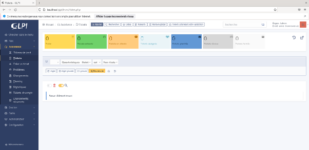

*GLPI sur la partie tickets*

**Le ticketing est-il uniquement utilisé en interne ?**

Non, le ticketing n’est pas utilisé qu’en interne, de nombreuses entreprises utilisent le ticketing dans le cadre du support client. Cela permet justement d’avoir une proximité avec les utilisateurs lorsque ces derniers rencontrent des problèmes, des dysfonctionnements ou souhaitent juste se former davantage sur la solution utilisée.

Le fonctionnement est sensiblement le même que dans une organisation, l’utilisateur rencontre un problème, il va faire une demande sur la plateforme en question et un ticket va être créé pour résoudre les dysfonctionnements rencontrés.

Dans notre cours, nous évoquons GLPI, cependant, il en existe bien d’autres, par exemple la solution OsTicket.

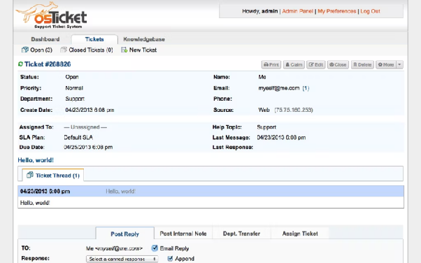

*Aperçu de osTicket en mode Dashboard*

**GLPI- Comment cela fonctionne:**

**Qu’allons-nous utiliser dans GLPI:**

Avant de commencer cette partie, il est important de cadrer la manière dont nous allons utiliser GLPI. Dans un premier temps, il faut comprendre qu’il y a un nombre conséquent de gestionnaires de tickets. Mais GLPI étant gratuit et extrêmement performant. Il est pertinent de vous le présenter pour que le jour où vous entrerez dans le monde du travail, vous puissiez proposer cette solution afin de gérer l’assistance informatique. Plus encore, vous serez en mesure de l’utiliser et d’être très rapidement opérationnel.

GLPI est un logiciel extrêmement complet.

Vous pouvez gérer différentes choses telles que :

* Les ordinateurs  
* Les moniteurs  
* Les logiciels installés  
* Le matériel réseau  
* Les périphériques  
* Les imprimantes  
* Les cartouches  
* Les consommables  
* Les téléphones  
* Les baies réseau  
* Les différents racks  
* Les licences des logiciels  
* Les budgets alloués  
* Les fournisseurs  
* Les contacts  
* Les contrats  
* Les différents documents  
* Les lignes mobiles  
* Les certificats  
* Les centres de données

Il contient une collection d’outils tels que :

* Une base de connaissances  
* Un flux RSS  
* Des réservations, des rapports, etc.

L’administration de la plateforme contenant :

* Les utilisateurs  
* Les groupes  
* Les entités  
* Les règles  
* Les dictionnaires  
* Les profils  
* Les files d’attente des notifications  
* La maintenance de la plateforme  
* Les journaux d’événements  
* Une interface de configuration

Dans ce cours, nous évoquerons toute la partie **Assistance** conformément au référentiel ITIL.

**Assistance dans GLPI:**

(vidéo) Utilisateur GLPI

Nous allons voir comment créer un utilisateur sur GLPI et comment cet utilisateur pourra lui par la suite créer des tickets. On va d’abbord se connecter en tant qu’administrateur avec les identifiants par défaut glpi, glpi on va ensuite se rendre dans la section administration, utilisateurs. Ici on va pouvoir ajouter un utilisateur à qui on va donner un identifiant pour se connecter et à qui on peut remplir tout un tas d’informations, puis un mot de passe qu’il pourra changer par la suite et pour arriver à son profil, on va pouvoir lui choisir un profil, nous ce qu’on veut c’est un utilisateur simple qui a juste le droit de faire des tickets donc on choisit “self-service”, on fait ajouter. On peut aller vérifier que cet utilisateur a bien été créer, quand c’est fait on se déconnecte, puis on se connecte avec son identifiant et son mot de passe comme ferai l’utilisateur et on arrive donc sur la page propre aux utilisateurs basiques sur laquelle ils n’ont que la création d’un ticket, la vision sur les tickets qu’ils ont fait. Dans créer un ticket ils vont pouvoir choisir le type de ticket est-ce que c’est un incident ou une demande, ils peuvent définir la catégorie si il y en a, si on l’a configuré avec plusieurs typoes de catégorie, l’urgence de leur demande ou de leur incident, les observateurs si ils veulent mettre en copie quelqu’un l’administrateur par exemple, un titre pour leur ticket et un description du problème une fois que c’est rentré, ils peuvent soumettre la demande (ils peuvent aussi ajouter un fichier, une image par exemlpe si ils ont un problème un screenshot au  cas ou. Ils peuvent vérifier l’avancement de leur ticket dans “tickets”.

Partez du principe où votre GLPI est configuré. Vous bénéficiez de nombreux utilisateurs conformément au nombre de collaborateurs dans la société.

Si 100 collaborateurs \= 100 comptes GLPI, etc.

Différentes entités ont également été mises en place :

* Entité commerciale  
* Entité technique  
* Entité Recherche et Développement  
* Helpdesk  
* Direction

Les utilisateurs ont un identifiant unique respectant cette nomenclature :

Première lettre du prénom en majuscule suivie du nom de famille en minuscule.

### ***Exemple***

Pour John Doe, son identifiant est Jdoe.

Pour le mot de passe, la nomenclature d’origine est la suivante : 123456Nomdefamille.

### ***Exemple***

Pour John Doe, son mot de passe attribué est : 123456Doe.

Note : Pour suivre de bonnes pratiques, il faut normalement utiliser des mots de passe complexes. Nous les simplifions ici pour des raisons d’apprentissage et de facilité.

Les droits pour chaque entité sont uniques, permettant la création et le suivi des tickets. Tandis que l’équipe technique possède toute la gestion du GLPI et le helpdesk possède juste le suivi et la résolution des tickets.

### ***Rappel***

Un technicien helpdesk est un professionnel chargé de fournir un support technique et une assistance aux utilisateurs finaux pour résoudre des problèmes informatiques et répondre aux demandes de service.

Voici les interfaces en fonction des entités :

*Interface de connexion*

**

*Interface globale Super Utilisateur – Cette interface vous permet d’avoir le contrôle total sur la plateforme.*

*![][image5]*

*Interface d’un helpdesk*

Sur cette interface se trouvent tous les accès vers les différents tickets, pour le traitement, la consultation et la résolution. Vous trouverez également un visuel sur les utilisateurs pour changer différentes informations comme les changements de mots de passe, etc.

Vous pouvez également configurer des tickets différents.

![][image6]

*Interface de John Doe, commercial dans la société*

Son interface lui permet simplement de voir ses tickets et d’en créer. Ce sont les seuls et uniques usages que les collaborateurs « *lambda* » de la société peuvent utiliser sur GLPI.

(vidéo) Technicien GLPI

Nous allons nmaintenant utiliser le compte d’un technicien, pour voir comment lui peut voir les tickets et y répondre mais tout d’abbord nous allons créer son compte technicien avec les identifiants glpi glpi d’administration on va retourner sur le panel administrateur, dans administration puis utilisateurs on va cette fois ci ajouter un utilisateur mais en tant que “technicien”, ensuite on va lui mettre un identifiant ainsi qu’un mot de passe et l’ajouter. On va vérifier qu’il soit présent puis on va se déconnecter et se connecter comme notre technicien pourrait le faire. On a une interface un peu différente, déjà, de l’interface utilisateur et aussi de l’interface administrateur, on a accès à moins de données et ce qui va nous intéresser là c’est d’aller vérifier la partie assistance tickets. On voit dessuite le ticket qui a été envoyé précédemment par notre utilisateur avec son titre, son statut, si il est nouveau ou si il a déjà été traité par quelqu’un, si il est en attente etc, les dernières modifications la date d’ouverture et la priorité qui est une donnée importante qui là est basse, si on avait plusieurstickets avec des priorités haute très haute, on pourrait trier ce qui est dans l’urgence. Nous on en a qu’un donc on va consulter ce ticket, on voit qui l’a créé, le titre et la description (contenu) de ce ticket. Là c’est une demande de clé USB on va pouvoir avoir plusieurs actions nous ce qui nous intéresse c’est d’y répondre pour une demande simple comme ça on clique sur “réponse” et on écrit la réponse et on peut envoyer un fichier, on peut sélectionner de quelle façon envoyer la réponse (e-mail, téléphone, glpi…) quand c’est fait on peut sauvegarder en cliquant sur “ajouter” ça va envoyer la réponse mais on va pouvoir aussi au passage modifier l’urgence si on estime qu’elle été pas bien notifiée et modifier le statut du ticket comme résolu si quelqu’un doit passer derrière pour vérifier, il verra que le ticket est bien clos. On peut aller vérifier ensuite que dans la section ticket on a plus rien car on affiche les tickets non résolus mais si on va vérifier dans tous on voit que le ticket existe bien et qu’il est clos. C’est dans ce panel qu’on voit l’avancée des tickets.

Comme vous pouvez le constater sur les captures précédentes, vous pouvez très simplement moduler tous les droits et usages de GLPI en fonction des utilisateurs (comme vu dans la vidéo associée).

### ***Fondamental***

Comme expliqué précédemment, nous nous basons sur les principes du référentiel ITIL. D’après ce référentiel, un incident est défini par tout événement étranger au bon fonctionnement d’un service qui entraîne ou qui pourrait entraîner une interruption ou une défaillance de la production du service.

### **Types de pannes pouvant donner lieu à un ticket**

Vous pouvez avoir un nombre incalculable de pannes pouvant donner lieu à un ticket :

* Pannes informatiques  
* Pannes système  
* Système d’exploitation bugué  
* Virus  
* Défaillance système  
* Soucis d’activation d’un logiciel payant  
* Pannes matérielles  
* Casse  
* Oxydation  
* Panne inexpliquée  
* Pannes réseau  
* Wi-fi en panne  
* Routeur HS  
* Suspicion d’incendie  
* Mot de passe introuvable  
* Demandes diverses  
* Demande de matériel  
* Demande d’un nouvel ordinateur  
* Demande un nouveau téléphone  
* Demande d’information  
* Demande documentaire  
* Demande de conseil  
* Demande d’assistance spécifique

Chaque panne va être ensuite catégorisée et aura une gravité associée, il est beaucoup moins important de traiter une demande de nouvel ordinateur qu’un incendie suspect dans la salle des serveurs. En fonction du cas, il vous sera pleinement possible de modifier le niveau d’urgence si cela est réellement nécessaire.

### **Principe de gestion automatisée des tickets**

Bien que les tickets arrivent au fil de l’eau, le système les traite à partir de plusieurs variables.

La première variable se situe sur l’utilisateur, si le PDG de la société fait une demande, elle sera naturellement traitée plus rapidement que celle de quelqu’un d’autre.

Ensuite, la sévérité et la criticité du problème seront une grosse variable, le logiciel va déterminer automatiquement en fonction des informations fournies quel est le ticket le plus problématique.

Le troisième et dernier, mais pas des moindres, l’impact et les conséquences à prévoir, en fonction de l’impact qu’aura votre problématique, l’ITSM mettra en avant ou non votre ticket.

**Workflow d’un ticket:**

Maintenant que vous savez comment se matérialise une interface de gestion de ticket, que vous connaissez sa modularité, il est intéressant de découvrir comment se matérialise un ticket et comment il est traité.

### **Créer un ticket**

Avant de commencer, mettez-vous dans le contexte. Vous êtes toujours dans la DSI d’une société de 5 000 personnes, vous avez déployé le GLPI depuis quelques mois. Tout est opérationnel et la demande est foncièrement basique.

#### ***Méthode***

####     **Contexte :**

Vous êtes le commercial John Doe, vous utilisez votre ordinateur portable quotidiennement, vous êtes très actif dessus, car c’est grâce à cet appareil que vous générez du chiffre d’affaires. Comme vous avez de très gros résultats et que vous êtes extrêmement rentable, la société a décidé de vous offrir un ordinateur portable dernier cri, ultra portable, ultra puissant, ultra efficace. Cependant, un matin après plusieurs semaines d’utilisation très concluantes, vous vous branchez sur votre secteur au bureau, et l’ordinateur refuse de démarrer. Vous êtes donc très embêté et vous demandez à votre collègue de vous prêter son appareil pour créer un ticket d’incident. Il faut régler rapidement votre problème, car sans votre ordinateur, vous ne pouvez absolument pas travailler.

![][image7]

Vous êtes donc sur l’interface de John Doe, et vous pouvez apercevoir de nombreuses informations que vous allez pouvoir découvrir :

**Type** : ce champ permet de déterminer sur quel type de ticket vous allez travailler, dans notre configuration, cela peut être soit un incident, soit une demande. Dans ce cas précis, il s’agit d’un incident.

**Catégorie** : dans votre configuration, ce champ permet de déterminer sur quelle catégorie d’appareil l’incident a eu lieu, vous pouvez choisir un outil informatique, un téléphone, un accessoire ou autre.

**Urgence** : élément extrêmement important du ticketing, et il est tout aussi important de sensibiliser les collaborateurs sur le niveau d’urgence des demandes. Il y a 5 niveaux d’urgences :

1. Très basse  
   Dans ce cas de figure, la demande sera traitée dans la semaine ou la semaine suivante, le souci n’est absolument pas bloquant pour l’utilisateur, vous pouvez même penser qu’il s’agit de confort plus qu’autre chose.  
2. Basse  
   Dans ce cas, la demande est traitée dans la semaine, il s’agit d’une demande sans trop d’intérêt ou une demande effectuée à l’avance pour éviter l’urgence.  
3. Moyenne  
   Vous rentrez dans les urgences un peu plus problématiques, les urgences moyennes doivent être traitées dans les 72 h, car elles peuvent être considérées comme urgences à risques pour l’utilisateur, il faut donc avoir rapidement le cœur net sur l’incident et le régler rapidement.  
4. Haute  
   L’utilisateur se retrouve dans une situation bloquante et majeure, il peut utiliser difficilement son appareil, il doit donc être dépanné dans les 24 à 48 h pour retrouver un usage optimal de son appareil.  
5. Très haute  
   Vous êtes dans une situation critique où l’utilisateur ne peut absolument plus utiliser sa machine, et doit trouver une solution dans les prochaines heures. Vous êtes donc sur un sujet prioritaire.

**Lieu** : il est important pour le helpdesk de savoir où se trouvent l’utilisateur et sa machine problématique, dans le cas où les deux se trouvent dans les mêmes locaux, la réparation peut être beaucoup plus rapide.

**Observateur** : champ qui détermine à qui le ticket sera envoyé. Généralement, vous l’envoyez au helpdesk, mais il n’est pas impossible qu’un ticket soit envoyé à une équipe d’ingénieurs pour améliorer une solution en cours de développement.

**Titre** : titre de la demande.

**Description** : zone de texte demandant d’expliquer les tâches effectuées avant l’incident tout en donnant un maximum d’informations. Il est également possible de déposer un fichier joint permettant d’appuyer la demande ou de donner des informations complémentaires sur le sujet.

Voici, pour John Doe, un screenshot de sa demande :

![][image8]

Comme vous pouvez le constater, vous êtes bien sur un incident d’ordinateur sur les bureaux de Paris de nature très urgente. Le ticket est donné au helpdesk avec une description rapide du souci de l’utilisateur. Une fois la demande envoyée, elle peut être suivie dans l’interface dans l’optique de connaître le niveau d’avancement de la problématique.

### **Suivre mon Ticket**

#### ***Méthode***

Maintenant que votre demande est faite, vous pouvez vérifier dans votre interface vos différentes demandes, cela vous permet de savoir exactement à quel niveau elle en est et surtout quelles sont les étapes restantes avant la résolution du souci.

De plus, vous pourrez communiquer avec le service associé pour poser des questions ou fournir des informations complémentaires.

![][image9]

*Interface de gestion du ticket précédemment créé*

Dans ce ticket, vous trouverez le détail de votre demande, différents historiques, les statistiques de traitement, ainsi qu’un système de messagerie permettant l’échange avec les services.

### **Prise en compte et résolution du ticket**

Maintenant que votre ticket est arrivé au service compétent, il est temps de le traiter.

![][image10]

*Aperçu de l’interface montrant un ticket de John Doe très urgent \!*

Sur l’interface du helpdesk, vous allez avoir absolument toutes les informations laissées par l’utilisateur.

Vous allez devoir traiter le problème. Dans votre cas, vous savez que toutes les données sont hébergées sur un cloud, le changement d’appareil est donc totalement transparent pour John Doe, vous allez donc lui changer la machine dans l’heure qui vient.

Maintenant que le dossier est traité, il faut le remplir pour la clôture du ticket et son archivage dans GLPI.

![][image11]

Dans l’interface ci-dessus, vous allez devoir remplir les temps de prise en charge ainsi que les temps de résolution, l’attribution n’est pas nécessaire, car chaque personne du helpdesk est assermentée pour traiter les différents tickets.

Vu que vous avez trouvé une solution simple et assez radicale, il est nécessaire d’en informer l’utilisateur que vous allez procéder très rapidement à un changement de machine. Vous allez donc le faire dans le traitement du ticket :

![][image12]

Vous aurez donc deux champs à remplir ainsi qu’un message en guise de description :

**Gabarit de solution** : les gabarits de solution vous permettent de faire des solutions déjà toutes faites, cela est un gain de temps dans une société telle que la vôtre.

**Type de solution** : le type de solution est important pour déterminer si vous réparez la machine, si vous la changez ou si vous fournissez de l’information pour que l’utilisateur puisse résoudre son problème tout seul.

Dans votre cas, vous allez utiliser le gabarit de solution proposé par GLPI : Swap machine. Cela signifie que vous changez la machine par l’identique ou une version similaire dans les prochaines heures :

![][image13]

*Aperçu de la réponse faite à John Doe*

Pendant ce temps-là, le statut du ticket a automatiquement avancé, en passant en « *résolu *».

![][image14]

Comme nous pouvons l’apercevoir ci-dessus, le ticket est donc résolu avec, en détail, la réponse du helpdesk.

### **Actions post-traitement du ticket**

Une fois un ticket complètement traité, la clôture de ticket permet de marquer officiellement la fin d’un incident ou d’une demande de service, indiquant ainsi que le problème a été résolu ou la demande satisfaite. Cette étape est cruciale pour le suivi des performances de l’équipe helpdesk et pour fournir des rapports d’activité.

En ce qui concerne l’archivage des tickets, cela consiste à déplacer les tickets clos vers un espace d’archivage, permettant ainsi de maintenir une base de données propre et bien organisée. Cela aide également à conserver un historique des interventions passées pour référence future.

La base de connaissances dans GLPI est un réservoir précieux d’informations techniques et de solutions éprouvées. Elle regroupe une collection de tutoriels, de guides de dépannage, et d’autres documents utiles créés en réponse aux incidents courants ou aux demandes fréquentes. Les agents helpdesk peuvent ainsi consulter cette base de connaissances lorsqu’ils sont confrontés à des problèmes similaires, ce qui leur permet de gagner du temps en accédant à des solutions éprouvées. C’est un moyen efficace de transférer les connaissances entre les membres de l’équipe, garantissant une meilleure collaboration et une augmentation globale de la productivité du service d’assistance.

Dans le cas de GLPI, il est important de modifier les informations de compte en fonction des résolutions faites, par exemple, suite au changement d’appareil, il est important de redéfinir le numéro de série du nouvel appareil et l’associer à son utilisateur.

Pour toutes les différentes gestions de tickets, il est nécessaire de mettre à jour ses bases pour ne pas avoir d’informations erronées.

**Essentiel:**

Le ticketing est un système informatisé permettant de traiter les demandes de support dans de nombreux domaines. Dans l’univers de l’informatique, le ticketing est un outil d’assistance très puissant et se base sur un référentiel nommé ITIL, une bibliothèque contenant toutes les informations sur l’infrastructure des technologies de l’information. Les cinq volumes de l’ITIL permettent de gérer son service informatique de manière optimale.

Le ticketing permet de favoriser la communication entre les utilisateurs et les techniciens, d’obtenir des métriques sur la qualité du service et de trouver des solutions viables dans le temps. Il est possible de mettre en place un système de ticketing à moindre coût, comme GLPI, un logiciel de ticketing open source et gratuit. Nous avons abordé ici comment choisir le bon logiciel de ticketing et mis en place des situations pour comprendre l’importance du ticketing dans une entreprise.

**L’installation de GLPI sous VM Windows:**

### ***Contexte***

Dans une VM sous Windows 10, nous allons installer l'outil de suivi GLPI. C'est un outil de ticketing utilisé par la plupart des plateformes de suivi des incidents. GLPI, pour Gestionnaire Libre de Parc Informatique, est un logiciel libre de gestion des services informatiques (ITSM : Information Technology Service Management) et de gestion des services d'assistance (Issue Tracking System et ServiceDesk). C'est une application web qui aide les entreprises à gérer leur SI.

Parmi ses caractéristiques, cette solution est capable de construire un inventaire de toutes les ressources de la société et de réaliser la gestion des tâches administratives et financières. Ses fonctionnalités aident les administrateurs IT à créer une base de données regroupant des ressources techniques et de gestion, ainsi qu'un historique des actions de maintenance. La fonctionnalité de gestion d'assistance ou helpdesk fournit aux utilisateurs un service leur permettant de signaler des incidents ou de créer des demandes basées sur un actif ou non, ceci par la création d'un ticket d'assistance.

**Configurer l’environnement: VM et WAMP:**

Dans ce cours, nous allons télécharger les logiciels suivants :

* GLPI version 10.0.5 à l’aide des liens :  
  * [GLPI Project](https://glpi-project.org/),  
  * [GLPI Project](https://github.com/glpi-project/glpi/releases/download/10.0.6/glpi-10.0.6.tgz),  
* WAMPserver via [WAMPSERVER](https://www.wampserver.com/),  
* 7zip pour Windows via [7-zip](https://www.7-zip.org/download.html),  
* Au préalable, vous vous servirez à nouveau d’une VM Windows 10\. Si une réinstallation est nécessaire, téléchargez Virtualbox via [VirtualBox](https://www.virtualbox.org/),  
* Lien image Windows 10 via [Microsoft](https://www.microsoft.com/fr-fr/software-download/windows10)

(vidéo) Récupérer l’image de Windows 10

pour faire l’installation de windows 10 sur une VM il va vous falloir un fichier ISO mais qui est difficilement récupérable sur le site de microsoft donc on va voir une petite manipulation pour l’obtenir facilement donc on se rend sur le moteur de recherche et on cherche l’iso de windows 10, on prend le lien de microsoft par sécurité et ici on voit un problème c’est que l’iso n’est pas disponible donc on va avoir une manipulation pour passer ce problème. Une fis sur cette page on appuie sur F12, on rentre en mode développement, et on s’intéresse au bouton en haut àgauche du panel développement “toggle device tool bar” qui va avoir pour effet de faire passer ce site web qui est prévu pour un ordinateur de le faire passer en mode tablette téléphone. Donc on clique dessus et le mode tactile s’ouvre, une fois qu’on a cliqué sur l’icone, on recharge la page avec F5 et donc maintenant on est sur une version tactile qui elle nous propose bien l’ISO, on agrandi un petit peu (en haut dans dimensions), donc on peut glisser comme avec un doit sur un téléphone et on sélectionne l’édition Windows 10 ISO, on confirme puis on doit choisir la langue et confirmer, enfin on télécharge la version qui nous intéresse (le plus souvent 64 bits). On récupère l’image ISO qui va nous servir à créer une VM.

Pour pouvoir tester GLPI localement sur son ordinateur, il est nécessaire d'avoir un environnement web complet avec un serveur Apache, un interpréteur PHP et une base de données MySQL ou MariaDB. C'est là qu'intervient WampServer.

En installant WampServer sur votre ordinateur, vous pouvez rapidement mettre en place un environnement de développement web complet pour tester GLPI. Une fois installé, WampServer fournit tout le nécessaire intégré dans un seul package facile à utiliser.

Cela permet d'éviter les coûts et les tracas liés à la configuration d'un serveur web en ligne pour tester GLPI.

(vidéo) Installation de WampServer

Nous allons voir l’installation de GLPI sous un environnement Windows. On aura besoin d’un environnement windows en vm ou en dur ensuite, on aura besoin d’une plateforme de développement Web afin d’afficher le serveur GLPI une fois qu’il sera installé pour ça on se rend sur la page wampserver.com une fois dessus on va dans téléchargement, on sélectionne la version qui nous intéresse (souvent 64 bits) sur windows ensuite on peut gagner du temps en passant directement au téléchargement sur le lien en haut et enfin on sélectionne la dernière version stable en haut en vert. On lance le téléchargement et on attend qu’il s’initialise, une fois qu’on a le fichier, on peut l’exécuter donc lancer l’installation (fichier en .exe), on sélectionne tous les paramètres par défaut, on accepte le contrat de license et on clique sur installer. Ici il nous propose un navigateur et un éditeur par défaut qui nous conviendra très bien on accepte, une fois l’installation finie on a des infos on me-t suivant et terminer. Ensuite on peut vérifier dans un premier temps que l’adresse local host ne retourne rien pour l’instant. On lance le logiciel qu’on vient d’installer, on a confirmation que les services ont démarrés et localhost permet maintenant d’afficher une page web. 

Nous allons maintenant passer à l’installation de WampServer. Pour ce faire, nous allons suivre les étapes suivantes :

1\. Téléchargez WampServer à l’adresse : [WAMPSERVER](https://www.wampserver.com/) puis cliquer sur l’onglet télécharger.

![][image15]

2\. Installez WampServer.

![][image16]

3\. Lancez WampServer.

![][image17]

### ***Attention***

* N'utilisez pas d'extensions / addons Wampserver précédents. Ils ne sont plus compatibles avec la nouvelle version de wampserver (VC11).  
* Vous devez avoir installé Visual Studio 2012 : VC 11 vcredist\_x64/86.exe Visual Studio 2012 VC 11 vcredist\_x64/86.exe : [Microsoft](https://www.microsoft.com/en-us/download/details.aspx?id=30679).  
* N'installez pas WampServer 2 par-dessus WAMP5. Si vous avez une version de WAMP5 installée, sauvegardez vos données, désinstallez-la, et supprimez le répertoire de WAMP5 avant d'installer WampServer 2\.  
* Tous les éléments de la stack 2.2 de WampServer ont été compilés avec le compilateur VC9 de Microsoft. Les versions antérieures étaient compilées avec la version VC6 du compilateur. Il n'est donc pas possible de mélanger des composants de la version 2.2 de WampServer avec des éléments des versions antérieures. Ces éléments sont PHP, XDebug, les extensions, et le module php-apache. Ce mélange provoque des instabilités du système.

### **Apache**

Apache est un logiciel qui permet l’affichage de pages web à la demande des utilisateurs. Quand vous visitez un site internet, vous envoyez une requête au serveur demandant l’affichage de la page ; c’est le rôle du serveur web \- Apache dans notre cas \- de traiter cette requête et d’y répondre.

### **MySQL**

MySQL est un Système de Gestion de Base de Données (SGBD), autrement dit le logiciel qui sert à stocker et manipuler des données. Les données de MySQL sont structurées en champs, tables et base de données ; c’est dans une base de données que seront enregistrées les données relatives à votre parc informatique grâce à GLPI.

### **PHP**

PHP est un langage de programmation qui permet de produire des pages dynamiques, là où les simples HTML et CSS (langages de base d’une page web) ne le peuvent pas. Pour que le serveur puisse interpréter le code écrit en PHP, il est nécessaire de lui apprendre à le parler. C’est là qu’Apache nous est utile puisqu’il intègre nativement le moteur d’exécution PHP. Sans lui, Apache ne comprendrait pas la demande de code faite en PHP et ne pourrait pas renvoyer correctement la page demandée.

### ***Complément***

###    **PhpMyAdmin**

PhpMyAdmin, qui est intégré à WampServer, est une application web open-source écrite en PHP, utilisée pour gérer des bases de données MySQL. Elle offre une interface graphique ergonomique pour gérer les bases de données, les tables, les champs et les enregistrements. Elle permet de créer, modifier et supprimer des bases de données, des tables et des champs, ainsi que d'ajouter, modifier et supprimer des enregistrements ; tout cela à l’aide de clics plutôt que de commandes dans un terminal.

L'interface de PhpMyAdmin est divisée en plusieurs sections, chacune permettant de gérer différents aspects de la base de données. Par exemple, la section « *Structure* » permet de gérer les tables et les champs, tandis que la section « *Requêtes* » permet d'exécuter des requêtes SQL directement dans l'interface.

PhpMyAdmin dispose également de nombreuses fonctionnalités avancées, telles que la possibilité d'importer et d'exporter des données, de copier des tables, de rechercher et remplacer des données dans les tables, de gérer les utilisateurs et les privilèges d'accès, de suivre les activités de la base de données, etc.

Le plus souvent, PhpMyAdmin est installé dans la même foulée que le serveur web, bien que l’on ne rajoute pas un P au sigle WAMP/LAMP/MAMP. La raison à cela est qu’il apporte un confort et une ergonomie à l’aide de son interface, mais qu’il n’est absolument pas requis. Vous pouvez manipuler toute votre base de données en commandes sur votre terminal.

Une fois que Wampserver est installé, PhpMyAdmin est accessible à l’adresse : [localhost](http://localhost/phpmyadmin) (vous pouvez remplacer localhost par l’adresse IP de la machine).

### ***Attention***

Il est possible alors que l’utilisation à distance par l’IP nécessite dans les virtualhost apache Wamp que cela doive être autorisé en changeant « *Require from local* » en « *require all granted* ».

**Téléchargement et installation de GLPI:**

### L’utilité de GLPI

GLPI peut être utilisée par les entreprises pour améliorer leur gestion des actifs informatiques, des incidents et des demandes des utilisateurs.

Prenons le cas d’une entreprise qui possède un parc informatique important avec plusieurs centaines d'ordinateurs, de serveurs, d'imprimantes et d'autres périphériques ; si la gestion de ce parc informatique est actuellement effectuée manuellement, avec des tableurs Excel et des documents papier pour suivre les actifs et les incidents alors elle peut décider de mettre en place GLPI pour améliorer sa gestion du parc informatique et du service helpdesk.

Pour ce faire, elle doit tout d'abord commencer par installer GLPI sur un serveur web, qui peut être hébergé en interne ou sur un serveur en ligne.

Ensuite, elle devra configurer les paramètres de GLPI pour s'adapter à ses besoins spécifiques et créer des comptes d'utilisateurs avec différents niveaux d'accès pour les techniciens et les utilisateurs finaux.

À la suite de quoi, elle devra configurer également les notifications par e-mail et les règles de gestion des incidents pour s'assurer que les demandes des utilisateurs sont traitées rapidement et efficacement.

Lorsqu'un utilisateur a un problème avec son ordinateur ou un autre périphérique, il peut soumettre une demande d'assistance via GLPI. La demande est alors automatiquement enregistrée dans GLPI et assignée à un technicien pour résolution. Le technicien peut suivre l'état de la demande, ajouter des commentaires et des notes, et informer l'utilisateur de l'avancement de la résolution.

Le suivi des actifs, lui, permet de suivre leur localisation, leur date d'achat, leur état et leur historique de maintenance, ce qui permet une meilleure gestion de l'inventaire informatique.

### *Méthode*

###      Installation de GLPI

Précédemment, nous avons vu comment installer WampServer. Dans cette partie du cours, nous allons désormais nous intéresser à l’installation de GLPI. Ainsi, voici les étapes à suivre pour installer GLPI :

(vidéo) Installation de GLPI

1\. Téléchargez GLPI à l’adresse :

[GLPI Project](https://github.com/glpi-project/glpi/releases/download/10.0.5/glpi-10.0.5.tgz).

2\. Téléchargez 7-zip à l’adresse : [7-zip](https://www.7-zip.org/download.html).

3\. Lancez 7zip file manager.

![][image18]

4\. Extrayez GLPI à l’aide de 7zip en réalisant un clic-droit puis sélectionnez « *Extraire ici* » sur le .tgz. Répétez ensuite la même opération sur le .tar.

![][image19]

5\. Copiez le dossier « ***glpi*** » dans le dossier « ***www*** » du dossier WampServer (C:WAMP64/WWW/ par défaut). Notez bien que tout ce que vous voulez exécuter par le serveur web doit se trouver dans le dossier « *www* ».

![][image20]

6\. Ouvrez votre navigateur et rendez-vous à l’adresse : [localhost](https://localhost/glpi) ou [ADRESSEIP](https://localhost/glpi).

![][image21]

7\. Choisissez « ***installer*** » quand cela vous est proposé.

![][image22]

8\. Choisissez « ***continuer*** » quand cela vous est proposé.

![][image23]

### ***Attention***

Wamp Server embarque toutes les extensions nécessaires, mais sur GNU/Linux ces extensions seront à ajouter manuellement car non présentes nativement.

### ***Méthode***

9\. Entrez les identifiants de la base de données :

* Server SQL : localhost.  
* Utilisateur SQL : root.  
* Mot de passe SQL : ne rien mettre, laissez vide.

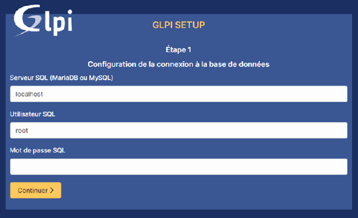

10\. Créez une nouvelle base de données (par exemple : glpidb) puis validez et attendez son initialisation.

![][image25]

11\. Choisissez « *continuer* » pour les derniers éléments puis notez les identifiants par défaut montrés sur la dernière page de l’installation.

![][image26]

12\. Rentrez les identifiants obtenus précédemment puis validez. Vous serez renvoyé sur la page d’accueil de GLPI avec le compte que vous avez choisi.

![][image27]

![][image28]

### ***Complément*****Version LTS et Stables**

Lors du téléchargement de certains logiciels, vous serez peut-être amené à devoir choisir entre des versions dites « *LTS* » et/ou « *Stables* ».

**Une version de logiciel LTS** signifie Long Term Support (Support à Long Terme en français). Il s'agit d'une version d'un logiciel qui est maintenue et mise à jour pendant une période prolongée (généralement de 3 à 5 ans). En effet, la version LTS est conçue pour être stable et fiable. Elle est destinée aux utilisateurs qui préfèrent la sécurité et la stabilité à la dernière version contenant de nouvelles fonctionnalités. Cependant, GLPI ne dispose pas de version LTS, mais Windows 10 oui.

D'autre part, les mises à jour de sécurité et les correctifs de bugs sont publiés régulièrement pour les versions LTS pour garantir la sécurité et la stabilité du logiciel. Ainsi, les utilisateurs peuvent donc utiliser la version LTS sans se soucier des problèmes de sécurité ou de bugs pendant la période de support.

C’est pourquoi les entreprises et les organisations qui utilisent des applications critiques optent souvent pour les versions LTS pour éviter les risques liés à l'utilisation de versions plus récentes qui peuvent comporter des bugs ou des problèmes de compatibilité. En outre, les versions LTS sont également utiles pour les utilisateurs qui ne veulent pas effectuer de mises à jour fréquentes de leur logiciel.

**Une version stable** d'un logiciel est une version qui a été testée et considérée comme fiable pour une utilisation générale. Elle a été développée pour offrir une expérience utilisateur fiable et satisfaisante sans erreurs ou bugs graves. Les versions stables sont généralement mises à disposition des utilisateurs après un certain nombre de tests, de corrections et de mises à jour. Ainsi, GLPI 10.0.5 est, par exemple, une version stable du logiciel, qui a passé une phase de tests rigoureux avant d’être proposée dans la branche « *stable* » au téléchargement.

Cependant, même une version stable peut avoir des bugs et des erreurs, mais ces problèmes sont généralement mineurs et peuvent être résolus rapidement par les développeurs. Ces derniers continuent généralement de publier des mises à jour pour améliorer les fonctionnalités et la performance, mais ces mises à jour sont plus petites et moins fréquentes que pour les versions en développement. De ce fait, une version stable peut être considérée comme la version la plus fiable et la plus sûre d'un logiciel, ce qui la destine généralement aux entreprises et aux utilisateurs finaux qui recherchent une expérience de qualité sans problème de sécurité ou de performances.

**Essentiel:**

Nous avons procédé à l’installation de GLPI sur une VM Windows 10 à l’aide de WAMP, qui permet de créer un serveur web fonctionnel à l’aide d’Apache, de MariaDB ou MySQL et du langage PHP sur Windows. Vous avez découvert l’utilité de GLPI qui permet à l'entreprise de suivre l'état du parc, son obsolescence et son renouvellement.

Le logiciel permet de garder une vision en temps réel du suivi des logiciels et de leurs licences. Il est également possible de visualiser l'état du parc en temps réel avec l'inventaire automatisé multi-plateformes intégré. Il permet de détecter les logiciels à mettre à jour ou les matériels à renouveler. Son installation, comme vous l’avez vu, est très simple et son format de licence libre en font un atout de taille pour les entreprises.

**L’ouverture et clôture d’un ticket:**

### ***Contexte***

Vous avez peut-être déjà installé GLPI et réalisé des opérations de gestion d'un parc informatique, notamment grâce à l'agent **FusionInventory.** L'autre force de GLPI est sa fonction de gestion du ticketing et sa cohésion avec la méthode ITIL V2.

Lorsqu'une entreprise veut assurer le suivi des incidents et des problèmes concernant son fonctionnement, elle se doit de tenir à jour un système de ticketing. GLPI, avec ses nombreux plugins, va permettre, par exemple, à un Service Informatique de recevoir ou de générer des tickets pour chaque incident ou problème rencontré. Ces tickets pourront être ouverts sur initiative par un technicien qui a constaté un dysfonctionnement. Ce technicien pourra aussi créer un ticket suite à une demande par mail, SMS, ou par téléphone, ou bien de façon orale lors d'une discussion. Mais un utilisateur pourra également ouvrir un ticket via son interface ou bien par mail au service. Une fois le ticket ouvert, il entame un cycle de vie. Il aura donc un suivi jusqu'à sa clôture et pourra alimenter une base de connaissances et une FAQ, afin d'aider à la résolution d'incidents similaires.

### **Ticket ouvert par le technicien:**

### **Création**

Si vous voulez réaliser ces étapes sur votre GLPI, vous devrez avoir plusieurs profils enregistrés dans diverses catégories (Super Admin, Tech, Self-Service) car chacune a son degré d'interaction sur le serveur et chacune a une interface adaptée. À l'aide du profil « *Super Admin* », vous pourrez créer des utilisateurs, des services dans l'entreprise, des catégories d'incidents, des types de solutions, etc. Tout ce qui apparaîtra dans les menus déroulants et qui rend l'exercice plus réaliste. Avec les Tech, vous agirez et les Self-Service seront les employés de l'entreprise.

#### ***Méthode***

Nous allons imaginer que vous êtes un technicien qui se connecte à son poste de travail pour commencer sa journée. Vous allez rencontrer plusieurs situations que nous allons essayer de décortiquer au mieux, afin de comprendre le processus.

**Étape 1 :**

Connectez-vous avec votre compte « ***Technicien*** ».

Renseignez vos identifiants et cliquez sur le bouton « ***Envoyer*** ».

![][image29]

**Étape 2 :**

Voici une vue de l'accueil de votre poste de travail. Pour l'instant il n'y a rien de spécial.

![][image30]

**Étape 3 :**

Il est possible de voir plus d'informations en cliquant sur l'onglet « ***Vue globale*** ».

Vous avez ici un listing complet des tickets et autres problèmes.

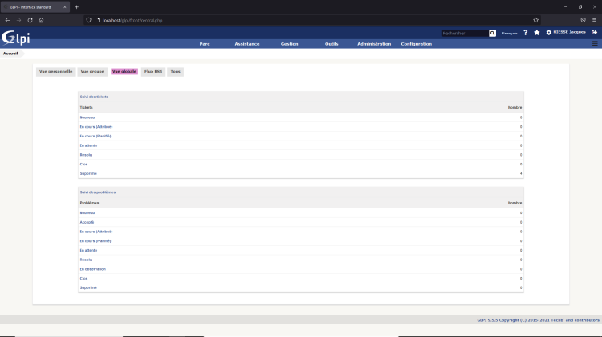

**Étape 4 :**

Vous venez de décrocher le téléphone et de répondre à un appel du service Logistique. Le responsable vous énonce les symptômes de la panne qu'il rencontre et vous allez ouvrir un ticket pour le suivi.

Dans la barre des menus, passez la souris sur « ***Assistance*** » et dans le menu déroulant, choisissez « ***Créer un ticket*** ».

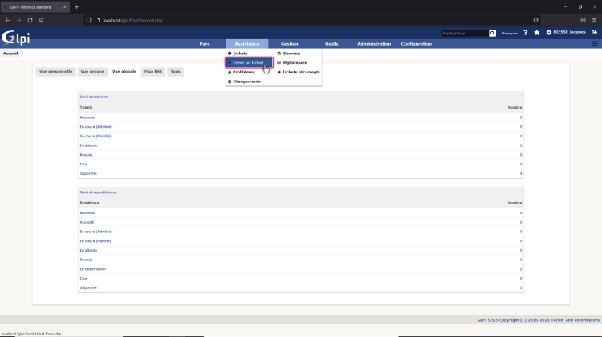

**Étape 5 :**

Voici la page de création d'un nouveau ticket. Il faut commencer par saisir une date et une heure de création.

Cliquez sur le bouton en forme de calendrier à droite de la fenêtre « ***Date d'ouverture*** ».

![][image33]

**Étape 6 :**

Le calendrier s'ouvre, cliquez sur la date du jour.

![][image34]

**Étape 7 :**

Une horloge apparaît sous la date. Laissez l'heure par défaut qui devrait être l'heure actuelle. Pour valider, cliquez sur une zone libre de l'écran.

*(Nota : notre labo n'est pas forcément synchronisé avec l'heure réelle, ne pas tenir compte des horaires affichés).*

*![][image35]*

**Étape 8 :**

Nous voyons, en orange, les champs déjà remplis par le système. Il s'agit de l'horodatage que nous avons renseigné, et de votre nom dans les cases « ***Demandeur*** » et « ***Attribué à*** ». Le ticket vous est en effet attribué car vous le saisissez vous-même et vous en êtes le demandeur car vous avez répondu au téléphone et la page actuelle est sur votre session. Vous avez la possibilité de modifier les champs mais ce n'est pas nécessaire.

En violet, nous pouvons entrer des renseignements afin de donner un maximum d'éléments de compréhension. Vous pourrez ainsi attribuer ce ticket à une catégorie, lui donner un titre et rédiger un texte qui explique l'objet de sa création, comme lui attribuer un lieu qui pourra servir à localiser la source en cas de besoin d'intervention.

Au niveau du **statut,** vous choisirez « ***En cours (Attribué)*** ». Ceci pour qu'il n'apparaisse pas comme un ticket vacant.

Au niveau de **l'urgence,** vous choisirez « ***Moyenne*** » car un problème d'impression n'est pas d'une importance capitale pour le bon déroulement de ce service.

Au niveau de l'**impact,** vous choisirez « ***Moyen*** » car cette imprimante n'est utilisée que par quelques personnes.

![][image36]

#### ***Complément***

Ces considérations d'urgence et d'impact sont à prendre en compte en fonction des choix de la Direction. Elle définit les personnes ou services importants et vous devez affiner ces estimations en fonction du service touché et de la dégradation qui en découle.

Par exemple, le service paie, si c'est la fin du mois ou le standard du bureau d'accueil si c'est l'heure d'ouverture. Le Directeur ne fait pas forcément partie d'une urgence s'il ne s'agit que d'un fond d'écran à changer alors que, pendant ce temps, la panne du serveur d'impression de l'atelier d'imprimerie bloque toute la chaîne de production.

#### ***Méthode***

**Étape 9 :**

Une fois tous les renseignements remplis, vous pouvez cliquer sur le bouton « ***Ajouter*** ».

![][image37]

**Étape 10 :**

Pour revenir à votre tableau de bord, cliquez sur le logo **GLPI** en haut à gauche de la page. Vous pouvez voir que le ticket a bien été pris en compte grâce à une petite fenêtre pop-up qui s'affiche en bas à droite.

![][image38]

**Étape 11 :**

Vous voyez sur le tableau une nouvelle entrée. Un ticket est signalé « ***En cours (attribué)*** ».

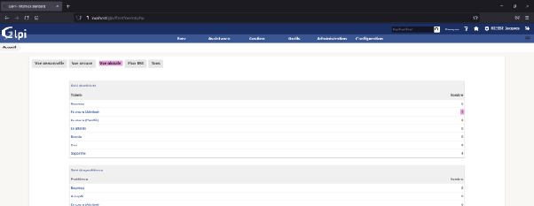

**Étape 12 :**

En cliquant sur l'onglet « ***Vue personnelle*** » vous avez un aperçu du ticket en question. Il apparaît une fois comme « ***en cours*** » car il est toujours actif et une autre fois comme « ***à traiter*** » car aucune action n'a encore été entreprise. En passant la souris sur le « ***i*** » près de votre nom, vous voyez les renseignements vous concernant.

**Étape 13 :**

La description correspond au titre que vous avez saisi lors de la création du ticket. En passant la souris dessus, vous avez accès au texte saisi en guise d'explication. Cliquez dessus pour l'ouvrir.

**Étape 14 :**

Nous faisons ici une pause pour savoir ce qui se passe dans le bureau du DSI.

Celui-ci a également commencé sa journée de travail et sur son tableau de bord, il a accès à des informations. Il voit notamment qu'un ticket est signalé. Il décide de cliquer dessus pour en savoir plus.

![][image42]

**Étape 15 :**

Il a, sur cette page, une vue assez précise des événements.

Sur les gros rectangles en haut, 1 ticket est ouvert et il est assigné.

Dessous, il connaît l'intitulé de ce ticket, la date et l'heure, le nom du technicien et de la personne qui a demandé l'ouverture.

Il sait également à quelle catégorie est attribué cet incident et aussi quel est son degré de criticité sur le bon déroulement du service.

Au niveau du statut, le ticket « ***En cours*** » affiche un rond vide vert.

![][image43]

### **Suivi et résolution**

#### ***Méthode***

**Étape 1 :**

Revenons sur votre poste de travail, vous voyez sur la page du ticket ouvert qu'il a le même code couleur. Dans la liste de gauche, cliquez sur « ***Traitement du ticket*** » pour passer à l'action.

![][image44]

**Étape 2 :**

Vous pouvez suivre d'ici le processus jusqu'à la fin. La première mention est en vert et elle reprend le texte explicatif que vous avez saisi à l'ouverture. Le responsable a dû raccrocher subitement lors de son appel à vos services, vous l'avez rappelé pour en savoir plus et ceci va faire l'objet d'une entrée supplémentaire dans le fil. Cliquez sur le bouton « ***Suivi*** ».

![][image45]

**Étape 3 :**

Entrez les informations complémentaires (les renseignements que vous avez pu récolter par exemple). Indiquez la décision que vous avez prise ensemble (la prise en main à distance de l'imprimante) et cliquez sur le bouton « ***Ajouter*** ».

![][image46]

**Étape 4 :**

Votre bulletin de suivi a été ajouté dans le fil. Vous vous connectez donc à distance à l'imprimante en question et vous réalisez les opérations de maintenance. Vous pouvez maintenant ajouter cette information importante dans le fil, car vous venez d'apporter la solution à cet incident.

Cliquez sur le bouton « ***Solution*** ».

![][image47]

**Étape 5 :**

Choisissez, dans les listes, un gabarit et un type de solution.

Ici, on trouve « ***Prise en main à distance*** » et « ***Alignement têtes d'impression*** ». Ces informations sont créées par la Direction. Elles peuvent être d'un autre libellé.

Par exemple, « ***Solution définitive*** » ou « ***Solution provisoire*** » s'il s'agit de résoudre rapidement l'incident, pour éviter que le service ne subisse trop longtemps les désagréments, en attendant d'apporter une solution durable.

Vous pouvez choisir d'enregistrer cette partie dans la base de connaissances. Lors d'un futur incident de ce type, il sera alors possible de se servir de cette expérience pour s'en inspirer. Rédigez un texte expliquant la façon dont vous êtes arrivé à solutionner cet événement et cliquez sur le bouton « ***Ajouter*** ».

**Étape 6 :**

La solution du ticket est prête à être intégrée à la base de connaissances. Choisissez une catégorie à laquelle la rattacher. Vous pouvez choisir de la faire apparaître dans la FAQ publique. Cette solution étant plutôt interne au service, elle n'y aurait pas de pertinence. Laissez le « ***Non*** » par défaut et cliquez sur le bouton « ***Ajouter*** ».

![][image49]

**Étape 7 :**

Voici un résumé de l'opération et une petite fenêtre pop-up qui signale l'enregistrement.

![][image50]

**Étape 8 :**

Nous revenons au suivi des étapes, notre fameux fil.

En haut, nous voyons que le rond vide vert est devenu noir, ce qui signifie qu'une étape a été franchie dans son état. Un cadre bleu reprend la solution que vous avez décrite. Chaque action a un code couleur. Elles reprennent les couleurs des boutons d'action dans le processus (Suivi, tâche, solution, validation, etc.).

Une solution ayant été apportée, nous nous trouvons automatiquement devant une demande de validation. Cette étape clôturera le ticket. Comme vous avez fait les tests de bon fonctionnement avec le responsable du service Logistique et qu'il est satisfait, vous lui avez demandé son accord pour clôturer le ticket.

![][image51]

**Étape 9 :**

Nous faisons une nouvelle pause afin de revenir dans le bureau du Directeur.

À son écran, il voit maintenant que le ticket est passé de l'état « ***assigné*** » à l'état « ***résolu*** ». Dans le tableau de dessous, on voit la modification avec le rond vide noir à la place du rond vide vert.

![][image52]

**Étape 10 :**

Revenons dans votre espace de travail.

Vous n'avez plus qu'à entrer un petit texte d'explication pour indiquer que la personne qui a demandé l'ouverture du ticket donne son accord pour le clore. En effet, même si c'est vous qui l'avez ouvert, c'était sur sa demande. C'est donc à lui de valider.

Cliquez sur le bouton « ***Approuver la solution*** ».

![][image53]

**Étape 11 :**

Le petit rond vide noir s'est rempli : une étape supplémentaire a donc encore été franchie. Votre validation apparaît dans le fil.

Vous pouvez cliquer sur « ***Ticket*** », dans la liste de gauche, pour avoir des informations complémentaires.

![][image54]

**Étape 12 :**

Nous voyons notamment ici que le ticket est clos. Il peut cependant être rouvert en cas de besoin. Vous pouvez cliquer sur le logo GLPI en haut à gauche de la page.

![][image55]

**Étape 13 :**

Vous voici revenu à votre page d'accueil. Il n'y a plus de travail pour l'instant.

![][image56]

**Ticket ouvert par l’utilisateur:**

**Création**

Nous venons de voir comment un coup de fil peut aider à résoudre un dysfonctionnement et la façon dont les étapes ont été suivies. Nous avons évoqué le fait qu'un ticket n'était pas forcément ouvert par un technicien. En effet, un employé de l'entreprise par exemple, peut, depuis son interface personnelle, créer un ticket lorsqu'il rencontre un incident. Voyons ce qui se passe au service Comptabilité.

#### ***Méthode***

**Étape 1 :**

Nous voici sur le poste de travail de Mme Sophie TELLE, employée au Service Comptabilité. Comme nous pouvons le constater, son interface GLPI est des plus réduites. Ceci est dû à son profil Self-Service. Elle dispose tout de même du minimum en la matière. Elle peut ouvrir un ticket. Cela est pratique pour elle, car elle est bloquée dans son travail et va donc faire appel à vos compétences.

Pour ce faire, elle va cliquer sur le bouton « ***Créer un ticket*** ».

![][image57]

**Étape 2 :**

Elle a tout d'abord le choix entre signaler un incident (elle rencontre un dysfonctionnement qui l'empêche de travailler) ou faire une demande (elle voudrait savoir si elle peut récupérer l'imprimante qu'elle a vu dans la poubelle du rez-de-chaussée). Elle sélectionnera ensuite une catégorie, estimera l'urgence, indiquera le lieu et indiquera un titre à son ticket avant de rédiger un texte qui expliquera les détails.

Elle clique enfin sur le bouton « ***Soumettre la demande*** ».

![][image58]

**Étape 3 :**

La coche verte en haut de la page et la petite fenêtre pop-up en bas à droite confirment la bonne saisie de l'information.

**Étape 4 :**

Vous êtes connecté à votre interface et votre tableau est ouvert à l'onglet « ***Vue globale*** ». Vous constatez qu'un nouveau ticket est apparu. Pour l'instant il n'a pas encore de qualification.

Cliquez sur « ***Nouveau*** ».

![][image60]

**Étape 5 :**

Vous accédez au tableau qui recense les tickets. Vous voyez son titre, un rond vert rempli (« ***Nouveau*** »), l'horodatage de la dernière modification et de l'ouverture de ce ticket, puis la priorité estimée suivie du nom de l'utilisateur qui l'a créé et enfin la catégorie dans laquelle l'incident a été placé. En passant la souris sur le petit « ***i*** » à droite du nom de l'utilisateur, vous pouvez voir ces renseignements.

![][image61]

**Étape 6 :**

De même, en passant la souris sur le titre du ticket, vous avez une vue du texte explicatif qui a été rédigé par l'utilisateur.

Cliquez sur le titre pour ouvrir la fenêtre de suivi et d'actions.

![][image62]

**Étape 7 :**

Après avoir pris connaissance du message, vous décidez de lui donner une indication dans le but de l'aider à résoudre la chose.

Cliquez sur le bouton « ***Suivi*** ».

![][image63]

**Étape 8 :**

Vous rédigez votre message et cliquez sur le bouton « ***Ajouter*** ».

![][image64]

### **Auto attribution et suivi**

#### ***Méthode***

**Étape 1 :**

Votre message a été ajouté au fil de suivi. En attendant sa réponse, vous décidez de vous saisir du ticket.

Cliquez sur le petit bouton en forme de triangle au niveau du bouton « ***Actions*** » en haut à droite.

Dans le menu qui se déroule, choisissez « ***Ajouter un acteur*** ».

![][image65]

**Étape 2 :**

Une petite fenêtre s'ouvre.

Cliquez sur le petit bouton en forme de triangle et dans le menu qui se déroule, choisissez « ***Attribué à*** ».

![][image66]

**Étape 3 :**

Un nouveau choix apparaît.

Cliquez sur le nouveau petit bouton en forme de triangle et dans le menu qui se déroule, choisissez « ***Utilisateur*** ».

![][image67]

**Étape 4 :**

Un dernier choix se présente.

Cliquez à nouveau sur le petit bouton en forme de triangle.

Votre nom apparaît, cliquez dessus.

![][image68]

**Étape 5 :**

Cliquez enfin sur le bouton « ***Ajouter*** » pour vous attribuer le ticket.

![][image69]

**Étape 6 :**

Le rond vert s'est vidé, ce qui signifie que le ticket est maintenant attribué.

![][image70]

**Étape 7 :**

Faisons un passage au Service Comptabilité. Mme TELLE constate que son ticket a été attribué et qu'il n'est plus « ***Nouveau*** » mais « ***En cours*** ». Ce qui veut dire que quelqu'un s'en occupe.

Elle clique sur le lien pour prendre connaissance du suivi.

![][image71]

**Étape 8 :**

Elle constate, sur le tableau, que le ticket a bien un nouveau code couleur et elle voit le nom du technicien en charge de la résolution, le vôtre. Elle clique sur le titre du ticket pour ouvrir le fil.

![][image72]

**Étape 9 :**

Après avoir lu la question, elle décide de vous répondre.

Elle va cliquer sur le bouton « ***Suivi*** » dans les boutons d'actions en haut de la fenêtre.

![][image73]

**Étape 10 :**

Elle rédige une réponse et clique sur le bouton « ***Ajouter*** ».

![][image74]

**Résolution et clôture:**

### ***Méthode***

**Étape 1 :**

Revenons à votre poste de travail.

Vous prenez connaissance de la réponse de l'utilisatrice. Il vous faut donc passer à la résolution par vous-même. Vous prenez la main à distance sur son ordinateur et parvenez à fermer la fenêtre du logiciel en cours de plantage.

Vous décidez d'ajouter cette étape au fil de suivi en cliquant sur le bouton « ***Solution*** ».

![][image75]

**Étape 2 :**

Vous choisissez, dans les listes déroulantes, un gabarit et un type de solution. Vous choisissez ou non d'enregistrer cette solution dans la base de connaissances et vous rédigez une explication concernant votre intervention et cliquez sur le bouton « ***Ajouter*** ».

![][image76]

**Étape 3 :**

Votre texte apparaît dans le fil et vous pouvez voir que le rond vide vert est devenu noir.

Ce code couleur signifie « ***Résolu*** ». Mais si vous vous rappelez de votre précédente résolution, vous aviez une fenêtre qui vous permettait de clôturer le ticket, mais elle n'est pas présente ici. C'est simplement parce que ce dernier mot revient à la personne qui a ouvert le ticket.

![][image77]

**Étape 4 :**

Faisons un retour au Service Comptabilité. Mme TELLE, qui était au téléphone avec vous lors de la prise en main et de la résolution de l'incident, ouvre le fil de suivi de son ticket et voit apparaître la fenêtre de validation. Elle y rédige un mot de remerciement pour confirmer et clique sur le bouton « ***Approuver la solution*** ».

![][image78]

**Étape 5 :**

Son message s'ajoute au fil et le rond vide noir s'est rempli. Le ticket est donc considéré comme clos.

Elle clique sur le logo de GLPI en haut à gauche de l'écran pour revenir à son tableau de bord.

![][image79]

**Étape 6 :**

On peut constater dans le tableau de synthèse que le ticket de Mme TELLE est clos.

![][image80]

**Les manipulations GLPI pour l’inventaire:**

### ***Contexte***

Le logiciel GLPI permet d'assurer toutes les fonctions liées au « *ticketing* » des entreprises, mais il intègre aussi un puissant module de gestion de parc. Il est possible, avec lui, de répertorier tout le matériel, les logiciels et les consommables d'une entreprise, de stocker des notices et des factures, de planifier un amortissement de matériel, d'établir des fiches liées aux contrats comme aux fournisseurs, de gérer les licences des logiciels installés, etc.

La manipulation de l'inventaire sous GLPI présente de nombreux avantages pour les entreprises cherchant à optimiser leur gestion des actifs informatiques. Voici les principaux intérêts de cette manipulation :

* **Visibilité complète** : permettre de disposer d'une vue d'ensemble complète de tous les équipements informatiques de l'entreprise. Cela inclut les ordinateurs, les serveurs, les imprimantes, les logiciels, les licences, etc. Avoir une vision globale de l'inventaire permet de mieux planifier les ressources et les investissements.  
* **Suivi précis** : suivre l'historique des équipements, de la date d'achat à la date de mise au rebut. Cela facilite la gestion des cycles de vie des actifs et permet de prendre des décisions éclairées quant à leur remplacement ou leur mise à niveau.  
* **Gestion des contrats et des licences** : enregistrer les contrats de maintenance, les garanties et les licences logicielles associés aux équipements. Cela permet de suivre les dates d'expiration, les renouvellements et les coûts associés. Ainsi, l'entreprise évite les pénalités liées à des contrats expirés ou à des licences non conformes.  
* **Optimisation des ressources** : identifier les équipements sous-utilisés ou obsolètes. Cela permet de rationaliser les ressources, d'éviter les achats inutiles et d'optimiser l'utilisation des actifs existants.  
* **Gestion des incidents et des problèmes** : faciliter la gestion des incidents et des problèmes. L'outil permet de lier les tickets d'incident aux équipements correspondants, ce qui simplifie la recherche de solutions et accélère la résolution des problèmes.  
* **Suivi des coûts** : associer des coûts aux équipements, tels que les coûts d'achat, les coûts de maintenance et les coûts liés aux licences. Cette fonctionnalité permet d'avoir une vision précise des dépenses informatiques et d'effectuer des analyses de rentabilité.  
* **Planification budgétaire** : disposer d'une vue détaillée de l'inventaire. Les entreprises peuvent planifier leurs budgets informatiques de manière plus précise. Elles peuvent anticiper les coûts de renouvellement, les mises à niveau nécessaires et les investissements futurs.  
* **Conformité réglementaire** : faciliter la conformité aux réglementations et aux normes en vigueur. Il est possible de générer des rapports précis sur les équipements, les licences et les contrats, ce qui facilite les audits et les vérifications.

Nous allons découvrir dans ce cours comment réaliser l'inventaire d'une machine, en commençant par l'installation d'un logiciel, jusqu'à la remontée de l'information au serveur par l'intermédiaire de l'agent.

**Présentation de l’inventaire GLPI:**

Dans le but de souligner la nécessité de connaître en permanence la situation du parc que l'on doit gérer, nous allons installer un logiciel sur une machine cliente et inventorier celui-ci sur le serveur GLPI. 

### **L'installation d'un logiciel sur une machine cliente**

Afin de bien comprendre comment se passe la remontée d'inventaire par l'agent **GLPI**, nous allons commencer les étapes de manipulation par l'installation du logiciel **Adobe Acrobat Reader** dans sa version gratuite.

### ***Méthode***

**Étape 1** : sur le tableau de bord de GLPI, notez le nombre de logiciels installés.

![][image81]

**Étape 2** : rendez-vous sur la machine cliente et ouvrez votre navigateur internet. Dans la fenêtre de recherche, inscrivez **« *acrobat reader* »**.

![][image82]

**Étape 3** : dans la liste des résultats, cliquez sur **« *Téléchargement d'Adobe Acrobat Reader DC* »**.

![][image83]

**Étape 4** : sur la page suivante, cliquez sur **« *Télécharger Acrobat Reader* »** dans la fenêtre du haut pour la version gratuite.

![][image84]

**Étape 5** : une fois le fichier téléchargé, cliquez sur **« *Tout afficher* »** en bas à droite

![][image85]

**Étape 6** : la page des téléchargements s'ouvre.

![][image86]

**Étape 7** : cliquez sur le fichier **.exe** pour lancer l'installation.

![][image87]

**Étape 8** : patientez pendant le téléchargement.

![][image88]

**Étape 9** : une fois le téléchargement et l'installation effectués, décochez la case **« *Lancer Adobe Acrobat Reader DC* »** et cliquez sur **« *Terminer* »**.

![][image89]

**Étape 10** : une page de remerciements s'ouvre, fermez la fenêtre du navigateur.

![][image90]

**Étape 11** : fermez également la fenêtre du dossier **« *Téléchargements* »**.

![][image91]

**Étape 12** : ouvrez un navigateur internet et rendez-vous à la page : [**http://localhost:62354**](http://localhost:62354/) (ou http://IP:62354). Cliquez sur **« *Force an inventory* »** afin de faire remonter au serveur GLPI l'inventaire de l'ordinateur.

**Étape 13** : lorsque l'opération est terminée, cliquez sur **« *Back* »** et fermez la fenêtre du navigateur.

![][image93]

Nous verrons dans la suite de ce cours l’ajout en inventaire du logiciel Adobe Reader par des étapes textuelles et l’ajout de WinRAR par vidéo.

**Manipulations pour gérer un inventaire GLPI:**

### **Procéder à l’inventaire des logiciels sur GLPI**

Maintenant que le nouveau logiciel a été installé sur un ordinateur du parc, il est nécessaire de le faire entrer dans l'inventaire afin d'avoir toujours une vision globale de la situation.

### ***Méthode***

**Étape 1** : sur le tableau de bord de GLPI, le nombre de logiciels répertoriés est identique à celui qu'il était avant l'installation d'Acrobat Reader. Le GLPI Agent a fait remonter son inventaire, mais le serveur n'a pas encore effectué de mise à jour. En haut à gauche de la fenêtre, cliquez sur **« *Actualiser la page courante* »**.

![][image94]

**Étape 2** : une fois la page actualisée, on constate que le compteur de logiciels en totalise plus : les mises à jour Windows ainsi que notre nouveau logiciel.

![][image95]

**Étape 3** : cette fenêtre, qui ressemble à un compteur, est aussi un raccourci. Cliquez dessus afin d'accéder à la liste des logiciels installés sur les ordinateurs clients. Il est possible de se déplacer grâce aux flèches pour parcourir cette liste de plusieurs pages.

![][image96]

**Étape 4** : sur la dernière page, on retrouve **Acrobat Reader** que l'on a installé précédemment. On peut voir notamment le numéro de la version, ainsi que le nombre d'ordinateurs sur lequel il est installé. Cliquez sur son nom afin d'accéder à sa fiche.

![][image97]

**Étape 5** : c'est sur cette page que pourront être rentrés tous les renseignements sur ce logiciel. Il n'y a rien d'obligatoire dans cette saisie, mais plus les renseignements seront nombreux, plus les rubriques se recouperont et plus il sera facile de bien gérer le parc.

![][image98]

**Étape 6** : il est également possible d'accéder à l'ensemble du matériel et des logiciels recensés par GLPI en cliquant sur le bouton **« *Parc* »** dans la barre des menus de gauche. Tout le matériel y est classé par catégorie et chacune de ces catégories possède un raccourci pour sa consultation et sa gestion : ordinateurs, moniteurs, périphériques, matériel réseau (switches, routeurs), imprimantes, consommables, etc.

![][image99]

**Essentiel:**

Le logiciel GLPI permet d'installer des logiciels sur des machines clientes pour ensuite inventorier ces logiciels sur le serveur GLPI. La remontée d'inventaire est effectuée par l'agent GLPI. L'inventaire inclut l'installation d'un logiciel sur une machine cliente, puis son entrée dans GLPI. Sur le tableau de bord de GLPI, le nombre de logiciels répertoriés est actualisé après la mise à jour. Une liste des logiciels installés sur les ordinateurs clients est disponible, et les détails de chaque logiciel, comme le numéro de version, sont accessibles. Les informations sur les logiciels peuvent être saisies pour une meilleure gestion du parc. L'ensemble du matériel et des logiciels désignés par GLPI peut être consulté et géré à travers différentes catégories.

**Les manipulations GLPI pour la gestion des licences:**

### ***Contexte***

La gestion des licences est une tâche importante pour toute entreprise ou organisation qui utilise des logiciels à licence. Les licences permettent d'utiliser légalement le logiciel et de respecter les droits d'auteur. Le logiciel libre, quant à lui, utilise souvent des licences qui permettent une utilisation plus libre et flexible du logiciel.

GLPI offre un système d'inventaire puissant qui fournit une liste complète des logiciels utilisés dans l'entreprise, avec des détails tels que les versions, les éditeurs et les dates d'expiration des licences. Il facilite également le suivi de l'état des licences, en marquant celles qui sont utilisées, disponibles ou expirées, afin d'éviter toute non-conformité.

Dans ce cours, nous allons nous concentrer sur la gestion des licences pour les logiciels propriétaires et plus particulièrement sur la manière de le faire avec l'aide de l'outil de gestion d'inventaire et de service GLPI.

**Théorie GLPI pour la gestion des licences:**

**Théorie:**

GLPI permet de gérer efficacement les licences de logiciels propriétaires en automatisant les processus de gestion. La première étape consiste à créer une fiche de licence pour chaque licence de logiciel propriétaire utilisée dans l'entreprise. Cette fiche contient des informations telles que le nom du logiciel, le nombre de licences disponibles, la date d'expiration de la licence, etc.

Une fois que les fiches de licence ont été créées, GLPI permet de suivre l'utilisation des licences en temps réel. Les utilisateurs peuvent facilement réserver une licence pour une période donnée et GLPI se charge de s'assurer qu'il n'y a pas de conflits d'utilisation. Si une licence est réservée alors qu'elle n'est pas disponible, GLPI envoie une alerte pour informer l'utilisateur.

Il permet également de suivre l'historique d'utilisation des licences. Il est donc possible de savoir qui a utilisé une licence et quand. Cela permet de résoudre rapidement les éventuels problèmes liés à l'utilisation des licences.

Enfin, GLPI permet de générer des rapports sur l'utilisation des licences. Il est possible de savoir combien de licences ont été utilisées, combien de licences sont disponibles, etc. Ces rapports peuvent être utiles pour planifier l'achat de nouvelles licences ou pour justifier l'utilisation des licences en cas de contrôle de conformité.

**Avantages de la gestion de license sous GLPI:**

La gestion des licences sous GLPI présente de nombreux avantages pour les entreprises et organisations :

* Économies d'argent : en permettant de suivre l'utilisation des licences en temps réel, GLPI permet d'éviter les achats inutiles de licences. Il est également possible de savoir combien de licences sont effectivement utilisées, ce qui permet de réduire les coûts liés aux licences.  
* Conformité : la gestion des licences sous GLPI permet de s'assurer que l'entreprise est en conformité avec les accords de licence. Cela peut éviter des problèmes juridiques coûteux.  
* Productivité : GLPI permet de simplifier les processus de gestion des licences, ce qui permet aux utilisateurs de se concentrer sur leur travail plutôt que sur les tâches administratives.  
* Réactivité : grâce à la fonctionnalité d'alerte de GLPI, les utilisateurs sont informés immédiatement des problèmes

**Gestion de licence sous GLPI:**

**Introduction:**

(vidéo) 

On va pouvoir ajouter des licenses sur tous les logiciels qu’on a présents dans le carré logiciels, pour se faire, on peut cliquer sur licence faire ajouter, il faut le logiciel auquel on veut ajouter une license, le sélectionner rentrer les informations nécessaires (nom, définir le nombre d’utilisations, images…) et on clique sur ajouter. Une fois ajouter on voit une licence de plus sur la page d’accueil de GLPI et en cliquant dessus on a les informations rentrées précédemment.

**Installation d’un logiciel à licence gratuite limitée:**

### **Connaître la procédure à suivre pour inclure une licence de logiciel dans la base de données de GLPI**

On peut avoir beaucoup de licences à gérer telles qu’une suite logicielle comme Microsoft Office, utilisée par la Direction par exemple, ou un logiciel installé pour le service Recherche et Développement, sans oublier celui de la Comptabilité, ni ceux du service DRH, etc., il y a beaucoup de licences à gérer. Voyons comment on procède pour lier un logiciel à sa licence sous GLPI et pour bien voir les étapes, nous commencerons depuis le tout début : le téléchargement et l'installation de ce logiciel sur une machine.

### ***Rappel***

Nous avons un serveur gnu/Linux sur lequel est installé GLPI. Nous avons également au moins une machine reliée à ce serveur, sur laquelle nous avons installé l'agent de liaison **GLPI Agent.**

Nous allons commencer par installer WinRAR, Il est gratuit en version d'essai de 40 jours (shareware) mais une version payante et complète existe. Nous procéderons ensuite à une création de sa fiche licence.

### ***Méthode***

**Étape 1 :** observons tout d'abord le tableau de bord de GLPI. Il y a déjà une licence installée et à la fin de ce descriptif, nous pourrons en observer une deuxième s'afficher.

![][image100]

**Étape 2 :** sur la machine cliente, ouvrez un navigateur Internet et dans la fenêtre du moteur de recherche, tapez « ***winrar*** ». Dans la liste des résultats qui s'affichent, cliquez sur « ***Download*** ».

![][image101]

**Étape 3 :** une fois sur la page des téléchargements, cliquez sur le lien pour télécharger « ***WinRAR 64 bit*** » en français.

![][image102]

**Étape 4 :** dans la petite fenêtre qui apparaît, cliquez sur « ***Enregistrer le fichier*** » et attendez la fin du téléchargement.

![][image103]

**Étape 5 :** le téléchargement terminé, cliquez sur la petite icône en forme de dossier pour vous rendre à l'emplacement où a été téléchargé le fichier et fermer le navigateur Internet.

![][image104]

**Étape 6 :** faites un double-clic sur le fichier « ***.exe*** » pour lancer l'installation de WinRAR.

Nous passerons outre les étapes d'installation (qui sont classiques à tout logiciel) dans cette partie.

![][image105]

**Étape 7 :** lorsque le logiciel est installé, ouvrez à nouveau un navigateur Internet et dans la barre d'adresse, entrez le lien suivant : « ***http://localhost:62354*** » (Ou http://IP:62354), puis appuyez sur la touche « ***Entrée*** ».

Une fois sur la page, cliquez sur le lien « ***Force an inventory*** ». Avec cette action, l'agent **GLPI Agent** installé sur l'ordinateur fera remonter son nouvel inventaire sur le serveur GLPI. WinRAR sera ainsi ajouté dans la base de données des logiciels installés.

![][image106]

**Étape 8 :** après la remontée d'inventaire, cliquez sur le bouton « ***Back*** » et fermez le navigateur Internet.

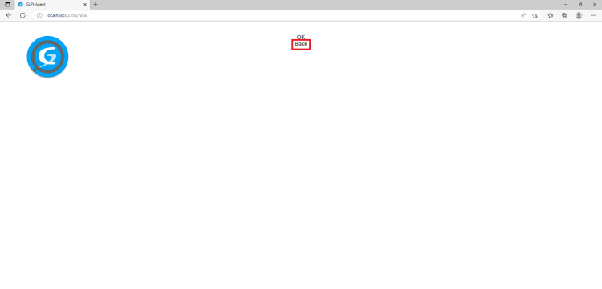

**Création de la fiche licence:**

### Créer une fiche pour la licence du logiciel installé

Lorsqu'un logiciel est installé et se retrouve répertorié dans GLPI, on peut créer une fiche licence qui lui sera ensuite attribuée. Nous allons donc créer cette fiche pour WinRAR.

### ***Méthode***

**Étape 9 :** tout d'abord, vérifiez si le compteur des logiciels installés a changé sur le tableau de bord de GLPI. Si ce n'est pas le cas, c'est que l'inventaire remonté par la machine n'a pas encore été mis à jour par le serveur. Pour ce faire, cliquez sur l'icône « ***Actualiser la page courante*** » dans la barre des menus du navigateur.

![][image108]

**Étape 10 :** lorsque la page s'est rechargée, le compteur devrait afficher un logiciel supplémentaire dans sa liste, voire plusieurs s’il y a eu des mises à jour Windows entre temps. Dans le cas contraire, il y a un problème de liaison entre le serveur et la machine cliente. Il faudra alors vérifier que les deux machines communiquent bien et forcer à nouveau l'inventaire.

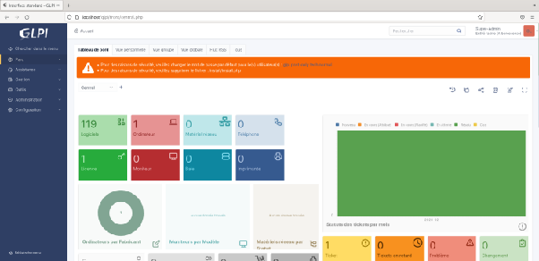

**Étape 11 :** maintenant que l'inventaire est généré, nous allons pouvoir créer la fiche pour la licence de WinRAR.

Dans la barre des menus de GLPI, passez sur « ***Gestion*** », puis cliquez sur « ***Licences*** ».

![][image110]

**Étape 12 :** en haut de la page, cliquez sur le bouton « ***\+ Ajouter*** » afin d'ouvrir une nouvelle fiche vierge.

![][image111]

**Étape 13 :** dans la première fenêtre « ***Logiciel*** », cliquez sur le petit bouton pour ouvrir le menu déroulant. Dans la liste, cliquez sur « ***WinRAR n°version (64 bit)*** ».

![][image112]

**Étape 14 :** dans la deuxième fenêtre « ***Nom*** », inscrivez un nom pour la licence, ceci sera plus facile pour la repérer par la suite.

![][image113]

**Étape 15 :** dans la fenêtre « ***Version d'achat*** », cliquez sur le petit bouton pour ouvrir la liste et cliquez sur la version qui apparaît. Cette version correspond à la version téléchargée et installée.

![][image114]

**Étape 16 :** dans la fenêtre « ***Version utilisée*** », cliquez sur le petit bouton pour ouvrir la liste et cliquez sur la version qui apparaît. Cette version correspond à la version en cours. Les deux versions sont identiques au début. Au fil des mises à jour, la version utilisée changera et il sera ainsi possible de voir la différence entre les deux.

![][image115]

**Étape 17 :** dans la fenêtre « ***Nombre*** », cliquez sur le petit bouton pour ouvrir la liste et choisissez « ***1*** ». Pour WinRAR, il n'y a qu'une licence possible par logiciel et ce logiciel ne peut être installé que sur un seul poste à la fois.

Lorsqu'un logiciel est gratuit et que l'on peut l'installer sans restriction, il est possible de choisir « ***Illimité*** », on pourrait alors attribuer ce logiciel avec cette licence à tel ou tel utilisateur inscrit dans glpi.

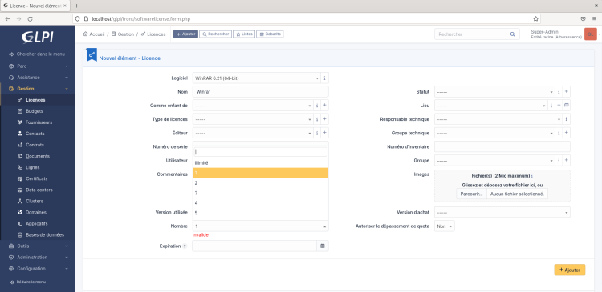

Lorsqu'un logiciel fait partie d'un pack de licences multiples, par exemple 10 licences (ou activations) possibles pour un logiciel (permettant de l'installer sur 10 postes différents), on peut choisir « ***10*** » dans le menu déroulant. À chaque nouvelle fiche licence créée, le nombre sera décrémenté de 1\. Il sera alors possible de savoir combien il reste d'installations disponibles, et une fois arrivé à 0, GLPI indiquera que le quota est atteint.

**Étape 18 :** dans la fenêtre « ***Expiration*** », cliquez sur le petit calendrier. WinRAR offre une licence en version d'évaluation gratuite pour 40 jours. Au-delà de ce délai, il faudra s'acquitter de la version payante ou désinstaller le logiciel. Calculez la période de validité à partir de la date d'installation et, dans le calendrier, déplacez-vous à l'aide de la flèche.

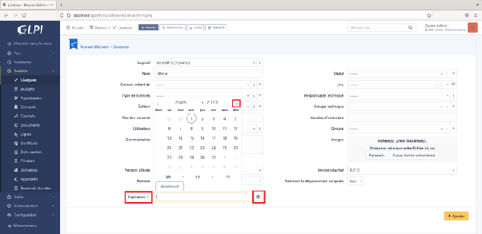

**Étape 19 :** une fois trouvée, cliquez sur la date où doit se terminer le délai des 40 jours. S’il n’y avait pas de durée limite, ce champ pourrait ne pas être rempli.

**Étape 20 :** il est possible de rajouter le nom de l'éditeur du logiciel.

Dans la fenêtre « ***Éditeur*** », cliquez sur le petit bouton pour ouvrir la liste et choisissez « ***win.rar GmbH*** ».

![][image119]

**Étape 21 :** dans la fenêtre « ***Commentaires*** », inscrivez un petit mémo qui servira à comprendre le fonctionnement de la licence (par exemple type de logiciel (propriétaire, open source, gratuit, etc.)).

![][image120]

**Étape 22 :** une fois tous les éléments renseignés, cliquez sur le bouton « ***\+ Ajouter*** ».

![][image121]

**Étape 23 :** un message en bas à droite de la fenêtre indique que la nouvelle fiche licence a bien été enregistrée.

![][image122]

**Étape 24 :** en haut à gauche de la fenêtre, cliquez sur le bouton « ***Licences*** ».

![][image123]

**Étape 25 :** la licence que nous venons de créer pour WinRAR apparaît bien dans la liste. La première étape est réussie.

**Rattachement de la fiche logiciel au logiciel installé:**

Une licence est liée à un logiciel et ce logiciel est lié à l'ordinateur sur lequel il est installé. L'étape suivante consiste à trouver, dans la liste des logiciels installés sur l'ordinateur client, celui que nous venons d'installer (WinRAR) et à partir de là, lui associer la fiche licence que nous venons de créer, afin que tout soit lié dans l'inventaire de GLPI.

### *Méthode*

Étape 26 : dans la barre des menus de GLPI, passez sur « *Parc* », puis cliquez sur « *Ordinateurs* ».

Étape 27 : une liste avec tous les ordinateurs répertoriés apparaît. Choisir celui sur lequel WinRAR a été installé et cliquer sur son nom afin d'ouvrir sa fiche.

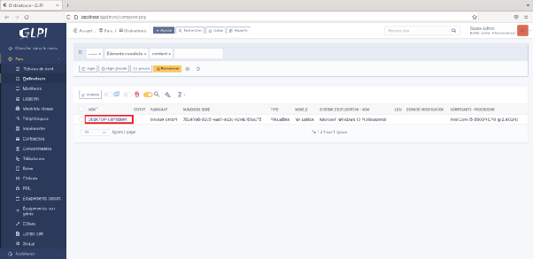

Étape 28 : dans la liste des menus à gauche, cliquez sur « *Logiciels* ». Nous allons trouver la fiche de WinRAR sur cet ordinateur et lui associer la fiche licence que nous avons créée au chapitre précédent.

![][image127]

Étape 29 : une fenêtre s'ouvre avec la liste de tous les logiciels installés sur cet ordinateur. En haut de cette liste se trouve une fenêtre « *Logiciels* ». Cliquez sur le petit bouton pour ouvrir la liste et repérez celui auquel nous voulons associer une fiche licence. Cliquez sur « *WinRAR n°version (64 bit)* ».

![][image128]

Étape 30 : à côté de cette fenêtre, choisissez la version dans la liste déroulante.

![][image129]

Étape 31 : il faut maintenant associer la fiche de la licence à celle du logiciel sur cet ordinateur. Cliquez sur le bouton « *Installer* ».

![][image130]

Étape 32 : afin de vérifier la procédure, dans la barre des menus de GLPI, passez sur « *Parc* », puis cliquez sur « *Logiciels* ».

![][image131]

Étape 33 : dans la liste des logiciels, on peut retrouver WinRAR. On voit dans le tableau le nom de l'éditeur, le numéro de la version, le nombre d'installations qui ont été faites de ce logiciel et le nombre de licences qui lui sont reliées. Le compteur est à 1, ce qui signifie que notre fiche licence a bien été reliée à cette installation de WinRAR.

Il est donc facile de voir d'un coup d'œil s'il existe un décalage entre le nombre de copies installées et le nombre de licences distribuées.

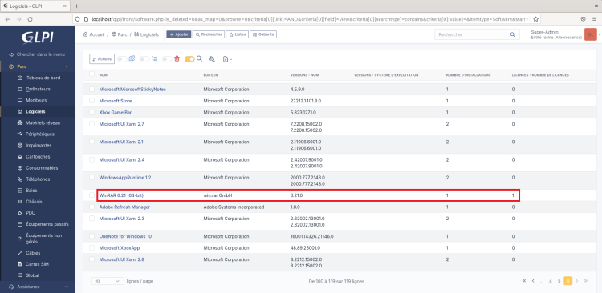

Étape 34 : en cliquant sur son nom dans la liste, on peut ouvrir la fiche de WinRAR et obtenir des informations sur ce logiciel. On peut voir entre autres que, dans la liste des menus à gauche, un « *1* » apparaît au niveau du menu « *Licences* », ce qui veut bien dire que pour cette fiche logicielle, une fiche licence est associée.

![][image133]

Étape 35 : en cliquant sur « *Licences* » dans la liste des menus de gauche, on voit apparaître le lien vers la fiche que nous avons créée au chapitre précédent.

Étape 36 : en cliquant sur « *Installations* » dans la liste des menus de gauche, on voit apparaître le lien vers la fiche de l'ordinateur sur lequel WinRAR est installé.

![][image135]

### *Complément*

On voit bien que les 3 fiches sont reliées entre elles et que tout est lisible dans les différentes rubriques.

Si on se trouve sur la fiche de l'ordinateur, on peut voir les logiciels qui y sont installés et on verra donc WinRAR. Si on se trouve sur la fiche de WinRAR, on pourra voir qu'une licence lui est attribuée et si on est sur la fiche de la licence, on peut voir sur quel ordinateur le logiciel auquel elle se réfère est installé.

### *Méthode*

Étape 37 : en haut de la fenêtre, cliquez sur le logo de GLPI pour revenir au tableau de bord.

![][image136]

Étape 38 : on constate que, dans le cadre qui indique le nombre de licences, le serveur en compte désormais une de plus.

![][image137]

**Enjeux d’une bonne gestion:**

**Enjeux d'une bonne gestion**

La gestion des licences avec numéro de licence est très importante, car il y a des risques juridiques qui peuvent entraîner des sanctions pour l'entreprise comme pour le responsable du SI. Il est donc primordial d'avoir toujours en vue les logiciels installés sur tous les ordinateurs du parc ainsi que les licences qui leur sont liées. Concernant ces licences, il faut aussi pouvoir conserver leurs factures, mais aussi connaître les détails concernant leur durée légale et le nombre d'installations qu'elles permettent.

### ***Complément***

La contrefaçon est aussi liée à une violation de licence :

[CIO](https://www.cio-online.com/actualites/lire-la-violation-d-une-licence-de-logiciel-est-bien-de-la-contrefacon-11790.html)

**Essentiel:**

La gestion des licences de logiciels propriétaires est cruciale pour les entreprises et les organisations afin de respecter les droits d'auteur et de garantir une utilisation légale des logiciels. Cependant, cette gestion peut être complexe et fastidieuse. C'est là qu'intervient GLPI, un outil de gestion d'inventaire et de service qui automatise les processus de gestion des licences.

En termes d'avantages, la gestion des licences sous GLPI en présente plusieurs pour les entreprises. Elle permet de réaliser des économies d'argent en évitant les achats inutiles de licences et en optimisant leur utilisation, elle garantit la conformité aux accords de licence, ce qui évite les problèmes juridiques coûteux.

GLPI simplifie aussi les processus de gestion des licences, ce qui contribue à accroître la productivité des utilisateurs en les déchargeant des tâches administratives. Enfin, grâce à ses fonctionnalités d'alerte, GLPI permet une réactivité immédiate en cas de problèmes liés aux licences.

La deuxième partie du cours se concentre sur la gestion des licences avec GLPI, en expliquant les étapes à suivre pour inclure une licence de logiciel dans la base de données et en utilisant l'installation de WinRAR comme cas d'illustration.

**La pratique du vocabulaire ITIL avec GLPI:**

### **Fonctions d’ITIL présentes dans GLPI:**

###     ***Contexte***

Dans ce cours, vous verrez quel est le vocabulaire ITIL utilisé lors de la création de tickets sur le logiciel GLPI. Tout au long de la création du ticket, vous apprendrez du vocabulaire ITIL et vous vous familiariserez avec le logiciel GLPI. Vous pourrez ainsi le prendre plus rapidement en main lorsque vous serez en situation réelle (notamment en entreprise).

### **Qu'est-ce qu'ITIL ?**

C'est un référentiel décrivant un ensemble de processus de gestions de services technologiques. Lancé fin des années 1980, ITIL est devenu un standard international dans la « *Gestion des Services Informatiques* ». ITIL s'impose comme une étape essentielle pour garantir la qualité des services informatiques.

ITIL est un référentiel des meilleures pratiques informatiques utilisées pour résoudre les questions organisationnelles liées à la gestion du SI, la qualité des services informatiques et la réduction des risques et des coûts. C'est une approche par processus qui vise à améliorer la qualité des services des SI. Cela vient des utilisateurs, qui expriment leurs besoins en matière de niveaux de services, de performances, de disponibilité, de gestion de catastrophes et coûts, pour permettre aux DSI de piloter les services selon ces mêmes critères.

### ***Définition*****Le standard ITIL**

ITIL développé par l'OGC britannique et adopté par les grandes entreprises internationales tant dans le secteur public que privé, est un référentiel des meilleures pratiques de la gestion des services informatiques.

### **ITIL et GLPI**

Le module d'assistance aux services de GLPI répond aux normes spécifiées par ITIL v2, le cadre de meilleures pratiques le plus largement accepté pour les logiciels de gestion des services. Il combine la catégorisation, l'escalade, l'accord sur le niveau de service, l'impact, l'urgence, le calcul de la priorité, la normalisation du statut, la demande de validation à plusieurs niveaux, et la mise en place de workflows automatiques basés sur des politiques d'entreprise.

**Les Processus ITIL utilisés par GLPI sont les suivants :**

* Gestion de l'inventaire et des actifs (CMDB),  
* Gestion des incidents,  
* Gestion des problèmes,  
* Gestion des changements,  
* Automatisation des approbations,  
* Gestion des fournisseurs,  
* Gestion des contrats de service,  
* Gestion des contrats de location,  
* Gestion des prêts d'équipement,  
* Contrôle des licences,  
* Gestion des événements,  
* Gestion de projets.

Sur GLPI, il est possible de choisir si vous souhaitez faire de la gestion d'incidents selon ITIL ou non. Le module de support GLPI est cohérent avec les meilleures pratiques pour les demandes de gestion des incidents et de gestion des services ITIL : il inclut donc des concepts tels que l'impact, l'urgence des tickets, les calculs matriciels de priorité et la normalisation réglementaire associée. Bien que l'outil soit conforme à ITIL, il n'y a aucune obligation de suivre ces pratiques : chacun est libre de mettre en place la gestion des incidents qui correspond le mieux à ses besoins.

(vidéo) Urgence, impact et priorité du ticket

Le management d’entreprise ne peut plus aujourd’hui se défaire des contraintes informatiques. Le plus gros défi des entreprises concerne la bonne gestion de l’information. Il s’agit d’un défi qu’elles doivents relever de la manière la plus originale possible pour rester concurentielle et productives. Ces dernières se tournent donc généralement vers des solutions informatiques qui va permettre de s’assurer d’une bonne gestion des données qui leur parviennent. Au nombre de ces solutions innovantes, nous pouvons parler des tickets informatiques qui sont à ce jour l’un des moyens les plus utilisés dans le domaine. Il faut dire que le ticket informatique ou ticket d’incident, représente une véritable plus value d’une entreprise, il s’agît d’un élémment d’une importance centrale qui permet de fluidifier les échanges d’informations aussi bien en interne qu’à l’extérieur de l’entreprise. De même, le ticket informatique représente une belle parade aux différents bugs informatiques et aux problèmes de sécurité qui peuvent éventuellement survenir à cause d’une défaillance du système de veille. Concrètement, le ticket d’incident correspond à des tâches directement soumises au système de support informatique qui se chargera en fonction de la tâche demandée d’identifier le problème et de faire en sorte de le résoudre au plus vite. Outre les nombreux avantages liés à l’utilisation des tickets d’incident, il faut aussi dire qu’ils peuvent s’adapter à n’importe quel domaine d’activité et peuvent ainsi trouver une utilité dans des secteurs aussi divers que variés. Si en matière de sécurité informatique, le ticket d’incident permettra de prévenir les bogues de les enregistrer et même de les hiérarchiser. Ils pourront aussi servir à recueillir les informations nécessaires sur les envies des clients et leurs préférences, en vue de leur offrir une meilleure satisfaction, ceci améliore la relation clientèle. Le ticket informatique trouve aussi son usage dans la gestion des ressources humaines ou dans la prospection par exemple. Compte tenue de son profil multi-tâches, l’utilisation des tickets d’incident dans une entreprise à un impact positif sur cette dernière, en effet en régularisant l’expérience utilisateur et la relation client et en permettant une meilleure gestion des coûts de support informatique, le système de ticket informatique permet d’optimiser le retour sur investissement d’une entreprise, il permet aussi de créer les conditions de travail optimales aux employés ce qui a forcément une influence positive sur leur productivité. Le système des tickets informatique est un outil indispensable dont toutes les entreprises devraient se munir peu importe le système d’activité.

La date d'ouverture (Ouvert le) et la maturité permettent d'identifier dans le temps l'incident ou la demande de services. Un SLA peut également être associé à un ticket. Dans ce cas, le SLA (Service Level Agreement) et le niveau d'escalade suivant sont affichés.

Dans GLPI, administrer les SLA peut se faire à partir du menu **« *Configuration* » \> « *SLA* ».**

Dans le ticket, les acteurs sont référencés, ce qui permet de leur notifier le cycle de vie du ticket.

**Ou se trouve ITIL dans GLPI:**

### **Créer et qualifier un ticket d'incident**

Lorsqu'un utilisateur rencontre **un incident**, il doit créer un ticket afin qu'un technicien lui vienne en aide.

#### ***Définition***

Selon ITIL, **un incident** correspond à une interruption du service informatique, qu'elle soit planifiée ou non. Celui-ci entraînera une baisse de la qualité du service. Toute défaillance, qu'elle ait un impact ou non sur le réseau, est considérée comme ayant un impact sur la qualité du service.

Vous trouverez la définition **d'incident** selon ITIL sur ce wiki : [glossaire ITIL](https://wiki.octopus-itsm.com/fr/articles/Glossary)

Lors de la création de **ce ticket**, l'utilisateur sera amené à renseigner le plus d'informations concernant son incident.

#### ***Définition***

Selon ITIL, **un ticket** correspond à un **enregistrement d'incident**. Un incident détaillé servira à documenter le cycle de vie d'un incident.

Vous trouverez la définition **d'enregistrement d'incident** selon ITIL sur ce wiki : [glossaire ITIL](https://wiki.octopus-itsm.com/fr/articles/Glossary)

#### ***Exemple***

***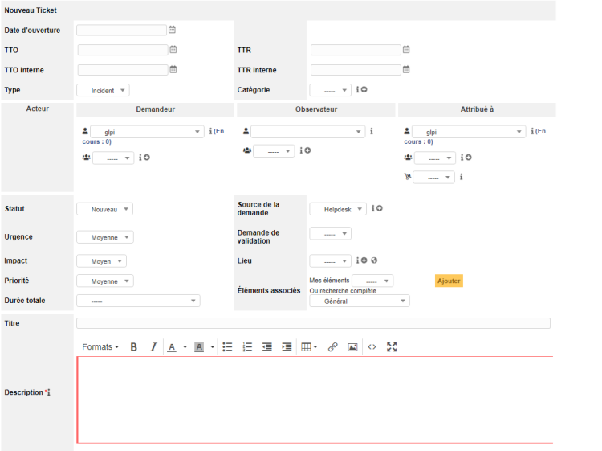***

Dans la création d'un ticket, on trouve du vocabulaire ITIL :

* **L'urgence :** pour un incident ou un problème. L'urgence permet de mesurer le temps qui va s'écouler avant que le problème n'ait un impact significatif pour l'entreprise. Attention : un incident peut avoir une faible urgence et un impact fort.  
  Vous trouverez la définition **d'urgence** selon ITIL sur ce wiki : [glossaire ITIL](https://wiki.octopus-itsm.com/fr/articles/Glossary)  
* **L'impact :** il mesure l'effet d'un incident ou d'un problème sur les processus de l'entreprise. Plus les niveaux de services sont affectés, plus l'impact sera fort. L'impact et l'urgence permettent d'assigner une priorité.  
  Vous trouverez la définition **d'impact** selon ITIL sur ce wiki : [glossaire ITIL](https://wiki.octopus-itsm.com/fr/articles/Glossary)  
* **La priorité :** la priorité permet de déterminer un délai acceptable pour réaliser une action en prenant en compte l'impact et l'urgence. Par exemple, les incidents de priorité 2 devraient être résolus en 12 h maximum.  
  Vous trouverez la définition **de priorité** selon ITIL sur ce wiki : [glossaire ITIL](https://wiki.octopus-itsm.com/fr/articles/Glossary)

### **Traitez et suivez votre ticket dans GLPI**

GLPI permet de suivre le cycle de vie d'un ticket en proposant plusieurs statuts qui permettent de faire évoluer l'état du ticket (nouveau, en cours, en attente, résolu, clos).

**Cycle de vie détaillé d'un incident :** selon ITIL les différentes phases d'un cycle de vie d'un incident doivent être les suivantes :

* La détection,  
* Le diagnostic,  
* La réparation,  
* La reprise,  
* La restauration.

Le cycle de vie permet de planifier, de contrôler et de réduire l'impact des incidents.

Vous trouverez la définition **d'un cycle de vie détaillé d'un incident** selon ITIL sur ce wiki : [glossaire ITIL](https://wiki.octopus-itsm.com/fr/articles/Glossary)

#### ***Exemple***

***![][image139]***

En tant que technicien, lorsque vous devez résoudre un incident, vous pouvez rechercher une solution dans la base de connaissance de GLPI.

Pour y accéder, rendez-vous dans **« *Outils* » \> « *Base de connaissance* ».**

La base de connaissance répertorie des solutions aux erreurs connues, elle permet aux techniciens de résoudre les incidents plus rapidement.

#### ***Définition***

Selon ITIL, **une erreur connue** est une erreur qui s'est déjà produite et dont la solution est connue et celle-ci doit donc être documentée. Ces erreurs connues doivent être documentées tout au long de leur cycle de vie.

Vous trouverez la définition **d'une erreur connue** selon ITIL sur ce wiki : [glossaire ITIL](https://wiki.octopus-itsm.com/fr/articles/Glossary)

Sur GLPI, pour chercher une erreur connue, utilisez la « ***Base de connaissance*** ». Vous pourrez effectuer une recherche reprenant les mots élémentaires vous permettant de trouver la solution à votre problème.

#### ***Méthode***

Dans le cadre d'un ticket concernant un problème d'imprimante :

![][image140]

Comme vous pouvez le constater, l'utilisateur n'arrive pas à imprimer. Pour répondre à son problème dans les plus brefs délais, vous pouvez vous rendre dans la base de connaissance et rechercher si le problème est connu et si une solution a été documentée.

Dans la barre de recherche, vous pouvez taper le mot-clé « ***imprimante*** ».

![][image141]

Un sujet concernant les imprimantes apparaît. Vous pouvez donc le consulter pour déterminer s'il peut vous être utile pour résoudre l'incident de l'utilisateur.

![][image142]

Si le même incident apparaît plusieurs fois, il peut s'agir d'un problème plus important que prévu nécessitant par exemple le changement de l'imprimante. Si le changement de l'imprimante n'est pas possible dans l'immédiat, alors il faudra appliquer une solution de contournement.

#### ***Définition***

Selon ITIL, une solution de contournement est utilisée lorsque la résolution complète du problème n'est pas possible dans l'immédiat. Cette solution a pour but de réduire et d'éliminer l'impact de l'incident, sans pour autant le résoudre de façon totale.

Vous trouverez la définition **d'une solution de contournement** selon ITIL sur ce wiki : [glossaire ITIL](https://wiki.octopus-itsm.com/fr/articles/Glossary)

### **Suivez les délais de résolution d‘incident et respectez les SLA**

#### ***Méthode***

Pour administrer les SLA, il faut vous rendre dans le menu **« *Configuration* » \> « *Niveaux de services* ».**

****

#### ***Définition***

Un **SLA (Service Level Agreement** ou **Accord de Niveau de Service)** est un contrat négocié entre le service informatique et les utilisateurs qui permet de définir le niveau de service attendu, ainsi que le délai maximum de résolution d'un incident ou d'une demande. (J+1, H+4).

Pour qu'un SLA soit configuré convenablement, il faut déterminer un certain niveau qui déclenche des **actions automatiques** permettant la résolution du ticket dans les meilleurs délais. Les techniciens devront déterminer si les actions doivent se déclencher avant ou après la date d'échéance du SLA (par exemple, s'il ne reste qu'un jour avant la date d'échéance du ticket, il sera transmis aux techniciens de niveau 2).

Bien-sûr, des critères peuvent être implémentés avant la date d'échéance du SLA. Par exemple, un rappel peut être envoyé un jour avant la date d'échéance au technicien de niveau 1\.

Plusieurs types de SLA peuvent être mis en place. Il sera par exemple possible d'affecter à chaque SLA des critères précis.

Pour mettre le SLA en place, il est primordial qu'une entente entre les niveaux de services soit conclue.

#### ***Définition***

Selon ITIL, **une entente sur les niveaux de services (SLA)** correspond à une entente entre le service informatique et les usagers. Ces accords permettent de documenter les cibles des différents niveaux de services et spécifient les responsabilités de tous les rôles du service informatique ainsi que celui du client.

Vous trouverez la définition **d'une entente sur les niveaux de services (SLA)** selon ITIL sur ce wiki : [glossaire ITIL](https://wiki.octopus-itsm.com/fr/articles/Glossary)

#### ***Exemple***

####     **Voici l'interface permettant de gérer les niveaux de services**

**![][image144]**

No9Gj8MYbf8LXcddxPHwXPhszFh/0fx/9hMj
[image3]: <data:image/png;base64,iVBORw0KGgoAAAANSUhEUgAAAloAAAElCAYAAAA8x0xjAAAzm0lEQVR4Xu3dd3Scd53v8eyyy7K7BBaW/YOyl3K5l917ubsLLOcuHMq5wCEktIRAQkgIJHESSAIhCSlObMeJa+Im9265d1vuXZYt2ZItWbbVe7V6783le3/fn5jJ6BnZ2I7n+U3i9+ec1xnN8/yeohlH+uT3jGZu2b93lxTk5Uh5aQmMivJSycvJkrzsDKkoLQQAALgux44myC1nT5+Snu5u6e1BQHdXp5w5dVLKSwoBAACuS1lxgdySnnZS+np7wsrGcMtuJqkpx8MeMAAAgGthitaJsFJVUlwsGzesl6pzlWEFJBr1DbfsbRbFwaJVMAx94LzLAAAAwt2SnjpYtHq6u6Szo13GjXtdHnroIamtqbb3A8WjtrZGtm3fPqTA6PrmpkZpMrxFJVRDfb2knDghHe1tcuDgQUlOSZHCgoKwcY0N9fay3fHjx8PWDae5uUl27tota9dvkBpzvu1trXZ50rFjsmz5Cuns7DD7Sr5s6WpwQuXhZr6afcNDY2hI0LOHeu0v4OLSoepG12wenBx56TopIyeXnsFKk8V22X6+zWlJmL5N6S
[image4]: <data:image/png;base64,R5zyKB6f09tK00T2uehV1ofQfMfbyOlG/Jo22Cus5oPi0gpuBwqKy9HY3AYXD1+WMZ9rIepkroUvZy8CdaNJlrGdV+r/xv2imgtOeYQLeKeahUR2w[[[[[[Iwaz6msiXw95LsdXp2qch08YGpu
[fn5ErRkae35qszy7/znfUm6eDFgufbCW7T0nH9Bkx+4AVGnFZTpjfEbrtQyeTZfTcgzJ/7UteB[[[[[[[1602[1602[1602[1602AA4IKi
[16024EykpqRlSVFxmBVSBtLdwFzwPqeMurQwwbVGg5BVWeS3vQmgBsENoOTDk0LL+rzm4QWAABwgtBygNACAABOEFoOEFoAAMAJQssBQgsAADhBaDlAaAEAACcILQcILQAA4ASh5QChBQAAnCC0HCC0AACAE4SWA4QWAABwgtBygNACAABOEFoOEFoAAMAJQssBQgsAADhBaDlAaAEAACcILQcILQAA4ASh5QChBQAAnCC0HCC0AACAE4SWA4QWAABwgtBygNACAABOEFoOEFoAAMAJQssBQgsAADhBaDlAaAEAACcILQcILQAA4ASh5QChB
[image7]: <data:image/png;base64,iVBORw0KGgoAAAANSUhEUgAAAloAAAEjCAYAAADqnq9+AABRxklEQVR4Xu2991sUWd7/Pf/L88tzPd/d+7v5vvfeNDtpJ+yEnew4yewYxhwwK4qYA4IBFExgwgAqKqKigCQVRFAESRKUnKP6ec77g41NNWLXjO3Q8n5d19uuPnXqVHXTUC9PVZ/zyratm+V6xhW5mp5qkjLIkyoZV9P1/ci7lS3FBXkJDQ6zlOxmvWrNHluro6mThxYq/1IDQ0VCezl7QeRpLHSPGzfYP1+dQFm2XFxn3y76FzZPCjhC3SHxQt4oVQtChatkLRomh5FIoW6Q+KFvi0r[[[[[[[3h3x[3h3x[3h3x[3h3xAN/+pN
[3h3x20UIgS7gmn/L1k77e2e/FdQohKD4zvqegtWn1EJY6i9WRC0SKEEOIUitY8RQu3vPmzRnTrTQ1Ncng4OCM6Yz7QtEiboSiRdFyFIrW7IKwkFDRGoNo1cuRk4GybM02OXTsjBw46i9vL14rxaUVsmnHIbldXCbvfvixrFq/S24Xlelg0yk3MuXY6bOy38dv1ifIPEUL8wMDA7UmKyMjQ+rq6uTixYty+/Ztlafy8nJdrrOzU3x8fKSvr0+F69KlS9LV1aU/bunp6TovLi5OB6TOzc2dcfFmns5ArjHoNP6u1jSKFnEjFC2KlqNQtChaYOP2g7Li4x0qUOu37pctu49IQHCYvPLOCsnMzlepwrzTARckK+e2hF2Ol8PHA+RqclQtStnLdTgkJvSwrPt4hsVdT5GOz3OadhzLnehNT66BGCk/NQR6Omn1ciorTGils48BRv6RyOYloCWgZZUFtAS09BRFLiYmXmF8fEIsnmE6L7TIlkhkTxLQEtCyygJaAlp6amJiAsPDwxgYGEB3dzdev37Nv8fGxnj56tUr9PT08JLKjEajqZxMv6mMTOu9vb0zyrW6VG5el37PV/dt4/X395vKBwcHTXW18rfNmerO1YdWl/abys3Ho3LzulRuXvffHU87npbHiPoYHR2dsd9av1Q+15ypfK4+tLpp
[image9]: <data:image/png;base64,iVBORw0KGgoAAAANSUhEUgAAAloAAAEnCAYAAABxD+1oAABQX0lEQVR4Xu299Zsc15m+77/m88N3k91sNrtJdu1wbMcUMyaOLYPMtiyLLBnFFthiZpgZMY+GmZmZmZlHer/neVs16qluaVQzPaJ53uu6r+6uc+rUKeq6+5zqOg+8/dYsyc3OkNTkBGJIT02S/NwsKS8plKryEkIIIYQQx1SWFcvsd96WB2KjwqW6qkLaWluIod1QUVai8llVXkwIIYQQMiky05PlgbSUJBkc6JeB/j7iRnJ9vkxDee6tNxWVNWPvrUDLWFVNnVTX1Hvcq4LpPJAnX/1Sx1J80UjS0//8SvP8+Zm52qL14fug2wI[[[[[[[kJCQ[kJCQ[kJCQ[kJCQQQ4gSK
[kJCQfNKyjhh1bXNzQjLTMPIR3+BON7afIowhWokZNUjKrOXXLgE53LiedbmOkbH5xzZT2aJLdSfP2SFI5SzlOOU+nYy5e11FaEQ8k/92dDcg+Nl6HmwsngbtGhvitp8653W6u7qqmDh
[image11]: <data:image/png;base64ZtltVUm54MKzbaWsGWh8pQENcSGQ6A1p4jKF6JuNBvDAk3M68CQVNN9QeeMZLAAUWh6AWHJlXt/Dj4EyrTpN5TtB+z33ktWJ+eSf6U9n1D4bYp6V+OR0iktK48nq0IuF24YhbW6e/nybMXrZSSCiCb9spJ/m7OJerulKoDbtcWexQ08YJOvoYT
[image12]: <data:image/png;base64BaVYV31gtM+wvfw8oSizHoCSdvhis/6G9llORn/n42odzsHzzKasylvUPBcwzf087hr6IVm1a3XJagiAII48hL1rC09MfonXzVqMWo8tufvrhqV3G1Uo49UHMARy+WoaKxEmM3joZv3jY5Rxu6fBPOZQi9w+vLe8l00XaeZ8R6AlhBBuPNFqMQySSX6US58wyP/69gdbfvp6IOc7eCFKQtXxhCTWm8f4fQxNkZnKWThqNCaODEZNYBWWHiM5u0Vj[[[[[[s5+DrEKRcs9KFqEEEIiSdii9YI
[6gfgHegYGBOtBS8QB1yDdaAQgABp4uA3JABKa58jYsCYLIJJXUExOzi4swwELXittYprJ4++VnVVDttX01JqEPUqVXQ/i41U6Ja2lJ/B5UGl5Hd2IusnAVl5Zz1OEG3Y4KNA6RgnJ2NjhrhWFBgNP/fjiWVtj5k6tPPHu94lN20Co3MWtgG8kCPRMPfgPrd14NAx3oZ9LbdumxxUcx03QxcSWH+p+gLv2Hcjl5CDawRDmIDWwJCtDAvjFE4rHEJpkNq/2CaQ7FyiaMz0DfSdgrzqutUrmzp2r9ukfGUCENm3aJNOnT1fX+u7duKyJReybOH2F/PdLn6s0nV8/l6XXtYio+h8f
[image14]: <data:image/png;base64x+PVoNZkkUuAxV+oQoHXrhAe5HbXnMDVoKW1zZVeyB2M9qH20Y11e91LUONhE7WOafpJ6PiRo1uJSU1LOjtQQtaGhklGcqMEDjvLdvkMMxbq+KKKCYhlVw8Avi1oLicBa2mroGycwu4R0ttPTMDd9mhGBl5xZS8s0supF+i6pq73A6ZE1ftWbsaRKPHkDUE77LeEVdTBTxYCEQ0bJ87j14aNgK[[[[CXCgoqaXbxdV0u6iaCoprDOunIl9o
[hpO/x9qxPLThtJX+q461oXCUvII8q2+szk6JlRH6imrbD0WT6hOlc9yoXGnTODp46m9NaQdllKb2k+6Ut7ynraW5JwwOwDUYRztXB7JpEM47SXG3ydcRz+bHnecrX/nK/Vk2fFS2wIRHPSsKLKuSKDigcc6GLZa2XZXQmbav0WuMlYOElmMHEgb494uVDLgs15LAfOEXfuH+mGLy0448NmEjKMnR2SQNJCgveMEL9mQJ/aYOysp5A3gG4Md+7MfuqyNNP21f/oWDTGhfYkR4mImDMQvK3W+WeE4xtF+0hosH40Xjty1M2kiP8lR/94am9ovfG20cda4c5zhzh0fC1xTLl/HEaDyVP4Zt1zLi1jFf8YJ58QB+KVV2gVtYiwztuETbH6f+9xnty9+1A6sxhBf+AV8V0il1z6HDNjT+BWgTXw3FnvutTSnDSr71GPqN/2jDdtGfwnwalyK21hClq4oTXn/hRd7Am68PeAu19le/PUftP3h9/6n7Xef9n7b3z/vP2zbi66xbS/89++FdyNcZYWhnUhHO8hZ33IcyUC4TPu/zfU8W52OIAxbG97rWdc7ZZe3V9lpr71Pe+M87+8VzPQRFdhwI+H/89MrxdBs8uHI8U47PfVL9GxzPl0D5zKea+qcfXCl+fluf+Nw7BsY/X98/nirtnn5opU7dyrUd4zOOysBN+fOl3Hc9uO6ix9rRf5l293u7lVpxddGpcTNvGqNDIzsl8AcOxvuj+Mt9rN+znXHV79kHumnv+nBTVqScsiaunIG3kQHRhjcb+AvelxpQuY3At+b1WVcZFke+YSwZBVFc5U7YRPY7uT8vHdkYp/2arLQX1QwgkS9CI3Vn4EJ4IE/BFsqPOEAWfPGLJv+EMSNc/L9uJjZJo4ZrrEi8sy24HTnMfKNDsNLgfHaGdNH1y3+QI/5nL3h5SJBqdV/ZynjM9llOk3+0mz519xzEx71yoIO8j9BCCmTkT5fZDpGF/aEuY9UkCL4QyHJ2j9yBwa0zmfNnJ/YZ7/m6cl5NfZRp6tTZEuFaFucNwN36Ec0BoGIUiPgf8gYM5EHeBRMUWDOXdYb6G4BzL8LD+VZmi5cDX5KZhK2TqbRonO6yvd9S2Pz/f4ovDY+HZ3J4uQQeJxsJKFqlYzB15wL7/Bkd2hfUtdO0f/2CVNxI3KCTfltDhdGLbXsg0RWB3thN1E3wUL1OH+Z/j9wt+2XLklzE/eHAyqetdkOkvmPe32SP5CAo5WuZgzM4B32Radmqb6BR1d+gnfOaVB6Gm7FTBo1KKFjQYW3FkmTiQYO1eAuIDMgAFFmk3hcVTGmxoa1Q4LHPNQpraYWN+w0Y+AdIudPchmKdcZBYY4uBTmL5Y+kjv8gN1bibox0/swwtEqIx5sFDOG+bzwbcR8DQ5Nf5U/UP2+nyWqq69qX0BbPEHwfYMgBQBEfct4VSO/l85IxNLDu/U/OB2phQMHma91weiRIYU4+/brNlEqdcPh1I+apO3UkAXGnZIplSDtdtkdF+mwPU+YlYEAJOlys59wxOTL3zIE7tNQ4h4g6GPEYGJjiBUMdOSo3zHEkp8q404TH6gpYn2FRPvto4CA1lLzXZMtFEBGhZCUt08BLt9aUSw7biuTVaPLZO3YQoc8OwTg88D1DXIBgOPoafa9Fc1iEciCn2+sKO960Puc16KIhjw/9uGhOd0w3iSd2WORbVXFeOOkrkhSbilSJxC/GJLCGdGZ6Fb/2RsXU1Z3ZihXSe8v34zC9RUpmNQ4HzX5PO3C+ITz3bVKHL4bVsagsFEeqv2/5VDQiQZ+vwUL9jhdgQMClDohra3AtIB6tabbc+gGo3kd6WBNCAgBibYCHoQ/vQfYgVPeWRvgOQev1EgZ6pXgQEet9Si9uKp5u/ZooqGcBoKDAaPFyVGxrGDBX7yv5QsDkxmRm4Ug3TQuffsGyPj0vZvHS+cUY37nskJx7YI1/ZvfZKAKJegCRLnadQZdTsAlCd5bevnYavvpx43hvL/NNPL/NPO60sPP1VNS0+49Vl4RlezjsYfEtCeTOAUe42YEhdmOQT2cBmlkcSBAyeO7A2X8Gl4eSddNu8Ovmtn+934OOgcP4EBjsSmYdAtCWyM/3vAIPn8FEZtGkNtZwsY/IRBNdb7r77JwS9+DHhd7peAL4TgMeHhjTHc59Gzy6HCFb+YyuPgM/ZDfx8zbJF+5gME3o5wHtyWDH6XrzRd8cMCTD/jxO32A08c41Rf6LBjYCr9OXbEeejzu3vjkqZCVKuDnzqCkfV4lIn2f7CtHldoCvENOEu1JWs/AEHTz5z/h/jD7//ffzhjwnngsRTqq/Qz5kXtBNfF+p36M9Pbaf7pPPo8rFAIKdAekAnaqOMHnLf93LeBp1Sv8TbH34X//1//k/89re/jf/+7/+O//mf/0mQ5DnvgjjvT6det3Q66Ik5w5huG+RU3hcnQT6n3JbI73OP/rm91EZwBm6ORz16Ykx0Tj1yoNucR/i+4Pzz4ve/+13cDgmuz9pXT1oeRnQMcLbZCX04Sm7ZYISz3UMJUTpCRrziHAOMfsObnX/CXH36A0jYHXH7JkHqQkCWloaUPbX1j6BhsIwozhR4V3c1b6Tsg3YhO5gd9Zh3KbWDQx++h7zLrqaZQFkPKuMjK2D5XoeTUbIRPFzNGLR3oCSA6edVeZFbUofXJeW3kbMdHeFRbha5CRU4CL126i8nU3Bt/eQZfET4fhMp8bys7wIn4EYg76SA9HGHhxVGk9fSnDB8L8Gn+CzTQOQg5CMS9eQh3pmU+xJ340KezKcvrHtVutzZDukpGQbgo3ClbnSa5tWqvCfr4vnLvg7zc4dPioD9uydTvWb9iMNevWY8XHhOnxGmsjfsfFCs2Njc/0j0+4RH/8jx8zpoeFffBtNBtJlg0keLNhsh5Tw3Ut09+y83G9vhsj4yE2Z+0n5s/LF5WN4dVD/XctC49r31hEG9/8cwww31zlh7PWsTnJ3d70h3eycevXPmB7ayExUC5aVBfyiX1dLpSTifNMgE6ZjoZ/XQ1kwI6SNZ4C60mfR4L2XazTdLV/0zLYYLcVPNFfBzyPD8L64SAthE78BYJt0hpE62btLftzXNeUy7qpb/vQaba8oAFPMYJQjPb8Jcgs6gdZILHPFpwQ9PYJcwQ73H9x0jz/oQA7k9mOrE/aCn9uMDit8Eb/nTio76Xba4yFlXB94TYd6GvFDy7tHT/VnHaSFDbIv5/35rl7x/U/2j8OWDIhTT14rfZJh9R2Yd9Zid2SueNi3LgsXnbLgvDG7vEY8H4XXxHH+/LQHGC7wAEOG8OG1o7zxPpf7ENokY6aApjcJGA43wp8XCmBoI4CBS95emVYSaNMJnshffioGnG4/2/xwt/fu+hj7kTQJQK9IABpUloUEmXF3HRaLxTdG4Pl7mmH19CQUZEs/SlIx9/rG+McTDfD1Q5FYMSkF7cpSMfGipnhlczhevTIRPcsykdAlFutErz/y9Ynf3vlb6NNlAhgGETBkI4s69/dXdJiXKSCoVTLOO6cpXuVrmz2+FYbZBn7YV5FjEiXgn5CAFfeGmvFgAIPagOmT3UvzmtjrhcJDZgaPGvdsIDcD7QVA3HZTY3zIlQ+RyTvLWmJ8ZwEz0ek4eXozvPxkI/Mq8jIB0NnJUkbkmSgTg6Rk1W8uomIy0PWEFtgrAP6r7U2xoqfYpoyL0mExWLkyBD88TaAbjt9fk4CTO+bImLbHfMcKH1ltMzBFgN1eHn2v/CvvQfrtEm1cJqaH7orGpafmoXPHEns0dJU9hdmd+etvN+jzqnn8gEeqN0+7rCXflwG1D29F/qHZBiNbZwG20vlUxKsA29LLvtMPScsqDerRyoZ1S9pS5OhfKvoQOhbKttDpnOvOSaOcdOnQ0zsWUN2OkyujTEvVDm7COhrZQXc3ZCMcH7ZiHuXS0ddImDLiw9sw0YxNlrJP8cQyyLZbleKGMRGbF1FeVlWOBPdq90OicG5hZjvqgTMrM60beM92OuQ7eWLP647gsKuH4FN0Vec/lWXuj745yrTY65LVdgVA+2xV9kop4z3y0F8q/ytgOy5myBRzflWZMcXzW6q+cDtT6l91HS/jbh1ql40jaQ2o7apdk1iXg0mzOvn2GUuM5G/RVfaod+SLrSiJEPY6jevhThPy/A2oxBqliiPIzR+jiDTh14yauHEjBMldn2JEi2Dm7YrUgbfXtCFzet8+4sP7ZWivnNlgZzlXhs0WYt5iZaEbsROrBnThf/ACvVwkw1F3HPgNXeHnew8sQqsIsbOGtrqWNPX2TccbGkDLxByeqTmoG5j685GsbL3WIM2kj/poPksgnDUvudX3ygGNI9/W1DveaGs0saxeOFo/Fph9v4NnPf8Pff27BhP3l+XrCZNmXgMGdWdKIgDXz5aoBkzCJluWTv1dpvCEeSHtAsZ9/E253XzCOu1AM9YLW+sN6As3pWrueeHvktCRtx4pxUr7cVk+ft0MVEEDnxf
[image16]: <data:image/png;base64,iVBORw0KGgoAAAANSUhEUgAAAloAAABcCAYAAAC2nRveAAA5IElEQVR4Xu2dZ3QUx5r377e7Z9fGoIxEzhmTg8kYExzBwMUkm4zBBOWJmtFoNEEjaUY555xzFkISGQM2YJyur329u/fsvnve837fT/+3nh41yCMRTPAlPB9+R5ru6urq6p6qXz9V3fOn4cOHg2EYhmGYVxtvb29Mnz4dy5Ytg4+Pz4D1BC0fOXIkxo0bJ6V3Xc8M5E+uCxiGYRiGefVg0Xo2sGgxDMMwDMOi9Yxg0WIYhmEYhkXrGcGixTAMwzAMi9YzgkWLYRiGYV4ySII8PT3h4eEBLy8vSZDkv65p+2/DovX0eSLRcnd3xxtvvHGXoUOHSieSTq58kocNGyb9TyeHTrj82TUv2u5hF8EfDZWlP67rGYZhGOZ5gvqqqVOn4vTp00hMTEROTg7UajW2b9+OkJAQSaJct5F5GqIlCx31/4/ap1Ma2RNc1z0qj7qvB/E08uiP7EGPLVqUwQcffIDg4OC7HDt2DPPmzcObb74pneEOk96K22dtLLHMX4uAJD7HOS+ThQ+nFut932DUoiDNBEei8OVarVVCG+Iu20ITC1mak5FaQ/
[image17]: <data:image/png;base64/OSEGJXYnjARNtelXpGisM1cQLJtp3YvtKDDQpOmvScrnIcMD2mi4uMbwAGXj0qJ3JS4veksB6kj7xh+ltxbfoNUDNgmUdEjpQtuG77LBBjBsodUBE6c02Ju2scFEUjxQS7ithHpSMEZ3BMvfhri4ZpW2IY+gEcfqsEHvUHJKVNR2F4UklDn2o7nQM4PDQsnDFtqYXimUj+M35vU77BZ7gRpE2BUe1mlBhoZqYnscV7cRGooaQphgWEbWQ1FktBWQUCiZWnXEygAWhRbzp/YeNgJoGDzTMlkAAQYT8/Fg4kM5DBweTIr7yPNgMS3rpnYj5LU4XE2RtvbkFEDhJo1oFKDF8CK3C8DSKfZf1K10XAkmXjFhQOBkVA8drHxYnUHDh3b8POzLXh80IFGCiVdIWCXhes1KJSUDRheYvBcTsJBdhNbAgZgBhEGHoYGWlBirexwCnAZjkgzonyDANhVVJAXQMirLKUnREhVARxJEVQbhg4MPv4EliqjxYvvJeS148JEjG8NZfDsEkOG3pGcYMecKP4jOfrvvDuCow+HzE5gAPgBPAKodN2gJv+omeD5r9/1rwSRcl2Etd/QeEryj93oeEOrBh7f+lav7h5zel393h3nTvey9Ph+19Qlq2+2FScUVYcIoqftKGLD78BEzItTHNnWT7nm+SQQThQfqyK4q/bJPvNbhbAOf6wzMxwxGhQoElBvPmV0OFK1cKQtmwK7OZzobm32YX9fPm+57ZnS8zq1CN
[image18]: <data:image/png;base64IXb/lq2w63vOadlI28aLJ3sL/7XXmHp7gtk1aOVDlgy4ECi178wsfLXe5yw81udrP2QYQNd95fcg9q2JZR2fGVE36iq8HyZfj1KsYenGkzCr8U/72FiMfIHRhdITEw3KcrQL21cgtOaXggMdarJ/piHfBC15wfm+oBnTJS15yuv3tbz99+ctPiLsZZl+2Y7HvT8NxQV+PkG2u7biKeOPKyrm95vWYtqaMNXVSb5//FnfqNrv0n3r024ixLT2xD3vYOifZqqFpNa5Gp8asxi1SU1dzVFNWwz5fzdMfj9RhvD2q/HG8hGc9yno4HkufW1/zU9ydz8ShH8aS+NSxXebAeOiD+rvYLlFVgx5WxGfESJqrBtdoR64ASZt+J8zkjz4yps0LocqDlPPjhUmMPPJ/KVDlYqxeM2LjygayC1k/j73mNvTfy+xpbDUvFKsWY2MFzK1bjy13LGzg48k++hYXhIE3GSTQ+6AeT5CHHnpYeelLzy+33HJLucxLvibWb6Toe3CxyCKRCDr0Q96TIp9+1afK5w5Ot+kLOfsceZ5drmhXQnshu7HdVCpIQW/gEmNVfJlWItuKOBT/D+AaQ2mh+4lSntsLPHClVrLaPAX5Qfvfq8LtoHdBQLftWdYJPLV7zurceQB4f/fu6XOrnfG8qBHN6szbgdJDGoNoe6DV4tO3Y0SoE3XDunGbrcpN2whLESr/UPqKlfmzCRDHk/JhBF/FqhJ+u6yHOT19q+hYoWcZ/rIA3K7LXg00DTMNRpkt7QOq0i+Bh+sk8DP6voCv0YZhz78/Czkx4MQIafnK94LuOPif+xKe73C9dFYMfCLzKDTtJimCOhr3Z8nU16JMvQ4Qo3mHRCUXQlncEvgVwGgsXsLTq3ehtKdGwKfO0CsnLwFfCT/CCpU+w77M8ej6zrdDn+zuCngWYhJuN6Nt06u5zKw+JUEurmwl0dFmvoaRXgC+GurOsxP+vsVrbuYRnBJa7OhrNyq0sBuJBuxwt1WRvmavDld7HnJl9HmTOjlHaMEnsi5Qp0O5V1YJ6LD8+3aJy0qHV9xPAZgGkiQ/gy2bA5akmbPk86TdHssvlw53PSYnw5xbbgrro/XGUQRajr0hWy6Bp+GnpaFnXV80RlG6OlbXZJ0wCpAENu4V48hyfnB6QXgsQFQ8NPjfMnLDQSEyAtpxa0u5eN8Hoh2rK88BPbQqzPgs8BLB+8D/IrxPhn7s64ogi+FXgx9cxAqnBgrdXvW1el0kS2v071SpyfLCOKc65vpP08R9grglfML46FeCnqZkFde5cNfoAA7Db9iTAdfPnzxghPUkyC68+Q6lO1cXgKf5Wq2szLl6tu0j6rtVqLVKfvP0r9q33o//6pEm6u8nQG4ZMlp/HoqgGX+/AW05NTTuP3TXP0Gvom[[[[[[[3Tth[3Tth[3Tth[3Tth[3Ttht
[3TthJrd0toIGTtQEwRqpQaEFgNW3jni7oIhBZNtMpWI7SWILR62aF1pYGWiTLQCvwMtptRHJByA5WKKm/LgQJU6l4r28RKRZWKKX1qJWnH6XISr8NgxZvJwFe9aybGonRmWF4CUel6Kl0x7nxt+OH18zUTFbUFTc39COxQxdftFqu6Xca51x7B3fms42vsRnrGLhpS+o/OoJn/76Cttn9GJaXkdaZY8QcbmekluVnL+0hnOHxjCrdQgBlq2ITlvDlP0XKf7kPvtnZrI4zY1UnQlu9jZY29pha/ti/NX87qX+9zflDvFCtKy8sLZsj4f/cLaJHu7JRzvZNTOXEYFuuFrZY+7aAk10Hi1FbO67epTKA0tYOyifael5TF6yn5UlJyi/t5t9a/uSpfWjuW8eKdmFzCi/Q0XVMj7Mj6VHTBKpQrbml56k+OIRKg8VsjZvMD3azGDy0gMijeOU399L4aBUOjr5EuEzgJY5hZx8coqK6iLlIpv+a18muuT9xq9pU5+t0oDHDRcPX3gHsJgRFIgAfyP8A7qjZ988DF9yGLP2X8eNI8txfPlITOzji1B2nRlMfbaC74ygYEmX3E54gSys3zIULtiPHT/9gD3LhmB6DwnC1J2hk3VhAzTWH/C2wfuelmk8dqb2xa9b3jYo0eJek2jxOyV8Lz8X6Fwj4B02AJULV2HuunVYs2o51q5ZjT0XbuLMnTu4+fQurm2dhRmxvjCyzxp4oODzdPgJZ8FIrWZBT6qHo/t
[image20]: <data:image/png;base64,iVBORw0KGgoAAAANSUhEUgAAAloAAAEwCAYAAABv3N9LAACAAElEQVR4Xuy9d3xUV5bv2/fdnp5pJ0ChlCWSSCJIJCEwNsEmZwPGJIMNmIyyqpRzzhIKKOecs8jJOGe7ne1O09Pzbodxe+69b7qnf2+vfeqIUikAbrARXn98P1V1zt777Lx+Z+19Tv3EysoKDMMwDMMwzN3nJ8YHGIZhGIZhmLsDCykDoeKpcdX8Gx43PGYYz7jchnHU8Mb1YRiH0Bic1NmwW43/TJiyYOUGKJwv5NyLWmDlfhJ2u1XEaMPv9gZvNT1rG9EXpzlhyuRxcLAeKIj6o6hpW1i92A4nryR2FBxmX+pyluotCNxSSIsYRxUQRctutWlFy8ngjMvSjRxtGqC/pRB7O9Or8tSfURnbB9J1spitK73QWxjTYLbUgK3rSsqGhZzx+Y5mwin3nPVZ89P8mnA/XIzvZ7ZcvMgHSE5YQ5y5Dq3JO+xsvUVvRTqpfiY/fKEl47JRLzxLZFPhNaVLtFONrM8Iwofe7l39+tQXy8zc+h3P99n+FgFFQuFWBwb4toFYdxVe9i+sgQX2u+e7M33Fp2YUO5GVWip/KmRdmgdOJiFqEldeN+Lq[[[[[[[q35K[q35K[q35K[q35Kpar18n
[q35KZROTBEYY2auOLKrXr9BKQ5GNJys6A[[[[[[[6M07[6M07[6M07[6M07lhBYAA
[6M07Ufpi7chbmLe7FoL74Xv2pc1Ffcxgj16RYImF7nsi06Q1SuJ5fyKdg7gz7oNxosB2yKVre91Zo9oNSMwTYUUanthrQH67psjxHqJNqwQF0ovHtWUcSik41seIvK7gIkZEK+bBLhTz9cu/FmScc34cb1veT+sfjnuUcz7ot/a0Y0mW5BXRmiObOU1E6+2I1vtEq1HN4GxlAv2CQXc7tWtruRU1Ow04lWNuawcbbuYacXar6f48I
[image23]: <data:image/png;base64,iVBORw0KGgoAAAANSUhEUgAAAloAAALRCAYAAACDLA3xAACAAElEQVR4Xuy9d3Bk2ZXmx9DOrnYVK4UitP/saEM7cqPQaHdHip3RcGbZvoccQyNy2GQ32a6qu6rLe6AKpmAK3nvvvfcoeO+99y4zgYQHEkggkZlAJvDTfZlAVXWxu9nk9JBd5PsiThTqvXfvPfecc8/97n0mv/FH//P/hiyyyCKLLLLIIossX7184/kDssgiiyyyyCKLLLJ8NSITLVlkkUUWWWSRRZZ/IpGJliyyyCKLLLLIIss/kXzj3//R/4osssgiiyyyyCKLLF+9fOP//JP/iCyyyCKLLLLIIossX71848//379CFllkkUUWWWSRRZavXr7xn//sm8giiyyyyCKLLLLI8tXLN95489t8KXnjr3n99Tc/U156+TX+y7de+Rx5jVeka156Vfwt5KXXefW1N/jWS6/x8qtv8uqrr/PSK+Lf1//aes1Lb4jzb4pz1vZeEte99PIbvPKK1MarfOvl13lFKi/V++ob1vNSeVHPt8R1rz5p67R90d4rr3+bV1953VqPaOdly3lRXjomyr72mrWM9Pcrlr5I7bxhrVOUf+21b/Oa1Nan+vkqL59e/y1L+9J5qS2hu0XXZ9p/TbQpzkl9eu0Na/tS/a+8KtlOnBfHX5XKiL5YrxV9Euek/kl2esXSvqSLpOHklUVOgwrziYGRuhKiQhtZE8Tb2acE1c4hxn1dTSUi6TGTgngM5LrgHRLCzPIUiTdvkterIdCt8ByVrQ1kXt3F//juXlpmZkja+yFvCRmrbarSwmafpiwji7wiqU/eIruiD+eGEZTqTVlxQ6HXDUyqDCz6FmWu4dRPM2u04/EuYzdMM9DdyixSNONGqOgvxW7UezyNPaOpooyw3iSc5NdRfq5tqOatWrmL1Rndi0uW0FNzAY8la0hSTI1oYZn+/cgxrfSj//n++hG9qP8bCR/z6Xz8jyzCmr7OrH7/Mgmsz2fcFTjGJpyiIiJJm23k7SgdIauyh4bx7ool15UdcPdPNef8/LDSoXsC2dWKrUHpuNDzQpGSB4+fQJDU106eYrZwCdI7iPRPdf+DRskhIBxDPr9dD6YP2A5Pc5nHrWW8gbqH6/Hlkb7Y1HuFTJi9580N4rr8k77D/dLs73zZSVjNPMAABYpHbL/WexoQpwLDNcr8L5WkLtH7MI01bSnn2sp5H6NrC9TBGUgfaZKv2QaWPNJDzkahq7lGXhwfRUJGAL3eeQVnLT0GzoM3SV6Fc69FDB9dVW4BMcy6KLQ7UmItQVJgLY1w8sg6phsw6gprgJo5M2BCe1w1j9EMe84tAyYEV/l1nqdjSV7XyJ9ZO/fga+lG0M8ItqJKmecs6in3QEHI/Bnv2RuFuVDF2HA+Bz+Ma5BXXIy6pF/lmpTXxI26YVm2ac6MBkxrYsKFNn1pV6zodYJPwofYJ3345BK6TPeXD0LDevB9e+kDyLCb314GAbla/sxLt0cFWkppOaX09o8zNzULrrZHrIKqpncMqFb7GZ6V8/uzDzq6U3Mxi3GRIftdLvZmWgkOy2BpOwiOia28HhdLHTlE5eQSkljLU2FQ+zoHCJfViZbyshsGGRjY5WZ3nlcxjVa84VIpqZTJSRL5/Bg2VlnWuyzepW7Co0sj3SzaXu6pFpZX+VSpsnyUsX1CZnrHGVyeM0/CuTQqqnOSCI5NZXSVhGf/WgczOe2sznbwazG9mQUT7lrsyU/Zy1YFqnV9CtDBMb6ktARhsLqzoUjUJEE9KZXTvDH4cE2hfe+w7ed0li1nIiWcamF+9/9Ord21z6M2jQaLTotHr6B82MjAeov76Fn362lZTcQW+2kr/Ux+04lUdjQzdPkKG4XNmPzeBhQ11PIW7po2kweTF1FPCiqRtORy9o1v+J4tY1p3xApuSR24dqlCB+p+3qitY7VuTp89quf4eW3PsSPnHAttiLr4AcLz2xAddgsVEhOsajEqUtNQQSVt1gnrOhg0BcJU3WSfsEaqN0X4pauqpoBAAo6D9FJKGmipyiTBQsTMuSmZ6OsrAy51e1ozXD8qqM/NFmHs6IX7WDlLMFJ/C3Yme62MwZX7ZNnBSh6yiTPTP28jX0gyqUkrR1j6O0a5G5Ke517kmWLSGCBatLxUWLYYZGBYthhkmWLSGCBa7B
[image24]: <data:image/png;base64,iVBORw0KGgoAAAANSUhEUgAAAloAAAFvCAYAAACSBGVpAACAAElEQVR4Xuy9h1sVy5vve/6E+5w5M2fCuXfO3DtzZuY3vx3Muo1b3dFEECSDBAElGRAwB1Qk55wRUDATDIgREIkqiiJKFJScc/jequq1ABeI4jbvt5/n86Cru6urqqtXf1ZV9dv/7Z++MwRBEARBEATx/vlvih8QBEEQBEEQ7wcSLYIgCIIgiA8EiRZBEARBEMQHgkSLIAiCIAjiA0GiRRAEQRAE8YH4KkTrH79dP8I/fMMxEPz9Xw3wP/9LH3/H+Nu/6OFv/1MB9tnfMfg2f8+2V0yXIAiCIAjij/DFiZaiUAmZ+iuXKT3x95++M8K/zNyAf5trjunLNmPhagf8um4/1ugfhra5O3Q2egj4v5UNjuAXjf2Yv9Ief11kOe5YBEEQBEEQf4QvQrTG9lhxseI9UX/z7zr4v/5NC/97hgl+VN6F9dbeOOJ9Eq7+Z+EdmozAqIuIP30TyZdzcS2jCNl5JXjwuArFT6oFD0uqkFP4BNcyi3DuYo7Y/v+eZoR/YMdQPD5BEARBEMS78FmLltRzNdpr9T/+Qxd/XWwFdRNn2DtGIyj6IhKTMpFT8AQv61vwR5aOzh4hbTSESBAEQRDE++KzEi35kKB8btUPK+xwwPU4Es9nIjPnEQYGBhX96L0trW1d+GcSLYIgCIIg3iOfjWjJhwW5aH27xAq7j8aKnqr2ji4MDQ1jeHhY0Y0mXfj2Pb396OrqZWl0M5HqRENTG8qrXuLew3JkMXFLv3UfVxmZd4pxO/cx/nm6iehBU8wbQRAEQRDEu/DJRWvs8OBipZ3Y5xKP1PR81L5sVnSnNy7cH8db5T4gd1X0xb44GjwdfQ0dWr6CVvXMjbnas1W7QOHwZ6G9FUPA5zNdn29gfxyIRwHQMU3jaiBs2Hnkj+mv1PPCKqs4bNkXjxUG/iLc88zN7kOfvBV+7oHQOvUc5x+/xOlbT7HR0BY0CjeShnKa2Tp/WWhNjyG1+7wvTEyDcPJOME7aUyZ[[[[[[[+HaL[+HaL[+HaL[+HaLZI1jaF
[+HaLAMjqx/KayeLZulwiTvG2KQvg+c87SEtSsD1m7JWKtmh1XqfjjqmImcxn7UP6uAPOax8h4JCnjvvNoFmzdIrDCii/FExHRH9MHEbQpBp4[[[[[[iKapxi0PlQMWkRERPMeg9aHikGs
[IhXdkeSbjJyExk97KJwUzrZIgWxOAayN6hSIN2+60fn6NdqfvRK8lp4wPL+3Cp4LEvFSwvYxdMXsVGcD0NzpeZ6oRu8At+a7UFZyQkcq+K3R+ebhelUqVKlStWfWb9b0JKT0jIDZxbvcuG0bZ+I94+SRqiuyefcZScBShpb3tot8r0dDt4p7RrkY5onRc2cCycYGBkhKi4Ih56ttMyNkXoNBln+JzaQMRFyKeZPoKw5tpZMuH4vMK1BxaHlJlGYfyk3e0Nocii3H42C92hO2F+rwoJfiu5GMmZ[[[[[[f6dE2eF5qh7xjujBbuADbj5ujuL
[69gZQGVqU1iDFj21aRnaZh5gqUpw4P3UZomSdiBVbUbQmP6o+15LTNwchWKpVKwmDY4hIsuXY8zISeg/0gUR6Rr8eZ1jhTr5Ck6mVu/glGLIYT4CYoWIYQQQoifoGgRQgghhPgJihYhhMaU
[image28]: <data:image/png;base64,iVBORw0KGgoAAAANSUhEUgAAAloAAAFDCAYAAADiaqAkAACAAElEQVR4Xuy9B1gUWdr+ve/37rt5Nv43zO5OcmaccYxjzgFMYELMiZwRAQEVBUFRERVBUFHEhIpiQFABCYo555xzjpigE97fc07TbdMNCjPg6Pjc13Vf1X1ynSr6/Dh1quoXn3/xFXSu8V1t1G/QBA0bNUOjxs3ZRhZ9822N2vr+YrM/FH/2+ZflcLWfmY33r3Qb9xWbzWYb+he6D998W4tgggGrPBZ9ZdyRn4sfXGMbp2Gz32MbAwab/8bZbPabrQctMVtjDBRiZkvrpjzLZWDRV/ofWbE1+MH95NMvXnWwURybzWaz2ezX+9PPqum3b+sfmi+qfQ0//xHo1NmyQnUOGWIn2yksyjCOFy4TtARYNWge++04LkK3+Fdh0t8blogy7s6+9g3r6tbM6eP4ad/HF8vU7kJO5G4uXpaFPv+EGaRzRsGNRtCJT0MPaHT1cpqBZBxf0do+E/5gZsOgzClYK+sLkUjZvMWK0DXDKL2BtDDhXXGJcXqS2hQ2cJ5gqKhtwMhgHyJ9LkBa34jshCCEsDZydSNKc3nlFO3s/Dva1oVVfjyZtNdqZALe36THQ24bHEEoj[[[[[[[[[[[[[FFk571n5kd3oloaWmx+
[h8/Q6tcvQWtK1ldU2orlJa55PDp1CteA/okaMCBRgwcla2J6pjq0D3HNZxuaMNJ5Y57ndj3GRMe75vOwP/CQwcO1eNFy6w+suwKt1/KepzapHFqtrRCq/Jdv+vRcBXT8fs+SL4WFy6s8t0OrZNFsNW4Tq/lzclW2Yqn1hx+nfoMmaWn2NCe0+gW317yFSzVu1gr17thOY9NnKHNUkjr6t1LWnAIr1PqqQ7tw9esZrbZWqPXqGachySPUpGFLDeo3UI0btFSv2Dh17dlPoaG9FWeFckBwrKI7686swTm7JB2w++4gRW8dZzihzm+6rtlUNHD1bYycuVZIVYMu2HlHvQYVasX6PYlM3afra005oRYxer2dOn9bSHSc1YNA8DR1dUH1otR2j3FVHlDhyoUKs11pTsst6rSLFxE12hdaIwXkq3nZYfYat0JLirYQWgFqB0ALgk33o8F9Hf6yYpZ85ofU/e+2vGOs5NF+dIic4j9vFzrCe5zmP63cYrxhrrPug2VYIZTrz+QePUb12YxUan63mwal6MGC8grpPVYPOk5zx0O5T1LZbptpEZ6p56GS1Ej
[image30]: <data:image/png;base64,iVBORw0KGgoAAAANSUhEUgAAAloAAADFCAYAAACM9FxVAAA1BElEQVR4Xu2dh1sU98K28z+83znnfc9JYhJ7i8beu8YWe2I09l4QGyoWEBUFRFR6F6RKr9J7l957780eY8/zzQzCkV0jKSxReO7rut3dmd/OzA677s3ssvvJp//5CpRSSimltPv9RPxnQP/hGDF8HH3jV18OldtRlFJKKaV/1E/EyJlixdjiHDJwq3T3jwDBiFYQMGCcubKCxvkxHPdMFxDR2o7NghhZbeuRPwDArEcZUz8PO/3n1n
[image31]: <data:image/png;base64,iVBORw0KGgoAAAANSUhEUgAAAloAAAFRCAYAAACsdAO0AABKD0lEQVR4Xuydh3sU9cK2/R++7z3v975Hj0dEUUFBRUBEkC5FBLEgRREU6b33DgFCQnpCCukhvffee++99woJ6TzfzHCSk+yiHicJEva5r+s+2Z357ezsZnLmdnaYfenlv08ApZRSSikdfV8S/2fi65MxZfJ0+i8nvPa20htFKaWUUv+VLMmTkL7334GT5ftFiYNxGLPl+OSUJkrBQkcfEh3NxmiHWzvobPYTOcWLkNFmJorbmIbq3jL0NLBgwtQgghqgRDS74MLRkwtAghhKgSD28
[image32]: <data:image/png;base64,iVBORw0KGgoAAAANSUhEUgAAAloAAAFRCAYAAACsdAO0AABZp0lEQVR4Xuydh18Uh6K28z983z33u/ecnJwkpmqiSYwaY+8txh57LLH33htWVATpHem99957ld5BEJCOYKGo7zczBAK7pI2N8j6/3yO7M7Ozs7uzzsPsMPvOv/75ASillFJK6av3HfGfYR8Ox4jho+mvfvD+Z0pPFKWUUkrp3/UdMbKmTf2B9nDqlAX4z3sfKz1ZlFJKKaV/R4bW78jQopRSSunLqhRa4t6cqVPmY9LEWdJPxQAZKjK0KKWUUvqy9gotMbK+/34axo4dz9D6ndCaPesHvPuvD5WGU0oppXRg+tFHw7Fr135JxXF/5NixE5WGKdortCZMmIHRo0dj0qTZGD9+CiYK17vGHTt6HidOqGD1ql9gaGgBHW1jbNu6HxcuXMd1VU1Mn7ZQUpxWvG5qag21mzrw8gzA3r3HpGG3NfShrW0ENzcfbN60G6tX/yJd37njMG7c0MKc2Uuwb98JqF67DWtrJxw6dBraWkZQUbb/8PyHIPvgO//yfz/HJl9Mx6qvJ+PCzqZiGXTrrqyKtrRmKwF24aWHcGzfN2qAuX9UwtceNkWyfCyi8bOdnFuOWeLQyPQIx/NCx9MtE68IlZS[[[[[[[O/VxGxR9HnxwsQ8td57e32qjQ
[eCxZugoLlm/CpB9+xMxps7iPIxj7/U/Yd+AYJ44pwmVdA1ia3oCSgjzC72fQHi2CIAiCGGKGPRGAMA1kBdVQMXNPRQ19aOotQwbFi3H2F3rKFyRmLtj[[[[[[O5jnaul9tKtWL1lKoL8vEtWvXkh
[GP/DBCxbvgaLVm7ElO++x+wZc/jDEYz99gffVoMUFko+jC65qB+DY72p4HvMCLh6hCA6NxV55E3h5BePTiSLrzDntkBGSPX2hrueCgLhctLe1wpGLLenlnlp4obS0VGCv0PqEe3APnNVExqvCrpBGbkEZVHWcMWbmYXz60z5+GekrJ0mSJMnh4LjZ2zF/9jLMX7MbX/zPGEyavBD//c9vMXbiMkyctAjTZq7BN19NwH/97zhMnLYan4+Zg4lTluLzz6dg8qxf8OO09fh56hL8z39/g8++nY3J05fj+5+WYPyPswRx9D7tCi1D+Z1gY1lumm24Y1mEl8A4vgF+8BG5BOTANLEboy1JEJZcrhzXUgAVdZdFrVNR33s+BaUd+WjDs3KO4yBMFRFh4OGJiYsyTmg4PD3PCUg1Em/b09FC0CCGxw73MHceCHv+LkuXM4deES/r7uG4Sml5rqNu5
[image35]: <data:image/png;base64heLujSgQ/KYVvnAThyeWwj6qAf3QJgpKl8AorgGVoOSKfShCXVoWIjBp4BhchJL0asRlVMHDLQ0iqFL6JlQhKqeKuowIB0aMTWnO3aUPXMhSuwcnYtscQ6tbRuKPpgeOqflA1jsB9LVeYOUVxIfEIBkbe2KXkCyPLYGw6YA8rx2BsVfASXucoa+gQBW37aJw8Z47lB2xh5JYEBUUrnNYKg55pAK4/jIKFewz2Kzrjpl4wTO1f319PL95tDEvfJOy9Ew2Th06Bh8otIhllrlz5/hyJFjuH77PvS1HGLPUmjJJy8TWrXSIpzefwAqSqdx4aoyqqTV3lISjyQsKytDXV0dGhsb35iGhgbrhHgxGT771+kPa[[[[[[[DvyEjJRQ7NzvgjOX7iDWzw1HbC
[ovWMt30zJwM9wTq5Z8gqi75Ti34VusPGYH+/CL2cEznuWYdWZKCZAYxgeGsCHSw7hfm2qcaLb0eQWhXPHzqMosEUYX77cbPux4fl3K/8e+fT4d1s3+V0p1km+3M1MhsWi9VuIA7sMAK3StzS1o7+Z//fWhsaYKHb0SoeLz8yPpL4EsJPqRc0tXaCKNTP6Ih/gTsSZmlf2UPUOiYizvI8ovXCkGQbh5q9b0UxAr8MrE3cu2yPcPA2h51Tgoh0Lt3M2UjVa4m20aC0GPYfirw2ppECL1r7MTKO3ORcOeqrQtY1CJ7cd1kaLiYmJienlxEBLwbxc0KJf201NjaO1tY0bdoS6rbObq6nhv557lcbwPGgVGbnDTTcFSWq20DmsDr0zjnjqUgjLY7owPmKKcKNIBCl74ZHdU8QaRCNJ2xt3DdJQbBODLPM78LkZjSfG/lz8CJMYBKkG4Il1InxOa8DpZhTK7SLhdSMSJS6pSHN6ijPgxR23mRWfcOTEzyIwUCrUG0lPhh8+cbEZLXiRluT7QLqyLo6Ek4chltGtufX90a1Yml2c9Dw9sN0pUFLulNmfj1M6zwdpXyVnQkDLVnTspAgSmE7PYn2iioMkjq7WXkxMSmiGGgpmJ8OtKa0QqKR11JCH75aQ/2/XiAAOd+/Pjjj9i//0ccOHEP2TFPM6LFHxPx5WUXcn67k/N7eXEGLdkPUdg2w7Urm//xEQN+ZY4XTMifvriHtjjx00Hktw5iYXEcSV56OEl+J4Z7wtDQlc3RYnptxUBLwbwZaHHLVubQWpqKhKIWrqHjt6UNpbO1KcwdglDXRzot0siXdC+SUPNoK8tCbEYVWkpyUFjVTTr/aZSmRGGwKg7WFsawcQhARn4KBmZGUJrgA2vSUQ33tsHU1BhOwakYW6SN7nrQkgcY9PuTzYyyAse9r+BBfBF2L12LZ2WDOGWhi+36CoJFaPk806keB/n7YWlNjep8sWea2Dj2v/wrANNFXv[[[[[[LfPft13TtV/jm67nfv307/9w38w
[7mfu4nX4c9shbFqxFLOYKPpt4jwsW7SYmfcYxnCoc9g4t/gApS7KPz8rsJgIDAzntbW7y1ujXJh8LuG1dbW9tnPzLJ7ZVnp8MnLLFnOkEQnaJL0NDQ9yOielzv2xEdHayt/QGWQytB5HOuBFwV7Be32Wg7UWEP3j7MfE/dSChFZ+SheayJ4iOCodzYBQXWkF+bvD1cIaXzy34BwTgurkRLB28EOJlAzvPYJQ1tPXchOS4YRL6btFqQdLDvLe/EwQxrFBoiUihRYjBHzClpSS0RmpH6n9i7+iSJpLQaqgsgP/1s1DXuYD1u1VhbnQVDv6JOK50BuGORlLLbM+2G3bLF0vWxGREg4XrChVVCEG1e0cZgp7waFEJlpBAQEIEBOMmo66o9eOr8edDRPSMD6nwOCokWgThfLB9kyB4kGhxQqJF8JAKj6NCokUQzgfbNwmCB4kWJyRaBA+p8DgqJFoE4XywfZMgeJBocUKiRfCQCo+jYhMtaTmFQnFcTCaT5BODIKyQaHFCokXwkH6wOip0RIsgCOLsQKLFCYkWwUMqPI4KiRZBEMTZgUSLExItgodUeBwVEi2CIIizA4kWJyRaBA+p8DgqJFoEQRBnBxItTki0CB5S4XFUSLQIgiDODiRanJBoETykwuOokGgRFh
[image38]: <data:image/png;base64GMGwc0sHew+cw4mlGxEQ5Y5V6+Rgd/0cFq3bAUm/DHWlqk0CII2YBCS4IUWuKEQks24Y+1tEihRRCyAYWWBCm0xAmFlmzCH2tpkUKLIGQDCi0JUmiJk6EQWo2Njdxf7w01u8+w3vGiFVX1LXj5tBE1TW28LfBl4I+1tNgdWl2fUiAcU2mXXW/2Z4r7Hlqfo7WhFk1tL3sPPUEQoNCSKIWWOOkKrSYk3PbDzZs34eVkw136hN1FUXYSHuSVcy+ApbkPkPK4sOsFsaEK2QVlghfJgVYsp3ewNdCEouoV8ibtk3Q4eIfjtQydaJF9y4/9mWfHeCBlI5YgCNmGQkuCFFriZGiFViduMbFjZ3INJvY+cLPS55YZiNBiX/wDAwPh4uLSM613aKVHukPL3BWvhO9+iRb2LT/2+cF/W/VTZd+WJQhCtqHQkiCFljgZWqH1CnLH92Hq1Kmcx+Uu4OV7Qqudee4WlZSiqqIMZRVVqKqsREl5FcpLCtHc1vf+2c9nYz9kuJs+e7Qy7+C8ljmet8vOHi2CIIjPBYWWBCm0xMJUu4ZESyAkWuLEJFpTY8MYGZ/GzBT3v/WRc7lKHm
[image39]: <data:image/png;base64,iVBORw0KGgoAAAANSUhEUgAAAloAAADpCAYAAAD8mpkYAAA37UlEQVR4Xu2dh1sU98K28z987znnfc9JToomxpJo7Bp7jSWWGKMxGktM7GLsvaMCYqF3pYr0ooj03nsv0pHeFKSqzzezhg3sYhIHMOg+93XdgZ357ezsMGRuZ5fZd979z0eglFJKKaV97zvifwYPGo4Rw8fS3/zow6FKG4pSSiml9FV9R4ysWTO/pl2cOWMxPnj/E6WNRSmllFL6KjK0XiJDi1JKKaW9VSm0xLM5M2cswrSp82RfFQNEVWRoUUoppbS3dgstMbK+/HIWJkyYLAutGQwtJefPW4z33h2kNJ1SSimlb6YfDx6OHdv3yFSc90dOGD9VaZqi3UJrypQ5GDt2LKZNm4/Jk2dgqnC7c96lg3uw54gGfvr+ICxMNHBNzwqbfzmNa2e0oKNxHrNmLcHsWS/GHtEwgYW5JfQv6+KWZxhO794njNGA+jU7XNezhY+bJdZu+hUbvv5+S8M3P+ljznpjzF1vhJnrjDBrnSGmCvu++s7uYt
[image40]: <data:image/png;base64,iVBORw0KGgoAAAANSUhEUgAAAloAAADVCAYAAACPIl7OAABStElEQVR4Xuydh18U59638z+873PO+5yTnBTTLIk59hi7xsReYu8ae8OGiihN6SC99w4Ly9Lr0vvSe++9g2LXfN+ZQTayY8AoIMjvm8+V3bnve+6ZnZ1hLmdmZz76+N9fgCAIgiAIghh5PmL/9+WU6ZgxfQ7xki8+n8pbUARBEARBEH+Xj1jJWrF8A/EKy5etx2effs1bWARBEARBEH8HEq2/gESLIAiCIIh3hSda7NGc5cvWYcni1dyrrIBMFki0CIIgCIJ4VwaJFitZP/20AvPnL+REaxmJFo9fVq/HJx9P4ZUTBEEQBDEx+erL6ThzWo5Dtm4o5s9bzCuTZZBoLVq0CnPmzMGSJb9g4cJlWMwMD9Rdu6oCBQU17N79O6ytnWFmaovjxy9ATVUHOtrGWLlio7QtO2xv5wZ9PVMEBUbg/Plr0NY2gqGhJUxNbeDnF4IjR85iz+6jMDXcbKeYzH7Q/HDS+evZDOG4kWv3wkIdGiUCgUyT+UVsjWF0PpqCNO7zSHxDQN4lsCKBywR+bdKdek
[image41]: <data:image/png;base64,iVBORw0KGgoAAAANSUhEUgAAAloAAADQCAYAAADf7899AABdc0lEQVR4XuydB3sTR9u28x/e761PeicFAqGElkAgEDpJCIQEktAh9GrAVNu4995770XuvTe5F8ldlpssV3qo1ze7jv1gLdgU2WC4r+M4LWl2dna02tWempVXr73+r3dBEARBEARBqJ/XuD/vv/cpPvt0OvEP774zSbCiCIIgCIIgnp+/5ySjzUHveAdlIWLl0JhxrbH9Qfd4RyYCQO+xQMebt7JOGoch/NWCYgVZeKkaazgYEUQE5XNi4U[[[[N9RUs5OewtPR2a5DG4kXQG0A0ZIfIO
[8hWrMWosd34sx+hh4zFm2AjW33TW33L2/pF52HLKim9r/iAeuUW1/OyY+PoIYqAQkctfX3xY0WrDQ+tDfk28VnFeNH0DE0vXoo3epds9tPoBEi1nEi0Sre+KH0W0WlpaaEaLIL4wJ8AT/nYZQt98v3OL1vHzyNm7D/k2dshY8Hmf0WH6M7veepyJjcGZxAQcjU9CcCZ7PNj3yi4zB0B5zJzeWgdjIyEtLQKLimx2B4lR0x+NrZ2Qav7tnRDa2O4DLEFWlgnKXE1ToZQ9rheUWbjQqwU0aXVsM/KxhGplF13KXw0OTaOEil[[[[[[[0tJf[0tJf[0tJf[0tJf[0tJfT
[0tJfUOTjGICouEZ0QutHZeQ3BsIQyOXe+ZL5WvGpjssARsuCBKtF/ctGKF64hXeJyrZm2OEcHB6hpCoUFS0NsPfKwRV+SnwDsvjrSwV9McsLi7qRSYYzCwQ31HxQetMhu6Z/eNlvHNFDXhtX[[[[[[[[atPGr[atPGr[atPGr0hXDmzR
[atPGrojhogICMbGo3bw8Y/A0iDRIgiC38qIpWj19nQOEi3BBlGwcWQNdeA9ccQNdroYF6KQV5SC85JXYGdhiZiUHNSU5iMhPh6p8RHIKa5EbWUxwkNDUZyTgfj4GCRn5sHTWA9j9S+Rh5Yaj1Og2gJlse0rk9KREoE4XgQ0dKaBWYpD596vy5addqilZGcQP/kFI1VZS+GLfs66D
[image45]: <data:image/png;base64,iVBORw0KGgoAAAANSUhEUgAAAloAAADvCAYAAAAqw3oFAABryElEQVR4Xuydh18U197/8zf8fr/nPs9zb3JzY0yMibHE3nsDY++9g6KCIEUEQRBE6b136b2D9A6CgPTexYq9gJTPb87g4LKLNRSTfD+v15vdPXPmzOzZ2d03Z2Znvvr6X2NAEARBEARBDD1fsT9jv/8FE36ZRrxhzHfjJTqKIAiCIAjiU/mKSdaSxb8TIixetAb/+fZHic4iCIIgCIL4FEi03gGJFkEQBEEQfxQJ0WKjOYbCDqaBNTDl7puF1iOt7AFsg2tgHlIH2+gm7uGt+5Mos/e9i+L0GdCOcuAfhepy8pF+1f0NerKL043kkTdG+IQlH8NVZsdCBTr7SfqNulO5tPfPIS[[[[[[Taj5s4ClmemcDNMh1r7KAISLLB
[rsDKxUuxefN2rFq+gln/FMyZtxQ/fPsjvv9uStKlpLLyE/4Tx8AkIReTEN0Z4B8A1KREV2HASbTS9afa9Cb5caLPbIwe+MGqKt0qCyWwXNjJD0q6XEJxegYz0JJg7+aOnsQhnzdzhFJqJ5ABHJObtZtBhm82HRYtFiGOYtyHuy6MbzTr86DFQfmoMQ1vL21x3Ft0YhZSx//Xkm8xDRTMNxrC7B9Z
[image47]: <data:image/png;base64,iVBORw0KGgoAAAANSUhEUgAAAloAAAD0CAYAAABD0ohdAACAAElEQVR4Xuy9h1/VyPv2v//C83ueb/3s7mdXd3XXdYu9V6zY194VCzYQRUWqoALSkd57UzpIUar03ntVAQsiRUVE0OuXyTF4OAc7YNn7er3eJLlnMplMhpzrTHKSb7791wgQBEEQBEEQg8837M9PI3/D2N8mEi8Z8eOvUg1FEARBEATxvnzDTNb8eSsIMebNXY4f/j1KqrEIgiAIgiDeBzJar4GMFkEQBEEQH4uU0WKjOfPmLsPsWYv4qaQB+adARosgCIIgiI+ln9FiJmvGjPmYMmU6Ga3XGK0li1fgu29HSsUJgiAIgvgyGfXzbzhy+BiPZNqbmDplllRMkn5Ga+bMBZg4cSJmz16M6dPnYha3LKRdOKUEJVUD7N18Ci4OBjC39sQ+eR2YaxvCwuA8ZGRWYYHMypf5V2PzOkWcVTsFPRwYoVa7Bg3jxu+79g0pQ5+OnfP+PHH37B8Na3/61B4dP26Puxl2RZWYGq7EZhtbBGDXtIL4bt4fLI10IQRAEQXyOiIzWaCxYfQB/jJPBf/7XGPw1dSXG/DIR//e//sSY8SuxYs02TJm+DP/73z/jXyOn41//Mwa//LkQ4yfMxU9j5mPWcnnMnLmCM2RTefPz1xF8zdIhr1/RgkDc1A2Mc04V5HN/eF5SYsQHomQlzv2zsPuwCM+90WPumQ90+HQqn3WAakIVNO4dvRGvubjdYcPXT0PHj511DcmDJHXdDw0A4cMZGzSoR+mZhsA7K5vfB0TcVq+U+3mwLHDCKg6lZMKZvdsQ+9WC4B6iS+gQ8nbPsfohcPKz8pH6rStkYUtzZ8UnqfP5es1jvpdk/xJ+f5i3f/wsLMzN3MBqSvD0NOShFisgoRm1OMuNwSxOUNH7E5RcjktpuxKwLlfvl8nyejRSINn8hovYfRctQ8gpIkfxw7rYO/561Dcl4kbFTkcSWnGkrbV8HQxhmuZ08hKCMJcqsVcT3YCiuXroCDhxe8QsOhsXUv5A5fgIPaAYRk3+BL33/WFX4GapzRSsae1UdwziWGj1cm+eHYOToGjzif8SZwtN3PlsDwsxtKEdVmclffwcSeXl5UpKuMZt222LbZN4YOgpbWD+wDp4evGYndbRMeopa0DT7qeov2h6EODxR+0cR24+xkX70Zbx6O+vA/aRfGup92ivPdF8db2R3ycTYV4K7cey8firDxh/1h5LN7CxZ6/3F9Wd1YHVj9WT+FDlNWpk8V7evr2l7UD2y+2j/df5mVxoX1F8fZ+bfOos4uPMbZoZoaHmXY3Wgzv1CL3sDQuLi7hoaYW7baKUeVe1d8PuVSJkZAfOnsX5nJZtrSQyeJEOj1G8O3gfwy0DmOfbD/+WL6LpacfLIchpcUH5QSGsd+6
[image48]: <data:image/png;base64,iVBORw0KGgoAAAANSUhEUgAAAloAAAEBCAYAAACg+gtDAACAAElEQVR4Xuy9B1sU2b6+vb/Ce/3PPmfvc5w9M+qMo86YM2ZRBHMOmCMqSZAoWUByzjnnKDnnnDMGQJIYEMxZnreqEAa62jCI4Ojvua7b7lpr1epVdNt996rqqn9M+L+JIAiCIAiCIEaff7bVHehoUhIjEfrwQbUigUCoVC+ax8VLRGG3Z3o03sf72WKtaLrIL59H5ZvlUWUnTLkzO2wYaYuQ1bFjYbTUUyCEhMTN/wA2lS0nDixUSRF4eRZF1x99PZTjzenO3D57sb5TUXr9cuncLvRksScgCdFO6biwzws5x92Q5FnLzxP+7TG62Ie/OqZtUihC7t27Z/oyIH4DSLREQqJFELva7cd9YubB9WTlbvlBXaIOVbfZ+Yfz6Zb[[[[[[Z+XGrz1heUJdVm78WheWZ/wewJ
[yeTEoXjYc0D/AxnY27ZlYOzQU0Vg6y//DwUl9SMeK+pX6nYQzCTESX2SPtiT2SGjeugU8tat3LMawRWlqWPjr8mR2jOXQPjC8+BpZO8sHYq3z60WIwIvX4d5XrlhDLZ1twSZW41Xie0tgtU940KLUpDkzDxZO4O0mIClIn+4UMuMBZeKJPsi+dP2CT9nE3kT/kHmWlVdVGIn8QeO6WltbOTxRowrVbdRy5e3tDR8fHIlswSpR+GKJByVPz9rL9Ok0GLUF3B60F9oOcaoAHonxd8DwqFyqlC1pNKijKOlCXmwYXn0jgCto9gyk5GSHQa5jcP0FtTBFcvb4RExKB78oV/4rzoAp2XK35ExWiwGLRaLZdV5Bq2zftaSBpS/6xjq60FP/zA21pbRYxnEyqq1xaoqNRHRYD[[[[[[[GY3FKigogKm+Hn/4p8toa23Gx
[4MUXXV9EG9C+aBMy9Nms9ls9pp5fO1ASpgYOemZicHkRFVRRefG8nTpub45zDZRy4l1TonGYBCzOY6OmAYrAdSdGRiM8shlJcCCNF6GIuTJ07A5Mx5FHaOSEDqZ3IVhQK0Cr3vIYhbrIKXnTUiM6uZaKknTbR6Osrx188WYsPCT0hOPr8T3zSPEc74P/UPnv3gtmP6xGZ/ReY+Q4IE4HA6HM1Fw0RofLlpctDgcDofDuSO4aI0WEG0PRomgRQgghrwRFa2MoWhQtQkgMIx3her/pX[[[[[[IIYSQ1wRFixBCCCHkNfH/AZT8t
[8oqrMXH4CMyYOh0LOIM5bOgobNu+HxNHj0a/OcvH3UNTUiNDUGotwfsXDxRWl4Mdzs7pMeHwft86AniR4MNEmRlZfH3ZbF/ONhlw+LiEjQ39Mp2FJjQG0m/vB+9w/hkeGTj88AYgRCrB3/pIyayyfYcq9zGUncZpW5Ft65tYJtfoxvV8s0aX8e4s2G27u3E6BiQ78Ss+ZzWZZcyAFsdYo9sq5DwGFCKBoheeQj8czCROBxxOFvxkeupVGXFxuHHjBgYHBxEUFIQ33ngDp0+fFtIHbs+duH
[image52]: <data:image/png;base64,iVBORw0KGgoAAAANSUhEUgAAAloAAAD8CAYAAACvgQowAACAAElEQVR4Xuy9B1QVSd+vO+tbZ51z17fuvefeL9x5Z96Zd/KMYcyYMCsq5oACgoKCAgqYc84JVLKKAVFUTEiUnHPOGRHJOZpH/d3+16YZ2L0xzDgjYNVaj3vvqurqCt3VD9Xt3p999c/vweFwOBwOh8P58HxG//z4Q1/82leJ08r33/WWdBSHw+FwOBzO+/IZSdbECbM47Zgwfia+/eZnSWdxOBwOh8PhvA9ctDqBixaHw+FwOJw/i0S0aDVnwvgZGDtmCnuVF5BPBS5aHA6Hw+Fw/iwdRIska9SoiRg+XFkQralctBR0mKrqbHz91Q+SeA6Hw+FwON2Tn3/6FatNNzDk097EiOFjJXHydBCtMaNVoKSkhLFjp0JZeTz7LKYd3bwWa7cdw3KtzbhofwwWtldguHI/Tu09DqtjB6GiMhdTVOhxpMljf+EO1pq5szZdvuGPU2bn8S8F+UTuMBBCK+M+7CLzcG9/Ao8bHwsEZyuws3YDFzJKYPiAOpdpiLObJojWAiZaIYd+RWPQOjwJMsal6986pKKioqJ6lYqC1glEQevJUdCioqKiospkUdA6gQ4LWlRUVFRUVFQvvihonUCrK4up65mKioqKiorqJRR3Tk49T59Ur03QWl9bxtYWfTONioqKiorqZRZ3LubPyYecq0+i1yZobW6sYHIyhkgkjHA4RAghhJAXjDsHc+di7pycep4+qV6boEUIIYQQ8qJR0CKEEEIIyRAKWoQQQgghGUJBixBCCCEkQyhoEZIBa2tLSCTmMD8/f+SWFpNp43vZNt3oHUdgzjBp5AD2tA8gXD+PjjztxvlKPDx635wx61tvQKESoaimBdevZeOnP/kxzuXV8cPggk
[image53]: <data:image/png;base64iY+ZoMl7LCoImfd7VtrnUWzly8gUvN1+Bp7N08R47gyq2LJFoUyqfm9SvIqpqi+c6jzmPNCkB/TR/s8N2Erf572Qk8EztD25fpTHwpmzcP4tCAf6frO/W5o3KiTyorggqCF4pPIrihuFR8v6OCgMcIvrwxnIlkdYPEDG2YYDEyyusbqLXIw24AzbN6+KUQRWdrPy25K/qjac9ItiZ3lRSXAw3Ynp8CiWto6gZXGFx1iHdnp2cklAMg8gqsQjZfOl4rRoZWuqaMBx3wxAYxmQ6UjpihTaIjFMf8PActrtUhDlpVzEGL637FQYub+Ids1YxGFo6MrT+v+RzChKpDAo98kZDi1JKXyY
[P2IE+v80HDLjJmAi96+fqTIy6P/DEEhVgaXYPy8CxJtGd2KltwqY5xj/6LgWLLbnu9oBvy4aIlviBQKhUL5Y4eJATta8fjxY/5hx+yKRxn3VpERSJ04cQJ//vOfuf72t7/h9OnTSE5wrJT+VMz4t1TkxD6ltKG18u8f749PGt3u8PE3eC9LYIzstqGGhFkNnUh+saLa42RlDiX8YhVRISEnpfddCgdUblx4uvv8GHp2uw+PgJrl6EuZmFwq8ELQpT1ON2JBJhS+60t7ez4UTqWuHvkwiPpKUJ6qH0aCHz6WFLO6DrcMIaVUPmUqN/jnC65Y8MaAnH0nytNb+2RH2CfXwVt+zF8bGt
[image55]: <data:image/png;base64,iVBORw0KGgoAAAANSUhEUgAAAloAAAFRCAYAAACsdAO0AACAAElEQVR4Xuy9B1gU2b6vPTd8957wnXN2OnvvCY5jGnMOKIKiggEMKGIWc8AsKoiCIoIkCZJzEsk5SxBEBRQQFQwoOecgBhTwd6sKm4EuQBxlBP3/nuelu9datbqqq7vrZVV11Xc//TgUBEEQBEEQxOfnO/bP8GFjMW7sNOI9Q4eM5r1QBEEQBEEQH8t3rGTNn7eM6MA8iaX4ZfCvvBeLIAiCIAjiYyDR6gYSLYIgCIIgPhWeaLGjOfMkZDBHfCF3Kywg3wokWgRBEARBfCqdRIuVrNmz50NERJREqxvRWrRwGQb9NIxXThAEQRDEwGTEiLHYv/8Ih3BdT4iIiPPKhOkkWmJikpg2bRrmzFkEUVEJiDOPBXW6ykdwRFUPO9Yrw9FWDybmrti1WwMm5/RhqqeFBfOXc7S1l8W61Ydw7pQytA3toKmqiksGplDcdwoWVrYw1HVCfGw49CmW9xxzjIW5c/yse/4FbhfL0d+ej58g5Nw9JwaHDNfvsZXTseWca/vzUCiU3/Ih0VoqNgNnbiQiLUB+sRoSUQQKqpvQ39WK7Nwq5DLzGgvTdePIYpj0VrADu/eBc/HrPDMPN/cVYiwqSJyEtIj4MGnUeLrkHID4yBgNdKiQrqxiRC4amoxZXmaEh[[[[[[[JUTT[JUTT[JUTT[JUTT1VCW10
[JUTTmlVFnlMGnJ//rv7rJpLdCWmFuC20WDB9tFTMKXXJKToOmLcCHW4bNyNYG1XRB9ID5
[image57]: <data:image/png;base64,iVBORw0KGgoAAAANSUhEUgAAAloAAAFRCAYAAACsdAO0AABCG0lEQVR4Xu3d91sUh/728fwR3+t6fjjpzfSYqLHE3mI3GnvvXbEBNlQUBBQERJo0KQoo0nuX3nvvRUQQBKxY72dmkBV22cREV3S9P+d6HZaZ2WFo7juzy+4HH/7vcxARERHR6/eB+H9ffvE9fvh+MD33+WffKnyhiIiIiP6tD8TIGj9uJvUwbuwMfPrJ1wpfLCIiIqJ/g6GlBEOLiIiIXpVCaIlnc8aNnY7RoyZLb+UD5H3B0CIiIqJX1Su0xMj6/ffxGDp0BENLSWj9MXkmPvrwC4XlRERE9G766qvvsXXrTon8ur8zdOgohWXyeoXWyJETMXjwYIwe/QdGjBiLUcL73esMtXZi534jrF2sBcdzRjA764L1G47CTPckzhjpYcL4WRJx2z9mb4bpiWOYPX8HzlraYtOKddDV1sLhY+aYP3sL9A4fgqG5HXSOWcDgtAu2z5utEDpvwsRPPc9uiZcfPX6C5tY7yC2+jmwhkNz8MoXg6zINLiZ6hVVeSjnPnvWFvYYPy2jpcOG8Lt/TpqROGlhLtbS2oqakhojeoVtBwrZ6hRURqg6GlxL27HWhtaSKiN6yjvZWhRURqg6FFREREpCIMLSIiIiIVYWgRERERqQhDi4iIiEhFGFpEREREKsLQIiIiIlIRhhYRERGRijC0iIiIiFSEoUVERESkIgwtIiIiIhVhaBERERGpCEOLiIiISEUYWkREREQqwtAiIiIiUhGGFhEREZGKfHD/XgeIiIiI6PX7oK62CkRERET0+jG0iIiIiFSEoUVERESkIgwtIiIidVBTiZrqyh7LKlFb0/P9F8TlI
[image58]: <data:image/png;base64CI94fsTQEdv4HsWKDP9a67YertG1LLdJh7fD7aXxsQm1trfwRD+LrbqqqqnD37l3U1NTIY5cDh6W9Xxvjse0Yj66Eo2Yg/zvOiVaEZz2W04bOipMr8f1CO3xEmcDjeQRFlSv+5XqtcgqMsmspan
[image59]: <data:image/png;base64,iVBORw0KGgoAAAANSUhEUgAAAloAAAFRCAYAAACsdAO0AAA/iklEQVR4Xu3dd3QW9eLve/+85951z1nrnrPuXb+zdbt127uioiKCKB0pIirY6Yg0QXrvoSUhvfeEhPTeKwkhjSRAgJAAUqT3Ytvuz52ZmAh50I1bhrJ9f9d6mTwz32eeSfN5MzN5ctfdf7lfAAAAuPHuMv/zwN8f1xOPP4+f3X/fow6fKAAAgN/rLjOyur3+Fq7wetd++tu9Dzl8sgAAAH4PQutXEFoAAOCPcggt82jO61376rXOPay37QPkz4LQAgAAf9RVoWVGVqdO3dSx4yuE1q+EVs8eb+meu//usBwAANyZHnzwcY0fP9nSft1v6dixs8Oy9q4KrVdffVPPP/+8Xnutp155pas6G7db162cPleiNnhuuqNQyLVzmKz//WE34ylW9R3rJxclLHQY6yc87wtrO428s0VeLAtS1xxfW7RcGLtWsFTEaPWquw2P+5bmx2lh9UMOHTNTnq9M1duQsxznX8NYXQdq6bYf6vjxWX30PpmHWRfft1wJ3MJ6lG7xtP8l1GRSgmuVw4szcHF8AAA/IcxQ+vUqWOqGp2pSr9Cbdq0Sfn5+YTWLWAetdqyZYvq6+sdmOsJLQAA7jDXCq3a2lplZmYqPT1dGRkZuMXMr0NyqK[[[[[[[fCh6[fCh6[fCh6[fCh6PfTVuU
[fCh6HGNrQdsQPJuYUw2+2AJZmhfwD4muyM[[[[[[UtBKaWUakuGVuNkaGkRXgxPKaWkK
[6ycjXUX2IWy4BNpMHpbMX4Bxw8cxydbH+AnSkGNfAGZqTYOcii4mjxmHyXJakJeU4U9gQnC+6gsZCWHID1gJvaajoCe8ghEXlTCP/7GMbfE11NTXc0kq+c/KBAE0beQaBEE8U00df0FCAYnVAaDgR/d4qYtFgtsNhuU/TX45X//J3RWzBZmIn8cTs0YUjPScOtGNmzTEmRkpKBcKEq
[6wMFNu9xGDq8Y51GDx2OESL7lLrOZH7RGcELUCF6wurN5536kFNaINqVQKBQKhfIV6SLK2XrOGmqrnqJhOdPUVNTwwsWdwqxoKAAsbHOhU11WqX4erdehq+m/OM2uTbRNL6enDt8aw2KQYHB19ifHz8wspflvMS9DZ51c3y3yVa3D5UPl5BYRFJ5IQk0i+TsPo3JYqFDJeDilaEol5V9iioaA8DimOw2kFHve42g7fnr2ku/M4DvEBwXQNr/O3uYcgUExmCtKKaltE0L43VcKpWhJJBKJ5HVI0boElxWtvNhIFt0eo+o0pNFqSKSi72XRUn46PN53EhgQwVizCaX/rdUVka51hd66YrKi/Jne2sWQGEbHxJwQLQOZdcNsznUJ0VJ+FnuGMS2aMcs2Zl2YmuZ0awEZ5f2MNxVwuDnF7ZtXMdYPs9hTxHRHEZml3aRFh2G17dFrmcc/JEbI[[[[[[[1DW[1DW[1DW[1DW[1DWUEiG05Z
[1DWQNTRK0vWqG5to9ncM34YTwGZaDU/nHfMjqDsURMuJQehIDMBew9Z49De3UjJr+S3tvptxtZNK3nRanhaB8vdW6C5eRO8Ys/LpkNa82H0ZDReg1FfbqTz0hsPXtvScRFZUmwXZnIy60kEljaNOifWQkRovPikWh9go1pPx789BcnGO
[image64]: <data:image/png;base64ggH6Zo+F+K9//ScOrvwJKb5iGP+P/x+NWfvwyRiSEKBha7LFLggeNf+uOdgSD52v5aUPrK/kha2Kzwu7S6Kv2VYr4EWGjJmLPQ2tjYEBscv2v+37VIjo1HcXYSWnuHd4U7zMa4BnfIDON+PVG[[[[[I5PidfTTp+R3DCv5XYmDkHxSfUju
[zJo8GT/9MgkLZ83BfJG1WLpwEX76cQIWzF6A+YtWYfmipViwZC3/Wn8bPx1z5y3HCpElEBPbgpXLlnPTn4A585fid05Uf/5lPLcRbMQU7nWvEN2IXbv3YAz3PHa+sx9/6Je8n36dgo1r3345BIIgCOJ1hoqW2FZxbF+6BRqGTrhy6iTUdG0gsWcr5C7rw+iWMRSu9F+beDjROn78NFRVNXmpmjdXBNLSsrh2TZ2v+9xFS2zDdk6uZGGgb8p9h6/DsA1uaOmDTnuHAbAcaIyMMnIhWrVp8Wqhu61ohzZyzCC+7DVXTeNHgHeiM12B4zVx/FEwti6UBkpt2IKcZkNWyxoucZKgqq+LUzh3Yu+E4XIxUcMs5DLryB7Bj0yYYaylDTucOEq0FQSR4D1Ody6JSfUx2iIlsJjA4ie24dGdMKrl6Bl/1t7/ynp4E9s+/zfkWBsj57yirFEkyP5J1Tdi1XY70NCuyra0M9m5GPcQ1nwmEaGAXD09L8fC0FKfYvXv35uLhacW4uG2ReYhFQR6PA9Yj+DBxOY5qt2F9zjaYnm5LomQduy/WE[[[[[[V+410gnjdINGKfZBohV9VtEIoTO
[+kbHecvjGVyAmNg1ugUkoqmmBIkqNcioklvQYme04iMjkJaShBHNLN9WW5yJpq5hSS09Pg/rCeNy4Y4HRkR5Y3r2JtPIWyFxMUZwVhcOifx0waM8apGicBTUYrV/O9RatV+0nnnmGSw+145O5/HJd3unYRFF17sfh7nZ3ow6WjHcNIm8Khr[[[[[[[+Xnz[+Xnz[+XnzVK4lTIzYoPc
[+Xnzy47Iz0olpcu2EjaT11XzoMQQgh5e8xbg2T8GxRm7RlAHYxWbAJkyKyYb7W2A1jJX4fLFoMczxg0WKOEyxahcOJln2iB72jU+hpbOrkdHIOt+598tj0ceLNt96Efyt0orhVuKW8jUy4GbjGLeNwBbXYtCmkvXR+gbXEAad4/CmTBipAMwzBHBIsWwzAMw5xwFuYWsbiWK37ezCGeWMTGZnm59ZVVzCyuP5KXSqXLyj098pifXUIstSyOaQlL68VjSq9mDyj7kKWF5c8so2Qzl0E0uYSF+SVx7h5v3f2waDEMwzBMhdFNuKANLsr3Zq0bY+4F+T7kDMJu8GLcswD9hBOTPiE8yws43+7B0lIadV0+WW5K44NaF8Kkc1Z+NhgCGNeHobIksbOxjr
[image68]: <data:image/png;base64Q/sUP677ERs27cJPm7bhx637hOf60ZpvsG79DuzYspW9Viewc/tPeP//fIYf1m/FR79bw4Lep8Jr+NVXP2DH3iP45dw5fKT1Ov7ug69w4vBRXPpVB5cu38Lmb7UDGyGEkMVoBq1jp2/jzM5TcAtOh53uHTj5xeH2uVMwtg1EmF8ITKw9lwxaOjr34OHuKxzJ2bXzAExMLOHk6C7UrfagxfOLvt5DFppC1deKtkCMvxPDI2KJO/Woveu7kzTUftP7nftZEulsLZzRkPXsKgtIYQQQp6dRtAaRW5qBLKKG9BVX4TSnGRIgkOQXVyJtJhQlBQXwNPLG+5OHmjo7GRBKwiFFeUIC45HQXqiKNRoBxztsoYSKQZ6WuEfGIystDgEBfggPjYS/pJg1NVXITw8RSjLrWpGWpQEiVn5CA0LQqq0CNEBgaioLkdjeS6CgoKQmJ2P/PRYpGQ/+XDj7GD5fMgSVBjCWfekELA8htAhZGgUt5bsRtDj+/PjI1sDAAHu+g8J5WbIJixvIZDLIrW9gPcvmuXV+A6UwqqkqrOf45amWxqfx4F4FUa8VVocTHrcTaoUcSxpzXbyzya/OPzrUvZj1z0GVUGDcPQ/Nhh2XZpugXDVyGfYK
[image69]: <data:image/png;base6VDvHT2DXnq2o197AlSM/I8nrNBrSb+H87o1IidAKivfjg1ZXYyHOnruKuuoyFFQ0Lo7jwk0r9J8kb63lYDEI6KmvQaHRS3lxWE6pCWmNCtNx+H+bmVYjHQx8Qra1qXhI/rXIBLrcHTiE2+fUa1sV2PosWTrsLWSFDXo8DaiF1brsBVicNqOpAzGNBzG2GxmwXkmdHaWMLCb8NgWQRAdrW48JK1AN3pCGbtfUcrLolOLziHBrcIv9p1FazmJ1dlI5pOZlDbv3R+U+HXDDrhcCtr4kyYJZqF/fL31qtIvLINVYENOiN2SUoeCOLdmk1Ecjw3Tc0vSvqKZIRIuH0xNYtI4WFq3WQ/c6Fq16s2hR/yB589pRj7z5VRjxzEFBx63rhlKcX1fNK6W3FJ6Wzv0RY
[image70]: <data:image/png;base6WADMMwDMN8mTQZrepnNc2MVmsXwpMxsnUJQDZtvb5z6POgKl21aW1SxsNCmKb7f1a8j3Jex4xrgwXPFRYxleVfh7uICFzcPZNyh+yE1wMPfdlyfkIUPvoB56h18+vFnmBqawoWiLnz4m09risjof5p3wkyozMzNzsBloRV4MtHwMtKifth34yT[[[[[[1BoJxBdl+Fvy20LcrWX8av81yFL
[JHwvXwinBwsff58wG5PHjsNPQyZizLCRGPz2YTFiJ6xxhaRKRKGFoKiKHV1NSIJ0+eENE7JxSX5
[image72]: <data:image/png;base64,iVBORw0KGgoAAAANSUhEUgAAAloAAADICAYAAAAwak+LAABq00lEQVR4Xuydh1cVx9/G82e85/wSY++KIiogKEgVEBExdo3d2EtsUVHsNKX33kF6770jRUAUQVR678X+vLOLINyLRhM0it/nnA/33p3Z2Wm78+zssvvTz/+bCIIgCIIgCGL0+Yn7M3nSLMyeJUa8Y+KEGUIVRRAEQRAE8bn8xJms5bIriSHIyqhh/K9ThSqLIAiCIAjicyCj9QHIaBEEQRAE8W8RMlrcbI6sjCqWSivyn4IG5EeBjBZBEARBEP+WYUaLM1lLlizH4sWSzGgpkdEaocKUlVbil58nCS0nCIIgCOL7ZOqU2Th08DiPYNjHEF+8VGiZIMOMlpSUPMTExLB0qRIkJWUgzX4PhN08dRRHz+pi14ZTcLDRhZG5K/bs08HtS3ow0b0KeTkNKMipv4uvgQ1aR3D53ClcN7TF5bNnYWd3UoyKvwr6xbqaaJObP7j9vfutFSU12DGIdfToZC66Ary2srM7uBaKivRVVVDc5bZKIwMEE6uvh9sY+P18PitQvF+Tv6entQ3yiwXl8fuHQcpuNpCYIgCIL440BC62fACShut4rb2drYIn[[[[[[e0tI6WEe08C+tYSfGlWkdsdgWf0
[xfWYOHIUZk2bhUWcYP7x+1/Ys1cVE//+G9/D28E4Q2+Zf2gKS97REePGc7GT89lzRVUH1P0u6eBN2874ObsBFcvf7S+aueXmVNWh9gQET+WEkMGjZrg8vTY1eicWMZ4jwdlV4rR3uVmEjeL0kch77yKFEcdtGutiCo7BWl3Oat/Dq/mPIvoNR[[[[[[rI1FoS0OWV3How48gCOJRQKIV/S
[q9hx7XopHMU/h7BMDE9sH2HpUQ2hekiaIVr7l2ldUVDHz9HLlbytKubKaxlYM9L7j0+C4b6NPgJjkuHs4oaAB0HQ1dTB40eB8LLSggJ4E1kX1b1KuGQMXA4Pe1eslpgczixoeeNjUyS[[[[[[[[[6ZduG[6ZduG[6ZduGvNN9fe>
[6ZduG6zgOmhRLia22KeaSSWYkfHGLyEW7wsZMS2SbgSZyU+V5ilRnWKE0xVohZoenKvRBltrM040STA+5MaxxrYqqNrOD1r0jKl0Og2gxdIi4MWN3dtmIMWVy2Jg1Zxp6CVh7SpBTPLp8TBdw4Q//YoXp5L8fJcUnkuxctzKS7mUj2+a/PogM[[[[[[6KVNliLgclqlAyrxP/KyWZU6FNfh
[Z2Ct2EaIrPsTcyZNwdKFSyHK9Dtp4h84fEnEP6qB5fth1eLvaQ/mkPCdZikpquFJcjhcvhvjDfCEh0RICiRaJ1nvnVQ9u3K7A0xdvThLNyda/ColeNRxE7hJ1yoQvN11eMZifyPK4HAGlzddrzuFKQV/GIRo6Qld0VKLh7qy9vb2bkSor1UASub
[image77]: <data:image/png;base64,iVBORw0KGgoAAAANSUhEUgAAAloAAAE0CAYAAAD0TZ1dAACAAElEQVR4Xuy9d1QVSdv2O/+cddY5a33nO9/53vd9nvd5JicdHR1zxhwx5xzGnDEiCCpgQIIkyTnnrCA5IzlLlCQ5KRgxX6eqN42bvcFBRx1H72utH5t9V3V1VXd197Wr0xdf/vt7EARBEARBEO+eL/ifH38YjF8HjyK6+P67X+QWFEEQBEEQxJvyBTdZ06ctJKSYNnUBvv3mZ7mFRRAEQRAE8SaQ0eoDMloEQRAEQfxZ5IwWH82ZNnU+JivMFj5lDcjnAhktgiAIgiD+LD2MFjdZEydOx9ixE8ho9WG05s5ZiK++/EEuThAEQRDE35OffxqM/fsPC8imvY5xYyfLxWTpYbQmTZqJUaNGYfLkOZgwYSoU2Hcx7aLyIRxS1cH2tcqwt9aBkZkLdu7ShKGGLkx0zmHGjMWYOWNRV/4lWLviILROKuPCJRtoqarCRM8Ee/aqwdzSBgY6DoiLDoXuBR0sYsZl+vRFmDVzsTDt4o0qOKMMk6OnvfMS8oa4a8XFpcnnfFjJa/aQvo3XFwQ5dq6ASl4WTrldxNixfyHOWHcxU3cOgcSULKh4ghH+x8lYYLfhTkYqJ5nVc6mUi3DzDy1bLrrOq0XGcGWD5bLahdXKKLzXTmLzD81mqNzOhSkLLhS96vbius/D647Ms24x8aRYSkofru3KzRJlIrHYFcbwnyJe4Od9nxuXBcRTprbhgnWPCzciupX4o+MLGEdS84cLRgr8/vgvQItEUI4ve1y6Xi0d+J5HV3NzM42tZrVbeu0StWqFQiLdo0fI81PJFS/HQwt0oy0A7V9ucHS45v/fJMr+cHmFTFaZPkrXV4XWcEQqwdltxZt9Q2wjRqgUmt4/So7TZgKj5hvK8yyVW+4r1ZnkK93Q8jqS0pDscl/pIS4OlK+xeW8Tw6N7NUTg12g9vgw9T89/cr4lM3k8gfHHA4rDFW7n4wKVWq1XcMuT9tx4+fBiafPN+R[[[[[[[tmo5[tmo5[tmo5[tmo5[tmo5N
[tmo5590m1Jjnn8sf+Xwb50o/V38T83B1GOsiKbcW7XUl0FW/D221u3jM2nMITUFKqXpkyb8qXvCo7+zLVR0LGB2+w5s2Wu/wBBo6pa6HEKlb/5xDA/B5Qwep7/8ZWHF1chPrL6lga1XZr8C+sRpxxGPtSyxDVMgbF8CTLQy9f6T64P2
[image79]: <data:image/png;base64H0kubcMQkUTCuVajOK8ZZt1IUZhXjlGGoyvY3+VlI/j6ByCrpA7igNuTW8jKr+uoszspG62qqn34LSnviPz0DCtrt/dq35hIoiUh8e5CEi0p7gbQGXyw+/nepsp7BZxSLJxbB1ZDZSXlmFcTm9AH/G4BY743Mc+pEJ5DSGcL11AfnuMC45grgYW8SnNS6yVyc+LtCIBQVlzQl8XOEi+zhws2+d7GvD1WgfPsg3Ird5CsahMRyr64KuL4VTdWEioE6cdg2n7fxwV36vUHoy83u02pnO7yBOGAP47EYFPqmkNHbM4qongWMVFvyN8nuGyvBafBanNFYcVYnW2Bz+esOIM65BnDU6kG0OINvbj9N6Mz6p8eHTe4hogq1Gg/amIAZXHyBqNu24DQaMGL77LR59/x06/fVwxSeF/vtvvsZX3z1DoNGE1ftP0Rcxo39xG8m2ENa2v6FyfQKNyYyvtzfhatTB6OzdCfMg2Uu0mCgtLS1hfn4ec3Nzvxr83vLysiRcEhKvAZJoSXkfRBKtAyCJ1mHkZyQcGrSNboinlcle5F3JQaBrXDy3jqzt+Pzpx2dILT9AuE6L298AboMW88oU5kOT4OAYHB2VHeTkIoojRm4bKI8ZkUevzzWm8uomOehtTVM3In43GhqrEYjUoK6pBY2tnFTEOKg[[[[[[kzLBcDMEaqYZh2JUeWCpEXewbL
[nTH104ARGDtuBn74ZSg+Fy4PEL6nIeNmYuLo12jG5qQU1yJhFBfWNk6ICE2CnHBnkjKKUKotcOLc[[[[[[[QgJj4XU/EWEhMdL1xKNu3V/rg
[n58fULeXubBv1whvaSUeYbwXNZd86jstFucyI/G4O+F7vP/sfAC1zloDj6aGBHg5GGeDj9qUrCvZvc8tx4NJoLtgnzhS0bj5waJjHZfgd33U55QQQAJszn0m3D2vgUcuYPZmt4ji0JwHmy23BSH1vPc4NAvPHPLnotHbP0c3WOYmmUbTWw
[image82]: <data:image/png;base64,iVBORw0KGgoAAAANSUhEUgAAAloAAAFDCAIAAABtCDdzAAA2fklEQVR4Xu3dd3RU570v/Px177vWvXet+957zpEQKntG03vvvffeRyONChIgEL2IZtMxzRgXDKaY5gLYOK5xYjsxds5xi3PiEhMnceIat8T1EPvEie8zGjyI2QiITyhG39/6LJh59rPL7Nmzv/NM0/coBquKLxArlFqVWq/WGK4k5EbxBOLazQQ4f21U+9iYlzH61p5Cv5kAQHyv+h+PJ7rygrCG3DQuT3TqZpMzQh3afgGoosfJdxr9BgJA1ck4JEOo0fmRyRY2brp23TUb6NHyHUVu4MnbfMb8O2MjAAB8F7A5/HnzFvj8QfqkOsWOTgaTTdAnnSEOh4eXfPLMv32ydtknG1YMTB6stXdMnj1n9iynpT5pdEZrOh2qa7zcnBaH39z49es3ntoXiEMAgAusUCyRf1PpLIfLp0/91vr6+mfMnL1p87X0SXUm9ZMkmzdjxiz6pDPE4Vuv/OtHMzJfPvfUl8/86y9/+YrBaK22X9ax5XYI0ULFan0+W0+hNBd9DjC/LFulA4JgLY7lk4PBwwWxYsmOe0qvunzZk5tZzvmp0rXAIM
[image83]: <data:image/png;base6NinQGg8kST2ZLtZbbGxhcJr0RcoV6uGv4Sb6mNDrxOeIwBr7fcHrdb3WYbyqQadr2+1J7lcX02bnwzefwbo8UndGxmBzdSjS0az5rc/QmfypyNKv07D+/Vequldn+Fy402+siw4da6Roy++DNOfrQTOQ6mWrf2hOXhteP+/OfJnxcHWoq+TNJoAgAAAMA1ikNIonakDW6WXMlOQuAhOrXJL6
[oBMnzxAMcuv2vV2796HIlSrHcvexnjfvo4HYHg+f6edfRJktXtbNmzVj7ATffWfvVEuYrKfiUaMjsrIzU6zbKoYZHx4SijTJpkZFRUQSgQvK8BJOP15TUIJm6FldVxMKeSrLAuRkMzgy5py[[[[[[ra1YV5OXfySyy3T2fErAo2z/4xZ
[xuEwGYqKahQaU1FZg0LnMqjkFcsVSFQ2i8lEl/9neH9h8ozkuLTL4j/rxfAJg/iEOwwGbicJBLS19vD3qhdrW39g6ODvf3tba2JF0Mf9vV19PR2tk3JBKMNze3jI6OhPiHoPjp7u7qGxzu7WoXCwVtLZ9qnxbHXrkjRqO3tfQOjQ0O9o6NDn9sbs2P8i9+3Sobd2x8rKmpCb3SK5PDqz6No3FRIPXXVRy4kFZw/357a/OnV0WXUm+1dvS+eN821NeF5jo5OoJOJiRitJptAUculVZXtnT3tba3t3cPfPzU3P3xWUBE7vDw0OhIf2BUxI3LAXV9gtbmhEWzv/LC9ZzEaG2suqTxmkYZknqyNEatE7/ECV//krzMyLi0hqYvHvXc1sYUNZYm1bX3xMqjS6prc0ubS3JiTjfWlTQ0J8UrOqVPmxGu3X18rTqzsLo2IbE8u6xOq4oobLgsO+4THqVRJubHywOL8hJ8ZSpvWcS58pyozNL8NK02Lja/9oJKro3Ozq+oPvNSv2r0A6AOAbx42erIO91T/w2PtRgdToqUfpu
[image86]: <data:image/png;base6NiJ[[[[[[[WRvaj8ZmTnh9oQ8Ebkh+0mtlh3
[/2YjHRLEtsC/xgiC2EFIh6RDYmfgX2MEQewgDH4i9yjS9e7Q1yHOO+JKenjs0vcHyLnFnM5eKRi
[image88]: <data:image/png;base64,iVBORw0KGgoAAAANSUhEUgAAAloAAAFvCAIAAAAdZvI+AAA5s0lEQVR4Xu3dB3gVVcLG8dm1KwKCylrALGJDKXY2YqFXqQqIFGmhS++gFOktNCnSi4BSk5AA0ltC6ITemxAChN6SwP3ee09yvUwoIWz8YO//98zjczPlzJkzM+edM/eyazkAAPB6ln0GAADeJz4Ozx3Yv3fS+HW1qoZVKB1WvtRNpzVYxppFK3q2jRlWP+1KOG5rzzzjvqf80h6/LQAZdf
[image89]: <data:image/png;base64HdPQTEZ8KoB3B0YneoWnK/Swb9++aFAsE3GhTWELtsbW1z586N86Jj2As7YvGqkddJkBBQAlTNnTqzVICR0Gws1tICZhBF3yLZu2rQptONA[[[[[[[eKB5wHBfpr1XdYukIdEkIyitu
[eTvSzdcrJOTk7299nkv73SYX1plEVG2W8tJibGm5saG+rrfv6MD1YOmeel8OrAIVKkVkkPqdLjgbrkY6krIZYRsgTkdqhNpOUwOpoJzd421D4bM9oI1jnxGXD8NakRG0oy6Awm6l/T9/bBsRZv/h69tr0wpnRTkufylfv1qevsBwWP5xxKy8LCmpRlws5ed1OXs0oA1IJbPn1GeHT+
[image91]: <data:image/png;base6402aHKhOsX03jUC0uE92FATKigghpwX03SomJj8I9ajw6yycftlcpBr331DoW5VT4QXXoeImWgDctAeAeMk8GnwIrBH8wKwW7ywBxm4Oxi4Kip0rnD3zzbfW7tS/sHp75dZ9jYueR3esOV2fsxHCHGFhNi06FaArH4QWgIT5sGroxuH8DJ+Gz34zFBX/akjR3LK67FlabRkHjlysqa9T9605+evyKU0vtwhxSFNloqwfAg49Josde99qOaOp0E6Dr3rR8fhu9njr6WNz40e/593ySmn/QafGAbzgfvFhe8khvvCAKPrSXvilKNwrCkZlmXTYzsMlQwiFImeX7bpQ5PRQNHRypBFRh+12Rqud2cozmuzMZjCiDUaUlVKeVm+DDsGCcoJIHUIu5LOrBeqwWiDyzG6IgG46JB1SsVTrEOQXg8/I82ikF7cjbiuNmw69PlJaL9Q6xJeXUUPNZn7pRlkdBRFutCdvIsSl6wHuXlhB4Q/ntNeeLHip11lq6jiEZqA3T4sxX1qMO7W+wlg/zKvWLxAado1ytQZy1b1//zBBtThbS2isEsUdeMG/MJuKpY6+dhQyrKbAZHTrCulQp1TShvwce0QXZhZJzwXKh1iKHSx5+3EvYbzQIfl9pwd9lzsLPWnQ5kLQX4UB82SqV+HtHyIL6/A5lLcbjFV7bWgDhp7yibAmbrZUUkRdehaECYbEbdGKsukMhpCTJysthjGdSFAB3brayt8uyykDvXmCnmEd7HiN/gciw7PDq/Z5LOmFkioudxmSDnFiHEODGJdXyKO6wYJlJmJ9kFF887+g60d6jfDLS9W2dM/ctI2OulbncxyO0vpEERIS4aALQukTnaNg/sO1RZDJwNdKHWI2BJaO6T+UlksLbNddF1Ut8/QaiJ11tAkoEPvPDY/qnZq6BAPppF9NLTv0Jm6JTZ1i1kyVUeYGu0zeOuvWybVKVC3z+guU9yAf9FanF+yAS1o6FC30rhJEbtpZzqXlgKfkvgFo+VMVS30YLXDt0W2mIQDKKqUJjUgW9CqlqlgqdThibitEpAuxcdTUIXXhvkp
[image92]: <data:image/png;base64,iVBORw0KGgoAAAANSUhEUgAAAloAAAEgCAIAAADjaEqHAAAsR0lEQVR4Xu3dB3Rb92HvcdlJs5rkpCNNmma0r2mbnKYvzWuaNH0dL6tpEidpHNuJVxzLlmTJlK3BIVES9xCHOCRx7y3uKe69CZIgCQ5wgQMgFgEQIPb+vz9wRRAE5ViOSTqWf59zDwXee3e2KsoLBEtm3ce0MAAPDb0A7RoeHg4KDHxNY[[[[[[uZGe3H6pFDdWZo1Jdy+HnW9qL7nH
[6IJ8aEt3o6YgL/FopLaqrUav7bK4HUNP4E0kN
[image94]: <data:image/png;base64RhAAhSh/2i0GAQ8whODwOE7B38vILiqysqXfrt0YE78myaG7MkDl+8eDEyMsIXCMhkMpm8U0x0168O32VbCYck0uRFOBSZG/MbcXg+38iy12L+hlgspu//fXUCfw9FRESwZTwyYUG2jEJ6evolqkM35J7nQYcQUmFjJakrb1PYVEkuZjZwT4k0AYWhOqRBgwfBZoGXnJmiSqViywKBgL5YehXknudBhyyJ5bmksbzHqN1GrmGWcE+JNAGFoTqkQYMHgQQxKSlJr9c7vvwoDfLFhoYG+lGaqyD3PG86HLEzyZX5pLe8Qfrs/iGnqeCeEmkCCkN1SIMGP6K6uvrixYvx8fHp6emRkZFtbW3uF8ypDl2QHFMK[[[[[[[6r29[6r29[6r29[6r29YsCElJ
[6r29cW71ZGVp7Nc+eA4MjU9GH1tvhEMZocqt2jOWHHIf3F2cFD0g4iDfd1810sDtXnaO0/fuFsjIvabpy/EBg51YhIXSOQoBoaHDo/aOnugM/c1d8nTqgtPJAaz/a/JADfEru0GEJ4SawKCIx1SUIg+SIcO2D17Tof9lkHWTJNwIOqcxY3PgnJ2a7mszjf6PDvDRMCv02JE4SmxJiA40iEFheiDdOiA3bPndFgilbBmmogzKWEqvYadZFxsw3Z1n+58WgQ7z0RpjcsfPr9uWipj/fudqBHqn92I9Fzuc1Z68+SwHx8UgTFyxYgHyR7+A8269Jhx6AdOg5SIcO2D1fU4d4kkpJScnNzQ0LCxPWizyGhoawEbPZzHGcsH4iHSKvampqQgH5FsoNDQ3OJtEGlop1whxYuWIshCIfV4f4X8KHH35YUFCAcnR09AcffIB0zSkkj0ZZWdnatWu3bNkCB0MtEBsSd3jl1KlTaKqYQIfbt29fuXJl8pgXd+zYAaE6fOXhiI2NXbRoEeR38uRJZ+Vbb73l7+/Pl51n+zXp0AOQDj0H6dABu+dr6rCtrS04OBiVN5EOoUCsOX
[image96]: <data:image/png;base647cXWQdnMjAx0npKSAqIDqxXl5RgnuAuyluiFbWF1vObm5GCLqAWtQW5OQQEuNQyGBsBd3n4zeBIe4OSgpr1apNVP6lADz4RBfvmOlNreD/rWYfbTKZTH6PJhzOhMMsTi07+gGtnLG8/DRgfmZg0dTSztwiHktMCy2oro+IDSyUKh+seUmXtk5Za2WXllY6qn5gkV9SunJ+LjgaEUkRiCUEQBLEzUdg1S4+d1dj3kxqQu2ZpaEyWiW3A4V8emtkH4fa5qfffD980tQ3UMXLXM/U6euaRtqF7YEQ6JyTFzC7w4CFu[[[[[[DIRtSMGlNf155R2zs0vhiRW41DM
[GrKGUTgSo3AMQm9vL9qMpwvs6iUjhkGYmpzxDyaxCJWuBHApykeX8YDqtq5Z7iPvz2ZxL5wcb9PZCWDYegnU+ACJgkkQicuRoHF/D519cDhaqUS3Bu/RfHdh6223nozodbD1+64wccnr7qe4qeE/ePX3J7Z+P+Td+ces3Iy2OffHVy6/fnPhUAHlFgoyqNFmfSIDTUmjpxc1llLSJ64+1LJGdl
[image98]: <data:image/png;base64,iVBORw0KGgoAAAANSUhEUgAAAloAAAEnCAIAAAD+bXo/AACAAElEQVR4Xuy95XMb2d79O//GfXnrVt1bv+c5cwbPzDnDfIYpM5NM0OHEYU6cxI6ZmZmZGWVLZmaWZJZRzLKd5C6pM4rSbXtsRwHbe9Wqrq1N3Wp178/+tqTuV7Iz07o729qaG7e621sau9pbh/p7RnlD4yNcYmJiYmLi9XiEO3j65IlXers75udmhAvzW90i/XKuv7d7aKBnjD9MTExMTEy8Tne0Nr0yNsLXqFXbxnMz0+2tTcy3SkxMTExMvIZfGR3hMaGyda3HYQvBITExMTHxxvwYh2qVkjs8lJKSnJqSzMTMVrEBh41j/CGjR3lDI9wB0xxiYmJiYmKaXxnl63EIFrKrKn/44YeM9HSVUmGki1C4wESOcGGeSkgkYjaHQ6WRmJudMa2GPnEZQaaDd5pnSO5Zq9CbjnEr4hCdD/EFZewOcQ/IpVxpvoXZBohIz92UzIzD8Lj8sNi8sNj827mqcXjb1gMUtHb0buvoiU7I8PSPcPMJtXX2vu0o+FTdKL+ofAsd9vX1waEFCmxuboZDKyMjIHUZoQ[[[[[[dLhl4qADtXUNf/pn//0P//3v/2
[oP/MUKZWxiZmJqTk2dLv6gBEAq/gpCmLMpREKqd/tttAwOGlm9b3bdwbW9ozcoptnX1Z1I+z/fc84ZxP5v9/+jx6H/+tpznu/Md8zEs1AV3B5GyfAfdKECHqEEEQhH9QhxvpMDk9Nyg3GZ1M[[[[[[7RVXf5bGUoYaR+9mbr1T0XNQM3r
[psLGUZq9PKKcrHFlyHVbXf/5Fbbq0I0wQ77iHmzNbD2ifPm+57ZAut+qduepwIs9vUn2MAksafdNqcAmV2ZvzvLS4ejoKOmQWHxIh5JwV2y1bXxSTh6yMy5ob2Lw4bSII2mRKG/17Ad+ObU/[[[[[[[1s/1[1s/1[1s/1G7nKqSS6g1L
[1s/1RJLlYkq0y+QruBEpwa3USVS6GqNVhhO0uqxG1/RNB/+h1pMBLYuZVgslInqvWz2tPS6FXj6/IA3dPxnZnsNPtcHa7V0iuW1wAC1fKjQm68dHbtwvmFblVcWlWotlYctNnGeIzKJbjcIYSIN/jX4Ny0uVf3Wmp8dm0CRPtDy138LiNQFZIlqo15xeEMQfEyaFDG0jXYLV8XQ4LSSI4AB3pTyFQuWAMpFEG7IVnHqzH7RjkM5uq1SsVn9Y4
[image102]: <data:image/png;base64,iVBORw0KGgoAAAANSUhEUgAAAloAAAEhCAIAAAAoNJkiAACAAElEQVR4Xuy9B5ycVb3Hnft+3ntf7/UCgoKiINJrABVQOgQEASlKCwgKxoigSLtCIIRQU3eT7b33Mr333nvvvfe2fXd29z3PTFiW2U0EJUiW8/38Mzlz2nP675xnZp7dpIao1SqVSqFQaDSa6enpmQ2NTCYDla2sPwQCgXzt2VTpcXQoFEql10YBKATQCaVSuSIb07kCsKl8fiqbR9xTU6s05QRGIpGslkNQ5VXNAIFAIF9fKuXwo48+Ovnkk08rccopp6wOGh0dXKjSafNkqRNpo5CLhCcJOGSF3gm6g0MHc4Vsyw3dnW3t7S3gvLhW/ypsEKUoC9gdjzZ+WEV+/NEhpLxpLQj2P/HKMbirI/XI77N6vVELLFUFhi37M7zFcuNg/dP2IbBc2pHjLlYvnRJ8+PPZjiWaxxAA4BlAbyOZby7gxQNx+CSPi8PjJ078EPh
[image103]: <data:image/png;base68ldTi65MFRxCpgwDHrMMbEoQD2KR4fefZ8Dl/wpPS0wWBY+9IhjcMnSCQOB2eu3b1G65baCISQJZcJRU6+ZRCfj5uSnk9NgoYuRy/+WBCTIWIzJuUusbm6v12ko43GjUobWt1euQWqs3NjfW4XaNEAoFEIjGZTIVCIRQK9Xp957NxoMXi4uLU1BSkQgMBBoCiu3sXn4CgYsfLUL3rJ37IgaYEagUHEXh5HNkR+ItwymFn4Xxvv3/2YEgCXxPywv4Wi7c/F+uoh8NH0d04jEQi9Xp95/7a3tpsNNdPRrR/TTyp7VKxsLm1/f7IbjXWNk6urjeb98zSaMA10TwZ03Zg7mH5QWurDcIOC7dOxWHLF1ytQbXbY7aixDeIhNmC0LQ0Rt3mrg6wZfRN+aFrZ04o9UtX+1a+yENhe/SOuFYX2NFER5dsg1PGpkE9U6pG9eby0XDs6+9KtzpxFvxQvlsdZLMlZvKyf[[[[[[[[5r7xBqfVoG3hAp7s4zOOsLeDM
[c8plzaOFsdmxQc/dofnq8cawxOS1/wnRm9YwpPjNUKNTAIfkowTbkQj5zaCNX52/zaqSPF2htwcPzdFz7jPBvC3xES+86Opn0P5u76YcXrP7cSqy8gKrugMDkp8fiRY8KsLPXERFpCdGBQdH2qnB967HgtVGqZiv5JPZEpIJhJ3eCuxaPbUlOe501ImAlFBxAAsJBIJMJjv9uLUBh1ASNBpFyZJx45hzPpKO+u1TVj6LplZrOGxurlgQMfKtpPP5ymbpHRRkwPxB8Xg7KZbKuP3Erf0dDQFgDhvVRRwal1xBb+Tb76w6nHEkDnWu0L1BK3lhJoqte0izbg3cbFEPs6y9bNfV5nUR33qf
[image105]: <data:image/png;base64,iVBORw0KGgoAAAANSUhEUgAAAloAAAEhCAIAAAAoNJkiAACAAElEQVR4Xuy9B5gdx3Xn213ddyjLklZef9/b3bdr6XPYtU3Z3vWT7Kdn2ZIYQWKQAWYSzAHMCSQIAowASRAkQTAgEHEGA5AUJQaBBJExA2AScs45EzlNAEiJ75w6VadPV/W9EwBKlD39/b7+6va9dwDKHP/4P3WqKgjK6gsxscEgx/nwvy4IJzg0SoIJ7ued76qyBoC/DuNoYqOhrDEsrQ9K6oLxJ4NxJ75Cxh4vxJjjYUsIRh8THA1GH5GEguCto61k5BEgHCEYfjiTYNihFG8eCgsSvHHQ5fUDyGsHwoRDQDD0IBC+ejAYcgCAAUNPCJUmfGV/ipctL30WAC/r+0ufhYMRpQlf3McEg/Zm8PyeUKDg/tzuwgQDd4UDd6kBSPSsQT2zkwmf3uHy1HaH4MltLk9sU5qw/1bVDwn6bUEe3xJqVN8tkUY9ttmlzyYmfHRjwiMblSbsvSHFw+vVQ4YI7g+uCx9Ym+L+tRFw39r4vrXRvWsAdd/a8L51AXDv2vCetYq5a41mlWZFdOdKIL5rFQ0A1WsFEN6xHLl9eXTHCnX7ciK8bRmgblsW3bpM3bIU7gYYAzcvUzdpblyK3LBM3YCD6KYlyI2Lo+sXIT0XhIA8SU8y0mHZKanD2au2b9+5Z+euvUvXb9+423SIdkg79Yml8HtZLzVoL7rjBVfmQDv1Wl+dQ1x6emo5HRcAvdTalxjMOpk8NYxsCNmx5EaGwRDR4cjcE4xGH7IqaOGww6r4XmXZLhGlIcjOrx2MHj1ADJUD/D4Q/1SziAydjEiIo8F1ssw+HzgcPB+NfgAEAzen/Di/vDF/cGgz4JBXslUo5tOjRoZbEaFO4ypoJrJwN3cdCpbT5PV+pAdtQ7xpbcSI3hyG6GeSAj7b7Vs484abjdluF4qt3NLNZ1aI6IURdVU10vXAdFD6+MH1mlS23zjPjWyWCrRO5qK459Wh+njn8ycImVEWzgNb1sRkvjHyXnB5uD9EPOj/E9mfcu3MuL4z/1AZreq/lGTUG/hhJOM1GqY9Kb6eGlStpsaHWoRjjuuxh5VELDGHtYczCQYc6AwYR7w3dH7g1EHMwnT4MO3DqiRLSYcsZ8Ihn8WjDgYWsxZFvoExBBXFhYClxtC+NNtpWr4sXjkidxbJ3MjgRPxyOPha58Fr+4NhgB7glf2hpDnhkCkw3toVWfGL0u09l7azYSDd6sJtQ/BjxKdC+z5TiPnD/tDiLDsCjU5hiuO5EJn+subbpIhwdPnPrXYVsWbcurw3379s2ZgzmF85knuB6qOBR5dtTwZSIOh8P29YXtag/bifFWTJOY8VK67bka8sYAeWNMet1DXvdKr7lrSAoqMnSa+gFZ6aLBlHW45DnSEUEMvGRpLK2W9S6EiH0YR0GCYdaqd4u3SIK4jqSBqRDsMf0q8WFVLUN/wlsoqGFw0g6pBSoS5Emsmqq1Ug9IpWjskKeq33nuWD2kuXLhNIHVoqYsPMRGCFe3DkPrhbSC6Fo47IK7LEh+4EIwIvXRsKgPvwx5cbYcnhlAmPsUWNsmTGm1BhdwkeXAsb7ngPe4VAsNMkVHI7D8C9mG4d6R8pIID/dnakg+
[image106]: <data:image/png;base6PNjg6NRuPExMQjp2Yfsh4a8Z+Olm96ett6PL5M
[image107]: <data:image/png;base64,iVBORw0KGgoAAAANSUhEUgAAAloAAAEhCAIAAAAoNJkiAAAZm0lEQVR4Xu3dCVTU94HAcTTmMpur7b7ex7bpdtNus9t2m750kzavL8l2t5s0bbptmmhbE8UYjWdMNV8+
[image108]: <data:image/png;base4gTT0uK6XFCFD2KCmkQzyrMg/ObVbTAK52GZL3qDSVR9ZPo/8Syo/OJpfq+035m+pbGsP3XeatoFnlZ+2cCevaYj1E52mbOA86OXC8jsTL6b0eH6p71hWqwgWvj83qEI+oHvWYPUuCNzEE1pcjSbAvc7fTzWpeDBJUAwHxEt2+Bx8eJFlavP
[image109]: <data:image/png;base64,iVBORw0KGgoAAAANSUhEUgAAAloAAAEkCAIAAAB4+QiRAACAAElEQVR4Xuy9d1hUaZr+3/99Z2d2Z2fnNzM7YXdnJ+z0zPRMd9vB1jbnnHNGBSQZUBAFEVREVBQQEREQQSTnnHPOOSfJOYcKoL/71NHqsg6gIFGf+7qvut7z5vdU8X7qqTqn+CQkyL+kqMn9u/rv7ukb4Am4+aMbc+C+oshk8uw14XB6pMd13yPw45+nXksS+65X8ccXRO+vH/u3rwXHtDbu11y8aSLvmp9ic1koiUPh86xX/+GIpnrdT0r3rao9HRZzNSEVpATnRD+llgxfEeUAlbAxdKhm3XIMFuHqsf9h+xHwzvxYrGs2jRk5tjUV+[[[[[[[[11FIhBQUHsqJDbL0iHLuAG0a
[WNg0N9bOacriaPLYpasfnHYfF5T/+yCeg8GN8+h+YN80M339JaqLzO+mIlM89d4HfTJ6uqwt/eHFyc/ofxNcEia9dnNY6v2Uu/9H8zbSjzGz1v33xHMTW/CfJh8zHq1i46IIjJjeS+MDsxcasZjjOGn/PvoGMp49983Naa/6ap/3/novMbr1kMnkJe/Y41DG8zRYARcPrnpJVMupm+xWMjqqYKp+1OXPhJuC3+/il80bOAOFRlWtq5+1k1c33yRuev+KiddFR9tR1I0tvzYu3EN9x1ADB7Yf1ucPN2pv2n5NRNweMuVUfzBaHwggTFn5MspQU0TVW23ty83NEQhQVY27+zZqO++u7djR5KClksPxqYmhB0scneJ1ACFgd0iqkOBiUaHFLFAXkNe21s3OAhZ4jgyMzO9YDWmLzwK85V0dw9O/RL
[image111]: <data:image/png;base64,iVBORw0KGgoAAAANSUhEUgAAAloAAAEkCAIAAAB4+QiRAABSTklEQVR4Xuy9Z1sUWxe/+XyKeTXzZq6Z+YfnnKMneII555wVlIyAKCoSJCgCEgwkCQIKkiTnnHPOOeccm25oMjq/pjxtW6WIiJG1rvsqq9fetauqq7vuWk1b/Z+C3Oz+vp7JCeEPwIRwvrpaSkJEzTUlNFpklJQamHYwPTZKSnYx7GJkiHs18DgMLd1efQNDDM7+03tKRdsXmfPoOO25uGT+lJz+sQu6azZdkEz+s1tp7eaL3EG+N+h[[[[[[[[[[emQIAiCIISkQ4IgCIIQLlu8
[OTgKBrS0tyEFV5WVl7W1twDlmYdsU9xiJRNqHysjIMDQ0RJ+DztDKysrX1/fZzuEQ/XNaenpIaBh/arK4pCQrO1u5TG9vTwt6NJmV57JxWFdX5+ruwdjdy0t5gYnx8foGdJt1cGpaGlbMKlBZWSkHKlgNK1eyDZbjMCoqSn7wwAx5+tlfOITs7e0V84HDwMBA8MzJyQnhI+AEVgGNDA6xFAADisTFxeXn50dHRwNjCMiMjY0Bj5mZmbzcXJApMzMZyfaJy2Yg4vGLT+w8YnSMvc/ftGGW1dS2/m5//c4v/3j/+F71nsdhQGgMosPFxSUP31Bu724S18gqPasAH509ArVu6gOTOQWlCCuv333AxTVDzYBqbBvw5zH9S7pukEe60GJAnxc0KRbHh[[[[[[[[kBBuG[kBBuG[kBBuG[kBBuGK
[kBBuGjPBtFip4F9iVYKSkzzh4Mjk0nDP39zNxjGRmZqKShYWFxsZGRDBZXFw8Pz/PFKisrMRcjGBBZqmOjo7JyUmMjI2NzczMoGZmLQKBoK2tjVmqu7ubKTA1NYWR2dlZJr7TpMChVLqQllO1sLD4nHBIIr1Sq8GhnqkPM/L9YT1TuxDlWb+dNfrzgikoePaGzd2Hnr+fNfr+Tz1tI68Lt+0OnX506trjn47pA3uPrALvPvL44cj9h48Dz1y3OnbFGqNvbFNd24hxwNLJ3f/Ctfs3tI3ASASBQystStwWFZWVl9fjwOBNlxeXl5dXT0wMIBxxGtra+nJNavQ1NSUnZ1db28vM6nY5+OTL95/ucWywynhbH5xfU5hDU8gVo7buz+xdAjW0rY7ccnY3D74+CWjI+cfXrj5+Mc/7/157oGLT6yHf8Lhcw/M7YIPHNM1tw/67ZQ+gnt+0lJdxXqZcLgSFZdVlZbX4Nvsh+x9NOFSrmNdysn8fJ22qZmfnxDMvnvF7vvKmPk3DSuKSM2AN0Jj6NMO/LdQhAfn+dEKLo3Nc3aLeaM9DYj2rrH6loE82alb1uflNRV0fU8d8VIeD3/bhxzHaZlF1HCEwSScErNzi/lz4yMjT/vftXbN8Sf5Gy5cGlpeW5+gRvCdyhGHR4+/Dpsbn1makO2tPeydvIZHB5DHSLIN9mzDk9K6PiGptuQYyDsPGKDIrJ5XX/KmZ6S1NWzpMiq2Ctoud3Wcg2NzYepiq7H3/KW+lYUVX1v4RWKL85eJi
[image114]: <data:image/png;base6Jc/tLqdwxUggaawV0A7atU09BRXtGI/mXYI4Jz9XNXx4+Z8y8aus2X0mHCpQhEMlFOFwhyh/HVenT2jSZlV8NQsf/1PHCZkVLZ0DHX3j7V3D+8RDv+P//Pv//tfv/zPB2cPqtl84QZFRcQkzyBO5PFDIxPx+beyc/fyD19eXqkBGzRsdnZOTgUjo6NDwwNw9FWeXGFDsfHxxMSY2
[image115]: <data:image/png;base6TiK9WPHnR+q3Pz3B3t2H/56vzqPA/X5/nrnqDpM5BU1VWGFt43jFze+vQkdyvGr+87dvCYPjRfLzG0z4ZBEIpH2rNSMQ9tHYWZ2gTqXLD///iffOE9BxcbQxv+2trO1c5hfWKrMdVNvViLoVj
[image116]: <data:image/png;base64,iVBORw0KGgoAAAANSUhEUgAAAloAAAEkCAIAAAB4+QiRAABypUlEQVR4Xuy951Mb2dr2u/+K8+1UnfO+T73PqXr27MmzJ3vGHk/eM/ZEzzjhbGOcbYIBmwwm55wzJucgMoicc84ZFBAiSGD7XFKPZbkFHgwIhLmvukrVfa/Vq1utpfXru9Xq/kdVOXdyYoujSGfn5pdXVjCBXFm6vIIeJauPynMLeEWEBiJH9/QNoDOPjk3g8NHB1Z9VTYFDphsjfZTIeHqxwKErXxy6+tqHR7/6eSvv0P23JhyqVYRDYC2nzc6lZuRXVDfkFpYvLi7xL87T4eTkZEJC+X
[image117]: <data:image/png;base64,iVBORw0KGgoAAAANSUhEUgAAAloAAAElCAIAAACzpds0AACAAElEQVR4Xuy99XMcx97/m7/i/nRv1f3e71P11K37nJOTk0NhBxx2wEmcxImZZZBt2WKTwGJmZmZmZmZmhiUtiWXd9+446/WMpMjSSpalz7ve2urt6emZnuntV392RzOvZWemdXe2D/b37QMPDfR3trd2tDYN9XeTyWQymbxJlxYXvNbUUCuXSedm5fvDUom4sa56sK+bTCaTyeRNeqC367X62mouVF5p11SWc5tKJpPJZPIGfg6HCBN7e7qjoyJHRoa5mHlVrMRhF5lMJpPJmzdwWAWEzMplMzMiMzPTSxcvjo+NSiViBi0NjQ145fOmm5qauODZ2AlJSXZNTPNAuJ7+kqqYxLSu/oLiisrp+YmraNysuq6hPCIYm0vraIw6On7x89/eCfav9lwfhf3FcVVj33bIR1/puNK8Lhrkl1zNWfXKGOw/KaZtOXXqTkKhPJlYlHaoVC3GhxTlTB7k83lXW8D1aw/sQ5t2NnP7lY8PvVWrsOX2AXRmzeZ/TdT03
[image118]: <data:image/png;base64,iVBORw0KGgoAAAANSUhEUgAAAloAAAElCAIAAACzpds0AACAAElEQVR4Xuy99XMc197/mb9if9uq/e5u1bdqn+e5yb2Be2/QicPg5IZjO7EtMzPbkiywmJmZmZmZmZk1GkaRbe17puNxu1tSbGkky9LnXe+aOnOo+/ScOa/+zPT0vJKbndHb3Tk8OLANPDI02N3Z3tXeMjLYSyaTyWTyM7q8tOiVlqZ6tUo5q1FvDysV8uaG2uGBXjKZTCaTn9FD/T2vNNbX8qHyUruuupI/VDKZTCaTV/FTOESY2N/XGxsbMz42ysfMy2IdDnvIZDKZTH52A4c1QIhGrZLLpJaWFseOHZsYH1Mq5Axampub8CgSzrS0tPDBs7qTU1PEYtFfNhwfG2MSIyPDzc3NYpEQO9PW1sqvqbdKqcADElKJGAk8x87rS+uqK4b7e9hOSowf6O3kZJLJZDJ5Z7q1uaG3q729pZGd+5+UX1hY0AcSEODKJEbHuJ+EMXUeLveF5fz8Hc2mCuIuzCwNDc3hwOYlZXFPH3yB08TwsKyViSjj/kt7/9JrePzgq5M/G9159b3f//bu/l1fpuRV19E86Yz12+9qyi5rKaIUypbWiD1WEtGve6t4EoarnmpxZbGoXEpt8C7O4+yddve6JWbhd
[image119]: <data:image/png;base661CyPNmZudQAdSZnVUcOONwBCmaosL8At4u+YSWrn39QvbSVThE1rigvMp0xVf2l4T08pqcYBb+/Z+f97GJeSAtoF/WOrBU4aR8XnmDkGmtgd11MB3cOA7O/NLS/llZfwXL/gcDt/RkZ+ezo4e
[image120]: <data:image/png;base6au536+qYzfePDonX3nAS1jmyDdO84ffXvlsrzPWwc3P0wKEUckt6A0JiEd/dzTL/zEhdut7VLRVjbFysGTtS5zceZW6sT52/auPjgTMY88d+H6OJafnYcd+9uIlykHE5BRy83BkX//D0ZfjAP2
[image121]: <data:image/png;base6kWtoG5/xfH76HMkeP3AL8PjtwAzA7/pP3Jd1QfN2NTktNz7xtaoQprC+U4TElJKSws7O7uRjnHTztkXFEQsaCJ9qIWPWCyRTqvtPeOSMPPamREa/ShjKZC6rrTmCV3FxRyoofUIfT09OS3t1[[[[[[[npqe[npqe[npqe[npqeu3tMMS
[npqehZeCIrKPHfdTmFg9/2putPxVGh03bP501/fG0ibNPwqGfXyCib1j6fw5fffvg7zSDEolEIhEOCYckEolEIhwSDlUkeqOFGpq3Pw4LPMOuLNi9T216raUOmSxWAUFBS0tLXl5eX4xJ
[image123]: <data:image/png;baseyaL6GHwkXHKo/9UzC39HYrDWefUQH+7uIi9GOO9Lh85ddnyoy8vyUfUZ8KhWrW8vKLY8EnqqNtXoaxAIFDsidWsCzq3gyPiG1vaZ2fnuTweXfJPnrdBDQqF6crKKrQDQmPetnbC/YTiFfZG9OA
[image124]: <data:image/png;base64,iVBORw0KGgoAAAANSUhEUgAAAloAAAEjCAIAAABl/DgpAABVdUlEQVR4Xuy991cUafi3OX/F/rK7P+2e8757vjPjOHnUMecw5ogSFRUxJyQoApJEkJyD5JxzzjnnnDM0dDc56X6actq2ChjBVlHu+1ynrL6fp56q6qquq+5u7P7O0d62orS4pKjgq6e4oLykCPtSX1vV1txAEARBEB/IKxen74oLcoeHBifGx74BxsdGBwf6yksLW5vqCYIgCOIDaait+q6kMJ/rla+agrxs7q4SBEEQxBJ8VyyhQ1RXmHa0twkFfK5mvhYKckmHBEEQxPKADvMYi8CFGRnpDx88CAoM7OrsYJKDA/2YjggFA/19XPF8CPzhoaamxs7Ojv75EbCWlpZmAX+YxxsUfBrpFuRmtTbWSYJ9bGmsZSUJgiAIQsx3xQUiHcJSFeVlO8JPWLlEQWMoIt/rt2SwBsF2BkZkATi4u+/d3WIHly5cEf6nDj8+lvsfLSgoKCgoPmdITYcoMoRm5xWVVOG9xJ+cTENHR1TvAG8bioZHxjA6xC
[image125]: <data:image/png;base64,iVBORw0KGgoAAAANSUhEUgAAAloAAAElCAIAAACzpds0AABZZklEQVR4Xuy991dT69ev/f0n3t/OGee8533GOGM8u7h7s291b3vvSBFQARUVRARFkd670qVX6b333nvvvSWEQOjo+0mWZscsZSvGypzjGvFec93rXi1Z15oJJv+5eEG1rqaysryksuwzp7ykurKsqaG2s625t6udIAiCIN6ErvYW9UsX/5OXk9nX0z0xPva5wwETY92d7Y111T2dbQRBEATxhlRXlP6nurJ8blbwJVFeWszeVYIgCIJYhf9UVZSxjfJZU15SxN5PgiAIgliFl3Q4MT6Wnp7m6enR093F1szngkiHrZJ0tTdLZQiCIAhCEuiwFAqZFcyMjY5cvHhBV1d3ZpqPSUYt2Tk5eBwdHSkqLmaL518RzEynpacHBYfExMampKYiw5/ium78iQ47unpxZZsTPe3xKsarDHftMCJe8rhJB1gOIVSmPZWVNfDgwURoKC8tre/mTcluK0tzVCm77Dt1E9qDEa/q2qEzSsbtBy5fumG1bb/GvL
[image126]: <data:image/png;base64,iVBORw0KGgoAAAANSUhEUgAAAloAAAElCAIAAACzpds0AABh6ElEQVR4Xuy95XtUZxv2239if3v3p72P/Uqf9qkbLQUKbaEtLsUhwRIsQHALFiMQd3d3d3d3d51JxieZZJLAPmcWnQ5rJWkShiK5ruM8hjX3ut1+9zUT1nyQlpLY1tLU09X5Hqi3u6ulqaG5oba3q41EIpFIpEWqIC/7g9rqinG5TDEx/n5IJpXUVJb1dLaRSCQSibRIdXe0flBVUcaFyjut8pIiblNJJBKJRFpAL+EQbmJHe1tYWOhAfx8XM++K1DhsJZFIJBJp8QIOS4GQiXG5RCx69OjhiRMnBgf6ZVIJg5b6+rqIqKjSsjJE0PCmqLh4ZHiYBaGRkWHtOAsLGYZHRFZWVfJGRvB2bJTvFxCAgmpqa/h8Hjf+fBIJBSgUFEflNYHlJYU9Ha3aio6K6GxrYgWSSCQSaWWqrqayrbmhoMR0nA8FhheTPeYh8fGBYkZlRgs+4bGp2cUio5OUbMrAKRA4BwAjH2zQ5tYuIAcC+/oHwU4AANdwIq7x[[[[[[[HsDo[HsDo[HsDo[HsDo[HsDoh
[HsDoInsVy8DDjFkjDNzau0ij5NbCQl/wQ0xzKzZ185ge5SUwupVkUh0uZ2YDExMRWpfICbMrJDIxISUH5nT1AqVFJVWpWQVNrZ2Zuc6/M+nnDk/NiNUa7eqaenhUCNQp9C9+WsT4abubH6K5eKyQChCjMjp7ke4g0CBSS+Tm+CQkkK5d67RH[[[[[[gx6FR0Xju5udmcaExLTBJAH5cL
[mqakSqlSoto2DiT4HBjyBiHeNEJR0RDjHeLxQlrN1Q+eu4+DCqjdAXoUmaOeb17NTgcHRP3D45yeALh6KQhc0g4zh8YQRGz/t9aODrF4Q6gtxHRVBeHPzAoQm/d3AEsBUNjyOzlD/fwBChCzsCQCJWpmlQrkX7rE6hJ9dbXL+Txh7AnvL4hbt9Qv2C0i9Pf2y9Eh909/UMjE9h5qknfgHBgcBQ1seeGnVkSh+dtQ7C8dDeC4JCYePVeDofTco1cOfP3HnRdO2dz/ff+VwMisK3f8AUjUt7j04IFVRJxGo6VWEa4pF59vbFqBx9Sjkg047OvDRjummnSllXIxacVjRszcghoBcFVYJwCWgA3EeHv58Pr/V7szKZ6CPTFZfP1cIftOTPRF19w9N7cMsxiHwll42BODNLyxRbO7h65wx5xUwA9IAq1xZLeH0TyH+wTJK0613ekGDrFEgAXXAiuq6RNkt
[image129]: <data:image/png;baseFZqvg0jCrFOrtPrn3yVqLevqczYyy8AhVR3GZmVXt5ojaJSrhkRN8lqxzDA8XifuUmuH1uf3dzsXZNXDNljPA4TEn991Hbly7+wTporOK6fu3mA7jKABGj4lI9fENq6hp32p+2O3oAkMFxTxHc5eAz5prS2hMLiHRiQgxwp5GgLVX3r17FzGTSo1GZ0SAL5zA7Vu6e3dsQkalNxDta2B2br6ti4mAwWTV6k1Ktb6xtQe87B1gKdSEDxWIGBccQnDmKH9uk4veZkp0T+tZFPlF6w9ht0DsZPNFMRV0rNivIwsUyJbWEdVdoIQluB
[image130]: <data:image/png;baseu0JM/eZ5oNDUH9iYsIeSEDTT/Wwqbtnhn+8/uRm0gqKJf/4cGNMUoHrSc+41KIrt0NCorMqcYZ2heteuIBGxafhilxYLKiulWfmsrt7+tgNMEsokF6ti/yOsUY3OzUjRFd8d/KyVm8Ekzog3FxVXavZao8vcrPN7nBh8h0cGac2YGvvYpXwHx/3pkutNRSV1wdD4frmrtrGDgwwVAwrsiK+fGLx0dRxC9LCTi85aQGAEw5vH0cHcADAFWMG
[image131]: <data:image/png;bases66p8q8WQpWIYlE6kZNApDgXG+/Ujc8gkwU4d2NYmnp2dTU1NycnJYWJijoyMipaWleA0JCaSVdIwAvxNjoyO6fSG/kF5XUMzppUqY3KG3YQ5ajJtFqSevz+JvpWHR6GO4CmqIPo9Et8qiRER0bOmNOLwSRG1zU83DkORqM8fnJ9fgObm5j1eP3VYEBERET1rIjhcFw7buwc7e4cEIvnKN9+a5g+GTBa7y+OjcmiLiIpDXyC4svLvP/sLhSMpY6KijTfGVSfSdV38REKld6xlrikcmStv4Q5NKhO7WqOruInj9YdT3PrGZBaHL5HOqpqQqm1IVHdMp7gRQnLmRBg6BN7iBcyATY0qHoBA4bB0QR+eWukUd/gHgZ3cF4EmfVI5xVKAsqEkdkUSYyEoqG1ejP5aAbecXVzZweVgPH4wvkFldhEa9kNoFAm3f
[image132]: <data:image/png;base64,iVBORw0KGgoAAAANSUhEUgAAAloAAAElCAIAAACzpds0AACAAElEQVR4Xuy9Z1tbWdo1WH9ivs18mQ/vvDNPd1d11dPdT2VXduWcnHPAqZxDOWMbDNjknHPOOUgiCZFBSCCiQGRQTiDyrHO2LQsdoBxwgr2udenaZ59757D2LcE5rxQV5Ha2t/XJe9YAFb3y9japTCpWyDspKSkpKSkfkpXlglfETfVmk3Fywrw2aDTomxtq+3o6KSkpKSkpH5K93R2vNNbXckXlpWZddRW3qZSUlJSUlCtwkRzCTezu6kxKTBgY6OfKzMtCVg47KCkpKSkpH56QwxpIyITZpNNpb9xw3L9v3/DQoNGgJ9LS1NzE1RvQZDSQQE0NkxwcHx9rkbRwLfU6LY/HT05JlUqlw8NDiOnq7srIyjLodZVCIdf+kajVqFEX1AalWCPrqoV93R22TEtN7ulss4ukpKSkpFyfbGmq75RJJc0NtpGvNNbdk0Mer+Tdd9+pqRZlZTj1U/NqUIlUW5WYS2EEHWOTS2lcri2YSeHWqHV6Tu75ejM2vrm0KhE2AtFdVXVDUW8cvQJ9XXhiECIofw/GA8qjTc9CuB2uWWthE5zOK1QZ2Y19armJtfqGuXmq1TAyPu2W16dh7QZRV3UIYSEREREW1NrRoOGRzey9t3gXyVgs7l+VkFTRRrRE8zB8VkNta3j3JKuixWR0FVH6oj80FMvC
[image133]: <data:image/png;basebLvFSUmDqnsMCjm9+zw2GWvi7eDLt4JBhFPzmx97RP/tvUPMTVrIzH2mbJiZ3aRWqzX093zE7IuGh8fEI8t9byNC/ApDL52ct3WOU15gjFvOi30Gq1MWvr5kpx0Pra2j/r6ysFPluN67MT69ML7P
[image134]: <data:image/png;base64,iVBORw0KGgoAAAANSUhEUgAAAloAAAEkCAIAAAB4+QiRAAB14ElEQVR4Xuy991ua2f7vnX/i/Pac357rnPN9zv7u2bPL7D29l0xJZibJpMf0YnrviTH2EjX23ntHUUEEpQgCihW7Yq+I0ixpzxvuhBBuNYmSiqDl+kZwuFZlg0NVb7+irkmnM/1ug7WaWzpwcEMT1NJRWVXTNzAslimULR1otlrRiOoRsal6h3E0jqt+y9AgqGxuQAoicueoGmKOAdmCSWgUXf2zcY+iaWHqfK2ISAVdd6ZEWHAAAAPgPoiPi[[[[[[[V2[V2[V2[V2[V2s7bdttwL7yJwO
[V2+Cwm3nZ+WURUYkVNY1+WX7D7v78s9sXdzbiFEJJRJDgIlXP6g0nVnufuH625jAy/3Auv/COnQ31DtSERNZfWFar1o5RxbHDSE7PHxIlkfvEwtl782xt1Ggeu/zYzD7IyjnUwy+eDGnkbFS[[[[[[[SKSsz4TPL+VOHhVVD1u5va1pn
[VRaUlbEFVL7BaEbO6qAL9HtRekYc4iH8yoALm+fnOrsovCIcI1ZkNjeEwaWIXXyhqOH0B2spgpWUXd3brfLeIT8kJiUjEUwyPTUWx1Mgfv3LLt+plOwq8OxWVO7x87Grt54+fj4GOn0lYcPO85dvp+87EXrmauLh4IhLt9LO30hZvO6PM1cSUWDpxhO49odlB1DzxVupV0Mzvl28F/nzFu64Hp6FC4+djULm0g0n/jgXvfdYCL1JU4jeZ0r0t5VnhcjvHRIjRozY09nM4xCUkis1Jy/GxSSXtKl7P5y41WPGVAlB4JUH5yJnE4u0TvMx2H5VV1ndgYv68NbfU5ue3l09/Q1NbYvc5aDXbweGRts6etZ466y9xB7oEHwKkA5tHL0Dg6MoCclZhk/sUzPzdI2sSIdUsXby1jO2fRUaY2HnEfEm0dbZx97VNyQ81sjUobW9W3gsAHYW6FA4go6h163LK2tJaTnJ6Tnkm4LiivbOXu7yCpmvvqmtpr65oKiiobk9J7+0uKw6M6eoqqaRk1cyMTVTXFaTnJ7b3NZFF46OT7L2EnugQwAAEAXoUDiCjolLzEhM5QyPTtA6j6S4vLJKx6RUztTMHJ2i17PVt68nmmZXW9rW9ByIVUgQ4BAEAUoEPhsAb61LLK
[image137]: <data:image/png;base6UambF/ezTf+qWfgd9opPQU2sSJf+vRur/oW2SLEQikd5YvTQOV2+QvnXX/YNNZ778SnH7Am/U/4NA9upDNBLRwqsU5HduOjg4kWBbiXIHbFB26Q67ZqzrsHBKRfpoTR5MuHUu+TNZ7TmtkarxyaPLFRS2RJ+tGkS/hroF7Yznbg7hLX7Jk
[image138]: <data:image/png;base64,iVBORw0KGgoAAAANSUhEUgAAAloAAAHDCAIAAABzuCOrAAB92klEQVR4XuzdB1hUeZ7o/X3e53nvmzbfndmdubN3ZnZ7Zqen7WRs7W5Da9ttaMWsmMWEESSpgIKSoygCIjmD5JwzRc6hKKiccwBEsu+/KCyLg7qCUFad+n2eGbv4V0EV/M8533Mq/s3Ll3nR2uVpN5GZ7Hfzjr2EtnnXbJSvc6vd0kaMvuhtqeogcdBxIRqsIbGmz5eLuBSWQEjubkR63dsuanzkeXFa1vFr4QfM41998MXE8ODM/hvQun42qTrN1vaRb7h/aRejOtVbIOOmh/tkWPFk1O/ile92vPVf/63re2TbG//2ppqFe2RpJkjJ[[[[[[1yZ+awrq5OW1sbOQQAgNdsZg4/
[HF6+2mZ2QJBe8GbPgdMv/IBV++Nuqfm+iOi1a8GyLtqeRAQuLDcvw3525woJeRWyLSgGhf2TrC94OzMT+NzSW4tESlp6Be62wYxA7ra/3q8IEv5Q6sr9xborUfzWJ9gK2rq6WqMltOL
[image140]: <data:image/png;base6OhNZRAxeNQ2DgopKJyv9+r4Ja1efBGZlXqyevbW0NJn/QDjok1lLQIawIq0t1mMbmVhdmqMRukuTpnmDvmBYMO4wUpn999/VpYYFKhMatq[[[[[[[[yJxel[yJxel[yJxelXCTXC8u
[yJxel
[image142]: <data:image/p3glTCWbzXDz3512ceXhNL2fvBM9viaKKGxH955ItAzAk5jY1NQplSL+lnsDstJrXGZOykZVV3yQc6tt
[image143]: <data:image/png;base64,iVBORw0KGgoAAAANSUhEUgAAAloAAAGBCAIAAAAxKIjMAACAAElEQVR4Xuyd919TydfH939IdPs++2U3KLZV1957BRugiAXEir1gV+yiUgTBBmJ3kSZFUUAFBFGK9E7oLQ1CAgkpJLnPuUmAFMDoiqt43q/PD7tzz52ZO8yZz63xu5//skOhUCgU6hvXd/pFKBQKhUJ9a0I7RKFQKBQK7RCFQqFQKLRDFAqFQqFA35lMOQAy23ANhfqqpZrJKBQK9XH6btxST5BzQDEK9VVLNZNRKBTq44R2iOol0p/cKBQKZbjQDlG9RPqTG4VCoQwX2iGql0h/cqNQKJThQjtE9RLpT24UCoUyXGiHqF4i/cmNQqFQhgvtENVLpD+5USgUynChHaJ6ifQnNwqFQhkutENUL5H+5EahUCjDhXaI6iXSn9woFApluNAOUb1E+pMbhUKhDBfaIaqXSH9yo1AolOFCO0T1EzlqFzgpOxAeA+eqcKK6vP1maarT4rlTtSKV6g7bDP++ywJmRzHSylMBlWOP3mkbX3RfV7l5/6pgR2lFY+kRb6u1gsXQyd3RFhfe12vYNXiuMdNhf0uXbYy2YXhFZEPHG/fnzt/9SIzP33T7PrBDFGr8hXaIIOMO2iEKNf5CO0SQcQftEIUauogG6aCRYSdY1Lsb3jBYLjd3i9yDtBmWWdIR4z
[image144]: <data:image/png;base71QjNHJDTJmtbypuzwhxw05BABYWWgOK7I9zix/<<<<<<<
<
<
<
<
<
B45nd1QU+nXnre
<

FICHES

