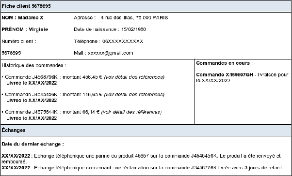
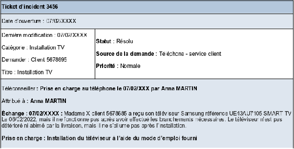
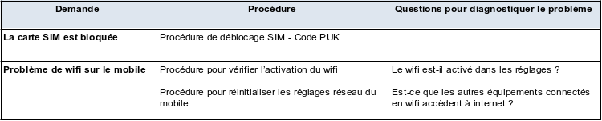

# Gérer les incidents et les problèmes

COURS COMPLET

**Apporter une assistance de niveau 1 (appel entrant):**

  

**Assurer un service client de qualité:**

### ***Contexte***

Le service de relation client permet de répondre aux demandes des clients d’une entreprise afin de leur apporter des conseils et des solutions à distance.

Le téléconseiller doit donc répondre à de nombreuses demandes de différentes natures après l’achat. Son rôle est très variable, il doit en effet rassurer, informer, conseiller traiter les problèmes des clients.

Le niveau 1 d’assistance client concerne des demandes simples et peu complexes que le téléconseiller peut traiter par lui-même, comme par exemple l’installation d’un équipement.

Nous détaillerons dans ce cours les techniques et les outils permettant au téléconseiller de traiter les demandes des clients par téléphone dans la téléassistance.

(vidéo)   
Dans un centre d’appel, le téléconseiller prend en charge les appels entrant des clients afin de répondre à leur demande. Les problèmes rencontrés etles différents incidents peuvent généralement être pris en charge directement par le téléconseiller. Ici on s’intéresse à l’assistance de niveau 1, celle qui traite les demandes simples et peu complexes et que le téléconseiller peut gérer par lui même, comme par exemple l’installation d’un équipement avec un mode d’emploi.On va découvrir les outils mis à la disposition du téléconseiller pour effectuer sa mission, la fiche client, le ticket d’incident, les modes d’emplois, les guides d’utilisations et les logigrammes.

 **Rappel de l’assistance client de niveau 1**

#### ***Définition***

####     **Centre de relation client**

Un centre de relation client est la structure qui gère l’ensemble des interactions à distance entre une entreprise et ses clients/prospects.

#### ***Définition***

####     **Centre d’appel**

Le centre d’appel fait partie du centre de la relation client. Il s’agit d’un centre téléphonique permettant la réception des appels de clients. Un centre d'appels est constitué d'un ensemble de postes de travail téléphoniques et de téléconseillers en charge des actions commerciales par téléphone.

#### ***Définition***

####     **La téléassistance**

La téléassistance, l'assistance en ligne ou encore l'assistance à distance, correspondent à l’action ou service qui permet d'aider à distance des utilisateurs, d'un système ou d'un produit, à l'aide d'un moyen de télécommunication.

#### **Le niveau 1 de la téléassistance dans les centres d’appels**

Dans un centre d’appel, le téléconseiller prend en charge les appels entrants des clients afin de répondre à leurs demandes. Les problèmes rencontrés et les différents incidents pourront être pris en charge directement par le téléconseiller. Pour cela, il devra prendre l’appel, enregistrer les informations dans le logiciel CRM en notant la date, le numéro client ou la référence, diagnostiquer le problème et guider les clients pour solutionner les problèmes rencontrés.

Son périmètre d’action est relativement limité, il a en général à sa disposition une documentation sur les problèmes les plus courants rencontrés par les clients.

Son périmètre d’action est relativement limité, il a en général à sa disposition une documentation sur les problèmes les plus courants rencontrés par les clients.

### **Utilité du CRM dans l’assistance au client de niveau 1**

#### ***Définition***

####     **Le CRM**

Le CRM (*Customer Relationship Management*) ou GRC (Gestion de la Relation Client) en français, permet de centraliser au sein d'une base de données toutes les interactions entre une entreprise et ses clients.

Dans l’assistance client, le CRM permet d’avoir accès en temps réel aux données des clients et de proposer donc un service personnalisé (gérer les demandes courantes, demandes d’informations, les incidents techniques, etc.).

L’assistance technique et le service client peuvent alors assurer une qualité de service client optimal et améliorer la résolution des problèmes afin d’intervenir plus rapidement.

#### **Les informations clients grâce aux logiciels CRM**

Pour que les téléconseillers puissent avoir une vision globale sur les clients et traiter efficacement leurs problèmes, ils doivent avoir accès à diverses informations :

* Les données des clients collectées (*par différents canaux) : site web, réseaux sociaux, etc.*  
* Les données collectées par les autres téléconseillers et par les différents services (service client, logistique, informatique, etc.).  
* Les différents échanges avec le client dans le centre client.

Le logiciel de phoning (intégré au CRM) permet de renseigner toutes les informations durant l’échange téléphonique avec le client. Les informations renseignées par le téléconseiller seront alors enregistrées et synchronisées dans le logiciel CRM.

(vidéo) 

La fiche client et un module dans un logiciel CRM qui permet de renseigner les donées et les informations d’un client. Celle-ci va permettre de visualiser les informations importantes du client afin de mieux répondre à sa demande. Nous pouvons donc renseigner dans la fiche client plusieurs informations comme le numéro client, les données personnelles du client, les échanges entre le client et l’entreprise ou encore les informations sur ses achats pour avoir des informations sur les produits qu’il a acheté et notamment la référence concernant la demande du problème.   

Autre élément important, le ticket d’incident est une fiche renseignant toutes les informations concernant l’incident et les problèmes rencontrés. Dans le cadre d’une panne, d’un dysfonctionnement, les tickets sont généralement créés par les téléconseillers ou générés automatiquement  via des outils digitaux. Pour les demandes par téléphone, le téléconseiller renseigne le nom du client et décrit clairement et précisément la demande ou la réclamation du client qui nécéssite un traitement. On trouve plusieurs champs à renseigner, qui sont généralement le numéro de l’incident, la date d’ouverture du ticket, la catégorie de l’incident, sa priorité le nom du téléconseiller ayant pris en charge sa demande ainsi que des précisions sur les échanges avec le client. Ces deux outils sont essentiels afin d’aporter une assistance au client. Ce sont eux qui donnent accès aux informations sur le client et sur son incident, pour cette raison il est aussi important de renseigner toutes les informations pour faire face à la prise en charge du client à des spécialistes.

#### **La fiche client**

La fiche client est un module dans les logiciels CRM permettant de renseigner les données et les informations d’un client. Celle-ci va permettre de visualiser les informations importantes du client afin de mieux répondre à sa demande.

Les informations suivantes peuvent être renseignées sur la fiche client :

* Données personnelles (nom et prénom, date de naissance, adresse postale, e-mail, numéro de téléphone, etc.)  
* Les échanges entre le client et l’entreprise (sur tous les canaux de contacts)  
* Ses achats (références, commandes, etc.)

#### ***Exemple***

******

#### ***Définition*****Les tickets**

Le système de tickets d'incident identifie les mots-clés dans la demande du client et extrait les articles pertinents du centre d'assistance.

Les informations peuvent être renseignées sur les tickets :

* Le numéro de l’incident  
* La date d’ouverture de l’incident  
* La catégorie (panne, problème d’installation, incident technique, etc.)  
* La source ou le canal (téléphone, e-mail, etc.)  
* La priorité (normale, urgente, très urgente)  
* Le nom du téléconseiller ayant pris en charge sa demande  
* Les précisions sur l’échange (une synthèse de la demande client et les échanges effectués)

Les téléconseillers peuvent généralement créer dans ces outils, pour chaque demande, un « *ticket* » avec un numéro unique. La plupart du temps, les demandes par mail génèrent automatiquement des tickets. Pour les demandes par téléphone, le téléconseiller renseigne le nom du client et décrit clairement et précisément la demande ou réclamation du client qui nécessite un traitement.

Le téléconseiller peut ensuite :

* Catégoriser le problème rencontré (assistance, panne, etc.)  
* Prioriser (urgent, normal, bas)  
* Qualifier (nouveau, en cours, en attente, résolu)

#### ***Exemple***

******

**Gestion d’un appel entrant dans la téléassistance de niveau 1:**  
**Gestion d’un appel entrant dans la téléassistance de niveau 1**

### **Préparation des demandes clients**

Afin de pouvoir résoudre lui-même les demandes clients courantes et peu complexes de niveau 1, le téléconseiller dispose d’un certain nombre d’outils et doit en amont connaître les différents supports mis à sa disposition afin de pouvoir traiter les demandes rapidement et efficacement.

#### **Identifier les demandes courantes**

Le téléconseiller doit pouvoir identifier rapidement le degré de complexité du problème ou de l’incident rencontré par le client avant de savoir s’il peut lui résoudre lui-même.

Dans l’assistance client, la majorité des demandes clients concernent les mêmes causes. Il s’agit généralement de problèmes courants pouvant être résolus simplement par le biais de différents supports comme les modes d’emploi ou les guides d’utilisation.

Le téléconseiller doit pouvoir fournir un complément d’information, de savoir-faire, en fonction du produit et du secteur concerné pour aider le client à utiliser ou mettre en œuvre le produit ou service.

Pour identifier le problème, le téléconseiller peut se poser les questions suivantes :

* Le problème est-il simple à résoudre ?  
* Le problème peut-il être résolu à l’aide d’un mode d’emploi ou d’un guide d’utilisation ?  
* Suis-je en mesure de résoudre le problème du client ?  
* Puis-je demander une information à un technicien ou une personne plus qualifiée afin de le transmettre au client ?

#### ***Remarque***

Pour aider le téléconseiller à identifier les problèmes simples et courants qu’il pourra résoudre, le centre d’appel indique généralement une liste déroulante avec les problèmes les plus courants.

#### ***Exemple*****Les problèmes courants chez les opérateurs téléphoniques**

* La carte SIM est bloquée  
* Problème de wifi mobile  
* Aucun service ne fonctionne sur le mobile  
* Problème de communication, de voix  
* Le mobile ne réagit pas aux actions faites sur l’écran  
* Le mobile a une autonomie de charge très faible  
* Le mobile est très chaud en utilisation ou en charge  
* Le son du mobile est inexistant

#### ***Complément***

Dans certains logiciels CRM, une procédure est proposée et intégrée à chaque demande courante. Cela permet au téléconseiller de traiter plus rapidement les demandes clients.

Il est également possible d’intégrer des questions précises à chaque demande afin de pouvoir diagnostiquer le problème du client.

#### ***Exemple***

******

Les incidents courants des clients doivent être résolus aussi rapidement que possible. Le téléconseiller doit donc faire face à des situations spécifiques et ne doit pas prendre trop de temps pour traiter les problèmes récurrents. Si le délai de résolution est trop long, le téléconseiller doit absolument en informer le client en lui donnant un délai approximatif.

#### **Les outils d’aide au traitement des demandes courantes**

Afin de traiter efficacement les demandes clients et résoudre les problèmes de niveau 1 dans la téléassistance, le téléconseiller peut disposer d’un certain nombre d’outils afin d’apporter des informations supplémentaires et guider les clients dans les opérations.

Le téléconseiller n’est pas un technicien et ne maitrise pas parfaitement tous les aspects techniques des produits ou services que l’entreprise commercialise. De ce fait, il doit se servir de documents internes apportant des précisions, des informations et des procédures permettant de résoudre les problèmes des clients.

#### ***Exemple***

Guider un client à distance dans l’installation d’une machine à laver à l’aide du mode d’emploi.

#### ***Définition*****Mode d’emploi**

Un mode d’emploi est un document pédagogique permettant d’expliquer et de faciliter l'utilisation (installation, montage) d'un produit ou d'un service, généralement fourni gratuitement avec le produit ou le service auquel il est attaché.

Le mode d’emploi est donc un support explicatif de la manipulation ou du fonctionnement du produit ou service acheté. Il peut avoir différentes formes, allant d’une simple feuille, au livre ou au classeur en plusieurs volumes.

Aujourd’hui, et surtout pour du matériel informatique, les modes d’emploi peuvent être fournis sous format numérique (logiciels, fichiers à télécharger, gravés sur CD ou encore sous format vidéo).

En France, les professionnels ont obligation de fournir un mode d’emploi aux acheteurs qui doit être rédigé clairement en français.

#### ***Exemple*****Extrait du mode d’emploi installation Samsung**

**![][image4]**

**![][image5]**

#### ***Définition*****Guide ou manuel d’utilisation**

Le guide, manuel ou encore notice d’utilisation est utilisé pour des objets ou services déjà fonctionnels qui ne nécessitent pas d’installation ni de montage. Le guide d’utilisation d’une machine, d’un objet, d’un logiciel ou de tout autre appareil se trouve souvent sous la forme d’un petit livret en papier. Certaines notices peuvent être aussi sous format numérique.

Un guide d’utilisation donne accès à toutes les indications pour faire bien fonctionner le produit ou le service. Ce document est donc utile pour le client, et pour le téléconseiller qui pourrait l’utiliser pour l’aider à résoudre son problème, si celui-ci peut être résolu à travers des opérations précises indiquées sur le manuel.

#### **La composition d’un guide d’utilisation**

Le guide d’utilisation est souvent confondu avec les autres types de modes d’emploi comme le [manuel d’installation](https://www.youscribe.com/page/mode-emploi/notice-installation), qui va principalement servir à installer un logiciel ou un produit. Cette erreur est due au fait que les modes d’emploi comprennent aussi des parties sur l’installation ou le montage. C'est notamment le cas pour les biens ou services qui peuvent être montés et/ou installés et qui nécessitent ensuite une notice pour pouvoir s’en servir et les faire fonctionner.

Dans la plupart des cas, ce type de document va être composé de plusieurs parties qui seront :

* La description du produit  
* Les différentes précautions d’utilisation  
* Les spécifications du produit ou services  
* Le fonctionnement général et spécifique  
* L’installation du bien ou service dans certains cas spécifiques comme les logiciels ou ordinateurs

#### ***Exemple***

####     **Extrait du guide d’utilisation Samsung**

Si le client rencontre des problèmes de blocage sur son téléphone, le téléconseiller pourra alors le guider en suivant la procédure du guide d’utilisation.

(Paramètres \- Confidentialité \- Rétablir les paramètres par défaut \- Réinitialiser le téléphone \- Supprimer tout)

![][image6]

![][image7]

#### ***Méthode***

#### **Résoudre un problème client à l’aide d’un mode d’emploi ou guide d’utilisation**

Pour assister un client dans la résolution d’un problème à l’aide d’un mode d’emploi ou d’un guide d’utilisation, le téléconseiller devra :

* Connaître les outils mis à sa disposition  
* Connaître le contenu des manuels et guides  
* Faire le lien entre les demandes les plus courantes et les parties des manuels pouvant y répondre  
* Parler lentement et répéter plusieurs fois les opérations si nécessaire  
* Être clair et utiliser un vocabulaire simple  
* Valider que l’étape énoncée ait été effectuée afin de passer à la suivante

#### **Demande de rappel**

Le téléconseiller n’est pas un technicien spécialisé. De ce fait, il peut se retrouver face à un problème qu’il ne pourra pas résoudre seul avec les outils mis à sa disposition.

Il peut éventuellement demander des conseils, des recommandations ou des précisions à ses supérieurs ou bénéficier d’une aide informatique ou technique par un spécialiste.

Pour cela, le téléconseiller ne pourra pas forcément résoudre le problème sur un seul échange, mais privilégiera plutôt une demande de rappel.

Le délai d’attente au téléphone étant une des principales sources d’insatisfaction des clients, il est donc préférable de proposer au client de le rappeler directement après avoir eu l’information nécessaire.

#### ***Exemple***

Suite à un problème technique, le téléconseiller doit demander à un technicien une confirmation sur une procédure spécifique. Il proposera alors de recontacter le client dans l’heure qui suit ou suivant les disponibilités du client.

#### ***Définition***

####     **Logigramme**

Un logigramme est un schéma qui décrit les étapes successives d’un processus.

Dans l’assistance client, le logigramme peut permettre au téléconseiller de prévoir la majorité des scénarios possibles d’appels pour chaque type de demande et de décomposer le processus d’un appel.

#### ***Fondamental***

####     **Les questions à se poser**

* Qui appelle ? *(Identifier le client)*  
* Pourquoi ? *(Identifier le problème, l’incident, la panne)*  
* Quelle suite donner à l’appel ? *(Comment résoudre directement le problème du client ? Quels outils peut-on utiliser pour guider le client à distance ?)*  
* À qui et comment puis-je transmettre l’information ? *(Quel technicien peut apporter des informations supplémentaires pour aider le client ? Effectuer une demande de rappel ?)*

Les appels entrants sont plus complexes à gérer que les appels sortants d’une façon générale. En effet, dans l’assistance client, le téléconseiller réceptionne des appels qu’il ne maitrise pas et doit traiter des problèmes. Il ne peut pas savoir à l’avance qui ne l’appelle ni la demande en question.

Le logigramme est donc un outil efficace permettant d’apporter une aide au téléconseiller et de pouvoir visualiser un processus complet sur les demandes les plus simples et courantes à gérer.

#### ***Remarque***

Pour qu’il soit efficace, le logigramme doit être allégé en explications et en textes. Il peut également être intégré au logiciel CRM ou de phoning pour plus de praticité.

#### ***Exemple***

####     **Le logigramme d’une panne de téléphone**

**![][image8]**

### **Conseiller et répondre aux demandes clients par téléphone**

#### ***Fondamental***

####     **La gestion d’un appel entrant**

Dans la gestion des problèmes clients, l’écoute active est primordiale afin de bien comprendre et diagnostiquer le problème du client.

Avant que le téléconseiller ne prenne en charge l’appel et la demande du client, l’appel atterrit généralement sur une messagerie vocale. Le délai d’attente des clients est une source d’insatisfaction. L’organisation du centre d’appel ainsi que les téléconseillers doivent alors veiller à réduire le temps d’attente pour améliorer la prise en charge des clients et pouvoir traiter plus d’appels.

#### ***Méthode*****Les étapes du déroulement d’un appel entrant**

Le téléconseiller doit gérer les appels entrants des clients. Pour cela, la méthode CERC (Contact, Écoute, Raison, Conclusion) peut être utilisée.

**1\) Accueillir le client**

| Se présenter | S’identifier en indiquant son nom, l’entreprise et le service. Cela va permettre au client de s’assurer qu’il est bien en ligne avec le bon interlocuteur. Si ce n’est pas le cas, il conviendra de réorienter le client. *Exemple : « la société X, monsieur Y ou le prénom téléconseiller client, que puis-je faire pour vous ?»* Remarque : certains centres d’appels utilisent le prénom pour se présenter afin de créer un lien de proximité avec le client et de rendre l’échange plus convivial. |
| :---- | :---- |
| **Prendre compte le délai d’attente du client** | L’attente peut sembler très longue pour un client au téléphone quand il a un problème à résoudre. Cela peut également l’agacer. Il est donc indispensable de remercier le client d’avoir patienté. *Exemple : « Je vous remercie d’avoir patienté »* |
| **Identifier le client** | Afin de ne pas agacer le client, il faut éviter de redemander au client des informations qu’il a déjà donné (au standard téléphonique par exemple). Il convient donc de repérer le plus rapidement possible le client et son dossier à partir d’un numéro client, de facture, de commande, le nom l’adresse, etc. *Exemple : « Vous êtes bien Monsieur X, domicilié au, etc. ? »* |
| **Personnaliser l’échange** | Il faut utiliser le nom du client afin lui montrer de l’intérêt dans la suite de l’échange. *Exemple : « Monsieur X, vous souhaitez, etc. »* |

**2\) Prendre en compte le problème**

| Pratiquer l’écoute active | Le téléconseiller doit savoir écouter réellement le client et surtout ne pas couper la parole au client pendant qu’il expose sa demande et explique son problème. Il est nécessaire de faire preuve d’empathie, de comprendre le client et se mettre à sa place. *Exemple : « Je comprends très bien votre préoccupation et nous sommes désolés, etc. »* |
| :---- | :---- |
| **Reformuler le problème** | La reformulation est la base de l’écoute active. Reformuler les propos du client permet de s’assurer de bien comprendre la requête afin d’éviter les malentendus, les quiproquos, mais également de pouvoir répondre de manière efficace à la demande du client. *Exemple : « Donc, si j’ai bien compris, vous rencontrez un problème au niveau... vous souhaitez... C’est bien cela ? »* |
| **Rester positif** | Au téléphone, le comportement paraverbal est primordial. L’intonation de la voix du téléconseiller est importante dans l’échange. En effet, le client sentira si le téléconseiller sourit ou non et s’il est attentif à son besoin. Il faut éviter les mots ou phrases négatives. *Exemple : évitez les mots « avoir des problèmes », « des soucis », etc.* |
| **Faire préciser le problème si besoin et l’identifier** | Il est essentiel également de laisser au client le temps d’exposer et de préciser son problème sans l’interrompre. Le téléconseiller peut alterner avec des questions ouvertes et questions fermées. La question fermée valide les dires du client. *Exemple :* *« Vous souhaitez donc obtenir votre code PUK votre débloquer votre carte SIM c’est bien cela ? »* La question ouverte permet de préciser la demande. *Exemple : « Quelles informations s’affichent sur votre logiciel ? »* |

**3\) Traiter le problème**

| Rechercher les informations nécessaires | Le téléconseiller doit rechercher les informations précises permettant de répondre à la demande du client. *Exemple : informations du compte client, commande, procédure technique qui permettra de résoudre le problème du client, etc.* |
| :---- | :---- |
| **Proposer une demande de rappel si nécessaire** | Si le téléconseiller ne sait pas ou ne peut pas résoudre le problème, il doit préciser au client qu’il va demander une confirmation ou une réponse à un technicien et proposer ainsi au client de le rappeler directement afin d’éviter de le faire patienter. *Exemple : « Monsieur X, je vais demander confirmation au service technique pour cette manipulation et je vous contacte d’ici 30 min. Cela vous contient-il ? »* |
| **Préciser au client tout ce que vous faites durant le traitement de son problème** | Le silence fait douter le client et peut également l’agacer. Il peut également penser que la conversation est coupée ou que le téléconseiller est en train de traiter autre chose. Il faut donc expliquer au client ce que vous êtes en train de faire à chaque étape. *Exemple : « Monsieur X, j’accède à présent à votre dossier, etc. Je recherche les informations, etc. je me rapproche de la notice d’utilisation afin de vous guider. »* |
| **Expliquer de manière simple et claire** | Le vocabulaire utilisé par le téléconseiller ne doit pas être trop technique et doit être adapté au client. Il est préférable d’utiliser des phrases courtes, car cela évite les incompréhensions et permet au client de comprendre facilement ce qui lui est expliqué. |
| **Envoyer une confirmation** | *Exemple : « monsieur X, je vous envoie un mail afin de récapituler notre échange ou confirmer la manipulation effectuée. »* |

**4\) Prendre congé**

| S’assurer de bien avoir traité la demande du client | À la fin de l’échange, le téléconseiller doit valider que la demande est bien satisfaite et avoir ainsi satisfait les besoins du client. *Exemple : « Ai-je bien répondu à votre demande ? » « Avez-vous d’autres questions ? »* |
| :---- | :---- |
| **Remercier le client** | Il faut faire savoir au client que l’entreprise reste à sa disposition et prendre congé de façon cordiale. **Remarque :** attention, il ne faut pas réciter sa conclusion d’entretien sans laisser le temps au client de répondre. La fin de l’échange doit se terminer de façon agréable et naturelle. *Exemple : « L'entreprise X vous remercie pour votre appel, nous restons à votre disposition... passez une bonne journée, Monsieur X, au revoir »* |

#### ***Complément*****Fidéliser la clientèle dans l’assistance client**

Le traitement des appels entrants et la résolution d’un problème client peut également être l’occasion d’un contact direct avec le client, qui peut aussi être un moment propice pour le fidéliser et dans certains cas, de développer les ventes.

En fonction de la demande du client, le téléconseiller peut ainsi tenter de réaliser, si cela est nécessaire, des ventes complémentaires ou additionnelles (*cross-selling* ou vente croisée) qui consistent à proposer d’autres produits complémentaires au produit acheté de base.

#### ***Exemple***

Pour un vendeur de téléphones, un accessoire comme une carte mémoire ou une protection d’écran.

**Essentiel**

Dans la téléassistance, le téléconseiller peut prendre en charge et résoudre des problèmes simples et courants. Pour cela, il devra respecter les étapes et les procédures permettant de bien traiter les demandes. Celle-ci nécessite une phase de préparation et une phase traitement de l’appel entrant d’un client.

**Préparation :**

* **Avoir une bonne connaissance du logiciel CRM** de l’entreprise (fiche client, fiche incident)  
* **Avoir une bonne connaissance des outils mis à disposition** pour résoudre les demandes courantes (manuel, guide d’utilisation, logigramme, procédures, etc.)

**Prise en charge d’un appel :**

* **Accueillir le client** (identifier le client, prendre en compte son délai d’attente, etc.).  
* **Prendre en compte sa demande** (identifier avec précision la nature de l’appel, poser des questions et reformuler pour bien diagnostiquer le problème).  
* **Traiter sa demande**  
  * Demande simple pouvant être résolue à distance : résoudre le problème du client à distance et le guider dans les opérations à l’aide d’outils internes.  
  * Demande plus complexe : demander une procédure de rappel afin de rappeler le client en ayant toutes les informations nécessaires et fiables.  
* **Prendre congé** (mettre fin à l’échange et remerciant le client, s’excusant si nécessaire et cela peut également être la possibilité de le fidéliser).

Le traitement des appels entrants et la résolution d’un problème client peut également être l’occasion d’un contact direct avec le client, qui peut aussi être un moment propice pour le fidéliser et dans certains cas de développer les ventes. Généralement une enquête de satisfaction peut être transmise aux clients afin d’évaluer la satisfaction sur la prise en charge du problème. Il ne faut pas oublier que le traitement d’un problème client peut être un excellent moyen de le satisfaire, le fidéliser et de le faire recommander l’entreprise.

**L’utilisation des techniques d’investigation au téléphone:**

### ***Contexte***

Pour être un bon technicien, il faut savoir allier compétences techniques et compétences en communication. Développer ces deux capacités fera de vous un technicien qualifié. Dans ce cours, vous verrez comment assister les utilisateurs en diagnostiquant leurs problèmes, en menant une investigation au téléphone et en gérant votre stress.

En entreprise, lorsqu'un utilisateur rencontre un problème sur un appareil informatique, il se tourne vers un technicien informatique. L'utilisateur sera alors amené à vous contacter, le plus souvent par téléphone, et vous aurez à résoudre son problème. Pour résoudre les différents problèmes auxquels vous serez confrontés, il est recommandé d'être méthodique, en effectuant les démarches suivantes : comprendre les symptômes rencontrés par l'utilisateur, cibler la cause du problème, émettre un diagnostic, mettre en place la solution, répertorier le problème et sa solution dans une base de données d'incidents.

### ***Définition***

###     **Un diagnostic**

En informatique, un **diagnostic** permet de déterminer un problème particulier en recherchant des signes et des symptômes.

### **Les causes du problème**

Les causes du problème peuvent être d'ordre physique ou système.

**Les causes physiques :**

* Cause électrique (mauvais branchement de l'appareil, panne électrique),  
* Problème de connectivité (câble défectueux ou débranché entre deux appareils),  
* Composant défectueux (ne fonctionne plus).

**Les causes système :**

* Problème de configuration du BIOS (mauvais paramétrages),  
* Problème du système d'exploitation (altération d'un fichier système, programme qui ne se lance pas),  
* Problème logiciel (mal installé, problème de compatibilité, etc.).

### **Identifier les symptômes provoqués par l'erreur**

Lorsque vous êtes face à un problème, il est important d'établir une démarche qui vous permettra d'identifier la source des problèmes. Pour cela, posez-vous les bonnes questions :

* **Depuis quand l'erreur est-elle présente ?**  
  Beaucoup d'événements peuvent entraîner un dysfonctionnement (nouvel utilisateur, nouveau logiciel, changement de matériel, etc.). Trouvez depuis quand exactement l'erreur est apparue et dans quelles circonstances : cela permettra de trouver l'erreur rapidement.  
* **Quand l'erreur est-elle apparue ?**  
  Déterminer le moment où est apparue l'erreur peut permettre de définir plus précisément la cause de l'erreur.  
* **L'erreur se reproduit-elle ?**  
  Si l'erreur se produit à plusieurs reprises, prenez connaissance des conditions précises dans lesquelles elle se produit.  
* **Comment l'erreur apparaît-elle ?**  
  Déterminez comment l'erreur apparaît, quel signal sonore se produit, quel est l'intitulé exact du message d'erreur, s'il existe d'autres signes qui indiquent un problème, un bruit anormal ou une odeur de brûlé par exemple.

**Communiquer efficacement avec le client**

La communication passe par l'écoute et la parole. Une communication efficace passe d'abord par une écoute active de votre interlocuteur. C'est-à-dire qu'il vous faut rester attentif tout au long de la conversation.

**Lors de votre écoute :**

1. Évitez d'être distrait lors de votre écoute, en choisissant un environnement calme et propice à une bonne concentration.  
2. Concentrez-vous à 100 % sur votre conversation avec votre interlocuteur. Si un de vos collègues vous parle, dites-lui que vous êtes occupé.  
3. Restez concentré sur les informations que vous donne votre interlocuteur et ne pensez pas d'avance à vos prochaines questions.  
4. Ne jugez pas votre interlocuteur, même s'il ne s'y connaît pas en informatique. Il pourra vous apporter des informations utiles à la résolution des problèmes.  
5. Ayez une communication active :  
   * Réceptionnez les informations,  
   * Écoutez attentivement,  
   * Souvenez-vous de toutes les informations,  
   * Évaluez le problème,  
   * Répondez à ses attentes.  
6. En agissant ainsi, vous prouverez à votre interlocuteur que vous êtes réellement investi dans la résolution de son problème.  
7. Prenez en compte les signaux de communication verbale :  
   * Soyez attentif au débit de parole de votre interlocuteur. Plus votre interlocuteur parle vite, plus il est stressé. Il vous faudra alors faire en sorte que son stress diminue.  
   * Écoutez le ton employé. Le ton employé est différent selon l'état émotionnel de la personne. Est-il agressif, joyeux ou angoissé ? Aidez votre interlocuteur à retrouver un état émotionnel stable, cela vous permettra de résoudre le problème plus facilement.

### ***Exemple***

***![][image9]***

*Source : noemiefoulon.com/2017/11/14/astuces-mieux-communiquer-au-quotidien/schema-communication-positive-message/*

**Être efficace lors de l'écoute :**

* Être attentif,  
* Comprendre le niveau de votre interlocuteur,  
* Comprendre l'état émotionnel de votre interlocuteur,  
* Prendre des notes,  
* Ne pas supposer,  
* Ne pas couper la parole,  
* Ne pas juger.

**Prendre la parole :**

Votre interlocuteur attend beaucoup de vous, il vous faudra prendre la parole afin de le rassurer et lui apporter la réponse à son problème.

Lorsque vous prenez la parole, montrez à votre interlocuteur que vous le comprenez et que vous êtes attentif à ce qu'il souhaite. Cela vous permettra de le mettre en confiance. Si l'interlocuteur se sent respecté, il sera plus apte à vous aider dans l'analyse du problème. Cela donnera également une bonne image du service ou de l'entreprise pour laquelle vous travaillez.

**Être efficace lors de prises de parole :**

* Tenez-vous droit pour avoir une voix claire.  
* Ne soyez pas stressé pour ne pas transmettre votre malaise à votre interlocuteur.  
* Soyez naturel.  
* Souriez. Le sourire s'entend au téléphone.  
* Parlez calmement et distinctement pour que votre interlocuteur comprenne bien vos propos.  
* Ne faites pas deux choses à la fois.  
* Respirez lentement.  
* Soyez dynamique dans vos réponses.  
* Perdez vos tics de langage.  
* Mettez-vous à la place de votre interlocuteur.

**Techniques d'investigation au téléphone**

Lors de votre communication au téléphone, il vous faudra mener une investigation auprès de votre interlocuteur pour comprendre quel est son besoin et son problème. Pour répondre le plus précisément possible, il est nécessaire d'être méthodique.

Les étapes d'une conversation doivent être les suivantes :

1. Accueillir,  
2. Écouter,  
3. Déterminer les besoins,  
4. Répondre aux besoins,  
5. Obtenir un point d'accord avec l'appelant,  
6. Conclure la conversation,  
7. Vérifier *a posteriori*.

**Les techniques d'investigation vous permettront de déterminer les besoins tout en écoutant votre interlocuteur (deuxième et troisième étapes d'une conversation).**

### **L'écoute**

Pour déterminer les besoins de votre interlocuteur, la première étape est d'être à l'écoute. Trop souvent, l'utilisateur ne peut pas exprimer son problème comme il le souhaiterait. Pourtant, c'est bien au technicien de l'écouter jusqu'au bout sans lui couper la parole. En faisant cela, votre interlocuteur sera plus en confiance avec vous, ce qui vous permettra d'avoir de bons retours sur vos prestations.

Écoutez votre interlocuteur jusqu'au bout, même si ses propos ne vous semblent pas logiques. Écouter quelqu'un ne veut pas forcément dire être d'accord avec lui ; vous avez tout à fait le droit de ne pas être d'accord avec votre interlocuteur, mais il est quand même important de l'écouter jusqu'au bout. Vous aurez l'occasion de donner votre avis plus tard, après avoir fini votre investigation.

Restez disponible, montrez à votre interlocuteur que vous êtes concentré sur ce qu'il vous raconte et que vous ne faites pas plusieurs choses à la fois (ne vous laissez pas déranger).

### **Le questionnement**

Après avoir écouté votre interlocuteur, il va falloir le guider pour qu'il vous apporte plus d'informations sur sa demande. Pour cela, il va falloir lui poser des questions qui porteront sur trois aspects :

* L'aspect technique (que sait-il vraiment de son problème ?),  
* Son avis (quel est son avis sur le problème ?),  
* Ses émotions (comment se sent-il vis-à-vis du problème ?).

Lorsque vous allez questionner votre interlocuteur, il va falloir choisir entre différents types de questions :

* **Les questions ouvertes**  
  La question ouverte va amener l'interlocuteur à s'exprimer sur le problème. Une question ouverte peut être : « *Quelle est l'origine du problème ?* » Souvent, les questions ouvertes ne permettent pas d'apporter une réponse aussi précise que les questions fermées. La réponse sera plus évasive, mais vous dévoilera néanmoins des indices sur ce que pense votre interlocuteur.  
* **Les questions fermées**  
  Les questions fermées contraignent votre interlocuteur à donner une réponse peu explicite : « *oui* » ou « *non* ». Même si, avec ce genre de questions, l'interlocuteur ne pourra pas vous parler de façon détaillée de la situation, elles vous permettront de cibler plus précisément le problème, en éliminant ou en validant des hypothèses. L'interlocuteur sera alors amené à faire un choix qui vous permettra d'y voir plus clair. La question peut être : « *Votre ordinateur a-t-il redémarré dans la matinée ?* »  
* **Les questions orientées**  
  Les questions orientées ne sont pas à favoriser dans ce genre d'entretien. En effet, elles peuvent influencer votre interlocuteur qui se fierait à votre avis pour répondre. Les questions orientées peuvent être : « *Ne pensez-vous pas que le problème provienne de la dernière mise à jour ?* »  
* **Les questions neutres**  
  Les questions neutres sont à privilégier, car elles permettent de ne pas influencer l'interlocuteur et, ainsi, de le laisser exprimer son opinion. Une question neutre peut être : « *Que pensez-vous des mises à jour ?* »

### **Relancer l'interlocuteur**

Lorsque vous posez des questions à votre interlocuteur, celui-ci peut vous apporter une réponse que vous ne trouvez pas satisfaisante. Si c'est le cas :

* Validez ses propos (d'accord, je comprends, etc.), il comprendra qu'il est écouté.  
* Utilisez des phrases neutres qui vont le pousser à vous en dire plus : « *C'est-à-dire ?* »  
* Paraphrasez votre interlocuteur pour le pousser à vous donner plus de détails. S'il vous dit : « *L'ordinateur ne s'allume pas.* » Répondez-lui : « *Il ne s'allume pas ?* » Votre interlocuteur pourra alors vous donner plus de détails : « *Oui, l'écran est tout noir.* »

### **Recentrer l'interlocuteur sur le sujet de son appel**

Si votre interlocuteur commence à parler de sujets qui n'ont aucun rapport avec l'origine de son appel, il vous faudra le ramener délicatement au sujet principal. Vous pourrez utiliser l'argument du temps tout en faisant attention à ne pas lui couper la parole.

### **Reformuler les propos de l'interlocuteur**

À ce stade, vous en savez plus sur ce que pense votre interlocuteur. Pour vous assurer que vous avez bien compris ce que votre interlocuteur vient de vous dire, il va vous falloir reformuler ses propos.

Vous allez répéter toutes les informations que vous a apportées votre interlocuteur, en les reformulant de façon plus concise.

Rappelez les faits et les ressentis de la personne.

En reformulant et en utilisant les termes appropriés, vous allez mettre le point sur des éléments flous pour votre interlocuteur.

Si votre interlocuteur acquiesce, votre formulation est correcte.

La reformulation vous permettra également de reprendre le contrôle de la situation, mais ce n'est pas un exercice facile et il vous faudra de l'entraînement pour parvenir à reformuler les propos de votre interlocuteur. Pour réussir, il vous faudra prendre de la distance à l'égard de ces propos, comprendre la situation du point de vue de l'interlocuteur sans déformer ses propos.

Cette technique vous permet de vérifier que vous avez bien compris ce que vous demande votre interlocuteur et, ainsi, de vous concentrer sur les faits et non pas les suppositions.

### ***Exemple***

Vos reformulations peuvent commencer par : « *Si j'ai bien compris la situation...* », « *Pour résumer...* », « *Autrement dit...* », etc.

### **Synthétiser**

À la fin de votre entretien, vous pouvez faire un résumé de ce qui a été dit et de ce dont vous avez convenu tout au long de la conversation. Il est important de rappeler tous les points importants de l'entretien pour vous assurer que vous et votre interlocuteur êtes d'accord.

**Gestion du stress**

### ***Définition***

###     **Le stress**

Le **stress** peut être défini comme tout type de changement qui provoque une tension physique, émotionnelle ou psychologique. Le stress est la réponse de votre corps à tout ce qui nécessite une attention ou une action. Tout le monde a un certain degré de stress. Cependant, la façon dont vous réagissez au stress peut avoir un impact majeur sur votre santé globale.

Lorsqu'une personne ressent du stress, son corps peut réagir de différentes manières :

* Accélération du rythme cardiaque  
* Accélération de la respiration  
* Tremblements  
* Transpiration  
* Crampes d'estomac, etc.

**On distingue deux types de stress : le bon et le mauvais.**

* Le bon stress permet d'accroître la productivité en vous mettant dans de bonnes conditions.  
* Le mauvais stress est un stress accru dont le seuil varie d'un individu à l'autre et qui diminue la productivité.

Pour ne pas subir de mauvais stress, il va vous falloir apprendre à le gérer. Ce n'est pas simple et il vous faudra d'abord identifier quels sont vos facteurs de stress.

### ***Exemple***

***![][image10]***

**Déterminez quand et comment se développe votre stress :**

* Quels sont les facteurs aggravants ?  
* Quand se développe votre stress (contexte) ?  
* À quoi pensez-vous lorsque vous êtes stressé ?  
* Comment vous comportez-vous en période de stress ?

**Établissez une stratégie préventive et active :**

* Préventive : améliorez votre hygiène de vie, accordez-vous des moments de détente.  
* Active : contrôlez vos émotions, chassez vos pensées irrationnelles, relaxez-vous.

**Gérez votre stress en situation d'assistance :**

Il peut arriver régulièrement que vos interlocuteurs soient mécontents et contrariés. Ne le prenez pas personnellement. Prenez du recul et gérez vos émotions.

**Si votre interlocuteur émet une critique négative :**

* Écoutez-le sans l'interrompre.  
* Remerciez-le pour vous avoir donné son avis.  
* Ne le critiquez pas à votre tour, mais exprimez plutôt vos accords et vos désaccords.  
* Demandez à votre interlocuteur comment le service pourrait être amélioré.  
* Prenez des engagements réalistes vis-à-vis de ses requêtes.

Il est important de rester courtois tout au long de l'échange.

**Utiliser un script de questionnement:**

### ***Contexte***

Nous allons voir comment fonctionne un script de questionnement, comment le créer et analyser le profil type des utilisateurs qui nous contactent.

### **Le technicien Help Desk**

Le technicien Help Desk a pour mission d'aider chaque utilisateur ayant besoin d'une assistance sur un produit ou un service à distance.

Pour répondre à ses besoins, il aura à sa disposition un script de questionnement indispensable pour résoudre la problématique le plus simplement et le plus concrètement possible.

**Profils types d'utilisateur**

### **Plusieurs profils**

Nous pouvons rencontrer plusieurs profils d'utilisateurs et, bien que la façon de les assister reste la même, il est nécessaire de les prendre en compte.

* **L'utilisateur qui n'a aucune connaissance :**  
  Avec ce type d'utilisateur, il faudra aller le plus doucement possible et poser des questions simples.  
* **L'utilisateur qui a essayé de résoudre le problème seul :**  
  Ces utilisateurs peuvent avoir réglé une grande partie du problème, ou au contraire aggravé la situation. Dans ce cas, la problématique deviendra plus complexe.  
* **L'utilisateur ayant de bonnes connaissances :**  
  Ici, l'utilisateur devrait comprendre rapidement ce que vous lui demandez.

**Résoudre une problématique**

### **La problématique d'un utilisateur**

Pour résoudre la problématique d'un utilisateur, la meilleure façon de procéder est de toujours utiliser le script de questionnement, aussi appelé l'organigramme de diagnostic.

Les questions et le schéma de raisonnement sont faits pour être les plus concrets possible, et résoudre une problématique sans accroc.

### ***Attention***

L'utilisateur ne nous dira pas d'où vient le problème, mais il nous décrira les conséquences constatées.

**Comprendre un organigramme**

### **Un organigramme**

Un organigramme est constitué de plusieurs éléments géométriques ayant chacun une signification. Il sert à obtenir un schéma de questions/réponses pour pouvoir simplement trouver ce qu'il faut faire ensuite. Si le problème n'est toujours pas résolu en ayant utilisé cet organigramme, l'utilisateur est transféré chez un technicien d'un niveau supérieur afin de résoudre le problème rapidement.

### ***Exemple***

###     **Éléments graphiques**

**![][image11]**

Cet élément indique le début ou la fin d'un script.

![][image12]

Cet élément indique une question, qui va déterminer la suite du script.

![][image13]

Cet élément indique une opération à réaliser.

![][image14]

Cet élément indique un lien avec un autre script.

### **La structure**

Maintenant que nous savons à quoi ressemble chaque partie de l'organigramme, nous pouvons en créer un. Gardons en tête qu'il n'y a toujours qu'un seul point d'entrée pour chaque élément.

### ***Exemple***

###     **Structure**

**![][image15]**

Au niveau « *Question* », vous posez une question fermée à l'utilisateur : selon sa réponse, vous serez redirigé vers l'action A si la réponse est *Oui*, ou à la réponse B si la réponse est *Non*.

**Mise en situation professionnelle**

### ***Exemple***

Voici un exemple concret d'un opérateur recevant l'appel d'un utilisateur, avec un organigramme montrant le chemin emprunté dans la conversation.

*Opérateur \= O*

*Utilisateur \= U*

O : bonjour, ici O, de l'entreprise Studi.

U : bonjour, je suis U de l'entreprise Exemple, mes identifiants d'entreprise sont \*\*\*\*\*\*\*.

O : très bien, comment puis-je vous aider, U ?

U : mon ordinateur fixe ne s'allume pas, que pouvez-vous faire ?

O : Nous allons nous en occuper. Pouvez-vous essayer de voir si le câble d'alimentation de l'ordinateur est branché ?

*Nota Bene : à ce moment-là, l'opérateur va poser plusieurs questions pour trouver la panne et savoir s'il peut trouver la source du problème.*

U : oui, mon câble d'alimentation est bien branché.

O : votre ordinateur fait-il du bruit ou de la lumière à certains endroits ?

U : je l'entends faire du bruit, mais rien ne s'affiche sur mon écran, etc.

O : veuillez vérifier que votre écran est bien branché à l'alimentation, et qu'il est bien relié à votre ordinateur.

U : je viens de voir que l'alimentation de l'écran a été enlevée \! Je vais le rebrancher.

O : votre écran s'allume-t-il ?

U : non, il est toujours noir avec une petite lumière orange.

O : cela veut dire qu'il s'est mis en veille, appuyez sur la lumière orange pour l'allumer.

U : mon ordinateur s'est rallumé \! Merci beaucoup, O.

O : passez une bonne journée, U, n'hésitez pas à appeler si vous rencontrez le moindre problème.

U : bien sûr, je n'hésiterai pas, au revoir.

Maintenant que nous avons eu cette discussion, nous pouvons schématiser le parcours que celle-ci a suivi. Il va de soi que ce schéma varie selon les entreprises, qui ont toutes leurs propres façons de procéder.

### ***Méthode***

***![][image16]***

Comme vous pouvez le voir, un organigramme devient rapidement complexe et difficile à comprendre. C'est pour cela que l'on utilise des procédures pour relier les scripts entre eux.

### ***Exemple*****Autre cas**

Prenons, par exemple, un utilisateur ayant un problème avec le son de son ordinateur fixe.

L'opérateur va chercher l'origine du problème et, en fonction des réponses, il partira dans un embranchement différent de scripts, car chaque cas est unique.

Il commence par se demander ce qu'il s'est passé avant que le problème ne survienne. Si rien de particulier ne s'est produit, il regardera si ce n'est pas le matériel audio qui est abîmé. Si ce n'est pas le cas, il choisira le script qui lui permettra de vérifier l'appareil.

Nous allons donc suivre de façon concrète le chemin parcouru par l'utilisateur et l'opérateur, dans le cas où l'utilisateur rencontre un problème audio sur son ordinateur fixe.

*Opérateur \= O*

*Utilisateur \= U*

O : bonjour, ici O, de l'entreprise Studi.

U : bonjour O, je m'appelle U, je suis de l'entreprise Exemple, mes identifiants d'entreprise sont \*\*\*\*\*\*\*.

O : très bien, comment puis-je vous aider, U ?

U : le son de mon casque audio est bizarre, je n'ai plus que le son dans le côté droit.

O : essayez de débrancher et de rebrancher votre casque, cela peut venir d'un mauvais branchement.

U : je viens de le faire et ça ne marche toujours pas.

O : avez-vous un autre casque à disposition pour voir si le problème vient du casque ou de l'ordinateur ?

U : oui, je viens d'en essayer un autre, mais c'est toujours la même chose.

O : on va vérifier si le problème ne viendrait pas de l'ordinateur. Savez-vous si votre ordinateur est sous Windows ?

U : oui \! Il est sous Windows 10\.

O : très bien, il faudrait que vous alliez dans le menu « *Démarrer* » de votre ordinateur, et que vous tapiez sur le clavier « *Gestionnaire de périphériques* ».

U : j'y suis.

O : ici, vous trouverez une icône « *Contrôleur audio* », cliquez dessus.

U : cela m'affiche un casque audio avec une icône jaune et un point d'exclamation.

O : cela doit être la source du problème, je vais donc prendre la main et vous installer le pilote qui pose problème.

Nous sommes passés par plusieurs étapes : en sachant que le casque audio n'était pas défaillant, nous sommes passés à côté du script servant à le réparer. Nous sommes alors rentrés dans le script des *drivers* dès que nous l'avons diagnostiqué.

### ***Méthode***

***![][image17]***

**L’utilisation d’une base de connaissance:**

### ***Contexte***

Nous allons explorer en détail l'utilisation d'une base de connaissances et la création d'articles dans le Gestionnaire Libre de Parc Informatique (GLPI), spécifiquement configuré sur une machine virtuelle Debian 10\. Notre objectif est de développer une compréhension approfondie de ces fonctionnalités essentielles pour optimiser la gestion informatique au sein de votre environnement.

**Les principales informations à connaître sur la base de connaissances du Gestionnaire Libre de Parc Informatique (GLPI)**

La base de connaissances présente dans le Gestionnaire Libre du Parc Informatique (GLPI) répond à 2 catégories, qui sont les plus couramment utilisées :

* La **centralisation des connaissances** liées aux différents techniciens (rédigées par les techniciens, non visibles par les utilisateurs).  
* La **Foire Aux Questions** (**FAQ**) qui permet aux utilisateurs de rechercher la réponse aux questions qu’ils se posent et de résoudre certains problèmes de manière autonome avant de contacter le service technique. Elle est rédigée par les techniciens à l’intention des utilisateurs, elle est donc visible par les utilisateurs.

![][image18]

Par défaut, un article ajouté à la base de connaissances est simplement lisible par le technicien rédacteur. Il est dans l’obligation de préciser une ou plusieurs cibles pour que la procédure soit publiée et consultable.

En fonction de la ou des cibles choisies, l’article peut être placé dans la FAQ (destinée aux utilisateurs) ou dans la centralisation des connaissances (destinée aux techniciens).

![][image19]

**Utilisation d'une base de connaissances**

### ***Méthode***

###     **Ajout, modification, suppression de catégories de la base de connaissances**

**Étape 1** : dans l'onglet « ***Configuration*** » (1), cliquez sur « ***Intitulés*** » (2).

![][image20]

**Étape 2** : dans le menu « ***Outils*** » (1), cliquez sur « ***Catégories de la base de connaissances*** » (2).

![][image21]

**Étape 3** : cliquez sur le signe « ***\+ Ajouter*** » présent en haut de l'écran.

![][image22]

**Étape 4 :** ajoutez un « ***Nom*** » (1) ainsi qu'un « ***Commentaire*** » (2) à votre catégorie, puis cliquez sur « ***Ajouter*** » (3).

![][image23]

**Étape 5** : pour accéder aux catégories que vous avez créées, cliquez sur « ***Catégories de la ...*** » :

![][image24]

**Étape 6** : cliquez sur la catégorie, ici, ce sera « ***Pannes récurrentes*** ».

![][image25]

**Étape 7** : vous pouvez modifier la catégorie (1) ainsi que la supprimer définitivement (2).

![][image26]

(vidéo) Configuration de la base connaissances

Il s’est connnecté avec un compte super administrateur. Il faut avoir l’onglet configuration et l’onglet outils. Dans configuration, on va dans intitulé, on clique sur ajouter et on donne le titre (et un commentaire non obligatoire) puis “Comme enfant de” permettrai de définir une catégorie comme l’enfant d’une autre catégorie puis cliquer sur ajouter. Pour modifier une catégorie, on va sur la catégorie puis on clique sur modification ou on peut changer le nom le commentaire et l’enfant de quelle catégorie il est. Dans l’onglets “catégories de la base de cannaissances” (avec un s ici différent de l’autre catégorie du même nom mais sans s) on peut cliquer sur ajouter directement depuis la catégorie voulue la connaissance ajoutée sera directement ajouté comme enfant de cette catégorie. Si on supprime une catégorie, ça ne supprime pas les connaissances dedans mais les transfert à la catégorie au dessus.

### **Création d'un article**

**Étape 1** : dans l'onglet « ***Outils*** » (1), cliquez sur « ***Base de connaissances*** » (2).

![][image27]

**Étape 2** : cliquez sur le signe « ***\+ Ajouter*** » présent en haut de l'écran.

![][image28]

**Étape 3** : remplissez l'article :

* Choisissez la catégorie de l'article (1).  
* Si vous voulez qu'il fasse partie de la FAQ ou non (2).  
* Définissez une durée ou non (3).  
* Donnez un sujet à l'article (4).  
* Remplissez le contenu de l'article (5)  
* Choisir la cible (6).

**Étape 4** : cliquez ensuite sur « ***Ajouter*** » (7).

![][image29]

**Étape 5** : dans l'onglet « ***Outils*** », cliquez sur « ***Base de connaissances*** ». Renseignez le sujet recherché (1), par exemple ici ce sera « *écran* ».

![][image30]

**Étape 6 :** cliquez sur l'article, vous pourrez voir qu’il fait partie de la FAQ.

![][image31]

  (vidéo) L’utilisation des articles

On va créer notre première documentation et donc se rendre dans “outils”, “base de connaissance”, par défaut, on pourrai rechercher les documentations ou tutoriels ou parcourir la liste des documents qui existent. Dans gérer on pourra gérer des articles publiés non publiés. On clique sur ajouter et on commence à renseigner des éléments, dans “catégorie”, on peut renseigner la catégorie parmi les catégories créées, il y a un bouton plus sur le côté qui permet de créer la catégorie dans la base de connaissance directement. On peut choisir ensuite de placer cet élément dans la FAQ ou pas. 

**Essentiel**

Il est important de bien comprendre la distinction entre la centralisation des connaissances et la FAQ dans GLPI, ainsi que le processus d'ajout, de modification et de suppression de catégories de la base de connaissances. Maîtrisez également la création d'articles, en accordant une attention particulière aux étapes pour les associer à des catégories, les rendre disponibles dans la FAQ, et spécifier les cibles appropriées. Soyez conscient des différents rôles et droits des utilisateurs dans l'utilisation de la base de connaissances de GLPI. Ces compétences seront cruciales pour une gestion informatique efficace.

**Les méthodes de dépannage:**

### *Contexte*

En entreprise, vous serez amenés à effectuer différents types de maintenances et de dépannages afin d'aider ou d'assister les usagers. Pour les aider, il est important de connaître les méthodes qui vous permettront de répondre à leurs besoins.

### La maintenance du système d'information

Aujourd'hui, l'informatique est partout dans l'entreprise. La plupart des employés possèdent un ordinateur, il est donc nécessaire d'assurer le bon fonctionnement de tous les équipements du réseau de façon à assurer l'activité de l'entreprise. Pour cela, la maintenance informatique est nécessaire et indispensable. Elle permettra de maintenir le parc informatique en bonne santé et également de réduire les risques liés aux défaillances matérielles de l'infrastructure réseau.

### *Définition*

###     Maintenance informatique

La maintenance informatique consiste à maintenir ou à réparer un ordinateur ou un composant réseau. L'objectif de la maintenance est d'assurer le bon fonctionnement des services. À cette fin, les maintenances informatiques doivent être effectuées régulièrement.

### La maintenance préventive

La maintenance préventive est indispensable pour éviter de graves problèmes, comme la perte de données et les pannes de matériels. Elle vous permettra également d'avoir un système informatique plus durable.

La maintenance préventive consiste à inspecter, nettoyer et remplacer régulièrement les pièces, matériaux et systèmes usés et trop vieux. Une maintenance préventive réduira les défaillances de pièces, matériaux, systèmes et logiciels.

La maintenance préventive sera différente selon l'emplacement physique de l'ordinateur (sur un chantier de construction, dans une école, etc.) et selon son utilisation (réseau à fort trafic, réseau scolaire, etc.). Ces ordinateurs peuvent nécessiter une analyse supplémentaire, notamment pour éviter la propagation d'un logiciel malveillant ou de fichiers indésirables.

La maintenance préventive de poussières :

Réguler la poussière, c'est protéger les composants informatiques. En entrant dans un ordinateur, un switch, un serveur, etc., la poussière peut boucher les sorties d'air des composants et entraîner une surchauffe des appareils. Pour se protéger de la poussière :

* Nettoyez/remplacez régulièrement les filtres à air du bâtiment afin de limiter sa présence dans l'air.  
* Nettoyez la poussière à l'aide d'un chiffon sec et non pelucheux.  
* Utilisez une machine à air comprimé en respectant une distance de sécurité, pour ne pas endommager les composants fragiles.  
* Lors du nettoyage des ventilateurs, maintenez les pales en place.

La maintenance préventive des composants externes :

Lors de votre maintenance préventive, veillez à inspecter les éléments suivants :

* les ventilateurs,  
* les modules RAM,  
* les vis (resserrez-les si besoin),  
* les périphériques de stockage (câbles bien branchés, lecteurs ne faisant pas de bruits, de cliquetis ou de grincements),  
* les câbles,  
* les appareils d'alimentation (prises, multiprises),  
* les claviers et les souris.

La maintenance préventive, les précautions environnementales :

* N'obstruez pas les entrées d'air des composants internes.  
* Maintenez une température entre 7 et 32 °C.  
* Gardez un taux d'humidité adapté aux recommandations des fabricants.

La maintenance préventive logicielle se planifie à intervalle régulier :

* Vérifiez et installez les mises à jour de sécurité, de logiciels et de pilotes appropriés.  
* Maintenez à jour l'antivirus.  
* Supprimez les programmes indésirables.  
* Analysez les disques durs et défragmentez-les.

### *Définition*

###     La maintenance corrective

La maintenance corrective est une tâche de maintenance qui consiste à identifier, isoler et réparer un défaut afin de remettre un équipement, une machine ou un système en état de fonctionnement.

Les tâches de maintenance corrective peuvent être planifiées ou imprévues, et se produire pour trois raisons différentes :

* Lorsque la surveillance du système d'information met en évidence un problème.  
* Lorsqu'un défaut potentiel est détecté lors d'une inspection de routine.  
* Lorsqu'un appareil tombe en panne.

Une maintenance corrective peut être programmée ou non programmée.

Si elle est programmée, on parlera de maintenance « *continue* » ou « *préventive* ».

Si elle n'est pas planifiée, elle peut être due à une panne ou au manque d'un plan de maintenance.

Les différents types de maintenance corrective :

* Reconstruction (démontage des pièces et remplacement des composants usés).  
* *Fail repai*r (restauration d'un actif défaillant à un état opérationnel).  
* Révision/restauration (restaurer un équipement à un état de fonctionnement).  
* Récupération (utiliser des pièces de matériels irréparables pour réparer un autre appareil).  
* Entretien (corrections finales suite à des actions correctives plus importantes).

### *Définition*

###     La maintenance informatique évolutive

La maintenance informatique évolutive a pour but de maintenir le système d'information à jour afin de toujours utiliser les technologies les plus fiables et les plus récentes. C'est la garantie d'avoir toujours un réseau opérationnel et d'en limiter les failles système.

La maintenance évolutive consiste à :

* Améliorer le système déjà en place (mises à jour, remplacement d'équipements).  
* Mettre en place de nouvelles fonctionnalités afin de répondre aux nouvelles exigences (ajout de matériels, ajout de logiciels).

En combinant les maintenances préventive, corrective et évolutive, vous assurez la continuité du système informatique de l'entreprise.

**Méthodes de dépannage**

Il existe plusieurs méthodes de dépannage plus ou moins structurées qui vous permettront de dépanner les utilisateurs. Il n'y a pas de méthode qui soit meilleure qu'une autre, juste des méthodes qui sont plus ou moins adaptées en fonction des situations.

Il existe plusieurs méthodes de dépannage, nous allons en voir cinq.

* Les méthodes structurées : descendante, ascendante, diviser et conquérir.  
* Les méthodes moins structurées : par essai/erreur, par substitution.

### ***Définition***

###     **Le dépannage informatique**

Le **dépannage informatique** définit la **remise en état de fonctionnement correct d'un appareil informatique**.

### **La méthode de dépannage descendant**

Cette méthode utilise le **modèle** **OSI** comme principe directeur. Dans le modèle OSI, les couches supérieures dépendent des couches sous-jacentes. Si une couche est fonctionnelle, vous pouvez supposer que les couches sous-jacentes le sont également. L'objectif de la méthode de dépannage descendant a pour objectif de trouver la couche la plus élevée du modèle OSI qui fonctionne correctement. Cette approche est particulièrement efficace si le problème se trouve sur une couche élevée du modèle OSI. Souvent, les problèmes décrits par les usagers sont considérés comme étant des problèmes d'application, il est donc normal de commencer par cette couche-là.

### ***Exemple***

***![][image32]***

*Source : www.oreilly.com/library/view/ccnp-routing-and/9780133149906/ch01lev3sec4.xhtml*

### **La méthode de dépannage ascendant**

La méthode de dépannage ascendant utilise également le modèle OSI, mais consiste à démarrer les recherches du problème en partant de la couche *physique*. Dans cette méthode, vous devez progresser couche par couche, de la couche *physique* à la couche *application*, tout en vérifiant que les éléments du réseau fonctionnent correctement.

Le but est d'éliminer les causes potentielles de problèmes afin de réduire l'étendue des problèmes potentiels. Dans le cadre d'un réseau ancien et obsolète, la méthode de dépannage ascendant est très efficace, puisque la plupart des problèmes sont liés au matériel. Pour tirer profit au maximum de la méthode ascendante, il est recommandé d'utiliser une autre stratégie pour définir l'étendue du projet, puis de passer à la méthode ascendante pour les parties clairement délimitées de la topologie du réseau.

### ***Exemple***

******

*Source : www.oreilly.com/library/view/ccnp-routing-and/9780133149906/ch01lev3sec5.xhtml*

### **La méthode diviser et conquérir**

Cette méthode établit un équilibre entre la méthode ascendante et la méthode descendante. S'il est difficile de choisir entre la méthode ascendante et la méthode descendante, la méthode *diviser* et *conquérir* peut être une bonne alternative.

Elle consiste à commencer les recherches à partir d'une couche du milieu du modèle OSI et à effectuer des tests (ping, trace) puis, si les tests réussissent, vous pouvez considérer que toutes les couches sous-jacentes sont fonctionnelles.

Vous pourrez alors lancer un dépannage ascendant à partir de la couche *réseau*. Si les tests échouent, vous pouvez commencer un dépannage descendant à partir de la couche *réseau*. Que les résultats des tests soient positifs ou négatifs, cette méthode permet d'éliminer rapidement les problèmes potentiels. Par conséquent, cette approche de dépannage est la plus populaire.

### ***Exemple***

***![][image34]***

*Source : www.oreilly.com/library/view/ccnp-routing-and/9780133149906/ch01lev3sec6.xhtml*

### **La méthode essai/erreur**

La méthode *essai/erreur* consiste à effectuer des essais divers jusqu'à l'obtention d'une solution. Cette technique consiste à tester toutes les solutions, une à une, jusqu'à obtention de la solution. C'est une méthode basée sur le hasard et elle ne peut donc pas être considérée comme une méthode structurée.

### **La méthode par substitution**

La méthode par substitution consiste à dépanner en substituant un composant connu à un mauvais composant suspecté. Les composants seront remplacés un à un jusqu'à ce que le problème soit résolu. Cette technique permet de révéler les composants problématiques.

**Procédure de dépannage et dépannage par téléphone**

Que ce soit en informatique ou ailleurs, le dépannage nécessite une approche logique et organisée des problèmes. Parfois, ces problèmes peuvent être identifiés lors de la maintenance préventive et, d'autres fois, ils peuvent vous être exposés par des clients. Avoir une approche logique du dépannage vous permet de définir plus rapidement les causes du problème. Posez les bonnes questions, effectuez les tests sur le bon matériel et étudiez les bonnes données : cela vous aidera à résoudre plus rapidement les problèmes. Les méthodes de dépannage s'améliorent avec le temps, plus vous résolvez de problèmes, plus vous serez apte à les résoudre rapidement.

Voici les étapes d'une procédure de dépannage :

**Identifier le problème** (rassemblez autant d'informations que possible) :

Il est important que le problème soit décrit précisément et dans des termes appropriés.

**Recueillez les faits** (observez les symptômes afin de définir l'origine du problème) :

* Problème d'ordre matériel (soyez attentif à l'état du matériel  : voyants, bruits).  
* Problème de logiciel (lisez le message d'erreur).  
* Le problème concerne-t-il un usager ou plusieurs, une machine ou plusieurs ?  
* Le problème touche-t-il un logiciel ou plusieurs ?  
* Le problème se produit-il pour la première fois, ou de manière récurrente ?  
* Des modifications ont-elles été effectuées récemment sur le PC ?

**Théoriser la cause du problème** (création d'une liste de raisons les plus courantes, de la plus évidente à la plus complexe) :

* Demandez conseil à votre équipe.  
* Cherchez dans les bases de données du logiciel de dépannage, pour voir si un événement identique ou similaire s'est déjà produit.  
* Recherchez des informations sur Internet.

**Établissez un plan d'action :**

* Commencez par vérifier les éléments les plus simples, vérifiez que les équipements soient bien sous tension  ; vérifiez que les éléments soient bien branchés comme ils devraient l'être.  
* Si le matériel est correctement alimenté et ne présente pas de problème physique, passez à la partie logicielle.  
* S'il s'agit d'un problème réseau, commencez par vérifier les éléments de la couche 1 du modèle OSI. Passez ensuite aux couches supérieures.  
* Remplacez les éléments pouvant causer le problème afin de vérifier si le problème persiste.

**Mettez en œuvre le plan d'action :**

Appliquez les mesures décrites dans votre plan d'action. Si vous corrigez le problème, vérifiez l'entièreté du système, sinon revenez à l'étape 2\.

**Vérifiez que la totalité des fonctionnalités est opérationnelle** (mettez ensuite en place les mesures préventives nécessaires) :

* Si le problème est résolu, assurez-vous que votre solution a bien fonctionné.  
* Si le problème n'est pas résolu, annulez les modifications apportées et testez la solution suivante.

**Documentez le problème constaté :**

* Documentez les procédures de dépannage avec les actions mises en place pour résoudre le problème et validez le résultat.  
* Expliquez verbalement le problème et la solution au client.  
* Plus vous résoudrez de problèmes, plus cette base de données sera remplie.

Le dépannage par téléphone passe par la parole et l'écoute. Soyez à l'écoute des explications de votre interlocuteur et respectez ces règles de base :

* Soyez attentif.  
* Notez les idées importantes.  
* Déterminez l'état émotionnel de votre interlocuteur (stress, colère, etc.).  
* Déterminez son niveau de connaissance pratique.  
* Ne proposez pas de solution hâtivement.  
* N'interrompez pas votre interlocuteur.

Pour que votre communication téléphonique soit efficace, privilégiez une conversation structurée :

**Accueillez votre interlocuteur :**

Il est important que votre interlocuteur comprenne que vous êtes investi dans votre mission. La communication téléphonique passe donc par un bon accueil.

**Écoutez-le exprimer le problème rencontré :**

Écoutez de façon active, répondez à votre interlocuteur tout en vous intéressant à son problème.

**Déterminer ses besoins :**

Identifiez les besoins d'assistance et de solution ainsi que les besoins psychologiques

(accueil, respect, prise en charge, compréhension, feedback, suivi du problème).

**Répondez à ses besoins :**

* Faites preuve d'empathie, montrez-lui que vous avez compris son problème.  
* Proposez-lui un plan d'action (les actions que vous allez entreprendre, celles qu'il devra entreprendre).

**Trouvez un accord :**

* Obtenez un accord de la part de votre client sur la démarche que vous souhaitez adopter.  
* Justifiez vos choix et soyez bref dans vos justifications.

**Terminez la conversation :**

* Avant de raccrocher, assurez-vous qu'il n'y a pas de malentendus.  
* Assurez-vous que le client n'a pas d'autres questions.  
* Restez courtois.  
* Vérifiez que le client est satisfait de votre intervention.

**Plus tard, vérifiez que le problème est bien résolu :**

* Assurez-vous que le problème n'est pas réapparu.  
* Si vous avez transféré la mission à un spécialiste, assurez-vous qu'il l'a bien effectuée.

Lorsque votre interlocuteur a un problème sur son ordinateur, ces gestes simples peuvent vous aider à résoudre le problème rapidement :

* redémarrez l'ordinateur,  
* identifiez le problème,  
* vérifiez l'alimentation,  
* effectuez les mises à jour,  
* écoutez si l'ordinateur fait des bruits étranges.

Si vous devez manipuler un PC à distance, utilisez un logiciel de prise en main à distance. Il peut s'agir de l'assistance à distance Windows Connexion bureau à distance, de TeamViewer ou AnyDesk. Vous pourrez ainsi résoudre rapidement le problème sans vous déplacer et en gardant votre interlocuteur au bout du fil.

(vidéo)

Help Desk et Service Desk ne sont pas la même chose. 

Un help desk peut être appelé aussi hotline ou centre d’assistance, en effet ce service permet la prise en charge des utilisateurs quand il est nécéssaire d’apporter une aide ou quand il y a une demande spécifique. Les utilisateurs auront alors accés aux informations techniques dont ils ont besoin leur permettant de résoudre certains incidents. On peut parler aussi de techniciens supports qui ont pour but d’apporter les solutions techniques les plus adaptées. Le Help Desk est donc là pour apporter à l’utilisateur un outil informatique et son assistance sous forme de tchat, échange téléphonique ou courriel, prise en main à distance du poste de travail à l’aide de TeamViewer, AnyDesk ou autre. Le Help Desk utilise souvent des logiciels de suivi de tickets d’incidents comme GLPI, Remedi ou alors une gestion de documentation de résolution d’incidents. Son objectif sera d’aller au plus vite dans la résolution du problème rencontré. Son rôle sera donc d’éviter les pannes ou incidents qui vont perturber le bon fonctionnement d’un système d’information et ce quelque soit la taille du parc informatique. C’est un service accès utilisateurs.

Le Service Desk est un service d’inforgérance globale des services d’information. C’est plus accès entreprise qui n’a pas simplement un but d’assistance. Ce service est beaucoup plus polyvalent car il va inclure du monitoring et de l’optimisation du parc informatique en faisant remonter les informations très précieuses alliants performance et rentabilité. En effet, à l’aide d’outils d’infogérance, on pourra auditer les équipements informatiques, identifier les besoins et planifier les remplacements de matériel, éffectuer aussi les mises à jour mais aussi résoudre des incidents par automatisation des standards. Ce service à aussi pour but de faire en sorte que les processus informatiques soient le plus efficace possible. 

Donc le Help Desk et le Service Desk ne sont pas identiques mais compllémentaires. Cependant les objectifs seront différents car le premier à pour objectif d’aider les utilisateurs finaux dans la résolution d’incidents rapidement alors que le second aura une approche plus globale du service d’information. On comprendra pourquoi le help desk est crucial pour le bon fonctionnement d’un service desk. Pour conclure on peut dire que le help desk ou hotline et assistance utilisateur a pour but d’apporter comme son nom l’indique une assistance technique aux utilisateurs finaux, il peut être inclut dans un service desk. Le service desk apporte une vue d’ensemble sur le système d’information d’une entreprise et permet d’optimiser son parc à l’aide de solutions d’infogérance.

**L’intervention à distance:**

### ***Contexte***

En entreprise, vous serez amené à utiliser des logiciels comme TeamViewer, pour prendre le contrôle d'un PC. Cela vous permettra de résoudre les problèmes à distance. Pour gérer le grand nombre de demandes d'assistance d'utilisateurs, vous utiliserez souvent le logiciel GLPI, qui vous permettra de traiter de façon organisée les différents problèmes.

Prendre le contrôle à distance d'un ordinateur vous permettra de gagner du temps en évitant de vous déplacer, et donc de faire économiser de l'argent à votre entreprise.

**Comment fonctionne un logiciel de prise en main à distance ?**

(vidéo) Comment fonctionne un remote desk?

Les ordinateurs de bureau sont contraignants car ils restent statiques, heureusement il est possible de les utiliser même si on est à distance. Le Remote Desktop fait parti des protocoles grâce auquel cela est faisable. Le remote desktop protocol RDP est en effet une norme grâce à laquelle il est possible de se servir d’un ordinateur de bureau en étant à distance. Les logiciels qui permettent l’exécution de cette fonction peuvent le faire en combinant divers protocoles, toutefois le remote desktop demeure le plus répandu de tous. Å la base, cette norme technique  a été publié par microsoft elle est donc disponible sur wandows et est également utilisable sur mac OS. Le fonctionnement du remote desktop est comparable à celui d’une voiture télécommandée à la différence que la télécommande est remplacée par le clavier et la souris de l’utilisateur et les directives sont transmises via internet plutot que par ondes radios. L’interface de l’ordinateur de bureau est dupliqué et s’affiche sur l’écran de l’utilisateur à distance, ce qui lui permet d’avoir un contrôle sur les commandes qu’il lance. De manière détaillée, c’est le port 3389 du réseau qui est utilisé par le Remote Desktop Protocol pour l’ouverture d’un canal réseau par lequel vont transiter les données échangées par les deux appareils c’est-à-dire l’ordinateur de bureau et celui utilisé à distance. Toutes les données allant du mouvement de la souris distante à l’affichage montré sur l’écran vont être envoyées par TCP/IP, autrement dit, Transmission Control Protocol/ Internet Protocol. Le TCP est le protocol de transport le plus utilisé pour le transport dans le traffic d’internet. Aussi pour une question de sécurité, le Remote Desktop Protocol code toutes les données transmises. Ce faisant, on peut noter un temps de latence entre le lancement à distance d’une commande et son exécution. La commande diot en effet faire un premier trajet vers l’ordinateur de bureau où elle sera exécutée avant de transmettre les résultats qui s’afficheront sur l’ordinateur de connexion. Le Remote Desktop est donc un outil et un protocole permettant l’utilisation à distance d’un ordinateur de bureau. 

Un logiciel de prise en main à distance permet de prendre le contrôle du PC d'un utilisateur. L'utilisateur pourra alors partager son écran avec vous et vous pourrez prendre le contrôle de son ordinateur.

Pour prendre la main sur l'ordinateur d'un utilisateur, vous pouvez utiliser un logiciel comme **TeamViewer.**

**Le fonctionnement de TeamViewer :**

Après avoir installé TeamViewer, l'utilisateur devra communiquer son identifiant et son mot de passe TeamViewer pour que vous puissiez prendre la main sur son PC. Pour que vous et votre interlocuteur puissiez utiliser TeamViewer, il est nécessaire que le logiciel soit installé sur les deux PC.

**Mise en situation :**

Vous serez amené à utiliser ce type de logiciel dans le cadre d'un appel téléphonique. Après avoir pris contact avec l'utilisateur en difficulté, vous pourrez lui demander s'il accepte que vous preniez la main sur son PC. S'il accepte, vous pourrez alors essayer de le dépanner ainsi.

**L'installation de TeamViewer :**

Pour être utilisé, TeamViewer doit être installé sur les deux ordinateurs (celui de l'intervenant et celui de l'utilisateur). Bien sûr, le logiciel TeamViewer ne peut être utilisé qu'en cas de panne logicielle ou de problème système. Si la panne est d'origine physique, il sera impossible de régler le problème à l'aide de TeamViewer.

**Pour installer TeamViewer, rendez-vous sur le site de l'éditeur :**

[TeamViewer](https://www.teamviewer.com/fr/telecharger/windows/)

Téléchargez la version qui correspond à votre ordinateur.

![][image35]

### ***Méthode*****Prenez la main sur le PC de votre interlocuteur**

Une fois le logiciel installé, lancez-le.

Sur la droite de la fenêtre du logiciel, vous trouverez un espace dédié au contrôle d'un ordinateur à distance. C'est cette partie que vous allez utiliser pour prendre le contrôle sur l'ordinateur de votre interlocuteur.

![][image36]

### ***Méthode***

Une fois que votre interlocuteur a installé TeamViewer sur son PC, demandez-lui de lancer le logiciel.

Ensuite, demandez-lui de vous communiquer les identifiants qui se trouvent sur la colonne du milieu de la fenêtre.

![][image37]

### ***Méthode***

* Entrez l'identifiant dans la partie « ***Contrôler un ordinateur distant*** ».  
* Sélectionnez « ***Contrôle à distance*** ».  
* Appuyez sur le bouton « ***Connecter*** ».  
* Une fenêtre s'ouvre en vous demandant le mot de passe.  
* Rentrez le mot de passe, puis validez.

Vous êtes maintenant connecté sur l'ordinateur de votre interlocuteur. Une fois connecté, vous pouvez contrôler l'ordinateur de votre interlocuteur.

**Processus de traitement de ticket sur GLPI:**

Le logiciel **GLPI** est un logiciel de gestion de services informatiques et de gestion de services d'assistance. Il offre plusieurs possibilités, comme la gestion d'un parc matériel et logiciel, il permet d'effectuer des maintenances, de visualiser les matériels en stock, de traiter des demandes d'assistance des utilisateurs, de faire du suivi de projet, etc.

Ici, nous allons nous intéresser au processus de traitement d'un ticket, de sa création à la clôture du ticket.

Lorsqu'un utilisateur rencontre des difficultés, il cherche à contacter l'assistance informatique. Dans le cadre d'une grande entreprise, ce sont des dizaines ou des centaines d'utilisateurs qui ont besoin d'un technicien la même journée. Pour gérer ce flux, il est important de créer une file d'attente, dans laquelle vous pourrez gérer les problématiques de chacun de façon ordonnée.

**GLPI** est une bonne solution pour gérer ce flux. En effet, les utilisateurs ou les techniciens peuvent entrer les informations liées à la panne dans un formulaire, lors de la création d'un ticket.

Lorsqu'un utilisateur rencontre un problème, deux possibilités s'offrent à vous :

* L'utilisateur crée le ticket lui-même.  
* Vous créez le ticket à la place de l'utilisateur, en écoutant ses demandes.

### ***Méthode***

Pour créer un ticket, rendez-vous dans « ***Assistance*** » → « ***Créer un ticket*** ».

![][image38]

Une fois que vous avez lancé la création d'un nouveau ticket, vous pouvez entrer les informations nécessaires à la résolution du ticket.

L'outil de création de nouveaux tickets offre la possibilité de renseigner de nombreuses informations.

Les principales sont les suivantes :

* La date d'ouverture : le « *08 Octobre 2021 à 12 h 00* ».  
* Le demandeur : l'utilisateur GLPI.  
* La source de la demande : « ***Helpdesk*** ».  
* L'urgence : « ***Haute*** ».  
* L'impact : « ***Moyen*** ».  
* La description : « *Impossible de lancer le logiciel de comptabilité* ».

Une fois ces paramètres ajoutés, vous pouvez appuyer sur le bouton « ***Ajouter*** », cela vous permettra de soumettre votre demande.

![][image39]

Une fois le ticket enregistré, si vous vous rendez dans « ***Nouveau*** », vous pourrez voir ce ticket apparaître. Vous pouvez cliquer dessus pour l'ouvrir, voir ses détails et l'attribuer à un technicien.

![][image40]

Pour attribuer le ticket à un technicien, cliquez sur « ***Attribuer*** », puis choisissez un technicien. Ici, c'est le technicien « *tech* ».

Cliquez sur « ***Sauvegarder*** ».

![][image41]

Le statut du ticket passera alors de « ***Nouveau*** » à « ***En cours*** ». C'est à ce moment-là que le technicien va commencer son travail d'investigation et de résolution du problème.

![][image42]

Une fois le problème résolu, le technicien pourra passer l'incident du statut « ***En cours*** » à « ***Résolu*** » ou « **Fermé** ». S'il le souhaite, il pourra ajouter un commentaire expliquant comment le problème a été résolu.

![][image43]

Sur l'écran d'accueil, tous les tickets sont passés au statut « ***Résolu*** ».

![][image44]

**Mise en situation:**

Lorsqu'un utilisateur rencontre un problème, il doit créer un ticket dans GLPI. Tous les jours, vous regardez sur GLPI quels sont les « ***Nouveaux tickets*** ».

Vous constatez qu'un nouveau ticket est ouvert. Vous passez la souris dessus et lisez le message suivant :

### ***Exemple***

Bonjour,

Je n'arrive pas lancer le logiciel de comptabilité.

Lorsque je le lance, mon ordinateur affiche un message d'erreur.

Pouvez vous m'aider ?

Merci.

Vous décidez de vous attribuer le ticket. Le ticket passe au statut « ***En cours*** » et vos collègues pourront voir que le ticket vous a été attribué.

Maintenant, il vous faut contacter l'utilisateur pour mener une investigation et choisir quelle méthode de dépannage utiliser.

Vous pouvez contacter l'utilisateur par téléphone et commencer par l'écouter expliquer son problème. Une fois qu'il a fini de s'exprimer, vous pouvez le questionner pour obtenir plus d'informations, par exemple : « *Qu'est-il écrit sur le message d'erreur ?* »

Une fois que vous aurez obtenu suffisamment d'informations, vous pourrez décider de la méthode de dépannage que vous souhaitez utiliser.

Dans le cadre de cette erreur, la méthode de dépannage la plus adaptée peut être la méthode de dépannage descendant, puisque le problème semble applicatif.

La méthode par *essai / erreur* pourrait également être employée.

### ***Exemple***

***![][image45]***

[Source](https://www.oreilly.com/library/view/ccnp-routing-and/9780133149906/ch01lev3sec4.xhtml)

Après avoir réfléchi, vous comprenez que, pour résoudre le problème, il faut mettre à jour le logiciel. Après vous être mis d'accord avec votre interlocuteur, vous pouvez lancer le logiciel TeamViewer et prendre le contrôle de son ordinateur.

À ce moment-là, vous tentez de résoudre le problème en mettant à jour le logiciel.

Une fois le problème résolu, vous pouvez raccrocher et laisser votre interlocuteur reprendre son activité.

Connectez-vous sur GLPI et passez le ticket de « ***En cours*** » à « ***Résolu*** ». Ajoutez un commentaire renseignant la solution au problème.

Le problème de l'utilisateur est maintenant résolu.

**La gestion des situations difficiles dans le cadre d’une relation à distance:**

**Anticiper les situations difficiles:**

### ***Contexte***

La relation client permet de renforcer la satisfaction du client par la qualité de son écoute et de la réponse à ses attentes. En tant que conseiller de la relation client à distance, vous serez les interlocuteurs privilégiés des clients en représentant l’entreprise. Vos missions principales seront de satisfaire les clients et de les fidéliser, de répondre à leurs besoins et attentes, de gérer les problèmes.

Dans le cadre de problèmes clients, d’incidents et de réclamations, les clients vont exprimer généralement un mécontentement vis-à-vis de l’entreprise. En tant qu’interlocuteur principal, vous pouvez être amené à gérer ces situations difficiles.

D’après une étude (PEGA 2020), « *81 % des entreprises affirment que les problèmes relationnels constituent le plus grand obstacle à la mise en place d’une expérience client de qualité* ». De ce fait, il est fondamental pour les conseillers à distance de pouvoir prévenir, anticiper et gérer les situations difficiles dans le cadre d’une relation client à distance.

### **Connaissance client**

#### **La qualité de la relation client**

De nombreux éléments peuvent causer une insatisfaction client : des délais de livraison longs, des prix élevés, un problème de facture, un défaut de produit, etc. Même si un client va exprimer un mécontentement sur un point, vous devez vous assurer de conserver une qualité de service client optimale.

Un client insatisfait du service client ne sera pas fidèle et se dirigera très probablement vers la concurrence s’il en a la possibilité. Étant donné que les consommateurs sont aujourd’hui très connectés à Internet et qu’ils n’hésitent pas à donner leurs avis, une mauvaise réputation viendra vite impacter l’image de l’entreprise.

Bien connaître vos clients reste le point de départ de la relation client. De ce fait, vous devez utiliser tous les outils de la relation client (comme le logiciel GRC) vous permettant d’analyser les informations concernant le client « *mécontent* ». Ces informations peuvent être sa typologie, ses historiques d’achat, les anciens échanges, etc.

Cependant, il est également essentiel d’analyser des éléments qui ne sont pas issus de données dans la gestion d’une situation difficile ; il s’agit des émotions ressenties par le client sur l’instant T. En effet, le contexte et l’influence de l’environnement vont jouer un rôle fondamental.

#### ***Fondamental***

####     **L’analyse des émotions du client**

Les émotions négatives que peut ressentir un client mécontent :

* **De la colère** par rapport à des attentes, des engagements non respectés (exemple : un prix négocié non respecté pour un client professionnel). Il faudra dans ce cas faire preuve d’écoute active et traiter son problème/sa réclamation.  
* **De la frustration**. Il attend donc des excuses de la part de l’entreprise (exemple : une réclamation non traitée).  
* **De la déception.** Il ne fera plus confiance à l’entreprise.

L’émotion ressentie du client ne sera pas toujours exprimée clairement, mais s’il éprouve ces trois émotions, il deviendra le détracteur de l’entreprise.

*Par exemple : un client ne vous énoncera pas clairement au téléphone « je suis en colère », mais certainement hausser le ton (parler avec force, par colère ou mépris ou pour affirmer son autorité).*

Vous devez donc analyser l’émotion ressentie par le client et détecter les raisons de son insatisfaction.

#### ***Complément***

La plateforme Q°emotion propose des outils aux entreprises permettant de réduire le taux d’attrition, en analysant les émotions des clients durant le parcours d’achat. L’objectif est d’identifier les émotions négatives (colère, frustration, déception) qui peuvent pousser les clients à partir.

![][image46]

### **Principales causes d’insatisfaction client**

Les principales causes d’insatisfactions et de mécontentements dans les centres de contact sur le service client sont généralement :

* **Le délai d’attente** : le temps d’attente moyen dans un centre d’appel (appelé aussi vitesse de réponse moyenne) correspond au temps moyen pendant lequel un appel entrant reste en file d’attente ou en attente de rappel, si cette fonction est active dans votre Serveur Vocal Interactif (SVI).  
* **L’échange humain** : les outils à distance comme le self care, les tchatbots peuvent apporter des réponses rapides aux clients, mais certains peuvent ressentir de la frustration face à eux. De plus, pour des demandes spécifiques, les clients doivent être en mesure d'échanger avec une personne.  
* **Les erreurs d’interlocuteurs** : échanger avec un téléconseiller en lui exposant le problème et se voir répondre « *vous ne vous êtes pas adressé au bon interlocuteur* » constitue un motif de mécontentement assez fréquent des clients dans un centre d’appel.  
* **Le manque de compétences des conseillers** : les clients ont accès à plus d’informations et leur degré de connaissances augmente. Le niveau de compétence des conseillers doit s’élever en conséquence, pour répondre à leurs exigences de plus en plus pointues.  
* **Devoir rappeler plusieurs fois** : à l'ère de l’instantanéité, le client est de plus en plus exigeant, il veut sa réponse tout de suite. Cela a d’ailleurs donné naissance à l’indicateur « *first contact résolution* ». Il faut faire en sorte qu’il obtienne sa réponse au plus vite. Si ce n’est pas possible dans l’immédiat, il faut disposer d’outils qui permettent de connaître son historique, le nombre de ses demandes, leurs motifs, le nom des agents qui ont déjà répondu, etc. Ceci afin d’optimiser sa prise en charge et d’accélérer la résolution de son problème.

#### ***Exemple***

Dans le centre d’appel de chez Genesys, il y a une fonctionnalité qui permet à l’entreprise de lui proposer un conseiller avec lequel le client a déjà été en contact. Cela est rassurant pour le client et montre également une continuité de service client.

### **Répondre aux différentes réclamations clients**

#### ***Définition***

La réclamation client est l’expression de son mécontentement, sa déception d’une entreprise et dont il demande le traitement. Il peut s’agir de la demande de réparation d’un préjudice ressenti (remboursement, geste commercial, bon de réduction, etc.) ou d’une action correctrice liée à l’offre de produit ou service (modification produit par exemple).

#### ***Complément***

La norme ISO 9001 concerne le traitement des réclamations. Elle indique que l’entreprise doit mettre en œuvre des processus efficaces permettant d’améliorer la relation client et de comprendre les causes de la réclamation.

#### ***Méthode*****Gérer les réclamations clients**

Vous devez en premier lieu identifier le type de réclamation qui justifie le « *mécontentement* » du client si tel est le cas. Les réclamations concernent généralement :

* Un non-respect du contrat (prix différent, conditions générales de vente non respectées, etc.),  
* Les services (erreur ou retard de livraison, non prise en charge en SAV),  
* Un problème sur le produit (défaut de fonctionnement, mauvaise qualité, rupture de stock, etc.),  
* Le personnel (conseillers indisponibles, pas à l’écoute, incompétents, désagréables, etc.).

Afin de traiter au mieux la réclamation du client en conservant une bonne image de l’entreprise, vous devez identifier le profil du réclamant (le client qui émet la réclamation). Le niveau d’insatisfaction d’un client est assez difficile à cerner, car il va dépendre de son comportement.

On distingue 4 profils de réclamants en fonction du ressenti (et de ses émotions) du client, mais également de l’enjeu (en fonction de la « *gravité* » du préjudice subi).

#### **Affectif**

Le client hausse le ton et va employer des mots rudes par mail ou téléphone pour une raison qui n’est pas réellement très lourde de conséquences. Il souhaite être considéré et attend une reconnaissance de votre part.

**Ressenti fort / Enjeu faible**

#### ***Méthode***

Vous devez faire preuve d’écoute active (écouter réellement le client) en reformulant et en prenant en compte sa demande.

#### **Procédurier**

Il s’appuie sur des procédures, des règlements et va se manifester pour des détails. Il attend d’être rassuré et des réponses précises et professionnelles.

**Ressenti faible / Enjeu faible**

#### ***Méthode***

Il faut également l’écouter, prendre en compte sa demande et lui répondre à l’aide des règlements, des conditions générales, etc.

#### **Opportuniste**

Il expose une réclamation non fondée (non basée sur des faits précis) et n’est pas réellement insatisfait. L’objectif est d’obtenir un geste commercial de la part de l’entreprise.

**Ressenti faible / Enjeu fort**

#### ***Méthode***

Rester courtois, neutre et lui expliquer concrètement à l’aide de preuves que sa demande ne peut pas être prise en compte.

#### **Sincère**

Il argumente un mécontentement assez fort par rapport à une insatisfaction fondée (justifiée). Il cherche à récupérer son « *dû* ».

**Ressenti fort / Enjeu fort**

#### ***Méthode***

Vous devez l’écouter attentivement et répondre efficacement à sa demande.

**Gérer les situations difficiles:**

### **Répondre aux clients en colère**

Il n’est jamais facile de devoir faire face à un client en colère même en relation à distance. Afin de gérer efficacement ces situations difficiles, il convient de cerner la typologie du client et d’adapter son comportement.

Dans tous les cas, vous devez écouter ce que reproche le client pour identifier son problème et le traiter si cela est possible. Veillez bien à rester calme. Une fois son problème compris, reformulez-le et faites-lui une proposition pour le satisfaire si l’entreprise est en tort.

#### ***Exemple***

***Client*** : « *Bonjour, je devais recevoir mon colis en 48 h, mais cela fait une semaine et je n’ai toujours rien reçu \! Vous êtes des incompétents dans cette société \!* »

***Conseiller*** : « *Bonjour Monsieur X, je suis désolée pour ce retard. Je viens effectivement de trouver votre commande qui va être expédiée demain. Je vous propose une remise de 20 % sur le montant de la commande pour nous excuser.* »

Nous pouvons distinguer deux types de clients dans les situations difficiles : le client autoritaire et agressif. Identifier et connaître ces profils va vous permettre de gérer au mieux la situation.

#### **Client autoritaire**

Le client autoritaire donne des ordres et va chercher à vous déstabiliser. Il peut « *abuser* » de son statut de client et va chercher à obtenir un maximum d’avantages. Ce type de client va utiliser des phrases affirmatives et l’impératif.

#### ***Exemple***

####     **Client**

« *Je suis client dans votre société depuis 10 ans \! Vous devez me répondre rapidement au téléphone, ce n’est pas compliqué pourtant \!* »

#### ***Méthode***

####     **Attitude à adopter**

* Laisser le client s’exprimer,  
* Ne pas le contredire,  
* Le valoriser,  
* Ne pas lui imposer les choses, mais lui donner le choix entre plusieurs solutions.

#### ***Exemple***

####     **Conseiller**

« *Bonjour Monsieur X, effectivement vous êtes un client fidèle et nous vous en remercions. En quoi puis-je vous aider ?* » / « *Nous faisons notre maximum pour vous répondre rapidement* »

#### **Client agressif**

Le client agressif va chercher à vous menacer de contacter vos supérieurs s’il y a un problème. Il peut facilement vous accuser d’une faute non commise et demander le remboursement de sa commande. Il va énoncer beaucoup de critiques en haussant le ton, mais ne va pas vous écouter.

#### ***Exemple***

####     **Client**

« *Si vous ne me remboursez pas, j’appelle votre direction pour me plaindre \!* »

#### ***Méthode***

####     **Attitude à adopter**

* Éviter la confrontation,  
* Ne pas se laisser déstabiliser face à l’agressivité (prendre du recul et rester neutre),  
* Reformuler son problème,  
* Adopter un bon ton : rester calme et empathique.

#### ***Exemple***

####     **Conseiller**

« *Si je comprends bien, vous rencontrez un problème concernant votre facture ou votre produit ? Pouvez m’expliquer de quoi s’agit-il pour que je puisse vous aider ?* »

Afin de rester neutre et calme face à un client agressif, vous pouvez suivre ce processus en 5 étapes.

**1\. Avoir un bon état d’esprit**

La première étape est de vous placer dans un état d’esprit axé sur la qualité du service client. Cela signifie que vous devez mettre de côté toutes les émotions que vous pourriez avoir face à une situation difficile. Gardez bien en tête que ce n’est pas votre faute \! Vous devez simplement réaliser que le client est contrarié et que vous devez résoudre son problème.

**2\. Pratiquer l’écoute active**

L’étape la plus importante de ce processus consiste certainement à écouter activement ce que le client dit. Un client mécontent veut être entendu et pouvoir s’exprimer. Ne l’interrompez pas et donnez toute votre attention au client.

Vous pouvez commencer l’échange à l’aide d’une question ouverte, comme : « *Pouvez-vous m’expliquer ce qu’il s’est passé ?* ». Cela instaure subtilement un partenariat entre vous et votre client et lui permet de savoir que vous êtes prêt à écouter.

**3\. Repérer les problèmes du client**

Après que le client vous a expliqué les raisons de son mécontentement, vous devez repérer le problème pour pouvoir le régler. N’hésitez pas à reformuler les propos du client, et à lui poser des questions pour préciser ses dires.

Vous devez utiliser une formulation calme et objective. Par exemple : « *Si je comprends bien, vous êtes, à juste titre, contrarié de ne pas avoir reçu la commande que nous vous avions promise la semaine dernière* ».

En répétant le problème, vous indiquez au client que vous l’écoutez. Cela peut réduire son niveau de stress et sa colère.

#### ***Remarque***

La reformulation consiste à ré-exprimer avec ses propos ce que vous énonce le client. La reformulation permet en effet de montrer au client que vous avez fait preuve d’écoute active. Vous vous assurer que vous avez bien cerné le problème et elle peut également permettre de « *dédramatiser* » la situation.

#### ***Méthode***

**4\. Faire preuve d’empathie**

Après avoir cerné le problème du client, vous devez vous montrer empathique. Ou en d’autres termes, se mettre à la place de votre client. Montrez-lui que vous le comprenez et assurez-vous d’utiliser un comportement verbal et paraverbal adapté (ton, élocution, rythme de voix).

Par exemple : « *Je comprends pourquoi vous êtes contrarié. Je le serais aussi. Je suis vraiment désolé que vous n’ayez pas reçu votre commande à temps* ».

**5\. Proposer des solutions**

Si vous n’êtes pas sûr de savoir ce que votre client veut de vous, ou s’il résiste à la solution proposée, donnez-lui le pouvoir de résoudre les problèmes. Demandez-lui d’identifier ce qui le rendra satisfait.

Par exemple : « *Je vous propose de contacter directement le transporteur et de revenir vers vous pour vous donner un jour et un horaire précis de livraison. Si cela ne fonctionne pas, je peux vous renvoyer la commande en livraison express 24 h* ».

#### ***Conseil***

####     **Maîtriser un client difficile au téléphone**

Même si votre client est furieux, voire agressif, vous devez à tout prix rester calme et courtois pour éviter l’escalade. Faites comprendre à votre client que vous voulez l’aider et résoudre son problème, laissez-le parler en lui demandant de le faire calmement pour traiter sa demande.

### **Méthode DIVAS**

La méthode DIVAS (Débit \- Intonation \- Volume \- Articulation \- Sourire) est le point de départ d’une relation client réussie. Dans la gestion des situations difficiles, vous pouvez être amené à utiliser cette technique. L’objectif est d’éviter le conflit avec le client. Pour cela, la communication verbale et paraverbale sera l’ingrédient principal de votre relation client.

![][image48]

#### **D pour Débit**

Il s’agit de la vitesse d’élocution. Vous ne devez pas, en effet, avoir un débit trop rapide et donc parler trop vite. Le client doit pouvoir vous comprendre directement sans vous faire « *répéter* ». À l'inverse, un débit de parole trop lent risque d’énerver encore plus le client mécontent.

L’élocution courante est de 180 mots/minute. Au téléphone, il est possible de descendre ce débit à environ 140 mots/minute. Vous devez tout simplement vous entraîner en vous chronométrant afin de cerner si vous avez un débit de parole courant.

#### **I pour Intonation**

Toutes les informations que vous communiquez vont permettre de relever des émotions (colère, joie, indifférence, tristesse, etc.). Une voix monocorde va être mal perçue par le client. Vous devez utiliser des ponctuations et de l’intonation afin de transmettre notamment de l’empathie aux clients.

#### **V pour Volume**

Le volume sonore est aussi important. Vous ne devez pas parler trop fort, mais ni trop bas non plus pour que le client ait une bonne compréhension de votre réponse. Cependant, vous pouvez réduire le volume sonore pour détendre la situation et pour « *calmer* » le client. En effet, si un client « *hurle* » au téléphone, vous pouvez lui répondre avec un volume plus bas pour qu’il se mette à porter et puisse peut-être réduire son volume lui aussi.

#### **A pour Articulation**

Une mauvaise articulation peut être source de confusion et de mauvaise compréhension. Il faut en effet bien articuler et bien « *détacher* » les mots pour avoir une prononciation claire.

#### **S pour sourire**

Le sourire s’entend au téléphone. Vous devez donc l’utiliser afin de donner de la chaleur dans l’échange quand la situation s’y prête. Bien entendu, l’objectif n’est pas de sourire et encore moins de rire quand un client exprime son mécontentement, mais de sourire à l’issue de l’échange afin de vous montrer agréable.

**Essentiel:**

Pour gérer les situations difficiles, vous devez :

* Améliorer la connaissance client à l’aide des outils de la relation client  
* Analyser les émotions négatives ressenties par le client  
* Repérer la cause de son insatisfaction  
* Identifier le profil de réclamant  
* Adopter un état d’esprit neutre sans exprimer d’émotions  
* Faire preuve d’écoute active  
* Reformuler ses propos  
* Rester calme et courtois  
* Traiter sa demande et lui proposer des solutions  
* Utiliser la méthode DIVAS

**Rédiger des comptes rendus d’intervention:**

### ***Contexte***

Dans ce cours, nous verrons quels sont les points clés pour bien rédiger des comptes rendus d’intervention dans le domaine IT et quels outils utiliser pour les présenter en se positionnant dans un centre de support informatique.

### **L’objectif**

Au terme de ce cours, vous aurez une vision globale sur la rédaction des comptes rendus d’intervention et de son intérêt.

### ***Rappel***

###     **Le rôle d’un Helpdesk au sein de la DSI**

La popularisation des ordinateurs personnels dans les années 80 a augmenté le nombre d'utilisateurs et le besoin d'assistance également.

Les entreprises ont commencé à mettre en place des centres de support informatique dédiés, avec des équipes spécialisées dans l'assistance technique et le support utilisateur.

Au fil du temps, les helpdesks se sont développés pour inclure des outils de gestion des tickets, des bases de connaissances, des solutions en libre-service et des options de support en ligne car ils permettent de maintenir la productivité et la satisfaction des utilisateurs en résolvant rapidement les problèmes techniques.

**Les principaux acteurs du support informatique sont :**

**Les techniciens** : ils sont chargés de répondre aux demandes d'assistance des utilisateurs, de diagnostiquer les problèmes et de fournir des solutions ou des conseils pour les résoudre. Ils peuvent travailler par téléphone, par courrier électronique ou en personne.

**Les spécialistes techniques** : ils peuvent être appelés pour résoudre des problèmes plus complexes ou pour fournir des conseils sur des problèmes spécifiques.

**Les superviseurs** : ils sont responsables de la supervision des techniciens et de la gestion des demandes d'assistance. Ils peuvent aider à résoudre des problèmes plus complexes ou superviser des projets spécifiques.

**Les responsables de la gestion des problèmes** : ils sont responsables de la gestion des incidents et des problèmes, et de la coordination avec les équipes techniques pour résoudre les problèmes.

Les acteurs des centres de support informatique sont responsables de fournir un service d'assistance technique ou informatique de haute qualité aux utilisateurs, en diagnostiquant et en résolvant les problèmes liés aux logiciels, matériels ou systèmes informatiques. Ils doivent également assurer une communication efficace avec les utilisateurs et les autres équipes techniques, suggérer des mesures pour améliorer la qualité du service et pour se faire les comptes rendus d’intervention sont indispensables.

**Attentes et exigences des comptes rendus d’intervention:**

**Introduction:**

### ***Définition***

Les comptes rendus d'intervention en IT sont des documents essentiels pour documenter les activités, les problèmes résolus et les mesures prises dans le domaine IT. Ils sont généralement utilisés pour suivre les progrès, partager les informations avec les parties prenantes et créer un historique des événements.

**Les attentes des destinataires des comptes rendus (superviseurs, équipes techniques, etc.):**

### **Les attentes**

Les comptes rendus IT doivent être adaptés aux attentes spécifiques de chaque destinataire. Ils doivent fournir des informations pertinentes, précises et claires pour permettre une compréhension complète de l'intervention, de ses conséquences et des mesures prises pour résoudre le problème.

### **Attentes des Superviseurs / Managers**

Les superviseurs attendent une description précise du problème, de son impact sur les opérations et de la manière dont il a été résolu.

Ils souhaitent avoir une vue d'ensemble du déroulement de l'intervention, des actions prises et des résultats obtenus.

Les superviseurs s'intéressent aux implications commerciales, aux coûts et aux gains liés à l'intervention, ainsi qu'aux éventuelles perturbations pour l'entreprise.

Ils attendent des recommandations pour éviter de futurs problèmes similaires et pour améliorer les processus.

Ils peuvent souhaiter recevoir des rapports réguliers pour surveiller les performances globales du département IT.

### **Attentes des Équipes Techniques / Collaborateurs**

Les équipes techniques ont besoin de détails techniques précis sur le problème, les actions entreprises et les solutions mises en place.

Ils attendent une description claire des étapes suivies pour résoudre le problème, y compris les commandes, les configurations et les modifications effectuées.

Ils s'intéressent aux leçons apprises, aux erreurs évitées et aux solutions novatrices qui pourraient être utiles pour résoudre des problèmes similaires à l'avenir.

Ils apprécient de savoir comment leur intervention a été coordonnée avec d'autres équipes, si nécessaire.

Ils attendent des annexes avec des journaux, des captures d'écran et d'autres informations techniques pertinentes.

### **Attentes des Utilisateurs Finaux**

Les utilisateurs finaux attendent un compte rendu dans un langage clair et compréhensible, évitant les termes techniques complexes.

Ils veulent savoir que le problème a été résolu et que le service est revenu à la normale.

Les utilisateurs peuvent être intéressés par des recommandations pour éviter des problèmes similaires à l'avenir, surtout s'ils peuvent y contribuer.

**Les exigences spécifiques de l'organisation en termes de format, de contenu et de délais de soumission des comptes rendus:**

### **Introduction**

Il est important de noter que chaque organisation peut avoir des exigences spécifiques en fonction de sa culture d'entreprise, de ses politiques internes et de ses besoins opérationnels.

Aujourd’hui on utilisera soit un outil en ligne mutualisé ou pour les plus anciens des logiciels de bureautique présentés dans un format standardisé sur un partage.

### **Compte rendu d’intervention avec un outil numérique collaboratif**

Les comptes rendus IT doivent être rédigés en utilisant les fonctionnalités de texte intégrées à l'outil mutualisé. Utilisation de la mise en forme du texte, tels que les titres et les puces, pour améliorer la lisibilité.

Les comptes rendus doivent inclure une description détaillée du problème initial signalé. Les actions entreprises pour résoudre le problème doivent être enregistrées dans une séquence chronologique. Les résultats des actions entreprises, y compris les résultats des tests et les mesures de performance, doivent être documentés. Les discussions ou les interactions avec les utilisateurs finaux, les équipes techniques ou d'autres parties prenantes doivent être enregistrées.

Les comptes rendus doivent être complétés et ajoutés au ticket dans un délai spécifié après la résolution de l'intervention.

Le délai peut varier en fonction de la gravité du problème ou des politiques de l'organisation, mais il est généralement court pour garantir la fraîcheur des informations.

Les comptes rendus IT peuvent nécessiter l'approbation du superviseur technique ou du responsable avant d'être considérés comme complets.

L'outil doit permettre l'ajout de commentaires ou de validations de la part des parties prenantes concernées.

Les comptes rendus IT doivent être accessibles à tous les membres de l'équipe technique qui travaillent sur le ticket. Les parties prenantes appropriées doivent pouvoir accéder aux comptes rendus pour surveiller les progrès et les résultats.

L'outil doit conserver un historique complet des activités, des discussions et des modifications apportées au ticket, y compris les mises à jour du compte rendu.

Il doit être possible de suivre la chronologie des actions prises depuis le début jusqu'à la résolution finale.

### ***Conseil***

###     **Compte rendu d’intervention avec un éditeur de texte présenté dans un format standardisé**

Utilisation d'en-têtes et de pieds de page avec le nom de l'organisation, le titre du compte rendu, la date et le numéro de référence. Utilisation de sections clairement définies avec des titres et des sous-titres pour une organisation logique.

* Introduction : contexte de l'intervention, objectifs et problèmes identifiés.  
* Description détaillée des étapes prises pour résoudre le problème.  
* Résultats des actions entreprises, mesures de performance avant et après l'intervention.  
* Analyse des causes profondes du problème, si pertinent.  
* Mesures préventives, améliorations des processus ou des systèmes.  
* Pièces jointes telles que des captures d'écran, des journaux de système, des rapports de test, etc.

Les comptes rendus IT doivent généralement être soumis dans un délai spécifique après la résolution de l'intervention. Ce délai peut varier en fonction de la gravité du problème et des pratiques de l'organisation.

Certains comptes rendus IT peuvent nécessiter une validation ou une approbation par des parties prenantes spécifiques avant d'être considérés comme complets. Il peut y avoir des exigences pour la signature électronique ou manuscrite d'un responsable avant que le compte rendu ne soit considéré comme officiel.

Assurez-vous que les comptes rendus IT soient accessibles aux parties prenantes appropriées. Cela peut impliquer un système de gestion de documents partagés, de les envoyer par courrier électronique à des destinataires spécifiques, ou de les présenter lors de réunions pertinentes.

Utilisation d'un langage clair et simple, adapté au public cible (technique ou non technique).

Éviter l'utilisation excessive de jargon technique, sauf si le public comprend ces termes.

**Les conséquences d'une mauvaise rédaction ou d'un manque d'informations dans les comptes rendus:**

### **Difficultés de suivi et de communication**

L'absence d'informations claires sur les actions entreprises et les résultats obtenus peut rendre difficile le suivi des progrès et la résolution complète des problèmes.

Cela peut entraîner des malentendus, des retards dans la résolution et une frustration pour toutes les parties concernées.

Supposons qu'une entreprise rencontre un problème majeur avec son serveur de messagerie électronique, ce qui entraîne des retards dans la communication interne et externe. L'équipe IT est chargée de résoudre ce problème rapidement pour minimiser les perturbations pour les employés et les clients.

* L'équipe IT signale que le problème du serveur de messagerie est « *en cours d'examen* » sans fournir de détails spécifiques sur la nature du problème ni sur les actions entreprises jusqu'à présent.  
* Quelques heures plus tard, l'équipe IT mentionne qu'elle « *travaille sur le problème* » sans préciser quelles étapes concrètes ont été entreprises pour résoudre le problème.  
* Le lendemain, une mise à jour indique que l'équipe IT « *continue de surveiller la situation* ». Il n'y a toujours pas d'informations sur les progrès réalisés ou sur les actions spécifiques entreprises pour résoudre le problème.

Cette communication vague et manquant de détails peut entraîner plusieurs problèmes dans le domaine IT :

Les parties prenantes, y compris les employés et les clients, ne comprennent pas la gravité du problème ni ce qui est fait pour le résoudre. Ils peuvent imaginer le pire et spéculer sur la durée de l'indisponibilité du service.

En l'absence d'informations spécifiques sur les actions à entreprendre, il peut y avoir des retards dans la résolution du problème. Les membres de l'équipe IT peuvent ne pas être pleinement informés des progrès réalisés et des étapes suivantes à franchir.

Les utilisateurs et les parties prenantes peuvent devenir frustrés par le manque de transparence et de communication proactive. Ils peuvent également perdre confiance dans la capacité de l'équipe IT à résoudre efficacement le problème.

### **Perte d'historique et de connaissances**

Un manque d'informations ou une rédaction imprécise peut entraîner la perte de détails importants sur les problèmes résolus et les solutions mises en place. Cela rendra difficile la compréhension des interventions passées ou la prise de décisions éclairées à l'avenir.

Une mauvaise rédaction peut entraîner une perte de connaissances précieuses qui pourraient être utiles pour résoudre des problèmes similaires à l'avenir.

#### ***Exemple***

Supposons qu'une entreprise rencontre un problème de sécurité informatique sérieux. Un analyste de sécurité de l'entreprise, Axelle, est chargé de résoudre le problème et de documenter la solution pour référence future. Cependant, en raison d'une rédaction imprécise et d'un manque de détails dans le rapport de résolution du problème, les informations cruciales sont omises. Voici ce qui se passe :

Elle identifie une faille de sécurité dans le pare-feu de l'entreprise qui permettait un accès non autorisé aux serveurs internes. Elle parvient à résoudre le problème en appliquant un correctif de sécurité et en mettant en place de nouvelles règles de pare-feu. Elle rédige un rapport de résolution de problème, mais il est vague et ne contient pas de détails techniques sur la faille de sécurité ni sur les mesures spécifiques prises pour la corriger. Le rapport se contente de mentionner que le problème a été résolu en mettant à jour le pare-feu. Le rapport est archivé sans fournir suffisamment d'informations pour comprendre pleinement la nature du problème, les étapes de résolution spécifiques ou les raisons pour lesquelles certaines décisions ont été prises. Les détails techniques manquent, ce qui complique la compréhension de l'intervention pour les futurs analystes de sécurité. Quelques mois plus tard, une situation similaire se produit, mais avec un pare-feu différent. Les analystes doivent résoudre un problème de sécurité similaire, mais ils ne peuvent pas tirer parti de l'expérience passée d'Axelle car les informations précieuses sont manquantes.

### **Inefficacité des processus et impacts sur les décisions**

Les équipes techniques peuvent perdre du temps à rechercher des informations manquantes ou à déchiffrer des descriptions ambiguës, ce qui peut retarder la résolution des problèmes.

Des informations incorrectes ou manquantes peuvent conduire à des décisions basées sur des données incomplètes ou inexactes, ce qui pourrait avoir des conséquences négatives à long terme.

Si les comptes rendus ne fournissent pas suffisamment d'informations sur la résolution des problèmes, les utilisateurs finaux pourraient être insatisfaits et avoir le sentiment que leurs problèmes ne sont pas pris au sérieux.

#### ***Exemple***

Supposons qu'une entreprise de taille moyenne utilise un système de gestion des relations client (CRM) pour suivre ses interactions avec les clients. Les employés ont signalé un problème avec le CRM, affirmant que certaines données clients ne sont pas correctement enregistrées dans le système, ce qui entraîne des erreurs de facturation et des retards dans le service client.

Un technicien du support technique, John, est chargé de résoudre le problème. Après quelques jours d'investigation, il parvient à identifier la source du problème : un bug dans la dernière mise à jour du logiciel CRM, qui provoque des erreurs de saisie de données.

Cependant, lorsqu'il rédige son rapport de résolution de problème, John omet de fournir certains détails importants, notamment :

John ne décrit pas en détail la nature spécifique du bug, comment il affecte les données client ni comment il a été découvert. Sa description est vague.

Bien que John ait réussi à résoudre le problème en rétrogradant la version du logiciel CRM à une version antérieure, il n'explique pas les étapes exactes qu'il a suivies pour rétrograder le logiciel ni comment il a vérifié que le problème était résolu.

John ne formule aucune recommandation ou suggestion pour éviter que ce problème ne se reproduise à l'avenir. Il ne mentionne pas si des correctifs ou des mises à jour supplémentaires sont nécessaires.

Conséquences de ce rapport de résolution de problème incomplet :

* Les futurs techniciens du support technique qui pourraient rencontrer un problème similaire devront peut-être passer du temps supplémentaire à rechercher des informations manquantes pour comprendre la nature du problème et les étapes de résolution.  
* Les responsables de l'entreprise pourraient prendre des décisions basées sur des données incomplètes concernant la résolution du problème, ce qui pourrait entraîner des problèmes récurrents.  
* Les utilisateurs finaux, confrontés à des erreurs de facturation et à des retards dans le service client, pourraient être insatisfaits de la manière dont le problème a été traité. Ils pourraient penser que leurs préoccupations ne sont pas prises au sérieux.

**Informations à inclure dans un compte rendu d’intervention:**

**Éléments essentiels à inclure dans un compte rendu d’intervention (date, heure, description du problème, actions effectuées, résultats, etc.):**

### **Les différents éléments à inclure dans un compte rendu d’intervention**

**Détails Techniques :** fournissez des détails techniques pertinents sur les problèmes rencontrés et les solutions mises en place. Utilisez un langage clair et précis, mais évitez de vous perdre dans les détails techniques excessifs si le rapport est destiné à un public non technique.

**Description des Actions Entreprises :** décrivez en détail les actions spécifiques entreprises pour résoudre le problème. Incluez les étapes, les outils utilisés, les manipulations effectuées sur le système ou le réseau, etc.

**Résultats et Impact :** indiquez les résultats obtenus à la suite de l'intervention. Évaluez l'efficacité des actions entreprises et expliquez comment elles ont résolu le problème ou amélioré la situation.

**Délais :** mentionnez les délais clés, tels que la durée totale de l'intervention, le moment où le problème a été signalé, les moments clés de résolution, etc.

**Mesures de Suivi :** indiquez s'il y a des mesures de suivi nécessaires, telles que des vérifications périodiques pour assurer que le problème ne réapparaisse pas.

**Parties Prenantes :** Identifiez les parties prenantes impliquées dans l'intervention, qu'il s'agisse d'autres membres de l'équipe IT, de clients, d'utilisateurs finaux ou de gestionnaires.

**Recommandations :** si approprié, fournissez des recommandations pour prévenir des problèmes similaires à l'avenir ou pour améliorer les processus.

**Documentation Additionnelle :** si des documents, des captures d'écran, des journaux ou d'autres éléments sont pertinents, incluez-les en annexe.

**Clarté et Organisation :** organisez le compte rendu de manière logique et structurée. Utilisez des titres et des sous-titres pour faciliter la lecture. Assurez-vous que le rapport est clair, concis et exempt d'ambiguïté.

**Langage Adapté au Public Cible :** adaptez le niveau de détail et le langage utilisé en fonction du public qui lira le compte rendu. Les parties techniques peuvent nécessiter des informations plus détaillées, tandis que les parties non techniques préféreront une explication plus simplifiée.

**Signature et Validation :** terminez le compte rendu par une signature ou une validation de la part des personnes impliquées dans l'intervention, afin d'attester de son exactitude.

### **Accessibilité des comptes rendus d’intervention**

Les comptes rendus d'intervention doivent être stockés de manière centralisée dans un emplacement accessible à tous les membres autorisés de l'équipe IT. Cela peut être un système de gestion de documents, un intranet, un système de gestion des incidents ou un référentiel en ligne.

Mettez en place des contrôles d'accès appropriés pour garantir que seules les personnes autorisées ont accès aux comptes rendus. Les niveaux de permission doivent être définis pour refléter les rôles et les responsabilités au sein de l'équipe IT.

Si votre équipe IT travaille à distance ou en télétravail, assurez-vous que les comptes rendus sont accessibles en ligne ou via des outils de collaboration à distance sécurisés.

Mettez en place des systèmes de recherche et d'indexation pour permettre aux membres de l'équipe de trouver rapidement les comptes rendus pertinents en fonction de critères tels que la date, le type d'intervention, le système concerné, etc.

Définissez des politiques de rétention pour savoir combien de temps les comptes rendus doivent être conservés. Les comptes rendus plus anciens peuvent être archivés, mais ils doivent toujours être accessibles en cas de besoin.

Utilisez des rapports et des tableaux de bord pour résumer les informations clés contenues dans les comptes rendus d'intervention. Cela permet aux parties prenantes de comprendre rapidement l'état des opérations IT.

**Exemples concrets de situations d'intervention et d’identification des informations pertinentes à rapporter dans les comptes rendus:**

### **Les différents contextes d’une rédaction d’un compte rendu d’intervention**

La rédaction d'un compte rendu d'intervention en IT peut être nécessaire dans divers contextes, en fonction de la nature de l'intervention et des objectifs comme par exemple :

**Astreinte 24/7 :** certaines entreprises ont des équipes d'astreinte disponibles 24 heures sur 24, 7 jours sur 7, pour résoudre les problèmes critiques en temps réel. Cela peut inclure la surveillance des systèmes, la réponse aux alertes de sécurité et la résolution de pannes critiques, même en dehors des heures de travail régulières.

**Support interne de l'entreprise :** les équipes internes de support informatique sont responsables de la résolution des problèmes techniques pour les employés et les systèmes informatiques au sein de l'organisation. Cela peut concerner des problèmes de matériel, de logiciel, de réseau, etc.

**Prestataires de services externes :** les entreprises peuvent faire appel à des prestataires de services externes pour des projets informatiques spécifiques, tels que l'installation de nouvelles infrastructures, la migration vers le cloud, la conception de réseaux, etc.

**Assistance sur site :** certaines situations nécessitent une assistance sur site, où un technicien se rend physiquement sur les lieux pour résoudre un problème technique. Cela peut inclure la réparation de matériel défectueux ou la configuration de nouveaux équipements.

### ***Exemple***

###     **Exemple avec un éditeur de texte présenté dans un format standardisé**

| Compte Rendu d'Intervention en IT : problème de Connexion Internet   Date de l'intervention : \[date\] Technicien en charge : \[nom du technicien\] Numéro de Ticket : \[numéro de ticket\]   Contexte : L'utilisateur a contacté le support technique pour signaler des problèmes de connexion internet persistants. L'équipe IT a été informée que d'autres utilisateurs dans la même zone avaient également éprouvé des difficultés de connexion.   Actions Entreprises : Nous avons commencé par vérifier les connexions physiques du routeur et du commutateur pour s'assurer qu'il n'y avait pas de câbles lâches ou déconnectés. Une analyse rapide des journaux du routeur a été effectuée pour détecter d'éventuelles erreurs ou anomalies. Nous avons exécuté des tests de ping pour mesurer la latence et la perte de paquets. Après avoir exclu les problèmes matériels, nous avons examiné les paramètres de configuration du routeur et du pare-feu pour détecter toute configuration incorrecte ou bloquante.   Résultats : Les tests de ping ont révélé une latence élevée et des pertes de paquets sporadiques, indiquant un problème potentiel sur le réseau. Après avoir analysé les journaux du routeur, nous avons identifié des messages d'erreur liés à des tentatives de connexion infructueuses.   Actions Correctives : Nous avons réinitialisé le routeur aux paramètres par défaut et reconfiguré les paramètres réseau. Les messages d'erreur suggéraient une surcharge du pare-feu, nous avons donc ajusté les règles du pare-feu pour autoriser les connexions entrantes et sortantes nécessaires. Nous avons également mis à jour le micrologiciel du routeur à la dernière version pour résoudre les problèmes de stabilité.   Vérification : Après les actions correctives, nous avons effectué de nouveaux tests de ping et constaté une amélioration significative de la latence et de la perte de paquets. Nous avons également demandé à l'utilisateur \[Nom de l'utilisateur\] de tester la connexion internet à partir de son poste de travail et avons reçu confirmation que la connexion était rétablie.   Recommandations : Il est recommandé de surveiller attentivement les performances du réseau dans les prochains jours pour s'assurer que le problème ne réapparaît pas. Envisagez de mettre en place des mesures de surveillance proactive pour détecter les problèmes de latence ou de perte de paquets à un stade précoce.   Conclusion : Le problème de connexion internet signalé par l'utilisateur \[Nom de l'utilisateur\] a été résolu avec succès grâce à la réinitialisation du routeur, à la mise à jour du micrologiciel et à la reconfiguration des paramètres réseau. L'utilisateur a confirmé que la connexion est rétablie et que les performances semblent normales. |
| :---- |

**Exemple avec un outil numérique collaboratif:**

(vidéo) Intervention GLPI

On va stimuler une demande d’intervention avec GLPI. Et là on se retrouve avec un utilisateur qui nus a envoyé un ticket depuis son interface où il indique: “ Bonjour, moi et mon équipe, avons des déconnexion internet à répétition depuis 2 jours,. Merci de votre intervention.”. a ce stade on est technicienne de niveau 1 et donc je vais dans un premier temps faire des petites analyses de mon niveau. Pour ce faire, j’ai un outil de supervision qui me permet de voir l’état du routeur de l’équipe de l’utilisateur. On va considérer qu’effectivement il y a bien des soucis pour la démo. On va devoir escalader cette demande. Avant ça, je vais devoir expliquer:” j’ai regardé l’outil de supervision, ou est surveiller le routeur du service du client et effectivement, les dernières données indiques des déconnexions de ce routeur” puis il faut cliquer sur la petite coche à droite qui permet de cacher cette info à l’utilisateur, puisqu’on va avoir des échanges où on explique des choses qu’il n’est pas utile de montrer à l’utilisateur final. On clique sur ajouter. Maintenant qu’on a fait notre commentaire je vais affecter/escalader le ticket à mon ami admin (dans attribué à, à droite) et enregistrer. On se connecte avec l’admin. on va dans ticket et on voit le ticket attribué à admin. Je clique dessus et on va imaginer que j’ai pu examiner l’outil de supervision et que c’est plus compliqué que ça donc je vais devoir me déplacer. Donc je vais réaliser certaines analyses dans un premier temps, donc je vais noter en tant qu’admin tout ce que je fait dans l’outils “actions analyses” et “résultats des analyses” et cocher pour cacher ces infos à l’utilisateur. On clique sur ajouter. Maintenant qu’on à analysé le probleme il va falloir trouver des solutiuons donc pareil on va indiquer toutes les actions de correction et les vérifications que mes actions ont été efficaces. Donc on remet un commentaire “j’ai réinitialiser le routeur…”, on coche et on clique sur ajouter. Là de noitre coté admin on estime que c’est ok mais on va quand même d’abord envoyer un petit message à l’utilisateur pour vérifier que de son côté tout est OK. On envoie un commentaire sans cocher. Là on va attendre que l’utilisateur nous confirme quye tout est OK, on va donc aller sur la page d’accueil de l’utilisateur dans les tickets en cours et on voit bien les messages de l’admin non cochés. L’utilisateur répond que c’est OK. Avant de cloturer le ticket le tech evnoie des recommandations et des conclusions pour éviter que le problème se reproduise dans le temps qu’on coche pour cacher car c’est pour en interne. On passe à la résolution et pas la cloture il y a toujours un délai entre les deux parce qu’il faut attendre un moment selon les entreprises entre les deux. On fait sauvegarder, c’est pour éviter de réouvrir un ticket puisque en terme de KPI ( key performance indicator) c’est vraiment pas bon. Une fois que c’est terminé on peut revenir à tout moment même sur les tickets cloturés car on a tout l’historique dans le détail. ça calcul les statistiques de résolutions TTO et TTR Temps total d’ouverture et temps total de résolution, ce sont des paramètres mis en place car il y a des délais à respecter. 

**L’essentiel**

La rédaction de comptes rendus en informatique (IT) est essentielle pour plusieurs raisons :

**Documentation :** les comptes rendus documentent les problèmes, les actions prises et les solutions mises en place, créant ainsi un historique précieux pour référence future.

**Transparence :** ils favorisent la transparence en permettant aux parties prenantes de suivre les actions entreprises et de comprendre l'état des opérations IT.

**Communication :** ils améliorent la communication entre les membres de l'équipe IT, les superviseurs et les utilisateurs finaux, facilitant ainsi la résolution de problèmes et la prise de décision.

**Formation :** les comptes rendus peuvent servir de ressources de formation pour les membres de l'équipe IT et les utilisateurs, en partageant les connaissances et les meilleures pratiques.

**Responsabilisation :** ils responsabilisent l'équipe IT en suivant les performances et en identifiant les domaines d'amélioration.

**Prévention :** ils contribuent à la prévention des problèmes récurrents en identifiant les causes sous-jacentes et en permettant la mise en place de mesures correctives.
</deta
JKWk+HDh4f/BbET0ksdsDF6AAAAAElFTkSuQmCC>

[image2]: <data:image/png;base64,iVBORw0KGgoAAAANSUhEUgAAAloAAAEzCAYAAADpSK3lAACAAElEQVR4XuydB7hVxbn+o9gLgqKgFBEEAUHsUgUrSLErKlLsvcXeK2KvKAQEBUUEUUEEKygqKIgdFUSNPcYYc3NT7k3+N5n/+Q3nW5k9e6199jlnb1R43+d5n72mz5pV5t3fzJr51Wff/uiGnnq+e+q1T0RRFEVRFMUScL/99nP/+Mc/3K8uvPRK96tf/UoURVEURVEsIf/yl7+4X33y9R+8I1ZioiiKoiiKYs0ooSWKoiiKolgmSmiJoiiKoiiWiRJaoiiKoiiKZaKEliiKoiiKYpkooSWKoiiKolgmSmiJoiiKoiiWialCa5eue/jjNFqiDTeql5eZcfLzb/k4mzdulheWxSfnLXUnnH2p/43DYpJ39737uqlz3ssRh1XVqxhmic3h90xMyo3DimFV57fDrt3cWmuv47Zo2tydfuF1eeGUfcuYqTnu+LrMmL/MDTnlPNdgs0au6x693aRnF+XlI4qiKIriiiN9dJ7QiiNcccvoPP9CrInQqrdxA59m+qvpQiRkKHhuuPfhvPBysLZCq9D53T7uCdd1z97++IqbR+dch0dnv+s22bRhqtC64/5pifuJlz90662/gVt7nXXdhBnzvWBr1qKVm/bKkrzyRFEURVFcMayR0MLPLEdYTfbc70C3/gZ13brrre9GPfJsjtAi7WqrreY2qrexG/vYS+6+qS+6nTrt7tZaa23v1+/Qo90223b08Y1xHcZMneO226mTW3PNtdxWrdomgmfKC++4rdu0T60XggY3eW/cYDPvv3e/Q920lz9KrXOYR1wuZR57+kVJufE5PP7S4pwysSqFZcbnd/GwEXnniDji99Ib7s2pw/4DhrrVVl/d+8VC69BBJ7m9+x7izr/mdnfz6Cner+POXfLyFkVRFEXxpyF9c62EFoIDd8vW7fzxZo0au4dmLfB+CK31N9jQC5Jbxjzq4zdt3tKtvnod123P/VyHHXfz8Y445jQfxwuZvfrk1YG8CWvVtoPr3GPf5fEqLUux+IiFFmXZcBrusy+9IbXOCDDLg1+G4axcyjSxQ7nxOey530E5ZSLMwjLj87v1vsfyzhEOPvlcV7defS8Acd/5wHRfTp+DB/q0dq7UDXfI86661f/uuFt3X6dOu+/jr0NchiiKoiiKK470zbUSWhw3b7mNmzHvY+/udcAAN+Khmd4fqw6/F1xzR07avocMdI/P/cCz+dZt/PBYoaE1/BkGs/lNuNOG8MJ6meixczrtgmv8MRa0tDo/MO2VJA9+EYZWLu7+hw1Oyo3PoU6dOv4crMxxT8zNKZPjQudnpO7EadN+B183hGW9+pskFkITWpRFPcY/Oc/dNvYxP7dr0Em/Ts63486dk9+4DFEURVEUVxzpj2sttBgeszCsLSYMjFiG8Lf4iB1Eg3HqnPcLCpHlaQbluIsVWuSL+7IbR3r3vv0PS61zmAe/ZiGycq+8ZUxSbtY5WJmWl5XJcaHzg+HEdUQgVjbix8RSxnwshi8t/u779HMHHXWcD2/drqP3Y0gR940jJ+WVJYqiKIriiiF9ca2FVqPGTX3nj5s5T5fdOMr7Iy527banP77wuruS+Dt36emPmajN8Bviw6xflk9cHtadUKzVVmjFdbZJ9dYGTDS3cnEfNvjkpNz4HA4ZeIIvr5DQKnR+Fw27288Z43ji0wt9fXrs099b04xW5zMvGe6tbQgq2gOLWoOGm/t5Zsxhs8nwzF0jzQPTX80rTxRFURTFFUP64loJLSZfmwhgyKvh5k3cg0+95v2Yo3XXhBl+MnzjZlt5IWLzllhCwoa4yAcrDsctWrXNq8O22+/iwxBtTA7nuDZCK63OCBbLIy6XMhExVm58DlaXQkIrPL+Lr8+dDM+kfsJabrNtYvlKOzcbOmQI1eI32bJlEv+AAccsP+f6m/jf3brvlZePKIqiKIorjvTHtRJaWGCwvrC0ABPfR01+Lm95hy49e3n3GRdf78OZsI3lZcO69bzwIc6F197p6m+yqc8nrgNWmR126+bFjgmW2gittDqHecTlUiaT6K3c+BwYNgzLtPSh0ArPj68E47pjISNs04ZbuAFDT80LJ59w4j+T6il7gw03SoY3KZ8hRPwZOuQ6xPmIoiiKorjiWKXQEkVRFEVRFGtGCS1RFEVRFMUyUUJLFEVRFEWxTJTQEkVRFEVRLBMltERRFEVRFMtECS1RFEVRFMUyUUJLFEVRFEWxTJTQEkVRFEVRLBMltERRFEVRFMvERGj98Ke/eMdn3/5JFEVRFEVRLAEToXXV1dd5hyiKoiiKolg6yqIliqIoiqJYBkpoiaIoiqIolokSWqIoiqIoimWihJYoiqIoimKZKKEliqIoiqJYJkpoiaIoiqIolokSWqIoiqIoimWihJYoiqIoimKZKKEliqIoiqJYJkpoiaIoiqIolomZQqt+/Y3dMcef7CY88ri7e9Q4t2/vvq7OGmvkZRDzptvvyfOrDi++/Bq36P1lrkPHHdzsV9/IC18RrO051ITtt9vePfX8y+6e0Q+49dZf3y18d6l7cPITCXfZrbPbbvsd3cdffO/jn33exZ4cHzpgYE7akWMfdG3btXd77dPbPfvia27yE7Pc0UOPyynP0p5+9nlu/Q02SPxxN9p8ixx3VriFvfrG+zlh7y75oqhwURRFUVzZWVBoXXvDbTmRe+61T14GMWsrUhBaH/32O9dt9z3cks+/ywtfEaztOVSXb37wqXtsxvOJ+6xzL8yLs9Zaa7s58xYl7l07dXFTn3zWpw0FMGl369zVrbbaau6tDz9L/DfaqF5OfqTld+kXv3etWm/jjx9/6nmf1wMPT03iFQq3sB577JUXFofjjsNFURRFcWVntYTWQ1OmuZcXvOuPp82a7Tp37e7WWWcd17V7T/fKwvd8B08ehx85yMd57e2P3Lrrrus236KxO/HUMzOF0867dnJrr72222mX3dxxJ53mLR5PzHwhCZ+3aLHr3Xd/LxaoF0Js/psf+LKsPgi07Xfc2fXb/+CcvAcOPiY5pj699uuXU58F7yx1l1xxrc/70AFH5ZyDlWHprQz8wjTkGZ5nfH6wS7ce/hxifzh+0mPuk6//mLixYH36zY+JmzDaJUxDOyz78g8+LSIsTMs1eXT6MznxN6xbNzle/Mk3Pq25EXm33jXKi6KjBv2nvYoJJ2z11VdPDQvDSZ8WLoqiKIorM6sltN5c/Ikb9+AUt3jZ165evfru+JNP95aMbdq288NXWDCuv/mOpBNHlDB0NXXGc67dth3c0ONOyqsAounAQw53z7+80A2/5U635ppr5cVptmVzt+c+vdzTs+e5iVOm+2GwLKE1atxDvh74IVAabLpZkg/hiJ2wPgitHXba2U167Ckv7sJzKCS0wjTkGZ5nXH+IlezOkWPz/OHNd9yb4+Y8Q2vUvWPG++HUMA7tYWkbN2makzasM0S0MfRr7nEPPZoTDrE2NW22pb+2cVhV4QwxZ4VZOOmzwkVRFEVxZWX1hNYHnyadNFana4ff6oewsEYxxwh/G3YjLcNX6623nicWn1gAwPMvviLHTZ5xHOZrhW7yQVClCS2OzaI2cMixXsT5fDPqg1iaNfvVnPztHAoJLUtDvpan5fvCKwtz8quK8VAlYum9pV/649ffXuLrHad5Zs78JG0hoYWFjTqFaZm/Fbo/+PRb16lLN5/uN/dPzCurUDhhWzZvkRoWhpM+LVwURVEUV2ZWS2gxTMUwHp1/o0abux133tVbuM45/5I8oXXVsJu8AHhx/ps5jCsQC60bbr0rLw6TwEM39Rx534QcoXXBJVcmQqv+xpt4yxTWrLETJnu/rPow5BnXKxFab32Y0yZWBn6WhnzjPLOGSLPIBwfhUGHoxsrH+YTxQ+sWcRkqDN1MiCc9w6ZMRn/k8Zk5aTdr2DAnv8HHnOCF80GHDvBh7yz5vOhwwrgX0sLCcNKnhYuiKIriysxqCS2bDI+4oNO0eUVYjtp36OiPTaTQ4depUydJO/3pOa7v/gflVWDM+EmJ9QbSMcdxEA7hl2rky1Aj9Z35wive77Ajjk6E1iYNNnUXXHqlH960r/SsPlipwvrMff2dTKGFKAnbxMoIhRb5Wp6W74ef/S4nv6r49ke/9enMfeavL0iOGZLt1ad/Tvy7Rv1nCJK04WR40nbutrv/wo95WeFcN0t7wMGHJe6Jjz6ZWMywWG68SQN/nsWEW9h94x/JC4vDccfhoiiKoriys6DQGnLsiX6o8La7f+Mnc1uHfsc9Y/xwIcsG3HT7CD8Zu9U2bXzYIYcf6Ye1EGEMUSGEZjw317Vpu23OPCEjlqc+/Q/0SzkgAhBVcZytW7X2aZ+bu8CXyXAgFpsmTZu5/fod4OdUIapMaDGHi3wGHDU4ycPqwzIJYX2YoxULLTsHK4NhwrCMUGiRL3mG5xnXHxaaowWZ2/Xksy/5+VhhG2AptKUYjOF5wYMPOyInLUN0TEBnbtT9E6cmXPbVDz4t14x073/8lT+/UHjdPmJ0ch8UCi8UhvisKjysvyiKoiiurMwUWqIoiqIoimLtKKEliqIoiqJYJkpoiaIoiqIolokSWqIoiqIoimWihJYoiqIoimKZKKEliqIoiqJYJkpoiaIoiqIolokSWqIoiqIoimWihJYoiqIoimKZKKEliqIoiqJYJkpoiaIoiqIolomJ0Prvv/7NO374899FURRFURTFEjARWsOHD/cOURRFURRFsXT0Qusf//iHdwjCqgp7BvgVBEEQhFJAQksQKiGhJQiCIJQaElqCUAkJLUEQBKHUkNAShEpIaAmCIAilhoSWIFRCQksQBEEoNSS0BKESElqCIAhCqSGhJQiVkNASBEEQSg0JLUGohISWIAiCUGpkCq1NNtnEnXXWWe65555zkydPdgceeKBbY401gqQ1w//8z/+4Sy+91P3hD39I/Hr16uXuuOOOINZPi912283/Wl0BdYRz587Nq3910KZNG3f//ff747S2KDWOOeYYt9NOO7lHH33UbbDBBu7xxx/3/s8//3wOd9llF/fPf/7Th1199dUF0//f//2f69+/v1u8eLF7+eWX3dZbb53EJ62lv+yyy9yGG27ovvjii8TdpEkT91//9V/eHYaBMKyqcPIKw3CHaWsCCS1BEASh1CgotEaOHBlEda5Pnz457lKBDv5vf/tb7P2TwYRWiE6dOrnbbrst9q42ttlmm0RolRs//PCDF8evvfaad1955ZWuR48euZEqMHv2bPfxxx8n7t13393/ZqVftGiR++Mf/5jER4gbSDtv3jx/zD3Vrl0717t3b+8mr2eeeSaJG4a9/vrrOWFVhZN3GFaKPwESWoIgCEKpUS2h9cILL7jf/va3/vibb75xBx10kGvatKk7//zz3f/+7/+63/3ud+6WW25x9evXd/369fP5bbXVVt4yQadImj/9afkGix999FGSz3rrrZeTD+GWz9ChQ5OyLB5xQmARIs1DDz3kmjdv7gYMGODef/9916VLF5/m66+/TuJ++eWXPl/O7/TTT/dWJSwz3bp1c+uss47r2rVrIrSsrltuuaX/hS1btsypP3lj6dl88829EDEsXLjQ7bHHHm799dd3e++9t/v888+9SLF8wvzJi3odcsghSd2ol53X2LFjc9owDaSN8eyzz7q1117b/etf//JuLFfrrruu+/e//53EIaxjx46J+69//asvH2Sljy1HU6ZM8b+W9v/9v/+XhCHSVl99dTdhwgR30kknJf5xGKIqRlXhYVicd00goSUIgiCUGtUSWnT8M2fO9MeIETr3+fPnu+23396deeaZXmhh+XnppZd8PPL76quv3LfffuvjnHrqqXlCi3wQOmE+hFs+CxYsSMqyeMQJYYIEIcMxgqlRo0bujTfecD/++KMXVADx0qJFC/fee+95Kw7H1KlZs2bu6KOP9nUaM2ZMntBC2O26667u5ptvTjpj4jKE1r59e/fuu+/6/Bo0aOBGjx7tG3TjjTd25557rvv0009dhw4d/BAcaVu3bu3jhPmTF3VBnFrdqJedF20RtmEaJk2aFHu5Bx54wItEA3mTX2iNmjp1qm8vw6xZs3w9QDHpEW3du3f3x2HaEAxBY3GiXWJYGII8DYXCw7C0vKsLCS1BEASh1KiW0GIoic4U/9VWW81bayBWI9IijBAdwESCgTSIklBcZOUDLR8QxoGEL1myJAm3srBiAaxS119/fRKOGzB3aOedd078scyQbscdd0z8QCy0zO/222/3x1b/e++9N1UAAPImHEsLQoZ5TiAcOgzbIqwXwP/pp5/2vwgcYG1YLCgnTSj9+c9/9m7EG23LvDMD1i1rx6rSY4Hkms2ZM8e7w7QGhoSZw9WzZ083bdq0zLDwXik2PAyL864JJLQEQRCEUoN+pWihxVASQ1x3332374CXLVuWQ4bH+AVpQmvbbbfNERdZ+RBu+YC0OOHwoZVlVjKE1fDhw5NwE1o33HCDn/RtsLrUVGjdd9993hIVAwHTuHFjP3Q5bNgwd80111QptMJ6AfyfeuqpnPOyNiwWfMgQDhXiZpjT3FjvsMJhmQPff/+9HwItJv3JJ5/shzNNpMVpDVgTaQuEJ+Gcc1rYoEGDcsKKCQ/D0squLiS0BEEQhFKjWkLLJsPT4dapU8cPCwKG6A4//HD32WefVUtoWT4GyycWWmFZgDh///vfE3exQmv69OleKBiwGJE3fmalAcUKLUTGmmuumaRjXhnzwxCQdPw2t+mUU05JxFz41WHYFtQhnPtEvbDa1UZoMWzK0BrtCq644gq35557JuEMZx588MGJ+5FHHnEDBw5M3IXSb7TRRn5Y1xCnBVi6sJjNmDHDuzfddFN37LHHJuFhGNbSMKyqcPIOw8i7tpDQEgRBEEqNgkLrjDPO8EOFDz74oNtrr72SL7tsAjVzc9566y233Xbb+eUfmKNVHaFl+bzzzjs5+cRCy8qyeMQJUazQYpJ227Zt3YcffpgsS8DcLOZNHXbYYW7p0qVeMBQrtLDsIKAQRC+++KJr2LCht3JNnDjRDxdSBmKFCeUmkLBsDRkyJCd/8qJenJfVjXrF51VIaKXN0QKDBw/2c7uYi4WYC4fYqEu4lMPxxx/vxo0bl7hBWnqGdZkfhVA1ItrCtP/93//tP0wIxRcfK3A+CGzCY2FmYaBQuOUdgrwtbU0hoSUIgiCUGplCSxBWNUhoCYIgCKWGhJYgVEJCSxAEQSg1JLQEoRISWoIgCEKpIaElCJWQ0BIEQRBKDQktQahELLSYdM+kf3Yj4IOG0047LWexVpbF4AMJWx4jDcXEMRCnmHgx+AiDekO+1GR3AT6sCHcR+OSTT/xK+jUBX/ySt+0KIQiCIBQPCS1BqEQstA444ADvZpFcvvbkmK2abNkOtljCL9xyKEYxcQzELSZeDITWRRdd5N5++22/DyVfYLLGGJugGxCJxx13XJCqeEhoCYIg1BwSWoJQiVhoccx6aCzRATbbbDPvZ+uKmSWpkDgqJo6BuMXEi0E61m4LMX78eG/dMmCdq4m1DEhoCYIg1BwSWoJQiVhosW4cK+M/+eST3orFRuEsksrK/4C4xkcffdTvh8mWRKw3xrpzrMsWx+EXa5MBN8OTrNMWxotBfmkbh4M0oUUeCK1CG7KzLhtDoqxT98wzz3i/tM3NQ6EViy72/7R15wRBEIR8SGgJQiViocXuAxdffLEXHCaCWBnfxEporWLxWQQZ4IFC5LRs2TLPopUltCy/mlq0rH6Q3Qr69u3rRRZCMdxFgTDOj10S6tat6/1ws9gr55W2QwGbuUtoCYIg1AwSWoJQiVhoGRA/bPmDCCH8rrvu8v6xiLr11lv9vK6NN97Y+zdp0iQvTrmEFht8M6S57777uk6dOrnvvvvOh2VtyI74YkPuHXbYwW+t9MUXX/j4aZubP/HEExJagiAINYSEliBUIhZabPt05ZVXJuFsSk442w2BUESxzyfDcOzDyTZMfOHXrFmzVKEVboBdKqFlQ4cM9TFxv3Pnzn5OVqEN2dlC6pxzznFbbbWVF4cMdaZtbs72Syauvv766xyhxVZXElqCIAjZkNAShErEQotjhtfY2xH07t3b+zGcCBBMuBEuWHZMlDF5Hn9EThgHIMAYzvvb3/6WlGFCi7jhHKpiEc/Rmj9/vrdksaxE1obsbIiOBQ4g7pi/NWLEiNShQ/YYNXH1/fff+2P8ABt9S2gJgiBkQ0JLECoRCy3EEMNq22yzjd8kfL/99ku+OARsQN6oUSMvxlhSoV69eq5Bgwbe4sUyEOQVxnn44Yd9+g4dOvj8GOYLhRZxLV6M6k6GZ+hwo402cp9//rnr37+/HzZkrlkookaNGuXWWmstv7n62LFjvR/rbXGeiEG+sownwwOGUdu1a+ctePfee6+EliAIQgFIaAlCJWKhJQiCIAi1hYSWIFRCQksQBEEoNSS0BKESElqCIAhCqSGhJQiVkNASBEEQSo2CQusPf/iD/3KKibF8Mn7PPffkhKdh3rx5OW7bzHby5Mk5/jUFC0N+9NFHsXeNwJpHQ4YMib2LAl+ixecawyYRx5OJsxDmSfzanieTp8knjUzW5gu0GKx8zqKWqyIktARBEIRSI1Nosc0IIos90/jKiPVy2MajKtx///057tpsZpsGvoJCAJYCtRFabdq0yTvXGNUVWmGel156aa3P87333nPPP/+8J1+52THkazE+5ac9QwwaNMh/pbYqQkJLEARBKDUyhdYRRxzhtttuuyCqcxMmTHCffvppjl+MWHzUZjPbcqM2QotP/uNzjVFdoVVMnjUFn/eH+OGHH7zlilW/DazhxPICLDOwKkJCSxAEQSg1UoXWggUL/DGrSKeBBKwkfe6557rXX3/drwvE2kHkMXr06GR1a9bXYZ80FlDcfvvt3Zlnnuk7cyxlAwcOdB9++KEXFggMLCstWrRw/fr1c7Nnz/bHp556qs+HurCtyEsvveSeffbZZEiN/BkeC/NPw6RJk2IvDxNaWI6sDEQReVnZWIXYcBeRhJVpww039OfZunXr5FzD9kCIWnukCS2LS7y47cI8ic95WrtQj7BdCtU5DbHQAqz9xFpLJiyOPPLIGgvPlQESWoIgCEKpkSq0EDMcZw1dsRjisGHD3D//+U/vZmuSXXfd1R+bRQZRxNwuA2IIC8pjjz3m6tevn6yMDRBaU6ZMyVmV+umnn/arUuOmLo8//rj3tzlalr9tmGv5V6eTjIUW85MAK2bvuOOO/pjNd9kbDpA3m++C0PqU1R5pQsviGsK2C/M0oWXtYrB2KVTnNKQJrb/+9a/ef+bMmV7QUY6d36oICS1BEASh1EgVWosWLfLH7H2WBQQQ83x23313P/9np5128v4mFEaOHJmzoS3zu8iTbUq6du0a5LRcYFx99dU5G9qawGIlbX5tGxQTWln5mygqBrHQwmoEyLt9+/b+GCFHWLz5bjzMZ+1x0kknJe2RJrQsLvHitksTWlntUqjOaUgTWgArFhY19rNjBfOf6zDvioCEliAIglBqpAotrBtYi0IhAf71r3+5p556yk+Ub9y4sevSpYu3hlxzzTV5QostQRgijDe0vfbaa/2GtyEQGFh2wg1tEVTUh+E1fm0Y04RWVv7V2SsuFlo2JIlo4StLA9azcPNdEIqisD2wVll7pAkti0u8uO3ShFZWu1RV5xhZQguLGOfEF4hnn312HLxKQUJLEARBKDVShRbAcsMmt8zjeeGFF9xll13mrS9g4sSJ/vjll19248aN83ueWSePcHn//fe9KOvYsaPffPatt97yE+sPPPBAP/+oefPmbvDgwV4kkBdf2+Hftm1bH4d82X/t6KOPTioZCy3Lv3v37jn5p6HYOVppouWVV15xDz74oBdLDHuyNxxAHNm5hu3BhsLWHmlCy+ISL267ME+rj7UL89nCdilU5zRkCS2AdQ2Rt6pDQksQBEEoNTKFFkAYbLHFFt66xbAUm9AChpdOOeUUP9dqzz339J084oEvDJnnc+ihh/p4bGhrm9kOHTo0mX/FMCAT2REtiAv7utE2tGUzWyaW29IDaULL8mcpgjj/GFmb8RYjtADiJt58d8yYMcm5hu3B5HJrD8RRLLQsLvHCtovzDOtDu9gmv9YuVdU5RiGhhYDDsraqQ0JLEARBKDUKCq1ygKEzLGQhevXqleMWhJ8CElqCIAhCqbHChRZWqDXWWMNbhjieNWuWu+++++JogrDCIaElCIIglBorXGgJws8VElqCIAhCqSGhJQiVkNASBEEQSg0JLUGoRCy0+LjjrLPOck2bNvVfh7Jv5x//+Mco1c8L1H/AgAGxdyaIz8ckNcWLL75Y7TLLjVLWJ2tjdvYLNfCxyuTJkxM3H7/YmnmG1VdfPSdOGuIPXFY2lPvcyJ92tyVwagI+1Jo3b17sLQi1goSWIFQiFlp8lYqbLzb5opPjbt26+aVFfq6orsggvoRWNmxj9vPPPz9nY/ZQcCPAQ6QJreOOOy7HnYaVXWixhVnWbiOlgAktvsqmrJqApYbi9SMFobaQ0BKESsRCi482WFbjySef9OJq4cKFfoFXvpy1+BdddJFr0qSJt3ixAC3gRU8+LEwLWIcNN9Yx60z32Wcfd9BBB7kRI0b4TnvQoEGuXr16bt999006WvbDpHPfdNNNfWdu202FwJqyxx57+PJZVy4WGb17987JI0YstNgOil0WWGZkr732CmL+B2GZN998c5VlsjQLcVi25Nhjj/XLlNxzzz1+JwXaiOVOQvEa18H2/mRJmOHDh/v62v6goFAbFNOGlJG1BIyBzjdeIuWbb77x15C6IsRsseRQaFkcrKIWh3vgxhtv9OKdtQppE2D3xp133unrvPfeeyf3GvVj+RjO/fTTT8+Jz4dF7MFKu1MesHpZudUFax1ae7LXqyHtnH/3u9/5elA/ftnH1nDyyScny/0QZvf2119/7a8v589uISDMm3pnLT5NWtZMDNMC8o8tWmn1tXZjAeqw3Xr06OH9YTHCWBCKBfeUhJYguHyhxdps9uKlozbBZaAzJ4yti3hJMzxEp1SM0GL7qIYNG/otpnjR48c2T/yy4wF7gbJQ7WGHHeZ69uzp/VnkN4alYZsmOhSOTWQgUNgXM8wjBn4mtP785z97Ycm2TFju0uL/+9//zimTc66qTBNasG/fvv7cOaajZOcDjm1R4bQ6mNAiXzp+hC1uFvwFWW1gi/1W1YaIqKxFjQ1pQss2tV+8eHHOpvah0Erb+J57gN0eEARcZ0QisHuD9fpYKLlly5ZehHE/9evXL2dj+TA+G8sjyMKN5a1eVm51QDncx5wDliHECPuigrRzNqHFDhoXX3xxslE9zwr3ONt7AeIgtFhLkHUZGabjfBo0aOBGjx6dkzf1tvYMYWlZEihMC8g/Flpp9bV24zqF7UadW7du7fPj3hGEUoH7TUJLEFy+0ML6QceBEMEfssis/dPGjZjixW5uOtBihBbE2vL222/74w4dOviO6bzzznMnnHCCu+OOO7w/eUEW9cXCFoM4WEZsj0rcJnrYyYAOJMyDeWchiG9Ci/NATAJeCgiiGHSAYZlnnHFGlWWycwNxsNghLOjYcLPrBOD4kksu8cdpdTChBVkShsV5OTYLXVYbUJdi2rAYxEKr0Kb2JrSy4mA9Ced4vfrqq17I2L3x+OOPe3+sXohINpYPF2NmY3ncFj/eWJ5yQ8sd5do9bbDyjCGmT5+e7BlLOjaa557POh92EaEegHgILay7c+bM8SItXHgaoUU+pDMwdw2hG+YNrD1DWNrf//733m1pAfmHQiurvrS/1RdYu4F4D1tBKAW43yS0BMHlCy0DHT2dBkMdhN91113en2O2LzLwEsfCQydGmAmtCRMmeHcotBg+A2zJhPvEE09M8gGs1I9/zBj4hUOCuE30pOXBllgh8AuHDul0mJvG/pdp5ZlotDKnTZtWZZlYNPi1zozN1HG/+eab3s0xOx4Y4jqY0EKoAcvv+OOPT9KntUFaXWBNEAutQpvam9DKioOw+v7775O8GDrGimT3BtYXwE4RzBliY/kQiCwsoRY/3lieXyvTyjXhZOBezGoThAl+iLwrrrjCCymQdT4ImjAPLMEMvTEkbNuoAeIgtBgyZtguRpg3tPYMkZUWED8UWln1pf3D+lq7AQktoRzgfpPQEgSXL7TYRzOcA2LDXMwPAhwXEloMjQE6TNyh0GJ4CGDVCfPE4sPw3OWXX+79X3vttRzGII7N2TG3iR7yQICE6W0IKIxvQuuzzz7z83LYYJxFhDmXGFZfK5NN5qsqE3FHHIZxQI/KuTDs6Qk4NqGVVgcTWgxDgSeeeMK7bR5NVhsU24bFIBZahTa1N6GVFYc5RmaRAbg/+OCD5N6weUzcN3T83HchEBKvv/56Xnzbhoty4zLj+U5Lly5NJvaH1jUD4umcc87xogbBS/ys88HKSD0Mzz77rB/S43pxfxisrlxXG/4MkZZ3XO+stID8Q6GVVV/aO6xvuH2ZhJZQDnC/SWgJgssXWjbfh86+WbNm/pihEIb8APON8GOOFnOAmEPEvBFgw2MHH3ywT8NxKLTCTbyZjI0fHQi/TETGasFcJMpguBL/cMK5ATFIGHt+mpXC4tFJ4Q7ziIGfCS2GYbBiPProo36yflp8EJaJKKqqTDo3fosRWml1qEpoZbUBdSmmDelYqztHK9zUHiEZbmpvQitr43vuAeaO8XEFSwnEc65iocX5ky7cWD4tvgkGyrV6WbnVAfPDsFxyHgy/ss8rw25Z52xztEIwfGwWR4PVlT8SWDexVvHVKtcVARXmTb2tPUNYWp7NMC0g/1BoZdXX2s0QCi323mX/W7s3BaEU4H6T0BIEly+0sC4xdEJnx1dgbHjOkI2BIZYLLrjAd+Z0RsxlMRCPeVd8RUgnTr5ZQothJCZ/161b10+Mt+ESfhnuwKKAqIitUYDOkDIQPJQXiwkmDYd5xCC+CS06JobnsEZgYWMy+scffxylyC2TCelVlVkdoZVWB9ucPUtoFWqDYtqwpl8d2qb2+Ieb2oeT4dM2vuceuOqqq/z58KXer3/9ax83Fk4mtAD3XrixfFr8UDBYvazc6gIxxz3NL181GtLOOU1oIdbiPW3DutI+PFM8O2axC/Om3uG8tBCkpT3CtID8Q6EF0upbSGjR5kwRsC8lBaEU4H6T0BIEly+0BKEcoKNfWdfKEgQhHxJaglAJCS1hRUBCSxBWLUhoCUIlJLQEQRCEUiNTaNnaQXwey5g1cyXSvk75KWBzPUoN/mmyoB1zIRizZ/VqJl8y5yIc/6/pv9FC+2ixdg5lGJnHApgIy5wM5nIwudTWhAnjGqkX58D8lC222MKvAWVrC1k+zH0hL8uHNWX4lJ4JucxPMMR5rwqQ0BIEQRBKDfqVTKHF5F0m+PIlEF9r1HSxv1KjHEKLFYL5FJivxVgzia0+mETLApKh0GLxPcRMTVBoH61hw4a5Ll26JJ9bL1q0yPsjjqgXn3O3atXK1weEn2ZDFsr85z//6a8TW3fw9Rtfw7FFSpgPa8iQF/kw8Zjz7dy5s18Jmsm5tohkWJefi8AuNyS0BEEQhFKjoNDia4wQffr0yXH/VCiH0DriiCP85798aWZgoUk+7Q+FVm1QaI0W9gdj3ZoQXBi+zLGv2fh6DREVA1HF12FY34jPytGAr5n4ig2E+QDyYa0czu/LL7/0fiwGaAv3xXVZFSChJQiCIJQa1RJaWHJs49ysPbwY8uKXjp/Onc/cf/zxR78PGYsKUhifWmNhYT0irCt8xm2f3Kbt28UaRqwwzNAYw1smtNLqwKfG5IGIWLBgQVJ3Q5rQIR5l8xl6GrKGDtPKB3YetpdWMfto8fkxizSyhhKWKNpp1KhRfk2h8ePH+8+6WWk53hSXVbJpZwPbl9C+DPmyDpGVZfmwfxp5kQ+LCYZbVNiq3ywaGdaFjWFXBUhoCYIgCKVGtYQWnfYjjzxScA8ps6YAxJWBbSRYNPC7777zw2QMcxl23XXXRGjF+3aBcFNTgMDJqgPbRdheYcWClYwpO2tIME1oZZVv7WjnAYrZR4s0iBtWrmaxRo4Z9mPfMBbRY6sTBGe4EjmgTdl41kAaFvOjfLaAYR0oYPkwDEhe5MO+dwwXkp5zsjWIsHyFdWHIcVWAhJYgCIJQalRLaP3www9u1qxZBfeQClfU7dq1a3LMnCdzs2gcw1R09ux7hgAwoRXv2wVMqBgQWll1QAAx6bw6YD4UadlmIg1pQiurfBZIDM8DFLOPFiKVOVMG8rjsssv87yeffOL9WKgRMWdWKqxl1GHu3LnezQbFLNqIBRGYtYvh0DAfYPnQXmwVwwR5Jv8TD6tgWBeuOdd+ZYeEliAIglBqVEtoYflhPk+hPaTCL/LShBbiAEsLk62xbDEUGQqttFWO04RWVh1YCThrCDALTHDHOhWLINvKIk1oZZVvW5CE7VCTfbTIg73awmFBhmPxp50Bw6h8RWhfFjIsyXCfgaFZ4vMb5gPCfDhP2gChjGi0/AxYCVeFLSkktARBEIRSo6DQOuOMM7w1g7k7bFNhXx0W2sOrKqE1ceJE3+mzZxeWF7bwQIgUElrMbTrssMO8xYmhS4RWVh2wxhQSWllCBzGBZYe5TGwdgTWJel544YWpQiurfJAltArto4X4ZLgOixiC1rblYKkGvihEBLEdBl+CGsiPIVkDYok4+++/v7dyhfEtH6x35IU/k+dp2xNPPNFfB84XCxdDimFdGLJcFSChJQiCIJQaBYUWboammMfDxqzhGlBZe3hVJbSwljCpm6Eq5g0xx4gOngnYWUILiwxCD6sTQsgmw6fVoSqhRT5ZQEgNHjzYl8NwH5PREVRpQguklQ+yhFahfbQWL17sJ68zH43J6jY8yLDfCSec4NuLyfahCGCtLARSCNoRocU+YOzDZ/EtH9qcvMyfclkjjToyNGkI63L++ecn/iszJLQEQRCEUiNTaAnCqgYJLUEQBKHUkNAShEpIaAmCIAilhoSWIFRCQksQBEEoNSS0BKESElqCIAhCqSGhJQiViIVWnTp1vBvyUQh7TfLVaxaIx4cRNUGYlg9Gbr/99pxlNvg4pKbPJx9A7Lvvvjl+fPjAmmsrAtSbD0kEQRBWRUhoCUIlsoRW27ZtPTlmb8iFCxdGKZeDr3PbtWsXexeFMO0ee+zhywq3aiKM7Z5qAoQW+bE5vEFCSxAEYcVAQksQKpEltHhAwG233ebdBx98sHdzzDIYbHnEUhi4Q4sW+bDMBoKGRXdtn1BbM86W0BgxYkSSlqVLODaytAkbg7MEyqabbpq316WBZUuyhBhCi6VK2LfSYEKLBYhJx5IflM9abIBlUigf/379+vnjhx56yC99wppsrAXHosOsI2cL3yJAEYnEYdNylj8BodBiBwR2UWjatKlfNoQFfgVBEFZmSGgJQiWqElqsN4Y73Dzc1plj8dhYaCFIEDc9evTwi/1iDQMmtEhLOjZet7S2UC5uFo3FkkY9WLC3Z8+efp23NLAQ76RJk2JvD4QWYQgl2xrKhFaLFi28kMJ/9uzZyUbuJrRYwBaByDHnYZvFc17UO22zeDaKZ99MNosHodBCSLJ2W7wRuyAIwsoKCS1BqESW0ELssH0Sxwgm9pQEuCFWJ3Ob0EJM4GaBW/Dwww8nz5cJrfB5C9Mi3HAzdMgv4gdLE6R8Vu6vDkxoARYNZkcAE1osoGsL7QLO2Rb+jetrG8YjrkyQZW0Wf8MNN/jN4gFpEVq2EbvBNmIXBEFYmcE7UEJLEFy20IJYn7DGsCWRAX9Wzg/dJpbuu+++nOeJHQYQFUxwN+GSlTYWWjHfeeedJF0xCIXWWmut5caOHZsILURTCPLHUpUmtGzrKMTa9ddf74/TNotno3isXljrLE+EVtZG7IIgCCszeM9JaAmCyxZaNnQYgzAsXaHbxBJWL9yFLFpZadlzE7dtUN6nTx/vj7WIeU3hJPliEAottmJiM3Q2H8+yaP3www+pQsu2lUJYIbCACS02WafeCErANlu2GbwJreeee87nb0DQMTwqCIKwMkNCSxAqUUqhBdgflLlMzK1iyM9ERlVCi/lNuJnDxGR6jsmLITrmfaWhmDlahmnTpvk8EVoMi7IZ+ocffug3ej/66KN9nOoKrXCzePbfJG/b49OElm3EjkUu3ohdEARhZYWEliBUotRCiy8EEUoM1zFEh0UHVCW0WKsLgVa3bl23ZMkS16tXLz/MxmTzv/71r0maEFV9dRiLMDZDRwx98sknbr/99vNzpxjKjL86BMUIrXCzeAQhw4QIL+aTmdACfInIsCHnGm7ELgiCsLJCQksQKhELLUEQBEGoLSS0BKESElqCIAhCqSGhJQiVkNASBEEQSg0JLUGohISWIAiCUGqkCi0m1XKcRj5X59cmxs6bNy/Mr2Q44IAD3JAhQ2LvovHuu+8WrNtXX33lz4NJuvZbCGF+4fnXBoXaOe2z9xkzZvi1mPj8Xig9JLQEQRCEUoN+JU9oheALoULgs/JyoLZCiy+6CtWtukKrqvxqi7idEVQsKmlgTSW+QuOLNKE8kNASBEEQSo1qC63QotWjRw9/fNxxx+VsQstn22wey2a7VW0ey2fpaQiFln1ezorWW221ld9kl/wBn5HzmTrr8zzzzDPez+pldbPNbjkXPmPnE/NCQiuMy+a4cX52/oBNeW1DXvZ84/P4QvXNQtzOLFJpaxoB1j5iA+KsTYWF2kNCSxAEQSg1aiW0SDN69Gi/UnW4Ce2CBQv8diUMjVW1eWyWlShNaHXq1MkLJPJjrzU2wqV+iKRLL73UCxHWGaJerVu3Tupmm92yJx0b3rLZbZbQojHCuCweGedn54+oYlNe25CXY+qVVd9CiNuZDYBZ/8g6/SOPPLJWFj6hakhoCYIgCKVGrYQWMKEULnBom8ea9cU2j61OB5YmtJijBG699Va/vcf06dP9cBogbxaENMtZONQXbnYL2Ow2S2ixOW4Yl81xQZifnf+UKVP8FiYGNt1lkcus+hZC3M4IRvxmzpzp3ZRjC14K5YGEliAIglBqlEVose8Z+6ktW7Ysh1nDh2lIE1pWJsOFtr3Hv//9b3fOOef4ITosV0uXLvX+oTBq3Lix69KlixdcCBc2u80SWt9++21O3GuuuSYvP6sLImyXXXbxfsDaplB9sxC3M0CocU5Y0c4+++w4WCgxJLQEQRCEUqMsQss2j0XMANs8tjrzi4oRWnPnzvXWIoAYYT7YiBEjvLtNmzZJ3cLNbgHWpSyhhUgM47KtCAjzs7pgUStk0YrrWwhxOwMsa8z9Yu7ZokWL4mChxJDQEgRBEEqNWgstxND777+fI7Rs89ju3btXuXmsiZcYxQitV155xQ9JIpoee+wxv6ccw5QAq5XVzTa7/fHHH/2Gt6TNElpsjhvGZaJ9nJ/VBXHHpry2Ie/WW2/tJ7Bn1bcQ4nY2nHTSSX6Ol1B+SGgJgiAIpUathRYWnUMPPTRHaAG+7GPj2qo2j63OV4dpwmXUqFFeYCFy+MrPMGbMmKRuttktk8vZ8BbhhThKE1psjhvGpSw2xg3zC+vCpry2IS+T6MOvDtPqm4W4nQ0IuLTrIpQeElqCIAhCqVGl0BKEVQUSWoIgCEKpIaElCJWQ0BIEQRBKDQktQaiEhJYgCIJQakhoCUIlJLQEQRCEUkNCSxAqIaElCIIglBoSWoJQCQktQRAEodSQ0BKESkhoCYIgCKWGhJYgVEJCSxAEQSg1EqH1P//zv8s7mX/+nyiukvzLX/++/IGo+I3DRFEURbEmTITWVVdf5x2iKIqiKIpi6eiF1g9/+ot3fPbtn0RxleSn3/zonnzmRf8bh4miKIpiTSihJYqiKIqiWCZKaImiKIqiKJaJElqiKIqiKIplooSWKIqiKIpimSihJYqiKIqiWCZKaImiKIqiKJaJElqiKIqiKIplooSWKIqiKIpimSihJYqiKIqiWCZKaImiKIqiKJaJElqiKIqiKIplooSWKIqiKIpimSihJYqiKIqiWCZKaImiKIqiKJaJqULr6dnz3IOTn/Bce+21k2MYJh50zPHJ8fw3P8gTamH4T8nTzjrXvbn4k6SO9vvygnfz4paC5L11q9ae9etv7FZffXU3bdbsvHjGBptuluf3cyPnEfv90sh1WfblH3L8WrXexvXuu7/79JsfkzjxuVqcOL80pqVfEaxJuQcecrjbsnkLt2Hduj79vWPGu5vvuNfnY8R/rbXWdq+9/ZFPc+wJpyRpCQvT4r/k8++8u2279m7zLRrnvBOaNG3m09PWHXfYyYedcMoZ/n1Tp04dt8aaa7rnX16YE0a6MAx3VeErgoccfqSvAxw4+Ji88FKT+9bKC9t09557eXd8fxaqH9eTd1Orbdr433XXXdftsNPO7uihx3k/SLotGjdJ3I/NeN770daWD26ejWVf/eDdjRptnhMuiuJy8qzkCa2Q6623Xp6f8f2Pv0qO04RWGP5z4IoUWouXfe2P7QU5+JgT8uL9kljdTvznSK5DKLQ+/uJ7N/3pOe6j336XEyc817Q4hRinX1GsbrnvLPnc1VljDbf0i9+7SY895dN37d4zLx7+Vw27yR8veGepG/Gb+5O0mzVsmJf24akzfOfP8XtLv3Trrb++74hJSzzSE/bEzBfcaqut5tZccy3XvceePuy4k07LC3tp/ls5YcWErwiuv8EGvnzK3mijennhpaa9R2hPfr1fRbtSD/xioVWofggtez9Ba8NXFr6X+OG+b/wjOenwi4UWvPaG27xbQksU08lzUm2hxb/bXvv18/+ETjz1TP8vNhRaaeGWdt/eff2LgZf0Wede6P3mLVrsXxS8EOgs6NSwQJHfjbfd7V8aPfbYy+dLfB5s/h3zwuCfc1wv/kmH5ZIP/3azhJbV1dLhZx3DJVdc6w4dcFTO+du/xfhFZCQsfJHh7tWnf3JO3Xbfw5/T1cNuTsIt7q13jfL/MjfepIE7+LAjErHK+WNdxD/LUvjSa28n8Yjz4We/S17QF1xypW9z2vfQAQPz0sK3PvzMHXToAFe37ka+8wstBKS76fZ7XKPNt1jeeVYKlkcen+ktDPh16dbDzX71De9v50nb2rnitmt258ixrt/+B+fU286Nesd1g5TDdbKy8ONeoSxe8rhvu/s33n3M8SfnpN1+x529P7xn9APeL61NCTfBErYncaxeXFvi/fqCS33cevXqJ/eypbe2OvLooTni7uTTz/b+tEP7Dh29n10j6hheI0RQXI+s9gnrHabJatOHpkxL7js6bDrIDTbcMCfOu0u+8Nfqk6//6N1Yrea/9WGSdp9effLS8gw+/tTzSR6cD2KVtKQhvYVxjnZNNmmwqRdmcVjLrVvlhRUTDgtdJ5h27/KMxvdtnC8k37326e06dNwhaUeY9byF15iw+BpbXez+tucozrdxk6auWfOtvN+Tz7zo/RC5sdDKqh+MhZbFf2bO/Bx3/H7DLxRSWOrt2vGektASxXTynFRbaPGy4MF+9sXXXLttO7ihx52UI7TSwvHnpcy/3VmzX3UTp0x39TfexF1/8x2u2ZbN3Z779PJDCPhjwjZRgkn79beX+Hzwtzo98PBUL5QYFlz8yTc55U6d8VxOueRTSGhZXS0dfia0KJ9/0OH5V0domRCgLnZO/Btvv9323lJi8fmd8dxcH4apnpc9/ocdcbR/yfIC69P/QNepS7fU60QcBJrFIw5CzV7QdJi84Onk09JDOmbCtm2/nf/lpW4dAS9VOo7+Bxzshdgd94zxnRsd7DrrrON23rWTT2PWDDtPhkXtXPGjM6ETQzQgtMJ627lR77hulEU5/Q88JCkL/2KF1ulnn+f9++5/kBcCWW3KrwmWsD2JY/WyDnyrFlt74UQ7henDtsJNW1k9cG+62WZut85dvVWI+9iuEWWF1+im20dkXte4fcJ6F9OmCHqrM0SEhG543kWXu5FjH0zcZjWytNybYdq48+b5sDxJSzuF4W+893Ey9MgfqmLDigmHha5T1r3LMxrft3G+0K7P+RdfkdNuWc9beI0JC68x6awudn/bcxTnyznwZ4h32GVXX+/9EI9pQiutfjAUWvwZ5Y8H5YdinDTx+83qb27utz323tf7n3rmryW0RDGDPCPVElpYk3gR4Q/5B0Y6+5ebFf7CKwvdtcNvzcsf8q8rrtT9E6f6X8SXldu6TVt/bJ0HguDMX19QsF6Uy2+W0CKdpbF0pDGhhSiM61sVSQetPuMnPeb9TWjxDzCOz+/Cd5f6Thg3L+Ihx57oReY551+S5Gmc+cIrOXmkxYH2r9fimWUhrjNiAH8sMHEY5F92mMeAowb7Y+p36ZXXJZ0t9cY/Ps/bR4zOmSsy7qFHvdDKqnd8fpBysKKEoiAWWiYCYqFldTLrUlq5lMmvCZY43OJYBx7mTSfJ3CP8w7bCbW11w613uaMG/acNsBQhymxeEwIWf7tGpEurp9UjPjerdzFpYqGFNTl084cndFNHOugw7eFHDspJa533nHmLkvvYLMukja1DiDir28AhxxYdVkw4LHSdOE67d3lG4+cz5nU33uaFsrmZp2TnZoLIwuxamn/aNQ7rYve3PUfGUGhheeI5xVpJ2YjBUGgVqh/kWnTutnsyh44/BWFZEP9ihBa/WEx9+0loiWIqeT6qJbSYr8HD/uL8N3No4/xZ4bxs6Wji/OF22++YV6mxEyb7Xxu+QhBh6eGYFyVzQ4498VTXtNmW3sxeqFzLJ01okS4tjQkt3HF9qyLp4n/30IQWE5Dj+HbM0MoZ55yfmOX5N46blxkTUo1mxTMSh/hxPIZ/wvxHjXso9TojhPC3YcUPPv026ZBgOCxFHnSyc19/x3ccvLi5ttSZCbTEic/zljtHuiMGDkncvMQRWln1js+PsigHi5SVhb8JLessht9yp3dXJbSy2pQ4odBKixN34LQTk7EtTdhWuE2QYGEoJLTsowi7RqQrtn3CcotJM+GRx5NzMOseFiILP+WMc3LOceqTzyZuS8tweFpahvUJN2FtaZ96/uUkDtYTi0d62sGsR2EYk+7DsGLCjYWuU9a9yzMaP58xd9mts883JNZ0wmKhZdfS/NOuMW6ri93f9hwZQ6HFeZg1j2cqFlqF6gfNosWzw7Aj4QzvhuXhV6zQos2oP3PCJLREMZ88O9USWrxkeZgQK7h5yHk58C+W9FnhvByZh/DmB58meTH/ic4WCwCCwPxJH1qi8AuFFv/8LC4vIP6tFSrX8kkTWqSzNJaONIWEFi8pXi7xy8lIukJCq0XLVnnx+UU8Hn/y6f6XuGYV4B9qz7328XEokyEkEwxG5jwR1+IRB2uCCRGLlyW0GLbEn2FcOn46UeaoUBfC04TWxZdf49MwdPH2R7/1xzY8FJ8nw6/kbZPKGX7l2of1tnOj3vH5UZbNr7GyOKbToZPEUoEbCwFhWULL5u1RblqbEicUWmEcq5d14NY2fI1r9QnTm9s6U4QG//qZTO7rcO99fmi6UCecdV3j9gnLLaZNub9oN4aGJz8xy8dnuNrCd9xpl+ScIO1vljpL27Bho9S0uLl/TKhbWvs6DZoYZL7RwCHH+mP+cCE+wzAToRYWp00LNxa6Tln3LucWP58hX33j/WR4PyTp+cNXU6FldeGY+sTDrKHQsviQr0RDoVVV/YgTDh0ypw6L5NnnXZxTHvGLFVrQ2lNCSxTzybNRLaHFy4w5BvxrYiiiTdtt/QR3Ey9Z4aTlxcv8HEQUXyfx0uHfG/NJiPPc3AX+xc2/VBMlaUKLf6XMxaHMkfdN8HOrwnIRDWG5lk+a0CKd1dXSkaaQ0KrOHK2QVQktRJ/ND8GyxDFzmqwzYT4EJv+060Qcm/dh8yZsDlQYP0toQSYEE4Yg4hergQmjNKF196hxPh5DuDanLBQpaefZfKuW/px42VO/sN52bjZJPiRlUQ7zSawsC2NeHW4ThxxnCS3iMmyT1abhOYTtSRyrl3XglMXcQua3pKU3t3Wm5kZAM/zNHC2G6Ap1wlnXNe3crNxi2xQBFi7vwLNkYQxLhUNKPLfhV4k2XyxOO/HRJ72bNqE+kGGsMC3Wb64/8caMn+T/fNnwHX8qwjDih2G4qwo3FrpOWfduVUKLeVeWR0j8mAeY9bwVusaWPry/w3sIZgkt3k+h0KqqfhzHk+H5cAO/8F1H/Pj9hl+W0EKwx+GiKC4nz0ZBoSWKpeCi95f5eWA2uZ5jWwfpl8Z4SEr8eVLXSRTFnwMltMQVQrMgYWHBWse/YawfcbxfAtWB/zKo6ySK4s+BElriCiMTcvmqkyEzJvnH4b8UqgP/ZVDXSRTFnwMltERRFEVRFMtECS1RFEVRFMUyUUJLFEVRFEWxTJTQEkVRFEVRLBMltERRFEVRFMtECS1RFEVRFMUyUUJLFEVRFEWxTJTQEkVRFEVRLBMltERRFEVRFMtECS1RFEVRFMUyUUJLFEVRFEWxTJTQEkVRFEVRLBMltERRFEVRFMtECS1RFEVRFMUysUqhhd/l1wzP8581+1U39cln845DvrPkc/f8ywv98ZuLP0nNvyq+NP8td/eocXn+IVdbbTU347m5ef7V4fhJj/n61aSONeGyL/+QlBeWee6Fl3l3777758QP6xe29VprrZ3416lTx9XfeBPXa79+PmyPvffNKSMm8S2f9dZbz/uNe3BK4teo0eY5cURRFEVRrB7pWwsKrS2bt3Dttu2Q599y61buptvvyTsO+dFvv/MCi+OaCq1Bxxyf5xfzhFPOcAcecnief3V4yOFHJgIkDisHs4TW7j338u5YaIX1Gzj4mMTfhFarbdq4rVu1duuuu26S39FDj/P+EL8tGjfJcacJrVatt3HLvvrB+0loiaIoimLtWFBovf3Rb93tI0Z7f6xWYViLlv8RV+FxFmsqtN7/+Ks8v5iffP1H997SL/P8i+WHn/3Orb/BBm7NNdfydVz6xe/z4pSaJrTWW3/9pF0QONQDv1hohfXbaKN6ib8JLXNjAVxjzTXdKwvfy0lPnPvGP5LjThNa8NobbvN+ElqiKIqiWDsWFFrX33yHFwRbtdjaHXviqYn/bp27Jp1yeHz4kYP87yVXXOvFwL69++YNHW6+RWPfqR959FC35PPv3Pw3P3AvL3g3yfviy6/xv6+9/ZEfAsNCc+KpZ/q4ceXhtFmzfX7rrLOO69q9Z57AgGYNCoVGSIYmCd9rn96uQ8cd3Mj7Jnh/E0MXXHKl26xhQ1e//sbu0AEDc8K233HnnDBE2iOPz3Qdd9jJ1x3RNPvVN/LKtPSNmzR1zZpv5f2efOZF78d5xEIrrF94nWKhBTdpsKl7Zs78vPRVCa3VV1/d+5MePwktURRFUawd6VdThRZCh46X48dmPO/DxoyflIRnWbSIN3Lsg/640BytUeMe8iIBC0wstCY99pQXTlia8Js64zlvpYktTQvfXerOu+jyxH3BpVd6gRPGgYuXfe3L//iL7/PCIJYiBAVxXnhloS/rzQ8+TcSQiTcsPXYO4dBfGMZQ5023j0jairJNSIUMhdZ1N97m7rhnjBeWzDdjPlYotN768LOc+pGO+hEWztEy2nULiX9VQguxyPWqs8Yabt6ixRJaoiiKolhL0t+mCq1Lr7zOCw6OP/3mR9ewYSPXq0//JLyQ0LJhxkJCC0sW7gmPPJ4ntBAtCA46f2jzjhAZYeXhu0u+cEcNOsbt2qmLW3vttV377bbPi1MVyRvLXOi+etjNiRgy/3vHjE/cFla37kY5YQOOGuxef3uJb799evVx9erVd4023yKvzFBoYX3CwrfxJg38HKnpT8/JEVoIsbB+xKF+HJvQwlLIL9a1eJgXElaM0OIYscicNwktURRFUawd6W9ThZYNUdHRQoQPlh8LLyS0Xpz/pj8uJLQWvLPUuyc/MStHaDFMd9Wwm7wAIZ+Q8fAhggYxgFWLr+XOOf+SGgutmAwJxkILK5y5LazBppvlhDF8ivhCAPXd/yB3w613+UnocZmh0ELIbli3rncfMXBIntDaZbfOqfUjzIQWHx4w5Mhx567d88rDv1ihxbWy6y2hJYqiKIo1J/1tntCaM2+RP77s6uu9tQUyFGbhMOurQ+IUI7SwZGGpQizNfOGVxP+wI472YXTwWL3wQ3ggWmwo0Yggw4Jj7oFDjnXtO3TMiQMLDR2++sb7fqjNvsazL/Lgsy+9nlPnYoUWv2ede6H354MCxFRcbii0cFuZN99xb47Qon6InrB+VkfmfoVztBjuZW5cWGcjfsUKrbA+ElqiKIqiWHPSl+YJLYTT0UOPy4t8612jkknWw2+500/0Do/363eAz6OQ0ML6xXDakGNPTIQPQ2EIBpY2uHb4rd6PeVFM/kYAHDrgKD9EGNeHr/QQV1iDOnfb3Q85MnwYxys0Gb51m7buntEP5PjdOXKsj8+QXyhaihVatB1WLda0YoI8/ojXsIw0oWWT0EOhRf3COhjxa9K0WfIlYhjWY4+9XPcee+bFr47Qok3iOKIoiqIoVo/0pXlCSxRFURRFUaw9JbREURRFURTLRAktURRFURTFMlFCSxRFURRFsUyU0BJFURRFUSwTJbREURRFURTLRAktURRFURTFMlFCSxRFURRFsUyU0BJFURRFUSwTJbREURRFURTLRAktURRFURTFMlFCSxRFURRFsUyU0BJFURRFUSwTJbREURRFURTLRAktURRFURTFMrFKoVWnTh137fBb8/xFURRFURTFwqxSaM2a/WqenyiKoiiKolg1M4UWlizcMeMMYtavv3Ge38+R7y390vXb/2C37rrruosvvybxv/aG2/LO+Zk5833Y/gcd6rbbfsectJtutllOvnPmLXIb1q3rNmvY0A0cfIx7/+OvctLedPsInyd5WJrDjxzkdu+5lz+uTbiFbdJg05ywYq5bTNLEIvvOkWO9P3nG8bNI226/4855/uXgGmuu6a65/pbEvezLP7j2223vDjn8yLy4WZz/5gf+HF9e8K7/ff7lhXlxiiFtN/XJZ/P8R459MOfe2q1z1ySM+tbfeBO30Ub13ICjBrsPP/td3r0Y1unNxZ+4unU3cg0bNnKnnHGOW/bVDz6P408+PcmHPCz/tPiF6rOqMO1avTT/Lbf66qu7u0eNy7knsuLEeYZ8Z8nnNb6PakLugV123c1tuWVzt/32O7gzzzk/L84vla8ufM81bdrU3Td+knfPfP5lt9POu7iWLVvmxbM4PyU7bNfR3XzHPTl+ox942DVr1swfc30aN26cx1EVz2WY5oxzznN9+x+QuBe9v8wdOXCwv873jhmfm//9E30eN952d159surCb1wH+GLFPW5xP/rtd65T8H744NNv3XEnnuK269jR3XDrXYn/Aw9PzckjrLeRe/Tyq4f5+ts9+t7H/+nTtt56a5/2+ZcX5NX3pFPPzPXLOF/a3urQpEkT16ZNW99mhB01aGjeuRqnTJuVk0+huIOGHpcTFz40eZp7+6Pf5vjx/igotFpt0yaHcaYxfylC68BDDvfnt2XzFv7Xbtab77jXnwOsV6++D3vt7Y98WJOmzdyxJ5ySkxZRZWmXfP6d26rF1q5tu/Zu8y0a+zgHH3ZETtpPv/nRddxhJ3fCKWd4/6dnz/NtbS/i2oRbmF1HC0OAxOdfFUnz6wsuzfFDXK622mo/W6F1+tnnufU32MC9+sb7ibvR5lu4d5d8kRc3i2GnetpZ53pxEscphi23blUhfHNfavC8iy53O+68q3tw8hOeTz7zYhKGQHp0+jPu8aeed823aumvscUzItY//uJ7H3/f3n3dsy+97iZOme4FP21NHo2bNE3ysfskK36h+qwqTLtWg445PrnPs4RWGKcQ6aBqeh/VhOecd5G7/qbb/Qv/trtGeSESx/mlEsERdrQHVbyL4RMzX8iLF6f9KViM0DrtrF/7zj3kovf/c79MmzXbC4VQsPQ/8GB/3mPGP+wF9fSn5yRhhx8x0O26W2fXc4/lf85DZtUF4RaW36ff/m6vfXp5QUQ8/rAddsRRXlxY2hMq3jV77r2vG/fgZLd1q1ZeYOF/9bCbXK/9+iZ5PZ0yKsY92q7dtv4+tXs0PD+EVrMtt3RXXntDTrrBQ4/PE1pZ50vbX3DJFRXvvNd8HX4z7iHf3oS9UNFfWv3Ov/jynHPnj1GYj8Ul3lZbbZXEu+q6G/15L/n89znxjz3h5Bw3rFJoxQmMb334mTvo0AG+Y+veY89ECCBQeGnRwa23/vrJhYKPPD7TW4Hw79Kth5v96hs+nI74gkuu9FYg0i/9YnnFX6n4V9Jt9z28cDFrCp09YS+99rbrUdGwa6+9tn/hhf/cQ2LNuG/8Izl+D02Z5vPap1cf7+ZcN9hww5w4dM5YhigbN2KKNPPf+jAnLVYBS4sgG/Gb+5M8OB8ES5jWwnDzguc3tECVIvzQAQNzwkLrV0jahjhx+8ArK24i/q2//vYS775/4lQv4nr33T/pXHgBdO7a3a233nqua/ee/nrh/+yLr/nrstMuu7njTjotEVph/HXWWcfHpwOiDrePGO39uL5YEOn8d6l4eMI267VfP3//IGJPjB4242Mznvf1vrXi4T1q0DF54SERHtyLXKezzr3Q+2VZtLi2YdmIasL5F9W02Zb+OTBBjlWIMBiX2b5DR3fdjbfl+U945HFvbYr9jZ98/cfkXjRSb+qx8N2l/k8QwpA8ENxx+qz4WfWJadeOaxRea+OCd5b6873kimsr7r+jvB/twTUL2wz/qtodd5ZAx+K81lpr+7awFzuct2ixvzex4g0+5oRE3JCnXR/eF3aNQtq1svs6vs/iuqXF4b494ODDknCs2fv1O8AfhxYt6s+frrj+cX74xeVam9DWtDPnam0d0jqTkGZZh7NeeMV3ZC1atHAHHHSoL4cOlI5o51129f6zX3nDd5ZYiuh0F1TcM6S97e7f+DjNm29V8T5/yvsteGdJTgc8rOJ+2qfXfu7tij4C/7tHjfWWi4MPPdwtfO9jH2f2q4t8p7XHnnu7a4ff4jp36ZZXZ9LSEWOJOOHk07w1gvrssONOvtOjczbLwi67dfJpyN/iEYe+BNFCHMvH4lg+1t+EdW3VurWvrz+/inMnPp0qVpiwjnGd4nMoRmiF1qCY5Dn0uBN9G5kQ4V0wZ96bSZxDBxzpTjvzHH98571jfN3pV0Prk7FQXYw9eu5Z8Sf7ksTNSMmFl17pFi/7OrnOXHvuAeqCG+HBfcO7Z8+99ql4n/8mr+yQnDciKPTDqmz3KfcndcV6aeGTHnvK7b1v7zyhFZ7vOedfnPintT2iEEtc6Bf22YVIPOoV+h1y+BHumONPStzjJz3m6xOn5TkuKLR4IYS0cF5ahNsv/6K5YenkeIH2P+Bg/9K/454xPj6dPYKk/4GHuJ137eTTMNxFA1EWeSO2EGhcWNLssNPOPh4vITpujnmhkWbrVq19uj79D/T+ZjmKmSa06IRJc9gRR3u3Wa64kSwO//TxY2gFN4KBc+Q4TGvuMC2kTPx5MYZpjVjCCIexybO24W9UvEiywkIWElqjKl66dMLDKl50uOk4Lqh42Exocb60GxYURO82bdt5gUcHt0XjJr5jGX7LnW7NNddKOswwPtYW4ltniDhh2JXrjLWFf2gdOu7gO02rE2Uj4qbOeM6127ZDXp2Nxxx/squzxhp51yQkApn7j2EjLDwMteGfJbQ4h7Dsoced5MO5R0mDID166HIzMs8Bls3rb74jr1xEZt/9D/KdLedpdUTsbNt+O9es4uWFOB445NicPw+IddomzGvM+En+PLEy8oeE54I8brlzZJJPmEda/Kz6hAyvNdfNrnUYx4QW7WHWBdqMaxa2WTHtjjtNaGGhpb5mbUQ8Lf7kG3/PNav4V79nxT9w4nDMtbB7y64PdbBrFNKulf0pjO+zuG5pcXheeCat026w6WaJpduEltUfgRXWPy2/Qm1CW9POdDyxJQdiIaBD4h83Fkra3MI+qCivbcX1w+r71HNzK/4k9/SWCTpQOnLE0csL3qnopLbzVoB3l37hrRYM7fDPno6GThZhS4dCp1WV0Nq3934+DhaH088+17cRIgmxQOdFB50ltEjLPccQIUM4cyoE2pPPvuTzIh/Ok/I+/nK5lZdyLR5xzvr1BYnQsnwsjuVDnLA86vrGe8t8GG3Xbfce3nrEMFa7bdt7MWN1jOsUn0NaZx8LLeqPVcRo99Dy9Nv5dgyFVkiGGBE8lI+73/4HJsNZiLTQ0AEL1cWIAH7rg0/zyiIvu873jH4gx1LKvUEY9zr3CHVAkFN/7rk4L+5R4nP94nsUkgfPCaLN/BCT195wS57QCs+3fYftEn/aHi1BvWlX/mBg+YrrUhuhxZ+T1ttsk7iHHHuCO/6kU/PS8hwXFFoxCXuq4mblmBcuboYnjhg4xD98+PPCwP+qYTf5lyvHXAATULy4ednTGdAIpLF/yPzjw0LFP2j8bbiSYTfcCK2R903wx7w0ecm2abut70DCf21GyrKhFiMvVdKbxYMOCTfmU9yodIQR/y7tBthxp138PCuOw7TmtrSQTgSRiT83cpjWiLWGcCxeb6bc1LUNLxRmpG3ojOL2gXQc55x/iduj4iWLm3k9WCBNaGEVQYxaWkQYFq/f3D/RdyCWDx2ydZhhfEh86wyxmOGHuLLO8OzzLnadu+3uj+lUQtFAhxS+kEIyBEaesX9I8kOQmtvm2aQJLeJiybG4lE3bEh6KVISpHbdomT8cBUmDsMHyxsuKY/zpROmoqTttiFgN7zHaIRT3loaXFHVo1Ghzd2ZFh0EezEuzfMI80uJn1Sdk1rUO45jQsj8m1mZ2zazNsNxV1e5W11ho8SyZ9ZhrT15YyXgBYiGzIWLuJd5fzKEK74NLr7wu5xoZw2uVdp/xxyCsW1oc3j20/bgHp3g/ngHeTRyb0LL6v/DKwpz6p+VHeFab0NbWzlnkhY8Fh86Mzs78eU8xtGNuOi46O+JRD/NHENnx5Vdf74eqqC+dykuvLZ+3M/mJmb6eVQkthjDxH17x3qXjfGDio75uFh8RlyW0zOqHSLL2hAgLxBXlmEWIOIg2i0cchp9ee+vDpH5ZccgrrKvVl/iE29Av8764joXqFJ5DMUKLckNaGH0j8484zhJaxMfyZn0fFiBLM+PZuf49EMYvVBfjicF0g5Ch0EIohRazua+/7cMQqPwifigfC1LaPCbInwTuU7tHES0WZkLrimuGe7efFtNxe19OKLSwTobnG96H4Rwt364V1xHrX1yP2ggt/miYH2IOqyfPRZyW57ig0IoTQKxUhB159NC8MF54dsw/Oib1mpt/lQy5mQUJ6xUXLxwysTQMJREHSwr+4x561LsRWggAjmPOrFCscX3SaBYtGyrABI/b/s3zTxv3sScuV6a8DBmuuHrYzd4dpjV3aAnAMoCfDQGEacM0RqwXcR1rEx5OcI7DiiVCC8GIFYWbqVXr5ao9HDqkY2PpDzpz4tHBn3/xFTmdGeHWYYbxd+3Uxcc3oWUfHDDcSB4cY+HE7fOpEOBYA4wMs9BhxfWmrsyd61Tx4kZoxOFhvWI/mCa0KJs/BmHZ1r5YKSxt66DzyBJaDF2ZuR2SB2L4sorOjGPzp/1tbh3PDeUz9G7h/NnhvjK3WbzIA4Fh/uTBM5YVP6s+5jbateO62bUOw01o2QcUWW2GtTHOG2aJijAOYoTritUOkWhz8RDkCPSwruSF4ArblDqF18gYXqu0+8ymGljd0uJwLzKMZ88G8zgtfxNaVn/yCuuflV9Wm9DW8YcqaeS6YrViuOyxCvFm/nTKp55xjh8SxHqBxYqOiOFCi3PN9f95X9HJ9+7Tz4sKLCbEZcgPAUN4VUILawf+DDtiHWL4jfwsPh1lltCyydCkpUMzMlyH4AuFFnGYyxTGIQ8EUSIQMuKQV1hXi4ugYCgxrluhOoVxtt9hx7xRBQQF7e7DK4QW85UQCUauGWHhMGWW0OIeoi25lrgREya6ECdHHj0kJ36hukCEUpqVFIZCC9GRZtGibMRP+E7BP54cHtLuUa6L3acmtLj+PDfE6dZ9+Z/uUGghhsPzRYxZGEILKxd5YpHEWhkaRIy1EVoQscjv/Q9N8YIxts5BnuNqC60ZFSdNGCZ63L369Pf/4PhHFE6Gp7OwFw8vCcuPRucYqxEXDzN7nIaLHZZhw1wILZuv1bPSrMjwIaImNpPCNIsWnTtDnFhp+EdGXgylWDgWKPxsUhx19/PNKhswTDv5iVk5aZm/QnuE82TCtPCMin9wWPMQcAghygpvzNqEE4Y7DGMCtaUNWZVFi18siVhSzDRtQgtrJUPEVi5lIbAYngrFNkN/1mGG8SHxTWjZEB3CCoHFcSi0+DdNx2NpGVqM5+VNfPRJ37mblWnjTRrkWYGMiJZQUDDnhd80oUXZPA9h2Vh+wnrD8GORtAnWkD8VoShH/DB8xAvTng/IP006XY6xCnJPhflwjtyH5h47YXJiZQvrRB7cp1nxs+oTlpV1rcM4JrRenP+md1ub2TWzNuPlmdbuvABJb3+WuG6x0OKaYZXimGcdizN/YHxbpVi0ECthmyJo0j7oCa9V2n3GkLbdE1lxuBd5xrGOY/ELnykTWln1z8ovq01oa2vnmHwlFooeyLsIqxTHWDT4SszCmIiNlYk04RdmdOzhMZ0572Q6NvNnXtItd9zrh5nCMrGIhELL8kWYdK3oLLkHtgmuA/NqsoTWKwuXtzlWAgSdhTGsifALhRZxsM5YPOJgTeHZsvplxSGvuA2oL+eMeDGhwJwxJmQXqlN4DnTCzHUL/bCqHHLYAH9caI4Woo2J3JDhTQQx9w1zmRAUNgkbKxzn9Nzc131eCGYj5xRasQrVBTKMHNfDGAothpRpF5voftlV13mrJ8dc23C4kKHNcF6U3aOh9ZB7lGFsu09NaHHM/YTIenrO8j+1JrQY4iaf8Hyx4Nn5xtZE+jDEnLmNtRVatAvD6Viz0ib+Q57jgkIra44Wk9kJN1HCHA9usiyhxRAB8RieQJhwTNwsocUxL3PiMUxBB8AxQgsRgTUMN0Nb5h+fHEybowVtbpd9dchwpIXRQdOxmJs5YgiotLQMF1haOnr8GR6wLxdhmBZrA+eCIMFNp4OFzyYk1ybcwuw6Wlh4XUNWNUeLX8RzOBRoQgurJpYNhCYvIcqlE7P5SQwz3jVqrO8ArcMM4zOMTPxihRadPMOldDoIfYaL4zpzD4YTks0qSkcWx+XB5rrSGT88dUZyD6YJLZuIHpbNhO6w3jDsxLOWlWDIDsFBuUycZP6ehXEPM7THF4PcW2b9IS+sNmE+PGvE4StCOnCLTx4Ia8vH8siKX6g+xvBac93sWodxYqFlbcY1C9ssq93x5/oxgZyhfe7bWGhNmfa0F4dcI5455v8xzMY7hDmb5P/c3AX+3LAo2b1l6bOEll0rrKpp91lsWUqLY3kx7B3+0YAmtKz+dOBh/bPyy2qTQkIL0rnzT56OivlEDC2ZIMB6hAWDjnLEb8b5ThDxE4uMNKHFdA46V+YFkR9fu9F5UU/m42B9oDzmgBUSWlwv4uNPfbAEdelaWGjRRlhtEBPPvDjf7d5j+Z/bUGgRh4ncFo84TFa3OVpxHMuHOFZeLLRscjdxED503neNvK9gnUL6ockKEYSg4VwZoWF479HpT/twhBbWRd6zIflYIMwntGghYhC5fN1GPnwIgPhApMRfwNE+CDRzh3WhLw7rAsO4MUOhBVnagXlpWHIQGbw/8OecEK+0FwIknFhv5B61DxbsHmU42e7TUGgxF3DHnf7zLjChxfmGgt1o5xALLYjlLPyiE9ZWaEHaIe3PgpH3R0GhFdPC+bfFxHaEBhPibRgnS2hxU/ISYvIr/9BtQjwvxiyhNff1d/xQBRM/bX0rvnQkjPKYVIuZ3U/OTplwB7OEFv9+qT/psViFYVhFwiEGhgIx9aelDb/4Y6gxbi8YpjVhGJbHv1peonQMtQnnJUwY1yMMwy/t8/JihBb/0sNrakILfywbDLtyD3B96Iwx4zKnhfk5DPEw6dc6zDA+c46IzzWmDlUJLbjXPr29hYb6pH1txbWIh72wetJZpU3y7rnn3r4OiHasEPilCS38mUMYlm3DU1lCiw8B4g4XMn+RPxqIV+obWmH510fb0EbMbbQ5aFhPbX5jSNqOuNT/pFPP8vHJg/mSlk84jy0tfqH6GMNrzXULr7XFiYUWpM24ZmGb4U+7E5c/M9bukD8qDFHzXIdDziH5Q4FAQUyFwyD8ySBf7jsm7YdfHVqcLKFl18q+Eozvs1hopcUxf8RU/Hya0OKY+lP3uP5Z+aW1SVVCi3lCWAAQVMyp4vN3C+NaYsXCHwsEYoJ4schIE1oc8zUZE4oRWXyhZ3GwsiDaGKJhuK2Q0OIYUUYedIrMB0sTKaHQgpwHHR3LAtBh4hcKLci1snjE4R4NhVYYx/Kx+zhuA+rLL3OPsfrQTsxpC+uYVqeYWL4QZAiGXr37uIcrrqmFpc3RgoivMI946JAPCWhrBAhfBCKw0sQqgp78bFg4rAviKKwLDIfeYsZCi3cqgolzCAUNHwccWPGHlzKYnJ72TuEeZXia+9TuUdJZeCi0aNuzK79Ohia0ON9wLqHRzjdNaKFbwq8EYSmEFmXafLI08k5IFVo/NWkQXsL21aLNCwvXBRJF8ZdHhAeWNPuiVVy1yDyg0IrCsBOiIY4niisLf7ZCC2JC5R8cXxQyHMU/0jiOKIq/LDIlAOvYuRdelhcmrhpk6AoLGEOITJ7PWvtNFFcG/qyFliiKoiiK4i+ZmUKLfxvxfkvF0vZAYuw1/qLi3Asv9Yu+MfGNsdZkPZNnXkw+UbW08R5KjK0fcdQgP47M2iv21VmYljhMkIvjZNUpK76VRVjoXy7G8wOqosWPP60uFW3/MFb8jcNqSuZl2BYv7GtVnfNd2XnZVcNSJ3auKHI9anMfhXvOhcc1uX+qsw1Q1p529lwwvyYOqy7JJ5wrVE7avKbYf0WzOtegWIZ7FP4UtHu83O+d2vSd4TvSGO/vmHZvW5w4v5gr4vyrYjhnrLqM9z78pbAsQsv2QOKz1HAPJMgLmM+XWRdjt05d3HkXLR8+4AsC+7TT0toeSvgxiZOvRZg0xye3TMi0iXCW1uIwqS6Ok1anrPhhWYSF+ZSLF19+tX/Jxv5ZtPjlElq2f1jaIrA1JZMXbeIhkzerc74rO/lY5Kecp8L14J6K/YtluOdceFyT+6fYyakwa0+7tM6oplwVhVZ1rkGxjFf0XtG0e7zc753a9J3hO9IY7++Ydm/HcbK4Is6/KtIPs/Bo7F8M0yb8/xJYcqHFp/t8AszCa7hZdC38LDVcNZX1b9hri2MsUih50ltaS88v61OwBoatbYW6t9WFLa3FsbQWJ6tOWfELlfVzY7mE1g233JnnV1vy+Wv8EhH/w7Svc34pZDFAu2fC45qwOvdI2tekMK0zqikltErDtIUcV0bWtO+Eae9I7vGw7dLu7TjOz5l8kZi1q0dVLLSEws+Z1RZaVe3tVGgPJD4NZkVq1v3gs08+M2bokPV02Bnc0of5kd4Ej5GJk4grW//E0mbFKVSntPhxXln+Ie0FiYBjITU+Bbb9wmyvMNtnjOHTcJ8x0ptJ1/YT4yHi34ftJxaXZ/GzhBZ+4b5doUWOT6LDa2h7fRl5CML9w/gnSBtTt6nTn/ErJWftY0Z8HnjbG4z4tj8YWzbwi6CwoUPyJj/yt7wtn7RzCMu1/cgsfrjPGecWn5elZVd6yu9/wEHJdhNcG65LuAdc1t5uYZ6WNm3/OMqzshh6pjzi2+fmnEO491q4PxvxKN/KtnshLtvuJyvb7icstrYHF9YyPnVmvRtra7uW1nY2rBLWjRW14/LSnn/ul3DPuXj/ubQ03CO2h1x4j5DG7pH43rYVxznOajNj3Bmlxa/Os8akbdqDP3RYuON2yroOds/ZPWz3a7h/Hudv++dZfK4761bxrrQFQNPubYvPb/jeCfcozLoGWc9SeA3CZ6BQG5FXvE+ghVndw/dN2jsi6zrhn/YsFHo+057ncOiQ6xfuo5jWRpQd5k+5aeceM6vvrOq9C8N3JO64TviF93bafWHPPtcxfPZJa+df6N5PyzN+nuxZTGtHY9a9H59zfI5Z15XzoX3S/pCG73Z71/LcpN0HxM8qI863VKyW0Cpmb6dCeyBxcXj4mbfB4masAcJ6ITSErSlD+jA/0pM29GORM24kXiy4420F4jiF6pQWP84ryz+kXWjbL8zWh+HY9gqzfcbsRrF9xji2B8D2E8OPtrX9xOLyLH7cGYXh4cq7tjmn7fVl/lxDrH1x+nAe29gJj+QMAXGOzAkIy7B9zKyMcN0u2x8s/LdmQou8Gcq1/MmbRfVwp52DtXNaueEeZtD2MDO3pbV5Qwxhs5YPDxjXJnyAuTZZe7tZHGPW/nGUF85RorzlZS3vpHkhFtp7jfKtbLsX4rLD+wna/UQ97T5ijSNeJLYXV3gtra1joRUO9xsLPf/hekbhcVaaQnvI2T0S39v2ci/UZhY37Biy4jM1odhnzToqSNswhzNsp6zrYPec+dv9Gp47tHOP43Mvsd1N1r0dx09772Rdg0LPkl2D8Bko1EbkFe8TyG9W25NP/I7Iipv1LBR6PtOe51hohfd4WhtRdpg/5aade8ysvrOY9274jkyrE3UI7+20+wLrFvVmjazw2Sfczr9QP5OWp62unya00t4VML43w/vLmHaO9lymXdcsi1bWu516x/cBv4XunXKwWkKrmL2duEnSrEe8zHn50kFbGBeIi8h8KJscF5tNSR/P86BcbiBzxxPrEE1hnEJ1Sosf55XmH9MutNWFBf5sv7BwwT/KRPiF+4zhbw8ANx37ifFyZX0Z208spsWPO6MwnPM0N/+g+c3a6ytOHwotmztn5BwQRGEZto+ZP47EsjFNaJF3uBqxCSwsgWnnYO2cVm54XpB44f1paW1neiyaOXlV1DvcA86uBXHCvd3SSL3j/eMoz8qy8ijLxAz/5rOuB/WmfCs7616w+8nKDtvSFlDEcmyL9MUrP1tbx0IrbdJpoec/S2hlpSm0h1xVQqtQm1ncsDPKis98zWKftQXvLs3Jm3dC2E5Z1yHubOx+zTr3OD6rkDMvJevejuOnvXeyrkGhZ8muQfgMFGoj8gqfVVvsM6vtwwUowzRpcbOehaqez/h5joVWeI+ntRFxw/wpN65zGrP6zrRzi9OG78i0OtEW4b2ddV/w7DNnK3z2oZ1/oX4mLU/WPbMyiRMKrbR3BYzvzfD+Cv3ic7TnMu26ViW00t7t8X1AeFX3TqlZLaHFKqvMVQgZq0CUIYrY1kXBzb9o3PEXJ7ZXUbj3FvHDNVVCN7+nnXlOzqaXYUdmcVDwYZxCdUqLH5aVNlyTRrvQ9kUHLzhbXdleeFjQWEWX/ab4t8FKsrHQsrLZ/4uXMUMSaRMHLX7cGcXh5rYVmf9/e2f+bFlV3fH8H8xzZGgmERBQZG4mWyAEpIGWeRYkQgEFlBADiYBgEGwgDAGagCASQBQVRQgyKAiIyKQRNaNJVZJKfqGoGz67+V7WXW/vc8/t9+6jge+r+tQ795w9rbX2sM64sCFOZ7Zjzh8drfw1ZCYsAm/HOhgwqkMhKjI1R4uyudwby6ZcLvPWZMh6jvXW5Ir9U3l1Js3iyW/CXWAb7MKVCdmGNNiCsy7s0bKF7BrzytGKZ+3UR11yZmhfyx5qt+pWX8h1qz+p7uhIcVmcs1VuHWAv9kVdg3SdHa1an+ga/y1Hq5WHPtJyNoaO1tv20X7GEWWP01nJGxajrvR9xxq21G90xC3EqKeWHWqLDf21JXtOj54YN6325/S1eadlg66xFE94NQa6dERZcazK0Wrp/tIrrp5RRitt11hojc/aeM6OFmXHunO9EMun3prsmdbaWZMt541zZK1N6CL27VqZpGHsczs2jn2I9m71/VqZ+YqWxmLWYyT3zdi/REvGll3HOVp5bsdBzP1AeVp1TINOR4urOTH+EkLgFXbFdgLFQCIIZIyBBEz0nEFzaY9nHTizIeZWzK+8iqHEPrxmXl8lfWxTDIKpNDluVKtNrfStuniuoOVE5EmrNuEpzhhOXYwzRhrlVTwxBtONt359GE8s16f0kzpaivUVbVh7/iw6Wlx6JQ1hH/R2ZpY3DiI6MOk5syJyuuKDsfgcdewJ5aqfHC3K3m77HUp6la0zsJoMXfXGOGfIluVSXur71vceKROM4nBhG+qPMeBasd1imcpbix9HfaqLhVmLa3RmWvHZSEf9qlt9Idet/qS680RGX49vI0nXsqV03cfR6ort1nK0WnnoI4ohF/sIx9RHSFOLodelMxEXo1b6ScYaD/By25cXa5jDsp5admgtNjF+HvJL9pxejlarb+f0tXmnZYOusSQbxDHQpaOWo9WKLVibI1p2opzaWOgan7Xx3OVo1XRE3bF86o2y57svorV29pl34xxZaxNpYt9u9QvgFnJ+E1Hyd/X9Wpkai8RqjGMx6zGS+2bN0arJ2GVX9JPvYMW6mN801zK31/oB6bvqmAadjhYNj9Bh+sR2UgwkLgPmWEPHnfjZcm+Ut/h4yI4z7sefeXEkjfLGGEq8KZjbAxttvMkwXytNq02t9K39PFgX401F8qRVm/AUZwzZY5wx2hbz8tIAhsfpiPHEIko/qaMFPF8SbZhvzUL+/hmxvrgqyEsMPFOX5c2DSLHBNtt8i+EVMRYNFn4Gqxwt9nM7mfQqOz9PoDLHOVoxzhmyZbmUl29WMbEzEHX/HttgF/qmbINdWrHdIq34cZwFqi7KllOXF+lafDaVrbpbfUH9SXWrP+k49cRwJ9K1bCld93G0oDX+W45WVx4WCtoS+wioj7Bdi6HH/i6dQVyMutL3HWvcKsHhYYHhAfOsp5YdWouNZNcY0fGcXo5Wq2/n9LV5h+2aDbrGUrSBxkCXjlqOFrRiC9bmiJadoDYWWuOzNp5ZZyRvzUHIOqLuWD7/Y/p9F+0/8lu01s4+826cI2ttYl/s261+ATgTcexDtHer77fKZCwSmzCOxZoeRe6beY0QNRlbdkU/0k2tLuZbzbXM7bV+oPmxVcc0aDpapg6LZ95n3hvkhWXa5MXHGGPM3DPfc/uk2NGaEM5c8z7z3mC+B6MdLWOMmT7zPbdPih0tY4wxxpgpYUfLGGOMMWZK9HK04heZIQe5hFYwzPxJBxHfAMnHxpHrHsekdekyZH7IT+Xk9OOo6Wsa5AeAxxHTT6KfFpPq+d1mkrbGh/dbLyBMA+qkrtqbNhBtyHZf27+fITg3L67k/V3ksSB9R7tPSm1OjGTbjRu7sbz32lgz5oPMCjlatQCWrWCYuSwxmwCfue5xTFpXy9Fa0cC7NX1Ngz6TdSv9JPppMame320maWsMgj2fjhbfieOV5tY3XvJi3df272d4K6oWLaKLqMeo79kEP6/NiZFsu3FjNwdln6T/GmPePZqOFrGHFu61T3k9mFcl5WjxTQ0+kbD5FluWb4Wwj08eMElo8XnyuZeH6UijD87xKuhf/NWXy+uWHNcZGa/dEu+I/bziySSi16dJr1c+Va7qzh9LlYPENzT40Oh+BxxY8nSd/fGNI14t5XV3AlzzaqvK+fOLLy11HX/SqaUulaPjS6+/pXxb5LAlR5UzYD6MhszxK9LUH/WV26x283ozr77y8VbF36NtxGyifWpb1mN8XT5O1jEvsilvJJ/Fox9kWXLkMcM0fLSV12mjPai3Vn7WM6/Soh9ed+bbLCpT9sbWvCofP+fAa7ayH7rLbY5EG9CGaAO+zaJ0amu0sfLHtqqdfOwv19XnilZuP/1Px8b13VYbeLU6xhCLOkeWvFhroc5t1MlSX52Na6/GQOyzCqVR6xuSj3pbOm7JqLo0RmJdeSy0xlvsi7W6ox6jvmV3tUH21dyisrPd4pzISVZNJ9l22q7pIJeXx1qcPxlTXe01xswvVUeLhY84hHzMkO9W8J0JOVo5ACT7+BaWgmHym7S1wKBMigpAyYSkiYKJIAe61cKuwLuxXNWdg3JqcmHSikEs86QkuoIBk16BZPnWRixHx5n82OZbMAogzYfRFMhVbR4XSJQycvDhGICa9sUA1FGPcVGIk3UryG2k5mi1ghFHe1Bvrfyo5xy0UwFZJw0indsciTYgykC0gb7MPVeBvPs6WpME1o15+7ShFiA1L9Z9HK1xOuvTXo2B2Gd1glDrG7E/tORryai6asHA81iojbfcF2t1Z0dHZEdL9tXc0rJbnBP5nk9NJ9l22q7pIJcXxxpjapKg78aY+aXqaPHV9DgZMSkwgdUCQCqQq0IHkCYGpSQNX2AlHZOiAlDGiaIW6JYvBnNc6bvKVT5NLvqtIJYtR6srGDDpFUiWNnDGSnr267i+Os8CFScxPowW26z9tTYD5eXgw0yyrQDUUY+ROFm3gty20ks/XAGQoxUDksrR6gqiG/Wcg3YqIOukQaRzmyPRBhBtoPiMcxXIu6+jNUlg3dgP+rShFig3L9Z9HK1xOuvT3jzWYoDuWt/oG5y4JqPqygFjFaA7zxHKq3bnvliru6+jlQMwd9kthlOp6STbTts1HeTy4libNOi7MWZ+qTpaBCWNg1JfgeUSOWdvQkEuSaNJgDS14JmkY1JUAMo4UdQC3TJB8F/pu8pVvjz5k4cgli1HC5igasGASa9bgJoEmbj5r+O1ANL63bfNanct+DBtU0BMtY3jUY+ROFnHvMiWdZzTR/3odmQMSCpHqyuIbtRzDtqpgKyTBpHObY5EG0C0gb6OrTpmG8i7r6M1SWDd2A/6tKGUFXSOLHmx7uNojdNZn/bmsRaDuNb6Rt/gxKX+JKPqqgWMjWOh1e7cF2t193W0cgDmLrtFx6imk2y7WH/WQS4vjrVJg74bY+aXqqN18+13j1x14FYYkzRna0wIysziqLNePahJGq5QKB1pDl1yZEnHpKgHzMdd0eLyP8eVvqtc5cuTP5MLz3S0HC1C8cSA1jgWOJgqR2/4UDeTtvbrv8qLYS/0O7ZZ+2ttBspbdue9w9/EnuK5E9rG7bvYNrajHiNxso55oXY223K0CFvAWTS3O3RmLUdL9dbKj3omvpSu6JQy3yrnksuvKlcAale0iCGXbVQL1xDJ6aMNtC0b1/RYayvt5Pke2hrr6utoxfbI0erTd/u0AVmizpElL9ZaqHFKYhu51SZHa5zO+rQ3jzX6LHblak6tb/SRD2oyqi6NkVhXHAut8Zb7Yq3u7OiI7GhJd5pbuuSKD6/XdJJtp+2aDnJ5+epxvqKlOwK5vVE2Y8z8UHW09DzA4sOPGFx707IyqTFJ1wJAqiAFw+wKDNpytGqBbvPCHsttBeXMk/84R6srGDDpFUiWZ0POPu+CYTl50m05WmrzuECilJeDD8cA1LQvBqDu42jFvLVgwzl91k8ORpztUSs/6jkH7VRAVhajSYJI85/nBK+/+fYZ7c/pa07DXAXyno2j1afv9mlDLUBqXqzlKLQCMuc21nTWp70aA7HPKpZjrW/0DU5ck1F11YKBx7HQGm+5L9bqXlFHq8tumhO5gljTSbadtms6yOXFscaYivMnY6rV3qGeb1w2IqcxZnpUHS3gGSGCZnJJnIc89TB8LQAkKBgm263AoC1HqxboNi/ssdxWUM5JHa1WMGCVo0CyXNFjMpvU0VKbo75ym9XuHHw4BqCmfWobATH7OFqtILet9Fk//I4BSbM9auXHoK2kaQVknSSINP95eDu+CRnbOM5pmKtA3rNxtGBc34VxbagFSGVxlQ2jowW1gMy5jTWd9WmvxsBIn3376metb8QA3S35oCYjcxF11YKB57HQGm/jAsiuqKOlsmt2iwGCazrJttN2TQfoLwdlj+2ZNOg7LzpkHRhjpkPT0TLzB5NidgLNO7DQ+o2plYt8UjNNstNgjDHvJexorQTY0eomvoFlVg7saBljTD/saBljjDHGTAk7WsYYY4wxU8KOljHGGGPMlLCjZYwxxhgzJexoGWOMMcZMCTtaxhhjjDFTwo6WMcYYY8yUsKNljDHGGDMl7GgZY4wxxkwJO1rGGGOMMVPCjpYxxhhjzJSwo2WMMcYYMyXsaBljjDHGTAk7WsYYY4wxU8KOljHGGGPMlGg6WquvvvpglVVWGWy3/Q6DDTfcqGyvttpqMwoQmyzYdLD9Dh+bsX9lAhmQJe9fGXjh1d+X9qH3fKwv+3zyU6WMV17/9xnHIqSJ2310EsvF1vn4XHHXvQ+Wug5bctSMY+PIstMfP33oksFrv//P4fGarEqX92fezf79zIu/Hnxk621n7BdRNvWlrT6y9Yx0kS47yg55f19mY8e5hHbMpg0xf1+9zgWtvlqjZUf6NOXsvnCvGcemwXthDTDm3WCso8U2i9en9j9wVhPvysAkk9d8MxeOFhNddjZqRDv21UmfcueC2SzQuY0PfP/RwS//8V9HjmdZSZ/Traw8/cJrM/aJLNs37vvuYKdddpuRri92tOr5Z6vXvmR7rgh77r1vKeehR38y45gxZv7o5WjBxZdcMfz9zC9+VbYX7fcng/XWX39wyeVXjUwMV1/3t+VK2FprrTU48pjjBz9/5XfDcvY74MCyf6ONNxmcfNqfDV789b/MaFROwz4WROrYdfeFgwWbblrqOvq4kwYvv/5vM/IfcfRxgw02+OPSNhxE7VcbN9t8i8G66603OP6kU0u5d9//vcEuu+0xWGeddcr+hx9/ZkTOgw85bCjnYz99YbDmmmsNPr7jToNrblw2oqNHn3q+tL1LtqOOPaG6gGVHS7JeeNElRd4sq/RLXeiYtOQRLZlUdtyW3WKefRftP8wTy77+5ttH8tOmM84+r+hkp513HSz7+t+X/dFeLRnEo08+V67GodMv/uVlJR+LG84P25tttnlJ97W/ubn8PvX0M2eUkduILXI/i7KWet+2l9KRRlcF77zn2yUNsvH7S5d/dcbCl23QKpP9kkV5JUscS/Qz+liWrWWXSJTt+Zd/W5yBL1+5tDN/bA9gB/Vt2aHsDzK1+rXy1+wYbah6azZ85Mlny7Fjjj+59NmNN1kwuPSKq0tefp/42c8NXv3df5S06neM5djvgDZEOaKjVOsXuR2t/FmvLb0gxyGHfWZEjsu+8rUROTTescf5F148+NCHNhyc+4UvNq++SlaNs9jebEfYboePlf0i6osyor7om9E+9E3sU+ubXfNwbrMxZjm9HC0G4sK99hn+1gBcddVVy8TDFQENsm//4LGyn4F+zvkXDidO8jFIKXfx4UcM9t53UTmmBUrU0mg/2xxj4WbC4PeVS6+fIRT7P7HTLmUS1CSj/dz+PPwzRxVHjN/X3HDrYP0NNhisvfbag8OPOLrIKedMcnKlSHLutsfCsmgx8TDBxvax8NK+lmwwiaPFNpM98kZZ0bH0yyTIsbPPu2DYnkOXHNmUSWXHbezGIhLzsF95KFvl3vfgwyP5tZDutc8nB6uvsUbR7999474Re9VkECws2Ipj6JT8bE/qaMU23vPAQ8UWuZ9JVuWRvZSONFcuvaGkO/GU00qarbbepsj105+/OpK3ZoPYB2KZpB/naDFm6Gf0sShXl10iWbZ7v/Pw2PyxPbID/TzaIcskXeb6u+zI/0kcrQP+9OBiT3TC7wsvvqTcNmWbkxvSqtxNFiwY6Xe0g/1RDjlKkiX3iyxHKz9Ir116qcmBUxLliON9m223G2z54a3Kb40PtqM9JavGGbLGY1EGOOvcLxQHj2PIEfVFGdIXacc5WrFvds3Duc3GmOWMdbQYZOuuu245g9HA1ABkICu9BtlPnn+lDGZ+wymnfX7w1HOvlDTnXXDRcH8kNqiW5sGHHx8OcBwk0t1wyx3l97EnnDKSH8eJK1VxX2wjZ5Q5P+276EuXDw769KHlzJLJgzSSU/mXXn/LyO9ld947/F1rt9qe21Gj5mhJVv2WrOhY5dNWdMz+eOuwJZPKituaHGMelR3TUW7M/5WrryvbJ5y83CnhaoMWvWyvLIOQw6Erlzfddlf5XXO0uFLK79oiHdvYsgXkxSuDveSQnHHW8qtZ9CnSx7w1G7TqpczsaEmW2ljKdNklytJa5Fr5Y3tkB/2WHbpkinV02bHUOYGjpd+69cW2FvLTzzyns9999Zobh21QO+QotWSJbUCOVv5Iqyz0ghzxqhNyPPDQP4zIofG+xZYfHqbDGQY5e7In8kpWQN4yxn77h/I7yyD22HPvcuwHjz09oi8YjtO3ysiOFn0zOlqxb+ZxHefR2GZjzDuMdbRyBtAAjA/nxkH2xLMvlTN9neFyxsZ+9jGJcVYYiWXX0rzw2j8NB7ge/Lxx2Z3DAR7z4wxxKVu/f/Grf662MeZn0uByOldDmNQ0+WVH66prbxr5fcvt3xz+1tW7Wttj+1rUHK34kGuWVfrVlQP2RUerJZPKitvohNsgMQ/l5jzZ0dKiUVvwsr1qMoCcVzmLt95xT/kdHS2uBnBMC2xtkY5tlC1yP5OsMX3NXrfddV85xkPPOObqQ3kRyTbo6gPZ0ZIstbEUGWeXKEtu37j8sT35JEJ26JIp1tNlR/7Lhqq3ZsPsaHHlRb91pRFHq6vfMUbVBrVDjlKrX8Q2IEcrf6RLL8jBiWmU4/uPPDUih8b7hhttXPbjXCEDt3f5XY69bU/knbajFe1D34yOVuybeVzHeTS22RjzDrNytLb96PbDfRpkPCzKZMh/9uvqFrcwuOy//4EHlf0MWC65f/6sc0fKrqXhf9cAj/m5pcMC+dJvlj/cfPDiw4dtiRNBniB4PoL9z770m3IZn+3saN3/3R+V33pwOt4G1PNatD3KJudEMMFSbtyn/eTv42ghj2SiLHSMfpksSYfsLZlUVtxGJ3qmRnnYznmkU+X/zg9/XLZ1NsyVH35zezXbK8sgdNtZDxifec755TeLG4sPiwFn+Tg7slVtkY5tjM/ORVtI1pg+9jXZi8VH/TbeWop5azbg2Z1WmZJFTptkqY2lyDi7iCxbn/zSEcgOekZIdoj9mv2tft1lx2hD1VuzYV9HK/a7515+faTf0Q7aEOWQo9TqF1mOVv5Il14mcbSAfnTHN79VtnHcSce27Im8krXU/Za8yKryo84i2dGKZUhfbCNrtA99MzpasW/mcZ3n0VofNOaDzpw7Wrffff/wnj63XtjmmSbSyAHg2YV9Fu1XtvMkVkvD/q4BntvHfpyt3ffYs2zLMYoTQZ4gmOB4iJrnbZQmO1rALYGtt/lokYmrBDpOu/W8Qks2mOQZrZaTgo6lX67eoWP27/DxHUu6HT+xc1MmlRW3OXbdTbeN5Im6UjrK1a0C7cdO/OaZF86SaT8Pkmd7ZRkiukXE5C6dSneSZedddy8vJChdLiO2kYUIW+R+lmWSvZQu2utzZ5xdjqFr7Yt5azaIfaBWJm1DDpx/yVIbS5FxdhGt/V352Y5pscOBBx0yYocsk3SZ61F+jmc7Rhsiu9Lk/H0dLX6rLXpGS/2OY+yPcqi9kiX3i9yOVv5Il14mcbRwQukLPEfHb67IqQ15/CGrxplk1bHcPoiOVtRXKSPoS2XEvmlHy5i5Y84dLbaZ0HFIuAzO5PPEz345TMeDuOznuSEGZ74FUUvDvq4BnvPzjA0TF/BAfK2NMf9Jp55ebq9wGZ9Fk/0/euJnVUeLWzFMvpwNXvbXy69g6NgPf/x0aXuXbHPhaIH0y/MTmuCvvWlZmUiRuyWTyorloqBd57wAAAG4SURBVBNuR8Q8evlBeVSurh4oP29a4Wysscaa5UqAHJNsr5oMgv6B3nAUdVtIMnGFgf086K+rCLVFOrcRW+R+JlmVXvZSumgvnrXhCqFuz0BeRGo26CoTWZCD45KlNpYi4+wismx98kc7Anagb0c7sD/K1OrXyl+zY7ShPhNTs+Ekjpb6Hc5O7HdAHVGO6CjV+kVuR1f+SEsvkzhaXF3kjW5sx3NfypPtKVk1zmI7sh1FdLSivigj6guifeibdrSMmTuajpaZCWexLFicDeO8MKm0JjljjGkRHa18zBjz/sKO1oTwPAVnsFy+5yF/rmrlNMYY04UdLWM+ONjRMsYYY4yZEna0jDHGGGOmhB0tY4wxxpgpYUfLGGOMMWZK2NEyxhhjjJkSdrSMMcYYY6aEHS1jjDHGmClhR8sYY4wxZkrY0TLGGGOMmRJ2tIwxxhhjpoQdLWOMMcaYKWFHyxhjjDFmStjRMsYYY4yZEkNH67//53/Ljz/81/8ZY4wxxpg5YOhovfnmm4OlS5cO/Oc///nPf/7zn//8Nzd/ixcvHrzxxhuDP8oH/Oc///nPf/7zn//8Nzd//w90ITCQsGDDogAAAABJRU5ErkJggg==>

[image3]: <data:image/png;base64,iVBORw0KGgoAAAANSUhEUgAAAloAAAB5CAYAAADh/I9bAAAtiUlEQVR4Xu2dB7gVRdauB1FBVBBMgAqI8itBwICoY0AxzIAZhVER4+iYAAXEgGLCgFlnHL2CjnoNv6KjMmb9BVEwC4oihjHna86x7vPWvatn7Tq19znA2XrQ732e9Zzu6q7qVfnr6j67f/fZl9+GcePPDf9++2OZTCaTyWQyWT3Y4MGDA/zuwr/9Pfzud7+TyWQymUwmk9WjRaHFihY7qRKTyWQymUwmk82fSWjJZDKZTCaTVckktGQymUwmk8mqZBJaMplMJpPJZFWy34TQeuCRWTFv62+wURh/7l9Dt+494/4v9V+WT8x+Keyz/19qhMtk1TLrA+PP/VsYc8K40LpN23rr79dMmhz+cujw8NKbH9Y4hnEdtfdfl/Xpu1X4/SZ9wtHHnRSG7PPnsPjiTcKUGU/VOG9+bObzrxZtc9bzr4UxJ54aJk2+u8Z5C5v5cd/ylZ7zc5iV7+577vOzlu/905+otzGnNrvljv+J10rLGB8OGTaiJOzuqY+EF1//oEYa9Wm/KaE1cLc94z4NrXnzFqHDqqvF/XbtO4RmSy4Zem/4+3DbvdPCVf/9z3j+nvvsH9p36Bj2PeDgsO+fDwotW7YKrVu3iXGYVPb/y6Gh1bLLhXYdVg1/n3BlDL/ngUfDHkP2CWv1WDumudnmfWP4aWedH9q0XSmeT1p+4kH8+eun/stkC2rWB2z/9LMviPs2IP2h//ZhmWVaxmMIp+491wlNmjQJxxx/cnj5rY9i+IQrrgtNmzaNfeK8v10aw2i7af8h3Ld3E1p3/s/0wgf6CdtHHHlsyfXpo2maaV5kv6z99z9vrzFX/PWSy+PEbXV85DFjS+qYc9J6nf3SW2Hb7XcOLVosE9vVjZPvied17tItxtu0T99icmZy9O2SMdfapV3Hj7lPzXmlJG2OpfkgDj6v2blrWLp58zD7xTeLY3YtrmN9gLyRL39Ntn0fsjnGrNy4b/ny88iiiy1WzCPYmeddFJZbfoV4zcaNG8e4xPHzC/n0PlvZmM+5MrDyxXz5cuz8iyZEX4aNOCqWCXOgr1MrN1+nad+3srD+bP6lQsvaQ27e+9c9DxT1gx877TIo1g9lnabt2wT5JszqhPwTf8cBA8MzL7xRQ2ilPtjczxhHudncz7zP+GfxcmNeJSPN35zQwiggwq6+/pYw9Igj498Nf79JWKVd+6Kw1+3Vu2gce+y1b9xeYcUVY3wK97/W7BwOH3VMrOBO/7VGDKcDUgm33/dgrHTi0mgaNWoUNt508zhI/XHbHYoOZ4OWv/6Lb/yfGnmQyRbErA88MnNuvIPbcONN474NSLQ7JsupD8+MgzKDMYM+x44de0q478HHwmKLLR7+cc2k2E6XWnrp8OisufF42n/S9s45tQktu/7ku6fWSFP9oWEZK6JWj2ZzX3svdFurR0WhldbrCePGx7C//a9/hFvvmlJM5AgGwhlDvRDw7ZJVNNol59t1/Jh7/Mmnl6S91Tb9auSD40yotNezL7g4/Pmgw2K47wNch/O4Vm1CizZM+/XXKDfuW778PHLDLXcW88hd98+I4ur6m+8I2+04IJ5rQsvPL+TT+2xlYz7nysDKt+9Wfygp33unPRoaL7pouPK6m8LOu/4phlcSWuXmLisL689WFl5oWVzaQ27eM6FF/VA3bFM/lLVPm3z7NmHpW52svEq7MHrMCXEbQeuFVs4HxjfCOG+LrbaJ28z9zPsIcouXjnm+znNGOr9JobXBRhvHsL32PSBOGqheFCpL4Ca0Thx3ZjyX7Tvueyhu9+q9YZHGlOlPxsGC1TETYHTAAw4eWhwnrnV6OhLhNGjrcJzLMX/9aY8+XSMPMtmCmPUBbwMG7lYMSAcPPSKex6Mg9hlE2G+70sqhS9e1Yl+w8eH5V98tHhMSlvaftL2znQotxB7bJrTs+rk01R8altkE7sOi0Ores2RS9nXMOWm9nv/3iXEVhzbDax0znpoTz/OPDr0Q8O0So13y14seG3MPHT6yJO3hI4+ukQ/vG2YTabk+4IWW5Y3ttA+l18iN+1502Dyyy6Ddi3nERCjbDz0+O26b0PLzC/n0Ptt1zedcGfhHh758TznjnCINHnOyXUlolZu7ypWFz7PFpT3k5j0TWlY/PH2ifihrnzb59m2CfPPX6mTU0ccX4ZSHF1o5H2yln+OHHT4qbjP3M+/zuoXFS8c8n8+ckc5vRmghrs658JJ4h8E+jRn13n/7naJK7bhap3i3YEKLZV/is00FsW2PMqzj/+/rb46dY/kVVojhdPphI0aXXPeuKQ/Hu5Nt+m0XVwYG7T6k6HBcn3P89XUHL6tvSx8dmqXvMtjKVddu3cPfJ14VjyGcLJw7R97NoT3bwJn2n7S9cw7t/fFnXiza+jZ/3DZum9Dy71Kkaao/NDzjsd7Wf+gf9t7vwPjYhjpjdcHqeJ11e5XUMXHSemWS5CaVxze0k2bNmkXB9uzLb8dzmUC9EPDtkuvaao4XWtbOOd+nzbhN2j4PnMfrIKz4HHns2PCXQ4bHcN8HuI71AfJGvnz75fy0D3krN+6nApJ5ZPoTzxbzCJM7q2E8ruJ9OM4xoeXnFxMNRf/8/2VjPufKwMoX8eX9oP4QDcxJrH4RjtDydWqrQNRpubmrXFl4oWVxaQ+5ec+EFvVD3bBN/VDWPm3y5duEpW91wmPQkUcdF7cRpV5o5XywFS2OU85sE4eys9eGcpohzWtqpPObEVpmq3ZcPS5/23EKi2XXnuusFyu4LkKLNHusvW4cZBBuiyyySHyUkhNabLP8iapu2WrZ2GD8O1qoaH/91H+ZbEGtrkILu+LaG+P7HLRtVi/sXZhLr7g2htF/Lrh4Ygyj7ab9h3Df3pdYYomivdM3mExshSwntNI0U59lv7zNeeXd+MoEKya8L8MdP+/KEE4dL7vc8iV1TJy0XnnnZtc/DY5thHZ1+dWTivR5dIVA8ULAt0smt/QdLba90PJp83gpzQPncY01OneJKxS8M2bH7Fpcx/cB8uXbL2G5PmRWbty3fPl5ZLXVOxXzCOcgkFZcsXUYMXpMPNdWYHJCy3y2sjGfy5UB5Yuw9eVLOO9okcf9DjwkhiO0CLc6Je9pnaZ9v1xZeKFlcWkPuXnPhBb1Q92w+k79pEIL823CHidbnRx02OFx5WmXQXuE5/79TonQyvlgcz/HygktLDfmVTLS+dULLZlMJpNV18aeckaNsIZszHf2OKyhGe9o9dtux0JY4Csvx6fnVcv8o8P02M9hJrQaav3Mq0loyWQymew3Zw15IufnBnh/mJfTWTEcvPd+P+sjdAmt+jUJLZlMJpPJZLIqmYSWTCaTyWQyWZVMQksmk8lkMpmsSiahJZPJZDKZTFYlk9CSyWQymUwmq5JJaMlkMplMJpNVySS0ZDKZTCaTyapkEloymUwmk8lkVTIJLZlMJpPJZLIqmYSWTCaTyWQyWZVMQksmk8lkMpmsSiahJZPJZDKZTFYlk9CSyWQymUwmq5JJaMlkMplMJpNVyQqh9dNPPxU7QgghhBBiwSmE1qWXXhp3ZDKZTCaTyWT1Z1FoedUlhBBCCCEWHAktIYQQQogqIaElhBBCCFElJLSEEEIIIapEVmh98MEHcXvQoEH/ObOK/Pjjj+GMM84IRx11VHooy7/+9a+w7rrrhqZNm4Zll102zJkzpzj2zDPPhGHDhsUw/xIaHHDAAXH/xRdfLMLmh5yvjz32WEz73HPPLQnnWscee2xJWH3x2WefhVatWoV99tknPbTQQZtr0qRJNOq1ffv26SnzxWabbRZOPfXUNDjSo0ePNGiBmTZt2jynm4vj/Z4xY0ZYY401So4Tp2vXriVhPycPPvhg2GijjcIyyywTtt1225I+SN3df//94Y033sjevBH2zjvvpMFl+eGHH8KZZ54ZOnfuHPs7fe/bb79NT8tCOdWGjXfW/vDf92OOcY6nf//+4ZVXXonHvv/++xjGuER/vOWWW0rOFUL8tpknoYUgWn755cNiiy0WVltttXDjjTeWHIfJkyeH7t27hyWWWCKsvvrqMc6IESOKeBbHhMmAAQ
C3eeEVAACAAElEQVR4XuzdB5xdR3U/cHrvvffeeyeEkISEEBJCgiFADPwhBkK1Y2rAENOLIQQMGBzRW6g2GMuSvO4VbMA2pllrdcmyVSxbXZr//c7qKKPRfatdaWU9SfPTZz5P+969U87MnfObc87MvVZqaGhoaGhoaNgLcK36i4aGhoaGhoaGYUQjLQ0NDQ0NDQ17BRppaWhoaGhoaNgr0EhLQ0NDQ0NDw16BRloaGhoaGhoa9go00tLQ0NDQ0NCwV6CRloaGhoaGhoa9Ao20NDQ0NDQ0NOwVaKSloaGhoaGhYa9AIy0NDQ0NDQ0NewUaaWloaGhoaGjYK9BIS0NDQ0NDQ8NegUZaGhoaGhoaGvYKNNLS0NDQ0NDQsFegkZaGXmzevHm7VP9W/92XStS/1df0fdewY7n1XdMw3Kj7ayJpqlHnv6Nyyt8nek9Dw1SjkZaGXpQT0qZNm3Kqfyv/jmvKVE9m9URX5zPovv0dtbxquUEpu/q3huFD3Zd1qvtzd/RpX5njlVPWY7znvKFhd6KRloZtUE+aMSktXbo0XXDBBemDH/xgeut6PeER25VFELAr/7//9v7yy1x7WAH1izGg32ekTyU419yIbVunqo5+NAWQBKUWG1MlAMIgueTSQaaUFSjDEQs2XMaUuMFeMAOUTo9lLRUplU/5/V0jL3opof7hNAGlhaRH8zK0SAh3FipLFAxGTHyVy2mmn5XsGWVqAe40yQkCQIQ5EJFF0yzpFfnn3eXk3Aa3YMikJrFud5naf6O5PRSBqfj92fH6P7OSR+tbCcsmNxyYK9+CGH9Z6/hxuMi3dRef02amvq0MBx+llVNs1OaBoaKXv/uCefO1vDt64lJA0fCpqMCvd/Qw+t/IXaXOOwaZJZgNTJCViOdkBZC1wLXIitgLbb5QsFluK1En+weIkIXzeYtx2GOl19UZeeUZ0Ok/aeZPRv2Y+fBacoaWPitgqn/OkrzFgXpIg5TzySRC8pEriHrnWwxOTsPgGRkIe+sr2eND8n8onfoO/GbVFk37TMWjedgyatQl1Ow7HP03b4l9m7WB93BMLzzxElxmr0aD7CPRbsB2Lb4fDfIQ12k9egr5zVmGI7RbU7TcRNT4dTmW9gvL/THjKXeASJwgLQ9qyqKTlvwFJWpig0kcbPb/WbjGwdpW9XjPcsjDHIRbfPoyHY3iytBUUEx30W11VKpuopOUNkgpJC3tkFKQlnw7pIGxdihCRngv3yDRY3Y7FbOd0elFzJWlxjhXTMW3Y6ZVLOjWe7JpdJS2VEkRY5lLd8rTnGUQupt2Nw6JHCVjRi4eD8a95qKdl8sx9xzj7HyDrtHTxKYy8yzOH96P3Tu24vPxY7H2qxW4eO4McrMzcPXy6iFNnloSCUtqvy8qKRFlQpEv6+WpyAq7v4LxLtVQ8IwaiWazR2Of/Vohbbk4PWiXIlUjYD6sAYdWnel+Fg38SzlSQsGvaNHYeqmHaNwGMq0s5SjTSPgdtVTjAHyfRGFuZedMPf0Wiw6vh5z9iFNoC9OQGUOxq/lZDE0ehoeCeyIkJwRFVYUCongX9pYWzR4bvG6nylOkmG+mLEvTuskmX+us6bDl1MhILpj+IEX1vwf13/gkLZvfH1k3j8daZ9ykDghbWqWTBLelcxmMd0lcBEcoq1UzQwDhbR18H5vf64c0CNRwQaD78NJEBwJQBzgTWXqErFAGOzM3T8rDtBhhs5d3c8P+WK60fckL/b4Ewssy5duoheN45t4lgWe8yTLFmy3l0ytMiSN3bkdqwNooESicS6R5KWRGKDIDbK0Dpw8SC0rF7CoxV1RToRX2OKyUm59YUxiqwiPNFfyBgwASaJBcFCWEz8d6y34do7TVAlXp6U6jKsVqCqWsx[[[[[[TNYmZqsh103iJiKTDa0CIaRO6sf
[exceqkK01CRi5pAZOPM4XRCYVswaMw3Hg7IXboZv8zbaVg3+5kHZi5YicSAM5i4aDtSy/SXTfQoWiZF7mkKCViL0SHYxelc/6DwQuw49h1Nx0FhuPzyaPx1mw/FFY61tVdaagpEX6UBNpEKZy
[[[[[[[[0Nsb[0Nsb[0Nsb[0Nsb[0Nsb4
[0Nsb
[image13]: <data:image/png;base64,iVBORw0KGgoAAAANSUhEUgAAAMoAAAB6CAAAAADbxJMBAAAAzElEQVR4Xu3csRFBQQAA0cuEVGAkYplYLDACgU5+A4Y2dUKugnXzXgfbwI7dekxhfx3ry2sGy/04xvMzg/djJyVHSpGUIilFUoqkFEkpklIkpUhKkZQiKUVSiqQUSSmSUiSlSEqRlCIpRVKKpBRJKZJSJKVISpGUIilFUoqkFEkpklIkpUhKkZQiKUVSiqQUSSmSUiSlSEqRlCIpRVKKpBRJKZJSJKVISpGUIilFUoqkFEkpklIkpUhK0WQpq/Pvp/0vLbfD2KzGFLanLwNgPL9rd/JQAAAAAElFTkSuQmCC>

[image14]: <data:image/png;base64,iVBORw0KGgoAAAANSUhEUgAAAJEAAACRCAAAAADmswX/AAAHd0lEQVR4Xs2cW1ATVxjH98mnPvjoTKcz9KG2M20dxqpVq1M6dmydMh3bToUoSFBkQhkwchEKhWASQC42CoIIShTElDJcVdCADTZCQECKgIAgGEESY7gEExJyYUs2BJJjLhvYZM/vJbv/w+W/u9lz/b6DoGtGJ3lUx0kM9jHy/gbkPS/sKJR16XbXjB78YfwgoIALSa/gEjM6KjY+icFKN5LN4fyZhR0xk/+Ijz0Vl35FOPgG/DVcuOzIoJqSiAVlmYd2f7L9x+PM3HKREckCqnyJHZVlJwb7bvnMJ+B8xUOxZGreAP4BZ7jsSNEQe2DT5770hmENWGSBorea9u3mTQfiBHNgkTNccqQYK4oN/o11kdfU1itVOvquaBWT/7XweReZoSFJNyeUYLEj8DtSy7qbbsYF/hrHa5tyZGYV/VTbzVN+xxgVzb3Tjm6oNfgdiau/27aF0+Lq1/UVn/HRTj+BBNTtgtORvCaUQi1tHnqj1IFFTtDOSQf5lw8FxtyfAYtsg8eR/nVzaVpUYu4TV++Pmcn2jITTmX+1zuB58fA40oiObKfeewHKLvG0/ODe8AEtKNvAuaPZsuNfcwfVOjzXZx+9dr7zgvfpO2qw4B2cOZL3pDJZxU9mQX0NyB7lM1mZowpQB3DiSNVzbSu9BlTXzJWQrbeHndwmJ45SQ/3lTv6CSyjHfSK5oGiNI0fq/gx2sVCDrzrEh07Fz2MUPHdUhdh3ZJjv/zuoqAOU103T2YjbI9pFUF7BviPNQEhAg0stEk5muUciJfbvkl1H4saAQuE0kU/MjO41/2JQqxSUzdhxZBiq4cS2yEGZICaa6Hl3xXYenB1HOg71yAyeGnZtzI/9fIJn5/7bdKS5ezKaP22wcxEEsKiTVAVltoMyhk1Hd/KT68ZAkVh0g2UppTYt2XBk0NESboCiG0hLydTbeAw2HA1xoutAzS2UBfHEoGbL0fOqkMYxUHQLg1Vh9a9A8R1HBk39uWM4e3vrRSc9nNOsAx8c6Gh+ICAWV1ePCPSSCIoErGMAR+q+o1fbHTQ6xLKoacyJHAEaFMBRf/khkYP
[image15]: <data:image/png;base64,iVBORw0KGgoAAAANSUhEUgAAAlUAAALuCAAAAACiYLzYAABPwElEQVR4Xu3deUDM+f/A8Y/97n73+93v7ve7vstvrS92bXbXsrtyrPuMDDYhCSGiMCpJiRxJCUOO3PeRY1QUOZKQjBxFUUmH0al03+ccn9/MdKi3qZlPc70/0+vxx1fz+rR8jWczn/mcBAmAshHoAACFQVVA+aAqoHxQFVA+qAooH1QFlA+qAsoHVQHlg6qA8kFVQPmgKqB8UBVQPqgKKB9UBZQPqgLKB1UB5YOqgPJBVUD5oCqgfFAVUD6oCigfVAWUD6oCygdVAeWDqoDyQVVA+TCsSijglZcW5uflZAOxnNyCwrJygQB9njCGYVWC/ARPR/2+3b76lABEu0/bdx2s7+aZXYA+TxjDr6r893evblk912jiqKFDBoMhQ/UmmMzduCX4QW4R+lRhC7+q/E52/nXher9HyYXVdHrRVxV+dU7yXT/bhV16et9Fl2ELr6qEguhHG9dMX3NaWO305ZLOqu+OgKqKplbbyqRkftlenoS9j8Qy18MmnWFJ2qqqnmvj643WjeKq/4upOUyVSSsqr4bqwaD+n3231Fj0KkKdVdbVd3RP1rFfujS6Qd0pnzfKViVOTpShZd3OzAK1Xm6pLPaqnJGRyq21nqOEzpTPnM6VHXSc5xNuTr3YmlvVVfOTlv6XOVX/qJFVcbTdlxAZyqlvVWRFWOnuF9Ch8pGi6rOnQ1T7+UItbiqmsPbJ62OUfF58rSo6v37SvUeV6zFVQlSg7+b5K/i273RoqrKSjWfe6TFVQnLU9xt9Y6iY+WiRVVqp8VVkWTxrU1fb0SHygVVSaPVVfFL3seq+CR5qEoara5KDa9nz4jcVV/U9Xb6LIhFF/ENPDW/fjqeaq5qfq[[[[[[HQIEKl+Tvp30CEesKwqcYbtief
[CKE/jsgUgDBhmjAmJUdzudx9wuWaX4SKVbu5hHjI083cIZYoU4W3oOoDbZdmYlMQaAQZcHUE6PEH3VKqnP8Ndnb/kHL9mQNieflGV66T9+T7voUzAegs0FZAYgGqouXJF3RulE5oQelIsNzwuiZ6jAAUhi7T/IN+BRE75F283lSA9wLplpupANDd2d+xcFGjD/AC/ChXQ9/d5+TdeknWWtjICwBJ1MMAGZK+K5wzNrPBML3Pc8e5iUYJkfr/hciHlWcR15HvJ3sgFSrMfjlXPtsfwTYjERcbwcM3m6FBQ7HOM527IwZeWzmg6Ywiq1df9ZteLg8rsam6avAyW46l5+d4WCCI0BHusKFhHgg4fReGGKh/z7i7eo683Z35XQeH1AYTm60X/3QMeDB6vPk39aZGCpR/+ub2qVx19ZqBazsWAKMAKAXv1w9fBxsKBdCYmTW6Z/o8HU/uP+Ci24+ZzP4F7DYoTrEchyNGDOl+Ou3nbcnPst3QfAWf4nOnclSusDsj3n7RRJprA53zlyP501k76xqdXkUeO8yVFlNb9lYcrKapYEROkMvzhSZ/gwdAk7guednp6KxLh+AT0YmLtnytBMa/3ajsBuCVJ6z4VhpQvcG6b7jYfC1FKFibvdrk9lNUk5i4/2w4DKPqifwoALKLIffltoRPzQWlAMKOyEmScvJ+trydml0tjS4fkVKz8R1qT6620SkZAY7yvKcFPMZTBgIx3QtwYj5jN7mAp1kzmsgd405QNLJLuq3fPl8wbkCP0K3gJqWaGvwiPliIWsi48tQS9fa1a9ibiqE+zrQsPUODKtwfrmTW35sf0JNwbHQd3j62JyyZsrBYOFgyFbiwZMrOumqxusNKAnHatVA0BBpxOUTPJXt0UpCoWpM
[M4dDMGhkTBGR92BMkeJsdkxNaBtw0zc5x/7OWNKMj2skZdXSrej6lajRzMjLbViZkyEKmkl6PCV3jqC2Qwq8yZdzQFPxuoio0rRmo41fu9pZHF7T14egqO43Kmnp05uxHXtQ1GJbutkDUOEYa7+L1V7/2fKDxHv749514M2zrmSkr1zHBxcy4ZslQbVCjeyEJBy6mSdcsx7fXbyDA9k9UCwqILqWMjlG+UpK9i7eOxGO0XGPmZo3UYOOYWiMg5iYnBK9we3JmMvMV4qxAZn9uha5UY+TQyNcpyUWcslD9bcWwKRVwWWshnphexKsS3zeY6YuoKn1Lj9OKW3HkM3A96k7KmE2KhbKGCy+lo4bKbZdBQdbaded57lOQypU3S0Yc+rgFrarGnNhNLHj2qGVxC3co0kw+/y8lhbo2/Lg4rlYEkKbD5aEzfr7eabDsmE3dG7JBHWWYO609MLIpi87MjHuHqQEc2LNIDNFECskq7oTbx8L4ybgt19c5zk/YrNAerJiClvw1lHPCsnffekHs21I/JiJTcbM9CSvScUMFSsd4LZrvAzLZhaLrOm6crmcJqn46xHEqiAzRRArZMDpRkR2HV7dF8DNwLX4MvQbnV6GgbS0dINu7DgfM1cGwRf7/ZLFj5jYpLA2KgMqCU9MN/YWw2mWepmWzaghaz+PRplkFTB0nZjbYrydu56C8TcVX0YkNylaUVGvDv89OHUHqRfaARAxxSzpNAEmm2gc2yI9jQ1cUeqv4xdjWhBhMPQfNcb/8g8NjsLqGaEMq09mQVy/2+5xswMb12Z3kzmLqPLmXU4jebI2gF8WVm3zNRih8/jqh/vwQamywUODhWYwyd17V78cQu7+LW4HpOLgnibuIlDJlBBw59Xp1BAZ7PCM+86t02gW6rpLYaJlM+PDMBuNUFiHCAFj1GXnrukEme84MzUMq1rNfTHy9dgvHNtvhkyigMY5halZ7nil+t4yWqPc9VXmJTmhJrzkvn3HitRWcN+r6dqZRo0OWt/DYXpID3FqzLITgIwS8jwaGLn3PO11+M+lhtbhhIE7h2fcRGEq5Mx1xFT0ctvI58eLQEfL1/vrfbiOq0VMQ1yqCfb5jHPAg5cg6a7cg2KhLd0dNYLKybi5LAz4RflV7o7ZELx4hid0a+ZQkJJK38f7D2tS9RJ+ygsLC1Tj4YRwJl
[image18]: <data:image/png;base64kMBTSWz4/CxUJtq/BSm/foQPfr+MWylZuJN4BW3rHd+L+ANdV6Vsqy7CgK4VY4MbfjusYr/GH8kEYcrGk+SJxApeq5L2eUKrX2tchUixvSEE/p9++FNR0fdGs65WwyRDF85sDFfGPFpmqMFsB/VTelHHqIrr72drrrjadrwbSPZYvK1N3L2IL3bhiVmSWjB62MLJGryRCHciSpFlObibgCVJfBMAV7lgtPXIRJlq11IdIb73qCyHDh8bB+4obTjcoMvt5UChfbVYU3E8cyWLFgrzlcfoHOU1n0Hd
[image19]: <data:image/png;base64,iVBORw0KGgoAAAANSUhEUgAAAloAAAH4CAYAAACSZ0OSAACAAElEQVR4Xuy953tT57avff6Ufb1f3k/n7POetfdZa6+1s1IJoaQQSkIPJEACCWSl90YIkNBDCCTUhF4S05vBGBvce6+yXOQuWbZlWXL5vXM88hTytI1lW832776ucdmWpro15z3HM57x/A8QQgghhJCg8D+MFxBCCCGEkMBA0SKEEEIICRIULUIIIYSQIEHRIoQQQggJEhQtQgghhJAgQdEihBBCCAkSFC1CCCGEkCBB0SKEEEIICRIULUIIIYSQIEHRIoQQQggJEhQtQgghhJAgQdEihJDJRG8PXA4rKsuKkJCcjvspWcgqrECDvdO4JRrLs1BY12q82Ac3MtK0+5D78UYGkrMKUVpjRWd3j3dLV2sjCnOz4HR3+9yekIkPRYsQQiYJvZpkWSsyEHV4N9a9vhKPTJ2L/3p6HqYvfh/f7DsP5wMvUlzbPB/vnMnuf2E/mvHitOfwf5+ai0eemYdHps3DP57Wfn/hVSz/5Ef8diLW0hlNsl0wX0drvw9sI5eO7D/Ugye6TIKFofvfIDRIoSQICMH8+omhzq477hSoGYlcnZbaJHD13yGiISHHyXPpLWGqM50D4MNaOxpBoJWQ8EaLi4Gp/ZT7RyS6tgFA5jjFS0qrXvSWxKwYBGoqEOY8PSq/FZSC8wDXh9wRIt+XyKLa3YIZNPNOEaaaPa3l4nylPOYenzi7Di1xRY2nrg739Q1Pr38X9eeBN7U/RLulB0/RBeXPIO3rvofx+9oIhWbQxee/ZVHM1oQofbDXdXj3bC14gnX/kGv2f6P+JE0RoF7QjQmsLoQovL+Zmv5Y9QGnH1Idt/JOeUIj69dbo2UpcNTa3Ku+TtxcWOIMi60hEMXZfz4dF61PSv0uLC4ol7T6UhEERpau6Sg3x3A0GxoRKB0CFUtnuelKxN+iXaTZDy3PGUU+/S8uZxTNj6MQz55fNRioVyTBjKzISnbp5YsEi+PY1mu2MCJz[[[[[[[wfus[wfus[wfus[wfuscNGd+C
[wfusBoeaNosfSk5dZQfEaVCEWT8yaqACDQpat1LFo8SzyX6uFah2Uzl0tRai4w7eCVKxOJ
[image21]: <data:image/png;base64,iVBORw0KGgoAAAANSUhEUgAAAloAAADnCAYAAADGkPhoAABhjElEQVR4Xuy9d1AVW7/n/Tw1905NTd35Y6pmqqbm1tTU/DHzvvd97jz35Hw8OXmCJ3mSCcMx55xzRBQxkERyBskoSlAxoiKKggQjGFARCYJiOL93fX/YnM3ahN4IKL1/36pv7b27V6/uvVav1Z9evXqtv/zbeyNI3JGH09/fHUYikUgkEjmix48fU9WdaqfxnTs1VF1d275raunBw4d6Uj13un6vjBYUutDcwoGmvb9yhx4N/cUeKsT2FtASiUQikeO6d+8+w5Yz2Yzq6u7qi9rVQwVmADSz8dvq4aNHLX7fv3+/xW/o7t16fRGVN5y3A6mOnHFzux5Nz4HWyx+Nojc/H0cffz+N+g9dRMMnutL7/Sa3CPPZjzPoR5eF9MrHo+y2f+H9Ebyd4e+HLLALg+XvfDnBbvnT2xxo/fHHH3T+wmUqv3qdv/eE6tTJkbXvEJ+0nTkBe1JIk5u3btODBw/0VSKRSGRJOSto3a2/r65P6r+D3ps/3mz7bM8bVeqGV5Z31Cyb22VXWE8+xadzi7vvzLIaxr36bw9u9+fk4u+PobuuJZ8Yx9Z0AL51R1TS3X297bwmhrQAS/+IC+c1mqT5n8K[[[[[[GLGze/u/vDOLBTT/9fjJ9/uMUHmK
[eerYWEQPKsG7ev2WvKk4+I1nCv5AuHj5umXZtpbXD6GHuCNq24E9plz17oJQdXzGErq4fTQff6[[[[[[Gp0n4UoFoAQAAAMAIVovWBO/ZtA
[NTwimiv9x4xOGq7LyR+q41nK+USuH8w0VVv3odLBaLxeLBZQGtHvhtQeuzTam0X928UfuB5SvVzRKvEjsCLdugOwwW6KVYUtFIvupmi9dRFQoIULOF119o94NaF7yywza7FRThlSBAIERBCF4tofYDy1Erk6QgIlKBw251M7dVAOAWVcJ5Qa0PAASvC61VWIATXglW1T3lmz8gzCemtQZL10gDNVGbVJ7w+g7DVlgHFHIt2cGQuwxt8Qpm8DoMcWO9vcr77H3XuIbKQqUVc62SQhX0ALz2nbN1ZM4cejpiBD377DNqHDOGMmbN4nHrWr75R0KD1+/JjXUW0tUVLS4PG1a7q7oFW3QOsPoxdQwIF5ZLzEkOy2GtBqo1bIaRtm+WJDctrRumza9PkU4jSPLNcbkrNaBihK9Z1LBgbzKfzIPDrlMI8CD86j9Qqe0o7PpcXz59PMmfPp+L55FOcxlzYqILPZYsDrli4wpEjXuXRabQOvWWZIsSqMv/088tk7jzauMtTL79vaVKU7bvICMlvTeZwCWiKRSCQS9a6am5vJw82NCseOpeZf/5qe/83f0LO/8+/lEvvO7y14XpTwtoiUQikUgk6kx9Alr
[image24]: <data:image/png;base64,iVBORw0KGgoAAAANSUhEUgAAAloAAADjCAYAAABdAbp+AABDdklEQVR4Xu2991tT2du3ff8n7/vLcz/v+9wz3xnHaZaxj733glQB6b0K0nvvICgoCmLDrliwF+y9995FsGCZuZ51XRgm7KAkY0DAz+c4ziPJWmuv7CQk+8zaYa3/+qHvLAKt0MeOLJ1iCEHaKm/fvtMWIQiCIF8pf//9N916fdlIrtCr9/XaLujtuw/06s17+i8DqQCGQLSQNg5EC0G6VvhA/e7dO6p9UUe1tS++Afhxfp4X6rl486ZBnpuOnhuvLlLwOQujybsWru0ComUSEK3OlStXOheZmc1E69279/Si7lWbUf/ytXzQvXz1hl7Uv/pq8D789dffsj/aui+lrv613h8EgrR/Pnz4SyTrr7/++mYwJm/fvqXXr99oiz8Z7vfEyTMiaabm8tXr9OjxE7n+/sMHunrtpqYF0bnzl7RFkurHlQYy1RraQLRMwQTR4j+K9rT1xoOVcX/gHSGdaV/bLRUVzUSrYvVOsnZPazPsfTLpybM6qtpxjI6euvrVePSklq7dfEC7DpwxqPtSDp+4rPcEI0j7B6LVckwVrWfPamn/wSN0+849uqLEiY95l69co0NHTtC5C5fkeWZZamhokHY3bt6W7bjduo1bae/+Q3L94KFjtLV6D127fpMOHz1BJ041ytsl1ReXnTh1ttn9djrR+mmAA1nMjqbAiAJKza2geSVrqHzlNrJ2iWvWLiFjCWUWrKDeI99upQmJJyBaAAAAQCfFbKKlIy1vuZKsQIPywT+FpNSk1O0skXRSlRyxDPHWzpGkLNvMiVlLRE7k
[image25]: <data:image/png;base644vAMDHw7RoWXAxPGd/4g6c0pX/bbeIFgVsF6AThPQKBQCAQn0OYEi3GpGj5B0ebfczwMjsdStmYkp4ts74vWRmpa+e1dCMFb4yjHoOm0QoY
[image26]: <data:image/png;base64qOlCHV5TDK9ev9v80I5ePEVCDMqg3XgEn9qXdTrFwzuaaa0Grc9+mM0eKl0Yj2UsA33SwzzNKmzsGq1AC+/hhRo0ZgX96xfj6au+s1TeVAVoM23K
[image27]: <data:image/png;base64,iVBORw0KGgoAAAANSUhEUgAAAloAAADJCAYAAAD7NpwuAAA5ZklEQVR4Xu29Z1BV2b6uv+uc2vecDzfUv+6599O5VefWPV/u7T57tx12t22b2tZW25wzSg4KKBkBySAIiKKCAhJUwJxzDm3OOeecwGy3+v7Hb9CLDXMiCybB9L5VT821xhgzsFhrzYcxJ2P86a+tnUHeQisnpE2dC4ZhGIZhPt2U/nYfV5+dqwXn8eDlXbx586Zi3T+Z5IL8HYoWwzAMU888f/4CpaWP8LC0jPzBo8dP8OrVK+NL9V7m/stbSDwzCqEnhtSKuNMeuPH8csX6FK2aoGgxDMMw9cxvv/2G169ff1LUJqVlj4xFNebFy5fYtWc/du85YKyymzNnL2jBs+X3382Sd/zkaWORzv6HW00yZY/t91ZVrE/RqgmKFsMwDFPPULSqT2XxqU1OnjqLcxcu4dbtOzh/8bK+PCfLU2fO4crV67qH7OjxUzhy9AT27T+MGzdvV6w7f9EK7Nl3UK9z7vwl7FX1l69cw8FDR3H8xGR6SFRp1nZH3p1Xry5Km+AdwoPe8CyatXrwr+xKzskfl4CCFPcOXqNSxduhTh4eFati5fuQ1z[[[[[[13JWFgTp5XoIRyKFqzX8iTPw+N
[Ek3LGEnImKZ7qozlwpqN+3Rb1cv2HjiFGfPWfTojvTcWZg0bTk69vGvUf/374bjq/YupvWEV/kJ
[image29]: <data:image/png;base68Lr/vBN+tplvqM8t5W8LNRLdtzxFlB1VrauxUtbmnP7UlJvcQB7vGj0sMniEIVOD4uCWiJttixlOx07bkH29vb69UtKSrTZWHgOSwtV9OGdC5KLTAqKkVGTI2RqSLw889K3KlhIWDrD3E4E8+IOLHsOk5doeajUi2/148zxhnXYFRYv4Av2B32[[[[[[v8HEoXKn9UUQggAAAAASUVORK5
[+UVldNM1nGEJIBajlq+pbaBw9TsiNoPDHNwjIy25GQGPBhlwvpKSkrIw8OD40xMTLj8yKdJXAoxcCxwm1RlRH0jPeoTwjpQ1ygbvmM/IQ6/XFq8[[[[[[[[3pUUrjchf9dmLVxlxf75j3wmw
[26mTrceGSstbR2yZuN2efblD3wPe0oZ1NizaZQzW4BI7Pnr5CNW8IVrAAtslYYSW/pzCqc/CParuiYRN3vdgdQ+CjiExm0dbfuj2PTql6j5R977i1ZuGyjvPD6p1JV0yiXHXy99u6Cv
[image32]: <data:image/png;base64,iVBORw0KGgoAAAANSUhEUgAAAfAAAAIkCAYAAADh63lCAACAAElEQVR4Xuy9B3tWx5YlfH/G9DXKZJNMzlERkcEYYzImB5FzzkkJkFDOEsrSG5QQyhI5Z4fbPc/M9Mx8/6DvdVjfXrveF2Rsd98eg926lHgWbzqhTlWdWnvtvavOn+Kjz+FSbLQgVhCniI+OQdyFaFyMicbl2AuC8/L9BcTzNwsLCwsLi19BrCAuJlb5I+lSHHIyUtHR2gz+/dtfv8P3P/yAH3/8Efjxe/3u3f99jx9+/A5/+57nktMIvn75FeLPR6O7ry+6+/ki0M8Pvr7+6O7v984RIPDz84efjz96BfZEgG8g1qxep9f+I0vHcn3/N1Ow3/j3p4iQYISHhCAsOAQhk4MRMiUMocHhipApofJbqPwWrOB7CwsLCwuLX0NIcJgiPCQMEVMmY/XyZcjOzMB33/2g5P3dD9/L6/fvjcC/+/6vgn/D90KQPwhj/vD9j/jqxStcFFHa098fAT6+8PP1g39AkBL5u4a/kLe/fyCCArrD/yN+F4gN6zfqtbNMhsC/ezcE3j1ALAY5aZBcTJ/e/dCv/2AMGDAU/QV9+34i74egf/9B6N9vIAb2t7CwsLCw+HX0Fw7p+/Eg9O71sRBYN4RPCUa8KHISOAn1OyEvQqj1bT56J3+GwP+qalcJXP77+uUrXIqJRg/huj49emLE8BGYOWsuZs6Y/V4wLXIGwkLCXxP4xg2bpCw/vjZefhAyB/Eb//7k7+cD327dpLL7YuIksaAi5yAsci6Cw2djYvB0hETMEcwSzERY+HQLCwsLC4t/B3OESyIxdMgo+P6TDyJEiV+Ov6iEQ0L929+EwLtNXH7thrR7GSIjZiAiLAIJCZnah2ls0uXf27HYPxMjZBAOn76MgtJaMQ4rZMDdDf+A3mqgH21DogrAEbgncwsLCwqILwhK4JXALCwsLiy4GyFZ/fkVDP3wDkuDjE4fysmaplSA57KQ137rxoCGo7e1DZ1IIzufnw8fLFbmc3VFb3YnrpiSa1tjCS5TXGhGVcApf2dthn9M+es4h7N17CLaFavHIMzZEWTlre+Vq9RuBWjuC62/0rHJjFwqWgXVfUxN4Ns3oonnnFF3C4RPZWLxqLSZNn4cBkc7g+XgPYKmgNcMIcTeiaOtcI/I+HEbgRuKDwDz8Icf34SPDvGnT0W/09QwQe5CPwDmHhWtG2bOlouyA0KETHXh3Axfu8/7+QmLhcw7H0q9LKi3nfeW2qIXTZt9Df9w5iFy9Dny8GYUzMdiyUCvo1ISFiOKVPnYODgMdKeI/H5l4Px2WcXfxaLs9aBKg/5s1y8R5bKte4LOUgVm487KIEvssjCO7iXe8hp2IvJqetEO3QC7MXrxLtrEW1VKimr5EwftdkHfbj6MG82BUzoh62nVkTCbSHzxu
[image33]: <data:image/png;base64,iVBORw0KGgoAAAANSUhEUgAAAYsAAAG1CAYAAAAIkNhWAACAAElEQVR4Xuy9h1dVWbot3v/FG+PdUhRRwAwCIkkEieYEmDNGzAkVzBlRcs45HeAcsgGJBsxZK717b3V3he77fuPdW8lQ8/d93zpHae3blNV1e3Tp2o4p5+yzw1pr7z3nF9Za+3fPAXz/8iWe//QTnoPw8gVe/vQCPwl4zUsCNDQ0NN5v8H8vzaDPL4j/fvzpmfDh8+fP8fIl//A/v/zEXPz8JZ33Jzx78aOU4ye84F/wySefIHzFKhTkFeA//vwfVKYXePHyOW3zUpj6BZX72Uv6+4L5+6e3wMuzZ89+UV1+N3roUDiOGIUR9kMxYugwOIwcBYfhI+AwjGA/HA7yu4aGhsb7C4cRwzB8+EgMI85zHOGAFUuX4YcfviPyfYEfnv8o5Goh2//J5ZVQyPn473Mx3J89+wGfPP0Y88Lmwm6IHRxGOSA1OQV/+uYbs2GvxIJ04i2BsIAFxFKPX1KX3w3p9xFs/uUjDO5vDRsrG1hbDYbVv1hjYH8bDOo/mEDrBwzQ0NDQeG9hPWana+LW3dOxW/szb3JOyqfem82tx78p+jfxeNsQm9R8U2/euxp/C1os+lq0WLwjZLroNvNYCSN+Gj6GBPE0uPvrtgPxmDQlDPZDhmLu3GWIPPSTulalzQP0G6FxtHOfhg0Yos/cBxo7v/+Jfbk0lJ002ShoaEx56HJwnTTZKGhoTHnocnCdNN7ehIeZcqpq5zB9EStEeAUTU7XHRLhpNwf124+d8WMuTfu7TVe4hDPnr5AcXGZkDHnxXVyde4fTJGuCgG3Md3ULDr2IiWHSDMWEybNwIhRYzF8zwLroLJtrXqrfX19VXm0IFT/XvO36rBtT1Ug/kEFq0kG0wgfl425Z+I+Tpc7sDFkOxJ2ZaCFK
[image34]: <data:image/png;base64hv2wLVeoYZtSkf28CGUKs6ljIq7okhJMYKgQ8l2OQdGnsZGoK8jIG8k48vNzQOhW6JRVH0HV6JcCAuHeOCF2LYqPEY6jMOs+dtoGMUILeoVALkeTbUNLkXQhG8EkMVRfBvFbwm9wN6KY/icv8AklMyYe/sgz1HkoUcZLna585RUFD4PaEIXomhiiL4twi2yjm73eHjWdi4yRemK63h5r0dueVtsl2WjX3BeQoKCr8fFMErMVRRBP8WwYl02C2aUdyKQ5GnEZWQi+LqHln2k9udV6Sbf46CgsLvC0XwSgxVFMG/RbRw0JMkmxlHHc8r7xlBO71MOCMcb2+Wvnj+PAUFhd8PiuCVGKoogn+LkEAtmXushuIPcc31CTEJURGxFTQPIrrqG+DMNiDhVhYTcZuTVXad994l0BoXYi4iM8mqvE2HdpPOv0z3bkZDTCs19T3VhzwO7nbu43KMoONcLO49ABO0PRV5Nt9SF58Dz81Qpc95HJZiumIPSiLBy6vqRW3sVpS13NDJkRYbd8xKAN0WKwyTdvw9uHsEwXbQYpY23yGoeR2H3QxR2PqD2mkBmfgf8g8Ph7rMHafkNUm52mbOno4COZ8KNTKtG9OlanC7tQQHHRtmoj+OsIiMxGXQIoXKRmxZOWvM9+IQ7Q8IAmdU3ZbnbSlJ2zlR0wW9XNMJIcWBSl2eFM+hxHoD0CjjSvTPKu2QWQ3nblETiy0p8KtHNG4IieCWGK4rg3yK4fdMrL+NUaRfSituQXtSCzOJWZJS0y+9TRe3ILOvC2YbbqLjwAIVNA0jKqiOLOI+s7ULadwGlrUNE1LeQlNOAuKxzMq5b2j0jAVwVDVexbOlKItAw5Fb2yOptPH7Obl2OSudENVWtd8ji7UJkYgGOJeYiLr0EJQ29qJa52jx9bVegMznLHLqml9KmgoKDwrsFkEafyXoalRku/JqPaRx9jzfo9al3vP3wG3YV0e/YZigck9wdD86BFuP0xGcFiqkHwabkWkIigs2ZC+hYWFx1Mm7ikhyWo4qGZlZ+R4FjPW7GXgH56W/Ll+PWSCQOmekX1Jz5+P8EJGcXSoK6LWqH2y7zPn85No/efvCy8vLwLMSpk6ZoQF1dxnkxvpI/dSRGzdDBiT71PxLavGmMB4g+80RIpU4E9RnlVOvIHbbMcyaHwlf32pCrm0QULkylgm5JO7D3wZsieGfc3RmLp+XuPr1MIZbyTz/+hEMHDZ
[image35]: <data:image/png;base64uyW3Qo5N021URwamcdPiV0k2X3bsMgjZS76jmA83lxTpu99k6sR3Szs208SJxBy5lpLQSND3S1eME4T8pc68jKjX75+/zWpsrZ/iSmkBl9FuHt4wFyWLh4/xB4SCfkT3XR/0/5DAuVxfYEQohRbuhe80dP3rE4Uu4ruAWZzsex3Mqe6X6vH83EzjnnzmFu9QzCACBFkaYFiqjfqXNIVKfq7oukL6s4v6tt32Hg/WtThBwFtHY6TpKfBP/ql74jFDgwUkDRGSgaQHR04DXTYhxysQu8qSHBvkGUWzwK5hT2Dk06C02FLo2453tV+ctKx2Ayr6fnFUsWSMA1JpNzSQcfeD9d7hnT28M7Ndgx4Z
[image36]: <data:image/png;base64DdIgvnODpPqe4uM+GGmkZp6d4rNGWFEgODyfdKxsbG3kq5n9PElLbr7rMQEIcAALPyScShm+IyR522OZWWXV3Yz3RNvMM2k1GGaetpyE/12tZw93sjqR1O2V35PiF5lXZI6Wn98oeWfniiHHb9Vlnv65V6ttXXu6ur1aYLZlf1JeZ19VX39eA
[image37]: <data:image/png;base64FczGLTEAZKg51dfVPrmycXNom7q4PlwTbOR7crnLvV9eswk9jENwXOzpcgujq055I1S+VCkX0Va6oiyv//YPtodxKJcI2Aw2H7izGm1vvMUd+7wFiEPpvRtutesMcLRKqfChtXv1xJYUjDQqZXuFz/U//rcDnCzV8FhUKrhlhmv3FRQaXJoCOo1UxGXwxBfoPqfo4jhUq8S02VLzq7fsInK5PLFUChNKBWw6UyBTyLlrLb53r2PhsiBQZ5WUS7v7wLt5HX4HkEy0fBYOKeNlDg9cskc3gQ8jle4eyy4Y7ukbm0QtEOlc3eZQd9/QDoWzn8P2+sbKLpUCHCAWe3mTQtlb54kaH+npHxqcmZ+ZWoeEoNMwi4szGAKRCQri47Eb4wPD3b1DGCIDgx7rHRjq6RvqndnA6d+D5AobUwrKaru6x8e6e0fx0LvibK3MDwwMjqPXl5fxBCp5YXame3Biap1K3/O9GGwebhsDaji9hJme38Ez+Awub7R/CJTSM7iwSd97pZIrpLMo4DC7h2fnt6hUFr0XfB6cnMGQKBED5NzZqkFFyrNhN1OEqRCbeZrqYmsiMHClpqYMosZxfgKs8Rkc/bRMQ2VqpCnwU0kBTSD3qqjLhPaLWZcIKcaYkjNgqXoEMhG2tQa84zEBBplSc0SdLEqp0iCYDq7JzHNSM1WKyFRWMQGwoqTIJ1BpVtkKAn6qdc5KpFbLSjGczQEPKfBUdyOGq2zChC+UrNkBUqzCAGUIaUKs7MGs82+epOz7dEhgf93ielKpxkFY/TanWsFiDgxgX/965/yO4h+quL4DC2qlXj87VRty6apvWEr9oEgg5dUmhEVnplJfY4BDlUq1tvxydGgU1IeGN8yqLKRtgdF01w5KbgcdeBuMXwSm7Mm4dvB8tI00z/bln/veh52bVtG2qPEFgh7L9ei8NuzT1qDPJUlJKq+a+bGh3CxFHjdAB0CuHN6Hf7uzTfFMrXF4ZUpd
[image38]: <data:image/png;base64,iVBORw0KGgoAAAANSUhEUgAAAloAAACtCAIAAADnMUY1AABzPUlEQVR4XuydB1wT6b73973ve9/39ntPu+funrPn7NpdXV377toVu2IHRUBEpKgUUZqASkcQEAi999577x1CCTWhl0B67wHfSQFjgooIbsTn9/l+NJn5T8lMMl+eeSaTr9b8oAUAAAAAwBfOV7KDAAAAAAD40gA6BAAAAAAA6BAAAAAAAKBDAAAAAADWAB0CAAAAALAG6BAAAAAAgDVAhwAAAAAArAE6BAAAAABgDdAhAAAAAABrgA4BAAAAAFgDdAgAAAAAwBqgQwAAAAAA1gAdAgAAAACwBugQAAAAAIA1QIcAAAAAAKwBOgQAAAAAYA3QIQAAAAAAa4AOAQAAAABYA3QIAAAAAMAaoEMAAAAAANYAHQIAAAAAAPHVtl8tvmROXna7fNMP8F7OXvOU3XoAAACwYvhK4aLPl4yFS7V3XD/gvdj5tMhuPQAAAFgxAB0CHS4IoEMAALCyAToEOlwQQIcAAGBlA3QIdLgggA4BAMDKBugQ6HBBAB0CAICVDdAh0OGCADoEAAArG6BDoMMFAXQIAABWNkumw2OXfS/ejlLXixahphN+VT1AtkzeWBodxg6FZQ5HZI1EZAxJj3oLPokDwRnDkVnDsqMgAtKGw9MHAhJRsqN+K5ZVhyeVAy5rvX7zqOuEX1Rd0JtHUSNCTS9K7U4I9PiyZqSqXrTqneBLN2CylSsSyU/cZbVA2YI5LtyOUtWNVrkdoHAh4LRS+A3BJFG3kodbsVzG5EB8aLFABrYlirL5rW8EIvTUX0Y3lc/iL0SGk2xuNovWs2Xlt/a/qO06aHFNPN/LumasHOpTDtDVF4uMlA+hQEqDDFZBF6VCc8b7mytyUqLDZM6QISdjAunZLJ1AiZfkHYUKz8ACv2uayuCCMT2AV94[[[[[[[ii67[ii67[ii67[ii67OY6nol
[ii67Fh+bByVK0aEjEYHJ5waOyauNGfc9+mzz3sTqFX6udPE5XAp0o784VlEvAwMDLXbC1Sh7U5rPFk+ifdvo6GgbG5vY2Nhbt24FBLMrV1VUNxTGR3i7uXn5+HZO5zCmvLUlJa6gq0wF9QEuCNigafwSgG1NzczjQWJaXkjvIeDCuuU0znMKU8LqW9p6+js6GxuL4ksYUySqyowzVWhZmaFGyiHeDy+rKyMyWRqlQ9yCGYsKYduv/37n/7y/Msvv2zmUIBnskml1k8/99I7b7/+47b9sznksYixN7999sWXA9JaBiv8v/78g5de2vLLV+EzTwNyiQUGH7/7yrN6iRWZBl8+9e1eg2zMMBOffvjFl/7x1pk7doe2bX3vozf1fTOTbN78+9XAzv8IpHe0r8be2Ta0gzB13fiioPBZnYlLde+A0usqyY/LzSmMwNJFcQO8pTlFfIpE3qbkx5Ehi9HjZ2dnfT/7CduF+IQAABsj/662U/cLsQhAMvmc[[[[[[[[[B3RCO+MlG3zOr/Jtu2IQ4B7
[2awmo9HuVSqVOp6v9UMNVxWEkHLh9+xlTEQ5H2+rokSxN4ocXNlsbKWNdZC53izpNbr
[image41]: <data:image/png;base64Bl9tFQxE91ioDWE9Pz83NDZ06K9YVWm/R0dH9akabjSaOj4+j80J0dlhUVFRVVWVhYZGfn49z9HRrLpx5uOQ/F6rHB7Y57H6CZeZmRl0oBAe8B74xOLYs2aOdRoO2a1clpvffKJmMKqWrlOpfYD7CeOtq4doFDxSf/IM33q57bd7+WvdDdK2/NM[[[[[[AAAxAc5xB3kEAAAiA9yiDvIIQA/
[6ekarcZxFKUGzeIq1XdeCdry5rLrRYxllyMju
[image43]: <data:image/png;base64,iVBORw0KGgoAAAANSUhEUgAAAloAAAGXCAIAAADkp2lKAAB8V0lEQVR4XuydB3QTV9aAFdL+zaaXTbK7SQjZTe+b3kghoXcIJIRuDAZT3Rs24N57w9249957b3Ivsi1ZrrK6xr37vyODLYRNCAhikfudOTnS3PfuuzOZMx9vikyZRhAEQZC/PBTpFQiCIAjy1+MP6HBkZIRAEARBkLuRP6DD4eFh6d4IgiAIcleAOkQQBEEQ1CGCIAiCoA4RBEEQhEAdIgiCIAiBOkQQBEEQAnWIIAiCIATqEEEQBEEI1CGCIAiCEKhDBEEQBCFQhwiCIAhCoA4RBEEQhEAdIgiCIAiBOkQQBEEQAnWIIAiCIATqEEEQBEEI1CGCIAiCELeoQxGvW9BeEbwwVQxGdTuzPDKqLDikiMosbOCyuEKpJLOIiN72uhJoSU3LrWUSLV3SDX4XdlsZqymTRmdC926OdPT6iERC2JaokMqo4Mo2HquTYDcUxdTlBMdEXLVFEcHZ0KC8uqOTIOYdgdfLYFCDawsvtw8JC0ESNGdU0MS8yFxid4YMRsWwNn90DL2NLouMCieL9f3ooO++jJrCztxAh/A9eqwARqK728OCXOVZO3Ts+pr0bZm6kAX7xV4e+dxicKaAvS2NP0O1h9qU[[[[[[[q9g5r4opasMcihWq2WyWRNTU3d
[ajCb0111ZxIV73cQP1a1verh7oHeJwem6FBn/BExFyWTCSAtaH1eh2fy1LphzweV9jvEPBYFMAM+Bo0NOIfP56L67eGjhewhc39uAZmIIt5EkW+
[image45]: <data:image/png;base64,iVBORw0KGgoAAAANSUhEUgAAAloAAAKYCAIAAAAkGcECAACAAElEQVR4Xuy9h18cV5rvvf/F+3l3bDlJZJqcgySEAjkjQAKUUQRJIEQSIImcc845dqyu0DmSY3fTBEme2Xfv3Z1Zezw78e6dsb3vc6oAaezZz/qO5Vlrb7V/1qdpuqurTh2e7/md8Jy/q60oA9VXV9VVVdVWIlWVlYOqy8trKsrqKkGlNZVl1ZVVrFixYsXqR6WqyqrKymr4v7ayor6qorGmcnSw79/+7X/97//9b3/68mvQV1/D46t/R/r639/a46t///c//emrP/3xyz99RR/2l59/0VRTl3kv3fqTT45+8MGH7/3k/Z+8B/988N5PQB++Db3/HhzxvfffO3LkvQ+O/AS+4sOLScm/+JfPf/Ob36IT+urLL7/849dffYmu9K99/F3B40cFOdlPcnMLcnPzHyPlZefkPnqc9xgJfgXKz8nOy8llxYoVK1Y/KuXm5Obk5MG/+TmPC3kZa5kpWmFGcb3/wv5dMlM4snduRzu8izb06AY0wtXa+v4xrlaoeiFQvci4l339yi1XO4fEBr61do+0dg03tw82tQ81dY43dU8PTMkmsXmqewtOlKZzpfVCvnwuXj6TWc/l1guF5VxhOZMrvx+31dY/y8wtjYxNt3Hy/OKG890HDY+aeuajYV3eCZWTs3vhvdrmnlm29Hl28QO/8Fjv0Gjs3lePvzV40Re6RDdXB3kAH2n3oavt/D0WJDvjTK0g7aHwSGQ8ERqsdLTHUu4xFHscVHbD6jfxjTm7xTVYmYZ9Nqz9a4X1pNTW4rLm1JRcL0xQV8uxqIJ8mu1aXXgUUVHNKxylPFhysHBF5U6b0AhYXsHkVLLYySC9FozcQUeQEJrctKMHECBhmiTLUUZVplFM4YYXQnCI9ndG0J5whaD6zJJsSQsHMjlLFWTgENWPyRR9bbKu1pknfCzTdHdwfa0M93tTFd2Zn6A/7HVqzZFRiekZz1ukRk7lJ0sKdv0SmqsfNqWU1yTmvWkulH+vF3P/tAX5LZnfiUFhjgcvlWohxGHa1cfdHN253nK2F65akBreac2TwEO8SfBYfyte2Fh0WvXbj3k7i9T9ulIRm9N99s2ZXezzGS/2X71ilVXQ6NNXWOWvtddI7839X9t6H1bUFL/MLN46dKVPt78yIgbOvBcDUMM4DD+rgfP35MX0NphkMg7tabXGjPA9Y1MPwQ49AEc+gR5+wbDVb9o12fkVl6NvHPuXFhBXomMtXYOvOsa+7fu8T8OjniAISWEJmREu84UCcdvtobLcdXO7Er0H6pMDCBIsB2cQ0LnwGNABa7UCpTZWXluY528/KYGBkNLpUzH3SoZFboVZOJVBw61BltIomaJ5DPmb84eta8CRN9167bDCpVG0CH5OyYxQV1BivI4PLlG+Fh0d4TfEa5uK75ej3kG9WhRipV5mSxThw7GRkeOcFrgvNwF/dxHuM9J7g4j5nkPWX2rHnwxewcjkxpUGmtjBG/Xr0+dtHSwYOHjBrlGhAYknD8rFJjNZifyRRaiUwdGR4dMj1s3DjPxXEr6hrFpF+aPBxk+Pbc5UOHjrm7uQf4B9y98xDCd4WCrM0TR+oMw7bISeBWEg9RlNoByPkMZSOlwoWguHq94+azmG1fgg2B9B2DQklyqTkjJBzFyFzmmVtu8F/M6QjDa0ydfd7BeaUXXWNHW8ra6sEzfzaNqmii47RY56I4I8H7/3vqWuWhJ67tGvHXhvrOfv2fp+WloM3nOD9kYYBdEi/nkFV13vYgK1Eh+td3QK8fYkONdmFpd8fC7l2/V5sTGJzi1Cn7x0Y/DA4+HO7UPHwIW/vnv02VlYnjp1MTclsEaogz25qU27cuDVg45aAwM2PouKhJCr9+4qa5qK3/CPHTp4+e/7585JqfnPfwB/7hv7Y1fNeQja6fnh93jJabm1jSKhVItDwHQNtwtlgtrGWpTPbD5dkp8vHOoALwrruBgQ6tDOUTbRhc10I8wa1sKQ0wSxTupycUxl9LN/C1NI//FhCdnlZS299t6CNKa1p6qms51haOrq4eEbGptMEC/ThaebgRHzycVt7ZJ95tPMmkEXIPbPNVm6gZqls6XV0dtfX00svritqIBo4IyVNfBMLJ3RwdmFtM0vWPTjDFKkaaOJT7QMRMVnhMZm5pY1s0QxbNIvub1Rinot3sItnKDk4S+s9W9s1mJxdbnfI2c09wCcgsrrqOzn6Ojl4PNIQdbW/SYurp6mZla6OnqRet5RWMvoUUI8Iku6yZajwq9yxNgORi185hJOFQEcq0W1dY0hXGLJVmmyNBs790A/CiKt0hTW/
[image46]: <data:image/png;base64,iVBORw0KGgoAAAANSUhEUgAAAloAAAEvCAYAAACdXG8FAACAAElEQVR4Xuy9d3QUx7b2/f79vd9d9/qec89xzjkbMAZf28c2zgFHcg42OecMxiQDJucgwOSMkBAZkXPOIKIkEBJCiCyQtN/67Z4ejUajkVDgGFzPWhs0XV3Vlbrqqb13Vf+fYi99KMVe+sCKFStWrFixYsVKPuWN5/8lP1VrIrdu3ZKUmzfl/5R9dbRYsWLFihUrVqxYyb/8+NIo6Vxjnty8dVNuQrQqvDpBrFixYsWKFStWrORfyr40XrrWCLuDROsVj/hft2LFihUrVqxYucfkjhGtim+Mk4pFR0vFImOlwuvjs4RbsWLFihUrVqzca1K4REu1VyEOySo5RCqUHGz+HyyVSg414SFZ77dixYoVK1asWLmHpPCIFiTrtfFS6a3hUv2DYZJw9pKkpaXLtaspEj51h1QqMVzDrRnRihUrVqxYsXKvSuERrVdDHDPhW0OkY60Z4ovkpG6JxeCOEXqSfKX/HSpV3xumfmCVSg7PmodXPiHkbte6h1Byjftd0yEO+i7iu46XVJN/yCIm3AJ7YUjWcVdiVdZkkRiV1cccWQvBijKky0jksPWXy+GJ5iNZKDhn1MxNmIlgeDZZzVIOrwXJ09BFdxzNfSXMKV7uanB/WwoV66wRKwNDeqUD8Af2oDLZv9aqPKwZyr/2/jYMtwzu/5oXLgpw9jtoMqG68ZVTCGtpjfZA1aVL0IUDw+1SnugPEXWxtxzxSI5j1gtXeqfjwuqoaEMFasZ19It5cdL9x/D8kMnBJSexUpxzVacKEA2Z2qK5ww1DunMYL/PCDIM77ExM9UdJycnnDp9Sr7H3CSRJDCLse8O+W0OMbFsDHn0aYPqQxlhg+h4ix3yng/PmeOBshodnzfDgtCkenDJB8QljFJ80EV5FBSZa2UsbvD3iOe8ujYP43K+WClqKI1OuRWRIu7FY7XgB9uLam2K/V0wKbobH4/q9WLgERC77n/9z7AWy7x8ukH3c54+PgQA1lka/JTXPWUUKF1YhJmgmWZSguWIgQxAN9xr45VrdzEQ8h6i
[image47]: <data:image/png;base64,iVBORw0KGgoAAAANSUhEUgAAAloAAAG/CAYAAACAOnlGAABppklEQVR4Xuy9h3Mc96HnuX/G1W1d3V693a27uqqt21rX7j7v8/N7fkFZspxtyenZsi1Ztizbkq1gEyBAgiRIIoMRDADBnBGIDBAkCIIAiJxzDgMMgMn5e/3rGUwG2U2hSTT4/ag+JXI6TCT6g1+H+XcghBBCCCGa8O+ibyCEEEIIIZsDQ4sQQgghRCMYWoQQQgghGsHQIoQQQgjRCIYWIYQQQohGMLQIIbrFbV3BwMNG3K6rQ0NLL5YtTviiZyKEkGcIQ4sQok+8Tsx0VuLwviTs2LEDl293Yc3pZmgRQrYUDC1CiC4xL/bjXPYuObISkvZgyeVlZBFCthwMLUKILukqP4vU3UlIlCLr2PXG6MmEELIlYGiRbYXX40JjxTUU5B1BVlYmMrOycam0FsNzJjjdHvg2GPLwWo1oKTmD7MxMHM6/hr5pc/zRkeV+ZErzxJiVg+OnzqKotgUzRlNwdrOxCWej593A3LxCtI6sSEsZYq94mnKA6eJ4SQrQZDixCyZRDXznJYjbCbDRF2V+uGhRRTD0KJaydCiepIQNagKLZ/PB6dtDWuLwzCMt2B+uAGzA7VUQ+eG72JxvBnL013y6y7eg2cFQ4tqJUOL6slnhfj573ZaYZztgWHiIeZH7knbibqY7QbdPOeG7mBx7IG0De6E3bIEn9cb/bY8FsWhZV4ex1R3GUZbL2GmvwZLU+1YmevD2sKQHABUG1dme+XXemG0CbP9tfJ7YFoak/7BqX+zvygMLaqVDC2qJ582IrBspkXMDdZjpPmCHFhLk21ScPVildtgTV2Z68fyVIccW+Pt1zHecRvUM7vHEjSJG1x+p3kNnkjJg3XqluE//asMLarRKy5Kj0wSUWRgaBFFCGtrBZpvpYWe/D30KPx6Ei58sx3VpYVoKL+CW2nrEb95AjLT02BT8AjQj6MR2XtHIH7TZHjFV0QIOGGqPIWChE/R52VAvU60nH9PuKxw+WNfhZ7bh8OYh9LUtci/nP6ThZZIX3UZ5uaS0JOJSKMYWkQRQvzNNfFpJ2W6Qiv923Ow33m0x9OEhE2jkHZyH0zdFWGpy8Lt7K9QnnUAlXkp8AfuHAMWgLvtNmrzjqH86mHUlBagH
[image48]: <data:image/png;base64rX2tM7883ptTlqwQXB98OWc+yzWtqMLzdx+x0LviwtPp/WuySGxKXPy0DKwTknp2bS9FlLpOjZWNDzQrtq0my1Btbe3G3gv8V8b71jmrfpCv2+sCONZkkPO8fqgd/nfWxqqyf9WIG2yui4eRt31bb0yiYLQZnaFNqSFxG4pnwvWYyeRzxnHBsn9c7oQVhvhdKK1D1PSTXTfMFNcl+/SG

FICHES

