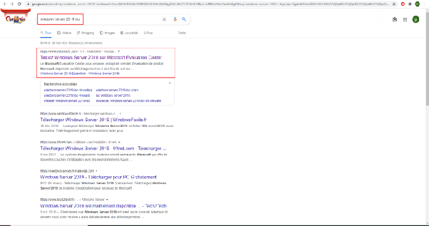
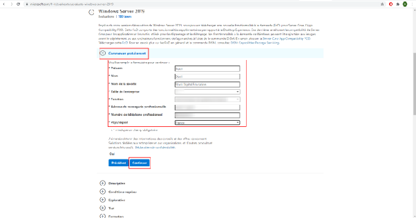

# Exploiter des serveurs Windows

COURS COMPLETS

**Les différentes versions de windows server et leur fonctionnalités:**  

**Présentation et définition de Windows Server**

### ***Contexte***

Nous allons voir les différentes versions de Windows Server, ainsi que leurs fonctionnalités. Nous verrons d'abord une brève présentation de Windows Server, puis nous nous pencherons sur les différentes versions et leurs fonctionnalités.

### ***Définition***

Windows Server est une plateforme qui permet de concevoir une infrastructure d'applications, de réseaux et de services connectés au Web, partant d'un groupe de travail et allant vers le centre de données.

Windows Server est un système d'exploitation de Microsoft. C'est une version épurée du système Windows. Chacune des versions de Windows Server se réfère à une version de Windows.

Dans les années 90, Microsoft ne cesse de vouloir élaborer un système plus adapté vers les services, et non vers la bureautique. C'est ainsi que les versions NT de Windows Server voient le jour, principalement exploitées dans le domaine professionnel. Nous allons voir dans la prochaine partie que, depuis quelques années, les versions de ce système se succèdent et diffèrent selon leurs fonctionnalités.

Les serveurs fournissent des services à d'autres ordinateurs sur un réseau, et ont donc quelques exigences supplémentaires de la part de leurs systèmes d'exploitation par rapport aux PC ordinaires. Microsoft est bien connu pour son système d'exploitation informatique Windows, et a produit une version particulière de ce système pour prendre en charge les serveurs.

**Différentes versions et fonctionnalités de Windows Server:**

Nous allons poursuivre avec les différentes versions de Windows Server, ainsi que les spécificités de chacune de ces versions.

Mais pourquoi Microsoft a fait en sorte de différencier Windows et Windows Server ? En réalité, c'est pour faciliter l'organisation et la gestion des réseaux et services des applications.

Windows Server se divise en plusieurs éditions. Voici les plus importantes :

* L'édition **Essential** correspond aux petites structures qui comptent en général une vingtaine d'utilisateurs et environ une cinquantaine d'appareils.  
* L'édition **Standard** a été développée pour les serveurs dits physiques, ou bien pour les entreprises avec peu de machines virtualisées.  
* L'édition **Datacenter**, quant à elle, a été conçue pour les centres de données et pour les entreprises possédant une grande quantité de machines virtuelles.

On pourrait penser que Windows et Windows Server sont en fait la même chose, car ils possèdent les mêmes versions, et qu'il y a aussi des similitudes (par exemple, l'écran du bureau, les barres de tâches identiques, ainsi que les icônes, et la plupart des fonctions). Mais il ne faut pas les confondre, car Windows est un système d'exploitation qui possède un ensemble de programmes permettant de diriger et de contrôler toutes les ressources que possède un ordinateur.

### ***Remarque***

###     **Versions du serveur Windows NT**

Microsoft a utilisé le nom de marque « ***NT*** » pour son système d'exploitation commercial Windows tout au long des années 1990\. Il y avait plusieurs versions du système d'exploitation avec le nom NT.

### **Windows NT Advanced Server 3.1**

La première version du système était **Windows NT Advanced Server 3.1**, sortie en 1993\. Il s'agissait d'un système 32 bits, décliné en une version pour les terminaux et une autre pour les serveurs. La version serveur est celle qui a évolué vers la famille de produits Windows Server. La séparation d'une version serveur spécialisée du système d'exploitation de la version NT standard explique qu'il n'y ait jamais eu de version 1 de Windows NT Server.

En 1994, la société a introduit **Windows Server 3.5**. Cela a permis l'interconnectivité avec les systèmes Unix et Novell Netware. À l'époque, Windows Server était le nouveau venu sur le marché, et la plupart des réseaux fonctionnaient sur des serveurs Unix ou Novell. Ainsi, la compatibilité avec ces deux systèmes était essentielle si Windows Server devait un jour être adopté par les entreprises disposant de réseaux.

### **Windows NT Server 3.51**

En 1995, Microsoft a grandement amélioré son interface PC Windows avec Windows 95\. La société a également produit **Windows NT Server 3.51** pour gérer les ordinateurs exécutant Windows 95\. Le système serveur a acquis la capacité de gérer les licences logicielles pour les ordinateurs clients, et également d'installer et de mettre à jour Windows 95 et les éléments du système d'exploitation sur le réseau.

### **Windows NT Server 4.0**

Windows NT Server n'a pas eu l'apparence de l'interface Windows 95 jusqu'en 1996, avec la sortie de **Windows NT Server 4.0**. Cette version du système d'exploitation comprenait IIS 2.0 gratuitement.

**Internet Information Server** (IIS) est le système de serveur web de Microsoft, qui est aujourd'hui le principal logiciel de serveur web au monde, avec **Apache HTTP Server** comme proche rival. IIS n'a dépassé Apache en tant que serveur web le plus largement installé qu'en 2018 : il a donc fallu 22 ans à Microsoft, depuis qu'il a commencé à inclure IIS gratuitement, pour faire tomber le système Apache gratuit de la première place.

La complexité accrue des réseaux s'est reflétée dans les améliorations apportées à Windows NT Server via l'ajout de services packs et la création de Windows NT Server Enterprise en 1997\. Ces améliorations comprenaient l'intégration de services de chiffrement à clé publique et la gestion du système d'exploitation pour les clusters de serveurs. Deux autres ajouts tenant compte des interactions avec des réseaux éventuellement encombrés étaient **Transaction Server** et **Message Queue Server**.

La dernière amélioration de Windows NT Server est venue avec Windows NT Server 4.0 Terminal Server Edition en 1998\. Cela a amélioré la connectivité aux systèmes non Windows et a également créé un pont à partir des applications DOS 16 bits, afin qu'elles puissent s'interfacer avec l'environnement de bureau 32 bits.

### ***Remarque***

###     **L'historique du développement de Windows Server**

Microsoft a abandonné la marque NT en 2000 avec la sortie de Windows Server 2000\. À partir de ce moment-là, les noms de versions de Windows Server provenaient de l'année de sortie de chaque édition.

### **Serveur Windows 2000**

Les améliorations apportées à Windows Server ont donné au système d'exploitation de nombreuses fonctionnalités que nous utilisons encore aujourd'hui. Celles-ci comprenaient la prise en charge de XML, la création d'[Active Server Pages](https://dotnet.microsoft.com/apps/aspnet) (ASP) et l'utilisation d'Active Directory pour l'authentification des utilisateurs. Le système d'exploitation Windows Server 2000 a également introduit le concept de versions personnalisées. En plus du serveur standard Windows, Microsoft a publié Advanced Server et Datacenter Server.

### **Serveur Windows 2003**

Une réécriture du système serveur publiée sous le nom de Windows Server 2003 visait à réduire les événements nécessitant un redémarrage du système. Il était possible d'installer des correctifs et des mises à jour logicielles à la volée, sans avoir à redémarrer le système. La société a également amélioré les fonctionnalités de sécurité du système d'exploitation, et c'était la première fois que [l'environnement .NET](https://dotnet.microsoft.com/download/dotnet-framework/net452) était inclus avec le système d'exploitation Windows Server.

La version 2003 de Windows inclut le concept de rôles de serveur, permettant d'adapter le système d'exploitation à des tâches spécialisées spécifiques, telles qu'un **serveur DNS**. Outre les versions Standard, Advanced et Datacenter, Microsoft a produit Windows Server 2003 Web Edition. Peu de temps après la sortie de Windows Server 2003, Microsoft a produit une mise à jour qui a converti le système en un environnement de programme 64 bits.

### **Windows Server 2003 R2**

Windows Server 2003 R2 est sorti en 2005\. Les clients ayant déjà acheté Windows Server 2003 ont pu accéder gratuitement à cette nouvelle version. Toutes les ventes de Windows Server 2003, à partir de la sortie de cette version, étaient en fait Windows Server 2003 R2.

Les améliorations apportées au système Windows Server apparues avec R2 se sont concentrées sur les problèmes de sécurité. L'authentification des utilisateurs était basée sur Active Directory et l'est toujours à ce jour.

Cependant, Microsoft a développé une fonctionnalité supplémentaire pour ce système d'authentification, qui a été intégrée à R2. Cette nouvelle fonctionnalité était les [services de fédération Active Directory](https://docs.microsoft.com/en-us/previous-versions/windows/server-2008/bb897402\(v=msdn.10\)?redirectedfrom=MSDN). Le but de cette extension AD était de permettre l'inclusion de services externes dans les autorisations « *single sign on* » gérées au sein du réseau.

Une autre mise à niveau d'Active Directory fut le mode d'application Active Directory, qui a créé une relation « *de pleine concurrence* » avec les applications tierces. Cela leur a permis d'être accessibles avec des utilisateurs vérifiés via AD, sans inclure directement les procédures d'authentification de ce logiciel dans AD.

Le package R2 a également permis de **définir des politiques de sécurité** pour des groupes de machines via l'assistant de configuration de la sécurité. D'autres améliorations R2 comprenaient une meilleure compression des données pour les fichiers et les transferts et procédures de réplication pour les WAN multi-sites.

### **Serveur Windows 2008**

Il a fallu trois ans pour préparer la prochaine version de Windows Server, qui incluait une autre amélioration d'Active Directory. La société a également apporté des modifications fondamentales à la façon dont les services réseau interagissent avec les fonctionnalités de support logiciel du système d'exploitation.

Un grand gain pour les utilisateurs de Windows Server dans cette version fut l'inclusion du système de virtualisation [Hyper-V](https://docs.microsoft.com/es-es/previous-versions/windows/server/mt169373\(v=ws.11\)?redirectedfrom=MSDN) de Microsoft. Cette décision a été prise afin d'améliorer la compétitivité de l'entreprise dans ce domaine, ayant une exigence croissante dans la gestion informatique. Si les administrateurs système ont déjà installé Hyper-V, pourquoi se lancer dans l'installation d'un système VM concurrent ?

D'autres nouveaux utilitaires intégrés à Windows Server 2008 ont été l'[Observateur d'événements](https://docs.microsoft.com/en-us/microsoft-365/security/defender-endpoint/event-error-codes?view=o365-worldwide) et le [Gestionnaire de serveur](https://www.microsoft.com/en-us/Download/confirmation.aspx?id=8053&mstLocPickShow=True). Il s'agissait d'outils d'administration système utiles qui permettaient aux administrateurs de mieux contrôler les activités du serveur.

[Server Core](https://docs.microsoft.com/en-us/previous-versions/windows/desktop/legacy/ee391626\(v=vs.85\)?redirectedfrom=MSDN) était un produit de plus en plus important de Microsoft. C'était la version nue du logiciel Windows Server, qui permettait l'accès en ligne de commande. Il peut être exécuté sans le GUI Desktop familier de l'environnement Windows, et s'adresse davantage aux administrateurs système qui étaient plus à l'aise avec les environnements de ligne de commande, qu'ils utilisaient sous **Unix** et **Linux**.

Il existe quatre éditions de Windows Server 2008 : Standard, Enterprise, Datacenter et Web.

### **Windows Server 2008 R2**

Disponible pour la première fois en 2009, Windows Server 2008 R2 est toujours utilisé aujourd'hui. La plupart des changements qui le distinguent du Windows Server 2008 d'origine étaient techniques et présent dans les services de support sous-jacents. Jusqu'à présent, les produits Windows Server étaient basés sur Windows Vista.

### **Windows Server 2008 R2 a un cœur Windows 7**

Cela amène donc le système d'exécution du programme à un environnement **64 bits**.

Cette version de Windows Server a vu quelques modifications supplémentaires dans Active Directory pour améliorer la mise en œuvre de la stratégie de groupe, et quelques nouveaux services sont apparus. Ceux-ci comprenaient les [services de bureau à distance](https://docs.microsoft.com/en-us/windows-server/remote/remote-desktop-services/welcome-to-rds) (RDS), qui étaient un reconditionnement des services Terminal Server. **BranchCache** et **DirectAccess** sont également apparus dans cette version de Windows Server afin d'améliorer l'accès au serveur des utilisateurs à des emplacements distants.

### **Serveur Windows 2012**

En 2012, Microsoft mettait tout en œuvre pour gagner dans le Cloud, et a donc ajouté des fonctionnalités à Windows Server pour permettre une meilleure interaction avec les services hors site. La société a commercialisé Windows Server 2012 sous le nom de « *Cloud OS* ». C'était probablement le but ultime de l'inclusion d'Hyper-V dans la version Windows Server 2008\.

Toutes les améliorations apportées au système Windows Server dans cette version se sont concentrées sur la mise en forme de l'Hyper-V intégré pour rendre les ressources Cloud aussi faciles à intégrer dans la livraison sur site que pour les hôtes locaux. Le système de stockage, par l'intermédiaire d'Hyper-V, a également été mis à jour dans cette version. Le commutateur virtuel Hyper-V et la réplique Hyper-V ont été inclus dans cette version pour améliorer l'adoption des stratégies de réseau hybride.

PowerShell et Server Core ont pris de l'importance avec cette version. Il y avait alors quatre éditions de Windows Server 2012 : Essentials, Foundation, Standard et Datacenter. L'édition Essentials s'adressait aux petites entreprises.

### **Windows Server 2012 R2**

Cette révision de Windows Server 2012 a été publiée en 2013\. La composition du système d'exploitation a vu l'utilisation de PowerShell s'étendre encore plus loin. Microsoft poursuit son objectif de fournir de meilleures fonctions de serveur sur site offrant la possibilité d'intégrer des services Cloud. Cela impliquait de réécrire les systèmes de sécurité et les services réseau. Les systèmes de virtualisation et de stockage ont également été remaniés et les services web ont été améliorés.

Les fonctionnalités de stockage qui ont été améliorées dans cette mise à niveau comprenaient la réplication pour les fichiers distribués et un accès amélioré pour le partage de fichiers. La capacité de servir des appareils mobiles avec des logiciels à partir du serveur a également été améliorée. Microsoft a introduit le système de [configuration de l'état souhaité](https://docs.microsoft.com/en-us/powershell/scripting/dsc/overview/overview?view=powershell-7.1&viewFallbackFrom=powershell-6) basé sur PowerShell afin d'optimiser la gestion de la configuration du réseau.

### **Serveur Windows 2016**

Un nouveau système de serveur important est apparu avec Windows Server 2016\. Il s'agit de Nano Server, une implémentation de serveur minimale légère qui avait moins d'interfaces : il était donc plus difficile d'attaquer. Cette version de Windows Server inclut également Server Core.

Les systèmes VM ont également été ajoutés avec **un système de chiffrement** pour Hyper-V et la nouvelle capacité d'interagir avec [Docker](https://docs.microsoft.com/en-us/dotnet/architecture/microservices/container-docker-introduction/docker-defined). Cet outil était pratique pour la « *conteneurisation* », qui permettait aux administrateurs système de fournir des logiciels appartenant à l'entreprise aux appareils appartenant aux utilisateurs.

Microsoft a introduit le [contrôleur de réseau](https://docs.microsoft.com/en-us/azure-stack/hci/concepts/network-controller-overview) dans Windows Server 2016\. Cette fonctionnalité a permis aux administrateurs de gérer à la fois les périphériques réseau physiques et virtuels à partir d'une seule console.

Windows Server 2016 était disponible dans les éditions Standard et Datacenter. Il n'y avait pas de version R2 de Windows Server 2016\.

### **Serveur Windows 2019**

Sorti en octobre 2018, Windows Server 2019 est la dernière version du système d'exploitation serveur de Microsoft. Les nouvelles fonctionnalités de cette version sont regroupées sous le nom de « ***projet Honolulu*** ».

Maintenant appelé [Windows Admin Center](https://docs.microsoft.com/en-us/windows-server/manage/windows-admin-center/overview), il s'agit d'un utilitaire de gestion de serveur qui n'est pas seulement conçu pour Windows Server 2019, mais peut également gérer des serveurs exécutant Windows Server 2012 R2 et Windows Server 2016\.

La console couvre plusieurs serveurs, peu importe que le système d'un serveur surveillé ait la version GUI complète, Server Core ou Nano Server. L'utilitaire comprend la surveillance des performances, la gestion de la configuration et le contrôle des services qui s'exécutent sur chaque serveur surveillé.

Source : [Dementium2](https://dementium2.com/administrateur-net/guide-ultime-de-windows-server/)

(vidéo)Les nouvelles fonctionalités à travers les versions de Windows Server  
Il existe plusieurs versions de windows server. La dernière version la version Windows Server 2022 est sortie en août 2021\. Elle garde les bases de Windows Server 2019, tout en ajoutant de nouvelles fonctionnalités utiles. Cette nouvelle version ^possède également une amélioration concernant les mises à jour. En effet, celles-ci ont lieu tous les 2 ans au lieu de chaque années. Concernant les nouvelles fonctionnalités, nous avons tout d’abord, les protocoles réseau, dans cette version on y trouve le protocole développé par Google, le protocole QUICK ou Quick UDP Internet Connexion qui améliore également les connexions UDP par la réduction de latence, le chiffrement, la réutilisation de la connexion, le contrôle de version et les extensions de trames. Ensuite il y a l’amélioration de la sécurité Windows Server 2002 a par défaut HTTPS et TLS 1.3 d’activés pour une protection des données des clients qui se connectent au serveur. Ils améliorent la sécurité par rapport aux anciennes versions. Windows Server 2022 a été conçu pour offrir une protection en profondeur contre les menaces. Il offre également une protection multicouches avancée pour une protection complète adaptée au serveur. Puis il y a le cloud hybrid azure qui est intégré dans Windows Server 2022 pour étendre plus facilement le stockage des données. Il y a aussi la virtualisation. Cette dernière version de Windows Server prend en charge la virtualisation imbriquée de machines virtuelles sur les processeurs AMD. Pour finir il y a aussi une amélioration au niveau du stockage. Cette dernière version de Windows Server permet d’avoir un service de migration de stockage. Cela coonsiste à faciliter la migration du stockage vers Windows Server ou Azure depuis un grand nombre d’emplacements sources. Il permet également une vitesse de réparation du stockage rélable ce qui permet un meilleur contrôle sur le processus de resynchronisation. Ce qui améliore la disponibilité et permet de gérer les clusters plus éfficacement. Les nouvelles fonctionnalités de Windows Server permettre d’avoir des protocoles réseaux plus fluides avec une amélioration de la sécurité adpatée au serveur et avec une protection en profondeur contre les menaces. Il offre un cloud hybride intégré et une virtualisation sur les processeurs AMD. Le tout montre de grandes nouvelles fonctionnalités adaptées aux clients et aux utilisateurs.  
**Composants serveur:**

### **Infrastructure hyperconvergée (HCI)**

Comme vous pouvez le voir dans la description des versions précédentes, Microsoft a renforcé la puissance de virtualisation de son système d'exploitation serveur depuis qu'il a intégré pour la première fois Hyper-V à Windows Server 2008\.

Cette campagne a duré dix ans et s'est reflétée dans les avancées des services Cloud de Microsoft. Ainsi, avec ce dernier cumul de tous les développements récents de machines virtuelles au cours des dernières années dans ce package, les administrateurs réseau peuvent disposer de véritables capacités de réseau hybride.

Les fonctionnalités HCI du dernier serveur Windows s'adressent davantage aux consommateurs de services qu'aux fournisseurs. Cependant, ce système est capable de prendre en charge les centres de données définis par logiciel, ainsi que leurs clients. Les capacités HCI offrent la possibilité d'ajuster les services virtualisés sans arrêter le système. De nombreux ajustements des ressources prenant en charge les machines virtuelles peuvent même être exécutés automatiquement.

### ***Complément*****Linux sur serveur Windows**

Il est déjà possible d'exécuter Linux sur un serveur Windows via une VM. Cependant, Windows Server 2019 pousse cet hébergement un peu plus loin, en fournissant un sous-système compatible avec Linux, appelé « ***VM natives blindées pour Linux*** ».

### **Protection avancée contre les menaces (ATP) Windows Defender**

La dernière menace de sécurité pour les systèmes informatiques est la « *menace persistante avancée* ». Ces attaques APT sont capables de contourner les systèmes antivirus traditionnels, car leur point d'entrée est souvent facilité par la chasse à la baleine, le *phishing* et le profilage des réseaux sociaux.

Puisque les tactiques de défense traditionnelles pour bloquer l'accès ne suffisent plus à protéger les systèmes et les données, les systèmes avancés de protection contre les menaces sont devenus essentiels. L'inclusion de [Windows Defender ATP](https://www.microsoft.com/en-us/security/business/threat-protection/endpoint-defender) dans Windows Server 2019 est un ajout de sécurité très apprécié.

L'ATP surveille les activités du compte, protège les fichiers journaux des modifications non autorisées et assure le suivi des activités des utilisateurs autour du stockage des données pour identifier l'intrusion APT.

### **Cœur de serveur allégé et services**

L'option **Server Core** est intégrée à Windows Server depuis la version 2008\. Il est maintenant encore plus léger, représentant 50 % de la taille de Windows Server 2019, entièrement géré par l'interface graphique. Cette réduction s'applique également à la conteneurisation de la livraison sur le logiciel lorsqu'il est livré aux appareils appartenant à l'utilisateur. L'abaissement du surcoût créé par le mécanisme de conteneurisation ne s'est cependant pas fait au détriment de la sécurité.

### **Contrôles de l'interface graphique**

Comme pour toutes les versions du canal de service à long terme de Windows Server, les utilisateurs de la version 2019 ont accès aux outils d'administration frontaux complets dans une interface graphique. Cette fonctionnalité n'est pas disponible pour ceux qui installent seulement Server Core ou Nano Server.

### **Canal de service à long terme**

Chaque nouvelle version de Windows Server ne rend pas nécessairement les versions précédentes obsolètes. Microsoft classe toutes les versions standards de Windows Server dans le cadre de son **canal de service à long terme** (LTSC). Ces produits sont pris en charge pendant 10 ans. Cette période de support est couverte par cinq ans de support, inclus dans le prix d'achat, et les cinq années restantes nécessitent une extension de contrat de support.

Le remplacement du système d'exploitation Windows Server n'est pas automatique et nécessite l'achat séparé de la nouvelle version. Ceci à l'exception des versions R2, qui sont autorisées en tant que mise à niveau gratuite pour les clients de la version originale. Ainsi, Windows Server 2003 R2 était disponible gratuitement pour les clients qui avaient déjà acheté Windows Server 2003\.

Les versions 2008 R2, 2012 R2 et 2016 fonctionnent toujours activement dans le monde aujourd'hui.

### **Canal semi-annuel**

Microsoft a créé un deuxième modèle d'achat pour Windows Server en 2017\. Il s'agit du **Canal Semi-Annuel** (SAC). Les produits disponibles via ce canal ne sont pas les mêmes que dans les versions de Windows Server commercialisées via le canal de service à long terme. Les délais de sortie plus courts pour ce groupe de produits signifient que les éléments communs proposés dans les deux canaux finiront par diverger.

Les produits SAC sont destinés aux sociétés de développement de logiciels, qui ont besoin d'innovations plus récentes et plus rapidement que les entreprises qui souhaitent des serveurs stables pour prendre en charge leurs opérations régulières. Comme son nom l'indique, les versions du serveur SAC sont publiées tous les six mois et incluent des contrats de support qui ne durent que 18 mois.

Les numéros de ces versions Windows Server proviennent de l'année et du mois de leur publication. Ainsi, à ce jour, il y a eu :

* Windows Server, version 1709 (septembre 2017\)  
* Windows Server, version 1803 (mars 2018\)  
* Windows Server, version 1809 (septembre 2018\)

Ces offres Windows Server ont moins de fonctionnalités d'interface utilisateur que les systèmes d'exploitation Windows Server proposés dans le canal de service à long terme. Ils sont intégrés aux services d'abonnement basés sur le Cloud de Microsoft, notamment **Software Assurance**, Azure Marketplace et **Visual Studio**.

### **Serveurs Cloud Windows**

L'hébergement Cloud signifie que vous pouvez obtenir Windows Server sur une infrastructure distante, pas seulement sur vos machines sur site. Microsoft propose ses serveurs Cloud [Azure](https://azure.microsoft.com/en-us/campaigns/windows-server/) sur la base d'un abonnement. Cependant, vous n'êtes pas limité aux seuls services de Microsoft si vous souhaitez obtenir Windows Server sur le Cloud. D'autres fournisseurs utilisent Windows Server, ce qui vous permet de choisir entre les plans de services proposés par diverses entreprises, si vous souhaitez utiliser Windows Server sans avoir à l'acheter ni à l'exécuter sur votre propre matériel. Par exemple, [Google Cloud](https://cloud.google.com/windows/) inclut une option Windows Server.

Que vous choisissiez de migrer toute l'activité de votre serveur vers le Cloud ou de créer un réseau hybride, les dernières versions de Windows Server vous permettront de fournir des services à votre personnel et à vos clients de manière transparente.

### **Surveillance du serveur Windows**

Bien que Windows Server comprenne de nombreuses fonctions de surveillance, vous devrez ajouter un logiciel de surveillance spécialisé pour gérer entièrement le système. Les versions serveur Cloud et sur site du système reposent toutes deux sur des éléments matériels qui peuvent mal fonctionner, et vous devez garder un œil constant sur les connexions à votre serveur, qu'elles soient sur votre propre réseau local ou sur Internet.

### ***Fondamental***

Parmi toutes les versions présentées, on peut constater, qu'à partir de Windows Server 2000, les versions sont révisées tous les 5 ans ou tous les 10 ans.

Les différentes versions proposent dans la majorité les mêmes éditions, sauf pour les anciennes versions, celles-ci étant très limitées.

On peut également observer que, hormis la version Windows 2019, les versions sont toutes descendantes de la famille Windows NT (destinée aux entreprises).

Si on regarde les versions de 2008, on peut constater que ces versions possèdent un grand nombre d'éditions. Ci-dessous, quelques explications des différentes éditions proposées :

* L'**édition Essential business** concerne les entreprises possédant jusqu'à  300 utilisateurs. La messagerie, la mise en réseau des ordinateurs ou l'accès à distance étaient des fonctionnalités proposées aux entreprises.  
* L'**édition Windows HPC server** (*High Performance Computing*) avait été développée pour les applications dites de haute performance, pouvant rassembler plusieurs PC et les gérer.  
* L'**édition serveur multipoint** utilisait les services de bureau à distance pour permettre de regrouper les terminaux connectés à un seul et même ordinateur.  
* L'**édition Hyper-V** est un système de virtualisation. Avec cette édition il est possible de muter un serveur physique en un hyperviseur pour pouvoir contrôler les machines virtuelles. Ainsi, sur un seul PC, il est possible de diriger plusieurs VM.  
* L'**édition Foundation**, concernait les entreprises de 15 utilisateurs. Ne possédant pas la virtualisation, cette édition était pour un usage général.

Les versions Windows Server 2012, 2016 et 2019 ont des éditions identiques aux versions de 2008, mais ont été améliorée.

**L’installation de Windows Server Autonome:**

### ***Contexte***

Sous VirtualBox, nous allons voir en pas à pas, avec des captures d'écran, comment monter en VM VirtualBox un Windows Server 2019\.

(vidéo) Dans cette vidéo, nous allons voir l’installation  de Windows Server. Tout d’abbord nous allons devoir monter une machine virtuelle sur virtualbox afin de pouvoir installer notre serveur windows 2019\. Nous allons commencer par aller dans “nouvelle”, nous allons entrer le nom de notre serveur “Windows Server 2019”, plus bas nous allons chercher notre version qui est “ Windows 2019 en 64 bits” dans “version” et cliquer sur suivant. Ensuite pour la taille de la mémoire nous allons laisser par défaut et aller directement sur suivant. Pour le disque dur nous allons choisir créer un disque dur virtuel maintenant et aller sur “créer”. Ensuite concernant le type de fichier, de disque dur nous allons choisir “VHD disque dur virtuel” et cliquer sur suivant. Concernant le “stockage sur disque dur physique”, nous laisserons par défaut dynamiquement alloué et aller directement sur suivant. Pour l’emplacement du fichier et la taille , nous allons dans le cadre de la vidéo rentrer 30 gigas et aller directement sur créer. Nous pouvons voir sur le gestionnaire de machine que la machine virtuelle Windows Server 2019 a été créée. Maintenant nous allons intégrer notre ISO. Pour ce faire nous allons aller dans configuration puis dans stockage cliquer sur vide dans le petit disque bleu a droite on va cliquer dessus et aller chercher notre windows server 2019\. Nous allons liqueur sur OK ensuite nous allons cliquer sur Démarrer. Ensuite nous allons choisir la langue à installer qui sera le français et aller sur suivant. Nous allons cliquer maintenant sur “installer” et le demarrage du programme d’installation va se poursuivre. Nous allons choisir ensuite Windows server pour installer l’environnement graphique windows complet et aller sur suivant. Nous allons maintenant accepter les conditions de contrats et cliquer encore sur suivant. Pour le type d’installation nous allons choisir personnalisercliquer sur nouveau ensuite sur appliquer et enfin sur ok. 

### **Les étapes de téléchargement du Windows Server 2019**

**Étape 1** : tout d'abord, recherchez **Windows Server 2019** sur votre navigateur.

**Étape 2** : après avoir cliqué sur le premier lien du site [Microsoft](https://www.microsoft.com/fr-fr/evalcenter/evaluate-windows-server-2019), sélectionnez le format. Ici, dans notre cas c'est le « ***ISO*** », puis continuez.

**Étape 3** : remplissez le formulaire obligatoire pour pouvoir continuer l'installation de Windows Server 2019\.

**Étape 4** : une fois le formulaire complété, cliquez sur « ***Continuer*** ».

**Étape 5** : sélectionnez la langue et lancez le téléchargement.

![][image4]

### ***Méthode***

###     **Création d'une VM VirtualBox avec Windows Serveur 2019**

**Étape 1** : maintenant que Windows Server 2019 est téléchargé, vous allez commencer par créer une VM, avec les caractéristiques requises pour débuter l'installation de Windows Server 2019\.

Pour commencer, rendez-vous dans le gestionnaire de machine et allez dans « ***Nouvelle*** ».

Ensuite, choisissez un nom et un dossier pour la nouvelle VM et affectez le système d'exploitation dans lequel la VM sera installée.

**Étape 2** : création de la VM VirtualBox.

![][image5]

**Étape 3** : remplissez les caractéristiques comme suit :

* Nom : « ***Windows Server 2019*** »,  
* Dossier de la machine : « **chemin par défaut** »,  
* Type : « ***Microsoft Windows*** »,  
* Version « ***Windows 2019 (64 bit)*** ».

Vous pouvez cliquer sur « ***Suivant*** ».

**Étape 4** : dans cette étape, il faut renseigner la taille de la mémoire vive qui sera allouée pour Windows Server 2019\.

![][image6]

**Étape 5** : cliquez sur « ***Suivant*** » après avoir renseigné la quantité de mémoire vive attitrée à la VM.

**Étape 6** : créez un disque dur virtuel.

![][image7]

**Étape 7** : sélectionnez le fichier du disque dur virtuel.

![][image8]

**Étape 8** : après la sélection du disque dur, cliquez sur « ***Suivant*** ».

**Étape 9** : choisissez le disque « ***Dynamiquement alloué*** ».

![][image9]

**Étape 10** : emplacement du fichier et taille du disque dur :

![][image10]

**Étape 11 :** dans ce cas, l'emplacement est sélectionné par défaut. Cliquez sur « ***Créer*** » pour poursuivre.

**Étape 12** : détails de la VM :

![][image11]

### ***Méthode*****Intégration de notre ISO Windows Server 2019**

**Étape 1** : allez sur « ***Configuration*** », puis sur « ***Stockage*** » et ensuite sur « ***Vide*** ».

![][image12]

**Étape 2** : continuez sur « ***Lecteur optique*** » et choisissez le disque.

![][image13]

**Étape 3** : sélectionnez l'ISO Windows Server 2019 téléchargé auparavant.

![][image14]

**Étape 4** : une fois sélectionné, cliquez sur « ***Ouvrir*** ».

**Étape 5** : ajoutez l'ISO Windows Server 2019\.

![][image15]

**Étape 6** : cliquez sur « ***OK*** ».

**Étape 7** : démarrez la VM pour installer Windows Server 2019\.

![][image16]

**Étape 8** : vous devez sélectionner la langue, le format horaire et le clavier. Dans notre cas, on sélectionne le français. Ensuite, cliquez sur « ***Suivant*** ».

![][image17]

**Étape 9** : cliquez sur « ***Installer maintenant*** ».

![][image18]

### ***Attention***

Il faut choisir le système d'exploitation afin d'installer l'environnement graphique Windows complètement.

Dans ce cas, sélectionnez la deuxième option.

### ***Méthode***

**Étape 10** : installez l'environnement graphique Windows.

![][image19]

**Étape 11** : cliquez sur « ***Suivant*** » pour lancer l'installation.

**Étape 12** : acceptez les termes du contrat de licence Windows Server 2019 et cliquez sur « ***Suivant*** ».

![][image20]

**Étape 13** : cliquez sur « ***Personnalisé : installer uniquement Windows (avancé)*** ».

![][image21]

**Étape 14** : choisissez sur quel lecteur installer Windows. Cliquez alors sur « ***Nouveau*** » puis sur « ***Appliquer*** », afin de faire apparaître le « ***Lecteur 0 Partition 2*** » et sélectionnez-le.

![][image22]

**Étape 15** : pour finir, cliquez sur « ***Suivant*** ».

![][image23]

**Étape 16** : installation de Windows Server 2019 :

![][image24]

**Étape 17** : paramétrez le compte « ***Administrateur*** » avec un mot de passe, puis cliquez sur « ***Terminer*** ».

![][image25]

**Étape 18** : entrez le mot de passe du compte « ***Administrateur*** » pour accéder à Windows Server 2019\.

![][image26]

**Étape 19** : Windows Server 2019 est désormais installé et l'interface de Windows apparaît.

![][image27]

**La configuration de Windows server autonome:**

### ***Contexte***

Windows Server est un système d'exploitation serveur qui permet à un ordinateur d'exécuter des fonctions réseau tels que serveur d'impression, contrôleur de domaine, serveur web et serveur de fichiers. En tant que système d'exploitation pour serveurs, il constitue également la plateforme d'applications tels que Exchange Server et SQL Server.

Dans cette compétence, nous allons voir comment configurer le Windows Server 2019 installé en VM précédemment.

### ***Méthode***

###     **Les étapes de la configuration de Windows Server autonome**

**Étape 1** : tout d'abord, allez sur « ***Système*** » et « ***Renommer ce PC*** ».

![][image28]

![][image29]

**Étape 2** : une fois votre PC renommé, cliquez sur « ***Suivant*** ».

Deux options seront proposées : « ***Redémarrer le serveur de suite*** » ou « ***Redémarrer le serveur plus tard*** ».

**Étape 3** : dans cette étape, on va attribuer une adresse IP fixe pour se connecter sur le PC même sans DNS, et uniquement avec l'adresse IP.

Ouvrez les paramètres « ***Réseau et Internet*** » → « ***Ethernet*** » → « ***Centre Réseau et partage*** » → « ***Modifiez les paramètres de la carte*** » → « ***Propriétés de Ethernet*** » → « ***Protocole Internet version 4 (TCP / IPv4)*** », puis rentrez l'IP.

![][image30]

**Étape 4** : attribuez une adresse IP fixe.

![][image31]

**Étape 5** : autorisez les connexions à distance sur l'ordinateur.

Allez sur « ***Panneau de configuration*** » → « ***Système et sécurité*** » → « ***Système*** » → « ***Paramètres d'utilisation à distance*** ».

![][image32]

**Étape 6** : maintenant, il faut configurer le contrôleur de domaine ainsi qu'un serveur DNS.

Dans le gestionnaire de serveur, rendez-vous sur le « ***Tableau de bord*** » puis allez sur « ***Gérer*** » et « ***Ajouter des rôles et fonctionnalités*** ».

![][image33]

**Étape 7** : ici, on passe à l'installation des rôles, des services et fonctionnalités en fonction des besoins informatiques avec l'assistant. Dans cette étape il n'y a rien à modifier, il faut juste lire et cliquer sur « ***Suivant*** ».

![][image34]

**Étape 8** : nous voici maintenant à la partie qui concerne l'installation basée sur un rôle ou une fonctionnalité. Choisissez l'installation et cliquez sur « ***Suivant*** ».

![][image35]

**Étape 9** : après avoir choisi le type d'installation, vous allez sélectionner un serveur de destination. Une fois le serveur du pool de serveur sélectionné, cliquez sur « ***Suivant*** ».

![][image36]

**Étape 10** : cette étape concerne la sélection des rôles à installer sur le serveur sélectionné précédemment. Choisissez les rôles « ***Serveur DNS*** » et « ***Services AD DS*** ». Cliquez ensuite sur « ***Ajouter des fonctionnalités*** » puis sur « ***Suivant*** » après avoir terminé.

![][image37]

**Étape 11** : toujours dans l'assistant, il va falloir sélectionner les fonctionnalités à installer sur le serveur choisi précédemment. Laissez les fonctionnalités par défaut, et cliquez sur « ***Suivant*** ».

![][image38]

**Étape 12** : pour ce qui est du serveur DNS, il faut lire les informations qui apparaissent. C'est un récapitulatif du rôle du système DNS avec les particularités à prendre en compte si le système DNS est intégré à l'AD DS : « *Service de domaine Active Directory* ». Cliquez sur « ***Suivant*** » une fois que vous avez pris connaissance de ces informations.

![][image39]

**Étape 13** : concernant l'AD DS (Service de domaine Active Directory), il faut également le lire. C'est un récapitulatif de son rôle comme le serveur DNS, avec les particularités à prendre en compte. Cliquez ensuite sur « ***Suivant*** ».

![][image40]

**Étape 14** : c'est la dernière étape avant le lancement de l'installation du système DNS et de l'AD DS. Cliquez sur « *Installer* » pour confirmer les sélections.

![][image41]

**Étape 15** : on peut voir la progression de l'installation des rôles et fonctionnalités dans l'onglet « ***Résultats*** » à gauche. Vous pouvez cliquer sur « ***Fermer*** » une fois l'installation terminée.

![][image42]

**Étape 16** : maintenant, il faut définir notre serveur comme contrôleur de domaine principal. Cliquez sur l'icône de drapeau dans la barre supérieure (sur lequel est apparu un panneau jaune avec un point d'exclamation). Puis cliquez sur « ***Promouvoir le serveur en contrôleur de domaine*** ».

![][image43]

**Étape 17** : l'assistant « ***Configuration des services de domaine Active Directory*** » s'ouvre alors. Dans la configuration de déploiement, sélectionnez l'opération du déploiement : choisissez « ***Ajouter une nouvelle forêt*** » et spécifiez le nom de domaine racine. Cliquez ensuite sur « ***Suivant*** ».

![][image44]

**Étape 18** : toujours dans l'**Assistant Configuration des services AD DS**, l'étape des options du contrôleur de domaine est à compléter. Tapez le mot passe et confirmez le mot de passe du mode de restauration des services d'annuaire.

![][image45]

**Étape 19** : dans la partie Options DNS, créez une délégation DNS mais rien ne sera coché. Cliquez sur « ***Suivant*** » car la configuration de DNS se fera juste après.

![][image46]

**Étape 20** : à cette étape, ce sont les « ***Options supplémentaires*** » qui sont concernées : vérifiez le nom de domaine NetBIOS, puis cliquez sur « ***Suivant*** ».

(video) Qu’est-ce que NetBIOS?  
NetBIOS est l’abbréviation de network basic Input Output System. Il a été créé en 1980 par IBM et cytech. C’est une architecture réseau et non un protocole réseau. Il est surtout utilisé par Microsoft. Il a la fonction de faire communiquer sur le même réseau local des applications et des ordinateurs. NetBIOS est le plus souvent utilisé avec le TCP/IP. NetBIOS a connu deux autres implémentations. La première était le NBF qui était connu sous le nom de NetBEUI (NetBIOS Extended User Interface) et la seconde était le NBx utilisé avec ipx/spx (NetBIOS over IPX/SPX). Il n’existe plus actuellement car il s’adapte au DNS. NetBIOS aujourd’hui est connu sous le nom de NBT. NetBIOS est là pour fournir des services de communication sur les réseaux locaux avec un protocole logiciel NetBIOS Frames qui permet aux applications et aux ordinateurs de communiquer avec le matériel du même réseau local et de transmettre des données. Sous Windows, le nom du NetBIOS est définie par le nom de l’ordinateur, il peut comporter jusqu’à 16 caractères, cela permet d’identifier et de localiser les applications logicielles sur le réseau NetBIOS. NetBIOS avec le TCP/IP utilise différents ports.  
Pour commencer il utilise le port 135\. Ce port sert aux services de localisation utilisés pour les appels à distance.   
Ensuite il y a le port 137 qui sert de service pour attribuer un nom d’ordinateur à une adresse IP, il est limité à 15 caractères avec en plus un caractère qui définit le type de machine.   
Les applications sur d’autres ordinateurs sont accessibles au nom NetBIOS en passant par l’UDP avec un protocol de couches de transport OS.  
Puis il y a le port 138\. Ce port sert de service d’échange de messages en mode non connecté.   
Pour finir, il y a le port 139 qui sert de service d’échange de messages également, mais cette fois-ci en  mode connecté jusqu’à 131071octets.   
Pour résumer, le NetBIOS est constitué généralement de 16 caractères, il est surtout utilisé sous Windows mais aussi dans les réseaux token ring. Il est une norme de l’industrie des réseaux et il utilise le protocole sur TCP/IP. NetBIOS est un système de nommage et une interface logicielle pour permettre d’établir plusieurs sessions entre des ordinateurs sur le même réseau local.

**Étape 21** : dans les « ***Chemins d'accès*** », il ne faut rien modifier sur l'emplacement de la base de données AD DS, des fichiers journaux et de SYSVOL. Passez directement à l'examen des options en cliquant sur « ***Suivant*** ».

**Étape 22** : dans la partie « ***Examiner les options*** », on aperçoit tout ce qui a été créé juste avant. Vérifiez vos sélections et validez-les en cliquant sur « ***Suivant*** ».

![][image49]

**Étape 23** : vérifiez maintenant la configuration requise et validez en cliquant sur « ***Installer*** » afin que les services de domaine **Active Directory** soient installés sur l'ordinateur. Par ailleurs, il est spécifié que si vous cliquez sur « ***Installer*** » alors le serveur redémarrera automatiquement.

![][image50]

Maintenant que les services de domaine **Active Directory** ont été installés, l'ordinateur va redémarrer.

![][image51]

**Étape 24 : une fois l'ordinateur redémarré, rentrez les identifiants administrateur.**

**![][image52]**

**Étape 25 : cette nouvelle étape concerne la configuration de DNS, toujours dans le gestionnaire de serveur AD DS, allez dans « *Outils* » → « *DNS* ».**

**![][image53]**

**Étape 26 : après avoir cliqué sur DNS, une nouvelle fenêtre apparaît : « *l'Assistant Nouvelle zone* ». Cet assistant consiste à créer une nouvelle zone pour le serveur DNS. Cliquez sur « *Suivant* ».**

**![][image54]**

**Étape 27 : dans l'assistant de Nouvelle zone, sélectionnez en premier le type de zone souhaitée (« *zone principale* » dans ce cas) et « *Enregistrer la zone dans Active Directory* ». Continuez sur « *Suivant* ».**

**![][image55]**

**Étape 28 : dans la partie « *Étendue de la zone de réplication de Active Directory* », il faut choisir la façon dont les données DNS seront répliquées sur le réseau. Le choix ici, se porte sur : « *Vers tous les serveurs DNS exécutés sur des contrôleurs de domaine dans ce domaine SRV.STUDI* ».**

**![][image56]**

**Étape 29 : pour poursuivre dans l'Assistant Nouvelle zone, deux options sont proposées pour la Zone de recherche inversée. Soit la création de la zone pour les adresses IPv4, soit la zone de recherche inversée pour les IPv6. Choisissez « *Zone de recherche inversée IPv4* » et cliquez sur « *Suivant* ».**

**![][image57]**

**Étape 30 : ensuite, dans la continuité de la zone de recherche inversée, il faut indiquer l'identifiant réseau. Windows Server, par défaut, va susciter un fichier de zone. Celui-ci, aura un nom établi avec l'ID du réseau inversé et le suffixe : in-addr.arpa**

**![][image58]**

**Étape 31 : avant la fin de la configuration de l'assistant Nouvelle zone, il faut spécifier si, dans la mise à niveau, la zone DNS autorise les mises à jour sécurisées, non sécurisées ou non dynamiques. L'action retenue sera de « *N'autoriser que les mises à jour dynamiques sécurisées* ». De plus, cette alternative est recommandée pour Active Directory.**

**![][image59]**

**Étape 32 : cette dernière fenêtre présente la fin de l'assistant Nouvelle zone. La configuration DNS est terminée et les paramètres spécifiés auparavant sont affichés.**

**![][image60]**

**Étape 33 : enfin, vérifiez la bonne configuration du serveur DNS dans le Gestionnaire DNS. La configuration est normalement correcte.**

**![][image61]**

****

**La configuration de l’administration distante du serveur:**

### ***Contexte***

Une fois le serveur installé, la première console qui démarre est la console gestionnaire de serveur (*server manager* en anglais). Maintenant, nous allons activer le bureau à distance afin de simuler un fonctionnement « *headless* » qui sera désormais le seul mode autorisé d'administration du serveur.

À distance, nous allons découvrir les outils de gestion du serveur.

### ***Définition***

###     **Qu'est-ce qu'un bureau à distance ?**

Un bureau à distance, tel que le populaire *Remote Desktop Connection* (RDC) de Microsoft, est une ressource informatique qui vous permet d'utiliser un ordinateur depuis une autre machine à distance.

En termes simples, le bureau à distance permet d'accéder à un ordinateur et d'interagir avec lui à distance.

### ***Définition***

###     **Que veut dire le terme « headless » ?**

Le terme « *headless* », si on le traduit littéralement en français, veut dire « *sans tête* ».

Il est possible de configurer Windows soit avec le mode par tête ou en mode headless.

Si on configure Windows en mode headless, celui-ci n'aura pas d'interface utilisateur. Pour les appareils qui n'exigent pas des fonctions d'interface utilisateur, il est possible de les configurer en mode headless. La structure de l'interface utilisateur est alors inactive et les applications ne sont pas chargées. Ceci limite la quantité d'utilisation des ressources système.

### ***Méthode***

###     **Découvrez la configuration de l'administration distante du serveur**

(vidéo) Dans cette vidéo, nous allons voir, pas à pas, le déploiement d’une matrice de poste client. La configuration de l’administration distante du serveur. Pour commencer nous allons aller dans “ce PC”, faire un clic droit et aller dans “propriétés” puis “paramétres d’utilisation à distance” ensuite nous allons aller dans l’onglet “utilisation à distance” nous voyons que l’autorisation des connexions à distance de cette ordinateur n’est pas activée donc on l’atciver. Nous allons ensuite cliquer sur “sélectionner des utilisateurs” ici, nous allons ajouter un compte d’utilisateur qui pourra accéder à la connexion du bureau à distance “ajouter”. Donc on va rentrer le nom et cliquer sur “vérifier les noms”, une fois trouvé nous allons aller cliquer sur OK puis une nouvelle fois “OK” puis “appliquer” et enfin “ok”. Maintenant, nous allons faire un test pour voir si la connexion du bureau à distance est fonctionnelle. Donc pour commencer, nous allons entrer l’adresse IP du serveur puis cliquer sur “connexion” dans cette fenêtre, on nous demande les identifiants du compte dans ce cas de la vidéo l’identifiant est deja enregistré mais nous il nous sera demandé d’entrer l’identifiant et le mot de passe puis cliquer sur “ok”. Nous voyons que la connexion du bureau à distance est bien fonctionnelle.

**Activation du bureau à distance:**

### ***Méthode***

###     **Découvrir les étapes pour activer le bureau à distance**

**Étape 1** : Pour commencer, il faut aller dans le « ***Panneau de configuration*** » → « ***Système et sécurité*** » et dans « ***Paramètres d'utilisation à distance*** ».

Ensuite, cochez la deuxième option. Cliquez sur « ***Appliquer*** » et « ***OK*** ».

**Étape 2** : Ensuite, il faut ouvrir la connexion du bureau à distance.

Vous devez entrer l'adresse IP du serveur et votre compte administrateur ou votre compte utilisateur, puis cliquez sur « ***Connexion*** ».

**Étape 3** : Une fenêtre s'affiche pour entrer les informations d'identification qui seront par la suite utilisées afin de se connecter. Une fois les identifiants entrés, cliquez sur « ***OK*** ».

![][image65]

Dans l'encadrement bleu, en haut de la fenêtre, il est indiqué que la connexion en RDP (connexion au bureau à distance) est bien active.

![][image66]

 

**Découverte des outils de gestion du serveur:**

### ***Méthode***

Maintenant que la connexion au bureau à distance est établie, nous allons découvrir les outils de gestion du serveur pour se familiariser un peu.

Pour passer à la configuration, allez dans « ***Outils*** » puis sur « ***Analyseur de performances*** ».

![][image67]

### ***Méthode***

###     **Analyseur de performances**

« ***L'Analyseur de performances*** » est un élément de supervision qui est présent dans les éditions de Windows 10 afin que les utilisateurs et les administrateurs système puissent observer la performance des ressources (disque, réseau, processeur et mémoire) de leur poste de travail.

![][image68]

### ***Méthode***

###     **Centre d'administration Active Directory**

Après l'analyseur de performances, on peut accéder au « ***Centre d'administration Active Directory*** ». Il dispose de diverses fonctionnalités qui aident à l'organisation administrative des services de domaine Active Directory (AD DS).

Il est possible de créer de nouveaux utilisateurs, de restaurer un mot de passe, de modifier le contrôleur de domaine, etc.

![][image69]

![][image70]

### ***Méthode***

###     **Configuration du système**

Dans l'espace « ***Configuration du système*** », il y a tous les détails du système, Il apparaît également les services qui sont en cours d'exécution ou qui ont cessé.

![][image71]

![][image72]

![][image73]

### ***Méthode***

###     **Gestionnaire DNS**

Si on se positionne sur « ***DNS*** », nous allons trouver les zones de recherche directes et inversées et c'est ici que l'on doit accéder pour configurer un serveur DNS. Nous nous pencherons sur le système de noms de domaine (DNS) dans une prochaine unité pédagogique.

![][image74]

![][image75]

### ***Méthode***

###     **Gestion de l'impression**

Dans l'outil « ***Gestion de l'impression*** », il est possible d'ajouter, d'installer et de partager des imprimantes.

Mais il est également possible d'accéder à la gestion d'impression directement par le panneau de configuration.

![][image76]

![][image77]

### ***Méthode***

###     **Gestion de l'ordinateur**

L'outil « ***Gestion de l'ordinateur*** » permet d'administrer un ordinateur distant ou local. On peut apercevoir que les outils d'administration sont classés en trois parties (« *Outils système* », « *Stockage* » et « *Services et applications* »).

![][image78]

![][image79]

### ***Méthode***

###     **Console de Gestion des stratégies de groupe**

Avec la console « ***Gestion des stratégies de groupe*** », les administrateurs peuvent diriger les stratégies de groupe intégrées dans une forêt AD DS et récupérer des données pour analyser les problèmes liés à ces stratégies de groupe.

![][image80]

![][image81]

**Le paramétrage des utilisateurs et des groupes:**

**Création de dossiers des utilisateurs et des groupes:**

### ***Contexte***

Si vous êtes administrateur de groupes, concernant l'organisation, vous aurez la possibilité de décider qui peut procéder à la création des groupes, et choisir qui peut y accéder.

### **Découvrez comment créer les dossiers des utilisateurs et des groupes**

Nous allons voir, pas à pas, comment paramétrer des utilisateurs et des groupes et comment intégrer un utilisateur dans un groupe. Nous allons voir aussi la gestion des droits.

Afin de créer et de paramétrer des utilisateurs et des groupes sur le serveur Windows autonome, il faudra créer deux dossiers : « *Utilisateurs* » et « *Groupes* ».

Les groupes aident à gérer les droits des utilisateurs. Pour gagner du temps, il est possible de mettre en place un groupe avec une liste de droits et d'insérer des utilisateurs au groupe créé, au lieu d'affecter des droits pour chaque utilisateur.

(vidéo) Ajouter des utilisateurs avec Active Directory

Pour se rendre sur la console afin de créer un nouvel utilisateur, il y a deux chemins possibles. Le premier qu’on peut voir facilement et rapidement, on va venir cliquer sur le bouton “outils” (dans le gestionnaire de serveur) et on clique sur “utilisateurs et ordinateurs Active Directory” que l’on peut aussi appeler l’aduc (active directory user and computer), la console apparaît. Ici (a gauche de la console avec les icones de serveurs) on est sur notre domaine local.

Il y a un deuxième chemin pour y arriver, lorsqu’on est sur le tableau de bord du gestionnaire de serveur, on clique (en haut à gauche) sur “AD DS” et sur notre serveur on va faire un clic droit puis choisir l’aduc en cliquant dessus. 

C’est dans cette console que l’on va pouvoir créer notre nouvel utilisateur. Il y a plusieurs possibilités aussi. 

La première qui est la plus simple n’est pas forcément la plus sécuriséeet n’est pas à terme la plsu rentable. On clique sur “users” (à gauche de la console) et on voit apparaître les profils utilisateur par défaut qui sont rentrés dans notre active directory. On pourrait tout simplement rajouter ici notre utilisateur en faisant un clic droit et dans le menu déroulant, on choisit “nouveau” puis “utilisateur”, on crée un utilisateur pour voir ce que ça donne (john doe) on va lui créer son identifiant de connexion (jdoe) et ensuite cliquer sur suivant, on va lui attribuer un mot de passe qui correspond aux critères exigés par le niveau de sécurité de notre active directory et cliquer sur suivant. Notre utilisateur est créé, on clique sur terminer pour valider. On voit notre utilisateur qui fait partie des users, il a été créé mais on se rend compte que si on a beaucoup d’utilisateurs à rajouter, ça va vite devenir compliquer pour les gérer car ils seront tous mélangés et on ne saura plus où ils sont. 

La façon la plus recommandée d’agir est de compartimenter nos utilisateurs, en faisant cela on va pouvoir mieux gérer nos utilisateurs et leur appliquer des GPO (Group Policy Object) en fonction de leurs attributions. Pour ce faire, on va sur notre domaine local on fait clic droit et on va sur “nouveau” puis “unité d’organisation” pour créer une nouvelle unité organisationnelle. On lui donne un nom, ici nom de l’active directory par exemple AD Domaine. On voit qu’il y a une case cochée par défaut “Protéger le conteneur contre une suppression accidentelle” qui protège le conteneur donc l’unité organisationnelle d’une suppression accidentelle. Notre unité est créée, on va pouvoir créer dans cette unité organisationnelle d’autres unités organisationnelles. AD Domaine est un premier conteneur et dans ce conteneur on va en mettre d’autres ça sera beaucoup plus simple pour gérer. On va donc mettre une première unité organisationnelle dans notre conteneur avec le même procédé qu’avant mais en faisant clic droit sur AD Domaine. On l’appelle utilisateurs et la deuxième ce sera Groupes. Å l’intérieur de groupes, on va pouvoir créer un nouveau groupe: clic droit sur l’unité Groupes puis “nouveau” puis “groupe”. On l’appelle pour l’exemple “Secrétariat”, dans ce groupe on va donc mettre tous les employés qui sont affectés au service du secrétariat et on clique sur “ok”, c’est un domaine global de sécurité. On voit notre groupe créé dans l’unité Groupes, et lorsqu’on voudra créer une GPO sur ce groupe, elle s’appliquera à tous les utilisateurs qui en feront partie.

On va maintenant entrer dans notre unité organisationnelle Utilisateurs et là on va même pouvoir aller plus loin, c’est-à-dire que je vais commenter, compartimenter cette UO en créant par exemple une nouvelle unité d’organisation (même procédé mais clic droit sur l’UO Utilisateurs) et on va faire une UO Secrétariat, je clique sur ok et je pourrai rajouter par exemple une UO marketing, logistique…enfait toutes les UO qui permettront de classer et d’organiser les utilisateurs. C’est là dedans que je vais pouvoir créer mon nouvel utilisateur par exemple dans mon Secrétariat alors soit je fais un clic droit sur Secrétariat soit on va à l’intérieur (partie droite de la console après avoir cliqué sur l’UO Secrétariat dans l’UO Utilisateurs) puis nouveau et utilisateur (ici sophie telle)puis on crée son identifiant de connexion stelle je clique sur suivant  puis créer son mot de passe dans les critères choisis pour le niveau de sécurité de l’AD et pour les besoins de l’exemple choisir le mot de passe n’expire jamais (si on était dans des conditions d’exploitation et d’utilisation, on choisirait la case qui indique que l’utilisateur doit changer de mot de passe à sa première connexion ainsi c’est lui qui le choisira et il sera le seul à le connaître, je clique sur suivant et l’utilisateur est créé. On le voit il est bien segmenté, il appartient à une UO qui elle même appartient à une autre plus globale et qui fait partie de mon domaine, ainsi je vais pouvoir gérer mes utilisateurs de façon beaucoup plus simple et beaucoup plus sécurisée. Maintenant, il ne me reste plus qu’a aller faire clic droit sur mon utilisateur puis choisir “ajouter à un groupe”. Ici je vais chercher le nom de mon groupe donc “secrétariat”, on tape les premières lettre puis on clique sur “vérifier les noms” et ok. On peut vérifier qu’il a bien été ajouter en allant faire clic droit sur secrétariat (à droite de la console dans groupes) puis “propriétés” et dans l’onglet “membres”. Mon utilisateur a été créé, pour qu’il ait véritablement accès à mon bureau à distance, il va falloir lui donner l’autorisation. Là je l’ai simplement ajouté au groupe secrétariat ce qui me permettra de lui donner des droits via une GPO en agissant sur le groupe et non pas en agissant directement sur l’utilisateur. Maintenant, il va falloir aller dans mon explorateur de documents ou de fichiers faire clic droit sur “ce PC” puis “propriétés” puis “paramètres d’utilisation à distance” puis cliquer sur “sélectionner des utilisateurs” puis “ajouter” puis taper ces ID de connexion et “vérifier les noms” pour voir si il a bien été trouvé et enfin une fois trouvé, on fait “ok” puis “ok” et encore “ok”. Maintenant, mon utilisateur fait bien parti des personnes qui sont autorisées à utiliser la connexion de bureau à distance. On peut le vérifier en faisant clic droit sur l’utilisateur (dans l’ADUC) puis “propriétés” et dans l’onglet “membre de” on voit qu’il fait partie de 3 groupes dont Secrétariat et le bureau à distance. 

### **Apprenez à créer les dossiers des utilisateurs et des groupes:**

**Étape 1 :** allez dans la barre de recherche et tapez « **Utilisateurs et ordinateurs Active Directory** ».

![][image82]

Une fenêtre vous présente quelques informations sur votre serveur Windows 2019\.

**Étape 2 :** dans la même fenêtre, cherchez : « **Créer une nouvelle unité d'organisation dans le conteneur actuel pour chacun** ».

![][image83]

![][image84]

Une fois que les dossiers sont créés, on va les trouver dans le serveur. Ici, le serveur est : **SRV.STUDI**

**Étape 3 :** repérez les dossiers dans le serveur.

  **Création d'un groupe et d'un utilisateur**

### ***Méthode***

On va passer maintenant à la création d'un groupe.

**Étape 1 :** allez sur le dossier « ***Groupe*** » et allez sur « ***Nouveau*** » → « ***Groupe*** » → Tapez le nom du **groupe**. Options à cocher : « ***Étendue de groupe*** » et « ***Type de groupe*** ».

![][image86]

![][image87]

Après la création d'un groupe, on va passer à la création d'un utilisateur. La manipulation est la même que pour la création d'un groupe.

Pour plus de sécurité, il faudra créer un mot de passe.

**Étape 2 :** « ***Nouveau*** » → « ***Utilisateur*** » → Tapez les éléments demandés dans le « ***Nouvel objet*** » : « ***Prénom*** » → « ***Nom complet*** » → « ***Nom d'ouverture de session de l'utilisateur*** » puis cliquez sur « ***Suivant*** ».

Créez un mot de passe et choisissez l'option : « ***L'utilisateur doit changer le mot de passe à la prochaine ouverture de session*** ».

**Ajoutez un utilisateur à un groupe**

### ***Méthode***

Une fois que nous avons mis en place notre groupe et notre utilisateur, la prochaine étape est d'ajouter un utilisateur dans un groupe.

Dans notre cas, l'utilisateur est **STUDI** et nous allons l'insérer dans le **Groupe STUDI.**

**Étape 1 :** rendez-vous dans le dossier « ***Utilisateur*** », puis clic-droit dans le « ***Compte utilisateur*** ». Ensuite, cliquez sur « ***Ajouter à un groupe*** », et cherchez le groupe.

Insérez le nom du groupe et allez sur « ***Vérifier les noms*** », cela va générer la recherche automatique du groupe que nous cherchons.

![][image89]

![][image90]

Afin de poursuivre, il faut vérifier si votre utilisateur est bien dans le groupe.

**Étape 2 :** rendez-vous dans le « ***Groupe*** » → **Clic-droit** → « ***Propriétés*** » → « ***Membres*** ».

On peut constater que notre **utilisateur** fait partie de notre Groupe **STUDI**.

![][image91]

![][image92]

**Configuration des utilisateurs et des groupes:**

### ***Méthode***

Ici, on va afficher la configuration des utilisateurs.

**Étape 1 :** affichez la configuration des utilisateurs.

Pour finir, on va afficher la configuration du groupe.

**Étape 2 :** affichez la configuration du groupe.

![][image95]
</detai
/uRf/x//9v8HRREcAWtjRoYAAAAASUVORK5CYII=>

[image3]: <data:image/png;base64,iVBORw0KGgoAAAANSUhEUgAAAloAAAE9CAIAAABcIFvCAAB9UUlEQVR4Xuy997sdx3nn6T9h5vfZfXaffWzPrD22x7I9a1uWRDGIooIpWZJJURJJURSzKAYwiyQYQRIEES7SzenkfE6fnHPOOeecc+6z1edcXFxeABIVQZD1ed4H6FNdXV1VXbe//VZXVf/ZDAKBQCCQzz1/djjgjwOKor1+v93ttbtdaNCgQYMGDSjCcDQC6nBYMK4TH5NDkK1+v38w5CBg72QyORx6ifF40m63QRywcTB8LoSDZrsDDRo0aNCgAavU6vVma/8n0MVDojgFcnL+fOv48fbZswfD9wHxK5Xq4dB5uMTG/cIj/yewv3/4//iXX/zFZDI+HOkafEwOk8nUBydOHww5CFBKq81+Vb0slkpnL6ycOLVEIFFlcuXBXePJ5GAt2F1uvkhyZe0sLJLMXxl4yORKc/WKwENWq5TThUrQ58mU63uBjbrL4V5sp9PZ2hWHVEq5dPFS5N9kyXTmysBcOllstK8Mv9LymUS2crkp1BuNeOoqCf7WVq9YrdZQqtBs1sPgX6weSpli1WGzRzPFw5GhQYMG7ToZk81xe30HQwbD0UHhqPzgB7k///P6kSP5v/7raaVycBcAaKXH63v8l0fyhcIhHY3lwl95+q//9+P/zz//4s//10P/DSiiyMI5GGFBpXoVKd2TQ5Ai0ML3j5/MZHMfj3AZEAfcuC1We7fXO7Trwsq6x+ufTqcPPPQ4nfmxc/eHw/0Cg8cBCp0VisQarcuykctnw9FkPp+NpvKpfLlSKQVDkUKpXKjWY5FILFVoNBvZIhC4QiAULdYaZJF6Y2knWayBYwOhcLnRSkRj0UQuk05FktlMOpHKVzwWrcXrpNCEmTwmcSBmyKXnSE2pXLHZrApEqlq9VqnVitUGUI5ipZYtVpIejcqVLZWKyWw+nU4Xq81iuQKSc2jlel8MxE+ms4ViMVcoNeolgVQLFLFcrZVrzXq9nslkQAoWKc+Xb9RqtUq9mc/nU9kiU6AFZwB782Ust6BsoAaK5Wo2my1UGyC1RDpXLpdi0ShXoqzXqyA/YC+oZJClSrWSSGWr8weoXC6XKVYajXoilQE5TGXzpVoDnDeXAwmBXNQy2Wyl2Snmc/FkksMVeGxaAZebKxcY+E2pLWrzRYVCSal+WYChQYMG7boYuPlb7Y7zFy7u4gguj3c/vNP9mKxk/st/aS8vj7ze+jPP1J999uAuAJnK+OnPH7v3gYefe/HVQ32WS8z3gF94hnHs+eVHXt345f96+L89fPLugxEWgBMeDtqXQ+DzHXnhV8+/9Or7H54C5g8EPx5tli8ULTY7MJVaazRZDu194533gBaCDbfHWyyWDu462FMaT6bu+9kjoAwH5fDkO2/iLp46uUZ5++Q5ttLAwG0gAp5awBDyWTsE9sWlDaNOZXMHN5dX+VzWBoW/xRG++8K7zhjwfpoInylTKde36BsXtz5878Tp99/ZonKPX9ySisThkHULz5NyqNUGJgM2NZ8qNqhsgWTArnfHVBKhTK3lCNQhk0LnjlHp7LBbI9O7ECB0ZrvSYORJdAidqNNrNXwGT2tXSoQanZpK2HEGYvGg3eiOafRasUTEU1htGrnJaKTQOHopz+b1BR06kzdhtZrZdOo6geswqMUaA5MnB3mwaBSeSHBjgywVIkZfbJtIkYkQPoLo1AoSTykXMFk8mUAgDgWsOKpEzOXIddZkBXNY6QyOzRvWSQVao45DJakMRoHc5NTLORINi8236cVMiTZfwyqzkouxhXK9jGdSioLZeipgUdqjXLFic4eQLTf26xwaNGjQrosBl+D94x8mkmmTxfr60Tf3w1ud7kHhyPzX/zrQaKaNxkCtrt5778FdgEg09taxD4CU/Ozhxzlc/mSCqc+Cpy/8DMjhR9S3gF94gvLGPz76f932/BcOHLpHuXzY45wd7CzFulyl8uXVjf2QQ4xGY5vDWSyVrnzzabM7PzhxSqZQnT57ofdx33E0Hu8XOFcoAj/y7IXVg3KoUMkrKa85UlRotCZPUKfgr21vW62mQjq8s7qF58iiIZveE9HLuRtru3pXPJIrK3kshd6oMDrWNnGBRIKwvr3LEGkttljAGsw1xCpNvtmp1XMWe8jnsC7Oko2HvPFcvpQHYtFst4MemzuaycQ8Gns4lwwLJMpE1OcOZ7QqmURtFAilZk8EXK1Gq5GLhyVaa8BjE4llJrO1WU0LFWaQglAs90YzCb8dCBufLxGIlB6nNVGqiERibzQhEQn4AqFMIoslwgK+RG3xYNloVuVKQzEdTQUdgUTO5PCXc0mzRiGWKbVWT8RjNntjzXpWqnak/E633SiUKpLz/lu5WKSzeuMBB18qs1tt5WYnErBavEmpWCRWW2JBTxg4h+1OxGvjCiViuT6XS+ntgXq7k0+F3ZGcRCJ3BpL7FQ4NGjRo19FOfHSKSKaev7DMRrj7gf3B4KBw5P/2b2tPPDG02ar33TdyuQ7uAuwSyA8+8gvgmD35zAuHRqto3LJ/euz/vuedOx45+cOvPPM/gSheRD46GGEBELLDQVcOpfH5AgdDDgLksN5oXKmFs/mB1WoNOI5XjrUBu4AXfGWN/DHtmm5QpZCMF66595NYKRtPlmCvIzRo0KD9jpbKZIFHBCyRSu8HLvoX9xnHYpUf/rD8ne9U7r57doXoALlxujzj8TiRSB6SpMl0cozw8v5QGvBvs9s4GGFB72qDYP4UEy2AJwsc4SsrBbPWFSHQoEGDBu3zZMDXuqqj9bsxHA1++M7X/+UXf/Gd1768xHzv8O5r86eQQwBQ/qsr4oFeU2jQoEGD9rmyTq8/vqJP8XrxZ51uDxo0aNCgQfuc258BLxXaH9V6vX4mk4UGDRq0T2ilUunKOwm0P7jVG41arb5vf6LO0s8zo9EoB4FAIJ+YyhUTzyF/DFqtVvMAUA7/6Ewm2PJ1EAgE8gk5NF0N8kcCyiEEAoFAIHtyyOFwRCIRlEMIBAKBfE6B3iEEAoFAIFAOIRAIBAKBcgiBQCAQyAzKIeS6gE6GRrnIG7/KsrkQCARyXYByCLkO2MXb3/yPn2bqV1k2FwKBQK4LUA4/C4z6vf7gYx+P/pTzn9/4ltieOBx6DYaD3mA0PhwKgUAgf1CgHF5nKgGFv3DpQ5fo6KnjuOmlldy/8ZPnG8XwbV/8ksSRvhT9aqBT8slnX17iHw7/7XHLybfedOubx8+9cuRpiS1+ePcfhF7+u1/8xxcWvHH8kziIF567/z2C7HDo1di5eC5ewSYsN+I6e6J+eDcEAoFcGyiH1xl01NwUOhcK2K9Gb/ruY/U+tqA7Oh0eXRGiKDqZTH7Dt07+UHI47R358W3n6Dr0Eocj/EEAcnjzzYcDfy2fXA7/45avObKd2fyzmn+s/EMgkM8oUA6vO+iDr69O5/dun4py0xdvMseqYHvYzEj9pdm4s3L2TKLSPbu0plUgzz7+wPfvuqc/xj6MCW73YbviP35w12vHlk689giQQxSdhiyKl59+/Hvf/e4Tz78GIjjljF1ECxKvZ4PrOObC71xaxnWGIwlz84Ef37VJl1+WjXH78e99dZ1rPygk08nw4ft/fNePHlilCAdjVM7aQsSKj9568aEnXzp54nyxPVxEo22c0XtT6HRslDC/98OffLRGaQ8xUefLVcdff+Hnjx+J1/ZiHpLDcbcSK7X3fqCohLw+6FTpm+cfuv+H37/nvtEEy8lCDjfPnUnU9j6QffbcBpY+ivpM0u9+57tPv/x2vNSuJJ3/9PdfePy5V46fXq/V85UO1ns8aFdwFz+8656fnl6l1LojkNy5daqQsf3IAz/64X0/m8xrpJGPfHj0uadeetOXbe7lBAKBfP6Acnj9+eIdP6kPMBdw/ejP33j4zg8pOhCYsvFrwE0cVr57+82meO1L//BXX7vzR2yhUivnnecYgWDFzdybbrnNbjVe/OClv/2rvwByaBduf/mmb2wQOFabjba9hFhiIQ3pq995qDmYiLff/R//9M1sB5OQ+19Yckp2v/qNu3ly9dIa+YD4ocKtt//tlu+KDJ5LARP2hTe4Uq1WLrj3u7ccJ8hPvXDP3/39//fmqS2RSPzU3V9bE7oXEW+9+Vv+fEtNXbr1Oz8yacRP3POtF0/RgNb81d/909GlbYmQl6lfXQ7RyeCt7T3Pb9RM3XnLLXLqqZ888gJHolQLGRRteHZJDu+5/SumNOb5AW67465ydzzr5e77zneMZsPxF37+/UffLBWSX/3nfz29QeQKla1KKFbtjzrlF+7/9weeOWpUSV96+Ec/fOLt3hj973/5lz944Gm5xihi7kg8udl08OJ933j67XP49XNyV2Y/YxAI5PMGlMPrz/Gn735jTVzyCm759wcrYe2tX/teqtE5cu83sX2X5PC2W7+f7e7p1jfv/1W7GP7mV272V+Yag06JJ54CcnjLzd8Mli6/irvpa3cXmp3jv7zrPZz637/9owvHXnjy/Z1uORwudkshw7duufmFY2eu2p9YiLtu+tYPfelaREP/xy/8y+NzHrr/R3/zb98BcvjO+p56dQveb992hyXVHHdKHHuunTT+/d984ac/fxREfuyh+//pn79iS7Ve3xR+PO25HH75S7Y5vlBiMp3d863bBI7sdNR+5YE7V/nO8aCjETDffOXIT+/98cNHN2a/Rg5ns3TI8ehDD37/zm/81T/fESx19jtLJ41wrNLbPfbIkVPMvfNORx8duev9Xd3X/vO5NuYlAtAn3toGtYc7/vSt376rM4CjdSCQzzVQDq8/ZsbZOx/81e6J5586jp8OG4//59dxTM63br8T27cvh7ffXbikdHfc90oj5739y1+Lteafjcbk8Gkghzff+u3Yfp/kbHbzrT/It4cG2tL3Hn3jodcuFryS27/3mJqz3J+gwEcsJnzHX39qmYO9Kdw/ZJ93n/zPx9/FBRWUf735P2hU2sLoHDGQw9NU614kdHzyyL1vbQhDekZnNG3GtP/wzzev7ZL3IrN5pdbwJE39sXRnh71DAPnDp554bzcX0Nz+9bvy7fGZXz34/ft/gSOzzHb3Ix+XQ31yr1v1tq9jcpi0ie649Q6ZWu+xq2+55Uo57G4cfeCli5deqaLjMy/ec2xTdfs9L3X2hA997K0tLPKwq+NTvvuTXyar8LsBEMjnFyiH159ewX3rv33x9q98EXHkwT2aePyZW7/2te89ehTbdw057DfzP/76lxFncTbvb3z3ie8BObzr9q/ybIl9cbvj3ueBSnVyzttvuo2giU2HtR9966v/+R/fPqB+6L9+/Sft+fu5Q4g2Xv/hL08CV/Xm2/59PxCdToEcLtEuyeFsFtbRvv6Dx9596idAUkfN5De+8tXFi895ZCzZ0/TfLIfFoPq2O+5eevPJJ9/fnaLo7V+61ZXB3uGh09FB7/DhO2/mOAqLQ/73rUAOh2tvP/LiKTr4WfLJ/v5frpDDal+ye+x7j749xN60Yi8pH/nOzRRD8ko5XPD8z+48vivf/wmBQD5vQDn8FDAdPnvPV//mprvrQ0xCkhbO3/zlX7yHV2G7riGH48mEdf6Vb/348VIxLyQs/e//+T+AHHJX3rrtew/ZfLFyueyzyLfFDqBS6LR/5Ee35NpjFJ1eeOne//fv/g0Eafl0tdVfrpS/+oPH+5cmdkz7lQsfnbW4gvlC4b5v3rLE0E/HnbeeuCeayuVzGQlj44MN9iE5HHXKD9755S/82x0zTL0my0cf+t4jrxbzWa2Q/sbJzTF6DTn8ypfsezgqrf502Hnpp9/+m3/4ktJXAFn5/s3/usXVlUpFFXvtoByuvvHw/c99lMoV01Hv396CySH7/Cvff+T1VMj95E/u/O/zztJ7v3ELWeGOR6Pt+bvDbin8o2/d/MEGs5hLb33w8rfvebY5nB6Sw0m3sLVJjGcKT97zzYvsy0WDQCCfN6AcfioAjhdgbxsI1/7kiksTLeb/7kWeTKaLvSDiYDicThdHL0LQ8Wg0GAzG43k/6iLB6WLgKhZ/Mj/LPNoQRDvUUbp/+MEe1CEWcbg4cIol8LFjDuYc+wmyBCJjOcR+Hoq8iDE5wCLefsbm24s8YGdcpLx3UhBpOgFZGY3G+5NPQAj4dal+sJobjYbjech+BWJHzWtpkf5+3uaH76UPing5FAKBfC6BcgiBQCAQCJRDCAQCgUCgHEIgEAgEMoNyCIFAIBDIDMohBAKBQCAzKIcQCAQCgcygHEIgEAgEMoNyCIFAIBDIDMohBAKBQCAzKIcQCAQCgcygHEIgEAgEMoNyCIFAIBDIDMohBAKBQCAzKIefUtBpq1kfTy5/KeIQ/VbFZPeDjWTAHc/VwMagVe40yulC7arfZTi3Qh8cDvt1DDo1m9moN1nqncvfE/6t6DXLJqN+8S3FyaBtMxsW4eN+yxdOTkd9r93i8EXGV37yAgKBQK4HUA4/XaCTkV0tOnXqFJXBvrh0Gs8Udfp7X+c7SK8cfezBx4sD9J2n73vjAgOEBJQkvx65QJJc9TtFjz9zons47Nfx/JOPn13dwm2tOWLlw/s+EcOdsyeIZDJTG5iOOhfe/dW5TbzYFnMqkZeffeLJ9zd3Tvzqg6XVM++9ts7WHj4UAoFArgdQDj9dfLCEHx78PD2KWkVEssR+OeTSDhnx9HmqeoUpPf7yM95C8/2XngpoqEdPM+op54M//zmRzDhJkHYr8ed+8SSexnrkqRPdcfvEr545v0V65pXjtWryyC9fzPemL5/c6RSCzx89YRJtiQRce3jvc/MrH7z61POvyc1+4L29/t6SSMB58chL8UrtvdNrZm+EeOY1qsr/wjPPx7PJY6+/zuIJwE8Xb/eBJ56jsXn7Wew3S2JHImzk/uokHvz8xatLg+ks5xA9/f7Ga794iCU3qZGd++97cT8+BAKBXEegHH66kHtLi0/X7jNsZI6d2TgcbzYre6VPv7msDdc5ax/QONxnX3p/Xw4fevYtIKnPvbUZ0FNfOUkC28A7rKZMjz57vDNB333uCVuqefHdF/Vu32tHj3tN3DN4adwuIXJkrUue6GTUD9g0zz/xCNcQeOSXz7362quP/vxRrS/mzjTB3oxd8NLx3TfPUZJ2wT33Pvir1179YAsBcvjGRca+b9oux99+8bnRFI2Yua+c2AEhT79+cXhJDvNRz9baCoNOeuyXb+wdAIFAINcVKIefLkJVIEU9Fn5lZXllZW03XenOJq333zt/OB5wD0e1Fx+9vzGZpa3chx977MMNzr4cPvzCMRDhyNH1iIXz1Otnu8PJY09/2Cj7H338pUy99+KTT0WqQztv8+hbbzCX33332Psaf344GGx99OpZinqReLpQG4+GrNU3T+5Kz9M1U3Q26LTG016wgPW5TkbtN196QeUrFP2qJ557rzkYd/ojIIfvbXH3MjfpnPjVsxyNfzKZNrPeXzz9Wq0/OkmQAa1cyGG305lOx1r2xvGNS4dAIBDIdQXK4acLfaQBPMJBvzenP5mik07hnVOrh+Nh3ajoxntHwEa/nvrlfXfzrKmQnnnsAqeR8Tz52gkQ/sqxnV6vsfLh68++8MozLy310ImKvf3CkSMMqQXIG4j26L0/j+pYDz39eqkzdinpr7z2hi1cXCT+6ksvPPvss6+/81Ek33j/zZePPPf8qYuEzrgfLs5fQaKoCHeqM0anoy5zY+nZI0c82bZXRPoIJ1wcPioHf/7AfU8+9czSLn82HSvZWyBOrtEHu/Iu6Ysnd5HdM889d+TdU6v5Rm9xCAQCgVxfoBx+umBsnGGrnOP560MUnZYSrg8+Ol/pjA7Hg0AgEMgfFCiHny6AvyWk7Z4+vyyRq3c3V8+u7hbnThUEAoFA/qhAOfzUgaJot91MxqPlenNy7Wl56LRvNFgOh/4uoJ3e7zi5EAKBQD4zQDm8MRm0WHQKny85GOYyq/P1j7mS6HScy+c7jfw1RRVjxJZiM/oBzcbgFWZm29+5dyPxE1q+PZi8y8ukOthqAEpjAYlDPxUCgXxmgXJ4Y9Krrm5sWmwulkjDpTOy+YxOLlAI6DadnKcPeLVcS7RM3lgy+lNkCq2c9yOknXyzxaQQXHqpRkDRGgy7eEY0U5mndVkOAVv85FFj45blxNfOx7jW/M+YpWeU2Ko3FH7ivKao9JVvWk4d2Ymq8m2Zo3jHRtoTrv3lO8FrO7EQCARyYwDl8MZkLoc2m01MWka0LiENL1epgRz63dYNEodLXtdaXALymjGQJeF2vF6TkkfRWWw0OjNkVVrkbL0jYDeo6ILFijBXkcMvn098+VREEmrethQWp7H13YAcLlur9+ETP2GVPqTH79hNADl8DCm3K70H8Yk+1EMIBHKDA+XwxmQ6LhXz2Wy206x1BuNeu1EoltutxnA8Lhfy5Uq52x+Wy+XuYNyolurN1njYy+dyre5g1O902812u53P5cGveVofk8Nqa1joTkK5fqiK7S3UB0Dp2vXe/athZqLvyPV741mvOwqUB+3eONMcj4cTV64PxRACgdzoQDmETNN5bK2ZX0OnNWB523C8DQQC+QwD5RACgUAgECiHEAgEAoFAOYRAIBAIZAblEAKBQCCQGZRDCAQCgUBmUA4hEAgEAplBOYRAIBAIZAblEAKBQCCQGZTDG5VRg77Nr9TqYoWSIVaPsUW2Z1qFUOuOemwqeyIb8WXD+YZFLVbqvWCnT68U8kgclicXsdd72HIzwZAXRScZr51O4yQKta0Lb4csZrHJFfZYODz5bDYNhvyz6SgYCrLYovqga5IozYG4yRv3BUODXkPIoY3aJZVOweTL+uNpu5Lmsen4ZXI6mdbJOIjMlkv46v1pJhGgUdjpYo3MFbbHM3Bsv1lgMWjk9XeJElPCG261ayqTf9QqKLQKpkAxnKDNUpLLYeBWqM1u2+iMY2VtZshizdsXdlppl9jk94ZjCpFUYw2O+nURnVEeD3QyLl+sq1VyIbu9PeqGPDGDmA8ObKYsLI1lMJpIRVydI9LI+GRK/aJQiYCdxRFjhQqmQczhaEjn6TlMbqfXYjGlF3eJlX6HSeBOBtVFfVeSiUprUKtVRDy2wuAY1NLVpKfc6SoRji2QAhGUBgOVLxuMxi6LptLuRTzR8ajvjfin/Uo4VHSZVQKJkU6jSIwuEDnjUVbqNSaVbPIk7XTEqOByJJbhsKeXCDj0DSGNGcpUiwlfutZzGuUWZyjmNXpdyXYpQaNxUqWGwekBiVSzvnJnkk96VXKVSG2bjPtyq3exWJ7DYQzn2/mYi0FjRbL17mgc9UR8gdAYRf3BII3DLzXaRL7ASkM0Eo7KEUTBUYOaIZxSy/igOY0mAw6ZU2z3K2k/g807+s5WPOQsd8ZWjbTT7VmtBgaHk6n1BDyWP9vM+O1UBpfEl6d8oYBbcfStNYSyZfBjdTJDJwS6aIQ1zjGXQ+ax6K5gDgufTviUHYo1mQ+62IjAohJzBAqPRS03ehAOw+SJl7JRmVwwGfWVYoRKOOXIdK16xWheNiGH2xx0sEvWLnM4LIXNL9MZp+Mhg07LRRwgfNRvmKUaLkcccekZNE6+1Qm5Y554LuY3KUAtzWY8tX88Hk3GQ7WEm01FZHKu0RubjHpRtx5cwWG/rdXLZ+hYzGSW28PpaGQUC3gCTW88NCn4TpVUpDTPv0Y6s0oJsWSm3J/m3dpIoVVPJYxKtUBqshmVCE/Q6E2wSJAbCiiHNyajxtbpDZ3Jti31eBW73iKmcOl6n8vh2CwqWzTIp5q4Zi9tkxpKYp+zIElc7ayVQdWcPn6Gqg+CyAaxIBa07zIl01GDwRBpNCLWFrVWy58+eZJJ3sEiCNixqE9msHGBLGh1uFXerJ1OF+tkNiJnM5JtICquTbEloKI7sh0hndEcjplrO63x7Mw6cfX0isVqNHrCpWxIwNjBySxADnODGZWNNGsFmZhjNUoCpa6cxOXSGSYhKRy0bUodHhnRXRry6Yz2cEhfxxsFuPOnNtvYzXTCYrH0Qh5fpohkyiSexJXpItskNo9R6o4tNq3On0k55Bq7i7p2TqtQam1eEh03r6ap36akUcTLeGT5wrJDRdHEWrGIT2a0LZ14H2EQsELNQSfdSKYEMjmZDkQMmVAkqPRHPoeCzaYsIvRKfrHWZ+IzgsWeTcWzmSQhNcERCuJZjEy5DSKsSZzdjJnOl7HlJpbYJCAIB70aSaqyq4VOt/X0+TXc6npQq/Fm6iDyoJG2iXGbFN7FlTU1CTmzils/uyoVUhzxJnV7vdPO06iKciJI5VqIhJ1pv0BlaYg42ebZjyQi9iZeMpg//YRNVH9xaFORlf6aYJtkM4jOrS4X21hL2CZukcgEHEUwG3dpTGalMxATBW69OBgNCUVqEZuAl5oWcrhBYp1aXmkMsHt3ysuTeMqViE5qC/XyToLUTOaJRqMRQndFNASt0SIxhDg61yqZWc96BWpjq9ugMWmZmJu1cwbIoY6ClJpphO4g8CTHlzexFKfj7XPvhSrjhRwq5cIzuzQQ3E6Zq34lWes6feoUj07Ab+1EdTSuI09k0LRy4dJZisvAU4eKFinHmu05pJtqg+bE+R3QYMCxfJkYnXbZEp1aRE7VByo+AuQQhMspSK2Zwa5UPUHalDULIRxdNRvWaWwagpcQZFYRc7vSxTJlN6qYXHFYTVsi8MQKriNd04r58YDtg2NneMRzXJN3lSmeTQZ0lmg8v/QyeyrrN+mdASIRf+zUBnHlnKuIreIL5DCL6fKEuLK0LTDHtXK5KREx8KgccTPjU1guL3wIuVGAcnhjMmpQNtjpdI5lSSesNFceW0DNG41SKWyHVWWPJ2i7TPDQ63S7aWTKcDLboorDZt4u3UgnUyst7DtNjXzk4gqRSGIlY0G+3GDQiiREfqdTo5DJTo8XRBg3Yx+d38zVWg63p9oqIHjVpFmikeVADm1Sns4fTSXcNEs8Y+PY0m0ZheKPxDeXLgI5pPKlLl94MGjRds7xObtWFW9HagJKY/TFz13YFsv4RpPGYZaaQjkghyoBV8ahpWN2mi2dMtIc+aGERAlEohtnV30mBTjJwt1xixndvPPtD9c6/R6Qw3hzJscjIhHdHkx6/VaeymyVCzzpgjkQXvrofKFW87ns4M7XbVTj8biIyWFKjIFIIqanOIvjj85v5WtNGmkXlAsUalGdUhqhWKnKuCyv34FIjQs5bDcqQZveGwzN1WfKoa8FtHyVLaQScSIBiwB3whaveB0mEl8JIlxka71qjsLiJLFFwN8V4Cl+n22ZKd0g8dulJJXFdXkDO3RuoYLJ4bCZ9RsFPOCaxlI2GkLlily+UNQh4em8PA55MqwjZBWXSqOyjQibOusX1teZG7tyPoPqcLnShfLC70g4hBJLAMihszTR4BFPyALSGM09FwIXQZg4Momejkc4Qqnd59++iGvWCzsXV3KNpsvlKlbrCzkUSHX+cHzxWc1SQkeW2L1msSOcmjUiBJmFQmbG4kkKXulX4s1uL5OvUTrDRIGiV42LdXrgYSF8HIdI0iK7e3LYylFxcpneEYylMYezXeDsnAWavSeHRttZAiaHvbzbKScRdR4ymeJ0AY+Q2YhoLZkBjY0o9bqVZZrTKnPkOnYtV2AO8EhnjA4HgSHqz/tA6BxkNAG6iNqUbIMnIhHwmAg3FgJ5kw8qUSzxemJrFfFZ1Hg8Kx3x8xUKFp66geiVAmJzvsxgKJaWMXc9Jh1VpjPoZOFyp5Fwb25TSXgqqJlmNUuQmGYoapLRdfZgIhxlC412g8oVSwDPdYfE83iDhWQ4X+8t5LBfjjClOgaDElBL2UqnSkAn0Ngeg1Lnjc+vEuRGAsrhjcl0HPY4TSZ7qdXvt4rtub9gt5oy5WanVW/3R+mwr9Js+ezWZAH7PFMuFvCHohXwl59PV9vYsy06GWWzxXYpZ7I624Nxv1mtFirgXlrOxk0WOxYBRTNZ7KZmMlur7W65UJ+NOoVau1guT6cjr900HbaLzd6gVW4NJsNO3W42ZzLlMTpLBB0ml388QfO5dCkbs9vd2VqrWK7aTc5ErtiuFmw226BTD4YTtWJlNB4mMrXpoIUVpFlqD6eDds1usWQylfF45AwlF8UddUrodJzO5UG+C5VqbzyrAVWY9J1m22g2jQeA1qRAFQzGo1wmOx523XYTOAqUymE1BeI5v9vmCsR7jWJ7uFeoWiEJyoUVak427vVFksNu3WG3gcSr1cpoOi2mI053OBKKL+LUC1l0MvS5bNF0AVROLB5ttpt2q6VU74G9awKtwxcB4YV0dDhB6+WM3R3I1+rFUgNLP+Y1Odwmk8kb2etFbPd7HqfVE061SuVk2Gly+oajUcDrrJSLoKTlYr2UjlTLzXK5CKIXE2Em3zNql0AKyVJjsWD6ZNRz20ytOlaoRqE8mk2c3uCi27xQKZfLpV69AFpIszcChQL1OZ1OQOUA4QOJFOudQqUCTh102Fz+8OKZYwIKFXS7g3FQc7Nxr1DvdCoFs80ZCrorpVxnNMvE/JPJGCg6OHW10ZiiaLlSzMYDDqe7UKk1iuXhdBYJud1YMbELBwri9Qc7IHSGgnKZzY54cfFNsZk/FC62+s1ixmSygqyOe43WYAqaltVmjSUK7VatDRrVeBp0m8LxKNiViviGE6xsAbPKEc9jSYz7Trs1ka+6bCa7Kziazhxq2QyTwxRtk2d3BGuFhMnkHk7Rej4JnurqlcKicmwmUyRdABshj6nZqHXB0+J0mM0WyqkoqJlWb1CoLpbwHQcddrsnmPB73MHEFJ2AfKZCXqvNE4/EWv1xq1YATnW/Va9jBcl6lWqhwugPZ9hslsMdmncRQ24woBxCIBAIBALlEAKBQCAQKIc3KigasKipFMbh8KtRzYfDkUjKzo9g/XazaDYr0Bhz0UC7h40B2Wdz+QzCV1bLScIuXuUOVYPi89sUAh4bVjMHzYcdFJZkf8BcuTMphGPz0Ql7pOy6rS3C/rcPPWI+fnc7WsZGQPxW9OvZZA3r0T2IJ4h1G34MtM/cwd5FXUkuGIsEIodDP063lokEYtV4sj6YoCha636yD1g1onxbCkWnXawP8OqMB61UvLzYjsWiiyGRf1CmqWBiPE9VZbGg2MDQWT2Fjavch0Sj7ezic43FJy33kOvUvdE0FYgtBokc4uL6BoMvbfavOSQyEA0cDrqCSb/FoNHcib1O0YNUQxL3/CX3ISKR4rhdUhsCn7yetArzYNZR8szxROjwvktMh91QBusUnaHTaxbp2qQzyc5gGAvF8/P226/GE7V6KhTsdlupBHZxAxnsNcQCkSu2v50Pe1kUhljj3A+B3ChAObwhGVSjbKkBbFSTIRqdJlGZczEngvD5LKI9WjfqFDwxv1/LsxkUucXNWD1qsNrCGgKOLWEhEmMgSuLL4l6dw66UaLUTdKLVYUmJpDJw55CwybX+RMJmRm10Q7KPToaj+U0KHTZJLCHYaJcyDCZTafFvc1Srb7wjskf9Dm2qhd3mIlqtL16N2HQUBsXiSZppfBTts5jY6M1xvymRW8NuE7hNa91RLo/LFSg4OFIoWxEw2BpruJQO0GlUkcKBZwo4uBMniKJ8wm/zZrFjB22lkKV3pB1GOY3Cydby1vk4/qRXdvTtDTqBxpWY6lkfl8UFAq8Ws3kixco779msxmYhTqHTOQo9j8wmEVm1ShLP5HaGA7UYobMk1ULUZtFxlk7iJdZ0xOVJFnVCpkhjAylLOXSt3Wd36KbowG2QCHgcudZRSrhofEm34CVowmGnKlWqiYR0BomiUMuoHLmAx2aJjfV0hEdHPEbRO8c2y8UEi0KxOezFdJRB44RSaanKlvLYKBRepT/yKBR8Dk+idnWKcY0z6bbrRBJVbzJjUFiBZJbPpgvUZj5XhAiN5aSDJxC2e32ViEej07OlplIv//ClNx1zxSURtmxR7A1oOayzKIREMqsz17rmaIKO6ghHFLAps9W6ms+U6p0sES8e8bz74lFzLKuWsOgUplIhEPLZGhf26LC0RXB4/Bm/PZ4uGwVSAYOltUdLab8llDbq5HK9WmGx8Wl0hc4TsskRFm/QKrLZZK3Jb9PLSr09hfVoWFhrQafzi4VwqTRbAJvKMu038evvGuNNpVRI50iZRKbd6+NROCQyx64LBmwqHImULlVtnohRLaYzRKVa0hsvgQNH7TyoRqnOg3ARvkxOJFPjxTaZTE/Uywhe4fQ66Qw6XSjtjVqsHZoGYbM4smLSw2XxUn7Ny++dKHenQA5bhRiFQtC5sZxgLURmSPvtZAY16reyuAgiktLoVJVCyOEhKmeglYsa/YnVc2/x9Q6Xzknl8IVSXbcYMqeLAafepRe9+/52uZiRGXxYgSdDjVy8o/bEHUYGjR7LthwKkcoTB3809XycyWTo1GKFXmIy+UatFGjGLKmyW43v0umL6oJ8qoByeGMy6XPJZIla7VLyELGMxuJ6rHKVVDmaVRG8lkrckOmUGpWAKxBsrrCDFjaZjYQ0eBxXS8URqVoHkEO7nJCslpvd1vLxjzIVbKzpXA5n6bCNLRSzVfaCk7ZKl8klPJdCVcd8jKlRQFdqzBGHkiWQOYMJjtJv5bB1wbSARco1MWduIYciKl6qlrJFOjONLuDTfTFsYEIp4jLb/SI2QaRQcMXqWGeqVDJG5TDV4BHLFAy+zCLjcyUyFh1heauNlGUbMRgUvGAc8wjr6QBll6myxRA6QaXVxWNRslCHaXQvidCdXL6CxuDGPApjKOfyO4l4ltbidnDYCJsSNEvofCmLw1XK/DGvTm9SETRRmcG8TWGc39yIRIMIm5ZQy3imgErECmcKWqlgHc8CZVVKZFscnoxHVKgEEvqyUKKiMHghm5hFIaWiDoLaJ2Ix8uUqUShuFYNmV95ARcgIV2315j02syPjiUZwG2wzj8qU6BAeL+qxG63JXNRmdYY8dj1CWvdnW5LtbUShpTIQIYO+tiEUKwSlDlbLWl0kaFeSWcKNs0SqTEch04IW/jZdFE4nyESKXMDUexOT2URMIIfymLMv0/FxOM1sLoe7q1u0jdPeAvZoIpQrBQg7UKgJGLRcuaKRCTeJHLqIJxGQZAS8JxHDb+PlfOHW1rJGK6VxFMDVPbW2rdabI04thy+hXNiQyORMocKmFoSSeTobGcwHrHK4UrsnapUSMu2Z16ykCSUOT4DDIFbLKbEWc9RqubBaqYqkSxw6EVwspURAFumxsUtRHXnjfZ03RqGx1HqrXOytJwMadSjo1CB4uYBBV6vVhXJp1K2zmBSV3pQI+RhqbI5mUMaiibUrm9vFbkvF0NfSTpXVo9BoC40SkEOBTIBjCnlcVraWAy2fgKNr9baES2KKlpLF3CaO1BhgcijF0hCtb4pBgvMW4lKyqRK13ISNLG1oGZpmNb6zdV6hVTDYMjaLurOrNKj5OldARBSARyQKmVEMaRietEpILJZyuC1O2Km3+OMzbFJsjkAgb8usEoSuUGoz5VY8YFep5BQG4jcreFIZjY2A65ELKdd3+Swax2CxtzIOumk+ogryKaNWqykPAOXwhgEdD0ulEjoZVyvlTm8wHg2GgwEKnsJ7QzqbU6yVxsN+pVxud/qT8aDX74+HvUa93mj1esNRrz8YDXqT6axey1Co/MW04sFgr3+y3ahNUHQy6oH06632oNdbRJihk1qjhU7HtUq53uo0Gm0szXZv2G/3Rlh31Hg4HI+nk2EfHDgcT4e9TquLCe3i4Ea7OxkNwK7BaDoGbtegD5ICB2dKlT6IjRWk1OmN+qMpOp00ao3JeNTqLA5HW/XacDQZdFulcrk/6IP4i/z0+6NaqdTuDUAZh+PJZDpt12u1Zmc66vf7vdl0Uq1U2t3+YDAej4aA3nAMslitVmrN9ng8BnGA+wu2QWFBIo1aaXHGWqXUHYwmw16lVtUI8fFctdsfJT2KRqszm45AIqNetw+qcTAA2R5iEfvNerkE8jwagZ8gI41GYzgAFVgF+RjPA8FNuVZvgSqp1LAxmVoyO1qsgGTHg26nA3I4WMx2AFUIkqyUSq12z1+otjqDnIOv8SZRdNbrNCu1+nQ6nzTfBRcWk89SrQau+Awbazxs1MD+xmKuBajn1jwcXAWQ1Xq11O4OQNVNwDXogbRBcLNcqeM5TFDYwfzy1cAFqFQ77Ra4OiI8ksWuywQk2+qC5tMHiYL/6hWQ/fZw3njAdapXsMrvd5vD0ag7P9381BVwPQfdZqlcAS1w72IBh7XVHE7QbqtRqtQGoBFM5u1lNAT5B7kBGV7E7LVBhOpgAKoZy9VkBJpTtdXtTtDpoD+cTkBljrBmMBr3wQUY9Bu1KmhamP/ZG3bAZajURqPLjQGrDRQdDbqlarXbwVo41kJancWfz3A4GE+nQ5DsdExhMYuVEmjJo16n2x2AP58mqP3eoF6tgqoD8fvgQg960+kUXFxwkUAzW5Sr225gTWLQK5fKvcFoUZYeVsARqNHevOrAdq83AM0YXCHQsEHFLo6FfKqAcvgZpFAqXfO91sfJRN3167x8BrqntZ9WapX8YtB8r335XdHvTz1f+o1j8Rdv8QatcnO+kNAfg1wJ65C8kkq+/Mnf5H02+OR/NZDPKlAOIRAIBAKBcniDMh0ZpIJPOLL0KjSiJNUnW0RqMshHA/OBMpcxu12zyX4v6DVJ2LDVbXIuq9UzX6nymkx8Zu+w3w6nMzSEe2hft+CNlLrRSMTiSAVj4UVgORFwhq4YaHptsHVRDjAZtARS7mw6bg6uOsTyk9KvxkOZ+QjSwd7U+H3iWo032Zj269Oqj6TFVkv5bRhzEerhMFAKr5LCNV5tQOvQZQqMOntjWa+FicYNRyPldg9FZ6N2SWb1X05pMtAosYULRtUYbTFC5ACV+cjV3wiXRzoU0s59rI01RlPShZPeTNOqlOQPNKlRLU7TY03l98dn9iyu6GTYTVV7caunNZ+8fwXjSCB8qFguEzaeqJKPmkPYYm+fgEn0ikQgNzRQDm9IuqWgQGMBG2mPBU8mMxFp3KONhL0kGg1R2LC/0G6BRMI5kgWziEslUkx8VR+dCjQar4iHLcPRiBCUbquYF05VBZQtgQq7FYoR6voOMxNQ4ciMSiW3RcQTyARvPBu2CtKVOo1CZ4rk5O0LOl/irWNHneGgwyihkMk8uSPqUm4R2cW4FRwQStcLUTuVShbpTDvHj4Nkc06LxZVWitmhVIiMI1p82HoluzsEwi6+WEhJ3HGb3/vBS285AxGRxU1hIwQyJ13D3spY+SqBWmnlnj+DEwsUarM9IdTqDGI6ky/DEShUgdbvUJMYCIgp5FKpXC5FrCRtk3dJvHw85PJkg9k8fv2CO4qtYBLLROk0Ml2iQlFULeFQqKR1BuLRKY2RDGediFAoIq2PhF/X+Soc5g5C3xIzcEw8XqB3pX0WjadglLMRhERj6sgkitIZw14Fdcs4hsStJHy4TMammgwaEauKRiYabdjYRTadvPbhcXu0IOYzcynny0vbBMJOpNKi4UnGYMZnljGZlGo2QCMTBAqn16LcoDJzQReBTBEaFqowRuZrpRKpVCpfG/MZwbln0yH9ww+oarucQTcEUgoOgUEgcVUWMo2slMvefvFYOOSX81lECknviZk5TCKiDsmERCayTuJTiQSZ3mukIh6Hwh4MBBNZhE0nULjJmDWYxkalNgshGpEww+QwStF7AhaNdz69oJb00AjUbLPAYZDJXEE2ZNxcX+PQd8XmVMxtdIZyNMo2lbIrs0aoTObJza2k20ogk2fYi8w2H08kbZ7Tihi7BFx2vjyaN1Fi4y+KbEEJlWsP+s9uEZZXlvO1FnVrbUNmdypFFCJVrpLVEhaa3K0z6KkkwXx5mIkYR2ZT6emgmUojyywegVqlUgjVcm2vV1caTCD9TD63Q9zY3tx8+8U3HSlsjkfSpVVrfVvvf8AyuTjUbTWHScJTslVs/SAycUNqTamU4krSR2DzqrmoxZzKhi1vvHI6l00QyWQcS84ErZCr8WmVJCLWwBJuM2j5pnhx1snzDS65WuLTakDG1CpxxKXZJNPJFJzGlQ06tLuraxYRj81gUOmaqEtDpZJUXDIiVlx6fwr5VAPl8IakVw4J9diUAAWb1hrNZCqJQS9WU1a2SAzcBqsHHojb6dm4IiDISCIlcAZEOKSLTgk8ro2G/XkDOcQLdSeWzvBNHiWPIjJjQ/hUPN7S22dsBsSWbintforGMevlmVKjS0lQSkSOFDaOkU5apTDcBC5IpM2micczVCYi280yo4QQjgXJDEas1GBvrBAZjBUqz0jDPisB5NBgdp1595hSbqSzyM5oDsiJvzbpZSw0mY5q8JsiaSFB2GsWyQojkEM6nV2sY66nEo+AE9UDAk24xuQgJlscW2bTwEWkugs7tN2tHafNTpnP/aDNxz3qSMJSZxjTCNR6i94Ud8STfMHeCt0sKnWLSDm9RR5OUR5LPO43ECFr8/ybLKGURxBN0IlQQKWTtqgMy7xoQxGXNBy0EJIy7XOQtlkktnE2rbNwUjKNSqYopugsZ6XsrK4EAwaFa+75DRqrK6doDAaBr5hhM9IaEZXCaLMvfXjSppERNNFpLy3cBbXR59OYVCo4Y7+UCXJYjBX8BovIYrHwAsoZAoWGo7Dn+d2Tw2UCY+sCMeB3kxlYQVx0JFZMkxR2Pngi4JM6/S6PJMVu8LMugpeOKhG+hD8bdxGOQktBQE3a6EiiN6OzERYNf4YmBHJo07Ps2Wo5bDl7dnl3dcdqs8SK2GWt58MIC+tpwORQ5/Y6DCIlVi6ukN8cTgxGybmV3ZUdvN0kFjH5vVkdwatSARNTZSVzeMNBmycGuZ2CUjB2TlBoe4t0sx35Vtr9wbFzDNKWyI1NmGGxNqWWBJO0y5cpNXYrQeWv+blCnWFYDpNVFhJPOJ1NTGIeV2ViITSh0sRBhF3snelYQuT3JlP8hQskBmOdIcJzEVA/XrPCplc43W4GcVOgs4IUgI6KCLzFeLDtjbM7bLGRwiuOBiDyu6cv0Aibivm8HTYDt70jQ9hks4Lk0auddpNcHo67FQheHZFTz+/SNk5vX9wmruFITqOeycT+XiJ+Kw1r+cZZK0mQOwM22QqDvViI1WNVO9O1ZqcolEiiHhVl4zRBpEGHNTpRgT93mkKnmhQIojYuxjdBPuVAObwxmY5UbBpQnbBZsUsm01iCgFOdCVhwJKLcOu+haqfxxB1nKCtn0qgUqplP3WVyzxFYTrYA29uMUTUeGYuSLBZYBOIqA9OtCxc3zp9adRiR5R16oZA4tbxCxm87gmmvhhpMpLa38VyZAWFuMzheEYfqDPv1UjaFTEXERr9TZVFQzVYLhYRT+lNxl5qIpxpcwYgKG9ee99jt7hSPvuP3e+lkIlvpADeG9U08FbeTKlU21lcN4byERHT6gwyNhckXkHCb3vk056ASObFJ7uWtO2QZnSe0OZM0iVjNp21s0zZ3SSKNzWmSE3ewVQLI+FUGl0pG5PgtEo6ClIrxnbVNdzItlmAZmGHzx12EHbJEa0HRGYt0nsqm41gCo4jlS+VwZ1YoJApf6yCx8EzEThWC+hnKhPThsCVkaHjUHTpdQ13bQNi4tQ0hiUZd9KSN6wm2WNetBHdxHMw7HDbtSi6ZzHCFsXnfuHX89tJpRyTHou2UM+63z69t4zZj2SqNStW6wmIKnk4nWYSMXQpvl0IR0zdPrKxHbWochap3Rebz5sfEtY8YDMYWYZentQftaiIOK6aXI0h1+1w8QeMCVUvvDroiuhJPJjvDCdbWbijg4tIJZCpZaw+ZmAJQk04Qvz9j8wV4Im0VkVpYAqeJ58o1/ZEEhbzN
W1HAvv/DSWnWt25/59a1a7cqalm1qlXtv2TbhtYFr8fOUdNjmEeykgqtzuDx7cc0sTnrOvo8a3Tqwvg24yscik9AIOz70+DKV4yEj6xIJdop1O1FDwFLhlMeVrbHt0qIxCnyHcYikjHRoyUyGQYIhxK6Me0dz28ZFEk8/4lU+vE9BLzNHE4tJ043y8kgZQtNwpb0LNCXSxwyaMAKrhUw10YeDVK1cNRzrPa5zLObgGe9th1lZYJaGKIe27Jqa0TDurPgQ1Le3zBI2CrG4MDlr5xC4IgfNQmFEqUPbZxEQS28Cd4xEYGe8Chx3F93FJpq8Qoc2YLKvhNBCvRZP6WoxwwBdhCQykECXOQPG9B6Qd8hqCvBcRTWFePxBeSmnFjjVwTEws84xVQ+iWtwOjYaEKimHnRCSNdgi3ZkHnhkY0wCwesL6XZTfGvX1a7ZXgsNBskHAZXQKPhN6ZTfoq/TgWVxiCfzwHFKMTWOB6Es8NHQywNDrGiFX/egINhaa/aIAI5SJc+6qVgJy5mCI4X1jgOWSz0SLO4W+epL4d5sj5jKLOo4L5YYEzcAgdytntKylGRGdwgwYNSNXuxGFrG6AGnLP59SJKWtJiSS2Qj0TRcEl98hb0shUtMM9OIyFI0AYHXA49GaBgL8VXYUk6RGM6rTPaVJsyrJqUJqt7SbF5KIa[[[[[[4atev0G5+yw7zbGz3YJ0PCNG/be
[jrCA4SIcIBAKBQHCQDhEIBAKB4CAdIh4tOzosBjQNcsPC35a+8LI4LLGm/+c/1/RH18mY/TAgHh0+H64PQPvXAFSjTx/v88tM6DDTb0zXRJT4moHgMqu0+p+KU4l7AEdvPMjbNqTiQhExUj4PlBUg8LxvikIRX1+hYb+84xFDwU1JK+1EWbRRsjoawMJbxrGVq5upWG2zNUl66gI/076gafVRdroZk8GtNCnnX6Q5drHpMOV/qg7mpQ4NkZPHGwKwjRb+Nr+zIhbiR16OLgMhqiWurCBOzQ5fKXSESXnLbl/Dxy0XLstZ5pGzgla8oJM7I0sCFI/y8+xWO6oaO90VXRGiDMJPCeEu5UNK0cJxMd1dc/zHdUTizitXjh51jo11Tktzhj/I0a07oTHDObqgtWOmHwrVPbebtP/RpjVHnUnKJNCb/CxVH8paj6ef048wyRwGlf2kwtlNPxh19yZ3ZurTVq3+/I03ceHpLzcbpEDd+zKgRJgy7FPNYVByJwauMvylB/xAOhoauHh0ON0NdlToyDP8Q8Tu3kU1kT32w4+rhKtyFprJ/0GUR4dNbTMDeud27uRlgmY6pDWu0B8U/wR0uPzxv/n/CjpMxe+o/NZFzNcdT3sJHV5Hgah8Dp2nh37Kmh2C6Lz6K+jwPLKjc/Pe8U8uVoN0Hi1h2eghoYAOZye4DLqCosF7z9OhMXbshCvBdsvgRXTYhNk+eekLNS+hQ5ZzkKa0bdVULnHNcoWkaqBDNIoy/RSZdQ4ODqqqqtnZ2X19fVNTU3/961+fPXsGl7q6utra2iCEbEs1/2WY7uGyXDTk0ZEPk0vTfjPmRsC4mbbLLfFAwReKFChQoEDh98PKoMPy8vL4+Hh7e/uYmJiuri4Oh/Of//mf//u//zszMwOXGRkZoaGh6enpjY34ztc8DHc0lwXbCMEpq3mIufz2aL8Z091cJqZMR693/ho6nGCNtJfVtw3zT21aBOIzfFXsyg3f5TNQoECBAoXfhpVBh66urtbWBFp1SCOWWZ3qnxoQ0Tc4OzqIYY/jhg4FrR7JCUK+AhvL0kBC6uXkRdE78vnyMSjFyilivVU9aNLKiTzD3M51ZOtTELY6ONFDUCK0bhC4U6eLUJGmBhZs+gw7lB4QSrpkMwxO8OvHbuxjeq1iV1Zypte/IPHLYk4wyK7IKmlklXeNS4UOgYcMjE2jS1p+OSwtQL13d7Br67gL0uHT7J5Odk1tL+kMm2KmDypobEaIzoAk8XPhj0mHExMT//scqKiokKbD+qIi9YPSOOnF4BSPSOv+yRguZJXFM1oHhta/QOipjFdXjy9o4g2uf/PD0FuCUalYZE47e/2b3w4szN8BO3LU6+e+CbmvPcc3Xv3gUfVILnP51cYdFrmFyd62DUrSPg3bR+Dg7Egq1c++TdBfeQU1VGiY6u9YrOKij6hh72qp9h2OpjHnl0UA4RBJmKaOTwhRf0IxAt/5mSgnI4iaAvN
[image56]: <data:image/png;base64EkfWIFy16SByVdC8u0juaHtQGSkhqSDnoWyF8ltaGFhbef//WUZ3+hAymHJCQkJCR/LWZWV6JW5eplMSlJRQ3QSBU9iws0WXAEw2JjI+LjWzfgD0yEJEiRIkPivAI8Ow6Jv0HQNzaXkFp5/Uni3NB2Cy8UJ6GQNNVvE7j+8WOrrJyqw8ys/YdP1UE/2TcuXBHUh9xeOh11TjUWdF86jNGyS9isAuwopRIDu4aF3Nax7fpEL3MBOMT92SVW5+QUN/QwUH9Ms8WTaBgXWtPPXbc4jTqcNc11xfn+Hit6PL+LpmgzNLck1Q+Cufbo26HFLZocsxUozM0y+/TDvo9i2rQ834mZHcgVsWk+Da1FSUmJqagqLyJWykcfkMFeG2x2hAG4CO7yPKIY6MG734vj89DhngAS6+10QLuJC3vg4jzc5wGaPc8ZnYMwszk1IsgwPcHhSI2RpriO6IsHhk08cIrKqOTwhnz+3OD9FCGQPDExy5wX8ZRF3CgTOCsl7MSFvmssbG0NB/vSIWOzAIHdOsHrjLEWHy4s8kDZEZBqdnOEJ0fs8S4K5wUFJUc60ULzkJQGhBe4Qe5RIHB6dmFzARYuzCzMTRAmQNDkDVQl5kxO88dFJMJPEGI/P4y/P342tGiyRofmgz9FhqsrDIsPOCAce3toDbvnWIDhYd8LqZPm4j7FKWrJ1/lWHE1ucJ16te/fvAYcbqC+0lUmh0jM+dA69OO2geuKzil1xqKSYQ1AA4BCHAAAAHOIQAACAQxwCAABwiEMAAAAjlvf5wdDZ9bNw7puKfX0GXu//znL9AFR8ol17nXFYeOZm+Pbf/0UWczdjx0jGZpGnH012d+9bOu5di7d/XVIa89tiz8uH+hutRVEbXw+1901uPx+5eudHXIv6qOeIrG/NojR34Z2Oyqw7EpP2hhHaCVdfoAW1muh5Ecw/2Sfds8Dj71p3PJVxeHXgX0UhNw36G9X6Vu+d+33eaxb5/Hz88445B/sjTH6w
[image57]: <data:image/png;base64oZcd8utbbMthyuJnEc/Tzl3ZhcljhZmNze49fMh0FdwbIEHFMbc4lfKJ8og0whLBObq3RsoBDDEE8aC1s7Zw9f3+BoRVXd22KSEBHy8V85f/9SN33+06OslXDeGWqlNlwWmB7+yKqEGG0prCZaBK+3xfpdCbtR31shGx6G8gx3Mc9hj4VHFKEprvyIs1rcqwUJbS2vdoQBubt6F2tC9WtqpoG1[[[[[[GGNeGq7vZVn2veLlurC+L0zXU6
[IWlpgOEQgEAoHAkBwiEAgEAoEhOUQgEteic0bHvNv7M8wLjb+Aww3HtNly+NSLlHe58a4DIax++RkR9/MF3ykteBzTKEjzDOP3TVAqZJQK/oQ/n/4u6LicQgh8JDv40/5Y/o+99wCs4HuHVOFhV+SVs36WJ4OLqfEXYaCgs8Bv3j1ip1MTG6oqOkqs9XSFo5MKuuIqu9md7YXQFobo073Whl+4IZdFXg4vGx1nDbNStuUlUkkCHBOJ6AQaXZ2SRGpteDn/mxQh2Xot7Z+9x+0Ak7T+/C44wUD5ImhbTYI5yGW6pLWHbSVHB2OILwqW1ZcgkvSIYuZmIhqIqMeLTHtiZL31z/3vD894yNvcOX3cztQuBYTDXC4kfGufw22CDjXAV/JdXFJKGjquKAYGh0lldihdsK1L2tNS6kf
[image59]: <data:image/png;base64,iVBORw0KGgoAAAANSUhEUgAAAloAAAH3CAIAAADsU2YQAACAAElEQVR4Xuy9CUBU19k3Pm3Spk2Tt2nTt+n3pqZN3u//ff3ebknT8PUjmjZN09dGbYzGqHHDhQFkB4FhG9Zh2BkY9l3ZQfZFFAQFFBCFuKGyiLjFDZ007tv8n3POvefeuTODaMBoPL/eWO5ZnvOc5zzn/u5z7r1nZI4Ojg31DXoGBgYGBoYnEps2bYJ/ZUuXLisvr5BmMjAwMDAwPBng6HDlapuq6lppJgMDAwMDw5MBPjpcvqq8okqaycDAwMDA8GSAo8OFi5aVlbHFUgYGBgaGJxQcHTrYO9TX10szGRgYGBgYngxwdDhr9j8LCgqlmQwMDAwMDE8GODp0dnYmfzEwMDAwMDyB4OjQxcWF0SEDAwMDwxMLRocMDAwMDAyMDhkYGBgYHmfU1dWdPn1amooB6ZAbHBwszTAFRocMDAwMDI8x5HL57t27pakYkA65MplMmmEK902HDTTV0GBgEXOipDBA9O1S4KBSEDuHwDgz8Km+ZPQD4Rbgv3/4Z31lxb51rzI/20I/pu8nAb9gbBr92TDuNTwIa+QaUgTY97BKJ8g6P2j0+HSHKu9PmEUMYUhA+T8Cn5skK0q8IkgW7V++ThkPpje7Velzq6MC1UEXjIQRt3shOMaN9a/I1N62Qo+Nxt2ZqhQBYLCWWJTEi8ikKUoZQIlnfoBzQYBY8Eay2jGj4EtCOWVi7FxuHS7ggNVkmLxqKLVrJXD5Q1VBNqig2vk0c27gAo64qkt/MYCGjv0PmNNKFOyNdWNLZWUHFWBKculJYQuXYOzThUtSqeWIQBeVHhciTIvyLlENgV95wGEGR91EnQVxfxFYNCrAO+gaRpT3O/Q+oUI1MvBqWexZDs[[[[[[SiJJ2ZP1oho7uOTsUQiIZ6ZDa9l
[86577/fDm2cMfsptHK5JzFgx+4LHlj++JEzHlAnAui4AYcYosG/CH6ESASegh5NEzY83n8bEEQ5y5qEw0qtWWnWyuVqHbXYqmVCJMs8LHHzqT57ynJqNbgaHPW+OoMcD+DZv/yYOP/ro+ijAOi2R7cuiwttwKLnOVaIoVPPs9ExBfa5FifNcdDjBKw2tsXupDee/Qha6QIToOoZ/vWq5h08iwkqa3pvXD4fml+54mXHth1ZOeJF488/8bhZ1/ff+q1F954843z76TTxZmZquSHHdNqSJJIothx+PjkoaMMhwd3EkHcs4d7pFPoiAIOtxEWPrVlC8HhE5s3P75p03c2biTMe2QdLYbDp556SKwlODx84gThXwnTpsVMuYyMJUQbIvKQ8+5ZAp8goMtg8gUTMmkkHhZ4pWDhnUkXCe3iCFy6JK6JxZKpVBzCw0JWyDDYqI2RK5ECocRIKi0k3Gex6IfQBxfZrVF/wukP0zV4TaPwUTVFiawgqEhwWW+18tUZwOHX82f3HT+46sH/X/gPb9+5jV5o9m3fCpJQQEf3SrdvWbbkmxscm4kbW46/fIGgirWU4fP7FF2FKWsrlC5yAmINnN+EHD82kcgi0SGfzhQQhWBoPkfYLkoiHBFzsNjoek4EEEKp6ejK4YwLmpZyMSMiaw+QNVQK7jASFy0ILDNSA8xElBCkEzwTnTGIXMM1NTjiYfnAplYjRE+j6BF0CxnY7k+m1dp2vys7MXp2NPv3x294kX1+0+9ce3fScc3n5xVF26tQHpx/HyXufoO98XvVN35o3w65D3+kLxx77Fj9x/fo9Z+gLW1Bm6I/jofvuwLENbx58O0sXvbflM/Rd/ezNX75z4si17+pVQ5o+/j/+9zf929/6zOdvvXXTO9LFwsyOO25/ePyVbKYLf6x//9L3LkxMXJjcsOG2206X9AuvvvP66Ylb1z1469rbb6fH7/A3bvOp770w8+GFsxd27cL3+cyZC/Qnu2Xpz/yVCr+bP+dXz/CfNnBgvSaDg6GsWSImlFuFygwsUiFA75QkE/QsTni0xVFZWVF5WWEQ2o5cfIkaUTUopJjhZzcZUKBTGFp6vIzmei0QflhJRHi0eGwu13Iek+bAWGxsrubftGLlUqBXM6TSoVSGQ9JliQdiBY3ykoOxlT5Ax+itR3/Y/v8ZTtHq8HhhdU+er9b8Tq1p+Yymb31nxVlxyk+CwzPB0pN8YlOvv2wsO4NApl8EGq7oL0j/mvyhFfrlcLhSoRXSmEU4Y6ozJKOlQlCKMaATvScUFqy+x/G9YLF10APLtR+l63VU9OOyN3tiCxmigG9sYv3A4Z+77PRQi1XKgCdGgjrAjBUnlkZHgitIfjZXRGBpM4tO0szrVKmskNUascVK+FoZTsNi+TYrAoWCf3nEBQtqvzb72ZAPJVce87VjD/jqhYPPby0zT3lXMEzragJedYNXMcKWw24D6sn4ADeUNGombSZoGScp/qA3TSHbLgjwV7BQimeepwCH0kHRRSKJBo4D86KIdBsFDeLNWomZaQOKCtiQy/ULTeoLsoMI8YYKQhBBpTz4S+MS9YRbloq/rHR8Hk6LXUiED/vTe0mtMmUNN5BZxbxajPznOE4IYHeBW/CIfXy4pjlIT+q9pEhw/ZDu6UJPqPw0FBMI6LYOtYIgWQ2cTvCPTVq6q4J7VZGZKqCPnqpNGE/5NgEjsVFoQkHzVJircj04S5gdCibwD5FBEz+gqj5VNmHA4gn1GihBjHlf3QiiimjijBDFZOkziMkmQG+boC40OMcmMh1I/KWhpKfA1zfHtLoteqScsHgoW67RsqpSCQX3HB7JF3/wmmP23e2A6/WtfE3FdHLyjhMPmOgkqRLQZb9RZOhiDMRhvktGri86Ssx5a9cR5z5OXSbAouBEmcgMaxJIU+3wwyGpjkFPG20yX3sZ6onrLpp0Oimqn5mOYuSxNdrO8yB58S1QLGtWXubuWltMMnW4oCWqS9fvnztBjUDHC4lFWe//4NnHHXc3DtWjbzjrw746HkrxpavWHHtOb/7rq8eNHL9HeNPrB07+c1vPmL+6I1jd95z5/3TW4+/MDhc+fB9C/WDn8vPt2LFonmj3znp2+d8Zdm1x+rDee/HR/TJ/GTlhSuuPGHWL//lV666fsWcd+331r//7f/34Ou+fcwln/vQr7zjW9+88MtTcHjBYbrlhEttnfOPOPfkD5+//IolS+Zr8TnnX32RDl77lYu+/jl9qtdc/SVd+YGTL/z85f4
[image61]: <data:image/png;base64lE3zrgjS4E+JoHJL7iQgmlidmKmaLWp9rqexF1MuMX4aNHD0GYauGXESLBifb2Gp2aZC73+OgErdzW6Z9Iyv2h2Z/Orx20zBIbgdVxjdDSuCHmMTljy6ntgAdahibPC2lQnI6VC+DT11FwEV1E/MIm8O6lnczJJfx5XVoYh2NXGgUl9w/ndXKY2X7nNu55Psx35+0f40OL5g6AIVCPkdVzBwTahgyHeKe39yxfPLwUd+Dd3HAMjLez+ia86PkOggq9j8eNLsAl327zeIaiDz5AE9CBrwHDKaLCTdPbsPRqMSWFni38rOgMvCtyJGAYiJyK44mmSJVANfFUkEFkCOG8+G6cDHplGwCOi7zRROGyBK/aUZV6OPQ4Zsfw0fTh0qv0SGL3NhW6FBW1jvJTElJCZWMx9ZEi5rs2l+Jd0iqSb6tunanll8uHe4DAh06Xll5sbk4OcDZ+LhNMgFi37p4wDVPiNhQv6dB4MNLG/bqPcxr6yQgFaHB6RBimF487luK6lCejSgqLxRrIiECHmFwbqMMJaneCX/GuEDkYcoKCgog+X96BDlowLVIQoKCspgQXX4CYLqEAUFBWWw/DM67O7u5jE65BK2W/QXnxRB6QuqQxQUFJTB8oF0CPwnErBZ1A5porRgUrRaMy0wLyxyn5ljUq9zsWmKdVD+KqgOUVBQUAbLh9KhWEhqSi6O05Okkjg9ep2PiINn0fEO0VhKlUffiBYQJG4tlVBWUQk/XahIt0jIIpDfEKDrNYg7qltAdbGQT+uEnzF8X/A55I7aNsobD0ws4NJwzXXvfzNcyWEhOQRIyWEhOQRIyWEhOQRIyWEhOQRIyWEhOQRIyWEhOQRIyWEhOQRIyWEhOQRIyWEhOQRIyWEhOQRIyWEhOQRI3crhjRs33prNSR6C8ZTnc+3atVEOr1+/Pr5oNefPnx9/M2CDuXTp0vho2BiGDt7J4fJsTvAQjKc8n6tXr67M4fii1Zw9e3b8zYAN5uLFi+OjYWOQw3eE8ZTnI4fAmsnhOIdXrlz5
[image62]: <data:image/png;base64,iVBORw0KGgoAAAANSUhEUgAAAloAAAGhCAIAAAA2hI36AABszklEQVR4XuydBXgcx9mA8//9C2mTtmmapGnTQOM0aRtuyHEcB+yY2Y6Z2bIkW5YtSxbLYgZbTBazZDEzM534UMfMrP1n707S6SxyrCSGeZ/vsXdnv7273TvtuzO7O/OEiYmJKWRujI2NT5w4cfz4ccMF98FnC7F3717DdR4/9u7ctffIyfOGxRAIBLKUAAnKNDwBZhAIBAKBQB5LLl++DHUIgUAgkMcdqEMIBAKBQJBLly4JNUAdQiAQCOTxZffu3ZEaFqVD9YRaKJMZlkIgEAgE8pBz8eJFnoYFdKhSq4d5w8ex210pxceyEgQygWEGBAKBQCAPLYvVIYXNWWNz41TBnYvV0v09B89lGhtmQCAQCASiQSaTUWaDy+Uapi4FbDZbJBKp1Wr9QqVSqVAo9EvmZ7E6pLEkG41LnrFKfSsv7jPbMGO/EMMMfdRK2rgGCp3Fl6oMF8+GWsgPbyRIF6PD6upqhVwGjAhqhNH9ISGjfgmY6SIkIXqvP6LRoUU5ns/vSrO85mCd3FEbdPKavQm9BIlyAtn+qy/QxlJS2Jr/3ayfj+jrUCXc+vy2dmRimu8+Yefpg6RPDD5b+DSCHACBibHJJ4
[image63]: <data:image/png;base64,iVBORw0KGgoAAAANSUhEUgAAAloAAAFRCAIAAAAjFpTjAACAAElEQVR4Xuy9d3Qb2Z2gq3nr2Td/vKee2X/2zdmdOee9scd5ba/tttvutt3tjupWzq0cKFGREkWJIsWcc845RzEnMJMgCIJgAEiCBAMCARA5EASRA+v9AFBsCAotqpXYut+pg1N169atW+l+9asqVG175z/ex3X1YwgEAoFAvJXgege3/2r3tu1IhwgEAoF4iwEdvvOrPdve+eEHuG6880gEAoFAIN4OcL3Ed36111mHouXVnknWo133JMthWgQCgUAgvic8XofdE8zLjWzXBvb5evbpOvbhava+SvYXZeyPUkkO0yIQCAQC8eJZewTnHM+M4+RPL+qJOgyiYH5j2N0R7AYJq2RhRQvYZ+3YXwsYG3ksWgWDyddtDD/CmsUskwh1RovzCAQCgUAgngyBQMDhcF0PKC8vd87xzPT29orFYugxm80sFmt0dNQ5xwMe6PBHf3HSIYjwDhVSiKzmrtw7NbwwspDOhSZTSsieVR0VxjOdk3pndNws7BFc01E0syT+zcc+7kiSvxxZ4xjVOkhOK9JjU6j8LQ6lH2B1dXV4xUAgC8F6BDgYTBHWS2ppbO+dGO6rqyOQ+0Zm2IM4dDOlu3l6gB950MDrMfDEvybnfm9oMELgjhp1wvRr16AN5sBHOTUkOCs299l5AUnpqUEBUSUrg1DY8eZZDRim2YFyxoSdyleJ4KR5MXDGtMer07SVY7r/Nx
[image64]: <data:image/png;base64,iVBORw0KGgoAAAANSUhEUgAAAloAAAK9CAIAAABzeFWHAACAAElEQVR4XuydB1xTV/vHb/u2tW9ba7Wtr6uuatfbfxd1oVat1r0XKlo3tu69W/dCUVQQQwhh700YYW9IGBlAyCYJ2WGEGUTh/s+9STAkHdraVn3P7/P7tHjOuec850m435yTey/IwNFfPqIHjf7C6IHdHmXrz/+cbTv8df9WGH+RbQP+87Yd5Tdt87r8Edt2+8SHeFr81T9n22D+WdtG+NcEbP2Osn3P/9Lb3vLE8gd+qW3D+DO27R/zl49h2z4fz7avzj/tDyxsW/JX2e7vNAJSv3ydk8ttwu/6uoVta82+++ds2+FTZduA/7xtR4F+gvb852wbzD9r2wj/noBt3/Pwbf+7tn11/mm7Wdhcch13j6pn2cig0V8CvKFQUFBQUFD/w4I4hIKCgoKCgjiEgoKCgoICOBwIcQgFBQUF9T8vDIy51nLTKNHxexJ+unN/9zYfb70SX0+qMOJzy1368qdVhBWqQBIHqYcvqmgaQhIBYLpEiBkkK4pJ1zdZAZJw34lh8OkbJUpi6Uta1ggAykgo1lTqET8fAsMXvpT1BEDnNGSdi5Ls788MHhhqjNSz3ghrsi6R49pficIhRlv2gO0sz7lH5Udc21t06bBrfRXbPdFeDYX7w3rx5i5bDME3y20Z0x6BqSRMTozBoAj5RMwwKKK+4cFhYlDGh/HqoYBFnTKHDQNklBrt/AbfbYL020AzByhyglHqGNCD/0D/NwAV3d/Hz9/Xw9/f5eAEMewELefF4kvb1r707tZ3v9h8KSKtpIszC0Mxzv6YrfuUZ5qHL5ZC0P0RkKctp2ayjhQ3NPQ4BVRni6IhHTQisbXlXfs/o7OwsHIimpv4/t2DQiqeo810JIWYNyU/2Wtra2nNRZir6BWBStp9o52XlnNbpYOVMB0jgphmpqEDgdmN0sbnAKm7bATk7xgj4/XO/ioysCI5qElKeVVLFa13Z6d1qZ0eoVtrnFD0d3Ox/YDbR7MTm9OTyCnN4TTFzZkUyAO735Z4q+VAIfyWC3jdMqGm1lGmXWMuyGMs7GkxQ+KSUhBlTQDS6+nVFJS0Gd1naQtEtr9lL8LFOgCZvRlPDPeb1KrNSodHp8nnq9RqMUKoCXJyIm5cMO/gundtXS/+7v/NQF2ZTHTqqUMD4/dMWfW2reelKX+e5UOiY1V5JxviNxOcSAcuVLMMCrTO5/N95rzonkYnbRi4WMq/wL3ii/Y2Ab37nngazWRPbnmeTohW9t7kNXe6C5rJq2PR2+9JAsFpTkDxoQLHp3JPIyMOhVmi0hAnYtr5vBIFn0KKSoui33qxlJ/Gy8YLhT6mnnjiCScnp786+UyyxyHvLPOiF+rCP6aefBbV0O1sTSLHcQ9Db633fmE8Op1vv/DX8uopydC5M8Em4HEPHzw/lKevCD7oRPHJ51Kj8n43DrItxh1HRQiuNhfpGNJ+T8+aQA8LQTtt7BuYJHncPEod3/xr+HvyEYsafd29dS0yj64xmWUkcWvkPG8/tiIzFHiIOT1+iKotJTgTfzXu8yQy8S3RZXIx3RZzLqhQWoEfbA054JuWnEZ2Ie6OXhOOnp7av4UfQMXrCrlmB8yaimZQKVHoRDc3kI++gf+1OwfA7Sx+LODSpi
[image65]: <data:image/png;base64GC6JBFGJnAIKjQeR+MyI6TjG4jSvEILro5xkzHVz48ZecHVvX4XQeYQwaUj6K48JPEDOAT2fgWe95pCOUdqIORSk+Rh1iFjP9l7SkQw1S1JQsHYyhXNgRHQoQHUKhaWs6hHFnNOsQGIlR+k+woADR3g4erToUXCj0uydd78GC3PBs2IUwl0Wn6jC1oDrl9wC6z7SCWh06nkqu3PF7JB1Shms7so4WmnUoiQtBh9M5wIUEuQ61GfFTehg2SUQILpwJfId4oorWKK+Njom1vnR9qP6FMROt9MdfGjX+Cq2/6IVVcmnkhNaEaHyCltsr7lt+wkeCS14yOkYAl1QzpeK7nrSGDytvVhwXCc49ECAJLzW90Z1XkYeBNHLDoHES6VSWsIIYAnUROBcBuxMEi0y3LODj8OjRoxAnKSlp+vTp4BqCjwjnlUgkgza+Ht1VZUYH66WdnR0VFwfuDJw6vHH428Il56MEntXGp3o41gb29/+vRpVBbVDwWpJUIDYG/C7tamWyaxr7hKMypR1NSwms5HTO/ESea/z7zvEzEmeWIdcMihEODg4oBTwE9IexcmTJA2g24DBrUmyN29GeboZeqv0BsaU7V6b/692+X8+d6ulNObApAFLwvLOHjtomVbZ1FSq2Lb64fqE6pKGR5kV0+LH5pT/uu/jnA4ihdshM7vhEYV[[[[[[hhXZppbRxDUyMwQTiKKmOnRMR3d
[cxcdHjly5IMPPjh8+PBbb7119OjRQ4cObd+ENSqkA7faWaXrOi/zOJ8XjT5Q/Pc1UFuy5rRbzB4XIAOCUI65F3/rbbyL+yUP84m/dnfEU0lcDvMRYdPneam52GYrzAr7eTxg3nGVr/bTk8mjqoyGaiv8sfIV0/w4BByqmap5p/Gdk+0nQ/Rkh92D+Gn1e53DYH+VWVdRVllcSXxTxTfceJdRgPezkgTLR62ZHdUEj6jfcDG0jTAS34VPZSD
[image67]: <data:image/png;base64,iVBORw0KGgoAAAANSUhEUgAAAloAAAKXCAIAAADVT3PXAACAAElEQVR4XuydB1iUV9r3EU1Mdt98m822N3l3N7vZTY9uEqOiUmYAaSqKgCAWepVeRKpU6QgISJEuvffee++9SpMiRXFSNfnueQ7zOAygWNaonP91X1wz59ynPsP5zX2eMmxULCwsLCysTS821gQsLCwsLKzNJ4xDLCwsLCwsjEMsLCwsLCyMwxdTFIZYMzampyn73MTLJNY8LCwsrOcujMMXUZsWh487cNJ/vVIPycLCwsJiFsbhCyem5f1JFvGnKfs8A7XVOGQa96OHwOpK6CE+LFlYWFhYLMI4fOG05iLOQo41hXJXl92gNtLEMxTZHNki07gfPQRWV0IP8WHJwsLCwmIRxuELpzUXcRZyrCmUu7rsBrWRJp6hyObIFqHPPAw9chSkA3OR1T7rZWE9lpw+/jjlvfc2g/n9618XduwQ4uZmnQKsTSCMwxdL5CqPRKavCQ8WN5TFnEoCrGdv3eLY7e+n7vwAllnWzamX/84q1j4lDm6H929Sl9tic1SzS1nYtUjmoCFZcPzpWEKH2imehlezCixDEkOkJZIfRbPIsDCern0UuGQUJjBdE3jDmtHbzOLYdDGuzfvecgGDS8bKqDPjRkQ2QnVzHDft86/+XZtiViUoct28nfPKOXLXhAGsDg30Vb2tdB1Mz+ro7Dt01EhVw8bTz83EzYEETyuXMg1i+AE8cifub8ihOA7P2H2f3KyZOZEj4YD89OB0f7sV14oKcJB6trePKu//Q1/4DWhjSXxlZTblJ+rqF3rq2xYwiVCuCJvuuLqqu1gs7sMAu22Qspbuf5DD+8QyqBqzPAAI+KnQF4DcZl9uwwDKIYIgyBMy3eVwOWF6ES57qLN5vzmfzgbNg2ctzjFlnjLQOxnHz24efHI5FPdW9QvMZgtuF3fo8J47fBNP4JF8oQk2ZUPn0cpvQhlctpG9N1imAWfx7vhxfdFK/O8SbgMSUmHVtPho
[image68]: <data:image/png;base64OLVGptXR2ZOLP4b/+8FBZI4zJx8wQCZXJsqVKwT2gKxlDy8dNGP5iYlzXnn/of/37K4FRAb7fWY7wlNOZ7uWo2hzxT5GxmYQUpsJ83gooWvapofJ9aXJdqAfkRbWJ6Wwm9qpsUGpFxICYtN/S2KhrzANO2fHomXQ79re0Tt9xYv4gAp4ewuTIr958BWM7H2l7ht6F2aDAv4cex2TXrHJ0TVTmy1VmcSqSy4QQJA+/wV941VRjyJHZRcAGNj1f4PE3cUnPTbt/EtMTb+nULTXqG7S1exH+ZKDuWcqu6xzuK05skpv7hsKk+EdF8l3Gk4XgWDM23PfvVEB4/0KQSTmD+/Xx5lZxWSPzPeG/w0cKs3JzShDj/bG+8ZtFAVE1vQNz9UbvvL+1cLP8AiDcmhQDQYH5ndPJLas1RdllnfNUba4WyPNtS0lKqKIQsIHmMoa+mVkumj/8VcfnDePtjOLIldoIhC7MEywgN0kZV7Hp3PR6d5eOU1OQSXCb6IELK7mO1hEl1D2Pr2W2dzbbnbN62jyhc3nBJ6zhTluuGa33BC2LmrKOTy6UvpQzQ7B+jIanR2Edg2RfsFAeCD6MrLyyjLOYeX4bqKl4h9HQATe[[[[[ybl/SkJNpvDwAAgI/tw3IIl92/Q7
[BkF1GayBgSk26CRZy+i3rUpWuvzi127WPOcupb0ksKgDNQbML3bm2/HspObcoP9TGUNsuJGAonCK4e9o/0sur9/NFoKRKNucMeuFHz9h+B4Ubw8OsSFmc152BU2t1bUhKYIl0PCzPOiMAADQIQAAAADgoEMAAAAAwEGHAAAAAICDDSdG5Blie7WjkuGaNrIDaZlSAmlWIa5L5SbqQmJHXx2Ptwi//QR73g+Ea/QTOqHRg4uGz6/SwvXBky3efndD1TA7ulk4yJybGRzoqXS99hs9n40wpFkSku+QPO+RjxDN/SPNaysNsQlXxE3NWgJEWE1qZ6YZbuPvE2BPFWl+UFBRlaGhAxUwjqsCR3qL1u0Q0YGNfh4yzEyldnKE3YUB1zM1hj7kfYyc2Iu0xdr0G88Sw7x5qHOVKcPS6YpzLiSnJEKAVFJHsBxYY73tagrV1wUXEm5IzYclTBeTQ1B6DSYwRzw609csy6Jv/+ZDuxRyaPuJBUUJfD7vzRhhA6xs9RvkpkE4eWTcGT3iOmnZZ6ZmcQjirI8uWbj5i+/3bx57/6XLnE[[[[[[[4BAAAABHEIAAAAIIhDAAAAAEE
[1GEZFKdvYGzpElyMQdb2TY0HdQgwfRk0SM4H8jz+ZmZk9ePQE2zNZTV2WK9YiTO80jjLK7W7UqlQyESKbZlS/q29PAzq8Cehc/C+FaFIvLbOqsXVt3d2LdMZ3T29zfiW5ZUV0C5oGgKt+cBfbUtxWIdahELRxia7o7OLyVxjMFZ7+/oXl5Y5XJ5AKOQdsCZSlSZHWw8E8tlhs9lgn5yZmQFu6+zs7O3tHRkZEar3Xg2aYigdgja5u7s7LS2toaEB6lDDp9BhbW3tgwcP8Psc1qGWlfaw0tLSWDW6+V8vUIfvBofDmZmZlZWVafYK7bZ6G0BNWxxuIrjMTkJaQ3DLJW6D05cbgFjkI409kYXUHlcQbw+e3Fo4VAOeY2olj648s8ePqBurg1OrKEbmxCNLsNzRO7U53FbTTd6GTxc6q7N5p0jvsP8mT8brfDhTQgFnl56EF2bDgGb2k8ClsvAm+5nfZmqpyiZOTEfDIkIBJWQ4RpZCdIg/NtvLpgcXZJesTPZdic1b537eISy/RlReio/L6eMG4iLLyRF9378tejlVDSyM9bRnRFx1snDtn13/4J1YszHX5/L7/6ma3aYBer26ItStbm6bYgAAfCKwDtULXVWtg6RDz46NVMz1GHRYnJFzZwR1EGPFVz6lDrXLSR5BI9wX3tWh1vMu9mdsPUuyk8MC3e1cAzoGms4l3bieETM13h/o4hSdmtVbmt84srQw2NKcFe196WJFXZ2Xi01/R/krb/40ILHk9q20/EhvS0vLuJKO6fYSR2ub6438V3vLk9ZheQZBxeiPF2zHsRvNY+027k8cszwS4OVieDU1cU+G+49iJU1aO5/JKewdvR1dl5Ta2t8XFF06P1mQG21jYn73T1HjprJX1WfeJ9hIbd5+WtlYPh9NlfXM3I12PnjljezI0IbBcJejtw7fes7S0vBxT0t9ZbmntMbwyHnjC3sb+xJpCnp4UvrY8FuB22s4zcfWvXIe34v2OWp6ydQ2aXluztnUsbR29k+FnYXmqq6nqVnGvTqu6aPULZ9+4oYXVtquh71xaXKPdz/SbSIblGSg3n4uX/RuTgy2EDovi2M
[image71]: <data:image/png;base64,iVBORw0KGgoAAAANSUhEUgAAAloAAAJxCAIAAAAVUotIAACAAElEQVR4Xuy9d0BUR9v3D5ticicmJkaNSUyMMcUYTRTL2nvvXarSdJEOSu8uiNIWEJTee2fpHRakt6X3pZeFpZ7nvd/83vu5f9c5u7TFGokRnUnmkbqbXIdhvLtkfYCEkNDe9XgXhMQ9z0iqaiEoW3suvCQzr/azm5w5xwyt7ZODucLocYpwcSyTSa2HGa2jFnYvoQiLeLuSeHdcm216Rk5ZRVFQwNdQ0BozuW3jSXjIp2NquvhRly7eBp8Zsa2ngOzoNHrb31T5dDdhnWFqF5WljmwAXb0NSoKqzYaZocDvey2jLsHE3kb2hrq/DcWhsZOfMUa5K26mjzDJODIpK6YtegjLmRkbXu0ZVywjPODllpp/ecSHCARiLoHkEPE3geQQgUDMJZAcIv4mni2lg5DLy3V0fnAoSnEVrJYEX6euufI5HOyTxLDp99dvgccsg7OzSRM4u7lUmkTDs7bIUW78psg88G3HcQ6ffinWS3PEUOcUtNLPKHthSuekCx5NIsWJqrXzytTt0k4sLgL8xd2Z+23H74IT4a/GeHq+R2fgtzcTMSH8Zp9pxyyD07FJOQ86s0ecQXJ7I3ypAcIpsVexPkMK2q3kF35+Xjaz5b8uXCJV9+sekliO63IK7sZcqNUv759arm8dRy47WZH5UuA2Nzv/wnWecHYIc7qBdUwkHn7y+8SjAO3Lq/sy5w2bKoSselVcC3ynuc5wdTpFDHl1F4FCO/DM6O0QgnsScl8P+tkqpc4fe32IZWMqqGOHArc9607tHTcIue+M7RdN5uhzWtJYF62ibXIsea+0fw7prsRi5d0kUt+q2xJaiMiuypI5eXSdvr6k8QDnmxnvTzg6fRw6H40ro1GvvvCen5Ng//Yn+F5TDX72Ga26q1V+OAgQdkkspg3iOHJRAZtUPGOV0FMI+fW/vk44kgf19eBTmsjrNLMP5Y7WLwLcLag3L46lMZbph99ReuYYLJrcdP/tobBEE2HebN/EbXb9U10LaK3Ntm3uryxAX7z6t7V9QlLxFM2WMdZ7C5UO/Upl0/finr2mgY96IHURvKkTlxJkfep56un8VgMLdtY7JYr9wsFRCdG3iOIMdnO8G9BzNy2sxmSPxrJvLJwOrIc8foNO03qgz2yJkC3gOdE//gxMwMRW8+TdLkRwiEIg/nO9tknn1H8Z69thkVcTSNXLJ6agaOgI98XoANMcohAIBAIBI7kEIFAIBAIHMkhAoFAIBA4k99
[image72]: <data:image/png;base64RIrOH8y4jBnfItJ7f+w23Fw4e5MD2PHKsk+MIvMq+6dgo6gkxQS2e6FZmfnR4dASf5tKus0Id5wh9vSocl0f09bRqPxC34oAxgYGKBQKBwuO6eNDlNNJZSU3VMbSgPV7hTzJirkcMZL7Pz+lby/uXUY/X3kj2J5mT3WlpPT9vTJuOYpjf7H/sYbgsIOBd0Jht98/Ldf/+aN3ZoVLUNr2MF/P5nHYKu0z8Xo/F75sSFQCCQlwHUoTsvokPhU0cflPWJ9BaXDsGqBWFJbBEVCQAdSHx4aM5wJKA0mDj5Rx567/OsqVaE/j6v8zE7Lk6a3Y
[image73]: <data:image/png;base64ROYNZqQUR5vlIh4yocNPNc5Rtef7z3xYftCrAn2jvf0qNquDT9mtN+9XqbNqHDlt/dJUR6IWSOOswO83awtlJmG5GW03fx8PeICAk7FxCbXKhPbty5caECrtj5ySPvA5l1XTv1C6RxgZrt9SNyXWU7XOqToLfls4XjOWeBcr6eoIf4KyOQaPm7eDW1RmaVFNaZSzR1g0vbK0lNM7xk6KSmXd+vumoS2kJQeu20T2D0EJwHte5WxraKKsRBGfHzS2fpcPJzr6qeJ2LZw2xWAvj+xa6YqC4EN[[[[[[[[+TsrH1LUuikxibuWjM/E28ra
[dWTbOjV4SwSoS0M1t5MMj9jbn0BRBz3Yhut10d8wZBDkEAAAAfi5USg5HGRiZqB9e6Bqi8LaLs4rYSvEer2jmCCfw+w8QjFQHHg00UFLOWhw65kQdsqX4a4Rz5r6PtxV0JF7Zv++b0d33sfZT+6VtvqVtYqJ+i3DW5j/ck8cFSl2NwAvy4qty2hgh19y+VhRe87kqCk8klmJY3zAfWZ+HF[[[[[[[Nwz[Nwz[Nwz[Nwz[Nwz[Nwzt77
[Nwzx3Cb9GvFMdigerPO1N7bO6VR6VfVlWS+N9FXSCB4/oNEtw4nc587tcZgnOYBoiF5Ipgxcd2aRj27y1ePJUCim0j+kS2/Y3k8Yo1RBkTUhJbXWzpHmoTk4EflbaPj2UX5F3xDh60c6sTNz//8lbV0FXPDxaHZzc05F08WjXyMXlVNPgoG/YqG6lJUe9D3pQ3+AyWuN1uZymHpYbDwbq0gHXrzrYrlB0ZUVkdQnZbB1eiNhCo5Qc+8ES1LasMpZd+v8/ZFUODv9RJqKitbyDSG
[image76]: <data:image/png;base647ASGsJsEg6Iv8dHDJ8vG7/5h9kX+jiCg+u4e+9GawwC4Ir3cmgCRcfIz30zm+GUMjprOyn9ZwxgjQ7Bc19zFzzeHhqbbH+tujb/hWEyZkxsA+/I/8h4u5H8KlWDSF79gpAizwjvA6uz7OpHtYplosipeJRhwHUdOPHc8JCQ+a0Asks4eDBwV8nJMX9nsndJWPyIUsns4jf5bXtLUDZ0jmOH0q0YOt/b41wiFAqEw33frOpyuS1ATZ1JRDOJ6xtRVUoVCTr+wA7/tlRcuei+cYECjS8RCjK67Dha3bb0qyGM0ctgWnaCKjFaWRCIXzBEMnUdNM3lZyyeX1MwQjnbkPvTZ/YIWPh8VTHdLSsyNd25kg0M3OsPnHJt/oEtKccRUgGMtL/7HpOkhZJEeAoFA/hhKwXzhVP6KTfMr1oRXrFuhYCAQCAQyDygFszGc9OcwHpj+EjYGBQOBQCCQeUApmHWx9OXx/7k8AVmeiEDBQCAQCGQeUArmy3jmK0n/6+Wk/3wpCQoGAoFAIPOBagwmkfVS6v95IeV/aab8JxQMBAKBQOYBpWDWprBfyPh/mun/VyP9f0PBQCAQCGQeUP2bchpHM+efmtlg+i8oGAgEAoHMA6o33m[[[[[[B4wu4IvXlT4OA176M+/k7rzr1g
[AAAAf6TkpKktrCnhN9f732qHbDCZ3GkqVt/nzws0AO35ItOYxmMmbZLM5qDrlsFm+OIeDNfPPb//vPXx/98o//+t8/U8V6qfz+nz96lwzOsjn95WGnP/notEMpY7QXzWGMyff/+ucvvCsm6R3xp22SxDncd7+ue+BPR3XCHW79/t/+bc+Fu9KPagD8ItI5xOEbGjIuLBCPB0clJyWlO9cuHbQyyszM8w9LyCyqKmro3tCn93Gerw6lt//6kU0OC6pN5ln2MtmkNHG8e8wYZwM03vPk6H7e7LCZzIfC6PP8/jsNl84RKaAS5f/FKoS6IFHpfL5kA
[image78]: <data:image/png;base64v7AfeFPDQMwBUK0aoGR/sTbiy88aia0MUXCh9R//IXvYhuau4jbcvDa/+2yrZIdleQ8SxR6p1prElJSQkwP3ve9IFnVieJ0tTktOpYWF/NI+xuyfat1w9Js/jXF6Duc/i/W5iqD893JphVougewaUCoQCAQC2TX2mlRAOcSCGdokVyhcxajrViuMb7glmQVFdmXb/0GvbFYkWQNSCQ1VvW2W[[[[[[rg5VBZmxtqLCu4d+8TE5C8mJqbl
[/mrvFdSIbVZKg8SLQ/10EolEZQxC25uLvBEfgjD35Xmu5BOoSFuzyIsXr4Z4fqGVkPK+Mkd2AxsXdu3CEHD0Te1s5mHPKjt7Uy3ZlYo170HU/aI1cn4tIY5HPten4P+8dpnkEMASpBDUfo1b65FkUNx5BCAEuRQFDkURw4BKEEORZFDceIo
[image80]: <data:image/png;base64,iVBORw0KGgoAAAANSUhEUgAAAiMAAAEbCAIAAACHiRO7AACAAElEQVR4Xuy9d1yTV///33J31969O+xurW3VWrUORIPWhXvPunArGhCR5WCK7E3YAsqGsFfYYYdNGEkIISRkECAkkM31vT/f7/f36+93riRMbWt7l96o5/l4/8F15vuc6+K8rnOdc+V6CUEQpVKp+FuQSCR9AsEvv/zy73//G/kVuqKPHDc03XErt3MspK8ysDDCGEtARkcJ/ttWYY9auFROzjEZXmdRDG6zAY6KcCVV6bd87Db7EhBkFMTU+bvhvFc4ozmLLT/ciL19IZqsycOIPnrirtOh0EZEIUEIWL07CU65dG15BOPt9tHmKRTtoRpha3qxzw4dLIHCGwaH3AZ8qtGbOhhcEplLrQp6ZHMA/N2uVKFxv0KZ/UKPYFxIw6Sgvqq6RzYYHYx/m6IbzclgNT7E6mB8qwYoQ82V4WHmX900/3heZxpPif1Nptqzb+OPeu3fz1BeA87E95k47cXVgPhp844truFSXXBAOeqzgxuY9t6OIke2TTxa03zGoNC+4zXalqe7qKQ4/utgyzS63GxzW9IqKy/BuoeE3TU9cunocDII1LREX9Hfof79p3c+n9wDbg1mw8NyOK9GhrQ0uB+bq73G3jG/JmChw6joNwVutNAUkXrfzwb1G3nHO1aieASupDjC57HTiYkKiZk5zyPiQa3ZCGxqV7b1lg3XYpTbqgJheijW7a7ho6o/oTQ1BQX+Tms+vgUUTIjQw//ROl966S0dHYxr1QBlCO4IgEAgzyqzUGnwrOv1UplkeSHYjWBtpFMr6Fczh7JIQ3Q+w0Dv9fV1EYe+ymQsYSPXCDoNzlhjLi+yhA/qKNzSpyGDngiNKUTQ39cRcVjLi3PkKWmfBpR1bWWJsTF8IOatMmmz0vrNLi5SFhlLNPTnddaxWxiNQp6U9mk4y9SVtSW0caStOjOP9Q5QKEy2QIy2h1jaqBzZmiWJCGxO0zksdI52K2Ihj4kWVBp7YWGJgVZfsA7aS8RnLS/PSUPmFhYo4Gn6Ud9+EHIYq49CZrDUmm8sXoD/uIhGw18AmBvgfTwjSA3v8JuOYMGwjAmuIg82VhscIRIKiU2F0ScfiQAN38X[[[[[[37ETX5a+/zq0txwypnL4cU360a
[qCLW5PraSVOnTl66/YghLsZMasWEqVOnrjt4DO0WS0tTTZFBjL5kgkJCcIfzxClw5O3Ipcd8o/127NWhlvS/G1cuXvnv4R3LNkVmZTjIbduKyt9YQpyCBCTwxTkECBWIoctclhZcggQK5PDoP
[image82]: <data:image/png;base64QWv4+sqzVatYho2hVrHJHrusLVZbj69f+N3905F[[[[[sWvqeHnHEEe65+m9A+6fpun300U6
[SooUgWqOSBXTmqZKxJi6wNjYA74JecgSezHcPq1auRkZHBH3UceURLSKUopwjxiRlckGRQ0S7GqZAgby4bIRViChOQUxCUkQlBbK7djq8biEFj8NgCN/AlSm2c249hKQaunFDb22ejx3
[image84]: <data:image/png;base64,iVBORw0KGgoAAAANSUhEUgAAAloAAAIICAIAAAA5f9dBAABrw0lEQVR4XuzdB1xTWfo38MzuTnH+szOzbWZnd7a8s8XZKTtNo4O9DPauYBcBESlSREXpNVQBqWKhKEqXJiC9d0KvoYYSShIuIEUQ8j73JkCI4ugUxOX5fs5nN5x77jnnnsT8cnOTDO3jz7/5ctG3R44e03xBNDQ0Tp8+raiouHfv3t27dx87dgxuSzaaTlnx4PH961VPbD2tsEGiaChshELelp9W1OU3nDq6Xv7obsm+poFxZTd/uXSzoua+k8KaUzvo/9jwzb+Wy2ruPn5i81ffLv/g800KGnvJrceh8bp/f7Pio8UHlE/A7S3fkFv3njwFt/esXgW3t59Qh9uHtkrDbejztAbZIdTAnxtkFIVb4fZ3Ww5ObJXdu3Y1uXWfgtis0Fy0Y9ce6Y1bVMVs2rJt67adku1mJi93aK3Up4qyyx8vCrLLpRZ9vH/fTsl9EEI/GxrE4ap1G21t7TxeHHd3d0dHR3Nzc1NTUzs7O7gt2W+sU5GNM5YOd1GNMLA5ZLcJDkzobuV3iAvVFKHGRCa5ilneIbip6R+aGSm2bGL24qDzWn/CThvJg45NWEt2RZm5jpmk44b2UF6RhVyRT030cK5fhWGnPG3mh/70jZS4X83JUfWxgRK3vJ/rT
[image85]: <data:image/png;base64,iVBORw0KGgoAAAANSUhEUgAAAloAAAGsCAIAAACKGp4kAACAAElEQVR4XuydB1wbR96w837vXXJvcpe7XHJ3ce4uuUvxpTpOnDhxHNtx7xU33HHBYGODAYPpvffee++99w6iiy5QBSSBGmqoILHfSMIYywhwLk4ce57f/wer2ZnVzu5qn53Z9sKq9z5bQaxRjveffDz6pSuKR2f+s1XvLhaPZvuF49G6LBePLjQYy8dnK475Ip8vFmtVxgdfPGZ8qTJWLxYP5Xl0al+sel8Rj8yYLB6tyGPFchN5T2W89f6DUC6lOt56f61SzCc+mvnJBFihSrV+dKk+uyHbnB5JVMqgvOEt+PjoximLR7bzpyNeADtikVgsgUAgEAjkOUamQ/APgUAgEAjkOQbocA3UIQQCgUCec6AOIRAIBAKBOoRAIBAIZGkdFsZoZvgfWzQmx3qVc0MgEAgE8qtlKR1mBZ3KS7qeEXcxPfpUeviR9ICNiT7rEnw+TfB8nzhQo5wbAoFAIJBfLUtdWTra7jYxkETsDCKgnIca9dFFp7tyD6GydmHqz7LGUcq5IRAIBAK5z+HDh/+xGPn5+cpZfwqqqqoOHjyIxWIXJk5PT2/fvn1hyhIspcOJXt8pbJaYNyIRYWeEaPF0qYifM1CtTmy9NEVpVc6N9CTcMBrhKoYHMozMvfxKH4xktJjaZ3SycGWezm6WSRkOpnfvxbYwHox/iumO1tD3TUAR8OX2kfVYnvLoJwePOpRo8u0P7s3KIxYyO4vgI9T+dSx8ZPGVqITfgS1fvjNHD1MxiJoQSsWAS2zpAFSCiSYw8U2NTM+7BHM3TP7dp77dbhILKqhah+O9umahNePTirLKOkQ3RFqZXjXNqQ2zv3vNoYQ4UhVjW01GRHR0jtPVw9uN2lPszqzXDOtnL5yB5QGtQ2ojPG0IgUAgPxWPr0PBVE+O6V1DC9CaSazDTvJU6JBN7Uq0uXLDVN46zHvc1iF3qOycf6vMPjJEfroHr6Xi2RRUmvMFMD03IHNyp1eKYNxDkLrFMUjUgW0JnccSq/vV/xS60jor8WJd/g3BgCMI8aCToN9REVSU5RI6pDGmrOOaFToErTEOl6PXew7okMVhceWsXId+fn6amprtCwBNQ/D3x7UOGYypR2NwCLeEDoF6QVOPMzVlXq97pVqtrLsItBHXVv3z4/K/HSrb7Fxto1xADjgQ4bNJQ/0NAg6GOdFDxrffqTh0rXSbfuMe7Ybv3ci3zbrPtNLKhZKH7n5RpcMN++xAqOmUaTQCDPLTIdMhiMh28lgEAgEAjk+QLqEAKBQuzx90ae4NsHyyr3AzE4hrdjhkLqxe3E/u8vsQBS3uh9gMFeFKK7b5fpZ0zEwRMPJpy+i9v2rdwV2MOMasmYAiWiRAES04QcBILL0zoCZJt6PQSpW6Cq3UtwEU0lFcdciFaKhnIlhf4HCJRWprPDQ1Du/vGnmQIbu/RzTpEOE3QaEQjdIJIHhc95sn4uaGNCIgIPyGLI8OQQtSqdT6+nqZTKbJiKOMmrH+SIAXCwxcnxn0PRwJjKVBaTRNOZrG6rqjsVQxSa695XziwOJMmYTPY5AhRqAe6gq5dGqYOsAkctmlF57bHVKKKw0y+V4vmSbHpJis+Wi9qepBAbirX36sXk09wJCQ+Y/6V2WhHHLyPfo5jsIMEDLmqcGidpKaD97nLV7TC0+8t8DTc1VAY5PeRF[[[[[[3xjv9xaO54EetaNGY53pu9XGfee
[wSNFRCjiklOPCNbhk+QOcu4j+6ROuoIxcv/rNmP6bo7UX+qJ+dT+DNVECK26xD+2yDS2V25niodbhyYKG/tDU3JvVZwIbohrnlgvK5nJDrxVTJG4fHgTJJJh7T6wLCKsYX0goEFbHOCXyosn42P14qC4pAEpEPt5NfoUKEyYmNj49zc3upJSM1ztbVlse+e7786cO3ndKqqyL93XOaiCsvtZQtHo9RD2Q4cUEY/NWl1dJpEEXBaJSClE
[image87]: <data:image/png;base64,iVBORw0KGgoAAAANSUhEUgAAAloAAAIICAIAAAA5f9dBAACAAElEQVR4XuzdB1wb5/0/cLVp06ZJ/skvaZqkSZM0Tdw0dZLGSZSYON7x3gvbeAiMsRk2e+8p9t7LYDZiD4HYG7MEZoOEBEhIgIQ47239nzsJDPKoG9tgO9/369qXeO6553nupNyH506HSVKptLOzUw8AAAD49UlNTZUSSLI4dHNzCwRgo70Y09XXzjWXOdCuuA4AMNfmOQ7jT/klR6Ig2J2uyMyrLansaes+553X75Hd553HDi3jRHGMTqD5qpAOtbmtuzzP5ikwNkcUhUU60gfT2ZhyVbuTfOFJ6JpSWqnJdnnDvmGRh4UL1aAdkFjc6v2L/p2tLe11FfW1yhTt766tlHlGf/27v1vf2k4fMLOvApOh5N3fj7bt+KhddguuUEZAF
[image88]: <data:image/png;base64,iVBORw0KGgoAAAANSUhEUgAAAloAAAIICAYAAAC2HUAWAACAAElEQVR4XuydCVhU1/nGSZs2aZM0aZP4b5M0adM0TbOZmASj0WjUJO4bCoKy

