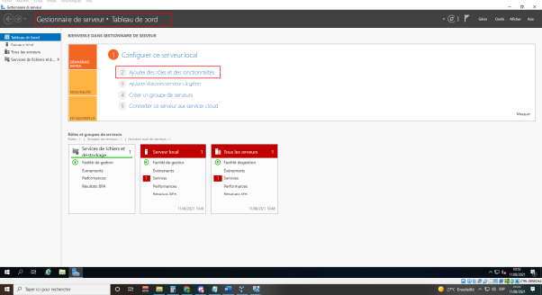

# Installer et configurer un domaine ActiveDirectory

COURS COMPLETS

**L’installation de l’Active Directory:**

Dans la compétence précédente, nous avons pu voir que **Active Directory** (AD) est un ensemble structuré de données, mais également une unité de services qui rassemble les utilisateurs aux ressources du réseau afin qu'ils puissent accomplir leur fonction.

La base de données, aussi appelée répertoire, détient toutes les informations indispensables sur notre cadre informatique.

Dans cette compétence, nous allons voir pas à pas comment installer **Server Active Directory** et découvrir les outils disponibles pour l'administrer.

(vidéo) Découvrez l’installation de l’Active Directory  
Pour commencer dans le gestionnaire de serveurs nous allons cliquer sur “gérer” ensuite sur ajouter des rôles et fonctionnalités” sur la page qui s’affiche on clique sur “suivant” concernant la sélection du type d’installation, nous laisserons par défaut l’installation basée sur un rôle ou une fonctionnalité et cliquer sur “suivant” pour la sélection du serveur on laissera égalemnt par défaut et nous allons directement aller sur “suivant” pour le rôle des serveurs nous allons cliquer sur “service AD DS puis sur “ajouter des fonctionnalités” et “suivant”. Pour la sélection des fonctionnalités on ne touchera pas on ira directement cliquer sur “suivant” Puis “suivant” jusqu’à confirmer les sélections d’installation en cliquant sur “installer” et par la suite l’ordinateur va redémarrer en cliquant sur fermer. Dans le gestionnaire de serveur sur la gauche nous pouvons voir que l’active directory a bien été installé.  
**Installation pas à pas de l'Active Directory:**

### ***Méthode***

###     **Découvrez l'installation de l'Active Directory**

**Étape 1** : allez dans « ***Gestionnaire de serveur*** » \> « ***Tableau de bord*** ».

Ici se trouve l'assistant d'ajout de rôles et de fonctionnalités. Il faut lire les informations avant de commencer l'installation. Puis, cliquez sur « ***Suivant*** ».

### ***Exemple***

###     **Assistant d'installation**

****

### ***Méthode***

**Étape 2** : choisissez le type d'installation, puis cliquez sur « ***Suivant*** ».

![][image3]

**Étape 3** : sélectionnez le serveur sur lequel seront installés les rôles et les fonctionnalités pour **Active Directory**. Cliquez sur « ***Suivant*** » une fois terminé.

![][image4]

**Étape 4** : choisissez les rôles à installer (« ***Service AD DS*** ») et cliquez sur « ***Ajouter des fonctionnalités*** ».

![][image5]

![][image6]

### ***Complément***

Il est impossible d'installer les **Services AD DS** tant que les services de rôles ou les fonctionnalités qui sont listés ne sont pas installés.

### ***Méthode***

Après avoir cliqué sur « ***Ajouter des fonctionnalités*** », on peut observer que le **Service AD DS** est bien coché. Vous pouvez alors continuer en allant sur « ***Suivant*** ».

### ***Exemple***

###    **Sélection des rôles des serveurs**

**![][image7]**

### ***Méthode***

À ce stade de l'installation d'Active Directory, il faut laisser les fonctionnalités cochées par défaut ; il ne faut rien modifier. Continuez sur « ***Suivant*** ».

### ***Exemple***

###     **Sélection des fonctionnalités**

**![][image8]**

### ***Méthode***

Dans les services de domaine Active Directory, toutes les informations à connaître sont stipulées. Pour commencer l'installation, cliquez sur « ***Suivant*** ».

### ***Exemple***

###     **Services AD DS**

**![][image9]**

### ***Méthode***

**Étape 5** : cliquez sur « ***Installer*** » pour confirmer les sélections d'installation, et AD DS sera appliqué.

![][image10]

**Étape 6** : une fois l'installation réussie, cliquez sur « ***Fermer*** » sans interrompre les tâches qui sont en cours d'exécution.

![][image11]

![][image12]

### ***Complément***

Après l'installation, on peut retrouver les services de domaine de l'Active Directory dans le « ***Gestionnaire de serveur*** ».

Si l'on fait le parcours « ***Gestionnaire de serveur*** » \> « ***Tableau de bord*** » \> « ***Outils*** », on peut voir apparaître les différents outils qui vont permettre d'administrer l'AD.

![][image13]

**La configuration de l’Active Directory:**

**L’importance de bien paramétrer l’AD:**

Indivisible de Windows, on a pu voir, dans la compétence précédente, quel rôle joue l'**Active Directory**. Il sert comme on pourrait dire d'annuaire, il fonctionne comme un système qui gère et stocke toutes les informations que peut posséder un réseau.

Afin que l'**AD DS** puisse agir correctement, il faut mettre en place des contrôleurs de domaine.

À quoi sert un **contrôleur de domaine** ?

C'est un type de serveur qui va se servir des données stockées dans l'Active Directory, et qui va permettre d'identifier et d'inspecter les usagers qui vont se connecter au réseau informatique.

Si on compare l'Active Directory à un contrôleur de domaine, on peut alors en déduire que l'AD DS est un domaine, et le contrôleur de domaine exécute celui-ci.

Le contrôleur de domaine participe à la coordination et la protection des données.

Derrière chaque intrusion se cache un déploiement Active Directory (AD) fragile. AD est devenu une cible privilégiée des attaquants qui souhaitent utiliser des vulnérabilités et des erreurs de configuration connues pour élever les privilèges et faciliter les mouvements latéraux.

Malgré tout, en raison des erreurs de configuration qui s'accumulent à mesure que la complexité du domaine augmente, la plupart des entreprises ont du mal à sécuriser Active Directory. Par conséquent, l'équipe de sécurité ne peut pas trouver et corriger les vulnérabilités avant qu'elles ne deviennent des problèmes affectant l'entreprise.

Ainsi, Active Directory vous aide à organiser les utilisateurs, les ordinateurs, etc. de votre entreprise. Votre administrateur utilise AD pour organiser l'ensemble de la hiérarchie de votre entreprise, quels ordinateurs appartiennent à quel réseau, à quoi ressemble votre photo de profil ou quels utilisateurs peuvent accéder à la salle de stockage.

Vous l'aurez compris, Active Directory est le noyau principal de l'infrastructure informatique de chaque entreprise dans le monde, et la première couche pour construire la sécurité, la conformité, l'automatisation pour les utilisateurs et les ordinateurs. Pour créer la bonne infrastructure, il n'est pas nécessaire d'être un assistant, mais il est important de connaître quelques petites astuces pour éviter les problèmes de configuration et de sécurité.

**Configuration de l’Active Directory:**

Après avoir vu l'installation de l'Active Directory, nous allons voir maintenant comment procéder à la configuration d'AD DS et mettre en place un contrôleur de domaine, afin que celui-ci soit fonctionnel en tout temps.

**Étape 1 :** allez dans « ***Gestionnaire de serveur*** » → « ***Tableau de bord*** » → Cliquez sur le drapeau et triangle jaune, comme sur la capture, puis cliquez de nouveau sur « ***Promouvoir ce serveur en contrôleur de domaine*** ».

![][image14]

**Étape 2 :** pour commencer la configuration de déploiement, cliquez sur « ***Ajouter une nouvelle forêt*** » puis nommez votre domaine racine. Dans notre cas, ce sera **STUDI.SRV**.

Poursuivez avec « ***Suivant*** ».

![][image15]

**Étape 3 :** dans les options de contrôleur de domaine, il faut mettre en place un mot de passe, par sécurité, si on a besoin de restaurer notre serveur.

Cliquez ensuite sur « ***Suivant*** ».

![][image16]

Dans la sélection du niveau fonctionnel, on laissera par défaut. Le niveau fonctionnel sert à déterminer les limites des fonctionnalités si une version antérieure de Windows était installée.

**Étape 4 :** ici, dans l'étape « ***Options DNS*** », il est demandé de créer une délégation DNS, mais il ne faudra rien modifier. Continuez la configuration en allant sur « ***Suivant*** ».

![][image17]

**Étape 5 :** Dans l'onglet « ***Options supplémentaires*** », si le nom **NetBIOS** attribué au domaine est correct, il vous suffit de cliquer sur « ***Suivant*** ». Dans le cas contraire, il est tout à fait possible de le modifier.

![][image18]

**Étape 6 :** Dans la continuité de l'**Assistant Configuration des services de domaine Active Directory**, cette étape concerne les chemins d'accès. Il faut spécifier l'emplacement de la base de données de l'Active Directory. Ici, laissez par défaut et poursuivez la configuration.

![][image19]

**Étape 7 :** la partie « ***Examiner les options*** » concerne tout ce qui a été configuré précédemment. Une vérification des sélections est conseillée avant de continuer la configuration. Cliquez sur « ***Suivant*** » une fois terminé.

![][image20]

**Étape 8 :** Dans le passage de « ***Vérification de la configuration requise*** », certaines icônes peuvent faire penser à des anomalies, mais il ne faut pas y prêter attention. Les modifications se feront plus tard. Cliquez sur « ***Installer*** ».

![][image21]

Cliquez sur « ***Installer*** » : le serveur va redémarrer.

**Étape 9 :** après le redémarrage du serveur, entrez les identifiants.

![][image22]

On pourra observer ici et dans la vidéo qu'il apparaît **STUDI\\Administrateur** et non plus **Administration** avant la configuration. Donc, on peut en déduire que le domaine a bien été configuré.

Si l'on se rend dans le « ***Gestionnaire de serveur*** » → « ***Serveur local*** », on verra le nom du domaine qui a été créé.

![][image23]

(vidéo) configuration active directory

Dans gestionnaire de serveur on clique sur le drapeau en haut à droite ensuite sur “promouvoir ce serveur en contrôleur de domaine”. Dans la configuration de déploiement on clique sur “ajouter une nouvelle forêt” puis spécifier un nom de domaine et cliquer sur “suivant”. Dans les options du contrôleur de domaine on va créer un mot de passe pour le mode de restauration en cas de problèmes pour les services d’annuaires et cliquer sur “suivant”. Sur la fenêtre option DNS nous allons tout laisser par défaut et cliquer sur “suivant”, ici dans les options supplémentaires nous allons vérifier le nom du NetBIOS et le modifier si nécessaire et cliquer sur “suivant”. Concernant les chemins d’accès nous allons le laisser par défaut et cliquer sur “suivant”. Dans l’examination des options on va vérifier nos sélections et cliquer sur “suivant”. On va attendre la vérification de la configuration, si les vérifications ont donné satisfaction, on peut cliquer sur “installer”, L’ordinateur va redémarrer, on clique sur “fermer” et encore une fois sur “fermer”, l’ordinateur redémarre. Après le redémarrage de notre serveur, on peut constater que notre domaine a bien été appliqué mais afin de vérifier que l’AD DS a bien été configuré, nous allons rentrer dans le gestionnaire de serveur, pour ce faire on rentre notre mot de passe et cliquer sur “entré”, notre gestionnaire de serveur va s’ouvrir et onv oit à gauche l’AD DS donc la configuration du domaine a bien été appliquée car on voit le nom de domainequ’on a configuré.

**Bonnes pratiques:**

Lorsque vous envisagez de créer une infrastructure Active Directory, il est bon de connaître quelques conseils pour éviter les problèmes de sécurité et de configuration :

* **Renommer l'administrateur de domaine.** Le premier utilisateur utilisé pour lancer une attaque est l'administrateur ; votre première étape consiste donc à changer le nom d'administrateur de domaine par défaut. Utilisez un nom complètement différent des normes, comme AdminContosoAD.  
* **Mot de passe fort pour l'administrateur de domaine.** Sécurité, sûreté, sécurité \! L'administrateur du domaine doit avoir un mot de passe fort et les informations d'identification doivent être réservées.  
* **Informations d'identification dédiées pour l'informatique.** L'une des premières règles consiste à séparer les informations d'identification par défaut de la direction pour empêcher une escalade de la sécurité en cas d'attaque externe.  
* **Attribuer la bonne autorisation.** Si vous avez plusieurs administrateurs dans votre infrastructure, il est fondamental d'attribuer la bonne autorisation et les bonnes informations d'identification pour chaque utilisateur. Personne ne doit être au-dessus des administrateurs de domaine pour éviter la possibilité de changer le schéma AD ou de modifier le modèle de forêt.  
* **Configurer GPO.** Configurer les stratégies de groupe par utilisateurs et ordinateurs, cela permet une granularité parfaite. N'oubliez pas d'éviter trop d'objets de stratégie de groupe, mais également de regrouper de nombreux paramètres dans un seul objet de stratégie de groupe. N'utilisez pas l'objet « stratégie de groupe » en tant que stratégie de domaine par défaut \!  
* **Mot de passe fort pour les utilisateurs.** L'administrateur de domaine, mais aussi tous les utilisateurs doivent répondre aux exigences de complexité du mot de passe. Si vous utilisez Windows 10, une idée consiste à configurer Windows Hello Entreprise pour simplifier la méthode d'authentification, sans réduire la sécurité.  
* **Activer la corbeille.** La corbeille a été introduite dans Windows Server 2008 R2 et constitue le moyen idéal pour restaurer un élément en quelques secondes, sans avoir à exécuter AD Restore.  
* **Au moins deux contrôleurs de domaine.** Peu importe si votre infrastructure n'est pas une entreprise, vous devez avoir deux contrôleurs de domaine pour éviter les pannes critiques.  
* **Supprimer les éléments obsolètes.** N'oubliez pas de nettoyer votre infrastructure d'utilisateurs et d'ordinateurs là où ils ne sont plus présents ou nécessaires. Ceci afin d'éviter des problèmes ou des problèmes de sécurité.  
* **Un contrôleur de domaine n'est pas un ordinateur.** N'installez rien à l'intérieur d'un contrôleur de domaine \! Pas de logiciel, pas d'applications tierces, pas de rôles, rien \!  
* **Règle de convention de nommage.** Définissez une convention de nommage avant de créer votre infrastructure, utilisateurs, clients, serveurs, appareils et ressources (groupes, partages, etc.). Cela vous aidera à simplifier la gestion et l'évolutivité.  
* **Patcher vos contrôleurs de domaine.** Les attaquants exploitent rapidement les vulnérabilités connues, ce qui signifie que vous devez toujours maintenir votre machine à jour. Planifiez le bon moment pour installer les mises à jour Windows.  
* **Audit.** Déployez une solution d'audit pour savoir qui effectue les modifications. Ce n'est pas une exigence du RGPD, mais un moyen d'éviter les problèmes de sécurité.

**L’intégration des postes au domaine Active Directory:**

**Intégration d’un poste client:**

### ***Contexte***

Nous savons que l'Active Directory est défini comme une base de données intégrant un regroupement de services favorisant la mise en relation entre les utilisateurs et les ressources de réseau, c'est-à-dire un assemblage de matériels connectés entre eux par le biais d'un réseau qui permet aux utilisateurs de réaliser leurs objectifs.

La principale mission de l'Active Directory est d'authentifier et d'identifier un poste sur Windows.

Dans les cours qui ont précédé, nous avons pu voir comment se déroulait la configuration de l'Active Directory, ainsi que la définition d'un DNS et d'un annuaire informatique.

Ces compétences vont nous aider dans ce cours, car il faut savoir que, quand nous sommes sur un poste client, il est nécessaire de faire apparaître toutes les propriétés liées au système.

### ***Méthode***

###    **Découvrir l'intégration d'un poste client au domaine Active Directory**

Dans la compétence précédente, nous avons pu voir la configuration de l'Active Directory. Maintenant, nous allons voir, pas à pas, comment intégrer des postes de travail dans un domaine AD.

* **Étape 1 :**

Dans l'explorateur de Windows, effectuez un clic-droit sur « *Ce PC* », puis cliquez sur « *Propriétés* ».

![][image24]

Il est également possible d'afficher les propriétés du système en passant par le « *Panneau de configuration* », en cliquant ensuite sur « *Système et sécurité* » et « *Système* ».

* **Étape 2 :** cliquez sur « *Protection du système* » ou bien « *Paramètres système avancés* ».

* **Étape 3 :** apparaît ensuite une fenêtre, dans laquelle il faut cliquer sur l'onglet « *Nom de l'ordinateur* » et « *Modifier* ».

![][image26]

Cette fenêtre du panneau de configuration va nous permettre de procéder à la modification du nom du poste de travail.

* **Étape 4 :** dans la partie « *Membre d'un* », cliquez sur « *Domaine* », puis saisissez le nom du domaine Microsoft. Ici, ce sera **SRV.STUDI**, et validez en cliquant sur « *OK* ».

![][image27]

Il faut noter que tous les postes d'ordinateurs sont intégrés dans un groupe de travail.

* **Étape 5 :** une nouvelle fenêtre va s'ouvrir, il s'agit de la modification du nom ou du domaine de l'ordinateur. Dans cette étape, rentrez les paramètres du compte qui sont « *SRV\\dam* » et le mot de passe de la session, puis cliquez sur « *OK* » pour valider.

![][image28]

Si les étapes ont été correctement respectées, une nouvelle fenêtre avec un message s'affiche, en indiquant : « ***Bienvenue dans le domaine SRV.STUDI*** » (ou le nom que vous aurez choisi).

![][image29]

| Modification du nom ou du domaine de l'ordinateur |
| :---: |

*   
  **Étape 6 :** pour finaliser l'intégration d'un poste client dans Active Directory, il est nécessaire de procéder au redémarrage de l'ordinateur.

Cliquez sur « *Redémarrer maintenant* » pour poursuivre.

![][image30]

* **Étape 7 :** une fois l'ordinateur redémarré, on peut constater que l'écran indique le domaine de connexion qui a bien été configuré.

![][image31]

### (vidéo) Samba Active Directory

Samba AD est un équivalent open source à microsoft active directory ils ont les mêmes fonctionnalités à part que Samba AD ne dispose pas de frais de license. La première version de Samba a vue le jour en 1992\. Samba se nomme ainsi due au protocole de communication et de partage de fichiers qu’il utilise. Il utilise le protocole SMB (Server Message Block) qui sert à échanger des fichiers sur les réseaux de tous les systèmes d’exploitation qui incluent la gestion centralisée de l’indentification et d’autentification en mode domaine active directory, ainsi que la gestion centralisée des groupes, les droits d’accès aux fichiers et répertoires mais aussi de partager des fichiers selon la version du protocole Microsoft SMB ainsi que le partage d’imprimantes. Samba va ainsi évoluer en 4 versions, la quatrième version est celle qui devient un active directory en 2005 avec les spécifications de Microsoft. En 2012 Samba 4 a totalement été réécris avec 3 composants majeurs. Le premier composant est l’atcive directory, le deuxième le partage de fichiers SMBD (SaMBa Daeman) et le troisième le mapping utilisateur winbindd. La version de Samba 4 a évoluée et est devenue un logiciel à part entière avec la fonctionnalité de contrôleur de domaine Active Directory. Il inclut dans ses fonctionnalités les services DNS, LDAP, Kerberos, RPC et Samba 3 avec la gestion des GPO(group policy object). L’évolution et les mises à jour de Samba AD permettent de nouvelles fonctionnalités. Parmis ces nouvelles fonctionnalités, les plus pertinantes sont la possibilité d’exporter les GPO à partir d’un domaine dans un fichier XML pour obtenir des backups des GPO.Ensuite, il permet grâce à une nouvelle commande de pouvoir sauvegarder en mode hors ligne en toute sécurité. Samba AD supporte python 2 et python 3\. Il permet également de voir le numéro d’identification d’évènements de Windows ainsi que le nom d’utilisateur.   
Pour résumer, la version de Samba qui a pu fusionner avec Active Directory est Samba 4\. Il utilise le protocole SMB d’où son nom pour permettre le partage de fichiers et d’imprimantes par le réseau. L’évolution de Samba AD lui a permis de pouvoir monter en popularité avec le système d’exploitation (OS) de Linux. Il a inclut dans ses fonctionnalités plusieurs serviuces tels que les srvices DNS et la gestion des GPO.  
**Bonnes pratiques de configuration des machines virtuelles sous AD:**

Il y a quelques règles à retenir lors de la création d'un contrôleur de domaine dans une machine virtuelle :

* **Prise en charge des contrôleurs de domaine virtualisés.** À partir de Windows Server 2012, lorsqu'une nouvelle fonctionnalité appelée VM Generation-ID est ajoutée, l'installation de contrôleurs de domaine en tant que machines virtuelles est prise en charge.  
* **Doit-on utiliser un DC physique ?** Cela dépend de l'infrastructure, mais, pour la plupart des entreprises, la réponse est non. Il est important de configurer l'opération de démarrage pour qu'elle démarre toujours dans les 0 secondes.  
* **Ne virtualisez pas les points de contrôle** : les points de contrôle DC sont désormais pris en charge, mais il est préférable d'éviter cela.  
* **Désactiver la synchronisation de l'heure** : les contrôleurs de domaine veulent qu'ils soient au sommet de la hiérarchie de l'heure locale et quittent le service de synchronisation de l'heure de l'hôte. Cela entraînera le remplacement forcé de toute autre source définie par le service de temps Windows, ce qui peut causer des problèmes.  
* **Ne mettez pas le contrôleur de domaine dans un état enregistré.** Lorsqu'une machine virtuelle est restaurée à partir d'un état enregistré ou est restaurée vers un point de contrôle, la seule garantie que son horloge est réglée est de synchroniser l'heure du service. Cependant, comme vous le savez d'après ce qui précède, vous ne pouvez pas activer cette fonctionnalité sur un contrôleur de domaine virtualisé. Si son horloge est trop obsolète, il se peut qu'il ne se répare jamais automatiquement.  
* **Ne convertissez pas les contrôleurs de domaine**, que vous soyez un contrôleur de domaine physique ou un contrôleur de domaine virtuel, la conversion est erronée et n'est pas prise en charge. Si vous souhaitez migrer de VMware vers Hyper-V, vous devez réinstaller le contrôleur de domaine à partir de zéro ; si vous avez un DC physique, il en va de même.  
* **Conversion de type mise à niveau sur place** : la mise à niveau sur place n'est pas prise en charge. Par conséquent, si vous installez une nouvelle version de Windows Server, prévoyez de déployer de nouveaux ordinateurs, ajoutez-les à la forêt AD, déplacez les rôles FSMO et rétrogradez le contrôleur de domaine le plus ancien. Il n'y a pas d'autre moyen \!  
* **Les réplicas ne doivent pas être utilisées dans la plupart des cas.** Si vous disposez d'un site distant de reprise après sinistre, il peut être préférable de configurer un autre contrôleur de domaine et d'utiliser un système de réplication AD.  

  **L’identification des objets de l’annuaire:**

  ### ***Contexte***

Qu'est-ce qu'un ADSI Edit ?

ADSI Edit ou Active Directory Services Interfaces Editor est un éditeur d'annuaires de Microsoft qui peut régir la modification ainsi que l'affichage des attributs des objets dans Active Directory.

Il permet aussi de modifier tous les attributs qu'il est impossible d'étudier à partir des autres consoles d'administration d'annuaires, comme les utilisateurs et ordinateurs Active Directory ou bien les sites ou encore les services.

### **Quels sont les objectifs de ADSI Edit et à qui profitent-ils ?**

Les interfaces ADSI forment comme un groupe, une bibliothèque d'interfaces, et sont basées sur le modèle COM (*Component Object Model*, procédé de composants logiciels créé par Microsoft en 1994). Celles-ci servent à parvenir à tous les services d'annuaires qui proviennent de réseaux distincts.

Faisant partie de l'annuaire Active Directory, les propriétés de l'ADSI sont présentées sous forme d'attributs. Ces attributs sont manœuvrés par les applications ou l'annuaire lui-même.

Il n'est pas sans savoir que ADSI est appliqué dans le domaine de l'informatique. Les services ADSI peuvent être utilisés dans le cadre de la gestion des ressources présente dans un service d'annuaire et, ceci, dans n'importe quel réseau qui retient la ressource.

Comme indiqué plus haut dans la partie contexte, l'ADSI peut être manipulée par les administrateurs afin de pouvoir gérer diverses tâches, comme gérer les imprimantes, ajouter, modifier ou supprimer des utilisateurs et / ou groupes.

Les interfaces de services peuvent également servir aux éditeurs de logiciels autonomes qui leur permettront d'activer l'annuaire directement depuis leurs applications.

L'annuaire sert aussi à effectuer des recherches de services pour les clients.

(vidéo) Comment fonctionne Active Directory et quelle est sa structure

Le principal service Active Directory est Active Directory Domain Services (AD DS) qui fait lui-même parti du système d’exploitation Windows Server. Ces serveurs qui exécutent AD DS constituent des contrôlleurs de domaine. En général, les entreprises ont plusieurs contrôlleurs de domaines chacun possédant un exemplaire de l’annuaire pour l’ensemble du domaine. Les variations apportées au répertoire sur l’un des contrôleur de domaine sont copiés sur les autres contrôleurs de domaine afin qu’ils restent tous à jour. Un serveur de répertoire global est un contrôleur de domaine qui enregistre une copie intégrale de tous les objets de son répertoire de domaine  et des copies intermédiaires des objets de tous les autres domaines de la forêt. Par conséquent, les utilisateurs et les applications peuvent trouver des objets dans n’importe quel domaine de leur forêt. Les postes de travail, les appareils portables et les autres périphériques basés sur Windows autre que Windows Server peuvent être intégré à l’environnement Active Directory. Cependant ils n’exécutent pas AD DS. AD DS repose sur divers protocoles et normes définis notamment le protocole LDAP (Lightweight Directory Access Protocol), le protocole Keberos et le DNS (Domain Name System). Il est essentiel de préciser qu’Active Directory n’est accessible que pour les environnements sur site de Microsoft. Les environnements Microsoft dans le cloud emploient Azure Active Directoryqui a la même fonctionnalité que son homologue local. Bien que AD  et Azure AD soient deux outils différents, ils peuvent fonctionner ensemble si votre entreprise possède un environnement informatique à la fois local et dans le cloud. AD fournit 3 niveaux principaux: Domaine, Arbre et Forêt. Un domaine est un groupe dans lequel les différents utilisateurs AD, ordinateurs et objets sont liés. Plusieurs domaines peuvent être combinés pour former un arbre et la combinaison des arbres forme une forêt. N’oubliez pas qu’un domaine représente une étendue administrative. Les objets spécifiques au domaine sont stockés dans une base de donnée et peuvent être gérés de manière centralisée. La forêt est une zone sûre, les objets de différentes forêts ne peuvent pas s’affecter à moins que les administrateurs de chaque forêt établissent une relation de confiance entre eux. 

**Identification des objets de l'annuaire:**

### ***Méthode***

###     **Découvrez l'identification des objets de l'annuaire**

Dans ce cours, toujours dans le chapitre de l'Active Directory, nous allons voir comment utiliser l'outil ADSI Edit dans le serveur Windows 2019\.

**Étape 1** : Rendez-vous dans « ***Gestionnaire de serveur*** » puis « ***Outils*** ».

Cherchez ensuite « ***Modification ADSI*** » et cliquez dessus.

![][image32]

L'éditeur ADSI :

![][image33]

**Étape 2** : Afin de pouvoir commencer à créer une connexion vers les services, faites un clic droit sur « ***Modification ADSI*** » puis cliquez sur « ***Connexion*** ».

![][image34]

**Étape 3** : Après avoir cliqué sur « ***Connexion*** », une nouvelle fenêtre s'ouvre avec le menu des « ***Paramètres de connexion*** ».

À cette étape, il faut rentrer le nom de domaine et laisser par défaut ce qui est déjà coché. Cliquer ensuite sur « ***OK*** » pour continuer la manipulation.

![][image35]

On peut constater ensuite que la connexion a bien été créée et établie.

Connexion établie :

![][image36]

**Étape 4** : Cliquez sur « ***SRV.STUDI*** », dans la partition présente dans le volet situé à gauche. Vous accédez à un déroulé, dont l'éditeur ADSI affiche tous les groupes et comptes d'utilisateurs. Ici, il est possible de modifier, supprimer, renommer ou encore déplacer tous les dossiers des postes de travail, des groupes et comptes utilisateurs.

![][image37]

Dans « ***CN=Users*** » apparaissent toutes les sessions que nous avons créées précédemment dans notre Active Directory.

Sessions créées dans Active Directory :

![][image38]

**Étape 5** : Si on fait un clic droit sur une session, comme « ***CN=DAM*** » par exemple, il est possible de procéder à une nouvelle connexion, de réinitialiser le mot de passe ou encore d'actualiser.

Mais ici, on va continuer en allant dans « ***Propriétés*** ».

![][image39]

Dans cet onglet apparaissent tous les détails de l'éditeur d'attributs.

Quelques soient les propriétés, elles sont modifiables.

Éditeurs d'attributs :

![][image40]

### ***Complément***

Pour retrouver un attribut qui n'est pas dans la liste, il suffit de cliquer sur « ***Filtrer*** » et ensuite de décocher l'option « ***Afficher uniquement les attributs qui ont des valeurs*** ».

### ***Méthode***

Dans cette étape, on va procéder à une modification pour observer comment fonctionne l'ADSI Edit.

Dans le cas de la démonstration du cours, vous allez modifier le nom de la session encadrée en rouge : « ***displayName DAM*** »

### ***Exemple***

###     **Modification de la session displayName DAM**

**![][image41]**

### ***Méthode***

**Étape 6** : Cliquez sur « ***Modifier*** », entrez de nouveau le nom, cliquez sur « ***OK*** » et enfin sur « ***Appliquer*** ».

![][image42]

**Étape 7** : Maintenant, on va vérifier si la modification du nom a bien été prise en compte.

Allez dans « ***Centre d'administration Active Directory*** », cherchez ensuite l'utilisateur qui vient d'être modifié, faites un clic droit et allez sur « ***Propriétés*** ».

![][image43]

Cette fenêtre affiche tous les détails de la session.

Vous pouvez constater que le **Nom complet** a été bien modifié.

Modification du nom prise en compte :

![][image44]

**La création et l’organisation des unités organisationnelles, utilisateurs et groupes:**

**Unité d’organisation dans l’Active Directory:**

### ***Contexte***

Après avoir vu dans les compétences précédentes « *L'intégration des postes au domaine Active Directory* » et « *L'identification des objets de l'annuaire* », nous allons poursuivre avec la création et l'organisation des unités organisationnelles, utilisateurs et groupes.

Nous allons voir, pas à pas, comment créer l'organisation des unités organisationnelles des utilisateurs et groupes.

### ***Méthode***

###     **Découvrez l'unité d'organisation dans l'Active Directory**

Nous allons voir, dans un premier temps, la définition de l'unité d'organisation, puis, dans les autres parties, nous verrons comment créer l'organisation des unités organisationnelles des utilisateurs et groupes.

### **Qu'est-ce que l'unité d'organisation ?**

L'**Unité d'Organisation** ou bien **Organizational Unit (OU)** en anglais, est considérée comme un groupe dans l'Active Directory. Cet espace d'exécution va amplifier l'organisation de chaque objet présent dans l'Active Directory. Le rôle d'une unité d'organisation va permettre de décharger les tâches administratives ainsi que les droits sur les objets.

Par le biais de cette unité, un administrateur pourra ajuster des paramètres à une section d'utilisateurs bien définie ou bien affecter des autorisations de compte.

### ***Attention***

Une unité d'organisation peut rassembler une ou plusieurs sous unités d'organisation, mais chacun des attributs de l'unité d'organisation peut caractériser une entité unique.

**Création d’une unité d’organisation:**

### **Découvrez la création d'une unité d'organisation**

**Étape 1 :** Tout d'abord, allez dans le menu « ***Gestionnaire de serveur*** », cliquez sur « ***Outils*** ». Ouvrez l'onglet « ***Utilisateurs et ordinateurs Active Directory*** ».

![][image45]

**Étape 2 :** Ici, on va créer une unité organisationnelle.

Dans « ***Utilisateurs et ordinateurs Active Directory*** », accédez au nom du serveur, faites un clic droit, allez ensuite dans « ***Nouveau*** » et enfin cliquez sur « ***Unité d'organisation*** ».

![][image46]

**Étape 3 :** Dans la fenêtre qui s'affiche, choisissez et entrez un **Nom** de votre unité d'organisation. Une fois terminé, cliquez sur « ***OK*** » pour poursuivre.

![][image47]

### ***Complément***

Il est déconseillé de décocher « ***Protéger le conteneur contre une suppression accidentelle*** », car, si on supprime un fichier ou un dossier, il sera impossible de le récupérer.

**Création d’un utilisateur dans l’unité organisationnelle (UO):**

### **Découvrez la création d'un utilisateur dans l'unité d'organisation**

**Étape 4 :** Maintenant, vous pouvez créer un utilisateur.

Allez dans « ***Nouveau*** » puis cliquez sur « ***Utilisateur*** ».

![][image48]

### ***Complément***

À cette étape, il est déjà possible de déplacer une session créée auparavant.

### ***Méthode***

**Étape 5 :** À ce stade de manœuvre, on passe à la création d'un utilisateur.

Entrez les données demandées et poursuivez en cliquant sur « ***Suivant*** ».

![][image49]

### ***Complément***

Pour chaque ajout d'utilisateur, il faudra répéter la même procédure.

Si on observe bien, on peut constater que l'utilisateur « ***dami*** » pourra ouvrir une session de deux manières. Soit avec l'adresse email ou bien par le biais de l'authentification de Windows (antérieur à Windows 2000).

### ***Méthode***

**Étape 6 :** Après avoir cliqué sur « ***Suivant*** », saisissez le mot de passe de cet utilisateur, puis continuez.

![][image50]

### ***Complément***

Il est possible de choisir une option parmi les quatre proposées, concernant le mot de passe. Dans le cas de la démonstration, on ne cochera rien.

### ***Méthode***

Après avoir mis en place un mot de passe, un résumé des informations entrées précédemment pour la création de l'utilisateur s'affiche.

Cliquez sur « ***Terminer*** » et l'utilisateur sera créé.

Création de l'utilisateur terminée.

![][image51]

**Création d’un groupe dans l’unité organisationnelle:**

### 

Maintenant que l'utilisateur a été créé, nous passons à la création d'un groupe.

**Étape 7 :** Pour créer un groupe, faites un clic-droit, allez dans « ***Nouveau*** » et continuez sur « ***Groupe*** ».

![][image52]

**Étape 8 :** Entrez le nom du groupe que vous souhaitez mettre en place.

Laissez les options par défaut dans « ***Étendue du groupe*** », puis cliquez sur « ***OK*** ».

![][image53]

### ***Conseil***

Il est conseillé de laisser coché « ***Globale*** » car cette option va permettre au membre du groupe de pouvoir ajouter d'autres groupes ou d'autres comptes qui viennent seulement du domaine dans lequel le groupe aura été déterminé.

### ***Méthode***

###     **Création du groupe terminée**

**![][image54]**

Dans le groupe informatique qui a été formé, il sera possible d'y ajouter plusieurs utilisateurs. Il est également possible de déplacer les utilisateurs d'un groupe vers un autre, de les supprimer d'un groupe.

(vidéo) La création et l’organisation des unités organisationnelle

Dans gestionnaire de serveur aller sur “outil” puis “utilisateurs et ordinateurs Active Directory”. Pour créer une unité d’organisation faire un clic droit sur notre nom de domaine aller sur “nouveau” puis “Unité d’organisation” entrez le nom de l’unité et cliquer sur “ok”. L’UO qui vient d’être créée apparaît dans l’arborescence du nom de domaine. Si vous souhaitez créer des utilisateurs ou groupe dans l’unité d’organisation, aller dans l’unité d’organisation faire un clic droit puis “nouveau” puis “groupe”, entrez le nom de groupe puis cliquer sur “ok”. Le groupe qui vient d’être créé apparaît bien dans l’uo, même schéma pour créer un utilisateur faire un clic droit puis nouveau puis utilisateur, entrez les données de l’utilisateur suivant créez un mot de passe puis suivant puis terminer. Lutilisateur qui vient d’être créé apparaît dans l’uo.

**Configurer les stratégies de groupe: GPO:**

 ***Contexte***

Dans un environnement professionnel, les entreprises doivent gérer efficacement les configurations de leurs systèmes informatiques afin d'assurer la sécurité, la productivité et la conformité aux politiques internes. Pour y parvenir, les administrateurs systèmes utilisent les stratégies de groupe (GPO), un outil centralisé permettant de contrôler et automatiser divers paramètres sur les postes clients et serveurs. Ce cours vous prépare à utiliser cet outil en simulant des situations réelles de gestion informatique, afin de vous rendre opérationnel dans des fonctions d'administration réseau ou de support technique.

**Introduction aux Stratégies de groupes GPO:**

**Définition et utilité des GPO:**

### ***Définition***

Une stratégie de groupe (ou GPO \- Group Policy Object) est un ensemble de règles permettant de gérer et de configurer, de manière centralisée, les paramètres d’ordinateurs et d’utilisateurs dans un environnement Windows. Elle agit comme un outil d'administration pour automatiser les tâches répétitives, standardiser les paramètres et sécuriser les postes de travail ainsi que les comptes utilisateurs.

### ***Fondamental***

Les GPO sont essentielles à la gestion centralisée d’un parc informatique. Elles permettent de définir des configurations qui sont appliquées automatiquement aux ressources (ordinateurs ou utilisateurs) d’un réseau Active Directory, réduisant ainsi le besoin d’interventions manuelles. Ces stratégies offrent aux administrateurs une grande souplesse pour contrôler les paramètres critiques de l’infrastructure, garantissant à la fois cohérence et conformité.

Les stratégies de groupe peuvent être utilisées pour diverses finalités, telles que :

* Renforcer la sécurité du réseau (ex. : forcer l'utilisation de mots de passe complexes).  
* Standardiser les configurations sur tous les postes (ex. : définir des configurations réseau ou des restrictions d'accès).  
* Automatiser le déploiement d’applications ou la configuration de nouveaux postes.

### ***Exemple***

Une entreprise souhaitant interdire l'accès au gestionnaire de tâches pour certains utilisateurs. Une stratégie de groupe peut être créée pour désactiver cette fonction, et elle sera automatiquement appliquée à tous les utilisateurs concernés. Ainsi, l’administrateur n’a pas besoin de configurer cette restriction poste par poste.

### ***Conseil***

Il est préférable de centraliser toutes les règles et configurations critiques dans des GPO bien structurées pour éviter des erreurs ou des oublis. De plus, il est recommandé de tester les stratégies sur un groupe restreint avant de les appliquer au reste du réseau.

**Principe de fonctionnement des GPO:**

### ***Définition***

Les stratégies de groupe (GPO) sont appliquées selon différents emplacements et suivent une hiérarchie stricte dans leur mise en œuvre. Cette organisation permet de structurer l’application des configurations sur les utilisateurs et les ordinateurs d’un réseau Windows. La connaissance des types de GPO, de la hiérarchie et de l’ordre de priorité permet une gestion efficace.

Les GPO peuvent être définies à différents niveaux d’application, ce qui influe sur leur portée et leur priorité. Ces niveaux sont conçus pour répondre aux besoins variés des infrastructures informatiques.

* GPO locales : les stratégies locales sont définies sur un ordinateur et s’appliquent uniquement à ce dernier. Elles sont utiles dans des environnements isolés ou pour des configurations spécifiques à un poste. Toutefois, elles ne permettent pas de gestion centralisée, ce qui limite leur utilisation dans les grandes entreprises. Elles sont également prioritaires uniquement en l’absence d’autres GPO provenant d’un domaine.  
* GPO de domaine : les stratégies de domaine sont créées sur un contrôleur de domaine. Elles sont diffusées à l’ensemble des objets (utilisateurs, ordinateurs) du domaine. Cela permet aux administrateurs d’automatiser et de centraliser les configurations sur tous les postes intégrés au domaine Active Directory.  
* GPO liées à une Unité d’Organisation (OU) : les unités d’organisation regroupent des objets logiques tels que des utilisateurs et des ordinateurs. Une GPO liée à une OU s’applique uniquement aux objets de cette OU et de ses sous-OU. Ce mécanisme permet une gestion ciblée et granulaire des configurations.  
* GPO liées à un site : un site représente une zone géographique définie dans Active Directory. Les GPO associées à un site s’appliquent à tous les objets se trouvant dans cette zone, quelle que soit leur appartenance à un domaine particulier. Ce type de GPO est souvent utilisé pour gérer des paramètres spécifiques à des sites distants.  
* Hiérarchie d’application des GPO : site, Domaine, Unité d’Organisation (OU) : l’application des GPO suit une hiérarchie bien définie pour gérer les priorités entre les différents niveaux. Cette hiérarchie permet d’éviter les conflits et de structurer l’application des stratégies.

L’ordre d’application est le suivant :

* GPO locale : appliquée en premier sur l’ordinateur.  
* GPO de site : appliquée ensuite, en fonction de l’emplacement géographique de l’objet dans le réseau.  
* GPO de domaine : appliquée après la stratégie de site. Elle affecte tous les objets du domaine.  
* GPO d’Unités d’Organisation : appliquée en dernier et a la priorité la plus élevée, sauf si des exceptions sont configurées.

### ***Exemple***

Si une stratégie locale autorise l’accès au Panneau de configuration et qu’une stratégie de domaine le bloque, la stratégie de domaine s’appliquera à condition que l’ordinateur soit membre du domaine.

### ***Fondamental***

La hiérarchie d'application garantit qu’une stratégie plus spécifique (comme une GPO liée à une OU) ait priorité sur une stratégie plus générale (comme une GPO de domaine). Cela permet une flexibilité importante dans la gestion des configurations.

Lorsqu’un même paramètre est configuré différemment dans plusieurs GPO, un conflit peut survenir. L’ordre de priorité, basé sur la hiérarchie, résout ce conflit en appliquant la règle provenant du niveau le plus précis. Cependant, certaines options permettent de modifier ce comportement.

* Option « *Enforce* » (Forcer) : une GPO marquée « *Enforce* » prend le dessus sur les stratégies définies à des niveaux inférieurs dans la hiérarchie, même si celles-ci sont plus spécifiques. Cette option est souvent utilisée pour imposer des règles de sécurité critiques.  
* Option « *Block Inheritance* » (Bloquer l’héritage) : une unité d’organisation peut bloquer l’application des GPO héritées des niveaux supérieurs. Cette option permet de personnaliser les configurations pour certains services ou départements sans être affectée par les stratégies générales du domaine. Cependant, une GPO marquée « *Enforce* » reste applicable même en cas de blocage de l’héritage.

### ***Exemple***

Supposons qu’une GPO de domaine impose une politique de mot de passe complexe, tandis qu’une GPO locale permet des mots de passe simples. Étant donné la hiérarchie, la politique de mot de passe complexe s'appliquera automatiquement aux ordinateurs membres du domaine, même si la stratégie locale définit des règles moins strictes.

### ***Conseil***

Pour éviter les conflits, il est recommandé de planifier soigneusement la structure des GPO en tenant compte de la hiérarchie. Testez les stratégies sur un groupe restreint d’ordinateurs avant de les appliquer à l’ensemble du parc informatique. De plus, documentez toutes les stratégies mises en place pour faciliter leur gestion et leur maintenance.

**Outils de gestion des GPO:**

Pour créer, configurer, appliquer et surveiller les stratégies de groupe (GPO), les administrateurs Windows disposent de plusieurs outils spécialisés. Ces outils permettent de gérer efficacement les différentes configurations au sein d'un environnement Active Directory, garantissant ainsi la sécurité et la cohérence des systèmes.

### ***Fondamental***

La Console de Gestion des Stratégies de Groupe (GPMC, en anglais Group Policy Management Console) est l’outil principal pour la gestion centralisée des GPO. Elle offre une interface qui permet de créer, modifier, et lier les stratégies de groupe à différents niveaux hiérarchiques dans Active Directory.

![][image55]

Avec la GPMC, un administrateur peut :

* Créer, modifier ou supprimer des stratégies de groupe (Gérer les stratégies de groupe).  
* Lier les stratégies à des sites, domaines ou unités d’organisation (UO).  
* Configurer des paramètres avancés, comme les filtres de sécurité ou les filtres WMI (Windows Management Instrumentation).  
* Exporter et importer des stratégies pour faciliter leur sauvegarde et réutilisation.  
* Consulter l’ordre d’application des stratégies via la fonctionnalité « *Ordre de traitement* ».  
* Diagnostiquer les conflits entre GPO en utilisant les rapports fournis par l’outil.

En français, la GPMC est disponible sous le nom « *Gestion des stratégies de groupe* ». Cet outil se trouve dans la section "Outils d’administration" du menu Démarrer ou via la commande gpmc.msc.

### ***Exemple***

Supposons qu'un administrateur veuille empêcher les utilisateurs d'un service de modifier leurs paramètres réseau. Avec la GPMC, il peut créer une nouvelle GPO, configurer cette restriction, et la lier à l’Unité d’Organisation (UO) correspondante. Cette stratégie s'appliquera automatiquement aux ordinateurs de cette UO.

### **Utilisation de la console Active Directory Users and Computers (ADUC)**

**![][image56]**

La console Utilisateurs et ordinateurs Active Directory (en anglais Active Directory Users and Computers, ou ADUC) est un autre outil essentiel. Elle permet de gérer les objets du réseau, comme les utilisateurs, les groupes, les ordinateurs et les unités d’organisation.

Bien que cette console ne permette pas directement de modifier les stratégies de groupe, elle est utilisée pour :

* Organiser les objets dans des unités d’organisation pour structurer l’application des GPO.  
* Vérifier les liens entre les UO et les GPO associées.  
* Modifier les permissions sur les objets, ce qui peut influencer l’application des stratégies (par exemple, en modifiant les appartenances à des groupes de sécurité).

La console ADUC est accessible via la commande dsa.msc ou en lançant « *Utilisateurs et ordinateurs Active Directory* » depuis les Outils d'administration.

### ***Fondamental***

La GPMC et la console ADUC travaillent de manière complémentaire :

* La GPMC est utilisée pour la gestion des stratégies de groupe proprement dite.  
* La console ADUC permet d’organiser les objets Active Directory et de vérifier les permissions et structures hiérarchiques.

### ***Fondamental***

###     **Outils complémentaires pour la gestion et le suivi des GPO**

Outil gpupdate (ou « *Actualisation des stratégies de groupe* ») :

En français, cet outil est disponible via la commande gpupdate. Il permet d’actualiser les stratégies de groupe immédiatement, sans attendre le prochain cycle de mise à jour automatique.

Les options principales incluent :

gpupdate /force : force l’actualisation de toutes les stratégies, y compris celles non modifiées.

![][image57]

gpupdate /target:user ou gpupdate /target:computer : actualise uniquement les stratégies utilisateur ou ordinateur.

Outil gpresult (ou « *Résultat des stratégies de groupe* »)

L’outil gpresult fournit un rapport détaillé sur les stratégies appliquées à un utilisateur ou un ordinateur. Cet outil est utile pour diagnostiquer les problèmes liés à l'application des GPO.

Exemples de commandes :

gpresult /r : génère un résumé des stratégies appliquées.

![][image58]

gpresult /h rapport.html : génère un rapport détaillé au format HTML.

Visualiseur d'événements (Event Viewer)

Le Visualiseur d’événements permet de consulter les journaux d’application des stratégies de groupe. Les erreurs ou avertissements liés à l'application des GPO y sont enregistrés, ce qui facilite le dépannage. il se trouve via :

En français : « *Observateur d’événements* » dans les Outils d'administration.

* Commande : eventvwr.msc,  
* Dans les journaux, les événements liés aux stratégies de groupe se trouvent dans « *Applications et services → Microsoft → Windows → Group Policy* ».

### ***Conseil***

Il est recommandé d’utiliser les commandes gpupdate et gpresult après chaque modification importante de stratégie pour vérifier leur application. La consultation régulière des journaux d’événements peut également prévenir les problèmes en identifiant rapidement les erreurs.

### ***Exemple***

Un administrateur modifie une GPO pour renforcer les paramètres de sécurité. Pour vérifier que cette modification est bien appliquée, il utilise la commande gpupdate /force pour forcer l’actualisation des stratégies, suivie de gpresult /r pour obtenir un rapport sur les stratégies effectivement appliquées au poste de test.

**Structure, Application et Gestion des GPO:**

**Types de paramètres des GPO:**

### ***Définition***

Dans un environnement Windows, les paramètres des stratégies de groupe (GPO) se distinguent en deux grandes catégories : les paramètres appliqués aux utilisateurs et ceux appliqués aux ordinateurs. Cette distinction permet d’adapter la configuration en fonction des besoins spécifiques des systèmes et des utilisateurs.

Une stratégie de groupe (GPO) est une règle ou une directive définie par un administrateur pour automatiser et centraliser la gestion des paramètres des systèmes et des utilisateurs au sein d'un réseau.

Paramètres pour les utilisateurs vs. paramètres pour les ordinateurs :

Paramètres utilisateurs : ces paramètres s’appliquent au moment de la connexion de l’utilisateur. Ils permettent, par exemple, de configurer le bureau (fonds d’écran, menu Démarrer), de définir les accès aux dossiers réseau ou de restreindre les applications disponibles.

### ***Exemple***

Modifier le fond d’écran via :

Configuration utilisateur → Modèles d’administration → Bureau → Papier peint du Bureau.

Limiter l'accès à des options système via :

Configuration utilisateur → Modèles d’administration → Menu Démarrer et barre des tâches.

Paramètres ordinateurs : ces paramètres s’appliquent au démarrage de l’ordinateur. Ils permettent de configurer des éléments comme la sécurité, les services Windows ou les paramètres réseau, indépendamment de l’utilisateur connecté.

### ***Exemple***

Paramètres ordinateurs :

Activer le pare-feu Windows via :

Configuration ordinateur → Paramètres Windows → Paramètres de sécurité → Pare-feu Windows avec fonctions avancées de sécurité.

Définir les mises à jour automatiques via :

Configuration ordinateur → Modèles d’administration → Composants Windows → Windows Update.

### ***Rappel***

Les paramètres utilisateurs suivent l’utilisateur quel que soit le poste sur lequel il se connecte, tandis que les paramètres ordinateurs restent fixes pour une machine, quel que soit l’utilisateur.

Voici les principales catégories de paramètres que vous rencontrerez dans les GPO :

Paramètres de sécurité : ils permettent de renforcer la sécurité du système en imposant des règles comme la complexité des mots de passe ou la désactivation des ports USB.

### ***Exemple***

Pour interdire l’utilisation des clés USB, vous pouvez aller dans :

Configuration ordinateur → Paramètres Windows → Paramètres de sécurité → Stratégies locales → Options de sécurité → Accès aux périphériques : refuser l'accès de stockage amovible.

### ***Rappel***

Configuration système : ces paramètres permettent de gérer les services Windows, la configuration réseau et les ressources du système.

### ***Exemple***

Vous pouvez désactiver les mises à jour automatiques en configurant :

Configuration ordinateur → Modèles d’administration → Composants Windows → Windows Update → Configurer les mises à jour automatiques.

### ***Rappel***

Modèles d’administration : ces paramètres permettent de gérer l'interface utilisateur (bureau, menu Démarrer, barre des tâches), ainsi que les fonctionnalités des applications Microsoft (comme Office).

### ***Complément***

Les Modèles d’administration sont des fichiers .ADMX ou .ADML qui définissent les paramètres disponibles. Vous pouvez personnaliser ou importer des modèles supplémentaires si nécessaire.

### ***Attention***

Une mauvaise configuration des paramètres peut entraîner des restrictions trop strictes ou des incompatibilités. Il est conseillé de tester les stratégies sur un groupe d’utilisateurs ou de machines avant de les déployer sur l'ensemble du réseau.

### ***Complément***

Windows permet d’ajouter des filtres pour affiner l’application des GPO :

* Filtrage par groupes de sécurité : limite l’application d’une stratégie à certains groupes d’utilisateurs ou d’ordinateurs.  
* Filtrage WMI (Windows Management Instrumentation) : permet d’appliquer une stratégie en fonction de critères précis, comme la version de Windows ou les ressources matérielles d’un poste.  
* Boucle de rappel (loopback) : utilisé pour forcer l’application de paramètres utilisateurs en fonction de la machine utilisée.

### ***Méthode***

Pour configurer un filtre WMI :

* Ouvrez la Console de gestion des stratégies de groupe (GPMC).  
* Sélectionnez la GPO concernée, puis allez dans l’onglet Portée.  
* Cliquez sur Filtrage WMI, puis ajoutez un filtre en fonction de vos besoins

**Paramètres d’application des GPO:**

L’application des stratégies de groupe (GPO) repose sur des mécanismes de filtrage et un cycle de traitement précis. Ces outils permettent d’adapter l’application des stratégies en fonction des besoins de l’organisation.

Le filtrage permet de définir quels utilisateurs, ordinateurs ou groupes sont concernés par une stratégie donnée.

### ***Définition***

Le filtrage d’une stratégie de groupe est une règle permettant de restreindre ou de cibler l’application d’une GPO pour certains utilisateurs ou ordinateurs uniquement.

### **Filtrage par groupes de sécurité**

Le filtrage par groupes de sécurité permet de limiter l’application d’une stratégie aux utilisateurs ou ordinateurs faisant partie de groupes Active Directory spécifiques.

### ***Méthode***

Pour configurer le filtrage par groupes de sécurité :

* Ouvrez la Console de gestion des stratégies de groupe (GPMC).  
* Sélectionnez la stratégie concernée.  
* Accédez à l’onglet Délégation.  
* Cliquez sur Ajouter et sélectionnez le groupe de sécurité concerné.  
* Accordez les autorisations d’application en cochant la case Appliquer la stratégie de groupe.

### ***Exemple***

Vous pouvez empêcher l'accès au panneau de configuration uniquement pour les utilisateurs du groupe « *Stagiaires* » en configurant un filtre sur cette GPO.

### **Ciblage par boucle de rappel (loopback)**

Le ciblage par boucle de rappel permet d'appliquer des paramètres utilisateurs en fonction de l'ordinateur sur lequel ils se connectent. Cela permet d'appliquer un profil standardisé sur des postes spécifiques, indépendamment des paramètres habituels des utilisateurs.

Deux modes sont disponibles :

* Fusion : les paramètres utilisateurs spécifiques à l’ordinateur complètent ceux déjà définis pour l’utilisateur,  
* Remplacement : les paramètres utilisateurs spécifiques à l’ordinateur remplacent complètement ceux de l’utilisateur.

### ***Méthode***

Pour activer le mode de traitement en boucle de rappel :

* Accédez à la GPO dans GPMC.  
* Naviguez jusqu’à : configuration ordinateur → Modèles d’administration → Système → Stratégie de groupe.  
* Activez Mode de traitement de la boucle de rappel de stratégie de groupe utilisateur et choisissez le mode souhaité.

### ***Exemple***

Vous pouvez utiliser le mode Remplacement pour les ordinateurs d’une salle de réunion afin de limiter l’accès à certains fichiers ou logiciels, quel que soit l’utilisateur connecté.

### **Cycle de traitement des GPO**

Les stratégies de groupe sont appliquées à des moments précis afin d’assurer la cohérence et la sécurité des configurations système.

### ***Rappel***

L’ordre d’application des stratégies est le suivant :

* Local (stratégies définies directement sur le poste)  
* Site (stratégies définies au niveau du site Active Directory)  
* Domaine (stratégies définies pour l’ensemble du domaine)  
* Unité d’organisation (OU) (stratégies définies pour des unités spécifiques)

Les stratégies définies à un niveau inférieur peuvent écraser celles héritées d’un niveau supérieur, en fonction des priorités et des options de gestion d’héritage (ex. : enforcer ou Bloquer l’héritage).

### ***Fondamental***

###     **Déroulement de l’application des GPO**

Les GPO sont appliquées à trois moments clés :

* Au démarrage de l’ordinateur : les paramètres de configuration de l’ordinateur sont appliqués lors du démarrage du système,  
* À la connexion de l’utilisateur : les paramètres utilisateurs sont appliqués au moment où l’utilisateur se connecte,  
* En arrière-plan : les stratégies sont réappliquées automatiquement toutes les 90 minutes par défaut (5 minutes pour les contrôleurs de domaine).

### ***Méthode***

Vous pouvez forcer l’application immédiate des stratégies en exécutant la commande suivante :

* Cliquez sur Démarrer et ouvrez l’Invite de commandes en mode administrateur.  
* Tapez la commande suivante dans le CMD : gpupdate /force.  
* Appuyez sur Entrée.

### ***Fondamental***

###     **Scénarios de rafraîchissement et de mise à jour**

Les stratégies peuvent nécessiter un redémarrage ou une reconnexion pour que certaines modifications soient prises en compte, notamment celles affectant la sécurité ou les services système.

### ***Conseil***

Pour limiter les perturbations, planifiez les modifications importantes en dehors des heures de travail ou pendant les périodes de maintenance.

### ***Méthode***

Pour vérifier les stratégies appliquées sur un poste :

* Ouvrez l’invite de commandes en mode administrateur,  
* Tapez la commande suivante : gpresult /r,  
* Consultez les résultats affichés pour analyser les GPO appliquées.

**Création et gestion des GPO:**

(vidéo) Création d’une GPO

Dans cette vidéo, nous allons voir comment créer une stratégie de groupe GPO dans windows server et la configurer selon les besoins d’une organisation. 

Nous allons commencer par accéder à la console de gestion des stratégies de groupe GPMC. On cherche dans la barre windows démarrer “gestion des stratégies de groupe”. Une fois dans gestion des stratégies de groupe, dans l’arborescence, on va développer notre domaine puis faire un clic droit sur l’unité d’organisation qui nous intéresse. Ici nous avons créé une unité d’organisation “comptabilité” qui possède deux utilisateurs sur laquelle nous allons appliquer notre GPO. Nous allons faire clic droit puis “créer un objet GPO dans ce domaine, et le lier ici…” cet objet de GPO on l’appelle “Restriction du Panneau de configuration” puis faire “ok”. Une fois que nous avons créé notre GPO nous allons pouvoir l’éditer en faisant un clic droit dessus puis “modifier”, nous sommes maintenant dans l’éditeur de gestion de stratégie de groupe. Nous voulons appliquer notre stratégie de groupe à des utilisateurs, nous nous rendons donc dans “utilisateurs”, il s’agit d’un “modèle d’administration” qui concerne le panneau de configuration donc “panneau de configuration” et nous voulons “interdire l’accès au panneau de configuration” donc on double clic dessus puis on va cocher “activé” et faire “appliquer” puis “ok”. Maintenant on peut fermer cette interface puis dans “comptabilité”, on double clic sur la restriction de panneau de configuration pour vérifier sa configuration donc dans l’onglet “paramètres” (on ferme le message indicatif) on se rend compte qu’il y a la stratégie “interdire l’accès au panneau de configuration et à l’application paramètres du PC” qui est activée. 

La gestion des stratégies de groupe (GPO) est un aspect essentiel de l'administration des réseaux Windows. Elle comprend la création de nouvelles stratégies, leur assignation aux bonnes unités d’organisation (OU) et la gestion des priorités et de l’héritage.

### ***Méthode***

Créer une stratégie de groupe permet de définir les paramètres souhaités pour un ensemble d’ordinateurs ou d’utilisateurs.

Pour créer une nouvelle GPO dans la console GPMC :

* Ouvrez la Console de gestion des stratégies de groupe (GPMC).  
* Faites un clic droit sur le domaine ou l’OU où vous souhaitez créer la stratégie.  
* Sélectionnez Créer une stratégie de groupe dans ce domaine et la lier ici.  
* Donnez un nom à la stratégie (ex. : « *Politique Sécurité mot de passe* »).  
* Une fois la stratégie créée, faites un clic droit dessus et sélectionnez Modifier.  
* Configurez les paramètres souhaités dans les sections Configuration ordinateur et/ou Configuration utilisateur.

### ***Exemple***

Vous pouvez créer une GPO qui impose un mot de passe complexe en accédant à :

Configuration ordinateur → Paramètres Windows → Paramètres de sécurité → Stratégies de compte → Stratégie de mots de passe.

Pour appliquer efficacement une stratégie de groupe, elle doit être liée à un niveau précis de l’Active Directory, tel qu’un site, un domaine ou une unité d’organisation (OU).

### ***Méthode***

Pour assigner une GPO à une OU spécifique :

* Dans la console GPMC, sélectionnez l’OU souhaitée.  
* Faites un clic droit sur l’OU et choisissez Lier une stratégie de groupe existante.  
* Sélectionnez la stratégie de groupe que vous souhaitez lier et cliquez sur OK.

### ***Conseil***

Liez les GPO aux OUs de manière organisée afin de limiter les risques de conflits ou d'erreurs de configuration.

### ***Rappel***

Les GPO peuvent être liées à différents niveaux de l’Active Directory : site, domaine ou unité d’organisation (OU). Ces niveaux définissent le périmètre d'application des stratégies.

L'ordre d'application des stratégies suit la hiérarchie Active Directory :

* Local  
* Site  
* Domaine  
* Unité d’organisation (OU)

Les stratégies liées à un niveau inférieur (par exemple, une OU) peuvent remplacer celles héritées des niveaux supérieurs (site ou domaine).

### ***Méthode***

Pour vérifier où une stratégie est liée :

* Dans GPMC, sélectionnez la stratégie concernée.  
* Consultez l’onglet Liaisons pour voir les niveaux auxquels elle est appliquée.

### ***Exemple***

Une GPO liée au site Europe s’applique à toutes les unités d’organisation sous ce site, sauf si une autre stratégie dans une OU remplace les paramètres.

Lorsqu'une stratégie est héritée d’un niveau supérieur (ex. : domaine), elle peut être remplacée par une stratégie définie au niveau inférieur (ex. : OU). La gestion des priorités permet de définir quel paramètre s’applique en cas de conflit.

### ***Définition***

L’option Enforcer (Appliquer de manière forcée) empêche les stratégies définies à un niveau supérieur d’être remplacées par des stratégies d’un niveau inférieur.

L’option Bloquer l’héritage (Block Inheritance) empêche une OU de recevoir les stratégies héritées des niveaux supérieurs.

### ***Méthode***

Pour utiliser l’option Enforcer :

* Sélectionnez la GPO dans GPMC.  
* Faites un clic droit sur la liaison de la stratégie et sélectionnez Appliquer de manière forcée (Enforce).

Pour bloquer l’héritage sur une OU :

* Faites un clic droit sur l’OU concernée,  
* Sélectionnez Bloquer l’héritage.

### ***Attention***

L’utilisation excessive de l’option Enforcer ou du Blocage de l’héritage peut entraîner des conflits de stratégies difficiles à diagnostiquer. Utilisez ces options uniquement lorsque cela est nécessaire.

En cas de stratégies conflictuelles (par exemple, deux GPO imposant des paramètres de mot de passe différents), Windows applique celle qui a la priorité la plus élevée ou celle définie au niveau le plus bas (OU).

### ***Méthode***

Pour gérer la priorité des stratégies liées :

* Accédez à l’OU ou au domaine concerné dans GPMC.  
* Cliquez sur Liaisons de stratégies de groupe.  
* Réorganisez les stratégies en les déplaçant vers le haut ou le bas de la liste.

### ***Conseil***

Donnez des noms explicites aux GPO (par exemple, « *Politique Sécurité \- Mots de passe* ») pour faciliter la gestion et le suivi des priorités.

**Dépannage et vérification des GPO:**

(vidéo)

Application d’une GPO

La GPO que nous avons créé précédemment est maintena t applicable à nos ordinateurs windows. Elle va s’appliquer sur tous les utilisateurs qui sont présents dans l’OU comptabilité dans laquelle nous avons mis la GPO. Pour vérifier les utilisateurs présents dans l’OU comptabilité, on clique sur la gpo puis sur “utilisateurs et ordinateurs active directory” un fois qu’on a cliqué dessus, on rentre dans l’OU “comptabilité” et on voit que nos deux utilisateurs présents sont john doe et carl doe nous allons donc nous rendre sur l’utilisateur john doe. Une fois sur l’utilisateur nous allons pouvoir ouvrir le cmd, dans ce cmd nous allons faire la commande “gpupdate /force”, cette commande permet d’appliquer immédiatemment les stratégies sans attendre le cycle automatique qui se fait toutes les 90min. Les stratégies ont bien été mise à jour. Nous pouvons vérifier leur résultat en tapant la commande “gpresult /r” et ici nous aurons toutes les informations qui auront été appliquées. On voit sous la parite “Objets Stratégie de groupe appliquées” la stratégie “Restriction du Panneau de configuration”. On peut fermer le cmd et vérifier si on a toujours accès au panneau de configuration en cliquant dessus on a un message “cette opération a été annulé en raison de restrictions sur cet ordinateur. Contactez votre administrateur système” voilà, à partir de maintenant les utilisateurs de l’OU “comptabilité” ne pourront plus accèder au panneau de configuration.

Pour garantir le bon fonctionnement des stratégies de groupe (GPO), il est indispensable de savoir les actualiser, les diagnostiquer et résoudre les problèmes courants liés à leur application. Les outils gpupdate et gpresult sont utilisés directement sur les ordinateurs clients Windows, et non sur le serveur Active Directory.

L’outil gpupdate permet d’actualiser manuellement les stratégies de groupe sur un ordinateur client Windows. Cette actualisation ne se fait pas depuis le serveur Active Directory, mais directement sur les machines où les stratégies doivent être appliquées.

### ***Définition***

La commande gpupdate force l'application des stratégies de groupe définies sur le poste client Windows, sans attendre le cycle automatique d’actualisation (90 minutes par défaut).

### ***Méthode***

Pour actualiser les stratégies de groupe sur un poste client Windows :

* Connectez-vous à l’ordinateur client.  
* Cliquez sur Démarrer, tapez Invite de commandes et ouvrez-la en mode administrateur.  
* Saisissez la commande suivante : gpupdate /force  
* Appuyez sur Entrée.

Une fois l’actualisation terminée, un message de confirmation apparaît.

### ***Conseil***

Utilisez l’option /force pour réappliquer tous les paramètres, même ceux qui n’ont pas été modifiés. Cela peut être utile après des changements importants ou lors de tests.

### ***Exemple***

Si vous venez de modifier une stratégie pour bloquer l’accès au panneau de configuration, utilisez la commande gpupdate /force sur un poste client pour vérifier l’application immédiate de cette stratégie.

L’outil gpresult permet d’obtenir un rapport détaillé des stratégies appliquées sur un ordinateur client. Ce rapport indique les GPO actives, les paramètres appliqués et les éventuels conflits.

### ***Définition***

La commande gpresult affiche les stratégies de groupe appliquées sur un poste client Windows, tant pour l’ordinateur que pour l’utilisateur connecté. Cela permet de vérifier les paramètres actifs et de diagnostiquer les problèmes.

### ***Méthode***

Pour consulter les stratégies appliquées sur un poste client Windows :

* Connectez-vous à l’ordinateur client,  
* Ouvrez l’Invite de commandes en mode administrateur,  
* Saisissez la commande suivante : gpresult /r,  
* Appuyez sur Entrée.

**Analysez les résultats affichés, qui indiquent :**

* Les GPO appliquées à l’ordinateur et à l’utilisateur  
* Les paramètres hérités ou bloqués  
* Les erreurs éventuelles

### ***Exemple***

Si un utilisateur ne voit pas les restrictions prévues par une stratégie (par exemple, l’interdiction d’installer des logiciels), vous pouvez exécuter gpresult /r sur le poste client pour vérifier si la stratégie est bien appliquée.

### ***Méthode***

Pour une meilleure lisibilité, il est possible de générer un rapport détaillé en format HTML.

Pour générer un rapport HTML :

* Sur le poste client, ouvrez l’Invite de commandes en mode administrateur.  
* Tapez la commande suivante : gpresult /h C:\\rapport\_GPO.html.  
* Ouvrez le fichier rapport\_GPO.html avec un navigateur web pour visualiser le rapport complet.

Les rapports générés par gpupdate et gpresult permettent d’identifier rapidement les causes de problèmes courants liés aux stratégies de groupe.

Les problèmes les plus fréquents incluent les GPO non appliquées, souvent causées par un mauvais filtrage, comme un groupe de sécurité mal configuré ou un héritage bloqué. Un autre problème courant est le conflit entre stratégies, où deux GPO définissent des paramètres contradictoires. Dans ce cas, c’est la stratégie ayant la priorité la plus élevée ou celle définie au niveau le plus bas (par exemple, une unité d’organisation) qui s’applique.

### ***Méthode***

Pour résoudre un problème de stratégie non appliquée :

* Vérifiez la liaison de la stratégie dans GPMC au niveau du site, domaine ou unité d'organisation.  
* Assurez-vous que les filtres (groupes de sécurité, héritage) permettent l’application de la stratégie.  
* Exécutez gpresult /r sur le poste client pour vérifier si la GPO est listée parmi celles appliquées.  
* Si nécessaire, modifiez les priorités ou utilisez les options Enforce ou Bloquer l’héritage.

### ***Attention***

Certains paramètres, comme ceux relatifs aux services système ou à la sécurité, nécessitent un redémarrage de l’ordinateur client pour être pris en compte.

### ***Exemple***

Un utilisateur voit toujours le panneau de configuration, bien qu’une stratégie interdit son accès. En consultant le rapport de gpresult, vous découvrez qu'une autre GPO appliquée sur une unité d'organisation supérieure a la priorité et remplace la restriction.

**Essentiel:**

Les stratégies de groupe (GPO) sont un outil incontournable pour les administrateurs systèmes, permettant de gérer de manière centralisée les configurations des utilisateurs et des ordinateurs dans un environnement Windows. Elles sont utilisées pour automatiser l'application de paramètres essentiels, tels que les politiques de sécurité, les restrictions d’accès, la configuration réseau ou encore les paramètres des applications.

L’application des GPO suit une hiérarchie stricte : les stratégies locales sont appliquées en premier, suivies de celles liées au site Active Directory, au domaine et enfin aux unités d’organisation (OU). Les administrateurs peuvent également ajuster les priorités et les exceptions grâce aux options comme Enforce ou Bloquer l’héritage, afin de résoudre les éventuels conflits entre stratégies.

La gestion efficace des GPO permet non seulement de sécuriser les infrastructures informatiques, mais aussi de faciliter la maintenance et la standardisation des postes de travail. De plus, les outils d’administration comme la Console de gestion des stratégies de groupe (GPMC), ainsi que les commandes gpupdate et gpresult, offrent des moyens pratiques pour créer, actualiser et diagnostiquer les stratégies appliquées.

La maîtrise des GPO est donc essentielle pour tout professionnel travaillant dans la gestion de réseaux ou le support technique, car elle garantit une administration fiable, sécurisée et évolutive des systèmes.

**Sauvegarder et restaurer un annuaire ActiveDirectory:**

### ***Contexte***

L'un des outils les plus importants et les plus utiles dont nous disposons en tant qu'administrateurs dans un environnement serveur est sans conteste l'Active Directory, car à partir de là, nous avons un contrôle total sur les différents éléments de l'architecture de l'organisation, qu'il s'agisse d'utilisateurs, d'ordinateurs, d'imprimantes, etc.

Bien que les services Active Directory soient conçus avec une redondance élevée (si vous avez déployé plusieurs contrôleurs de domaine dans votre entreprise), un administrateur AD doit développer et mettre en œuvre une politique de sauvegarde Active Directory claire.

Parmi les avantages de créer une copie de sauvegarde de l'Active Directory, en voici quelques-uns :

* Diminuer les difficultés avec l'un des objets de l'infrastructure organisationnelle,  
* Éviter les tâches administratives supplémentaires,  
* Détenir chaque information à jour,  
* Prévenir les erreurs dans la gestion des serveurs.

Dans cette première partie du cours, nous aborderons la sauvegarde d'un annuaire Active Directory exécuté sur Windows Server 2019\.

(vidéo) Un annuaire Active Directory

Active Directory est un service d’annuaire qui stocke des informations sur les objets d’un réseau. Il fournit une authentification, une autorisation et une identification centralisée. AD est le service d’annuaire le plus utilisé dans le monde. L’AD a été introduit en 1998 avec la version 4.0 de Windows NT 4.0 server. L’objectif principal de ce service d’annuaire est de stocker et d’organiser les données relatives aux objets sur les serveurs et les postes de travail du réseau à travers une organisation. 

L’objet peut être n’importe quoi d’un compte d’utilisateur au compte d’ordinateur jusqu’à une imprimante ou un partage de fichiers. Les objets sont organisés en conteneurs appelés Unité d’Organisation (OU). C’est ainsi que Microsoft organise les données dans les services d’annuaire.On parle alors de schéma hiérarchique. Un annuaire Active Directory est implémenté sous la forme d’une base de données hiérarchiques stockées sur un ou plusieurs serveurs physiques. Le sommet de cette hiérarchie est le domaine racine de la forêt qui contient tous les autres domaines de la forêt. Le domaine racine de la forêt contient deux domaines enfants spéciaux: Le domaine “Maître de Schéma” qui héberge le rôle de “maître de schéma” et le rôle de “maître de nommage de domaines. 

Il y a aussi le rôle de “maître des opérations à l’échelle de la forêt” qui héberge les rôles de “maître des opérations pour la réplication interdomaines” et les changements de mots de passes. 

Le terme “domaine” fait référence à une frontière administrative dans une forêt Active Directory. Chaque domaine possède ses propres stratégies de sécurité, ces données de configuration et ses comptes d’utilisateurs, mais contrairement aux objets de stratégies de groupe GPO locaux, les GPO de domaines s’appliquent à tous les ordinateurs et utilisateurs de ce domaine. 

L’AD stocke des informations sur tous les objets de votre réseau, notamment les utilisateurs, les groupes et les ordinateurs. Il gèrent aussi la sécurité de ces objets et fournit divers autres services de gestion de ces objets tel que la réplication entre différents sites de votre organisation. 

Les annuaires actifs sont ceux utilisés par les entreprises pour assurer le suivi des personnes travaillant sur leur système ainsi que des appareils qu’elles utilisent. Un annuaire actif peut être utilisé par une entreprise pour gérer toutes ses ressources informatiques y compris les ordinateurs de bureau, les ordinateurs portables, les serveurs, les imprimantes et les licenses de logiciels. Il permet également aux entreprises de controller qui accède à ces ressources et quand. L’AD est un service d’annuaire qui complète certains services du système d’exploitation de réseau permettant aux clients et aux services de s’identifier les uns les autres. Ainsi il peut controler et gérer les stations de travail et les serveurs de façon centralisée.

### **Comment installer un serveur de sauvegarde sur Windows Server 2019:**

Dans cette première partie, nous allons découvrir comment installer un serveur de sauvegarde dans l'annuaire Active Directory.

**Étape 1 :** pour commencer, il faut installer un serveur de sauvegarde. Dans le « *Gestionnaire de serveur* », cliquez sur « ***Gérer*** » puis « ***Ajouter des rôles et fonctionnalités*** ».

![][image59]

**Étape 2 :** une fois que vous vous trouvez dans « *Assistant Ajout de rôles et de fonctionnalités* », avant de commencer, nous avons un récapitulatif des fonctionnalités de l'assistant.

Cliquez sur « ***Suivant*** » pour continuer l'installation.

![][image60]

**Étape 3 :** dans cette partie, il faut sélectionner le type d'installation. Dans notre démonstration, ce sera la première option : « ***Installation basée sur un rôle ou une fonctionnalité*** ».

Cliquez ensuite sur « ***Suivant*** » pour poursuivre.

![][image61]

**Étape 4 :** à l'étape de la sélection du serveur, il faut choisir l'option : « ***Sélectionner un serveur du pool de serveurs*** », sauf si vous souhaitez procéder sur un autre serveur, mais dans le cas du cours, ce n'est pas le cas. Cliquez ensuite sur « ***Suivant*** ».

![][image62]

**Étape 5 :** maintenant arrive l'étape de la sélection des rôles de serveurs. Ici, nous laisserons par défaut.

Cliquez directement sur « ***Suivant*** ».

![][image63]

**Étape 6 :** toujours dans l'assistant, cette étape consiste à sélectionner une ou plusieurs fonctionnalités à installer dans le serveur sélectionné précédemment. Il faut donc chercher dans la liste « ***Sauvegarde Windows Server*** » et cliquer sur « ***Suivant*** ».

![][image64]

**Étape 7 :** pour pouvoir installer les rôles, services de rôles ou fonctionnalités sur le serveur, confirmez en cliquant sur « ***Installer*** », et l'installation débutera.

### ***Remarque***

Vous pouvez constater la progression de l'installation du serveur de sauvegarde. Il est possible de fermer l'assistant sans interrompre les tâches en cours.

### ***Exemple*****Progression de l'installation**

**![][image66]**

**![][image67]**

### ***Méthode***

**Étape 8 :** nous allons vérifier si notre serveur de sauvegarde a bien été installé.

Pour cela, rendez-vous dans la barre de recherche et écrivez « *CMD* » puis cliquez sur « ***Invite de commandes*** ».

![][image68]

**Étape 9 :** une fois entré dans **l'Invite de commandes**, tapez la commande suivante : « ***wbadmin*** »

On peut voir apparaître une liste de commandes de sauvegarde prises en charge, comme « ***START BACKUP*** » par exemple.

![][image69]

  **Création d'une sauvegarde d'un annuaire Active Directory:**

### **Comment créer la sauvegarde d'un annuaire Active Directory**

Dans cette deuxième partie, nous allons voir comment créer la sauvegarde d'un annuaire Active Directory.

Nous allons sauvegarder l'intégralité du serveur sur un lecteur réseau. C'est-à-dire que nous allons créer un répertoire de sauvegarde qui sera partagé ensuite sur notre serveur AD puis, pour finir, nous monterons un lecteur réseau.

### **Création d'un nouveau répertoire**

#### ***Méthode***

**Étape 1 :** pour commencer, ouvrez l'**Explorateur de fichiers** puis cliquez ensuite deux fois sur « ***Disque local (C:)*** ».

![][image70]

***Étape 2 :*** pour créer le nouveau répertoire que l'on nommera « ***Sauvegarde*** », faites un clic-droit sur « ***Nouveau*** » puis « ***Dossier*** » et nommez-le.

![][image71]

![][image72]

### **Partage du dossier Sauvegarde et attribution des droits**

#### ***Méthode***

**Étape 3 :** après la création du dossier, nous allons passer au partage de fichiers. Faites alors un clic-droit sur le dossier « ***Sauvegarde*** », sélectionnez ensuite « ***Accorder l'accès à*** » et enfin cliquez sur « ***Des personnes spécifiques*** ».

![][image73]

**Étape 4 :** à présent, nous allons sélectionner les utilisateurs qui auront accès au dossier partagé. Dans le cas de la démonstration, nous allons choisir « ***Tout le monde*** » et cliquer sur « ***Partager*** ».

![][image74]

![][image75]

**Étape 5 :** dans la capture ci-dessous, on peut constater que le dossier « ***Sauvegarde*** » a bien été partagé. Cliquez sur « ***Terminé*** ».

![][image76]

### **Mappage d'un lecteur de réseau à partir de l'explorateur de fichiers**

#### ***Définition***

Le mappage d'un lecteur réseau consiste à configurer à distance un dossier sur un PC afin qu'il puisse partager des fichiers ou des dossiers via un réseau LAN ou local.

#### ***Méthode***

**Étape 6 :** pour mapper un lecteur de réseau, il faut se rendre dans l'**Explorateur de fichiers** et pour l'ouvrir, nous utiliserons l'IP **127.0.0.1**.

Le dossier **Sauvegarde** remonte bien sur le réseau. Ensuite, faites un clic-droit sur le dossier « ***Sauvegarde*** » puis sélectionnez « ***Connecter un lecteur réseau*** ».

![][image77]

![][image78]

**Étape 7 :** pour connecter un lecteur réseau, il faut spécifier dans quel dossier réseau nous souhaitons nous connecter. Dans ce cas pratique, on laissera par défaut, mais il est possible de changer.

Cliquez sur « ***Terminer*** » pour achever le processus.

![][image79]

#### ***Complément***

Le dossier mappé sera bien le dossier « ***Sauvegarde*** ».

#### ***Méthode***

Pour voir si le lecteur réseau a bien été mappé, il faut retourner dans l'Explorateur de fichiers. Le lecteur « ***Sauvegarde*** » apparaît bien sur « ***Ce PC*** ».

#### ***Exemple*****Lecteur réseau mappé**

**![][image80]**

#### ***Complément***

Nous allons procéder à la sauvegarde avec « ***CMD*** ».

### **Création de la sauvegarde**

#### ***Méthode***

**Étape 8 :** maintenant que le lecteur est bien créé et configuré, nous allons pouvoir lancer la création d'une sauvegarde complète de notre serveur depuis l'invite de commandes.

Dans l'**Invite de commandes**, tapez la commande suivante :

**Wbadmin start backup \-backuptarget:\\\\127.0.0.1\\sauvegarde \-include:C: \-systemstate \-vssFull**

**![][image81]**

#### ***Complément***

Dans ce cas pratique, nous allons créer une sauvegarde à l'aide de l'utilitaire de console Wbadmin. Il faut savoir que la création de la sauvegarde se fait aussi depuis le gestionnaire de serveur.

**Étape 9 :** après avoir tapé la commande précédente, le serveur nous demande si l'on souhaite démarrer l'opération de sauvegarde. Nous allons taper **(O)** pour oui, puis taper sur la touche « ***Entrée*** ».

Le serveur va ensuite démarrer la sauvegarde et faire des copies.

![][image82]

![][image83]

**Suppression d'un objet d'Active Directory:**

Malgré les nombreuses précautions et contrôles qui sont pris pour les éviter, des suppressions ou des modifications accidentelles peuvent toujours se produire. Selon le type de modification apportée, cela peut affecter un seul utilisateur, par exemple en empêchant l'utilisateur de se connecter ou d'accéder à un fichier, ou cela peut affecter un contrôleur de domaine (DC) et affecter de nombreux, voire tous les utilisateurs.

Ces types d'incidents perturbent souvent des processus commerciaux importants. Cependant, des modifications non autorisées, même minimes, peuvent nuire à la productivité de votre organisation. S'ils ne sont pas corrigés, ces changements involontaires peuvent paralyser l'ensemble de votre organisation.

Nous allons montrer comment supprimer un objet de l'AD et nous verrons également comment le restaurer.

Après avoir supprimé un objet dans Active Directory (un utilisateur, un groupe, un ordinateur ou une unité d'organisation), vous pouvez le restaurer.

Pour commencer, avant de restaurer un annuaire Active Directory, nous allons déjà supprimer un objet de l'Active Directory.

### ***Méthode***

###     **Découvrez comment supprimer un objet d'un annuaire Active Directory**

**Étape 1** : rendez-vous dans le « ***Gestionnaire de serveur*** », allez ensuite sur « ***Outils*** » puis cliquez sur « ***Utilisateurs et ordinateurs Active Directory*** ».

![][image84]

**Étape 2** : sélectionnez le dossier à supprimer, faites un clic droit puis cliquez sur « ***Supprimer*** ». Un message apparaît ensuite, demandant si vous êtes sûr de vouloir supprimer l'objet. Cliquez sur « ***Oui*** ».

![][image85]

![][image86]

**Étape 3** : si tout se passe bien, l'objet ou le dossier disparaîtra de l'arborescence dans le volet de gauche.

Cependant, nous pouvons également avoir un léger contretemps si, lors de sa création, nous laissons cochée l'option par défaut : « ***Protéger l'objet des suppressions accidentelles*** ». Dans ce cas, un avertissement comme celui de la fenêtre suivante apparaîtra, nous informant que nous n'avons pas les privilèges suffisants ou que l'objet est protégé.

Pour arriver à supprimer cet objet, nous devons donc désactiver cette configuration contre les suppressions accidentelles.

![][image87]

**Étape 4** : pour désactiver la configuration, toujours dans « ***Utilisateurs et ordinateurs Active Directory*** », allez dans l'onglet « ***Affichage*** » puis cliquez sur « ***Fonctionnalités avancées*** ».

![][image88]

**Étape 5** : faites un clic droit sur le dossier (objet) que vous souhaitez supprimer puis cliquez sur « ***Propriétés*** ».

![][image89]

**Étape 6** : dans cette étape, nous allons accéder aux propriétés du dossier.

Allez dans l'onglet « ***Objet*** » puis décochez l'option « ***Protéger l'objet des suppressions accidentelles*** ». Cliquez ensuite sur « ***Appliquer*** » et enfin « ***OK*** ».

![][image90]

**Étape 7** : désormais, il sera possible de supprimer l'objet sans encombre.

Faites de nouveau un clic droit sur le dossier « ***SMOG*** », puis cliquez sur « ***Supprimer*** ».

Encore une fois, le message pour valider la suppression du dossier des services de domaine Active Directory s'affiche. Cliquez sur « ***Oui*** ».

Le dossier SMOG a bien disparu. Cela signifie donc que la désactivation contre la protection de suppression accidentelle a bien fonctionné.

### ***Exemple***

###     **Dossier SMOG supprimé de l'Active Directory**

**![][image94]**

(vidéo) Contrôleur de domaine

Un contrôleur de domaine Active Directory est le centre de votre réseau. Il est chargé de fournir un service d’authentification et d’autorisation pour tous les utilisateurs qui se connectent au réseau. Un contrôleur de domaine stocke des informations sur tous les utilisateurs, comptes informatiques et autres objets d’un domaine. Cela permet à un personnel administratif de créer une base de données de comptes centralisée qui peut être utilisée par diverses applications à travers le réseau. Ces comptes sont également répliqués entre plusieurs contrôleurs de domaine afin de les rendre résistants aux pannes et aux éventuelles attaques de sécurité. Il a traduit également les informations entre l’ordinateur et le contrôleur de domaine. De cette façon, il peut être répliqué sur de nombreux ordinateurs. Si un contrôleur de domaine est hors ligne, tous les comptes d’utilisateurs sont innactifs jusqu’à ce que le serveur soit remis en ligne. Ce ne sont pas seulement les comptes d’utilisateurs qui sont affectés par un contrôleur de domaine hors ligne, mais aussi les comptes de messagerie et d’autres objets dans Active Directory. Il existe trois types de contrôleurs de domaine:

- contrôleur de domaine primaire: Le PDC est le premier contrôleur de domaine créé dans une forêt, il conserve tous les mots de passe des comptes. Tous les autres contrôleurs de domaines obtiennent des informations sur les mots de passe auprès de PDC. Le PDC est chargé d’authentifier les demandes de connexion des utilisateurs et de fournir un accès aux ressources tel que les partages de fichiers et les imprimantes. Si vous avez plus d’un domaine dans la forêt vous aurez également un PDC pour chaque domaine.  
- Contrôleur de domaine en lecture seul: c’est-à-dire le RODC qui fournit des copies en lecture seule des informations de la base de données Active Directory sur un segment de réseau avec des utilisateurs et des ordinateurs relativement peu fiables. Les RODC sont déployés dans les endroits éloignés tel que les succursalles ou des sites où les risques de sécurité peuvent être plus élevés que dans les sièges sociaux. Un RODC ne stocke pas les mots de passe des utilisateurs et n’effectue pas d’authentifications. En revanche, il se met en cache dans sa base de données locale des copies des modifications de mots de passe provenant des contrôleurs de domaine inscriptibles, ce qui permet au client de s’authentifier auprès du RODC même s’il ne dispose pas d’informations d’identification valides attribuées localement sur le périphérique.   
- Niveau fonctionnel ici, la version d’ActiveDirectory fonctionne sur un contrôleur de domaine qui détermine les fonctionnalités disponnibles dans la forêt. Il existe deux niveaux qui peuvent être définis sur chaque contrôleur de domaine. Le contrôleur de domaine active directory constitue l’active directory de votre entreprise et en assure la cohérence. Ce service fournit un accès au répertoire qui prend en charge les différents types d’informations contenues dans l’active directory. 

**Restauration d'un objet d'Active Directory**

Avant de procéder à la restauration de l'objet de l'AD, il faut d'abord passer par quelques étapes.

### ***Méthode***

Découvrez comment restaurer un objet dans l'annuaire « *Active Directory* ».

### **Redémarrage du serveur**

#### ***Méthode***

**Étape 1** : pour redémarrer le serveur avant de procéder à la restauration du dossier, allez sur « ***Démarrer*** », cliquez sur le menu d'arrêt et cliquez sur « ***Redémarrer*** ».

![][image95]

**Étape 2** : après avoir cliqué sur « ***Redémarrer*** », tapez sur la touche « ***F8*** » pour accéder au menu d' « ***Options de démarrage avancées*** ». Cherchez ensuite l'option « ***Mode de réparation des services d'annuaire*** » puis tapez sur la touche « ***Entrée*** » du clavier.

![][image96]

**Étape 3** : entrez en vous connectant en tant qu'administrateur "LOCAL" de la machine (attention : ce n'est pas le compte administrateur du domaine), afin de pouvoir accéder à la session pour paramétrer les configurations et terminer la restauration.

![][image97]

Comme vous pouvez le constater, l'interface est différente, l'environnement charge en « ***Mode sans échec*** ».

#### ***Exemple***

####     **Redémarrage serveur en « Mode sans échec »**

**![][image98]**

#### ***Méthode***

**Étape 4** : dans cette étape, rendez-vous sur la barre de Windows, faites un clic droit sur « ***Démarrer*** » puis allez sur « ***Windows PowerShell (admin)*** ».

![][image99]

**Étape 5** : une fois dans le PowerShell en tant qu'administrateur, exécutez la commande « ***wbadmin*** » pour vérifier quelle option sélectionner pour la restauration.

![][image100]

**Étape 6** : pour la démonstration, nous allons utiliser la commande « ***wbadmin GET VERSIONS*** » qui permet d'afficher la liste détaillée des sauvegardes effectuées et que l'on peut restaurer.

Dans le cadre rouge, vous pouvez observer que le serveur a fait une sauvegarde qui date du **15/10/2021 à 18 : 52\.** On peut voir également que la sauvegarde a été localisée en **127.0.0.1** en sauvegarde.

![][image101]

Pour pouvoir restaurer le dossier ou l'objet supprimé précédemment, il faut procéder à la restauration de la sauvegarde de l'état du système.

### **Restauration de la sauvegarde de l'état du système**

#### ***Méthode***

**Étape 7** : tapez la commande suivante :

1

wbadmin START SYSTEMSTATERECOVERY \-version:10/15/2021-16 : 52

Avec cette commande, le serveur de restauration va vous demander si vous souhaitez démarrer l'opération de récupération de l'état du système.

Vous avez deux options : **(O)** pour **oui** et **(N)** pour **non.**

Tapez **(O)** pour **oui** et appuyez sur la touche « ***Entrée*** » du clavier.

**Étape 8** : après avoir accepté de démarrer l'opération de récupération du système dans l'étape précédente, il nous est proposé de continuer avec la restauration de sauvegarde.

Tapez la lettre **(O)** pour valider et appuyez sur la touche « ***Entrée*** » du clavier pour confirmer.

![][image102]

![][image103]

**Étape 9** : toujours sur Windows PowerShell, on nous explique que pour la récupération de l'état du système, il est nécessaire de redémarrer le serveur pour terminer l'opération de récupération.

Tapez de nouveau **(O)** et appuyez sur la touche « ***Entrée*** » pour continuer.

![][image104]

**Étape 10** : le serveur va commencer à récupérer l'état du système, il va ainsi traiter les fichiers pour tout restaurer.

Pour que la restauration de l'état du système soit complète, un redémarrage de l'ordinateur est nécessaire. Tapez sur **O** pour accepter le redémarrage.

![][image105]

Après le démarrage, Windows Server va se lancer. Patientez quelques instants pour pouvoir entrer dans la session du compte Administrateur du serveur.

#### ***Exemple***

####     **Redémarrage de l'ordinateur en cours**

**![][image106]**

#### ***Méthode***

**Étape 11** : à présent, vous pouvez entrer dans la session de l'administrateur. Entrez le mot de passe pour pouvoir accéder à l'interface de Windows Server 2019\.

![][image107]

Une fois dans le serveur, une fenêtre de CMD s'ouvre avec un message vous informant que l'opération de récupération de l'état du système s'est bien déroulée.

Pour continuer, appuyez sur la touche « ***Entrée*** ».

#### ***Exemple***

####     **Récupération de l'état du système exécutée avec succès**

**![][image108]**

### **Vérification de la restauration du dossier SMOG supprimé**

#### ***Méthode***

**Étape 12** : pour terminer, nous allons vérifier si le dossier ou l'objet supprimé a bien été restauré.

Pour ce faire, rendez-vous dans « ***Gestionnaire de serveur*** » → « ***Outils*** », puis cliquez sur « ***Utilisateurs et ordinateurs Active Directory*** ».

![][image109]

Le dossier **SMOG** apparaît bien, il a été restauré.

#### ***Exemple***

####     **Restauration de l'objet terminée**

**![][image110]**
</det
ksYpifk6Nkv/AbWoJE8MFYuyAAAAAElFTkSuQmCC>

[image2]: <data:image/png;base64,iVBORw0KGgoAAAANSUhEUgAAAloAAAF0CAIAAAB0dwBmAACAAElEQVR4Xuy9B3QjSXqg2bvSnrSrube691YnvTvdrqTRafeNpL0njaS9k9vT3j5ptDMa9Th1j2lX1dVlWcUCvfcWdKAFQW9BEiQAghaO8ABBECAc4b0jvPdAV10CrKpms9DV1d3Vre6p+F68KiAy8s+IAJhfRmZG4pXkC8XhcJhMpsu5hbDb7ZpjTvja73w5U3z0xkMAAAAAvDS8cllTnw2gQwAAAAB8FQE6LJyADgEAAOClAuiwcAI6BAAAgJcKoMPCCegQAAAAXiqADgsnoEMAAAB4qQA6LJxesA4zqayKl9zoinX9U7T6/41W/nWs/fuJxdrMCelBMna5MAAAAAC+cIAOC6cXqMOM5CDW90ak6A/D175+eUO3vgF5MXOIf5jNXF4NAAAAAF8gQIeF0wvTYSYVuf/Np+NfTJE7f5DE9z2IBi+vCwAAAIAvCqDDwunF6DCbTrPXng5eIN34vRQB8TCduBwBAAAAAF8IQIeF0wvRYVbN/9ih4ZMUKfrPGcH25RAAAAAA+EIAOiycPrsOs7rjSPEfPx05Uv53KR450fAXTy8K3/79jIh4ORAUKpHY5uqb1k9LcOrSdfkQzR7/JJcapULdhMjjiaTER/oWlufy4pecVLoEK7+c+Ukwn+gnldHLuQAA4KsG0GHh9Nl1mNoZDr/34XtnbnwjNt2ZZs2lhfxE8189vdHwta8nZssvB3r4cBQrXzzx+mKZ9x88fD+TCUTS0IvnZxIvOQ6moBepZMoXz15e/JIDdAgAAPIAHRZOn12HiYl7l8Pe+E/Rllcj9/5Tgkj+CB3+Tqzt1cuBHj6Ecz3p9y9nPszdppM2uCJie0TvS+RU+fDhg/cfuEOpZCxx6oicumJRyJsPHlTMHS+r/SpPIp5MeR/rMBFLqs4iUkfUl8h6gsnsg4fxWBJ6/Th21u1PQhvNZtPeaPrUFU9Bkd5/3+GNQpszBpLnPk7GU5542uKKaH25CBeBtG10RST2iNabuyAaiXxQpQ+Vy/HA7Y2el8zkFz7IZkz5dW2h1HnUWDKlOYvYwtlsKn0W+WBoDLXClW9RKpFSQ805iz7yfTbjCKaebCm/xoNgKBmJpZSOiPPiMcEFHb6fzZ7la6JwxeKZD9qTjCcljogjkn6QL+Pw5DpB73/UZKBDAODnA6DDwumz6zDW85Onw56nZ+gwWvVfL8WBDKeJFhjSxUPR8S3FKN28ILAPbcknhG5o95+IJrsxctSWao7vQBKVHTRbMvv+G2P8ZpaVoArotGakyAetG/UG4XgFim2b4xnbt7RNGA00ejzmaWYUT+5uDfYsqx2Jhz6/vRdzuir1hOIpJt8wQDbMH9n7sPI9XRRygeZEX4FXDtHMe6oL8sndQhRf2FeNHJjnj2xTJL3b6urZVs/x7VMHmnaS5ZHiHvHAqrE2ELTzfPsM3XQWefh+Oo2hqCbolvlDM3xTwYIq8eDBOEU5ybFyrcmI112JNT4aHD/IkqhKrCmRCodGt5UzXNsMS99K0NkTDx76PVU4Y/jRJrIMJ7RCcm1T1rurmeXbRe7kB9t/rMMHmdQWU9u7r5sXOGYoqrZ9iz+Za5Lf7YH6ap5nWhOcpR5muAI9gqifF9hb1mTbutycUUiHE0CHAMBXn+fSIYlE2ng+5ufnp6enL+cWYm5uDoXoXfvu73450/rd7xE+G5jrf/d02PO00da+8c6fPp2fSz/9s0txNvGbK9jNS5lQdlf32L0B9ON3G8V1o/2L2A3Mxt/f6hlE58tj1+/WjI6tEu7UDiFWsFDG3MT0vcFlqHRV03DL5Pr5qujp2b8oRkHLEX2o0rGVRwEJK9erUPPrhGX07H+/OQS9X5pZuNI2g8sv21xFv1U/sYwjoBCov66afLpyA73Im4PL+Mdv79SOIFfzq27iGppGOhefLMnllNcMjTyqS+79PGr6WvfSZj7o4tz8lebZzc3N6z1L5+ts4nBvVg0t5DsEv7Z2tW58Gb/Z3D7aNrNxvnwUMXF7CE1AL/20fmrtUUx89wJUfqOoAlHyQQMfg8W+XjcK/T+Hmvlxy8z648Z0dIxVjK1tYjfuN4x0zp8Hh8CvruZ6EmJlZvFHLVNQraaHJmFIzOMCgK8GSqXy8r4Q8NLzXDrEYrEPPifef//Lmz4jTwe8GPnpzItLPwNPr38x5/z1pTJPr/LgQuZnWfo8b5/Nsws/ozlPr/h0zjnPzv+opQ+euQjwZSaVSu3u7l7eFwJeep5Xh5fXAwAAgK8m6XQa6BDwNECHAADg5QLoEFCQT6PDaOp9vT91nvwf3IsIAAAAXwGADgEF+TQ63FKHf7tffZ4GeN6LiwAAAOATEY/HQxeIRCKXSzwfqVQqk7kwCSeRePCg8PxcoENAQZ6hw+gpl6hz515d0qHam0Ices/ToTV+cdFFTnkEkSV0OTdu28JzPulc8JhLi6Uf5l+Z8fjDi/f0P5OUZI90Oe8RaSEVr/OkHj70kPGHBebCPRO7jC/WuC9l2sSk7snt53nqqIpFFJsDl3M/GtomVyNic6W2D7LC9m2GODe1HgD4inP9+vWmC3z3u9+9XOL5YDKZfX39kBSh14FA4PqNG+Hw47k2HwboEFCQcx2ap1qG9b4PyTCZDG6NVDO0uVeXdLinifz+sBZKfziiXZUX/h2GjF/dUF3dOYO7vODB+8lkbjpzniSuqpLzEcNLIx83Msk4f83ADpUXlwvO0g8fZC+sfonQQlmj+EPViSwUV1x8/4SYy8IX8NhC2cOHyqqrQ9FnPvPscAGxzjRezBGsDM/vKi7mPHzoHrx1j2/78Jy6y8QxlTV838NsOpW5NGv9mTRd63PH0ulMcLm8XpTXqF5ypLb6L5cDAL6ClJSUPOPt8wONBfeJxJ7eXoPBcPfePZfLdbnEY4AOAQV5pW+eIGGi33719a5ZUjCvwcCZHjXY3NrdWVF0taAOt9Th3xvU/MOSCcHz7B7KiYdSqc5ysQCEnre9SCBPwodY+JGS+8UEjmRmoL6solLuNg3WTPPomJJ7RWNr6Pf+5Juvt8xa1Ucd9UW3apBun6TijaKS2+/UT25PV1/7m29fYWn9DzOeqb4xJh2/sCOGAvdWzdk0rPp7JbDiOwS+lYqAs60JJWV1fHLyp3/8X97qWc9vP0Ge6oSVlr77nXdWOhtLbpWvHuqg3HRCUfajaygMA49svXvrVmXrdCCd06FVzWstq6iq6DnRHZfcvtE9uRFN54rLdxdhd0tq/vFvv/Neo9oZffjwfcfR6p3rJffefXdyVyLemoMVlbZP7qfff2CXb7/6R3/essK08tC3r5fcL6uTWq0zpaUldbX+bIqNG60ouT++tnT1m3/64/ZF1iJyV2DgrSLu3iourur3pqxtb98pKSm607LgDz/pAUbIZxpuL/7ZrWZIhzzyBhI1+cY3/+xn3atOGbX6HqymcexYQisputW/RDx/mAsA8EVis9nwH+bTned8UTqEeP/99xcXl/7oj7+pUqkvL7sA0CGgIK901jbIXSpk3YDu8eiQszy0wlLHI675zuKP0uHfzhtXWAo8Q7i4z9lmn8zvsnGMY4sr98STPKm1gWrkGmmh497eTPv46r7Zoh/qaMYfHPoT2sZrfZTNye7xNY3VjimBMT0Pg2p+fe3917599ch8dOtKfzqmqrvRw2WsD4wdQLE8YhysGXmws/J2CTz5UFV9dXBrBL7M0ARNwo5h1FZjJdkYE29OTG3QZ+5Vnw+eHsY0nc1T3rhv8L073/7mt+7euV49mwuVip8UX+lPhJT1t/rOUmni8P0DS06HhMGqH7z+7p27d9d3Nu7XD52ojDnBpFzNr//wnXuwvbGuFbo+F/b9+ERTsyby/sF4yxSeWv+jH1y5d/9nVX3x3MlW1/CdJnUwirx+XxR/qCYip8m0wRulh44wyyCrvTfgzJ3hjaFhZVzfQ9ZE9xqZ2XGz1ZDM8lD3NnWGyp/VW/22vlv1IvsHPWAwqeDNlT/4q+9AOmRszo6jqfPFlcf+hxuN11+7cuvG/bIN3GJVx4RcZ/tEjzAFAF4Ibreb+WHi8Y+8dPIMXqAOTSZTU3PzzOwsNEY8P2taEKBDQEFe2dqi2UO6izqkTffh+MZE3DXXDOkwEY9FMKurF9eBdPjammWJyD061UM6hBL5SL5CPhRrzOcFsm7hnTu1i6urS3MjAa9zf6qpbYXpsuqmG6+uyiSQDu1eHxePKhlcwFfD1k89uOGORRIFfq/yyCyoLZ7JPDB33ujiMnDtcEw4kVlFVHeNTK+uLjfdvEKzySEd0pf7EfNUyQFucIHIQ1VNUFSY3qr+DeZ8SfmeJq/kjBVeWs8+EZX+6Ge3flIp1RidgdxjtFJxcfVtVDJpbr9dzZMpJxtbFdGcDmmLPW3jOxarPRwOakX0u1UNzmj2YdaPghWvH6q5831I3FECct6DJLa9BMM3TtXeHNtijRYX4/gay5k3f8E+r8NQAlNThDm27KEQBNExsqj+NJQ+MFk6y6p5cr035MNUlOCUXgaqe43GHyouO5Do5utrhWFD63s9rqR3vKj+Yg/sYCbg8zujd+881uHBUmnZttpHHarpX2NbbGfhkF/B3b5RC09ceMAmAPDVori42HKBW7duXS7xfDidzrq6eo1GC40R94nEvv5+SHuXC+UBOgQU5BXE/GYg4l3uqn1ysvRMw2isruiEd1bcvUZXR1zmk4HmhovrnOtwdodVPrxyMT3RYeRMeaTOnT59kEkJqRgEYubUaN5emxka2Qg8DB5SREoBCYEY56mcfi0TsbRt1RxPTU5u7VCdYSeXcfr+g7CAeuzznWGWUGJrWHhIDeanc/iMwmPTYUvRbCwZ2FmcRk3jvNDxX8AwOjw0vYqX69yWk93BNep5Hcxi6sjExB7uQMvbGUYg1pinD3PPlfZwabLsg4cOBXsMMXJwAlXYzyGL00n/9sIUAjklFB4iEIjNA+X5xcSYSzmBQHjMsukltNmXv0vGrx0cRGxskZUmX8Qhh5Yi0PvpbG7kJ6EdBtIPH8Ss01DeFi+eTUjpPF/qfWv0fZeWj0Ig9gU6t/IAsbxnEB9p7CG/+WQcMbTFUT98GDqiCqHyMjrvYg+4XIalydE1zPYhVWTTK2Rqp01CRKyQHyTcaxNjiIlFIZ+BQAztHxrAuVLAV5f9/X3EBebn5y+XeD5kMpnVan3ylk6nf9RoFegQUJBn3Fn6AZdOlio9yWVp8Fhl3OVKLiaH9xPcLfkpSHhUw7BbfSQ92PsDAIBPDdAhoCCfRof/XDzIJn0e3yedFAEAAAAXAToEFOSrpEMAAAD47AAdAgoCdAgAAF4ugA4BBQE6BAAALxdAh4CCPK8O3wcAAICfC6B9GtAh4GmeS4cbGxtZAAAA+LkgkUgAHQKeBugQAAC8XAAdAgoCdAgAAF4ugA4BBQE6BAAALxdAh4CCAB0CAICXC6BDQEGADgEAwMsF0CGgIECHAADg5QLoEFAQoEMAAPByAXQIKAjQIQAAeLkAOgQUBOgQAAC8XAAdAgoCdAgAAF4ugA4BBQE6BAAALxdAh4CCAB0CAICXC6BDQEGADgEAwCOiAdepVG5zh3w2o1Qic/qDFo1KKld4I/FMNhsPh/xet1ouOTXYwj5/LJVOJyL+UMhvN0okEqsnApXJphNWvUoikVpc4UwyqlOenir1sVTWaVZDZXQ2TzqdNOuVEpk6nEhYtUqFSmc366FFEpnK4wvG4lGnxRZNZdNRvw/6L5PyOhzReAxaQ2O0BwOBVDrlNGqh4s5QIpMIW+yedDYT8Xlj6ctteQZAh4CCfHV1mEkkkqnc3x8AAHghJGgLoyPIOZ7MiJlAoFAzIpVooL1veKBjap0VTqT5lI2tLXx3K3xpn8dcXjt1Bvw6/jqJujU+ODI50jUwF0pmU0HrcD98cnKytmvUZDjq6OpfWtvxxrMro7XD46iOHrhQpRvqb56cxaoljJHhETRm+/Bgq/hn13pn15kkulQt6quuxTH0QeHqosgVP5M311ex5Kad5cENIptOIEjFLETb0OTk+PAC5kzJKq5rEVp93LkJRfByY54B0CGgIC9ehycy6ZE9fjn3xRPb2mNI/ZdzAQDApyUtpS3CEZP2cHwF0VRR3shXiNtKymsbejlS67FBO49ckp0clN68M7hKZVzQ4SaiGVZZhyUdJ9KQDm34Ax4US7O/SDmkV8BKOgdXfYnswR7Gn8haJNztLVJH/e3KlgmrTTk62rPBVmQz8e3hBVs2qzvkQjpcw5EWp6Z0vJwOZcw93Cp6co2UTnri6QRvB7uHWVTnzcdErwn51A3i1uzSDgPoEPAieME6zGQi9WPzVwjS6Gcet5ktdlf0cuYFgA4BgBdNJu23yCaXV/Hbu8FwNB0xrG7zJcQpDNvc1dCF4ascehGdp0kkU0drszyDxyFlYHbppI19q4bYt8hKZB7rMJPETiKkMh6OJY8nktDOIK/DFBc3S+WIN8nkeBwqm02n4uwtJFPjuahDzC4/5lGOtpSvCHTjdffuFN+9XdbriJ7rEE/Bz+3yrZDRVoYGFSLGvkRvEu20VzYDHQI+Oy9YhwGtpJwqaUaT5P7POkDcI7OOXZczLwB0CAC8WBLUhe6Syvq9EwNjeaTkPmyNyeeKDMmQc3F9BzM7rnSGvMbjlpK7lb1Lfq+6r7qqurlPafeKD8XRTIqCxes8kXTUPdffDIPBsAJDwqfraaiubu7VehOEqabi+6UL+4fRkHeqvwYGq+McsVpqy1qG1r3x+PEu3ZvNOtQqk13PFWqymZQAO04VCsl8XSabMYr2OXpHMpNSHR+5PPbZ3hYYrJwis0QdGpHRmYr6VsamLc86dL4M0CGgIC9Uh+nEAm6X7EjuUykTojMoI+w0Pr7CnZGLxRi9LxkJ4pn8+k1W+SYTq3Dkx5CeVapk7/ikicCqwDP31Z5MNrbJOPz+0OrPVljtbO2T8Jl0WqZQdBCYpZuscc7JNJ52rsMzu2WWxIUy2/cFiqc0TOIJ6gms0k3mssgCvQ14zxYp3MpNViWBtSTQh5K5MlzhyfaJfHSPU4pnoCUWu9WE3OOU4ZmjLFU4lSXwBESRtG+HXY5nbqtcBp1uYBd6zZgVGHM3GGSzIb97nX4IxWzY5vEsoVyOwzLJU+xzjqDMY1f+FoNsxu06WyRzyjdZNZucE2c0k06pNOr+bRZsE9qQwhlLZbNxEkNAVykbCUy8xvtBGwAAwIsD6BBQkBepw0jg7PocJQYpx6K+vcH3p7PJeNCbO1OSzcQCQzi6OpKOOM+oemc0mQ77HA1LJG0EWugoQmBnJOZIMh3xu4vmSM5kzqG7l0eHGatGUU4QnoUTmVRSeip5a5QA6TAVcfVi2ZKzcDqdNhk1FZuC1MV1UolZkS2USKcSMbs3lI4H2lf2KEZPIp2JR0N7DM7QUc6Ru2TSHdyRI5JMRoMDqzvlGyylJwqtgifSVnSBKSyhel/ui6ViQU/t0nb9Jt8cTCSiwVkClWaPZVPRya0DqtGTSqe9TnvpCt2byvqN2tcnd/c1rmQ6U7rKDyQyYe9ZO47OsfnTmWwkGPBGUhajqm/3xA41J51gH/KG+aZMNjq/vtPEkIWSUGs+8+lmAABQCKBDQEFepA4VIn7lgS73Kh3qQu8x7JDr0iva3GjJZlJ1kZSPymUyqVQ6lozvk6iknIwcLUtsR+x8BJVa29xje3JGu6zDVHQBRz4KPB5tpkJTGxSpP3PKZ/Yfu8OJZARKkVDH4r7hwkphj+Hi3adOhaiUpntyS3Y84r+7TMvmtnWwqffl8zJSHqP5yHZewKIU9x6ZpzZJtLNcK6CtkklbM8pH52WkAv7YqTOsl98lKgLnFUjE9vb2dy05HcL2JIl8scaVPVMoweSwp6W5EfNjEhu71G1jOL9WMuyx1GIPvdnoAnabbMuPWAGArwKZTBr6cz6/0xv6F9pd5N5m0vFE7q84nUpm8n+A0AFpNBpLZ6Di0N9pJBLLn8WBjgSTKSjr/OAvlb9VHIoXzRXI/fWkEvFIJJrLzqShVXKhMulYbnEUWiO3WiYTj0Wj8fM/tecF6BBQkBenw0SofX7t9VV2E5EPpZ+OrJQyjFB2Ff4EGrjtH7B2TbmL3TGfa4LIGSPQ4QTmrSn8uQ6HNoWBR1FSm7u7VFshHUYC1Ws0zwfvz68dpsnk3bfWODW7vPNUu3dycSWPSnxxkKU45IzJz7WXJx6FLROhTe/SWQz7o2vxagFvVf1ISDatdBjS4T5N4j1XYIp9cMA4exRSKRJAOjSdCP7HLOWDCuzy5N6cDrtYj07z1q7s6oNxHJFGtYbPc/IEEYuEm/hHa0Fp6FAXzkbRmzTNhUIAwJccv1W8sLSfdQvKysZ9Xv0YcgW7SgmaSD+6OuiKJukboypf7s95c7imvmtMaTLODfdW19S0TGzEkmmXgnivccbm4JM4dsHeTFX1oDcaJk+P1ZbXlNfXHpmDu1O1RVVdLIXlGD9fWVe1ylUqOCtVddU11bWYPQ3vkKoQy5Hwxvs1Xc7Y5Yo9A6BDQEFelA7TFBp9UGS/kBFb2CSu6Hzqk6P7aApanBsYQcd9TehtqTsCvTAZ9BVT68/Q4TaJvm+OQMeajyNm5KKjCpI8lEink3GRRPTu6JbUn016raXLDIkzDB0nBv0ehvLRwO6cVDK6rXPHU5lkLOLIne70Ny7vMczeRDqTiIXJLN6jk6WfQYfZlL8dTaQavdBRbjwcZMgNUNGndeiy6eqwLEVuqnIm6PP7kynNqaSWIHKEk1C/2OzWYxPkaaBDwFeNTPJoaawBtaLikToHh49URiKGErJQNoQ+7j5uZKSHLz5srageHCRrOYSJ6YVlAicSsA/3olZQfZ2D/TBYz9EpHdIh9OXHT0xbjLLlld1wKhswsuaXWA67nrWHXcNuDSGGImfi8cHJ6dlVYyCRjrqQ0/NkJlmjMe+vjZDlH/qr/1iADgEFeUE6TATn9nkK/8XLdlmDTj7CMUNf3FYsW+M/P5uRsRg0rXhGGYE9w1VSOUe8nCXdK3TF+blIyKI0NpvvysUxGpSV67Q+ju7Rktz5liiDf1yHZ1ZtcXAi9RZNoMmtltFqNT0ERukmq2P38EB3YQCZZ2KXUYZn1WxzqPmbU7wu++QeC8qp2mKjRYZwXnzsY5HQ/WjoZpJLiKZHDXGZNStyB44jUAfODz7TJ0dHQs8jHRqU8jV9LqbbYRnbzd3gU7/DwUks0Mohu2U2f+cOxAiRZY0kspmUVqfuwtPvb7K694+N4Xg6mTg8kTThGCUE1hBFJHVGoOHqPl1gPl8NAPiK4D8lto/tx32aIfi0IxrhkvmRM2jgFkl6tcjeYVMw99eEHWqtqOuSG2y7y/33YLCmgRWF7IhCxHZ3z0i1At6JO5uN0bD4QDxxvLVQcg9WDx8y+UJ7Uy1l1U08lcPA3bp9p2h0k6EWUxoqiopLOw61bqmUL2bswm5cLS2vFdk/wa2lQIeAgrwgHQIAAMDnSTpkJx4wvNEPHXN/OoAOAQUBOgQAAC8XQIeAggAdAgCAlwugQ0BBgA4BAMDLBdAhoCBAhwAA4OUC6BBQEKBDAADwcgF0CCgI0CEAAHi5ADoEFAToEAAAvFwAHQIKAnQIAABeLoAOAQUBOgQAAC8XQIeAggAdAgCAlwugQ0BBgA4BAMDLBdAhoCBAhwAA4OUC6BBQEKBDAADwcgF0CCgI0CEAAHi5ADoEFAToEAAAvFwAHQIK8mJ06I8mhZYgSOfJ6o9Df2+X+wgAAHw5ADoEFOTF6BAndb4Co4B0nsoIGovFcrmPAADAlwOgQ0BBgA5ffHouHcY9aERnVV2TynN5yROCdhmOxL6cm82q6US5JXg594sgJtxkebLOQ4aOztwxeaKXlz9FKuwm8fgMrf/ygg/Dpm1Gk5czP4yfMLdk9CViQTOLqry8sBBHrE1f7HLm85ExctZFtuca35vlNIn9I/vBZzyeIzCggFr/J/8N96iNTDv9qEqsD5cRRB/3HctjP+VR5WeXcz8Cn1lxLNWoaKun7g8yAyYZian54H0eOofui+Q+s2f3wEViLjVVfDnOPwtAh4CCAB2++PQcOgxOljeSlY5ELGa8UNIup02hWE/eCmmoyqsV4sCTjMdkMpnHL1OxIALREPuInS11toTz7Io8G5+uZGT5wvvAEmxQpsJijgIXqvAhzNzFPorhydu4W9M8MdVPt14oUoDhHpj/merym5SC4xO53hJwHA117Bfe9oeZHYSZn+665+SjmvcUgq3uDanvcu5j9HLusYBr8qfo1o/y2kfjE7fCtyOXc/M42Q399MTHVXF7doqtcuXa8nEln2A+2lnEMs+bj+ovceY2Hz3ZY3meinA0P7h3epZNeuc6Bw3PZcNsUE3uxFAu5/5zAHQIKMgXpMN/28b9dzW0p/OfStTfaGT/y5IPZb6FFj9V7EudPlaHKTOramz/8XDIe+8f/uLOvXv3Sut5vA90aDtahTX372zM3W0cKGuFM44UYspM49CsRGMn946yjllN7a37DJE/FBwYqI+FfRuzgzeuvF46sMzor8IrQ6L1STxXQ52FsfMVmem8cWKPadjLI6vrb/35t+/dv1NWiSTix8comqyTeb8R55AS6ie3HFrO6MjqZOnNq3eLr70DI7HZsLwO/TL8CI6fSHrGbnXp8tVbnGk5ErJrEKhQxN/W2ybeW+xAzPPVVhN3sZdsCNrFQ43lr73+5sIuLa/Dw/Jvfe9m8b1b7zWeHq7cnxec711PeetLRGU2GWxvgq0jmn/25vXb1++gcJy+ipItusAfy/WQTUTomGR1Yo6TmSR5rgPLoUE6RNRcuXLz7rVbsOVtbFXtAPtElX68v3ac7gxjRNCwdLC9GDcz+No/Xbl3++ZobTFmn+MKxaECIcXO/fYhvkS/OV77gzdvFN26MXmg6266cRZJ7C/279C44ysE7lgbTSJo6V0NprJRj/HGG//tVk0zdqEPPrWqNOXHTUk9onPFn0zQFhqXufQ3/+I7xffvlFejPJD1ksH+qlZdLLuPnT1SuJJebdnABP2Q8q3vvVF87/Z7jbPn7lga6bSGUhYRcWxyrWGoH8qZn2pROKGDgoxwCb6rCcet7NpOPG4S9r23bhVdf7OyvpPMFYXPrepkN/Yz9gnzHIkj5TeW9SEPUU1rx47TffTy+mZD/0Qkf3i0PTsJ6VBCnR3d46QyWcbiFH6TUDOADEWDHb0tCioSgWE7tZzBqUXzEaUKBvvhO+9Qd3GLWAqlr4nvzo73w5wuPeyHP7t1/96bP2voRK6J9M7zTs4Tn0O0YjHzW5Sj/vHpUDJr4y4hdklTsAlbNroG65Wb2eXQ95avyB2rZRJSb8wlxrcsrSPfffvKvftXf3ybIyC1TuxS0UgSn/rGf/1HGOx2VeO8NxSgYOekps/35AfQIaAgX4gOy1jlR2fV08J/UUL5jRr6v4BR/k0F41eqaf++nfsfOzi/DKN8rZ719XbO11tYv1zJqty1fKOD9YuluRV/oZT6W+3c6h3FK+UHv9nG/d1W1pOYv1TB+N0O7u8001+BHfxWPs6/Lj/4xRrGb7ey/2M7+9/WsH+vg/MrFQf/ppbxe23sX21k/1479JYKVeA/tHP/z1bmvyql/loD67fbub/bwoCi/XIlHYr2H5oY/7KE9jsd3K83M3+x5ODXG1m/3cb5WvlTzfm49LE6hPaYY41Va3S+VCIUn+qaK2/xhFK90WlTMge60b5obme2swwfmlzZ3Fyvv10s5pEam+oFGiNza7a4Z5LUO8LWWpRiDrwBRtM4eztLTnn4Gy1TjK2ppoF5Rn8j25lVbM/i2Cr6XOkqzw5FG2p5c5Mlwc+3b3D49ffqTqRyo93HJ04vHNogHTYMMD3K3S4sw6M/HEdhdvprFslihdYQcevK4WNWVyCqZ9QPzItOmCWvlevyLTjXYdv8ejoR7hjqcJ3ZucT5mvKZ0yN0wwydOtowhudN9jXOb1HzOpQMVVZT+RKN8SwoWa3ZVJ93g0FA6BnGKk6Yt4pgFPTw8BxRodJ4Q2GzRtBdXEqHRjaQDsW7wysntY3IY6lguq2bI+dCOsQgmpdJfJXW4Pd7T7l7N4o7zS5fNJnrN4+O1tyxqBBzSu/epmwt9gytK5Qqq1Y0XFezxc/VPRl2H9M3y1u6cPMjiAVoi2p/LHU+PLWeMBqr7pEVvpwOVbKW6jaOUGkx6RrqKg0Wl+fMTEQP1kxgc1VP2AebW9giMbLmxgpfWF9cL5admhz+nJQhHTYOQ97gb45OLFGFrM02JJouOa6sHuBLFMazR0PJmd6abc4xaWVqZpvT3NgIHe00VRfldZiW7wz3bbCExPE7TauMjRH4EkmhUMqPGQ2NDYfmcG7lvA4Pd1Hj80QRd6dlZOEQ1UE1hHX09eWN7cGmZopQYT0L7i+MY+liAWkWSRJJ5afjw700BqV1bjWTjHUNtZ1SxmZp8oBRMDQ11nG/mpavAHkH+0SHyO7bJ1rVUFU9ia9QGh2MLVRDA4ZNnlA8Po/KwozeK+2wBn2T7a1EgWJvqhfDkaCbq7e4x9WvlcljfgmP3NRUJ3PFs5nk8oGUtgSvRK3ju+vQB0KFxpxIRwi95dWIPY9bVlPWplAozE4vbX20e3FLpbd9xPmOFwPQIaAgX4QOf63vpHpbVbGv/qWKgzqq5mtl1DfW9X/ex/nHJUUL/+yNfuqPBL7lXS2MZfsOSjwl8FxdOP5aRW7Fby+ddpCUAxTlN+bU93Z112nmv4RTczFLqNcIhuY95esTh3+O0iKIyjKioRQn/U2s6ZBt6uHZ5g/sjfuGkg3B326bBjmuKb69aU9buSL4xrik70DZSFG/2sYfEHg6SbpxvvlPSqk3yMaKbfX3xo/+67SqZ1fZTjT+RaNw9sRdT5D+Vs3l5nxs+ngd5vaZdix6enoW64plXWreNAqJIfCDEe/u+lR+n5jVyjiB3GAm69FypidReLrcIKMhUVNclcsillms2rXFqaUtXjyTOqJskI5PyeiFuTncoVpllwgc0azPqDQ4/B6dYBpDg4Isd7/Vh5xbpgihA3WTgDqBRG4yTu0WpfosnI3aBRJ7zGcS6e2xoPP01JCNnq1MoJBLOHsgKCZukflaKIKEvjq5sEDdFZ6fgFQrj50uh1Cly6STIqnILGVPI5HsU1s8ZMGMLxnNqpkp1NoOTWe0Hp8qJLawS3s8h0QubnLCHi3f8PhSYiJEJqCRi/sCMSce9e2vLiBnFqVm684Ccg5PDsfTUJGw2yTTuhW8XSQSyZCaExEntLVs0LIwOzW1vKFWS+eQ4zusU/belsaWD5uKs/fXkPNbPAEzFAnR8SvIiSkyGjWD2fbkB01BixAKRRQY01EPAbOAmp5Vu2IyqALQwpiPQRWEspkzudAWSlnlnCnkFFtm8WhY2P0jCW8HOblwYnzkM7OUNYWcJzOoek/MeERBIZEEljI3nk0nJAJZbgiY8O2uLEzOow3emC2c1h6Toe1ucuTnq4fsp4szyOV1ZjibsUtoSOT8Hpt9fiSUSvihHljF4znHpljEs42ZGUdNzExNrG8LHp1Rjjqgjyyd8BPXFifmlqAKnJ2KrMFkwKbTml0hiwSJHCdx9W7jCRa/pdUqFY4Qahy5zVHHwm6hSptJp0RSoc8qV9m8iZBLqlI+qYDFpFfrrVaxAPoOythbW2zVmeFkBomc2GRC3xmBzmNRcs7yRoaIODV0sSrXUKcSatrqDj2SzJ6peMipKfw688yV+w7gaLLzsyBoFAqD2T3UWaMB0ypUemHHn0jZlSKJBjpySOk4RChvlyeFhA69mFo7eOa5888K0CGgIF+EDv8OZ/wfcPbf7Rh+PMT86Ybhz1pF9dvKr1UwvrumbTr01K0fvcoy/UEb7bdaT1+dPrmyov+l8rzzKrkVRD30omJb0cB2jBINXVRH86oEGly+0i2q2BHlypTRijh6aNj3Coxegtf+PxjtW0jKK4OnZRuHrzTyi3cl/x2v/bUJefki65X2w+JtSRnR1UQ0NLGd3bvypj3TH8Io/ztafXNSUrEly0UrZ9Vx3LkCAmfTiqR5z/CrT7XledLz6PALZnkEpvvIK1w/D5zKhf68SwCAjwXoEFCQL0CHrGmxZ4xuHj20zRGkvwCXLp4YfjDC+X2M4f7U4X8e0pSuH/0DXfuNFsq/b5F8e+LkOsb0SIcljNtbmt+uobTuKV7D6/+yjfUrlbRfKssvqjtqPdD8RhXlf21kX6fY/rT14GsNh627ij841yFcdnOZDumwgqyCdPjKmOQmivlKO7+CIn4da/y/u2n5OJzabcPXoVBzypsIXhdd879A0eq517f0f9SSK/A/lfErtnVPteW50pdQh8lk/PnvpwAAfr4BOgQU5HPX4a/DhW9McX4BRvmFSsZbWOUrsINrhNNfr6X+b10n3Uxzz77hOyjun6Kl/0c95dfqj77Zx/uLydPmLemvVubW/c02YSfd/Nai6F93Ht2jmOEHxr/sPb98SP1jhLKPaW7CCf/nGmE3w9R7oP+Tbuavjkv/Ww/llZbjb43SXqnlfH/x5P+akr4CF3yrD7Ij5/tLh1+rYzbQzT0006v9vB/NyH4DCjV48q12yl+OK+AMc+WG5N81CjpzBQx/U8v//oz06eY8T/oS6hAAADwB6BBQkM9dhy9hem4dxg/Rs6rctbjY3hpWfhaKBJxnwfwFw2cRIuLx+Rlfz8QlG9wRXM78MH6bbGhozB7L2vhLRHnuvpVPjYRIUTqf527ApHBlWvbRsxBNR9tDs3tQ4w6wOJUzdHnxRxGzdFTcpcgu3vd4Gb/b6Y8kDFIKS+u9vOyjcWuPd8mHGjraaTck8tf1DDzixpH5cjmXfAzLjqTOB+BpLR0teaouMb/b4784b+IMN7irVvD39h9dTXxOMsnw2mD9NFb07K9AMuy0+aM+4zGdf3p52YdJhFzo9aXLuY/RHh+QBR//ZXbJ92iqC3MVP8yZ4uDJ60wqhB/pGMdwks9/uiKTdlocTPq+yft8Uzo+DqBDQEGADl98eh4dRgJug1mLbW8UerJhq3xnXxCIRtk4RNfGcTyddlmNFrsT6nm3z+uwOz1Oq8Pt9zpsZqcP2tsGfYF4NOzzusxmSySRziYjJpPR4QklE9Au98zhyd/sYuXCZsiZVOLMashkky6L2WJzne+A4qGAy+nwR+IWCZvGpJ2YA3pS99KhNRUP20yGM28wF9CYC/hkf2WG4ruD6XTSaTcb7NBeL+l3um02q9MPGSvjCwRCwWA8lY4GXAaTORBNxkNek9HgCycSEb/BaDoPEgt5DSYdoaOO68pG/G6TwRJ8PPc+EHRDzYwnQsc0GoPEcKSza6NjQos/ch4wP60yFQ9ZTYYnPZDJZsJ+f75FGZ9g8d1hSiSZgLrIaDKHE2mojV6P02y1x1OZdCLidPkwo/2rVEkoFICWJqN+qHpQA6EW+QI+h9nghrYRD/t8bovJEoReBj1Go8EZiNollFk0ORbw9TW9e2IKJkJO0hYF0kw6Ec71ifdc2Jmg54xC2bV4HtkOKh9LJ4Mur8VidgeimXTM4fIdr4+OrVJDkQi0OYPNlc6Yx2CzIgFxfuEQ6nCDAer5cDIe9bnPch9BnqDXYTBbw/FkwBewO33nk0mCdkVdc4U7lAh67AaDORBJZJIxr9ttMppDsVQ6GXdYDRanV09F1C4yA8FgOBKHesDm9KQzGehLc2a3WV2PLyNnkm67VaOUdg93Q5+p0wx1mDuZSrmhL43l7FzuEgpmbpNvNBqzaei7BH2LPMlMymkzmB1uqGv90Kt8jyUj0KedCQddTpvNkvuMUk6LwepwnQdJRgNB6FDPbLZ7QyG7HNbW5gnGg94zg8HkD0PVi3qcDqc3FPR67Fabxx86sxpdUCcno1azCapSPOIeKGsJBgOJdCrgtJtMdlcgCH0fQrFkJhkPhCOQY53QnwxUpVTCabOYbe5HRyYfAdAhoCAvRoebMte/KqOCdJ4qtj5Oh1FbX1lpI7zn2utXhUZtT3MvvK6+Y4WIbL3x09JBHgnX39PdUNHAZh9eu3FzeIZQ2Q2/897V9o7O965UmsLO4cZ+4Q7qelF1a1UxEnuyjZ3q6oZXd/bx2FvvXb+9SjnObSKvQykZ1d3bdSKjlpbUTS3u+HOz1jL8yeprjT27pM2W2sqenq7a8QVdToc62vxwD7y15j7iaBt5txG+Tjt9Mv4obuhaJUvkvLW2np7yilvHNm35P74NR/SXts2E4qGugY6FobEjmQze0dw5jDw2mtd6muHwWnjn+hayuaJjKBci5kTWVtR191774U+5BsNQBwLe0NiIpp/Hb7r3WidylYlduF/X1tNUP4mTro6OcUVHY6ie9vaW3mUC1GX4sfqW9u7qhrJDkwHqgWAysNrRqcvpOMVdqP2btzqZjNXmkkao5/rmdwVzDdcrOqvu3cfx1KzJgc09VtOtq+VdE0QMfFV4NtJ9p6e3t7yl+1gquHH97UFEa0nDiIa98O57sNbGsoFZll1M7oU317ZNKo8hHe7R+xvf/qe/mcDSlyYmezo6bnXOiVYnqlo71lj5gVcmLaGs9zSXtKKY+WmByfxcF13R37/T2lZzq3VJd7K0tsdebrn1TnmXTKdFj3bfvQMT21WPdDhD38BMdnd3V3cPHh6svnfnPo4hhaJErMK+kZ7mlrpJ/G5v0fX3YNU6T+52SyMf8+oP/mGbSqysrYW3t1cPYl064g9fu91eWdS8zofqW93SPLXF3Bu98epNOGULvbRB2h7paiyr4mstY8VvVbV0XXm78XzsahXhy+9CH1PrtepuBZmA6OhuqGnbp7May0r6J/CBVO7OXsku6srtyr6WYhGN0NMJb6hpxbMOSu7CxjH7Bgmxsba6u7u9dRajJtSvnASRla/WNnbceLfWqGVfLaqcWd8L5ntETe5tuPr/dXa2FN3rPeHi//611ylUSimsrqurraV1RSPBv/lm0Rb9sP6t15obm969VdTT23WnsTfs0U+NDFRX1dGEgpvf/eHUFJx3TKsrK+3thr9+p87AQaHomqCBO7CyrmNievvg9RUNB2RCfU0dcokUztX9IwE6BBTkxegQcIln6zCmIfbuCKH/93tahBzMn33vWkVFxfAqW0SbRbH0mzUl78JKKyoaaaz8LPhMSu2P4pfaeSYPsbdZ4DnX4eIGTeYzCkaHFirvfBdWWl7ROcyl784sEh9tI6fDzYXyt94trhCdqvp7msdmcd7ciVhIh10UXVDC3GMembPJ8EDDED+nQ0HTq28UVVTU1PeLBPvtDV1oouSJDjsbuxZ3hOu9P37jNlTTCoZOMgxb9GcTB9Md2IO1KZxqHYncxEzP7XCgwumU/O3/8n2oAT0ja8yd2Y7mPigzbmL34JnQjojW38Tlbf/1j96F4vTOkc/vp+8fanCFk8zNAYkTGin5+hFNS0Nje1vTb1/5KVSse2kf6tG5gb1wNutREnvn9j6kQwjNFmzlhE7eOFZ5slEvrHdEMNdLVHpMvK35+ZWq0WmoCBk9S5HYhdvwZb5saWwTapqEgFlF41um5s8rID6YmSYKoLHLwMQIbW38bkXFO9feZjEe6XAGAbPqZT++8k6u/e2zSuFuext8kZrzVjoVx6DKKipuvvvmUP6Je490OAhbCmRdszCkynC4sMmVEdEYisSr5pRUVl3/0V/NHUnPdTgzvnPvxqu5sN3jPBI291CYPEba8I+vXoeyxzaI/Y2jhKkJriZ3NjIecPQOdejIy2SVA5LmVnfb4Qm1A3WY9knbuhcm6wcM+T715LsA6oGlpfWBFbz3ZAW+y1rr6NQG8x9B/tQ4eXuBpXDH/Nae4e6F5uLrd2EVFW1kvni6t7VnaNV/rkMKBk1WQ4POwbaiK7fvV9S2kQSHAy1tA4sE+haeL3NkE9DQGcnbyulwdRQGfQLcRRhJoutpbRxb3jyfLATpcKwP5o5mtydghypL09iomz+5Ks4NgonTsB3Kfv8C9OfgmWrpcXrM3W2LnniwbahLLyS1l5e9feXKIkMx3ToyP9OzjtkgsrXpmL9taPCCDtH42qKrUN0rGqlczhi8a2RmOwR0CPjkAB1+Ljxbh5mQqbu8YXgaefun7wr1ivs3ypCT0wy5RcNbLmmY5G6PltcNTC/ijDrZx+oQObqC7qxrG59Y2yKrhbQP65DE2uiqae93uLTLc6j61rbchOjHOnSqKHUVDajx0brRGW1OhxpMf1VnL3IBxzArOBOj3Z29Cxqd3J2/WDON7Gnvnj4goMpauqanV+0RfV6HWZeBc/3HMHMys4FEMvmchtqKsfklqcXUdf/m2PjkFlMqY28N9bVkoK1GbIjqxsFp1O3X3uDqNTVFFSMT02SR7ryy5zqUbM+Wtfag+rqQawJodMg55tTVlI9Nzx4c67PZ8EpfFbwP2dFRxdD4+mvfHhobvn+18qIOoWFTbWUnagwOn958osPF9f317gYyV8fCTsLHlijr0OjQDm+8gURN1nfCD0X8p3XYP45oqy1CoqZKbl57osPpjneXdlijjbVdo9OrZL5Vyp4abe9o3QjmnpPnqCt6Z3wSfvPdsYI6lJmEVb1jUtp6HXxsF4e4XQ7vuPH9hcc6nJ+mzTRVQ926vktTcPLPSMsTMvJKK6vHp+d5EuXTOgzouaVVNaiRobqBtTP9Ex1uEpbaG7sQa1RBSLl5uwZF311dWiduwBvhdXUspfGSDo1cfF09HDnU+151twTXX9M8Mr2C05gMW0vImvuVp7lH7ECjw6liWOskousQM1rZhphf2dAa1OgJZFllL4+9XlvZjBwbbJlEqy7pUKSfRI2VNQ3ovDk5P63DjEN4r7gOiRxqb11QygrrkDU7UNs10Fh7d5Gpxva0Tk/B2Zy9lqbWSeToT4vqvBbWPVjjcEdd1Qj6dH+kogn6k9nUaE8x86NN9a3awLN8CHQIKAjQ4efCs3UI4bXrxPJTs9EaTWWdZo1YLDa5gsmYXy1VRVJxnVQilqn8obDNnbvME09lAr6zSCIVdJ1FUim3wxUN+vyhWCoR8Xj8qYgHKq7Q6MPhkNf3+H6WZMTmDaXiIY1cHI74TmUStdF5voeIeJyh3Az3pF2rEktlzmAiEXT6IslYyH0qFktVpoDbIhGLrV4vdWnFlh8hQvEt7lA6EdUpoZqehpJxt82XggZGybjRZoMK+D0eqHpeuxYK6ApB8cxQBI3Z6bJoJFLZeY38TiO01GgwR1JZj00PBTI8fkSLy+1IpXMX+bRKmSTXA1m/2x1NpL02qGckRkeuWCzogqonN+QesuOzGyUyhclky8/UzynC5otm03GTWiGRyX3RVMTrCsah7gn4AuFU2GOw+qIht0at8XqdfmipxyqRiLUWTyoZO/Pk7qyBKhANeb3BSDoZc3ncAbtJIlaZbKbzLg25HB67XmNxh32OXPsNtqDTIhWL7d78xcJMxmFSi5VKm8mdn/mYCbsc4VTcZfOlsymvzRMKOEzO3Geh0qg9fq9KLFGr1d5ozG3zRiNBrzeSDLugsAqtKRyCPtfHs9yz2TOTAvpArC6/y+EOQD2ce1JANpNOuty5k50OY64/nIFoOhFyeiKQls+cgUQsoJaJFUZ7NhVRy9ROj+e8B1QGa/5SnzOezkDNOX+KWzYZ1apOpUqDAwqYimrkUvGpyhvwQ9+ZU731fGYO1C16lUIiUWQTYeWpTHqq9Pq9crFYa3KlM0mrWimWnbrDCUjSvmja77ZBdYz4bMGgD2qRzuR+9PmEXG6XLZXJBjy2SDzhcOe8fmZWicWyM18kBX20uXtkUp4zZzKVcJ75oKqeuZ2JsDf3vdWb/GHoi25xe5yxRNymU4mPhfWIwWgmaVbJ5XK1zevPpGNaGRRM7fW5oW+Q2ux85qVDoENAYYAOPxc+VodfBeI2oxPMbAd82UjHgxPLS59lIi3QIaAgn7sO04mY1+uB8PoCz77d6xJht1thNqfi8Ui88C3lUMUuxksEPNCRpFp0cvFnDKBDaagCseSzzpx8Hvxc6BAA+PkE6BBQkM9dh36LdH66r66ufW6J4Poks4Z8RiNNIhJSqdzcLQMFEHO5F2eQRc/M+xwBZ3vn4m+7xSxcqAIK6/NMiXuRAB0CAF9agA4BBfncdZjHzuUq/R4Ng5ubccxnUA8w4+2dfV1dbXtHFpf2cKwX3odcNj2etqVgE3rg3c1VHcusI73etsM2iQiolrY+OHxI7IxKyMvwrjGmkNNZUdyxTHSpmL3wrr4ZrMv6gQ652zOtLW3rtONNVKOAzWRqz0Sk1T54VxO8T+GIUBb7Ozt6eoemNb6PnfP+KXk+HcaIfW3C55gULpUJXaFP/oN5hcikEtt7mNjTU6DjXv6RJhrxrBCplxd9mIhVJLR8cH0rnYh0jXTlpj9+MvxLHT2Wwr/mV4CQTSo3f7IHBfDm5iknBT6FiGStjqC+nPspCDvosg9+2fFj8Irbe/ekYuoBVdCMRD7Jjgdsy/0jUD/0jPTZnv2Tj5+GuJJ/FLjwxdmZKuUp7Gs7Ox9kfTRaFklqcKr5fN/Fr14yMN81qI9lAycrb1UthrPJ/dGqg8c/eBjSMbrWHt/M9SUG6BBQkC9Oh5mYb5vIiJuPyUKblIqV2hKZmJ9I5hysTa7httYXFneOz3dSsd3N3XA641IrSSIJ9H6bZTwhrQrN4ZBfyuQa+KR1Ius4kng8Ogw69vd2Z1DIU+UHOjzTinfX55BrdGh06JGyGcdHW5QTSAHxsIVEF5JxSwZv3GYWiGW5+zI+Dz5Wh1bFIRq7jqqpEXqyhhPmKnrL6Mk5Jhm0i6W2TDahlym8bsveBnqVIrhbdBWJYRiNEgblQG4PiVkE9BbF/ei37zJWCXcFjRboXImwWyJiklhir16EWcEyj0U2t493sO2IpE1GNZ+5jSNwQ+mUSimO+iwE3NqeQO0znaDRaJbQbBER3vhJCU2ikmm1UNBj6hp6Y9fsi/psp0dcRiD/RJbcxlJxMvLmW41oRyQsZ+2u47ccvtwPPIV9ji38+i5Lfn5eO+7Vb2BWSMxjsyn3qxcqjTIcT5lP2WgMLvcbGjn8i23d5khCxaGi0Zv53/DIyYEvldF2VujH2kw2zCXgMIQ9RyCqlChXR27dakZqzFbqNlScEc1k7SoBBrPF4zOdkYxbK1hdQcsfnwOInimgRqHaBskis88sRa+sPcr3mXc3Vino3ppNdcSl3VxH7zBzv7cQMAuh8icmu1aoi2WTRqEqFHeLDo9xW0SFRk7AYFVnYfoGZofMD4aDYoX4AIfmKc70zPlv36gXKgxsMha9z02eT5JPhNmULfQKwRXL6vUqbyTpO9PrXJGs96QVvis9IaoMpobhXjoezZJa09mklL6GmkI7Qtnu4Z797ZUtIi+czAatUqg+Rwav12w8YlKPVZZTLuVEJogmY5KDPczGvjeeVamF7N0NrkTJIBEOhLmfmNcID9Druyav3yCQMZm7eyyRxyKs+NlP55lKaKlJwl7d2JvovcU81R8e6rSnqlAy7bQYbE7vqfiURcVRD5Xn1zKifssOOvcROFRavfa47s2foKiydMRxwNPkP9yMFNe2JgntT6BKG8pURl0HfM6XCEEt2qHzXWp6w8Ts/gbmSFn4jM6XBKBDQEG+OB1CAwkjn0FgcTzhpHh/7dgSTUVdNMYJZ3OFdigUQxLI+wAyAo1CjaQydqlo++iRDpWsbbUrG42aRSJdwG0VHOyzFLYTBsOVShA20AKhYGN5XvVEh275wgqZz9tfwDOiZk5Ohyciwi43mspGPEoSW8Ejb5+Fsi6XWq3O3RX5efAxOvSr2ht692mUqqs3hEr+jRu1XXXld5H7qdwVUGtb70DEIRxEYub62zD7dPxcS0NjKZYu25+uaUDuiCkTN2vb6spvjO7mnsEWD0haK3vZHNpQb5fgmF1UUspXqltrblHojJbquztiC39vuRZ7ujJU2jq1MddTviG2IvpreOiJtuGlE70jYJeMdne/XVqvlVLu3OkSyoVN4ygdaaZjEcvYX20dI/DWG+92L60KHz1zLJNOHq9W3R+niagrjdV1zbUlg5M0SIenezP18OljlfX83seFzgY0hYFqqZ5aI8EQMwNjfRIBpaqxqq25rmJw5rwLIB0e8si1d2q6G+63TPBzu1q34mrRnT0as6W2XRcKMzdmakruT60xe+/eoKHr6sexZ27n7tJY+bXv4WXqLljdHpXRfu/HFJWx49btru6a6pIZXzoLHWMN1Tdu8Xjw4vtYKq2qqb6roy3vqhR+vGl2k7Q5UFyzKR/rrto5YCxMDWDpovbuVh6PZ/JoULBpZzaEhg1oXNwfv1GFXR65U9qxszUD7yc0tXaUFVVgibTbt66TWZT6xjbtIf4ntcMnfHLlvTaWVJPK61C2O9M1s8UlbcCH8KiZQZE5IKHOTrEt5zqExlAJv6XoxttEFrW5sVnA2GqqqG5rKu0ZY3ZXvzWJpyyN9qOJzPbW4u7u7uKGBsricH33/MnRTm15X3HRHdoWtr6kobW6ZGBN0nr/n5a2sZXv3Vna3Lpb0e/SUd4pb2qtLamex4xfLxrepjWVN4r00q47d4jy3DFf8/0WGv2g/u7bQshTmeRk15AuGGdiF3eYwpZbtxfJrPK6Rmt+kqBkf6B6YEVpcB4MjZOFR313bxMEysmu1mvFdTJHbl6LV0FqHSKhUPDVGdQGdnVweYM53lHX3l1ypXhnf+O94irKAaW0vv+5R/7/DAAdAgryxejQJRTqof+SPvkyhg2N0kQ7U93dgz39U1K732+XTvX3dPUjT8yPzhsahKS+3u6egSnSSe7A9kBg1QkODN5sLGY/PTXzCLPdA+Myi19H32hb3GFtTHR19s6uYAw6O1MoFR7Q3GHj9GBv/1APek8Y8yqE/CO+0S1jbvS2dSGmFiERijkH7kjW48k9GOtiLV8gz9ZhVEvqXmWn0uGN1jrhIe47d7o3sDjasTbvksRKD2JxEnWglM/1op2JdFi7jZpBSKxBNq5rW+FX46vudC1icTiBJncAHrEyhpaPM9k0ZmFgm0IcXlzOpIw91ahoOo1fGlghkQY7uop7D5aWRzg6n4Y5jyApIB06TKrV6aHWMQwB0T+zhPvJPZjVLG7vwno8+qbxcf4Eiu0KpROmkfIpyi585cTbS/7g7KKTPdjPsB+vjta1DuFwm3yJBtKh267FzY119q0FISFlUqODDZ5YRoRfWl0jl8En4Ij2Q8pCcW3zBg5HPlLkw+R0SNldLC7vxeFwhxJr7mSrW1Hcv5TMpMiDrXssYv3Q2GRPUy8K2984amFPzVIlFgGxs3tysvGtfgyuemg/kU7ujRWR5Cd3f3gfg8VSWCfQEU8iYOsdHYJ68gA5it/C3iqrxOBw6dxdiN7FxjFTIu3mTdds8md7pnyptJpDGB2a7e5YzlfJjiodtScDM3d7IB029dM82oOONVLAJh4dWhqYWcHh9k/lx82Ts1BRxHCjQ82FTe0nIm4afvF+7XAgPwuCv9lP08YyiVBfd90YEnFk8B3vjV3SYdPYKFRyYrxpexFVXduHw+F5MnN3b4fBG9Wx8eMTsyX3r63jcLuMI87K8jZTYxZsDGxIh7vuY+dGqptHoD4Xqs5yFQh6cg8i8ORmwWuOpt6sHoS6lyY+WYQNG7KZ/Y6hI4dl+f9n7z3fE0nyBP//YN/sP7Gv9s3uPffc3u7vdvd27nbmZnqmZ3tc++oyqlKVDMgLeQkhj7z3XkLICyEEAoSEEEjCCu89mZB4z4tfJqjU1Wp1me6WumYmP091F0QmkZEBlZ+MyIhvNDYb0jeZlZOniUR0uTs3o8OJJqLCE2YsjW4dnrfVj4Gp1AyxR+ZCdvVZFQvwv86JXXr30KFaR2oiqJxgYWHe2g7LFUB8GfPb8W3FvY2L2hNSUVn5Ev1sEVvQvgAXeUfG362d3kwkApMFreqw133VgfHegeoQ5VbuR4cIcMNCyyEf65DHDJeH2+kpxX+xvF6HqQjYW455Xlqc/cULodVWnf0kNx87z854IhXSUrIK+oBQmL3Ukv0o51FB4e50U23z7C65Y1eBhNF8kfVJPraCJUN0GI/YWl5k5ee/qO+dNir5Q4vL6cZZdn5u8dPc7EUqDfPgi5Ju9tLy0IkO0h7P9zOU/b21ssMNHDa7sXlxCl/wGIv9KL/c5jI05z0bW6MQxicgPSP78cOcXGwf9Vyy17Ui9nQfSC4Y/EzjPaTe/OMn9XzJflnWM2xx1e6Ztm2wTXu2W1WcU902mX7OlNyfaXqWn/viae7U1tlaU9Hv80vVOnUTLisHWzxDFaazgRZbiQrNReXTbCwWuy5K35cA8i+zX1TmYzF10xYl9fFXWTnZeZ0Tm72Nw37F7iNs7Rp58qsvH5Y/+W0PRz2Owz7D4vIefsTSeQbKn2HyMf0rPOTg8TC5vxLONPsBlnIqGcOXZmGxmY5M3kbb80d59divarfVq8OluTk5OeVNFyb7IB4pw5ZQv9mF+TIX8/kHpVrgtLGX7day2lcZPptkeJCU9SgfW9chkgmbJmfhrPqH8A6Hovgpdn5zsxmbj8G02tOBVS1ne0+zn2KzX8zRtMKN0SfZWZj8J1MnlpRH3Ny1h+jQa2kcHYH3nBgnSC6Pq549wxaVbwrMnfj80hwsBtPM01smWzFwgXpm6DwyafdIGwZVFc+e5uS/kF6wSrJeYEvK6QoAKYDfTW7r0Lk9PYQxANIXP3+ci8Wucs8XS4cM8FfQPnjmAJeacirnkEh4HblPc4qqsLlfpWs6ebna/fnTvMcvMFvHwq6mafg+dKF3UA4g37CGS8JgsFVjGwcDY8da6yaxoGhk52yuo7JzHAik+8wToeHyj6ePgJRb9vTh4yO9X3cynfVpNraqW3JBy8rLLcrHFg+tuy/muhk/xjPaOwDVIcqt3J8O/Rbp8g4389plUL4cN/OXyRt0eB94pwh4ifNHuj33Ssc30qFQ34VL6hp552oO/lsByLEDpJuJryFk76xvN/zoA1DeS6obp33oJNAfCVSHKLdyfzr8q+I90CEKCsrtoDpEuRVUh3cCqkMUlPcWVIcot4Lq8E5AdYiC8t6C6hDlVlAd3gmoDlFQ3ltQHaLcyk+gQ5VUHI6nrGp1ZnGeH0IiHtfqdO8aEOUeQHWIgvLeguoQ5VbuQYf+g8Wp1ubmdQ4yiRBQHQk0nmQydbq9/R1z4LV8vj0MGo4kSHiU1xOPRHZptPdwwB2qQxSU9xZUhyi3cg86tO9sHPjSC9MlvLbpYWJ7/6TOFYR1aIp5DxZHm5t7T+H3Ts10b2c7cZa2O4DJrzrm8tkiC2RVjA10HKrtWiVnuqejtb3nXHcViAsySkb6O5ua+0fXaUqNzOcLhUFQYjRmtlovOd3txAOR0aE5GSExgx7D0uT0+Oj65SlbHkzFAoYjvkp7vt/V3Dq5c5qClCJ1KJUKiUSycEgxTeyZ3ThOzyL7/qA6REF5b0F1iHIr96DDlOacNjaxqHUG1OzNHb5Udr6/faiEdajUHy9uniiVwo31g2P6ttSa6T1VcbnWlF2yzZVzdjYMvujuJu2Uu7XHUYd9DgqDm55RnTje3tD6I1HANLNGE8sEEBQIORynaiR4I4zoaE8g1oYC4O7yOnNjQ6IVjk5uB+OpmEdMZetUArZULd1Y3hUr5dR5kt4h5EoCqVSAyxWE/MLxMWZm1vYPAdUhCsp7C6pDlFu5ex0mk3DDMOjRrG2xhTuzI0skOLcjmQnWofxyr6N/EX67zxFzKFuGALxjIplUHR1Z0jqUMrb3oHjyhEE/EXNUKlc8FDq+uMhESj45YHsSyVjQt7lLk0hPAbffazSwxFeTvhM+x97mEvWQvzg2RiZv6XWybQYS/jQZj+7vURnUXdCmHh+aRIpC3nFYRRyhN5kAKVROKCSh06+c+kNAdYiC8t6C6hDlVu5ehyHb4lBfB7GTxJLE7PKeXmJHR8exAoR1aAg510Z64Ler7EuL7Kitra2rZ8oUBAcbq084nG2uzipjtbY2MiQWheKGDlMWCbOri9hO7OlboIGak9am1nZCzyrvMnNMxeEqkdhFPdNpeLsdAwsW62VGh7AQNWfrVB7squgFjdQFH3t41Z/yTLURWrvamie3UR2ioPzFg+oQ5VbuXodwkywG//xi6TDKqfTraBx+k0C6JBOZbfEEElc4Br9GFuKD0xIwyP5wYhT5CyGdV+av9Kv07nF4x8xusVj8emsyEX95xCSS59XRrrZlXsJp6WMjR0SKEYulN7yy5w/gTTqMHK1OdHb2Mc7fesG8tyYJqvaF1nc4h6Dl5CIdQfs1+K3buxxfLBW0K/gG6ObWW4CEbMX3DBCXjIsZXFfsDSVKE75ki1+zsrNByDm+tKYSyO/t5rY3EXapznRX63jcJGSd6Joz+t4mOlxMdUq/egjwFtj1So3JebbPe7WKzTKm0vU2x0J5W1AdotzKPejwr5E36RAar6zkisV9Ja2aH30F4mgA8L7L1dN5WN15mFmn8Lswyy9oTKbW7LXz5whU7c3Nt6Dtxs55bya+JUkf4Ile3/e8DnAK2381euoWfDw6nXogjEb9kbeS6zfwiJZbt89vpqbRbFcN75tCyD3c6yAtdmnBcMADvP2wLP7OwuqhBnJ5YindaN1WCL419Dt32OzAO6+ujPI6UB2i3AqqwzvhjTpEFr/1+hYIeK78HF+U86K89lipO5yZ0PoTEvLEmQNYbqmq7xk2+eDmaii/slMsPZnc4yTC3tHlOY+CWtvagcsvGqaeW09napraMc+KN8Um/m5vdU07g7bSfWDYJg23NpVg8Z2jbXhv2EdfGi/OLRmhCgSzXZUthBMDsq6IVc6pKH7WTMCUdh5a1Se11eWlhCGNSVyRn90yQvKnG3dK9mhFZVNfS0ledvHo7oUlrUMZc6KsOK9rdk8n2yt+mj9M5mZWjoUJ2tX1uPyKNhzu+ZTRKGxqqMRWdhBxWbi2IasXdm7Sdbr6OAc7SZWZFOyGmpKC1n6PTVhVVFWLKx6mS8Juw/TqOnli2eEDp/vq86uaBFoLe66LzNAczHU8L6o5kKXXvgh7RltxhdUl+X8i6EMgqb+j4DluS4rUeTwI9vQ3NLVNCg9XCgoxJYUdIrszADmWxptzS3BUIbLQGNy+o092FuXlNY+RbBYpaYYHV8ZyJzXdiks6VPslT3LrMM/r1k91p7sNZfl1bQuleQUdQ9QAsmCGr/PZf/tV2ajq9KCsvKSkuIGvAdaGh4jE6sKqDiPoZ68N5mILFimU3/7qXyo6VigzE2qPG4vJHSAzTZfcntam8tysOZbxYm2xrb0JW1jE1ftE6xNYbPbImpAL6/BAND9KPt7p+d//8MuFQxFlqSsHW7hwKC7AYKgiZGpSxGdeXtp8m5sFlO8C1SHKraA6vBPeqMO2hx8+eVbYPLVL7uw4AyIhCxffvbDcgpdCCe4Anmm0dZeVq0DESIm4nyPTudSHjfNb8LW+tqfddT5XMkQJ+E3E8gH+flvNsigCiZqrl9Znahd4lrhsuYismOyt3BaaNzqfbUgAiY75iw8+ycvJ+n1h13Z78aoi03mX3B9vYul8vsul4s7D3rrPP3uS8+Dh59Pk+azKfp3FmTHcxTqhb183eahJRJzD+HYeC9bhBeY3/+N5Xu7jx3kU8mBp/4rV6b2+OiupxKkjZ9RzWp03Pdnz4qMH2VkPfp+b1XChNkWQHBPCxcamCYYVDAxX/fqzrLxHn/+WcrSXX7kUDug78VNngi0SVTiA7xEwx7s3zuFmldvA/vTff51XMDBQU7BIF3rSS+h5RUsdKxfhkKn1aculePmff/4p5tkX2Z078LaYz16Mq/KlUrM9DWp3xHxB7ZvY1DH7P/jky5ysLwr7V5BS+i4aiRvheJy52D5J3e1toaVSup5MczYZWG4jit0RPWOgcZXa+vEfHuXmffzzh6WtM2oTmGnmKchFy7L4xlizwBxwa/jtgxNDVRWHBmh7rn9tZ7e5fzrTSzw5Wqd0gestjSdSZjIZnR5s2t5aaWyfD0CXLXUTjMHOiX2p6nBtZJGvFaxjsU++/KJpd31hlX7eUTsEpFRE7JJRsvmHT36X9+Lpw9quGRof9CM9CYmoX6P+8fvY/6pAdYhyK6gO74Q36hBpHSJLXEX3e2s3pA6bZIcwurHZV0q9tC+UYxgG21RDq/VqDaxkX2Hx1t52afuUzS7PxVXDOsQOUAGbpLZ+RLzfVrkkcmkPats3qOSmPaX3SoeTyFLsjEnskTkqNXExVaN2KBCOBpnEWq4rk21sZ7RxW2wzsrvzOg+nO6q2RcZgKBSPx0Dt6bPyGlN66UJRevnfpiWu16lqbugVHsE6lFUV5xqcUCgcjcciutP1nPouOOtM76acQuyhqgA1Jf/FxMo4YZqtDAaDIbuqElfNVSPLO8dj4UvWQlX95EhHIUVkhTcmHFe9tazN1sriJq03AuuQuz+Fn9yHgiHAyMNV9MGHiobd24Nt/ctHcCZeMalmkgXYJWVf1MgV2/lN6z5/INMjCuuwprcLfjHehjvROS+Zyz0LDBN3smqUBgWC0UyvaVhWi+u3u92bQ7VrRxx87XDAwsHmTCI6TASWWiqPjYHzpca6JdpoGe7E4A6GIhYZp7asPLOUbkaHa314ithsENDah8lDhB59IMpamV5e26rC97kCgWg8OTlSK7E4YB3yFByfHxhur93f255aOoiFjT34AfrAGFNmMwj2xgY2n1eWBABpTX7Tzuq1DtXt+TN66S6uc9YdCEaicc5cbfn8CXKCQSfz4AhtHf4QUB2i3AqqwzvhTToMC5mH0NVQE9cQDofrGLV4wm4dv7GyemBgVgv5LpiHvvQDvWQCahycA4PBE/JQTU37DJ0Dns89qybU1nXwdW49vTWror2SMGzwhHRSthqIJJySXZnr/JxrhSLa8x2jN+6IJyQHi/BBRilc3RHDlFnGN5UKOFX9eNzQ3Bz92BB0KbtaahtaOhVSAbzn9MZFpnQ25aHYFqJO43G4Fq7K6TeLWCq3VbTXUIXrHqHKzjZxldWbfNP2+qw9vTZsLATN9uCaxscZGxc+yDTcWV9dh++oquyd2EmfTlzNWoLzZyiAgF3e04yrbxywugxwAWBNQWbxDvsslYzzmFwolmAtt+MInRKLW7Q5M7d/sTvVUdNMVDivHosyFprrOjrW5g6hRIy+3A/nuXlmgNMTET/j5Bh+4TWdt+FxrV1r3jgylOZgsRWHq6OcajMfv2Su1OBwswfiVDy8M9eL6+2lrQoyWUcARTMONzw8e6Cwuo1n7ThcVcdiXTVugnE1jccl25U4ExFA3d1a29g6bg/G+SyuJxrXSS9UFq/meAFXUQF/BQrO+vA45eyQ5QzGKnC4HaHZZ1NfSLSJGMRl8jSnAp3T57GoL861x+QxXFPv1jZDKRPLtNYjBh++Edoaq9k+N57twr+O6kWaEIfrlNoRX8dC4AlXgOrwh4DqEOVWUB3eCW/S4Q/CfTHftivJvNYzOoZ5wDe33z+BUzr/Rx8ShIJyR6A6RLmVn0CHoUAAmcyQTETCb3EJjX/P4fo/LXeqw3gYAvxXjaRoAPSE3nrkIgoKCqpDlO/gHnQYtZmNJrPJ6vAiz23CAafF5oGCqXjEYf2OeV2vkAz85E2f78Od6hAFBeWHgOoQ5VbuQYdhm8MZSyV8Trsvlgp4PbAqbE4wHgsjOkwmXFaz2eIIR+MRCIBf+YKZKXDJcMhrMZssJl004LNazA4XdDUVLZl02a1WOxCJxzygDf6IPx4PhTwOi9Xp9rs9yLDJUAAKRIOA02q22IJBKB5PxqJRfzgIeQC7xeILhRw2C1KGV0r54/ImHYZI9KO8dU7ZntAaQUqRiHtpfDX4Fq3l7ybCu1AYPKFjOTIcX6EWb156bj5hikeZAvnVSBr4oIl4MH3020gEQt+Y7HYqVJhfPnTMkEwkjs6E2M2jTT34jQ3fC4FMJX/TxHabWc8yem6mvsTvdo0dSoF40mPU7l4/IP0uEnEo8s3JliFo/UJ/swTJ6MGpoI//HYuvpEkmYr5IPAQ6ySr7zW3fSZDO16jNBp7eG41EMhMTox7nvNj4g34CKG8HqkOUW7kPHRp0GiPcQHQBsWTQYgFgqwUAF+j1wDoMuV3uUCwe9TtBj9Nh+/paEA/ZrI5oIhl0W1x2ezSeDHhdvmD6shGGHE4kFEk04HZC8OUr4nSBEGS2gYFUMu6yWaOplMvu8MA5B6LwBR+CHLFYIhIKgQHIbtF4I6mI1+P03u1l50069M1uck3BlN2gL9hB5nrDglc6kLmA11yb7Nsvbry9nvJH3uGcaLRrEuTavUnbr1zhOV7paX7148n0H4dNPcbSXr99dVMq5ezbECAjQV8mknc5l+n313t6HdZaqiSZSFpB6NuzxL9VvKsX18d69cWrvPr2xmul9GJSYruRfo3JapTpTHpXwCbid0uQst6621WiTY85uArpd5XutTfunF/NQblO9YKYbd43Ur55RvCfgEVOONRe18D1eV2/vf5/5kX6tWdo7TRz93PC5uylfyw6g84UuPpZ3lpylB8LVIcot3IfOoRbh6GQ2wH4kxHQBSAXnEgg4PTBOnS4HSa9GcHl9sZjPqvRAIXSV4Sw3+lC9JAMALBNTfAeFivcXsnkGASdJrPD77BpdchnbS4I8tqDQeSDUcjpAgCHK+C3m/TprD1pHYZDPsAPORyWTA4el81kB18fiuWH8JY6TMUjnWSGxKpp3+DkrzBYCvvz6c36NfpX07uV5L1n5DMw5O6jcGRud/fseiHlbHH74ItF1qZY37l5lLtC3xKbWua2ytYEJmT+AKJDZTpkWcit6+doqYfHdJNXLxGMia1kKiObdEI32omrTLVO9nj2sPNEscY6+L+D1AOrqXuD83hh79Rp65nbzFk7+N0Em68++yWRPCxFmjuJBJS/yn4+QeWZrCMUNnaJOi0Fkat/KDCyc1C7J4fNwz4+ZDv9eqN49lTTsbBVusbKmqafgc6u2c2cDabeb8cNrNczLih8QeXGYS6Jq1BIshaYzVzl6fHRZ8ucBZVrisbi6O0tazTM+uELyplTLf90Yi9/gUI8McGH2mMfZ60cYGa2+4SmvcOTgg1OGeU8MzT3nMP6dIG1KtSVL1PzVpiVh/K0Du37hyel64zqbakkXQPIvrEwjXtaun74fIvPYLP+sW97T4+M1Qy67A+ntsvJtIcrfIPZgNtgZc/RaDakfamXif+xi7wsVmHW9xt3lVqLOmdso2xpu4ZtUEslz8nMBpZ0lb7/LwM7NN5lC1fNEZzkLTG/mqeducL9pM2ipYMHM/tSwFq2vFu0e+n02Nt22J/O0KwhRIesC8GSUFc1sfTRiuhUKqra5OSR2IcGbdH8HpYhjb57YDmUtwTVIcqt3IMOkWCkyE1xHAlNGo9FgsFgOBpDgo5GER9FQnBCMBJNxKLhYDB0Hd8kkYgiU9bC4WQijuwSuo6KBbstGIpEk3DO6Q+HkdClmYijCLFIZg5cMhJGtqbSHw+FI/FEPBZLX0HTKeEbfWU/Km/U4eAyfUFiGmOcDAqNl1Ieni7ZV1utAIjd4MCbh9Y4cMN5dIPLFPMLqKJpmWtu69gYTPEPOVRTyqK5LNs921da9G5Pxyrr5cPVKx0mk9Fu8gFb5zjT6epIbLEdrN4+ExvMo/STwWMVrEOjz0sRyWs2uFKDvmnzjHtynLMrHVinTov0kxscUyq+QWGIo0A3iXXsQu5d4kELRaIsnqYxLxXVZPi4JgXSKE8FPRBFpKBeXjZvSWSi0waGcpx60HmqIc5vLYhNozschsXSt7A7JTIcO8x9G2eeRHCRwhgVmPb1To/XTZWIa1ePRCYHiX/avCcfo7Lock31FmdProeNZVBdtp4YQqCzgXoBH2uScjAv1A5s0rrPDC3L+6tKE8/kTq+hmRIecbYMcGNPVbknoIgVlVSBAdGhsWd1f0msPzKDgBupAX8MucfqXzuYEZkOjUAcMOaun2gh+BYqaVeKy/Ylu6dnWeRTkVhUsi+Cz9EWSP+cvCB2mxdzGSgKRdfWuVCvHj3QpFLuXjKfTOUQ+SqOCfQ5NSXrfJlU3sKVkxmsMb5mjsFZVnkmdlhKKMo9Ol6Wq+NJ7+TGyTyD08CW9CyvbeivdLiucgqPj5p5jnUao/tEe6C1O3wQR6osnD9I3+Kg3AmoDlFu5R50+NfIm3QYl+tNWzI9zZBxWUSgNGzJTSZfUGZHevkMdjCSiBntbl/Uz5Lpzf6oxeEOxVMeEHQibeaYRGvckhk1UFBrT4euSedpc7jTc/+iehuUvqtIWB0urdUlcQdVRvOWwmwLhLU2wAN5KJd6nt0L34Ccak0awE2X6Q/UVosvaLa7Q7AenIA3mVQbzWf2THzsJPxZqdnpj8QVBjNcbKk73a+biEl05u1LgxFWTTh4oDTsaawW0EMk7+8o9RwDfAre0RXmikqfTEX0dgj2UcgP0WT6LbXd7QFpl3q+DbLabXCGOl/U7AKhaNRosW5dGqTuYDTo13hCiWhE5UQacH6vG97/xOAw+cJ+j3v7Un+oBzI69LrBdDdz/BKuUrlR54+EvRCcoRty7cHnpQecAFIDmToKeNzw4fZ1zngyItSYVe7Ms8IoXwnXgFlig6KxmEAD1y1c52kdxqIyhwepAZle6Y5GIgEjEMjUMHzvxlIa6HpXJBHhKfQ6p0/jhm+7oAOZfluDRJIzOcBALOF2u61+WK0xk90D+j0MmeFYa7YHYwb4rReyB+DSeraU1kgoQFMYdlUWm9fDlOk5Rg/aOLw7UB2i3AqqwzvhTTr8yyUW6d88fDlaxzdP4b1uFAoKyk8BqkOUW0F1eCf89eoQBeW9B9Uhyq2gOrwTUB2ioLy3oDpEuRVUh3cCqkMUlPcWVIcot4Lq8E5AdYiC8t6C6hDlVv4idJhMxL+1NDmclnirFdXvBFSHKCjvLagOUW7lHnQYc9ktsB4cADJi/vUkk8FgMBoLBSDfN0K0vIGI1+GEfBAUCid8ofQH42GnzRqKfVcEsjsH1SEKynsLqkOUW7kHHWZiliIkk1GX3WZzuJBp80Gfy+Wy2V3pVfAioNPucLhcgFGnM/m9oUAwkYhHAQe8tzMc8AIOeKM7mkoGAl7QaXMAEDKjP+C12WyAL5hM6zAUCLhBUK3Tuf3BcMhjt9m9yHz8hBP03f8ULlSHKCjvLagOUW7lPnRoMhocAOANhFw2sy8UDwcgqwMM2M1m0Bf3O+1AwOOygsFwPB6PxUAA8Cd8bgcQdtmtvmAkFoQAs87lCQYgB+j1Oa1qwB/zuh1gKIz0h8aicMszEYJgHbodDsgfsYFgIua3OT2ReBhwuSIBIJ642Y96D6A6REF5b0F1iHIr96FDi9XqD4Ui4bDDkpmfHYfbgT6nA0LiYAVcLshud0TSDbhEwuN2h1J+WIc+uEGIeCyZBG2WcCQejYRdPsjpMMGJEZ8PCAcDfqfJbIKbg4mQJ6NDbzDmgKBUANRqkSinJrMtGIk6XL77f4b4FjqMGxUiJxI67B3x22S2TKDpdwO06g1IRJXvSzykkuiuF3yw6DUOX8Sh5jPP5HKlNP5Dqvj7ntH3IxECLhX2H1Dc1+GxGfSuVys5apQqb3zJibiXs013QB7eAceQDuH7NnyfnwrKd4DqEOVW7kOHV52lyYTbaQahoM8DOEG4qQjbC04NAgAEOawA5AsE/eGI12EDYrDagAjosIFwIgR47NYIosMIAOvQiWgm6vcDQa/dYvUFAga94VUdWm2OSARuHbr8mTilIb/D5rz/Z4hv1GHCp2uoKJ5bF9zc8C1copVvvFeQscuyb6S8iYO1dQ0Q9NiN5pexyr4HgEpIofCvdWgz6lygpQ/ftidSqTTy60iz3wc5CUuS30x8iYa3dKDJxIr7cUiEQJXa+Ybymo/6mdqbibfg2+vf+HrRzgREW95VAcGEgTV4iEQe91nllE164Jsis59NVHVvXR7PN/eTTOC3blBiPtL01o3H7MlEGFkdDeVHAtUhyq3cgw4ToVA4c/VJJiMeEAQ93kQiGQ+Hooil4uFwNBWPQm7Q7fHGkkmvGwwFIqFIIhGPedwg6IaioSC8fyKRCMei4TByQU/EYvD2UMAHZwb5gsl4NBSORkKhWDwJy9YXikQj/vRx/PFkxBe8Ovp98kYdGvn75O2Nur6puONibEcSjwN7C4ciLgmLKRxe4zsv96anx3FlNYdi7VDZr3TpdX8APZ9Qih1sLMQsyzzGs8aaktqx9XQdpmJh81hNZV3LhNlhG27HYfMaL+xeEY86MkgoLCR++bOfYZqGjrkH3Evd4vpsf3V+38qJRc7nCrVhn2WPwgm5lG24ssaOFYvLRJrr7BhZjaUft8a8lql1WjyZsICmibqy8uo+rRMibY50tE1Q9ndY1Pn//OcPRndOd3dJAb91sr6qGj+oMF62YrHPnj7dECLR2RJhcLmbsECelrCPhSqH165g7F0GnfKm0uKmng13ZjxwWod2+UF9BaZrieFzX+Jz8ntm6KE4XAArPufnHzxoHxjo2GRyuwjlJSU9Zsv5+I4YrjHawuEJfRRTUDRDlxlO6ec6ADJfsli8laUVZwjYIZM8YSSQO5fcf6bWrm0Lo1H39tohBFyubzAW51ihRPBkc1slPcRisW1jlJBL3T8711JdMrd3vtPz4h9++fzk/KylHlfTswb/5oImcV11WWVtrw7wU0mbE0O1DZ1zSinj43/4j8q5PeQskjERdQGTU0piishtT/7bB3nnegu5p7IY13Bpg3/hkcPNMUxxzS5f1l/yq/942tVd9ov/zKoUXkr7WnG5LaPheFywOVWMqVldX/jlP/2MMLdHpZHBYFzK2xRbIeFWH10EXLKXivMrdk71yOH8+jWK+JX1u1DeAVSHKLdyDzr8a+SNOlydrOebIGp7LR8MdrUQjOf0fsqp1y5pys/9ly8xClp3Vd+OXrzXM75hYRHTn4isdTYeWbxmahusw66S//fls/xPf/czihIZSXsw3bFzgaxdJVhuXThzpDyyusZJ0nhd57ZYvde+2NsvsnoPt0cWmGcYTK4lGOppLjvcJi3s8AMuWQ9xpr/0qwfZub//4yejm7SiyupXBvWGd9rqBE7PRkflJ188ffinj5sm6YV5WGciOT/by7uUteCngbCvs7Nqrans06+effmHT7rWRMmEd7pzyhlCWjN60Ubf1GFJAYY2NU851jrVh0PdtHbMl49y8z/8w6frQmTxwrQOz+sf/K8nOXkf//q/tsh9j4gb181NEaV1UQj2H6hhA+wOdnz18c972OqeVoL+4qB/58StO63Kz/0wu/B0cWBLYLBLmROze67LhScf527K0ovxBh3lhXkpt7ChlRIKWlsbpmxGJn6AOzRQJ7887Z+h+QLWgdqC//XhI6WU+QDXZjHrCtq7U6oN7JLYxCXhakYzLdOF7vpTs98mpHeOLXYX5jEM/oWRdo5SNYXtN2YKaj/98IOP83Ie/9vDRp9suYisOF9q/fhPD59+8UlVNy0o3/z3jz7Le/r5r3H9RiZxgOsycYYnmbLN7q/+66ucrz74x1EaE0cgIQt6RsCO2iEgleofqDVDUTqpaeWA8tn//tWDLzsH8I/mjwxX9RJyHPN1997r8RcCqkOUW0F1eCe8QYc+2bPPn8CNkucvHjSOchjTw3WtzUKtpiu7Qe72Pq8ql9O6pg/VHu1x3/zSSx36F+obLsCwJa3D0ZY8vsmffPnEbnmojiZErv6wDhdhHUKy+sYJEmloR+oCBPOv6rB2oB/ebWSolkNd7lumQbqjmoaZvsYKgQGCc/NbZZ1jw9fFhLFJ9hrKsLSxltUjPbxDLAjW9rTDTcebOuxt3Dw1wzvEI4G1qRoRsqIDgoq71Ld8VlqIYS2NL+yJzadrjbAOayuk9uB14TM6JFYWqYBwOjHpkGw/K8U7g0jbMaPDfRV0Th4bJ5/JdloJVO3B7GhdS9OZRILL7zQHHSVVOOFG/wRDqj9e7RrdA+QbmKc5W5dXa9MnokEihdWIm3K51KW43owOpVtzdQ1t9DPVSlUu25zsqKqQiA6w43spvw3bOZbRIfxZl+6o8EGZIYzokI/okIHosLbHlkjuzU4wpZev6JCX3zDjjSaRSrjS4cA49QJ5n0wF5RtFPZRQ+s2rOqSOFZMvADgxoKZUdm28qsM+Ys2lE1rpKyYd0KprJtIfDTNGCPipHeRwYQdXoEd1+P1AdYhyK6gO74TX69CjZu2LkatoNOCaWV6KWy96J/cDifjxMhFbWFg5umERU9hye8Ch3DviRh0Xmc5Su5JZnVsw0E2c4pqtsoPqsryq+gFbuikXccnbcOV1LRMGq6mzLgebiz+zQkL+/oXJ69MeaTiklt7xo2PGsUy3QqPB+zPoK3aHcaixqqi2bWnzMKg7LSkpKmvsvNRqKQd0+FpLIa0gl+ZUCvbf8MBYBFQRq3DYioYTlWWFug3r8IhDVZvNm6uHvmiIQln2O5ACYKsI7OMDbFYWbPrZIw388bjfMdxWU4fPdxgV+Oqy4hbiLlUW0BwXFBbimnuNnnRvn+Vk+sSi4a1VFOXXNS2oZVT444MbgsyqlYCKVZrfI7YF3VpBfXlua3vrusgRt4n6Jmn+eHBvohVbWNOxQA4CqhZcaVlt++b+0czEhCNoWhhZQjpLI9D8YJPcF9ydIBRVlLcNUTyAbJWmivv0U8MkZyihZs3n5GPrOufNRuk0U5wKe6YpB6mYqSm3kkrfbSjDtM3sRhMpUHVchSusrOnRuvy7K1RPIiniMGUmN5/c1ZjpLE3EOOShPAy2i3yYjOjqsyvO9arx2kpsSQ1Dak/FI1uTzflwteyLANkOTeUDFHSWzOwxy1qqc7HYOq03Sp/vycfUMKWG05X+9rk9OZtUUlDW0d8jsgCMceL4roSx1JxfXs28TDep/brVbRHaWfr9QHWIciuoDu+E1+vwfSeg2WSqfsQHrgMdWOBdwiqgoNwpqA5RbgXV4Z3w563DHxu9RpoZ8oOC8j6A6hDlVlAd3gmoDlFQ3ltQHaLcCqrDOwHVIQrKe0skEunp6RGgoHyT+9FhzOsBnE4nCH3nE6R4yGs0mUDQHXqL4QHhcBgJWep/f2cmozpEQXlvgVuHa2trIRSUb3L3Oox4nUDoelyGHwIcLq/f47banRGvXWOw+z1OGwB6QJvFBXrsdncopdOoPV6/z2o0Ot1Oi9HjcrjckWQiBvvPbjZ5IlGrxQKF/HaHLRBwWxwun99jsTh8voBWZ/D7fBaL6/5jdt8A1SEKynsLrMONjY2blzmUv3ruXocBJB73yzdJl92SSMvK7XJ5fU4ACRuWQEKYBkDAH/C7HLAOzTZ7LJkKOZEobkm/KxXxOZ3+WCRst5gNajUQTAEAEE3FnA6b0+nwpFuIfsgBuX1WN4TkbHd9a/XD+wbVIQrKewuqQ5RbuXsdpqJOsym91hKCB7BC/ngyGrbbXCGfE0SmhqWcAPCqDi0ORzz1UodBANahwwEBdhucic9hhHXocjjD8ZjDYfNBTqs7kExGYTV6/QGbF4n16HEAqA5RUFC+C1SHKLdyDzpEljME7FaLxeL0BNOrAVstVnskGktEAsF0KC9/IBCJBuH/IgE/nOD1+2Gdxfz+cBSZqZ6Kh/1wchCCs3C5XIFoKuQFHADo9fviyaTXabNYrN4QsjqUL4zINeQP/pD1FX4U3qjDcBhZ0Orlu5CQcxK4y6kItkupxmyTncqv2+lXJKKnbP63wkinHJdsod59/ZaxJ0ECAdwjkEFwrPi6Dnm6rwvz4+KzSLk6z83U70HYOdc7fm4Ab6ajvH+gOkS5lXvR4V8fr9fh2dnZ3/3d3+Xl5b1MAMfq25w3TfXOhJ3ytnnSzdQ0Z0vzW7v0hS32zfuEWKCzuufrNRleEo8Ewq9MFQz4r8Ogx3nDrdz00ls32FzqEFm/c6jUu5KIhnjMHfBlfu37qm9s/r6Iab0bMqRH/RoLb66Fpns15fthPhoZ3hZkwtK/it8mG5qfvZGI8tOC6hDlVlAd3gmv1yGfz//7v//70tLSlwlXOkxEg9y9MSwW27lCT19XEzoBuSwbqzuhFpQUFRc18JT2uQ5iS0dlaX1bV03Z86oht8/SVVFaWZhfPUg62ej+n//54fLBObW/uygXO02VInkk40+xmPxnJassmdvnj7kVtVhsQVWb3uaYIpZgizAfP6h1Qpd1ZQ3FZaXtvf1VmOx+slBBXWRfyqZLGyvqy3IbJwcmuYerxLycinUWt+o3//SH2rGd+bG66rqdw6PuKszDgnqt6uyL3/0rpn7+grtfj8VWtcwpT8lrXHnAoZxdIxfVtG2eIUHp7NL92spabM6jaarGKjksKy8uxFQwpcDeZCM2D8cWKyaJVUWl5ZdWD3moG5tdOMGSavikgse5TVSZjLFcU5KL71jJLFJ1tL12qgasUtYyVdrb20xsLCiq7LaF07XmEpQX1uZhS3r6eovz8xYZyspnWGx5BUcgrHv+nx8+JGZW3TyjjRbmYerLnsM6lB0vlZYU1gzN+5BWcEK01F3X0v68oJgpsciZExgM1sjfKyzMbyWx9IzpRznYeaZGxpmvKs+r65nPjG+eqfx/P39Wc3bCqa4oweYU7J7Zmcvj9TX1bY25//6LX6UPiPK+gOoQ5VZQHd4Jr9dhPB7XarUez3Uf3ZUOA3b5o0//D6zDh8WVzkA8FXZ0NXWZQynSSJPMGXbJOV1jU91lVRdAeKQVw9VbyHV151ZdNabBG4sujrUe8E7qJ2YTwPEH//Tb/NysnNJpL7K8FuSJJxlDPevHWvhIAUDf05j7X//n07mVpSESLRqGqrG1TvC8oHzCpDoqaRmCvIr2utHzpf7t87OuZ02XHnAY21rXvr86ghsmMW2g96i7lm1L7E10rXH1YcDQ01b72S/+55LItzKNP9MZ8F98mYXF/OmjfCqlf2L/wmcRd02M9bOults1C9aq+mipKNRNqJkfazvWBwI2RVPXwGRb/jyV57Jpm+trd47OvYrdf/75J/kvHj/BD4+29Kl90VYqu/o3/5WVl/vg9xhV2ofpCNp2g2BrcElQVVeidkWWppoPNUiVJmzsnMplq3C1fGDDomT395PMnnhQzcBN0s63W5dFmWr3TjV26QNh2U4XrMPSB/89Oxfz+EW22A77MMEdqJw7tQU0TNzYtvp4tyw/j7851di9IDM5TucJbRNUg9PW8MXPnrzIe/LVE1Harkb2wBRbcbpGpMigZAhoITQs9bdvCcyZGkgfEeV9AdUhyq2gOrwTXq/DbwEOVdTJjA67QYarrtU5HG4ogPgj4uyqrTxROJa76rfP1WL6at/MdmY5hdmJeqkd3GrBn1t0pfmlRqt+hFgvEAvrBkYhF78kl2iwOjx+pPs1EfYqrfbpOtwSosM4bzRniGWcqKyZXV2oH16yGhTPHuTBOqxvo4ImPn52NeLT9jRf6XAUO2JLhZaxHbAOPV4HbaqzZWbjpL9+Q+6mzIzDNjrf6W5cOqG0Pp4/85Gn65li5XBFOUvucICQS7JeNbou561XN48tS6+ePJpPyRXNqw7deXPDIHm0bZ4l0wj2m/tX/RCw0V/WuXUK2vSzrXkjG+s5FRPwKUBe10JbDVthb9rh9pdWcJVmF+jLmPVkeXh2i88iEdtgHXZ2+sLxtaV+phJ5dAfrsLb7CJRvN68dAWruyOgK7QJu5E23L3OElPYJliHdoRmYaKw+URqog6WwDlsqswUaE+D2pheWgnVYPHigkLPn2sbmcZgmiVXlckMyLrkYM+T0g/ydiZqW6dYazLHM4AK8mY7jjA7PVnsHts7tah6eMLEyNnqkdPmtkvaB3szpo7wnoDpEuRVUh3fCO+owRJ3sJBAIC0yRRbgNv5hZPw6nr7J+q7SbQAg4VYPdrT1Dy0AoJuAI/MmkVHTkCoTUJ0cWUN+c86KxqWlPZErFAoylmV2eTkInNRMI8+zLTO7NTYS5FbrGjLSKYnYJnP/w9I7R5eZvTba2t5O2BcGQ/YinDXltx1JlPOIRcIX2y3ON3S6kC/2pmJx+yuHpTygjhM5+scUXNAuaxlZEZ+dGVyAAqoYJzRMTE1JHxChkTEzQHHYZXGDC2GogAu2O9hOJ0wyxSO66eqJmPt8sLmwgEHrUYCQKmSYH29s7J+2h1MFKH6FzQms2LU32tXUsuVMpAW0ezmaNq0jXQBNX73ZpTnsJBOIEJfM8MQLqRvrahuZWLuQ2Np8fiSeU8nND+mFj0m/iCMwhQH2iNIfcFqFINdjcRBxbdPpjcFutt3U+MyzHqeb1ENpWNrZOdBCkOyG2EgYntyAkCgSsQ3x9bzdxdN7hD0n3F5ua+jRnDCKBsCtQKVgkuGA8ox/U8fvaCD2DVyvXe43nEiMYC7iWxolNTf3mYEotFprBYCrq21oaz5w+ynsCqkOUW0F1eCe8ow6/P9GAvocwHL1laMv7iPl8u39ZdDP1vQPRIdP4g4c2obyvoDpEuRVUh3fCvekwmYz7vP6b40XfV+LRkD/4FlH4fmoifm843W2K8hcJqkOUW7kHHSZCAb/P5wuGMxFG4263Mxi7OR49Q9ADeiOpaCz26qUo9h07v8/cmw5RUFDeFVSHKLdyDzoMm0wm0ANarfZQMpWIh9weKJpIwu2aaCQcicYTMKl0MyeR9LscgD9mtdtDsVgiFg2Hw/B2u90di8PvkL3/XO7YUR2ioLy3oDpEuZX70KHV7ogkom6nPRBP2KwWp9Nuc3lCYchutYNQ0Ofx+OPxVDgEuJEgbQ53QKfXg75AJOB1OexGi12vN0Men81pB0Doz6Wd+HodwjcASHidwHU0mABne+8uludQXexx1AD8j/9dwvQk1KyFc8tP0KV5KWSLzL6bqbcRMPL2pJabqW9HzK3YYWmVbHJpPqa+eeFGfNtkMgFX16spiXg0lkieGb4duucHkYRv8GJv+8g3YuBuUigq4A1lSCaCJ5QlY2ZsD8p3g+oQ5VbuQ4cGvVZvUFsgfzIC6rRGq9Vq0pu9fshiMfuDkRs6dIeQEKaw9mJRn91qVuv0AOBPRCNWsw3w/mhBT+6a1+uQzWb/7d/+7ccff/wy4ceJSvNt4kHwUHDeOdChA9626hKx8BGP85M8ONtfH94UfztCzi24L+bbdiU3U9+OsJGJH+CyhseYMtslY3GQLHx1q98m6xwbfjVFRGldFP74IeIg6VrLJu9m6u1EWcSam2m34bcrBUrDzVSUb4HqEOVW7kOHNoczFgvD7b5YImCzuePp/tF4NAL/KB1WW8ADuoOxSMBtcfoyOnQ4XLF40Ga1hWIR2CsulzeORCSNgHab/2bm7ymv16FMJvvXf/3XlpaWlwkvo9KEvbsrXVgstn6CdLg9mvP8+TTtAt7cg/sIhy3LLqiUOz2LAzXPv3hKEpsp42UvCglMPrcWi32GrdUaFZUvCoorivLKquuwjwsJq1a9dLCiEvMc8x//99+qOldWRstfFDTusuiN+PIsDIbBP8IX5JVXdprTs9ptgoUX2IJBEnVrqgaDedYzz9ocLnv+vIomULOps6XEKY2cRyjPe5jf4AyresrWwin7RNn01+6KgOP11c9L6xgX0jE8Bj6F0t5xq+oktzC/qvhRQdaf6hbPz6mTufmFDx8+bcYTPn3wnKswcZfmKvIxBTVTGVfDOlzlKbenarDYbLgA+8utOU+L1jhKeNPWSEV29otZllDBHnv6+fPyJ1/Ur4tWOr7EVBEZzJ3GWmwOtowv5Tdg83DVXSbzRdZXDwn9s0oJv7WyEvu0rCX7cS6+R5++J3hVh0L6zPSmFEl0nWAfvWjsnKcvNf3bz3+xeiKfJhQ/ep6/e3iKz/n5Bw/aDzRWcmtZdk4Z9slH+/qva0Brk3fX1mIfYZakmnEc9nkV4fy6dRb19FS8KKhpFBktWAymuGtYI2EXYZ5W5D+sG2Rt9jz9/37z/EjlgHcM2cQYzMOKjhHp6UFFLlx5T6Y3LtmD7RhcxdOsJxs8Udmv/ml4ok8gEzaUZBVhi3+FbQAulrposqD1onVhXbhU+AiLXz+AP1GSh8Wss85H8QVYbI3Ylgngg3ITVIcot3IPOoy6PVAilYx4PYFI0ut2wKqwudyhiM9iNts9vmQiaDWbLRYL4AuHvB5/NOV1WR2Ax+W0wXtabC6H1QSCfqfVbLWDb9u79FPzeh0mk0kQBEOh6xbbdVSayyefIVFp8us7GOsTTX1jfAXSJThEyNa4YxLG3MTmMampIf+rD5+Msimz9dRLt1svaKx+8dF/fEY7P6mvHrWA1rJGfDTlGqpqo8x1//EPD/NzXhDTrUPqXMOODBQvYn75RV7us4ejqzutLXWkbVZ6pl3KypvpXTsE9ccPf/tLLCyV5pGVUULf2IpUIc9+/JtHZY38Y3pFZennv/n3fb2iHbscSllHsGPItTxzAmISkcyDvx2PXTA2xoZTVkd7GQeUqsFZCJTHXWfVrTtc6tzollhPa+nYN4lWBjcOWEV//Dwbk//VF3XWdCawDqe3Nq4LsLvY3T48I9Yhzl3ubs95+IdnneNTLSPGcNx2NNqyLV7rz+WZgvS2rD9kYV88ebhGP2xpqV/ZZrutwpJKwi5HsDla8+FnT/NynneVVc7tsMAAcqovddj4xZdZ1V0LznQQ+YRVUIEnUJhnTlO6dei39bbVP/74V42LnHTrENznc/BD25FYnDnygqr9ugY4tL7/+OghNierfZUz2YQfJVHN6UVaEBKuoYamifU9jUkAN7Yp0wNrm+S2oclwBOporrYJr1uHMXZHI8OGRCrgUydoMiAeAho62qid3dsXJiV7Y2blFG4djk10bSzNjq8eJcNgbkOb62wObh8HzWf46ZWLBcyiKCRbb/v480d5L551z+2OESumV3at3p+gx/vPAlSHKLdyDzr8a+T1OvwWYHdBIfWQJ5Jc1FWXH/B4MrXVZdHszPbk9a3Cm5txf1zdP54caljf3SrKb2PN47PHWNQlAksL8SexhEVOS14p9YzbRFgCffaa3i44w9G6di59gdA6zTsVDPcT6DzVziLhQOMzcUZKe5ZPeGd2FyA6ZbZV59P1SBsC1uH4niDgVJZXV/B4PIXOZdaczfY09iystpZXiORa0ji+Z267v+BPVK2TkF/IOFjNf9RlCkLudJTPsJ5TXtPH5F9odee1ODycQzsRLz5jNs6thyBVHBQ2tFK4tOWlA42RSRzguqRrI5tc/mhVxQoNPturCNqwDhcZR9cFsBkuyaMtdTMUeNNTTOfOYndx3/TuQO0Mhbfajm1YFW6OYIWOpGitBT+1w+OJAQgU8g5aqzEMufmIvlFQRViZGST0k075gsvjg8bSarYU0ferrcPrLyAeALgHW7V11XyZhNDWIDucfFgztTZQ07FwKKN1ts7z9qUSYmUrlc1py/vdqzVwcbZZ1jgOF9gCeTXnx71Ndcu7UhBINxDjIaXgqItQs7DPPuaedHXhjznUvsWVeDTYRcQ5ZbsVvcsOpP8/IVvtqp/eOpMqzyhTLYMrRyxyawdpv3voUO3UHlPml04yOqTvbzZ3Dh6zKL95VhrWM/Prh/dWBrGd08JF7JY6ZeYtVXbDJTkzOT2ay7Oh+pwZ/jv9CP+KQHWIciuoDu+Ed9RhhL9Hnp+fPxBqAQ0PfrF/JNNKjufnV6VGJOrYBOGL0dkVyqkyEQtzducpFMqJBrAZZQ5/LAZq4f23aTynG5DJjF7aaf8AADmWSURBVJFYWKJSwhlqJPJwJMDb355fIjkU/P2Dc70O2T+ZiHOp8CfICp1+b4tE3uNn4qeFAL3WBh8rYZFw4M0svk58vDm/um0EQ0H75fbBic2oWJ8nM5g0mz8lP92f39w8PZSr+GS64qpHTnPBmF9eV9o8hjM2nMOxygk7RqY3x6O+ZMQjlVvhEhsd/qBDoQYikFljAfxeqxI5bdrVIzS7WW3xBK8LoDinzy9vqOzI4BreLml9ncLXWCKQaW1+nk4/lFohi+Ycbokl4n7mGlIHBquRuklapQnCkAF+zzhWxSLeA+r6wjKJvri4uX/oTzeWEkGHVA041RoH9PXz1IhbTyYt7nGVsViIx9o90+jpS4sbG7RLizME6tcX9+2+qFXBm19am2l/TNV+XQPhePiUuQ0fTmp1cLfWyFtUrf58kyJDMo16WVtra1tMKJpYmJ8/lNuiPqfKYIK/AoVCFI9AB5tUlT3Tsxo+hCuXyvJ6PUzq+uIyyepPOZRqpy/sd1kNRsChkGi0Sk/QL2bsLszMvmjqiicjAtrq2toOT2XyGM4tSCVFLxgb8Dcr0li49NX5NQYU+XMZeXbfoDpEuRVUh3fCO+rwDUz2FKSvd+8dNvm56w5GAL3P8BcK9rQ3E18laFfI72JYVNrZXYRyDObJ5Jrspxjq9JcDqkOUW0F1eCf8uDpEQUH5EUF1iHIrqA7vBFSHKCjvLagOUW4F1eGd8HodhsPhk5MTg+F6ipiPOkfyvGkYoPR4iWd83URsg/joUOFMejVTM4eRxLt1pxkE7HP59UDR27GI2Stc9ct33kPSHnC1cNMbcAhX6TL7zdRXsErpJJ72ZuorLB7I/T7I60t3QkaguZUZX+Qbo4wpq4Pub/ZQ2i4YByJDKuHf7OqKWwX96wcHJOq3CxwA5BvLZzdTb0N/yjkSGFOphHR9RuK+ZYwza2vw1SgCbjcQesfY6l7Qml7AGIFGXYRCNx/++d3W4CvhGnxm0RaLLSTPyJFHkNHD7a0LM/T1ZpTvANUhyq2gOrwTXq9DGo32N3/zNx9++OHLhK+n4cejQZfL5Q/HEtGwG3D5gsj1OxYOgC6Qvty4LYdiIT+8A3ydjUZCXggKhEIBvx8AwHA6ql0klohH/CfMA5MvHItGfF4oEI66XJ5oIhkOeAAQjGQm2CdivkDA43GHwiEQzg3+bDgcjcWDXg8AeGLJVCToA1zucCweDXldLgD5SDLhc5kprKOXV/hEOBBOJBN+r9vlAuH8YxE4B2Q+aSgcC4YCcNmi6WMl4xHpTtvMkQ4umQdwQf6rASzxCHxowB+Kwq+YDIbdE0ymkpkCRKMh+ASTiWgwEoUrBDnNSERAmp4m8+ATtF8esuSOxFWgnWTQB7lA7xARYw8kQz7kHDMljBrZldP0oENZ9vg/VTujCycauMDxOFx/SAWGY8lkIuZxAwYlq7eFlkpEQQBwe3yxOFwTEbhIcMHSc2MjXsgNuBHLSXfIa9RLuODpBZDh78QPuUG3DxlJFPZ7XSA014tRAnGvB65RKJ6I9vU3sS9t8XgccqcXCEYC3FzXQNwLwMeDYolkNBiAvyYQ8sWj4fnOZ0fa9FKXcJ6hAPwNwhvB9LcGwL+KYGij79me3B+LBOBT8AYioJLZv7TM6KjlAciKV3SG0A9XeiIGgS6PL5BMxr1uEHT7383JfwWgOkS5FVSHd8LrdajRaD766KPR0dGXCVc6jAfdpPkOPB5fNzhGJQ8Ul1WscpA1C0drn+NweOzjz9bOVcvEBjy+qLuXtTvX+KigYW937nd/eFqR96RhVcCjjk2z5avj1Xh8RdvAKmOx63kubmefji8q66EedVUW1nV0XzrS1jVxfvswq6IKk42paCp/UjPIO5qZ3mbQG8qKmluHrS5jL4GIL6toXKJNNuEqGwnIR6LQ1uRATemLKUbm1JBZdzIR/Tm2DI8r7pnh769MU8/Mdslu19wZoexJbeuIDoRVETkery1+/NEQQ3G8NNxMqCnN78rIgUlqLinGU46lW2sT8CmXtfbJFZymohK4AOKDASLT6NMcEJZpZys1Xzyvx84zJwqzH+TWHXO2GlqbikrzWUpE0n77edmj5/imtqwXOXLJ2WhbQ11N0eJWpgnrGi6t53CZo1Mzs73dYqtyBDsqUe9/+V/Z+IIvqhYl51uTzwpLamrycC001jgxr6auAlu9ukPtG511Hc181TAl3NtcmJ/FFRYQ+pHpLt/UoavhwR9xtfUvCkpUdkPNw8d1+JbsrK8uTa6F0fbyrKdbQvHnn35Y3b1ysj/R1FKvTocXlLBnMYVls3un8v2h0vy6ChxmhX2xUf/sRWXrV59jTiWnuZ/8c9XIQaaVO0TEnmxPZj0rrMQ+6yWLa2rrqIfc8gf/jOncMSvojXCN4VuV4pc6NBr7mzobyysaVliS3flWQkNpHv5CsFUKf/VD2+/lMKyfElSHKLeC6vBOeL0OU+mwpcmvA4le6dBvkz397GdYLLaia/J0f6WxtYXCQ2KydHXQwqnkIblpgbX72b/8FoPFtA6sb5KHVy/sAT0DP3iccIsbWreY1LGRbeqTX/8Ci8Xge6eppLm1Iz1wMoHF5PetMpZ6ic2DE6rMSFATBzPBgAz8rsnpVErehiWxZ6b32PzRnsaewRm7eON//PpLLAbTPL5Jmeyr7+pLpWdiDLZjXjz9srSJmi43okMGtZNpgN8lh4kFcOPtax12t9m86X7JoKN+YF5HJ84cnTT89tOnGGxBAV6f7vGVMOYa29ppHEFu1gdI5IGGnsWZ4TWeCd7k4n6tQ9FO68IFiJ0XZGx0PJb124cYTH7e+hmyp1awOs00wAUY6sDS5gY///0DDKZwbFOQqdZ9Uk9HWyVVaic2N7qClrQODwe6GamkiohdXJ6tv3QlPWZuTwttbproCaeAy/2Buanm+u6Z2ZXhqf75+VH+hbSvsb5vcgfOTUlfJVGE1zocq2uxhZJy5mT7xHD7hgIuw2IfRnAp6S4oyf/yg6JVxeRk94XJPlP82RfPsQILokOzkIZvaiIfCGBDQ4FY0iHCDi9T2+oEQPJsuoN66Vofxl5HqUvrcGmReu61CPt6FgidxBMVsD+B5ZpiwvX5Aiz2dw8fcji7Vzo82fqn3yBfGWGM1P3w8SMMNj+v8uTilNjUODGz/+cSy+neQHWIciuoDu+EN+rwm4Bt2Y9HZhf3j0+aqgsmFhcZ3Eud9GSip7VwaAvePFBdODa9WJPzYJUvqs3HLCwusoVG+ubImtAB65AwzEt4JPgWRIeTB8Jq3IvFxUXmiZqzNb9+bAgYTuD9LzTGY8pae0PNynG6YCYOdpLpNQh6pmeudUg5FNK3lwiVBfvCs+Lciqn5xWOp+oJJ6W/CwcYDJNuFuLrxQXwp4WsdnnHJ2Fri4ngfcWBPRF+sqiMOtpc0wDrsabdndJgM7hAb2wo/HWLIVogVxP5pEoWbeX6nE7GGu5rqJ1aGq8t7Fxd3Drhy3loVro1Eprq0rMcY/Fh7efHIViZkKKxDNXO9qWPkmDqJqe9YXFw3ph8VunXHVSVNiwuz2S9yRDxKVUXj4vKq2ODJVOv/396dPiWTIHgen39g/4F5sRsxEfNi9h/Ynd2ZebEbMbG9PTs9E7M900d1Xf3Uc3vh433f932L94G3It4g3qggIIInh6KIiICKCiTgxmwmqPU0lVWP9XRlNU89v08QVZAkecHD10TMVM/3fvZ5nIlwRaYPO71Gfw7rKmfJe0pZXZMD1VmV9Q0VSfH5/MHitILmtprcwuFltaqnLKFNoBxvYuU0nVoN431NCeHx5NTOD8RxyQldHW1hb7JPCUvey09r2ttLclIku8rksFROV2f4yydTI8MxsVmd+U+jBnYGWvIbe2cnONnpJfU2369yzVp5W23Zq8J2cXd+Vkl7Y1VWy4RosjBDZrmVtZdMbppHa8NqeAr/L5H9Oezlyy+OFdUVXezclOxh6XxbdEHnfFFCdE1XVyTrxcLCfQ412zFhiS2c7qUtzXxrVlZJS/fw7IlRze1pSkmNV+P3iX8IOQRayCEjvmcOCe2GRCQSbR6cXpo05BXVnuH0cE8kkhydUT/ZWw2aFZF0T6e23hCWg91lkWjrwGyzmixXLo/z3GCy37qvjwzWC5vJbHdeHKupSe2dnFvN1CFjvB7y5v6JeVchlUhV1/4vZzgv908v3E678dRM7vgd759dmE8tFotqXby6riZub426TfJRu4cn+1uK5WWZbxmvNxVrK8pNo8EXG+d+WWK7xe3cVZJLvmZzeDyOiw3Zqky1ZTRfGYzH/l8cUo+7PFFt75xeOhwXJqlItCLf838X5PRgU7S6dmy7IS6M5Lxkqj2ny6lVra+srtsJYk++IpUqdKfnV7bjsyv3vtlOXNuUG3KL/WZXQY6+ZvYdce3W49JsyUVrW/ojncvjOlCti1bEevPdF47Ih6iPjskm66ghLtO+6ZpcCOMFdRzd/TPHtXV9TSTf2TMazokrs2R1Wbahdnhu3XazzkTO7kxnOnddWxVikWxX75uex6hRkmugobaAlZ2QNLW0unlgIrfw4d6GSKLc12vsV3aVTKRUKg8sN5eneqVSc3V1Tj63V75PAi5M+yLRqo5cAMK+vroiXlfZnYTt+OiKuL0yH9uuifMTrWzzwP8UmY73L61nZ+dXbtfVidEsEsnPrl1XZ3qxQmM1apZFa9s63cWF7YQc5fjQTtye7FNP2c7RGeE8X6e20KbNdiITi9Y1/kPgwdeQQ6CFHDLie+bwQ3NtKIuJqhxXBA7/iJz3VbI/tkMQ/GQgh0ALOWTETzyHAB8y5BBoIYeMQA4BghZyCLSQQ0YghwBBCzkEWsghI5BDgKCFHAIt5JARyCFA0EIOgRZyyAjkECBoIYdACzlkBHIIELSQQ6CFHDICOQQIWsgh0EIOGfGOHLpsnILMV2HRbVNKk4I7r33Pg0pqlntblg2BQx9HOtI6I/EfbOX29vpoZFBytC2KiU3gTXKntnynsHgv28LqgQ3r8EhfwAmYvsPZan396vvP0eO6Lm8st+jXB1Z2zMdq3dnNhWaO93Doz+/p3KAs6qQOjHfPMV1doro7yNn1eGXZ3t3xsG1dxdXvPOn91cnO+LLkrQGOmfpS2pNDfV+2neUOzsKN81K6s+8//I9krHpG9a1n0do0XtkNG5MS5cNxcoWcvOziLqvzbsCxfGxVaztSS603dKcG83oyq9ptDrq7HuHyYGlqYth04XKZNamRsbJvnmeLXCP1vEB1/2L2enaVO9f3BzZ6m8Wo1pips4j8MZBDoIUcMuIdOTyTv0lvstw47VeOK9OuyXdMMYtRb7DdeIhLvdZ8adLMTvPFuwa38/Lw8MSgPbi6PFtZ4K9u3Z0i8fpMvyCcGe0qr5nXX5s1wmn+tuH0cFtz7b71T/Bga5W/sHJisUpFfOW+hXxfuTQdH5kuvR7Hoe7o0rTV3dK2cWBxnh+vy6WbmkPNwfFkTWFGQafx+MBw4bL7FmCXXCAbNQL1tuS+2RSLZpbWNYf7loPDcwdxbTWfnF66r8/m+XzZ1rH/0GLKicJO6cHM6ILZcGy5dDjs1mODdWtTsihR3BC31+Z9vmB6++jc/z7nuDAu8YVznSmlC6dXZwcLQv7mgdl9bSYnKN82+qPhvDDO8QWuK/PSvHBxecvhce8dHG5KBGsbeuKW0MnFgsnF5IqcC+vJvsHQUZGQwp48O9XrbeQjDuaFfNGW3ut2SQQCxcEZcW0TL/JFSo1/G54aNSrp8uy84ub2dv9Qsy6RntlsS2O9XQK569alFE3zF8W268vxgsx1i4MvktodF0O5aaMLq3zxpvfW2pxReHJDLcC0UHTuutWqROT41vuzEe5vivmzqyenxiPTXelN+yrBnLAtI0V+5j7eXRfwl0x2p+VwSyCc1Z1d67fXBLMrxtOTQ5PZ6yH0hzqX/XRxTri6c+TbVt5pPl9z8nBqimt+R4tgedO0Pfvr0BSF9uTmTNfeyt7QW333em2Hm3w+X2+90iqW+bMLRxb7i4LhY9PR0ZntTL8hmJ7WHh7ERj3hraj3NyV83wLYT/THRn1xwq9ap3ecxIV4mi/Z0BL3PfLYj6clOotROyuY3TPYrs1qhWJ9R7u/o9ldFS0ajg/JxTOcE7cuu3R5YU68fWU7FJBLwF8yXlA/MpxrZhenR+zkVpILm2oq2X3Ujwjq9bkZkcR6ebkunuOvbt5Y9cfnjhPtOrnAB0e66N+H8MSqI42Sz5/ZPbJ47CczQpHJaumpSUyoHb9866SP7wE5BFrIISPekcPbm8X++uSkRInatt3H6tumBu0tDjbyVs4Ug2WDoorUuN7B4dKyjJnlxerKbnZ60ewYJzG7YmFD63u4u6UkppHTV5b8slKwWZ/zIi8/PSmloK2qcGb3lJeftyCdiM3KSk2KLO0ZXZnh9stM5NvaiWK6lDN2fThf2sirT4jOzU+JD69RzDX+JqpsXTqdXjjMrcxNyWlZGy1uEKvr497k5icnRLLXBHWfxlWSD9eu9mVl1gxwGp7H5vCLqpf11t1ZXk/fYkd5SW5+/vPobK2FOpEhmUOOnHpTXm5pEcgPDRvC5sbZpJb+3JTkaYkitzg7Py/3RVbZFXVOwuvh6vTq5n521G9LF/baUuNy8tJiX5cvjeXE5HeIN46ovnrO+4qL2vpGe+sya7v6W8vLumbXo0J/1zbIS06OE4mnMlLyhge7P3sVeyzryx+YaSmNSagZ2Z0uKV9S12clcvq5FeVps+ua/uH25NjylZnBuLTiWRl1khBSZ+GLjMqOppLMDpE+P/55fa9gYrAuJj03MerV4KZpursmlhXaNSMjcyi33LwJecmTbLXEfJXb2F+VGTa5ayBzuCYSZEen5yRFlfcL05+86ZycP/MdSdVlFCcnVnGnFrclI7UDo+fGg0uLJjchs2ugN+rJK/GWND4yPT8pNrF9oiM5uaKHpz49LQx/3s6b3ZVNVvXxiBtbSUWGrK8hvYQ9r9L7c1icFR2bM3RN3SAWG2uz8/KjwpNHR/r+9WWCWLXHLgjJy89ISi0xkWMQ9vLchOZeru7Mvi7oSU+OKWwZ/yq7XyXqrh8ea0hPqesd3tvXRkV8PrC0s7nIzc5ISK0cUHSXDYnk+TG/bJyQjldW5OTnR4SkbhjvAuy5PJoUzOSn5uZlpj/LbN3mJTzL7lqdH3wSGtveUvw0NGOkJTuhYXVurDExIzchNmJAJB8d6omICFWdUHtyZA6pBffYeexquUZTUNngutbFhcQNCBb31ueTojO5i4qDmdLW5Y26Nwn1QxNavSby8xeDIoVaJizNTHyS23G1wWkvTS8eEnIqYmMqeefvOlf2d0MOgRZyyIh35NBDuNyeS/1qZH7rQw4Jq7qwhN1YUbPvUNcV8Z3eWzm/q4EzVFHRWZNapFYrmyqLctr8Z5MwNqa0Wr1e1XRj+cRC5Ce/qalnd3GnVCv8WnZ7JbtXN5X3LCGfzWZPSHbN2/N3J5JynlRkVveWlUnPNZE/f1pRz+b08bcWO/P5uluLLKNwcl3A7eNtaKfJHK6G/+xpJTnNgWnFXHupkNolFY62Tm+YHOeGvNIcQXHl4r5le3qoq5MfxnpNzp3dzjuxU5+APeRwpbV5Sqo/kvMbGmdVTkLawxkcGHoZ/rqOXKwhodPtuXUaqvK7rJ7bY2Fh6YIk7hfPy+rrO7rH99Wy+uLs6o4FcgsQ5u2kmna397afXWS68Zq25tns3qiiCrfHy+mobGprGxLueZyXGcVZVA5HqDM+ciTHxnkyh2J20TiZhl3y546eJcJzy6lirW/vtNWUpLKH/dtjoC1zRW+36pcqiqbzKwsN5w5ubcSbrHJ2Y/OaeDY6oyQv8Vl+zxSZQ4liOSf604qxlcHcTJXNSyi7owZWyBxO9NWHsDLZ7MaZtT1hf3NyZtnWMdUP3Xhao5g6P715a7K2n6demdyTjxVxZR7v9UhRhmix7x+fppDbbGRhQ7HAy8/KGZMbF0eas5MK52aHy3uGiWtLYWmGSStrqCgu7px1U58duqpr88K+LDn1ULvp9bGs3GpyAt27u/KYyl7HtT7qs9/W1LE53Enq80wvsTk/lpcTOylaKygoKy5IYRWyi4R60/pA/diMUjicnZ0m2LY2srPVB9rKkvLSsvznKXlkDsdVppGmmPVDSykroqCWfJ56D87vztV863Wb1EufvIiprWe3Dc5v8hI4SoddM53bN2M7lNXW991apVlF/Lby8LjcCnZzm+LQujzQKdy9O++xP4c3R+Lf/cu/hYSH/Px//orcE5/qbEwpqFBpNIOttdE5LVoqh1oZvy87K39+87gmp/LIcT5YkVpRVvDpi8ITZbf3aPFN64xc0NS68scelJzMIfmedvWWwLc8+Cghh4x4Rw4v9sqyU6OjouObxx5ySJK0ZUSyp8jdprqk528iY8LSM/f0hylhn4S8ypGt8NOio+Jyuv3vT0M1kRFhsdEhX1QJ9yrSn8TExFa3zl47TgqivxqW2W6MitCXX0THp3Enx7/42c/bhtf9ny1pBBVfpveR029MexXJiilpF+pWaXN46F+Acs7cztJdDk8V/NAXYbHxSc8Tco4X2L99xnrx7HX9wOpsTcbnEfFZtRzbje8Mt/c5NEt7v3gWEhoeWnCfw3HhWl1K1Ov4+MruKd8J610zjUmvQhMTv/in0gV9R244Kzy6oGlyT9IfHx+fWtd6RS40YecVJz9hJYy2ZLyKjIgKTZlS6R5yKFiYSnj9Oj4m7bfh8f4cquZaXoUWyqbIHOrbskPJCYYkJ6v2Df4cLi3NZcTERKa2+n/1xCl99TwsISwyTqi1+XO4K+x58jokKSVdvjH163999ubJZ3ndVA7npdzIz/+tfHSlPe6LVwmJoWGvVadnZA63lLNvnryOT0wWbO82pSZHRcQtb1vIKXtOVV998fuYzKqVhcHaAepcibeO08KIEFZy4tNPnq9pNTFPv4qJjRtcVQqayJ2dUM7YOqcwgfUmenpVFP/6RWx08rO4tL3l0fT48Ozc/ksycO6LqJSo55/7cnjr3hsrf/I8Jr6g7uBYmx5J7pWu1WQ9j46NrW4RUruP7pvxzsr416wqHjfk989jwiIiCti/+TxzUdhePzw53lwRFxHRNatvYGdv65TRL57HvIl/lnSXw6kG8lkfFnXnP30ZG1/csqfa0hz7Puwlc2gx1iVFhryJqxiYU39LDmUTHc9Cw1Myc0TzHX//3/45Ji5DtEv9EtefQ9koZ2R5j7xpUfbFF3SXpydHRWUKRYsliTERIXmyaTKHm9yKwpgo1vCsbqgkKae5Nef57yOiI/71ecFDDskX5POX+QrJ8oH9/pPc78/pcKT+3d8N/O//7b/0ZGcHvuXBRwk5ZMQ7cki+zzsdNw4H+bbudRMP3xjwesgb1Bse+X/HzY2ToAJDuJzkU+Af4vLdez+Cg/whl5wCef2GHNlF/aLH7XL5zqxHPooc3eEiqPm4fNO5m77vun9q5N3UEPIBXi9BTchDLY/H7Z8mtQC+Edz+KXq9TqfjwnxUVJHj8XgcJCc1d3Ja5NzJ6/6VoMb37416PU7/OL7HU5N5a1Eflodaqfu1oBbJSa6p64Za07uN4vVNnxrTcTcXwk2tgpuarpdwOqnpuQlqO/pm4HQ4PX+wCtTOlW/8+214vzUG2zNFGuvDNKmRyGX2PS/klMnpOqil8fi2kJe87qauuqgVp5bf97zdLcANORr1OHJS908ltf2ph1Cr7R/iJpzkFF3kJvVSz6lvHd3Uw32z843upCZI3UWtkX9p/a8HEjka8dZGcfg2OvXycZGb0323YZ13v+zzT8S3fajngFw7x83dwvgWmJwjtUHul596kry+7UnNlJzI/fTFi2Mqne1untSTSD01vleF70VL/c9DvjDI58J/3et/0skXtm95yEncv3j8r2pqDP9NwuX7F+B0eXyvgftXmsfle7zvZUWumIvw3SZfIORM7mfhdl5fDnIGzv1Tfi/kOhf+h/8w92d/5r9wX78OfMuDjxJyyIh35vADRdzYhscGHt70P2grc31quq84woOba7uT7uudf2rei8v3/DK2H3IItJBDRrxfDskff0+tdz+Mfy8XF1ZqJ+9bnFutjvudjB8GcWO2+b7V8e3cjsvLm/eJjcdpt14TV1d2ajfT7Tw9o/m7BOLm3Hb9PhMHuEUO4Vsgh4x4vxyeasVlPcLAoSSbtn/57vuQtGpr0w5s3/plu7qiruMrl1q5JD+kvt/xA7g4FK7p7j5z/BaG5ZZmgTxw6CPYZF1po+pxXvfJOWHZWwt7/pniLLC8F4eyNd3dXxaSyZycnfy2nRidgr9hvP8+CIAPcgi0kENGvDOH+nVhXnrh7Pr+6vDM2e3t6uKI+eykvTwnrXb4+vZ2a24wO71CsrWzoFCR+4wrfXn//V9ezCkNB2tD6enpywfmiaZi8kolV+Sfmi+H9pWhhtzCUp3Nq+B3Z6VXqU588fMScem1miNtSsQnv4+t3ttcJB/YyZPbbfqpeX5DYc6ISEuONdtbnFfVqLfZ5bzO9PRS7fl97DzOldnV6g7upe10Srpz63YKVsRem3Zq42hfOpGeXTS/7cuS43SSO8rpnjgxqorTM/oE23pfDnVrI+np2bb9Vf7USHFxzdaJ3U0YG9LTm/rmLs70jVV5xb2zV/rVdEql8pj6c3d/DpWSJYf7VjrT1tffVdkt59Xnl7E7DScn7VXpZd18q3Z54+hCOtGQXVQuWhz/+3/4+9Zh+aqgPT29aE55bNev8MZ4ucUNO7q9zLBffBnTcrcuAD7IIdBCDhnxjhyerX/1RXh2RuIvwosNSm5idHKZQDHWmvYsOi0u5Fc1E2NJKR3H5nPboTyzpcvrdplU/JdVPKN6mfXy0/z8lNesnJMz22xX3eii1j89MofTg03hryLTEyOS88ZyI3+zvGui/piBrItqOD/+1dPyibG+irYFjeP6qDk//zcvQxRrghdRabv6g+S4HMlY/vOo5MSIZ3k1HfHxYYp9G/HwAaXroij0uYBdwp0cZdUN3TovqC92agWsjtmO5PDBVc0N9V0VcjbKiFfpe/uaxNDwjPy8f/oycnmqjszhuVFVm52xxy95k9sjneutbh4eKkme2bVc2G86ir9iJWdHfPWL0a1zy4GytK7qxO5bYF8OqWne7Jdkd5gsh5kV1Z/HV+pPz9Wrg5GZHTb79b6gqGN2KTk8fVVjvL48S85LNtlujreXSpOjfptRZ5wrfpLHlY1VVfJWhV1pXSvveeAe+KlCDoEWcsiId+TQuPJVXOmaQrWtPb62qEP/7z93bxjGGpIqBuZUm1u61fbklmXCe+s0bSZVtTrd9nP1AqtFaNGIYpOyVSqVWm9Uy6fap0S+P1egkDkc72TnVnSrVJv6E9uJXlkd+2ZEQR2DzSLrVqpU+8bzuVF2v1Q3kJ49uqqKTn4jXp5IrOtzua+qo3LHe/Oy28fJKRtOrUeazfK4J5Pq+wOguC5KYnI2R2o5PG5MAef6xvY6I8uXw2WrcbujIKdh1PeJqE2ZlT9yfamPjElZlqtUO/vaxabmyenmhDyBaHWXX9K+pLOqF6raGrIysgy+o/C05X/FEaxtbm3bbs77KlpUprsvRzzk0LDK/fTTT1jhYf/880+2xVOJ6anrB+aNmf4n8RXb/KKOZa1xW1aQk8gT7+dU5FxdH5S/KZoTjvwuvdL3d4en59ujeUNLy9x83qbN8r5HF4OfJOQQaCGHjHhHDgn7UHXOqzBWafdk
1k0Ok8gUqhGMiwvemVPEIR7e0/29jUquURC2doWK/mwOeito59e11MY628QIZGsNUUGhnhk9/bVxtfM0nkLJe6uSVX9LnoeJSNUKaigDEdnzVLWuhOMRfWkg3oP42xWOv9fLn6PZ6+h7JFf1TS5SuIgcTrOXWhOCA5yyJYKZYifXkOiWdSEYf9sqtmKWyiTNpD86c+aTD/90O3d+Z7ErFScFVWrmbH2Kn25Q89pqkENKz8ZsTbBfsG+ZhDeebe4Uk9kxM17ZuUyHnkBCWpPPe/cpc6UOV86ePXfdxLF0tilc51e//eCfZ85dNN2QAgo1CiRPdrhnElI6sNgRdeGL4OpIDhkgc8khDjJftzbtXvbJaZ9a7E+9bBBduqED6VJBSvbsHs69RYxfSieFN5VB7CeLx+zb7IQ[[[[H8FcCpchlEJ0LzaiorCzNz0c/iRemn
[J5soHWzembOiljrgL4Pfz+sRTS8siqeztqfyWHvol2eef/26288dHYPAv1iMgoyK/nF+fVYc75PLfp+efiNAv/LoTf/fOvSW+ioMDaOC6XHe9f6GwdHFlaFsn5oh0pf3WwbwyUz90XCbimhJiY+iowyR7vhMxe46wvr3MXlnQOeUCrxnXjIi3K74xXoGRaXV5JTVFJS0V7XNja2ITqX8f+PKzeooXmloOFpMRzPJxiMPKUiGh0TiPWIp3H2tobezSOFHpZDGBiYHwosh+/y95fDcyAiv1ROT3y7LApihtLS0hL9HdhOd+4fM0D0oaTn91m3ZScHE5idlHlwr5JIl6bWJnoqSpIzczOftBEJQuCWdvH5vxtAva3WRHOtHBg+gfQWQlMv0UZJqJ7eXpmb7wm/Zff3BFT9OgD+X7I5P8mHUjYvADpUdzzKZxJCQUFZIOMPD3u79P9t6EUlB4WEYrC+0iOSqpqf9/dkBuFt/v+bh7YenRBDcb7z/5ytXiJmO3LaVycayUA//q7chZx86+dY1Pxz5TlBceVU2Cf/5350cPKHd+bnYfenBDsvMfjBQHhVA8YqsKW6ahZvfm33GxPkGBcRDCGqHZwZqh6dyznYIKBSKzs7Ohw8fcrnciYmJjY0NiDwzEY82NpaZmRkfHx8aGkq6aP5205iYGFJBsiUBGJoeFik3Off8ramBz6iCnaphZjvFghFUPf5g++ErCfTI/z5HDa9eutbW1SaVS6qpKsIRIJCLTQv66gBwCgNVY5jCUuZ2sDul9v2L3/++Y+7uzh77MwHgw9p4c+tf4+/8tbIDMj08lj8rh3NPmsLu7u7W1tbm5eXx8fBgeNzIyQqbl8uXLyCEAWM1jOdxD5XDrOdkmh7ubnPo2udzbROvDeGw495EWkvlx[[[[[[GH1dXVZWVlZA3UCt9DpoVMTnt7
[feliLIZFLPLwiq9dmK0KO/PJyfv+QYGep3Dt3Hc1jkrvyQ0taw+PIBJuQwUodr85Na2mNvfnnkq5Mefim59QsVD48e+/phDVErXT4GNvvy6weVBB2fdBCU0ccr4Ezo2Np6YdGo2ADLMDknjx2KKhsXm0HBnHrhYitRYHUVxaLmFYwztbrFkgdXD+0/METX0XpTPE7uP5naXRBWThaZ7HZRU9hVuRl5mmfijkZeO3Pwwv3sYYbZ1Sso6ND+zz77Yv/Bs2WgRzytJB5RAb/61XwFejQ5doQfEbfT2USN1ZdpvvNKa6Pege0Vp08yNrYlJQ43Z2U1MlTns0Z1ScVLkRV2q0ZcYFnarVmagH1F+XFmfqyW+WTgfktExzB0k/rOkIcAgCA7b2AONyxVvHGErGxsVGr1e5PxN2apWpRjpEXJxdmrbKiKS2fq2n+Rna0ZvHJmqVY7zBoBO8dWgzrpJb5hZqw0HBrzdJiP2vN0iD/oLhOyVSey2n/YaEeVRPzpmQbzKnsIJdLV88kjXPnBwtDbiVMCObCaxdRk4JYER/gVohae4eT5YkBAcXWXcN7h8YNamIjVWsyb3KGs6McDKpmYDafPNrVQBBtG6BmKQAA2NihxyGHWD92w[[[[[[[[nt9/g[nt9/g[nt9/gxM5VitF
[nt9/gMOziVbLNTy7oaIFezvl/R0jo+PhS37PZT1OT7XvjnaOcMzF+qF9A3TRkmcpOWyPmlfW5X2S6O+rPGfI10hblo+288RbXt8fMg7Rsn3G1GdNP/85PqPOYf8Ns/37kJHHIb9ntoULw0Nphyb/p533L37C9fQPl6slW2ND+MW/W7Qk+pfD+Usin8vJk4cmppBTVoXRqWlMz83DKr+MKp/jw6W9EbZHpzWJiQnaD7jTenuIfLLlR07Po6WdqTyW/T0szi9ckLDtrQ0hVKuqZB2jRUs/EtmH2isfE[[[[[[EFQtChahBBCCDEIihZFixBCCCE
[/qtf5qOjBYv51e9VV29NvM7kSnQ+alQhUWB59646+A7/ytWqnbsa09N1MplvvABLXd0NevpfcWllVl5xF51J7WeWVta0tvvd8bHeO0sSZ6QjHc/sIj2YvtH8OIQe/zzmvDSFI4LvO7sHfEFYZGulk50ZASK8N7//X/FxyQVZKXduPZ9dD06vF46FCoUfql5kcVVffMjm6vVy33e3Y/0+ZmgbYZFDAABBNiaHubm5LS0tqy/Ptoy139F4+1t7eQUmpqSTMJxOj09LjHPZt9/HP2S4vycenH
[image57]: <data:image/png;base64qKT59u3rx51qxZ5cyYrW2IglS2eV5XljrWXX+M+alXwcETlLCM279/P4U0qVevHrugW0RNnM3T0B1mleaa8ZCDgN9+fLlMWPGSBfieZfyMA9FaKuvOyyy7j7wBGa8uGKlYoW+YWK6N9fMU9dFdHmF93bbbbf11lvHe2K7/f4GTCpfY4rPzjxiV/[[[[[[//RRx9tyYg/pPpEo4lEIpH4HGL/
[0jaINqlFka6uIUxsnmphUS7HbsVJNPH27VtHGutTGmPbQlP+EwJeXA0TVdRd4jIiJiYmL0RLdvyAI7UdEh1IgLhj0BPWglRsR+nUYKd5CVcuZCywFtkT7WqlWratWqol9Mopvk6BAzBA8fQxtt27GAXOCk1NRUz0ICFzEK0S5curVWr1oU6oS1yBYAYDlLnYQaslp6ejvEQnrVHAB0eOXINrkoMACnWDJkyJBFixYxW6VKFbZjBKc4WjQIAYatTuOZxc5jx46FhoZWKP5p1jp16qSnp8OIl4bxmIe[[[[[[Bcjk5OdevX5cP/0RZzIops1ej9u
[+i1L+VcUFcWnQqAlS6D1W/NoDnZe2tD3cHndMouOUj0kIWm9ZxOAln614yXPoIRok4BrASy6Z/iH9ygf98/fpfNXrl7DzVtPlq97n96jeqc6vL4pUqfqzSe7s0d/fT21trfL7UXD6j+pPmQyMLQVO09FYR3VVBQ2tfeJaubEuLzLY2URtrYaZNkgrKkNNM5/3GTHsUGdDOQrovA6PTmCgq5mm6O8PO2goH6cn39Z3hUM81wzVFgc5xXezz+WShSQ+CpNkNb6QrMRXLinxH6lK/G+6Cv9HQvULg485M63Aj0bo4jc0XZ3G7q5o+NdjkosYmVaulQcSYS2KH8uAbxKVkUVJSQX1jN5MLGwy1FdvpkgVp0y4ypp1kCbJnnOTP2SmWXj/O2KgW1djhCT[[[[[[[v2N8[v2N8[v2N8[v2N8[v2N80
[v2N8uOuMAAAu/n0jrvJvK9f+LA1WJfqOZfyqGWAhrE52mdXWTQr+67sbaMSiUQikf1PJ+muSubQ5Qdopl2YLWOkBPoRXTaIc1tf9VtdN805/JZG9HdfJJDHLFzdMC3ood7fqkUp/l6uURR0Vy77EVq44Sql4/tTXyo8KH0bceW11T8LLZBekNxie6RyYD0SHRztJyaNGeCklPozfPGgNnuLxZ1/Yhrt815md8j5qBJnM2e8+mnv+9qrY2qymoyUyvkOh5vT5Lt/1QQQjfys6JwNVgej6Pmb5OZJX2Qjz0EL/NHsHUUA1uZj9B27dS6mPrttLbi90iWmO0gh/QhpJPk7AVrEmA5j/G02pUNi9Tn9twZ4uVkAnl9QOYMtCiQD+FO/ZqJvUic/NKFpVKlEsqDJtmZqfGmZydR6lSoZE4f6/HfZDfg2M03vD/4j/TAbEOOPCXg9ROHl4lkqC6g+TQJKJSRZqjA7gZF7IuzSBKenqq8TYcfugj2pakeLSz26dEK7VWEK3cQjJd3TTP2VPlCY1vZKk7gP95xRqlqLfIAAM+E0b0M0Fa/w+0Y8JkVM9lSTd8CDyTgEFBfk0jszw6F4pt0LzQCjRZjHDTIrO1nUr1OdFk9ITBGtfZMszE/g4MvhE[[[[[[2dKBFVoLrUZG4FpuPdr1FFP2AYFO
[2oJdhAtEhIj1OjHpRuke1ArhHyK0vobP4Wo8I71bkEaH3bO96/P5Dfld6nhbuyWG/K11PjojirFEKcDWrgg+yumlcfLjDzLZsontcqGlh+UQQYnzfUhkSRdj62b21+fprSpkeMXsmq47IVr7uiJbawWGkqX2Y8ZV9DKuztGfHihItU1daRXXp/x/iexOttq5unJIr+cPGEG5bEcBtq1UG/Wrq9i4vbpkXyFPGGbx/Mo7fbo1krGc+xkH5PkaL4ve54G+NNgvBtvSAAOuC/zUiZbsnN0tVbiEAqxfOZclGfyLFZwPSX1Hk36yp5mLsAXaunbLBlnZ5jN2CoVdDl06P0eRQjkQ77P3YpQyCTNOF5MEVPHfng0xevI4tW3fj6RVCcsFFfvbsfqWNwxQ0k4uLhz59EN27HhIUpwfF4XSTW8aYmTkwivyJFE2Uxxzkk+OMXmUV1ax8vCsLYfc4FDw8R4ypVQYmKMy4y269mhph60iIiIrjcGLTPJTgRyf2y0brGjPBE1QwxaZBoGLbpqMkiJ40c5fptSTe[[[[[[[weOw[weOw[weOwPkZnYfuUX1i
[weOwOavv42Ih7d5m5QCku+fM2Fe6WPzCQG0nVjig3D8jQcjc/jiBhxJjTLfWDCrddTKrx46jnt5Bsj80q5huDDavI65hKhWp4lKm5J2aSzc+ZGZpis6ieNEG97h1z5vEFjWHmypKov0h5mYXKb1CoDlJTX1GbHUnPb3NFIb8mvyCdGJyRsKO7M3q6em5vEfLKS+gdnQTHeQG7mTL3k7ot5S/bRpZFaePF9lqOsm2pPoth8u5Jpa4doFRXC74GzxoYMDw+5gOOSvs5POZT+GTXDQ1dnz6u+fL3TX4KEGGNUV6bBQaUEcDplxuRkyRguCoGRUqJyokBmwvbMaafKof8mZMWF9JIKZGmIAGX4kHck9/4QdBi906VBh8yMiVYdoRHbaVWVDO6tNPZGy/yEDQ6qW2cZQmlnZ/8DbqmkQJlgpNOCw2Ik+gxCGC1rAqH4FYG0oaTNiYqUYsAauY4FEm1qKK3SaUSPHXSBEmpysp34zY3+CCSOtGzuF67g5DVVkjNh0hv7oADhbKMS7PAJ3MhJkbSvHphYtrOsDLYrfzwjg/pamw4b8ZmQ1aDExUozP4CY0wJCEFoFAIBAOG0hoEQ8MSWgRCAQC4bCBhGh933oFcEtohSC3tAz5fpeY/cFITUuDy8mnKnPIEok/HJLQIu4r/8WF1h6Xm620bgsB2PbjEB+XJs0jE3TV5uPj4CcTrVbFDe5F5ZMX74FfhoJFfTwWdIt5dUZZ0pQvmRibYCLfoZ1H85oMVNafiFe67S1QGRpIQUcPo7OrROCU/0gmevVdC1hTn58Pd3f2GIlvUGZ4giDsSfs87ePAgMjIyUF9fD7VajYaGhluOuqYGWiZ6HA0TKhVLh0qrFWjQaNDA03WjaWP7yNm8+aqiJWGiVSlTQqtWQcNQN8weeH44MUVKVDLRGhqY+hk3U6IlY3Woq5sJndGIAVbGsw3+01TVtbKritbevXuhVCr/YtfRzUYmk2HPnj0kWgRBENeLo2hpuNRMcYO9ZfDjMwTRssTm[[[[[[noacCn6NBOtevQPXF86x9M7k6LC
[V4r9/tYdb1YOKka24uoVjNyXRqmDb3/U/23SbRT1G/CIwWGMpKIaDpR2x/rF4AjJJaKS8bW3IW2lHCGsRgMt63Qatd/XKRTwCoI4x4VS5YKiJCKCHnHjiejQewb58HWz+mhpZ6GOsJgGF+sTfxMhJbkl44UWhKJRCKRHEUKLcmJIIWWRpGjb4nMsm7+/HIRz8mpPDktKP7+yukSTEu1+2oDnU701DOIEQ1fXnwkLpevcOG8OaZnL3D6R6EQqMQzN6+MeMuzCRdFnNL9zbk6AgRoFTWOM2D09u69eHolxWUVU5yJZWwFVO3ZtY7Uy1lZNTXFw07xuhv72M4mkT2z1JRMQ8p7yln609I1YBOKkgEKR36LIArcO+VB6HRvMiOk4AlDxKOmfRbgzwm/Mir4EphQGxZKBeHCOraAS9bZXsL2NpX8zfwsf+ND6a7OkS6B1yV8kfy5AyyYWdKmxkjcHaP4PugX56m0p4Hq2iY3qbrclOSvKSeVmuxr4VBqLqB8cZ6S3jd8/b8Dl3KFWALAEAeScmkl/PG+VrIz3NIHckfN1va+4oMk81haTgwY9HqhO95kJfpVzpjGhG5pENfVBea9aboqisnLLGBFcsz9033hxmKcRaWShsKjrCqCvkTb08eMcU/kajEVCzjl9prI/cy5jX60g5rUcEJf3uVfvEplMCC3Twj7VWkhkYQmd3A8MQ85n3x0m+tMDfcRGiets8ZXptPKnq84kICCJY1DUqMlz05TL2oxMO/l07jsUuJS+JpRpq4u+T2zlLQ4w7X3/rSohDTbRpKaijMqibFITIvDMqmZ6wYBvRA6lVfU0dpxgyoDRKpGEhJw5Te/YaLFuG8YjUYEBgQw0WIIBW
[image64]: <data:image/png;base64,iVBORw0KGgoAAAANSUhEUgAAAloAAAGrCAYAAAAYfTnLAACAAElEQVR4Xuy9d3Bd2X3nOX9szdbWzszuH/vn7E7Y3amt/cNbHq/tmrVlWZZlS5ZtWZZasqSW1DmQ3SSbbAYQJMEIkARJEIkkcs4555xzzuEhvgfgJbyc8PDZc+8DSKTuZrdAuW3fb9W3SNx74u+ce873xPev/vX/8l848fFZMrNzZWZk+ZiXl/eFLCwslJmfn3/o3S6ld5KboqKi55Se5eTkHHL7eSwoKNgXj/R/6Vlubu5zSs/3/r+4uFimFP/esHbdSGmRwjgY19eahaVU1TfR2tpCY3UZyQnxxCUkkJSeSV5RGbUV5ZRJ7nZscPzMpbi8koryUgoPvfv6cLeMC0vKKCoU9SZXenbY3athLqWlFZSLulck/f3KykLhkczJJisjmfh48W3ExZGQnkN+cQlp8XHy39Lz+PgkcvOOKBeprCQWFlFSItqqvM+rN6J+FZVSVia+ucIC2VM7hOVJJd3UJ1yyhqrR6juY/4jBI6hkQ7VxxCTVCBTlOFqKmu4P6VtGPtHUQK+K7cfMW9xMKGNEpUypo0XSISa0bjRjgb4emit+lvEipFBNrC+1D8JVKzCfmu42ihJfcPnqPay6Om7/w3/gg9P3cvJepfZ9xz7/GLODzCONVEUHUpMahN18d/z7ffi2HrVXH86pPPePzZ7/jsfhjt8uT4I7n0doLLuDGZ+162VH2WNsfKUgZYET/n5+cpgYzAYHstysF9YWFA6wOPysmzO01VbRklxMWVidSntMH2cdE8MessbBsX227vRrmWblbEOassLKSgoZVs6pMWCbm2O6YmZhwHtWyypNCL8JqqJPpoqyiguKWPFIE0/yJt968z0tVBSVk1L3xQbx+8GnNIpvQvJPvtUgZaIL+0OvnnFj6TqfhZm+mksjMA9JI7E0Nu89NoZ4hp7SY7PoKJ1FNWGDp1mBXc/P5qW97vhawxXo0Z4jtJ87yeP/QAaF327eRPAnu50aaz4NTXI4zaMR07JgMpMYlk5eZRWJhHSFyl6GiXZiZuky2TnqWhHlqbxMLZO8KyxXOz5jxJ/YlztK2bVscf+Th9ZGblUFBYS8TSU+LZlxRP84Bgz8GDHR4aIvJZCqamdmx4lhvpf6kizSCitJfuu7SI/t5aPOdTg1avFJbuF4M55JkZ0xCUO4jN4ku+KAEe9BDylHNacl4zCL+MS5lWZrxV8VO+ZStWcc1Tg3S2imczKgBempC/t8H0YCst6k6j5MroG5zCfvy06RO1bV1EbzSxaN3i6esfT9I4+t7PP2roWXiUpgSjAse3kiMDkOoXxASW4bZBuYgSg1BYVYU4nIKUd6uQZ+6Cd6BgQiPikORSA99ZwtC/f3h73EJ3t7BCC4W39r94rAKjblx8L92E4XVnRiYX8SyZQQxmZXIYtsNC09BcZMUWbFZqGSiNT3agshjR+EbmYaGTiPG+hWQFCTANyIAl4r7mWjVws8jFJ06JWoKkhAWFoOc1qHbx0vhow0s32LXLlt7LV67VV1tH+MTE3g5ItEiCMfcEq0TN2fRIjaKTStaHFYOpli5WPq3f4P1c5/D8leGSM5
[image65]: <data:image/png;base64,iVBORw0KGgoAAAANSUhEUgAAAloAAAGvCAYAAACD7HvdAACAAElEQVR4Xuy9d3QcR57n2Wf+uJu93b9uZ3fu7u2tuRv39u2NN9s93a2W1E5St9TyakmURFL03oAGJEHvABIEQZAASBCO8B4oeO+99x4FXzDlPYDPRWaBsBQlSqBG3ZM/vO8rVGZkRGTYT0RGRn3ve3/0d/zPf/RX/PFffJ8//9sfu/Q3P+Iv/v4FfvSTl3n5pZd46Sn6+c9/zltvvSV/rj33WC+//LLs5t1335X1zjvv8Oabb/LTn/6UF198cZ37L5Lkx6uvvir7J32X/n/77bd544031rn9xS9+IYfz3nvvyZ+vvfbaqvNSuL/61a/kc7/+9a+X/PzOS0qvl3/BG7/dzK4j7lw8e4pjh/axa9cu9hx0w+vmNc7s+ZzfvvILfvrCT9Zf/w314os/4eWfv8bOk+e4dO4Ur73wAi88wd13QiKtXnzpdc5dPI/b7s94Vf7+BHcbrhf50Q/fYvOuM5zYvoWPXvk5P1nnRtHz0osvis+fvsrnO3exc+dOdu7Yzk63s1xzP8nR3bvFd3Fs1w7e+/UrvPyTJ9QRuZy8zGa3kxmhLP/u9xJ1y+dW9L8ohaWwpD9E9dJ16z0a34Wa3oW0BDWTJZhVmk9zoZKL3Hpv0+1He20ZAT6e6zrwz13n7/3Q741Xfz6aOhlvO9feL75v9LVUtIQixD4d1msbGFlo6tQwOipn+qhvD8ARLLeD27ChHPGzZDAwK3fS2zcN5JH50OC6ipfhiRnjU9RpMJg26Z0TJffi3q4/33f8U//N0n3JlmukmO90rYAzqTy7S1xmhLIbG+7kRk9b9Wjkt15Fa0C7sZQVHezvK2mY3uDJ7a+1CuzCIyRSb3P+ba/ReER4fg7+tDYa+G4mcPKBqYo68ikJPchzucipzIv6VReJwHkuRYK/l3N+krSSMtKYkRMFKbBL9TfkK0nOitSsLlkOPYt3ML4ooaMm5+GeEEEIWHYoWs6SjhmiVlJQo/esIIYSQW43a5LqVuvePu0cSmkxC/ExC7Bw2pUN9uVyPrmH+FYAipepK3HMPgo89Bq9Wy6XBEZk2g3ET9BARIM5
[image66]: <data:image/png;base64,iVBORw0KGgoAAAANSUhEUgAAAloAAAGvCAYAAACD7HvdAACAAElEQVR4Xuy9V3BcWX6nqed93dl9mbeN3bd92d1YxcROTIxGK2kUO9JIrW6V1N3qbnWZ7vKOZNEWQYIASZAE4QhLeG8S3ia89yaRyIRHwiR8+kRauG/PvQlUgSCry7Gqq1vnH/ELIM89efy95zvmnvyT1KcZZGTlkpmT/5ly8wsoKPjdKi4uprS0lKKioueunfdTVlamSvk/Pz9f1Xm/L1JhYaEaRklJyTPxKJ9P4z4fluKmXNNoNKrOp0/x/6Iwf+hS011WTk1jC11dnbTUV1NalEdebh4FxWVU1jbQ2t6OtkJDwVcs36+rotIyqmtraairpbzw+es/FJ22sRJNFTVVFZR8j2nNzy+kSKmPylpqNaXfWV1IfZGUus8lJyeHnOwscvLEc0RTTVNTE5rcHHKFe7ZQ3hfVi+KutJ3KGqprqsSzpOR5P5+piMLiCurFPaERz5LC567/cJNUyk9aSOm/Arbj4HBS19LLq+HmyejVv53+PYYcp7HrSUXUuBvV06h0Z5WN5H23ZQtNYjdT+UuFZabTWorW9DNxOtpkVItgnU5qXj6qkP8dHpqqmy1QyLN47k+tf08WfuoZd5OlD9lj8+9+rzhwGCggKCiICxL8JOAWdiwH93oRZIcj8tFabsGGOF+zFbSeRs5BMORANiLo64KF6u5wyjddDgheDD0x8BgGhzgcDofDuYOhfU8X7Yta23vQPzh60zb6tnWp7robG6lq3+Gk8tzzg5WaC/PJDczjYa281ooionkuX8dF1dfHK0OU5ebRLBfNF2LewLxA07P/413jlwGkePHMTpy7cwq7KgxK3+3FpOG1ugG[[[[[[wGAwGg/H85AoFxJNJTPb14VfpVI6g
[IzwTN4qnfmF3UGXKlClTpkyZsi9km5ubu/XVQgEv/UwvrrEyPUJrSQo1IxNUJoUTFOjPDXI/gtqCLCL9AwlPSKRIjEf60hS8b57k6JlzXofN97CHybjfCE40juUNxxSOwLwyh7Oqn+KxLAci9xYhWieGVyRaKiLs6z96MmWvAHYzJEW+b+TUwOSSE/FdtmaphO21OYwP9KG7sxNdne2Y2QiebhVDGwtBrGmq/JzbJeRnMslWqJGS6szxO7k0B66SW6vtXgx0NERW4phmDHACBYt+XbT6Qwqo2VpyIfydO/Af/yP8zu/ApUvGV4hqUMPXKYTGSjpnhADoYHlGbnm6xbxffssCRFqOmvJ9HysnAr0s4dieFjIJSKhNv8s6P3uLDg4c4GZlKQ38pdCJHSm2lnwh/sf/yMIv/zILf/3X4WNqU4HiS5V06A6n948yoslQ8KeI9pTmWzs5mfuPGsE2rd0[[[[[[UyMHFrl3OhGF7pwbj5QUUswFouQ
[6P4ja9KkiWsHAEDUJQStIkWKaM2aNS4o2U81EQ652y0FW35x8uaNlk/0efe9kLgXtVp8dY7eUsabYdu2SSpXyg9bdd0utWgVbAACAiDh48KAcAnE[[[[[[[CfTz[CfTz[CfTzVUZP79LhjOn
[CfTzuXr8CixV14++23Bh8PhcDj9sGLFTPqBNaegpiqa0tbdww3HsMvD1doSDBFTTFl8SuZ9AyCPVNKqukZ5fQUqw+liDQ0lMNpcADSqKrc87r8Lrjgggv/+PiFROvzrUOFaIkPp7wOHY1f/SkZZK9O6ccHx9xfLBJUohZdS0RksXa2VNdsZ/jJy1X4FRZM3f8UVoMB+R1jnCenq7wIjYtcMFDqjFBRX+Lq+YF03xtk/MfYRTQWSaT8MacvGZnBWHsd0rOa8ejNA5Ta7mH56JAm5GLOYizU4dfE9K5Z/F3A2HpHTbox9NvrH3F9P9Y0h2LI2PP+Ta9KpMF3vNysHYQ0fNr7cwQy1bIvBeP2U/kPXblwfU03HMZny6iEy7+6LZ8BPGlPuhfkoV5HZj3L2J/TJfccXkJs08+bSzZ3M18rrYO95ZboY2JQnQ0i/mTcTbH2XQYnK2S7Vx/xnTDyo1j5VOfYO3BiCfTV1y4TIb4cEwYr8+r063xsdd0ROKl08ugddRUtjEiXR4OtBIfE8+7Eirf7Q3RRKWRHr+ldt1Bf3sH7777hxaN99g5OePbyCb5eUgfyvONqeZ7CjmcbacjKjIyns3OT1Ya/SJicxPPzNVZNf2cj3r/apSwgnWYzh8/1JhVBKraIcLlz6nImMD3bSUC12/9lpRAX5Udg1xenRBo3l5zG8B4xIbblBagtKGDIWkXK+au5nn597COuslNvL5dPdwUIjaOmb4rjw02q0yOxWy2iDXqscbnDQlP/CjRurDRkncdeojWrw2/CNEKCSbAPwhHcySp5zIMtQTprC3Hazu5ddJdByDahpIvJuWlcuNeP+MNnR6Q4w8lvmqSpuZOxySkm+puJiUnaaPNJgwwZolllf1r9/sVQdaaNE3KLW9NDj8lHHjsDW6Gw66wpIjgnRyk3M4M0XL2mIt+LmfLJiR6VP5WXPNihw+CbQNfGO/74mzPmD1/zq3egPy8/45ssHSLeY0Lb4HP/2y5+ord+jMtuMlPOM2GMXO4bIcSREM5HCK/F+DiXUzjfWRtC7lBEZdGFXeir6kYUUoiHvIwWOPiERwkRmppI/p6Wdr
[image70]: <data:image/png;base64ALw3jvyP/Trzj+0L49HwZXPL4b00QBEEQxPLMaiblCEOG8PvP+z1/Dau29h/+mbGNZq0ZkhLhBPVE/hx6gh+mjaKnnETbvTrkdKnR+6QG3tw1G1MGqBqcUkRLYf0xjoA2xS5acl57YtMujcT8HKd9ep72/Bv47DxJeFY1h04nUF2dhuvH2XZGVS9VKgNN2k9f5pNEx1mI1sk6I26t4ucL9CyREA6TUpD/VkjI529RF5Mo7ZrgkkhWXM3zbnrRDx5XtPb2aPfSDWbpG8sc2Zn71hYWpr9derHHTXTk7iEVIrek4EreGBTmo8RWSnp5Pnqqa75DhHMnUNgIfkF/bS3t1MZYkTd1kzE0aNgPrPnJ/c4wc4nuOgur6ZnpAKRVNhBjuacNjs1PSMMT/eT7dap+nJMKOhEP6uFrWcfKYXTzZjrUbGcRQWUuhSn11pCfnZOURi41TlpZJT4FLr5sRX18loxEIjhZ9F0NJObTqMLa+yFFtW2+Y0Zb5GPBWttHSEaGs[[[[[[jQgkhxHYkQcviXjZoaUtL8PDD8b
[/GiFYluDtqYVHXgfqjUUNdnQq6WeiJWiqcqMDP/tKCX7kmzX4hT0S7M0exP7bMhyo1mGcLlrPFi5aXLReWLZCtKKRMHz+IILhCGIrqWjojcbMKBR2+X+bNWkh6J4PzK5iEoc+/T0AiOn95BqdrGzK+URNXQTs+iXtJ8pWuENyz2ipbL/U/ZbOOeT/cVqUCNQ6iKRTqAUsUAuskCn8SDzjiBTKMPLmIR07gU9OTcCXLSHssyNiVUEkUxgFrtoZ9ZRtf+OW2an6X4ZTfb/UWo4XkDV8mskIRC+NxQMEovFKM8vkhVBt8WkxWqzY/elRYBeytv3st6rkYWvUUU1NzDA0rqa13WBX3eizkx6ziOq4cT0ZTUzdCDuxFRGgoLuffROjR3Ti1/QNwVq85CkBLRtJQMt68iVoEaY4bEgwunLlil7zjSRUmvoPEjkTW9sCWiIBLSvKx6BFqCEgrV27FjelJR5evHXHG3n8D0sP0LRYGgLknnUpmcMskcq6PAqjZnSnzs8CdUZKaooJ8jpcqHb+MZ4+IpSEPPFJ9yMRLASI9lM/ooVAcW1EoWgfEscYrDlRQ[[[[[[[vd8d[vd8d[vd8dU1QPviRWZvt
[vd8dPaBfuAgwq0cUL92+cmYDDNi7v0Gc7EgBAE57QiP8Yf113CkZJTgbqWTvQ1JCEi8t450WG5x755BnXMDxjhm83zqDOvMibIuPL+N5KTQ0FKdPn8aZM2dw4cIF+Pj4bHh82U468oSEBHz44YfYt28fdu3ahbi4OKUfqPr6ely+fFnpH5Z75coVBdIJDc9ShMLY2Fj85Cc/wZEjR7B3717cuXNHqQvr2dnZifb29hcCGQMDA7h586ayb41Gs3bxE6uwsFDpw4qKCuj1euU79rvJZFIg/9atWwpg8nz08PBQ+ph9ff78eaXNvHYoHksej9ZeVxbAxTyXhbVomHU2MmFjjEuNQ4yseFEY7SvY0vPKIs6kwxaUQW0FH0e+mxA67X3ugtlb9YYqAGZld0gltjhlJMfVwn3EoaFWVrqRuXFtgvJZuPeVuno/WvatwP69CXZgNrJ3heRDvkanoD27L50qm4g3jn55ht6melZCu7gT2wTWNOL8SSmmbpr2xjOqyduqrxmT3NZJ2k06cFg097UPojWraRYd0SbMi6tU1+uqaGR8dpa+xk5HeYYwBLxP9XSiaG/DGpHK+i3lOANn0JMMqLf6gH384yurKDLqxLroVs6jnlaJjomVidpk1wxiDgyO41/24g+t4pE6yepgF5Qh2rxOXz8LoQA21d+opvdlG+KHe695OWjyLQRQ9DRReqmF4Uo81ISDLp8a4NIvRpsVgXqStqpFZAZKWmNRIiw7JbphgIC7aLhVlgTxdTMyrZ129vl8Q2AYwzSoYbvhq08pkXZ/unWzkxpV6HtT2k0wEUXY0cGDfJ5w8eZOL13ro67hBjcj83vusmmYBZftPHuNG7X1ahMM8ffACD5urOXjiNOfv1qJPllGMdHOxXo9qOfjM6KqK/npUSHpIevV01E6g1azsgFYpSz5mYnZwhv6WGUIBJy7DBLMGD9a1hNyctpF009HSy9j0BAq9goHuUWanZunrG2BoaBSdSLCnxgYZHeyWR4BPTc7J6cQGCMlBOi/AM4bDZMO8oMOgGqS7R/y+SOQdpnmMQw/oVZlZdYfk9fhedI1WNqBhYWqQexfuMaWaR6FRMDPcSF27krQou7RE2beRBNsb2TjpRIJgJPkdarS2mW9vYHpglBGtX67d/DoVBOx6NN30dA/T3DmLPxQlJGJ+dn2T4sYXa7TW2SglGautYWJUwbT1SSvMdlmq0coQDkblmr2/CtDyeb07oLW0RM2kiqtD0zyYNdCqFS+EK82AdYs+y5b8Oewv9dbNF/csKKKKvoKSQlGNp0lGs4+swrHN5WujAT47dpmhMRUaEX7aKGDarafxWicaneiYiR63bkHW2TJkRT7dBa3TZKyPk/PfC1rS472woFwv28f7OlTKrxFb8mLRiXzR65mZnWVm3kI08+VSJvh4ovhS1+Cj38cvv51aG+HIe+eCVxEfIt/h
[image73]: <data:image/png;base64,iVBORw0KGgoAAAANSUhEUgAAAloAAAIoCAYAAACxsUUgAACAAElEQVR4Xuy9d3cbyZ3v7bfz/LVn38Ce3fvs2XP23utN3rXX67Be22NN8thje+wZT06aoCwxiTlnggRAEiAIkiAAJjATJEAEggABIucc+b31axASxZFmpBE1I9H18SkP1ehY3V316V9VV38HHA6Hw+FwOJwnwndOT+BwOBwOh8PhnA3fKRQK4IknnnjiiSeeeOLp7NN3otEoeOKJJ5544oknnng6+/SdTCYDnnjiiSeeeOKJJ57OPvE+WhwOh8PhcDhPCC5aHA6Hw+FwOE+IL4jW0dERSqWS8F9K94N+r8zzpKnsD6XTfNk+nifud5yVPDl9Hu43L4fD4XA4nG+HO6JFPePfeecd/Ou//iv+5V/+Bd/97nfxxhtvCNMJqtAPDw/R2toqzPOjH/0IH374Iba2tpDNZu+s8Kygds3u7m786le/EvaF9unNN9+EyWRCMpkU5mlubsbY2NNl2b532siKrj9MZZEvlLiF5dp9ncgUUiux6YfdRgU0vnYMb5lyK1lExgaOsBTffvYE3epcRYyc3y05WIZeBx6hBe98irMfTOBzO08uXiVbM64BtYQy/fKEW047ECbmh/y+gp7oRP/5DIyadSdjT9yz6JbiwOqvBtD2M1bVNrM3pIF5yIRAKYKLlNn59dRxVwwtY3N7BmFQLU6TcnH10lEbY48D88Dg6lEWvM4bvRtwV/wYkG9iPkIq4+1c5i9R7Sk05Dk3sNHL72JF567jK2ECTeefxVV2ggS7CZ06t09+D/uExiKVSjI1LsaS3M0G+95uzXwdBtKIOJjsG+DIQPsPzdaFv2WYiu1jXLDCJ3/iKdVH+l5D0mSERiTG1tIP1bQMOrFtMupw4eaYq5JJMop3rmB5fwLbZiWDFpo7oswQJOE3bMO0YYXTFuGhxHpszE62Mn0TrJRScl8pNhhTN8tbdI1nw3BT6asW3LzxQtIzSG2h550Pssr9P/lr+EOuR8D2xEiX6fOeitS6J1gkOg1c59J3jUIjWoRCsQyFahz41fL7IjhPybLCk7qO9qZEWsZ09HGB7fZ2t5TXCHvX2ihRJR0JCHjOUBHvZjmfIRvx4RJlWJVdNyfvnDVZE4G+K/enaK/VB0YaOUCgyRW/pq09if1ANI7j5DbfkikB8kJAJMgLLvzILHFvyW6+N+ILv9QhrNa+c4JwgPRXo7V3stcOHeajw+/wBu/+A5/8/hRrDfdVitSpOhPopvNniJFihQpquvAQKucNpGxfUbWcZqs84L4e16kc2Tsd6aU9ZRIJ0k7rsnfkbbmHrj2Msw1H+fjD97nnbeO8vbhT+hesZO/NZehSJGiP4UU0FKkSJGiO3VgoCU5Hy1GNRsFlyokskFy3g2GbnzB4ddf5s2GBSzCsH+5j1xhRZFmlcGMwmb6zkWLNd6K4Vb9LQatWglaJYpZO9tCRfQWf8LC+37TxWSUnpy+lWg9Y3Ujv6ysgTKCDfL6c8/Fa88/H82mvUwxWVvTRWSqo2LCPHHm9tm7kh6V7BXz3twxZg1dOmgBEaDFYuNBHtDKALSwvnD0MY2nwQM6wkvDdCNQkScNWZ5ojyqDl1HlgR8ATPVmk8hQhATIgRh433njjpuC/60SBCGk4BZSktGSkJDQQ0QrIBIVLYD5GYI6CLL1KBBA+rRoweXE1FGxH0Lu3XrRtOmTaMtWeI8JU7RTJGPaJmyhf3x5Mo8Nh56vxFc54+BKblA
[image74]: <data:image/png;base64,iVBORw0KGgoAAAANSUhEUgAAAloAAAGXCAYAAABrxf4dAACAAElEQVR4Xuy9Z3Rc15Xv+T7Pt1mzpudNz3rT4bW7V3dPrw6rbbdD224HyZYtWRIlUaIoikkMophzzjmDBEmQBDMAEpHIOeecCzkDFVBVQAVURFX9Zt8qUCSh6CeTlq3716oFse69556zzw7/fVL9N1SoUKFChQoVKlQ8E/y32V+oUKV+tiDXkcje7lgcjfJ3U3dXXx2juZrI3u4UHZGVDAU08B2fte5pUPD3EkJZeHe9ZxYkcElyLLULF9aK5dwSfr3biQW0JpaTJn313Aqh0ejE1reboP5aHAlxccTEJpFRoIxIieMQx1JSUiL+rsjm9ZY6YcwYjZlEElSBBgiAgggqIgCQlSs455q7mzmf+2v1s19uK3k49/FNrUbaU014XxpGfzEdbnoJ0zNa0uun0s0uLf89jtJ+rRlKPwIqUft08OLg/YhoCZ5GRMsNIlqCIAjej4iW4GlEtNw4HDO/fw2l7dqXcPaSd9+sJsEGTqjJrd9p59oxzbo
[image75]: <data:image/png;base64YE5wog+3C6X4USEDNeyhtBDo1e99QlCy0RCKygDH10dkNbenxYa5oRWoBxawyQac2rhR6PL//uDVBoJVsMjtIo+1dJUsnt4I1STJtQXNOFuVCn2+pTiq9NFiMofQp7cLL00dCFOoRVxNBbH77sIrQkVakhouc8KLQ0JrdoZoXWbOkIaeT+L0FpDQit3kIKomQJ5eRvcKF9bzxbh5I1G3MxSoFBhhW58Ap01vbh5vRKeQWU4EliB40coSK/MxJ9IfCQJI5h6aqRMcw9s7c7A/qhvJ3WYaOTiQGp6KF0N6YaMGMdg/iPKGYcRVTGJSOYzizGpsXfcAH1zrR3KHAQMDo/gnGrFdLhzH2IzQuh2QjuWh8m8VWgVxRfiHy90kLqzQK4ZQlVyJlR/dwa0qNYb0ZiqnHmXFgyirHoNJM4CMqlFkN2gxorVATx3rmVMkILaWo2DSjtEFN3LAKB6/vpmK97cXIHPcmVZjViW8zqrHG+espHgmbzPRbarJ/T3Mf/tWzFXfqtNIDFrMYRd3MtAPhezppEM4w350fKLSoEYhGLAkB58cmNQynG0oNUhIBzvbg+t3s97PfSQ3bJZ3FQke6bkG68+fbpFcALLyH6MAlQTITyMQrDb4tmAtmr118f1HOuTLOpjWTD9djC8TSUxB5mcv7nC0W3VOkLWzr8noDcd5s3ubsOPP/i+06a6P5enHN2+z58zE/vJ2V8msrqCmrSM0lJqKSvsYDqGHdsJI/OzlvVLIzfDzcSLHN1uR6QccmpWGihfB1y27+vpDlEh/hy1d0FBztHXLwDCQxPICmrgPzcWCItV4ZmvitZOF7VZUXirG1PW2EBx6l1unjuPRtdBNjzAYG8dGWWj9IkD7GzKWOzNJd75Dq1ri+rQynxZKancmj/Hj54/x2ef/YZtbm3mOHlhc16rB+zjlHrALPqwb7kSk4YSas75M7zHX3n400nYWIVgeIaAmC8LmnuRmmTIHf/AbuuutK7t/PyCCptJsfhpqa6gX27cukfqG7KKq2rIpWtN91wKwLulQbBWlcP31ufR0BGAfJKy1FaVivz
[image76]: <data:image/png;base64,iVBORw0KGgoAAAANSUhEUgAAAloAAAHUCAYAAADiCYbfAACAAElEQVR4Xuzdd3BX1733+zNz/7h37sydecp97r1nnjzPec5JTstJcnLSnDhxN64Yh95NFV2oFyQECIGoEh0EiCoJIUASSIB677333nvv9X3X+gnZoEDiOJbt2N/XzB5be+/f2n3vz2+t9dv8DUIIIYQQYlb8zcwRQgghhBDiyyFBSwQnotosVbi6suXSLNe4xKmSlsuRCLMsuJmHjm0tL7xDjM4KWbv7TgUP3UXqa/lWfriHSfZ90+IqLi8POzg5zc3PDL/x0qNGf10FI12jpQLNnzx5DLZfuJF9dXW0INToY6WZEXSOll6U7metmO90UqGuYOjs7P+2jpYONrmHTfbj0fHoddfiKiIgwBDXdb2zfvn2G9dJNiDo86bJ086L+taKeV9dk6fXTy9YBUvfLysnJMZRrbW1taAbV4/Sy9biOjg+u27+Wy8vLi7O8F89ny5LL18vR0/XyywpKaGwsNDwd0JCAhUVFYSGhtLb2ztzE4QQQgjxFZGg9Wfq7u42BB1fX19D6NEBSAceHXyysrKIj48nNzfXMF4HKR18dJDSYUjPr4fk5ORPA9N0wNLT9fjpQKY/r8vT43Tw0uXr4KX/1iEsIiLCsBz9t15mcXEx+fn5hs/r0FdeXk5QUBBeXl6G/xdCCCHEV++5QWqFGfGdX7YWSEmsZeAmvH6BwapaKqC9/wB9e/hUkyKOtFC2f8vczlwNZWU6l71DSSA3f/+2bEhLQVTIz2hx8aYW9/iflwBta057LmcTVrVZdHfjSYGMNiHHr3e9oIuK2xa4n9nPnoPGWz5VrZKqpwyXVdNXizChyUVZHewedPQMMjU274HC/NW5juruf27x3kqbgzX/Dzm5iru+UEcyHmZ+mAfk1XHaEMJpUlppGa1MY3+xF5ARLQITxyneQ/4SSgqKh+SkLINYBGixBCbnR0erCszipmC1wYf6QEHkTQb22t0fJj8ugsdNgSREju23kBt[[[[[[X0XjSOsxeOA7P/uoZdNuYC1N+F
[nDt30VSI0JxUlhTtYud4Pb9nOoNlcgY8CbIutN/rs4mtObOO4rT2JaJmPetbBciMWY0VU+kZ9x/ZHL2Tk4e/k6jl+4jMQzaUg4fQEPKhV/H3o[[[[[[[[hJK6l5fELn4+MjkaNeOB3teF
[xjdxp96fhxH7MvD4ggg8MtEf/2bjjl9/5C5j+pKI+wZwiw/30pw7ZW6OLDvdh40x5YB1swY7IjRg0bhz52zhgzZRJ6PP0ZrOedwjyPvUy4T+EyzaOExMMSIlrmDxEtQbAc3Dwj4fjnIBUsEt/0A+AG2UBLYAWeTJG9JWWQb9zPdE+XhvLdfpkqIIWU8BAM/AH9NFX9AmQSPSJ8QCuA3C/WbI/XdITQzvDR8eEFLw2nEKg5eXryUDLzKWs3SgB4t1dGNlJ4K2f+AFQAKbrQB/HHZTuM/ysAZFxdV/pHG4wTYJxtttlqe53vVRngV/nZ3jHrWSKDAipMK1ksL4jHeivrsAQ+2RTHCcp6V59[[[[[b999963ABI533HHHMsMMM5RFF12Rbn
[8Y9/jLffflsaoSORohFDivWdd97B2bNlzSYvEJ6HyuCub0bF6LKsDmmF0VKj5S/fpcLbi88hG3G9yPHnOEVhbO3Aovh3R7W74hq1fZBhmdHkBohWUFslWJhRizpJofLg8FR+vDH0+WpyIt6fewUvrK3GhfsSiFb8TmsIyfDI9A6sTBgZHicS5ZDLcPp2JT8NKhWiZYRc3+k3iphRZ7gqJljQK5UR3YjZe3ZwnOpQBXNn9EL+aU4Rr4vHXTGtraAqLRoroBh4MrdF66mJ4Ei2bCW2JBfiPTzMQXmKW1kBRHN62FmzfkoA39rahTG5Cd34FZixifCcaA1rxyLFsYhvccDp/QgIPKe7ik6A0iiXTS/ybcAoOqIAfC4rdL1KqJU9Ip0K+ALGcRHbGeEEpISKD4PIi8+v7vXpi5vMjiXJ/oGIqv8wEaaSokLcgd/8gk8lqGGF11J2WWqTQrhej14heDs2TIV3Fy4lc0iEvDyZPNn+BKMPEiWqelFHM1A/c06H15ZVLH97H77tz5z4NZAiqYhoq4PH54+E5SArPIBTOrt3JuqnAZpsHaqhtBSkozwmGpbbKxdIpu8B2K8FU6VfeEYCoksGVUaxNTLsJ0mIiLkIdSc2SIHwaJFRETWc/kyEBoKvPqqnX4lL[[[[[[[I7pwgTFnqsfaePwZi0WcLVlPb
[C1euXHkiRPIqB+E4r6bMUIp7kRzcTGGR55ubiwoULgpTMRxB523jX4M2bN4X1uECUlJTAzc0NVVVVgqh4eXkJXWhZWVn3lBxL0Vp1NRsbkwdhUwFYc8niXYaFwNIs4FdMst6ermRxyXotEfhZrAGv+vfiy1lESy6XIzk5GWfOnBFEhx+n+0kNF6eLFy8KY+8s4e3lf1demVq0aBE2btwoSCUXVY5ZtHbs2IG0tDShMsZFy9/fXzjGfPn53ihAEARBEM8zVlZ//zp+8IsHfzJ8cXGxIBBHjhyBjBQ6nzk5+XAGSZao2wH8/8GEoJ4liHRIhbEk64+sGzFqsQLbO2lMi4Eqo6+ultLiTJex0x+hF2qLs882/+Srf+9ULJOakkHjci8UvPsyvn3iC604QNZBIvpVoyoVoXblbk6X9borvZF+pBT1F56PRlGeAeJRCKRfC4eS7SUJNcNcX3Az4oiWkKe4ktbic2pIC63koT8apIKa4dMXK5umfjiBOFBNel0P6QECJK1Ems4UklzXxob5oYQ29euz+Oheddnrd0ArczQE6xdcYigwi60AuDOG5ljmxWSmRqOePX+fD7SUZyiIjH31kpoG0dUQH76un3f4+c7l/TmPN2RQmhxGTV023GADKF1Ps8o36tu6d8dLk0p9RirOkhIznVrNraxotWTWYC/Nlb8jt3bsX3/ve90Rg3Y3bb79dGc7gunthlus6HG[[[[[[[[SUTrV[SUTrV[SUTrVI1YWiRh
[SUTrV+S4OWKqeViVqzcQuZNq4D9XL14yvGl+pavXIPGTRpTvZIOpUr9T8eGMnIeOgYs0XaKsrEHKLFWVLOyvEjHt85YGawidz0JPfBfRNCeY4iRffruGgSKAlgdPo5m0OpxrQ6iVYCcAU7/VaUlwXEhFLek4eIVI/zj8AH20M/QdPuD1+K1OEZEKKYVNGJ/0wx8YhVkpYycuF9uMXivJNlTQ1oed3U00FXoIEWqBPzQHrc6GrJYxbKz4UiSiMgk/BH6pi+9P7rp7P//TIkHnbjv7YRy0Zs4g01wX8UYJFHGF6OzpREmSGVpNFJobypAaoL/uujenEZ5khVGYxyqO0epTyxhfqQbeQkGAi/R2tGafMIMmLMsJX24P03Z0jTSJDWvIRMWyw8JNsl483UVquAJ+8iCEJ+bicK4bGfFmBPjLkVzR9UDZGMBCSkFjGzc47MX92nrXeD8ZIGCaH8SiNrmdShSbmUFNXR0NzG02tdeTnppOclEJheTUNuw+yc3Wfb0k5uahGtMjbDPRVE59RhXpqjNpcDrvaUkJcQRHmDlgYuO6pkj2qpKyUiIJtDyUfsoirr+BU7ffMf7d+/47s0uMcWj2GdaiPUTe8myQwz9WUyUTHoeOTJbsQZzARfvA3xZgO/mQ9VuTaJIoMEETEqvHu1AJfRjMWztxirTaaI7PRs0a/eb3ZKDakOoqxNJEL9rrmjC7uY3BCjckYYvtWmVZHoFtpfBpqq5rQD09qygtRWE2R11Q93BO9kkTjciopQosHcS4DvCykQP7MU50CujBTuv0cYslQkRQqqsPHv/HW9WO9AuAXa7gymlSk631earOohjl6+4dmzU14eyASfHEKEmqDXj3jGf/BhNRWn46gJkbCqgXdK0jYzS01jimPh0xQVmepFmeH2iiSKFn9a2gOPlYU6Ikmh8DE59By/Xd9Aa0EiUnKKUF5ejJLyCgwTgazKSkFKStSB
[image82]: <data:image/png;base64hNFfVm+TkEkF4i8mxl8cxIhE3Gwd0bEUhtGs/ZOz7z3iHb6ctYgtu/dh42jBjsXT+WTEQNp17Mrv8DVwvnX3zHWWExkQjWv/+kfOVkeZaimiq+i3CJa9/Jk7UtY3OqqCnOUJcc/iz+/wSphLtCNq0QyuTcENd1KKN42aflIkqGecM716HiF/EGhFP02wg3SpcWH7cP5eMsxEp6XgklYkwtzJVpj7/wmNLcDBLjorFbQ0ksamZp51iQmiMG6zJITkfSeUTePPZDlxKCQFsKzjenMLCzgHGmktRaJVD4C29HfeRTsLh33fS04mL7ljQXYB7V9zpJPbYkotHrRgZZiPBAidWJyjaZB8IUUBDQSuXF2UGEX7JdXDPLGFqqActBSlQBAuBmtn8CzJWWB5ryd4CSFiuQ5q/wSZaU7o07P3uX7AxWIqS7I7QcizkNM9tajMk0ozyaQeGtIJG5dkMUTpsqH6BIJEpGBr+hxvLMRppSabzZ/ChBVlIstS+U52ij2utUILYHuuxMFQYb+mD/bEz3RE/1p5JM7sIXFhTF0V2SQMo7E8OYFLSB9GGnOh61tmQd1lEdEQCGPgDTIF8/l8WR9LaAnTY/nz57B188PfgEBqHEcY8fZh+oCG6SycKiUbOIG3eU69ARaQWFodR5jYXoQ7eXpUCoiIAljDfI6XnEDLYk6CxNrO6i0KRCiScf88SlGWhvQZK/CP/78GisL09iihe79ly/YtkJAoBjM2kdlQIwNkSxTmpxESGCakQQmH9zP6nNT1HX9+8/bG5ws7SvMITMhCsNVgqdotkVkaWHzxjuquEvLgg7VSqA3xEoUXtMzx59543jzZozoshXIGbOEp4Ui75ZXV0j06z+fyDMPxEIiMTyMoroKCwmMyMTHKyUwgzeBMYlU5pfTeDQ0OEWxTJkAzDFIQtLJakhFRq6qooyUsnxmoQsuKNNTqVgeExZoYaCDUHYNDkyFcCaqbuzMamJmorikmLNJJT28Pi7n2+++YDM/1NtNYUY7UY8A8KFpnaX5WeYHKrEI+CTn1bKwOMvg4Agdtfm777HpXzvBfcOBHAEtL3VkLfOYj6JWqyrFjCqxd3XaxhsUen07DzjZLJK2HQg7r42Hn7xmJ6cRGLkPkNwPBXD9ygpzKe0qZ+TNx84Hu2lXjJwVwEbr8BiLr/9iYtjIRTSiC/+6Z95ONNIU1kRGTVDfPe7ryRDiZFMvVYC4iTJgb5Uj6/yaGuOFgnEIWYfvdBSGZ1HUDrjmwdicMPUpajpBzcBkjghKdNUY0Ql49JiQwlKCyRipZuutpb6RubYnW8g0CfA9QAc7YXLdlRyGyewdnhGno62zB3/gKHvXnwRRhGszC8ngPjebdMChDoLPGIae6F+cvHiO3rBl1p+jZCFjX3sH53i2ZuP2JtqRF6CExkVXSSv+zg4D2ExdFRmkCFZYCOwm1vZSn20iK3NVSxP9hK7gbdR3Q6xHik2JhoOCy+MZPDFu8gi4ImKRjH/dTOLvdH8XeJon96lZW1BYZqs4iWcQV4CQj9O+oGhrspz47F2SeUyiaR03Yl2/XUl2bjGhhFLYuRp+zjPSWlvRSsIjwnQPzOLi4wYvdOVSkGGf6v+p8T01rvvNt4+HY5RAgW+f8/ve//9Ef75NMhCeXb6fGeNP9SfBxtwbl2/fPn0lQdi7xbKDNh7+xG7M50YHlvA8t4l/vDHNyhvnhdd3zeHMMW4GDp/JGYNYoZeLye+csnLHSUkR96TFLt6+JzXvPGCjSEmG2kFjYwMzhLbrmTzk8v8PXL+/y7Ovf8PzObdbn+iiJt9IyuSlI5gB9ff2c39okM8qIXm65+v3x7Ws33HDDDTf+Z+BGdGY3G+cPefD8Ca/fvWO0LpG4MCv2hBq2X/6e2fEhRmdXBCm5z/FoBVnZ9ewLkpVquMFNZQXFA0/vIBbvvGauI42MaJMgWpkMnz6irKyL5r4ZLg6HMXvfwCcoytz9PfUkm8VYspOpmMxjG+eX4uBhf1dpwMq1rm7RxQQzjCHHFfSweHHC4OUmZr6sGtDRnRzsVX3SM6Y0IaZDFBr/Pvnf8SbNwG0dmm5Wp9AsIWxfJni5YPrIjpaqP6b4msqtnOF5qJzspkD+G9
[image83]: <data:image/png;base64,iVBORw0KGgoAAAANSUhEUgAAAloAAAHbCAYAAAATXzQKAACAAElEQVR4Xuy9B1hXR7f2baUX6YgUFUGaYkOlKIpiQcWGICC9996LgFSRqmLvsScaE2OMKaYaTe8xMYlppmti7/6+2fuPiVHzPJ73zXPO+53s22tdwC6zZ9aaWeteM7O3XW7cuMHDDz/MG2F3CZloatvHuu48Q6OBFaFIaqTlZ5Na0cvz/05RPp5cg7CMCWLT5IcqC3XDpoy8TOj1TC/oWetRoO1c8hD2zl2xh9ZJS0sKm4+bcH3NDkfGbOZNavZLK/DiigucwOzSNhc2r2VwZIM9oZaVGMd9vGvFlbeTNHMPM1HqKC9NIWTCVYV7TKW1oJCl4GlPFOJ/gPQaP4YPob2H4LzbDS3u01DG1G8nEiDzWtWbiYKQtEgRp3EhLREZYDBhF5KIOmhdlED1vOlMnTsB38iSmTvHGyUSUq98fD79QMsqKyQ7yRL+7RNQ6x5IcYAUx7WlEYMlyylLEOBhqI7yLnxJqrY54VC1koXRjoSDZqCaelfpmhUW4Ku3IBrmTvHVTjuSzHr4ud2GLaMG919+gaGSUJh3kQmx0XHPRLkM4NF7U8HPRjwTyGldrYWB/TOC/6uT8Ex8ysnv/sgPO50UCKBlI88oXWtXkrLDzS5NF4yqaFhy/P64F0ABFMLPQklXcxt77N9sC0raSiTpcYsmv60B8eCe+OyA73xlnGq1JppFoqxeVZxtrLSQzyEoBtga2TJ5GpVYwvrzI1rB3NcKqpuampLaqmdlfYFZcQY9hKf37umonnrK9uogLYVZpKXXs/713/NsNp9QnSUuAfnUDCxydDBNiZ+tFvumikqPq9JX7WlaMXczsTluoYX06TfFYZ2nOdkLT08vqmeecHq4QG95Er6eAST27vDD2y3K46MJFYdSJ/z8cLvRID/XF8Pu3DH9TH+TZABaX/yajr2XTOzscjVahocqJqwEXjvzlgXh6E7pU4eQMHPLlxRo9HfXUDS+w8exr/uPvBcik+Fh95mkIR6G8QRYmtzwgFETEdzvAwxaG4Zx4jaRGcS507he5N0859hCLr49vfUMa+sbWN7Yx9H5S3zz5Qk64gkk+xdjYG4Jwx35SPS1g53MA3H9OzhZakNemB9UN6/pi10JWsC0ZqS07+Hzs2mUxnrDVaaAPiIPravneLtahwC5FpFJVeicXMHu4x0sLC5io7uSZMUHKrGrSMDSWXm71qGLCm7mEqw9e4LushCEcFFpnwgkdC7js7U6WtTzccoy+/lLvPLRBYHo6LTEQwV44gnbOXeSAyvRwNbJvIXtVWlbiiAkbmhbGcp65hSVmt8747e9e0JXqh7dPMNny1Cyut/1SdrUYMqo5WugizUWrgNfL5KAft/PR8jzdVb2Kv2c6MlPkpWYSJz8CCtsZGZrlYGsIDQW8pDIn7s09qeTjXA87Fz1BGU3ML3/hj/87e94vtRCZrSvMsn9pdpxE6nLKRruWhm4N7XDbF8JGWFe2MlIlLWlUivRNSSRrIISKspLKchIVDbLf7qEjKxZaI2TPoqU+kF2dsZIcrJAp0RP/pFj+ZmukeSlDWZ37AnKaKJ9oI+x1nTcZCUORz+iU3Mo0cL3tBJmD5+w1F9LYWwssanNbP3y3/Avnghost8UfKORg98o5IpqetgqL+buoJE7QTq5STWNzr69QHX1e15a3bSq0fl/Kffl3d+kqKNKD17tUt6lRtPjMhl8EUupHsPv8S/zx6y/w8fkRhqsT+AuY3+pB4nuFBgwkOfmRXazhIXmZH6il92lqPKNRV3vOBYXRlARoeY8Fg/tYXW2H9XpIXD3DEDSwDH+8n4BKQYdVJb7DYU7J/8W3TzQb4WES6Xff4eWjeeE8tdxNlAIHXUUT/sOuDBN3xtBsiWenMWne2vwkk2qjVDL44Y2eZRRd0KIVCoYQr85X8m7s8/eOI8cvuiVRCxU6Iyl2F4O/eOsX8YpbVBJvnYtv47NR/ob73QP9rEk9Y+u7dO6SkJPPEdCxDrr1ILG/MPTmC7iU+jSyBXKtHbM0E9heHUJoaAi/NZzYhW5ET1eNgyblz+xl1WEdXuHuHIKW0GePDDQjxUELxH2X0zo5wZMlW4GM7ovQ1Wp2WVkJ0HLWgNbYyhrzDcEa0LofVD4ND5X38i+suZXF9Tm8XHPVBy3Lv4UWlHG9Xn6xgoSoRCp75lk/fsST6Uo8DB7os4XfUhqq2mOfQIPdXmRkN1GtYU8OZYWYG8rhfHQEegtMRvOTifckNb+Ase7fShN9iab6MCr+fMjOqkWhb1zmF2ZwWhrHQrii9E8uYeXe31Qq0wISKjC4Po+Xt+cYHWZrdsTPF/sJzASAjEBFnVkMeYXNzE0MYHBuSXsnl7h7fU+mlPU0EjZZQcHKIJTMXh4jbXGZAS4yTnQuhtdZiSkQ4gJlPti4OA7LHWmIMpPQc80l8BLU42r+fuM79ysnqAt+DYBoasIPkvJr8bv8BLq8xn/6X/8X/PO7IzzfOyB7u42Zvjqyrd/Q40DW8aHoKfNJaRPzgqPl25Qpg3ExznnHRFaLNEnXT5R+OhAPuK5l6cfklvX8ezhGjoq+arCq29D55VGlGXHISRQLx2D2MvbSbnnE7fNuZW+NyiMDUCT7tPBQU2AK0kPdB6eQ5oKRlh7xFl9rPpA5vS3O8wktoHZ5kfKCaFG9Trps7k9q/z430jfRFA41afyMEy51Xd0knfALo2x4akUdLrg7TVk4CEbytFd7IjqjGGVVdWhqakLn4AiOn56S2HWYnKwPvOUs6bxcrc/wfWUwXvx+QQwC2Ctl6uy76yPj6L6e5vB+xdBuiBXezcP5WnVXnget+TV8AsIJkT0OUDISL7jbg/Ybrjhgpto/WzgIZcY45TGBgYrgqMaF0N/jcTLQYGBgYGBob/E8Gy3b86Y/76MkJgVzgy6WO+BrRCs24jW+eTqOjrruNYZakJmZhcK6YawTkOqpzEBsYACCk2ux/+Ip0zv/8f0+mtPYtVhs9Y7GQeWHnYVmcgS8ISflVM8IM9t3V8ISmoL8qhb09HWgvrEaFfllKMm2FrmfEWtPQw31fVNcHK6SH+aIi08wCQLsT4pMlFEOQtw/hme3sfSHkW/BXtul0pZ+GXDGfOPUc97lRWYGx5jsHuPoxVOmusTi37HIeFclJcnHjk9xt+SnveEeX03+rv+rsXng+du+xfvw45Z4hFeZ
[image84]: <data:image/png;base64,iVBORw0KGgoAAAANSUhEUgAAAbAAAALvCAIAAACLHAfCAACAAElEQVR4XuydBXwTWf7AYe1u7393e34L7MICu8susrhLKXWcYsWKlgJF6u6upO7u7u7ubZo2qcXTNNVUNyx+/5lJ2oaklAJN09y97+f32Z08mZlMZ76892Yyb5E4ALAg2bB5xx+/2bjo623csXjJdv5YBMXShRRL3tjnWQVcZSscS5BlKPhXy73+yWBX//e2TyZi8b8nEvkrgnhn8J6GAMDCAAjxrQGEKLjgPQ0BgIXB/5wQpw3+lbPX/04hvq0uiJmD9zQEABYGQIhvldqshMhXC8Rsgvc0BAAWBrAQl2/kFQRbf/zBf2YLMeBd4lPbhwX/yuH1cxUAQpzb4D0NAYCFAUeI/KcsCCBEwQXvaQgALAyAEN8aQIiCC97TEABYGAAhvjWAEAUXvKchALAwAEJ8awAhCi54T0MAYGEAhPjWmELFo5T7md+e8x8wvRPZziPxPI3Iuv2mCfW1AJIBoJM5NtKWoKfp6BrX2JRmpHhE5o5TRgvfXGELbd9Y5YpdYTeBS4kSXeTKhzG6fXlAWht49W12qapmmSEv+VSMosl4PWGv+JYjQkRs6BsdnykL2Ehh/eTRhc3jhI3Vuts79iUcBE5BcSohIiFzL5HtWeSE7vnHu0HAL5C+L0hDgc9+qFuF400piSTHZ4ZcgnsL4w2gJqCgsyCrI1QnyglAt7yCjNtZWQfSzuWLtElLCQJwobvC1d3fwjs9F7iXtW6baBVS1FIYomQpbMRZFr6/Cz6im8hkULD5jUKruQs8HoMBZ80v2BDOl0tK4Hy50XGvRZ7QOqho1Q/2h4dY6z4x8d3mxyn8AEIUtQBCBAFiNaf0ij[[[[[[4qRmULzbx9lMlj5lt8ZZdDGXy7
[rRs3wns6S0oLyiqLwwNSsrOS0rNT0zNBo6ACiehSt3Tj1owIQeq/Zp6mWMoAdEiSahJuK3T3JaHZzc9OrfhwZk1txOcbicsunNiwc342tUqgxLvBYdhsGxgajt20+eON3R0SmKeJIDGCuIaGxv7+/v7+vqGh4eHhoYGXoLBvwxEZuuo5RAFLnPE8aQ4TE5Na9fYyFhA8jOqz6M67ar67t1w8BSaN6iUwkTRRqRVREJk2emueEVOIZXR2AOr7cK/ukt7e5S7A3BYQQ6rpCr9Y+CQ5CEtQlffOW+t3oFWxgozxvy4kPeGSSRK/IiPkV3R4rh3GLXFH6AWIDJ930/yE+2oIfiv/LD8IT/MRMfeWE+4X5MCrp771zvyZC7/Zdzo3657dKu7fereFjX6XBRNod71Mo6KYBbHLH4vYfDSZ2lnNfL+32CJlH93Z27o/c8rnosMiyYt/qqE/FnjaThl3EvGUN24InBdP7YUeg7VcA0E4hZk6o16+DEgGCCHpkZEDpY5GByWlyl8TWVT2KsgBy79COATldfdG8uEDLsUFj3IfZXp5nTx4yD03AmEkyrwqBWSGUVgRQiQY1hcQOfCm8tN+HuHQGIR5YtblfjDf83OFwYDrKJNsAHna1S4oRiAdfzEL8PLQlfq7j8JJpZBzq11yXLl2XGod40MFUMBqN5eXldXV1NpuNpmmwCQkJ8QNJ2w3ptsmsKbygKkgRA1zAVpC9pyR3R1FmbGVmTFVGdGVGZOWZ9eVn1padXlN6OrwodXVB8uq8pJVZx5elH1iUsn9x+sHlqYfWu3pMwayhsqhIUMtXVjhZ5gVEc1yA1HESoFyhABCU8AZQpF4QEEtSleLNkCSKSfXvMRtP5lDNP/vPx98dPWrJ0xf6E/eVVJWebRxYUVtbG8BWWlr/9LMft7QbXV6GoklZDjF6ELv+IYNuDUD9Wlp7/9+D8Puw0IhwonGPqGsy5mfT680EQaY04jjecowxl24ixrPBMYTnBqDnsbTwuHyumacEUjYg3gdh7HW8Ba7G/oFbmNddmJ3dt/QeQ5HTkwNHQvgQkNRHZt4fcl8alnmJTTQhysBOWUm/ryQcSpIk6c76g+BwLH8tUwjbBBqDQ2xincRY9eAoKVhCgsojtLgEg4N22BG7zadtc2hdDqvXa/V4LU6nwWpR6XWypqamlpYWlaZFrWls1TSqtAqdUWG0NdsjTS6q0UXLXcyvDfzpZpO7ObmHbfTQci8u92JyDy73kHI3K3PycqcgcwlyFytzk3IPKvdgcrDgpm5vvzyLzE01BiidPUJdqcXW7rB9/nVT926aD9+zr9uC5JejZgeKEQRPojxBXJ8jI+n31Z1xeOvWkiRJ+tfTHw+fv/IZzeRMqdU9Yb8teQiXD5VqvVbrcbe7J6aH2x7NUjlV5imPDkRhLy2TkeH52esr+vLzcU6Vu2prm2QlBlLmv8EhqEcZhfOQExrDxqoqzL+/09mtR/uVPci3+sW27Yz7IiItYZwYBD1xMSpLGdAsaMobFJcQcCjxaCZQho+SbBQH9cMRbBhXiIhK0qBGSBpEB5qck2c4mgRpKDK0LIC8JOAQtMwxUTHCUyLINI6RKVpB06GSgj4tGCgYEHNUmHC1teenpOxcvXLa+DFTJ06YNXPWiVNl9gDFSXGeFRmCpoApwBeWwWkKdCGAWlRFOCNiMMeBNAfsNpy45krsfDbUlN0cNYxOFogFr9qLEksEpjtu5nS6KmsgjFNbW3CK0depJu7GX/uq57VuNPGK4TCmQdCNwaEpE4dwsPRqHIoGqK7CoW5ATohqrBqF4fMw13e097YddBAlSZdFXRY0mVcVTlWBXyjA5NrXEYeirAsKJGIvFP9nHJqDuYLOizoFcEj58aZmN+LGZatNO5Lp+PY3A9+4xfnTXwQ/GqeUVvEYCfACcAjAY8LsnzBYOgCHsOrgteMwzGN+GolQKGSHHGxvau1xeFevjB8y5IO167e2tdrA5dHfDxoAoxjLwPwJSARZjYgiwhjQqZ+Aca+bChtEm5FpOCFJMFAxriq05nWLoYWQHimXMwjIzkW//yJHh+JNl01ZWVFR4rTpgwYMzMzKBh0yDQdpxDGBI6cRjRAeUXWRsVo3zfW4YaFOXUPmvEQpBCTB5nCjiED5SaRRwCKnIwVJRuHkr6E0k4fPIbU93LsIXAA2bs3H25+IACD0nRbYjMGL89st2RqxHb
[image86]: <data:image/png;base64,iVBORw0KGgoAAAANSUhEUgAAAloAAADvCAIAAACloe1SAACAAElEQVR4Xuy9Z3RVR7Yu6r9vvB933Pfeve/dMW7fc06f7nanc04n2+3udsSAwYAJJglEzjlnkBBRSCCUQQIJCRAiR5ERQRFFFFDOcW/tvFfOb85aW1sbgfuYvu1u467PZbH2WrUqzKqaX81aFd46fvz4unXrwsLC1qxZs2LFivXr12/atGnr1q2bN2/eREFBQUFB8Y+Bt06ePBkREfHw4cNsgidPnty9e/fevXsPKCgoKCgo/mHw1okTJ44dOyZJkmEYmqbpui7Lsk5BQUFBQfGPhLdSU1OPHz9u0qEgCKIowjU8UCkoKCgoKP5h8NbRo0eTkpLgyrQOAXA9mDQpKCgoKCi+1/DRoSzL/sFSRVHMCwoKCgoKin8QvJWRkXHq1CnTIhQEgXIhBQUFBcU/IN5KTExMTk42f/itQ0qKFBQUFB5ASZB+0K7RXUs0jISuZE0HnQ0iVDFg3gbu5MXxOP389v6KmzWp3C7hTgiqzmuwRGWvoxhXaFtEF8NiB2yE5has3TgvikKf2rNdJpCM+9jKAOImDSpOaHd5bmJ0VcpkLMz8u8kRh7taKoRCGSlZeiz2DyVcbLTKNQa41KHSIBlviEpvF8TUcwjHE61K9HWj8EylVcFRV4lwBAIjTQAXwNsm6Rf8WfhNSAmLwV48JPB+dAOIoIockg6tgn0UZ3XaglVkO4ZrHD+hIBfYOLmP0pfEyIylcPObze+1+ly3i8yZ4CRYrIyNvg7sAFRsPBmO+gM7msJM91v1CJMcmSkiE46KEbmOyrvWwGoIcLwFKV8MhgqWE/RdwzfDkTfgeFSt1k0MkzVVE7AMN9pDuv6g+sU8TfFt5Ynra8Z6mqWBimd9rDjjADisBZgXs70RMTnq1Oydt4oMHqiif3Za2ZMnj4mY+G0uZsuHT1kFiavqE4crM0mUwiFUSiiNxENM0Yd00xMDAwMyVF9WPL1ulmI5xMA4PRFUg1415FaD7kDAF1RDEk52y[[[[[[[AyLU[AyLU[AyLUYf8YArsJSWH
[AyLUXT2wlPkp+rYF6dgEFMv8VrfJctjUODVGkOZYk9WZDa1ba3W2bQz1mz3BxdQ1dtYQEv/HgT86TzecjDLLZMAWkGGnVO02CU5mQeXYT7rWFZ7t/BQUERi7InhCRGtUKWFRzha2b8YHhy6VV46GbBu86PnE8PTqhne6+MhnmVXSzuGJrFyJlYILwcQQXCFLQ8EBWFBojUNSdSG1hcQAS+qhJ3XYhNa2oqspMO12s7UlO1tKxE2aNnLBrT8hm/e0fWzX6XXv3fvzFZwP8fCxWc2Dg2g6dPpLqpyeRMwRuX8FHCEgU34DFGWSVRIpycLj5dobwhPyC4sM9x+sHDs9ol2/rxd8a2BEr8KzdXVFzcpiZumoPWLgyUx0W7y8G6l//z3TC5lCqpap5yC9+yNdeqKte2AF7ahi4qoNoXJtgVYuXKSQq[[[[[[DVJNGXYdppVVJ3jgVQBLtQo+os9
[LGtobKYZloED82iaB61v0dcAFgwTeKvD0jkuqrSBoMxQPk3E4cDjTGS2BIEYjA6eHYBMEFto3f5yLunrzzImzfb2D0fcebtnqce7CFa3RjDMN37cX9pXzrQsm2I2jEU3qcM7xsOHOu3n+23XeiL3zWs4SCXooKU8xtpkO0Hy0YWkoFqvYUx5GRKL/iK6kpabeLS9vbW87lnJ8+47tmzZtmvX6G7nXUds2lRReddvGSm8Wr14dv3TlinWbNgZRJIgi0NhJA95/LWNLRopOUUrFUeiyOGyQ3fffWd9Y+GhMe/wkD8YCUZx4CxDCInTPEGzBEHhGKFnJ0REkd04nNAQXq/FlAIiwiwLM7q+zD4reddf3YCLbusy40S5J49e/anpExOTIJiHD927OTJk2aZyP4xkihJBMEqZx4eT/vFj360aeWm1MikqA1Ymi5Xg9cwIHBNAAmxHm3duDooaGoFfpFiwwhKFsNhGyAE0VuLkCBAAI4DBFiLBhBQT8vaaIDCld1xhMxl4WJubyPNh5+fcke1s3W99ce+lP48X2pEvbt/tcjTh46J0op7309fO/h89Xn6zXcyr4PN8Us2ZN69Kr4vNBwQWq+ILWkC/RcnvZsfvNftjC2ZvCYPHOq2B5T2rbsIPdXoIFzd8L2pPz8f1auOHo9qUS5nZn/r9nUljR0eyZyuk6Fjk6TDFgS3oSGN6PhLUR4yie/2uZmRSCVBWX/uqJp8IDztcWV/3Xj5+MCYkaaO/73TO/CzwVVFNR29PV/9yfXjp6bPMIFNmBRiENQpaRyksIrcE0LFZaHmATcEUGA6dsWicwFFlDIZNp5MUoHkRRrMUnoqGYLhJEkldUeUBujBvTgi9AVobYnv9hCbISI1TB4DKBv2oRJ6UEOU9U3N4cctUQxQnzA9mkQBiqCqm8YwSLRJekaGTVstWDPQOaohKM6irLv/fX/+dwWs5w7zjU9yUkGI1czru4+aP3G+tq/DoZkOjk/RAYx7XrTMnnvzxD9xTMUUj0Uik8n7xmpXv2IaHystKlyx+a9euFBrAIU2PxMSoJMn0Fq6IYd9k0c2ruWcvToy5JUmlH/HRshGXBZp/GA1bzpylFwlyIGJj1XsLKjGz4RT
[image89]: <data:image/png;base64,iVBORw0KGgoAAAANSUhEUgAAAXcAAALvCAIAAAARfxIaAACAAElEQVR4Xuy9Z3QcR5YuyJ+7e97s2XNev3m/5pydHt89006tlnrVakktM/IiRU+K3pMgAQIgPEEABAlDggThCe+9JTzhQXjvvQcKQAEob9JUZebeiKhKFAqkRKpXs08Ur0LFRGZkxI0b935xb2Rk5A6lUl1X15CYmBwfn5iUlJySkpKWmpqZnpGRlp6WkmqR0nHKTElNjMsOj80Jjs8KScqISE2LTk+NT09NSE1NSE6LT0iPic+IjsuITsiIhT9TUhLTk1IzktJSk9JSUNk/OKW+IFnf/1eTdQU/AFlXuZWsc2OyzvR8ZF2KmazzPS+lbUuWlLQ9WVf8HLERr/3+NZsrl580N42Oj6Wkpd4PDgZ3gMez5tkhqyJVhybtlMMecLkzWniCy5NYpezFaUMT3bEs66n9ZTWu/SQBwBthM0IZNBgl8DtJB0NsPgGRBQ0kvR5wwF/NBSKe7xBm8Nl23A5vV69xcwSF3ev1H/5z9c+g//cfb/+M2FP/i8+oEfxo+cIQ9n6Y1ojO0fGBqzOzL5zAhCamsU4u5At2XIqlsNrbXNr3VSuJzy1TuBVDZRfZYgyIXpa39QzytOB4LlJaUb1m9YvW5jRX2LgiuGzIQqs0FvzXdzeWUIE6DBEVkTA3SoPC+qSvpjEJm/lzBQ2+iEDmJ7GLgxhgVyHxW50eGepxF3kRZ6kYjk6YFbifFrmud6tP+sozFnqGrrSO2OsaYcW+PBobpjvTVn2sovjw/XJLVI0gLjRSHT29QELlYQFD5YW1qwfuXyjWvWP7z39NGD/J27Drzz8/cibBwQSMMFQgruHkn8PRyfJd+METk03OYL4SBrGQFFGQO/UqcY828YAhvv7+opyi94fP9BSVExx3ExJnbg0MEneU+dbhcqM7HtcF8gcKxktAtMMjZMyQQkOjq6trYWeXB6vR59deH8+cy0dKVitKu9o6K0TDU6xrMc+veMWl19dW1SQlJExMkzZ+IKCy+NjIwaDKb29s6EhKSQkPDg4JDs7NyOjq7qmvqz8UnBIWEJSeeRIemm6P8BbfZSZt7IVeMyhDLIBVAqleg+bmpqmpgYxyP/IK0UmRCE87kJeFY0uu2cHo9NErU2Q1tlUVhv/ZnOsuCOYp/BKr/uS4e6Sw92lR5ov7S/uWhfY8G+uvx9VXn7yrMPFKe2f991/b+K5BDftYnE5FESZcdXUKy+/+bWhnyrUaXZYhNEGdJXCJL33v8M4qXMvJEvijJzoV+O48xWS1dPV0NLQ09/r95ogByUMGtohjIyTFMklOFY1i5Jbp61DffXN1cmtZVHdpSFtpeGt5WEt10Kay0+0VoU2FrsV5d7oKHwcMnFnXnnPio4vz87/mBZWtjkYL2Hh0SZiCyQjByny0SvyJZBoEGvLofTZrE57S4Ol44iUwCgXB3HsxzvclFWqx2t4fzpgstu4xkAFiSPYFgesuTJyPux2902m9PpdKPNWBohzAU5j0XJ7abRcTBVOWTOWG0OUnnFgoyNMQMLu8C1/AYspPEfMHQw5T5cH8OqVTPT0kaLNq1Y3VVWHfQFydrV449r1zZs2lZeX9/f1HS4o3LBm7aGD+edOnQZYWbLok+H+gWgovGvb9rffXJCyfcexI0XZGZmLP160+vMVABnnT53J2Jn6ws9/Ndjd63N7Zqamqx5Unjp5cteuXR9++OHp06c9bk/JrdsL33yr8l6ZUTuxbf3GBa++Dihz4fyVnTtT33vvPZALGCbC8YwosSwb7untyDuYqBJTS1s2fOvvrqq2+//Ta8twHXtFptdnb2x5869NK6bFBPI4UASHg6koP91LAbiECsRhwV8HxOeJrVQYQFlegIfOKsJrNDr1NyCsj1596K/NQAYvJ8JMmGbk0DzkM0U9F3AUNtzUxySEIESl0hAXRo6F3ENAUTGdmH7MNB5PFJfHARxF6GAdlvoLDSQVvsES/6RFG/v107YF/UrUebR3I88l7z46HVs8pxCHinv8bbG0yOPP5a+AmXmZZlni/5sKIN8GT/eJwE08bsqShMEgiRRiEoSOkyC3iTIYZ4A6W0JMCVw9jxyizJhKjzEsja0yZKFyiHTQENJLPFVSPzTTUttTXNU5OTrg9TrKgTyQTx/DmEDgeh24UJhz2ypzFrKl1zFwX50pZTSY3na3MFoUNpcpMgaLJDc8WyNoccSaX1RaIhivB2Vu67sKJ5iKkDO8KC7wkCGzARykTFgNhkS/Nyf79L375xj/+K1BmrG+M93OYo4jxt7bWfvnlp9u2bSkoKMjIyDh9+nRiYmJjY+O6desGBgbAb6qpqQHEVFVVgSijLD8T5R8kskUjd4Y0yQlQQJbthQiA2xLREMMCIMQUL01KLbVKh6049gA8NEkUhX9ATDkXhXFK5oxcCPQsEpyhKggcbcQ+sKDSg0ZEhw4BUGkeMDobBJlH0Ym50EygHjCSizUhP1MAo+kcRL51fCbqFRtNJCrB35sz0Hjn8HZb5fIhflz5Tnj/ItiVZbTRmHw+1y+mKUefFljSmz+o6JUoZ0wggi5quFBzWNAi5gnwyqAdYBBYhQBgsJ9aZwNNQbvqLKYSDxsBwIS34sGOs3qEgBnvOCN0AiwmEyfgjFRvG+rLD1dQziSFpn5EoXDA/YHhLMAuqMKgbY/mwVVBE2qmVbQAoJzLsDx5ijcRDtl2uVP+z03SgjRi1LwSCSWEhoKAsunqN66gn1vT3dohogIzdxgDQYChBcU6Od3DflTIMiZEO41BXU+i6leG+G7oamnCzk7Ri3U2dh6NiwoNDamuq+nq1V65cWrZ81SefzPp02rw9u2NrqhvTUlMD/Hyj9u3Xdml79f2xhxKmfTxjxrTPPp81LzH+eF/PwEB/3/FjiT7zP5/zxYzQULCvr79fcEV5XV/v0LVrNwL8/GEZudIQBoMLNh6PSJpB2RWwrz8oB70qfTgJlFXs7OyR8YMoN9BbcHmOTx8C5e9giiC3d7cI2Z2zmxqaM1LSggI3BgSFnk5PTU6/dzsnWd/UEraIa8bsUDCKC89MM5XCRBFz5rz/17/+FfgSibyk/5BTdMYhqmurrl9O7+0rLQn2ClrvOkpuiY1eyDVVUzYA3Uleprl3T9dCfmr55n+8Pj0pz5kkbm7R07qdLUrdvL79SLnBMVFdNjpK9rpaSwB+1vudrvb2zq7ubganWhcEyc8JXjT/jxINNSLnxWi+FNTzo4aOeLVV1764IP3vu3Z86033tyzelIFpiqc8++yw+Ph6uUF1dPW/evB49eiQnn/Z6vB3FobDSSQtoHhKkHECXClWEdBquObKsuXB88eCTr5j0H9x+vqqoBKiwqylu5InzU6G98fWZhWOBD4dkEZzDOBjvDKSmWxgnMVFKUy1A2q6mp4YuO/wkapaEydrkuqQNDsrKDgcV1YBBATSw0YLQik4SzyoCq8IDGIhGnxfsa2rNprJoT8TDQSqqo8v3/fnsaGqwyN/mrwhADWNTVYDJO
[image90]: <data:image/png;base6mzdvBgbFgsTOsQC4X6FQeOrUqfXr16empQxFuT396waeOIRExrtUkpqX/+y1+BpVizxmT+m0XIiXUUhroTgGg97A6PUaVq8y6EmjUVL8ppRKZMMj4tq6+qjomJjde9QEXKPg+NCdMjPS3bRarrgt6zWyi5wfmSq8VXgyOWHoYR/lskfQRrNaVqAQ67X6yclJyAG8jSCg1EIxgMzCw3wnXnh1aupG8WSpNzHqmp3LPph+KOtI7OzFzavQkaGwsKP/8i//fPToYbJAxuBgf09n26KvF3L5UKjtkEwVwcsSJeuH5Z6m8cTooq+/SXjwi6Z47q/XMj1ky+jFITWD+XUsTE8LiDHLGkiqFR95C0iLnixTYhEkqL3VKqJgabxJmSIqHekUUD+V4D07ePsIVlc0WZZyNrXw4f9bXb/ehQDbNz+VlFISGzZxBMDNiXgQMHAhmARQMDBD4KGCA4+MnwElYg4zllYWDB+/FiQBQvmCYIAr/lwXf9i5BBT2S0uLvZ4PGxRD2Aps6mhsqK4ublRkBQ3Lq25yLWLQ5yJtc6Z965l19IfOz+kg//pRzeTepizKFHy5jmieTSBGEfXbkaFdXV2np1dWrV0GcKArdk4nwKMRUqkeoon09qkC0RKiUKPmFV6naE11hcsEPx+T+dPyqpyetgT0zcfV/Tih4bkLa2UvDg3KmTWyIjg9YHxe/YeTX1xq3bd/cdSbyAKiD2y4smU8g9/nJSSDlxptOxRT2qKKK1mv
[image91]: <data:image/png;base64,iVBORw0KGgoAAAANSUhEUgAAAloAAAItCAIAAABuHkPEAACAAElEQVR4Xuy9B3Rc15Ulyu72LI+n/XvaM+PuGf9x/7basiXbsixZrWBbWVZiJkWKOQeQBEiACCRyInIgMgmQABhABAYwAyRBACRA5JxzBgqFylWoQmXg73cPqlQESYhSt2V1++31Vq1Xr+6799x09tn3hVoglcs02qnpmRmjaRqbaWZGPz2tNZuNMzOG2W3ayDbzjMk8YzTPGLBNf3WYsc0g/9ncnnozo9wZmGM2YJvGNmMwzRiMbDNYNuOsVTCWbVxiE4o0T8+wbbZcw4zRegrbjMYZEzZLsnk2znib7YumsGb5Bh2ruUzspHhrYsHLlhs9WX8q+2N09WlxXSQIE2pS1vLkqdGeqBH2iT8ohlCwPz6jIGmP0Z5+tXr06OfnEK79+9Sf/77O//c0b69ZsB+E+omhrCajy9x7POxT+9tIKewWTq0+YVRdEjc1561xt5D+eb8RqzdavS7aEzLaCtd+KbJlMs2P/4RQ3oqh+MCLuJrMIRcQEBC4+vGloEOD+Wrt+1j2kI/7gBz/Yt2+fs7PzdSsaGxsPHz5cXU3eSnkd5oCbdIxao1MynJbOmsqTpTJkvKjYZTqkBduT6NDOh+Ijj13vOwYTaxay+nZlflFjiXT1jZ2tVrBCElz7nccNfYy4tSTp3cGbhcWHE1IS56hy418/W1waFBPr4eSOcLAbStwwOD5WXnr3U1AnQJPZQzZOng72mxgoDyzHYSbAUn6ECrRByVg6LHevs7KqJDfveuctRIdzC/MRkRFAfmERwf4byrEhwsmahl/IIRfM3YKgQUR7W24ieACEsrkUfUuR21/n37denUmduIm0Y++fiY4sKy/NziV8aai09OJRqOpI4lJJqquJki7Q1ZFimTQuBuxLy0YzSwzlV0d17LKzdZvcN9+AqJ1QVQpBD1CbWhYnWHTxcOrIHOJqjAXcQiLEoGl6qzuctB1FnqQtt1WXyRKY25qKsrrqmtqycnNFMdDWyd+uh3JK30kZprlRozjkZL35UhOgR12NJan1+QvXXbpqtUWXp1eXFxAVwivzAvOzcHoMgryFUUZGXn5RelT
[image92]: <data:image/png;base64,iVBORw0KGgoAAAANSUhEUgAAAloAAAJJCAIAAAD9ew6IAACAAElEQVR4XuydB4AURd72V0SUtJEkGMBEzqAEMZ8nZg8zGURPPSOSRAFBJOecc87sEpZll81xdnYn74SdnPNM51hfdfeyrqD3nfe+r+fpPD42Pd3V1T091fXrf3VVbxILAELgOEkwHMsDAM3CGZ7nOA5OARAX/ZJ/lWB6BgAKABr+B3AAUMBjAO6JB3DPDAcYhqRJhKfjPIsAjgI8y/CABILhVgTcgAM4J+UAaB7QLEMzwgGLFsSJu6DFxHDKww2iJG8nWBPJGAGwAFYFyCpAVgC6CrDQMsBWAx66FoBawKsAr+D5ap6rAEAGQDWBFgPeADhDPKIIBxSAj/B8nIPHwdHC/nlAwQMUpwzPCbuEazk8hgZiRAShUQywMY4OsYQbi+I8E2NxhEUJFuMBjmPBkN8GTwPN4Sz85oAmWYLkCJqnWEDDL0lQcYKMwtx4nkCxEEXHeB5jmBiC+OEZYVic5Uhht4BhOSqORjAiDudxEqFonOrNlOBCYQusHDSIEgmqKUE7qmC2pA2036LXEoBziiz3+fMW3jHbt59AE6Bczdw7eIcu2nHAW3IsaQgvSz8Kw5JFngLGmMAEXmKxyCUBzciw9oeHmpvcd+4S8ZuVn3xa+0KX1rc+hr4b67l8X1OS7a/9qb3n86rX/qDu8Qdt9z9aX+0CdX3Z2OUF/SvPq1/6o/qV5zu6PN/e9U8d3V/s6PFS+2uviOrxiqp7l06pX31V0627tutrui5Ar3u3Pf8qcLzr609sO4/0fBSzazdd167itls37/4T6tb1kbwR9F6BaNpu4KSvdPR4GeRBVPcu7d27tXd/tb17j/bur7V3AlmbwTLwGw4FG5C+DbA7ZAIsQ9bBGSF/gFhis3Drrht56Ou8/6GtKDtRKQpPeLKDDWfDrjO+BJrwV65/UJE8es37Bq4cIFgwcNeeqpZ772tbuPsntFJNiAxST4wQxfVwwKwrjyyc7erd3fHXl9CgcVgyZrTF5NAbkawsMqw/jrnhiUrun3S5a1B56Q0vm/HrqXzF85Nm1lZURsMRCPhRFVl3Zz4rJf6nbX9oEgZxOJBHjEM2fOHDx48MiRI5mZmARXGDHdCGiGT9V9qhbR9Zhhxg0zqhlhWDZNyx4qJ19NwwSeYmmQziqceLeH6epJP5Owf8v2Wd/OUAptMEyT8okI/bhENpJkEACoiw6Eg3tPxaMxL+O7ScA3d6BM4iUBrZaZK5zuunUod//MnoQqxlMwQwHKw8RrEWr1btKStzHsswhsxqeeSRzpOgudjsoLhAfwF0VMVNrbKF93WczXO5RSII1OZ30GWSDDUOD+iKEiCV0LflEpPUL9l6N8NZwOpbMof3PTIAqZUrrGIAtVUFKJ8g04EwJ6CfnZxtzcbxZdhVEenz9J7UpfFbDbafQLEczfA0J+OiH5MDuJ+HDSwlPyOEKU7B21ku7LWpZw6rW9YGXhpJXnsTk9hCSEjiEhPyBA3z2vu7dLnnni6fzvs8vzDPVW3+5OUxI5/R1Y2HXPu1ne7jv8Uc/6byDPf0y6t3EfQUmo4mT+7FHzGbMAOuYidi1h5iIWHmOCr6hEdV6xkXQ0mQ6h2uRwOl83mMOtdeqWjLF+FpDScO+pI0Pn3wZN7dHCIiW2vbsUOHf/aPz4wdNfbgvXCZKFKrP1T1KxLcBFf26+770dC/6hCZi8g7gP7Dty5mxy+q2y8qKk5IQrVxJycwrdLsi7M/4gv/c+HTpywtnLNwrKGnmomAASkGzDXF1HVvXScIPOP8DkZowekzffoOu3M4vtwY4/YGPlgNPDyjHkUiaMqUqc5WIE7+qChjFOuOcBjCOBQVYHwczMvJQ8PbNm9auWB8w/8zR/RHbt8741StcDZ3vg01bg6trmuvqW8vKq0/HJy1auGRncKh41tQ
[image93]: <data:image/png;base64,iVBORw0KGgoAAAANSUhEUgAAAloAAADxCAYAAAATHxnuAACAAElEQVR4Xuy9B3xbx5m3+/1+9+6399vy3a3f3Ww2seOWbJqTOHHiFK9tucmSbBWr92I1qjeqkmokJVFdonolJZLqjWqURLH33nvvBAtAgCBAAM+dOSAlkqaSWBY3TjxPMoYIHJx55513Zv5nZs7B/7Db7XR0dGCz2ZD/VkkllVRSSSWVVFLpiyWpo7rrqS7+R1paGjt37iQkJIUygUij8eS3s7jY2NlJSUiFRKS7NzGVHboC/YEUCHhSQ2y7i5vcILWwmqpIucNzNhTlDhjBxdN8fUidry4GPlgz7EFmPlg/l551LiCSPgpri49sF5hMmMdf+FDZny7s8YxfQmmmn5NFS0kte++XgprLBd1tzPZUpISSGLGfeZANWLhF6IkDKfh23LiwhAwtSmkpldD66QeYnn1BbLxeg0kEjth1
[image94]: <data:image/png;base64,iVBORw0KGgoAAAANSUhEUgAAAloAAAgMXEpAgRE3hVIWpq3m0b/+u02fP7D10dM2Uj+uXF/W+e2vzjY5u/qL1/QVV8qkrL6OBe5B0/4BlKjVNkVmGo+4XFhw6lttmCrKA8ffRwxL/UyiWPK0TrmsVG38+K7pfu+RMoA9QyIeCEpLwLnKvPX4WDslkUA7DITQc8O0AAsHa3Lhxg4wVAX19fX15eXlZWUlFRhkcWl5WXlwLnr9TUV4d8K0HLBErLheUsfiQejMQSHgE2ocoMIIhGTL2LkBF9Hmd8jyRdSDnoiRKRPMdFeEA68NAG4iEw5Ukvcl4u7c3E95jw5JKU9cIhFh3oyc35cIBD1Y28uinOOONcBmffndisX2gt+dS6p3TpF7QgaCEGmSK5nm3RlYwxFqZG2kMR9lSlUm0hJ/j/23sM/ruO6F9d/8X7Ji/N+vySO4yQvjmPLLbJlS7YKJZEixd4bCKKxAARBkBQb2HvvYCc6sOggeupdl6QkfAmDaXgqtRmFwv/Rq8R8RXN5joPgtJPA0NDavXrVuzYcMvfvXGgQOHOlu7dsXuOl2kwAY9Hrt6zZsn1j9K7Y2OSeoRELRbjAGk+KRT5C050O6u3zyCY23iz1lpXz9n6BAch2MnexansstETnluoJVTctN5IteneHxmbQ2ign61vsM+y+dOnSurq6GzdurFixYsaMGWi/t7fX97CVJn9yNBlmiG7Pc45d7wTjzYvhvtBQ9YLGBoHI/ZuQPF4YR0YQ/OEIqG4YBzwhK9Ej8OSKuN8+oKiMBA+DiBs/BMWvOIHmDdocqtmB4BOPc8ieQWFX5T1aFDhAf5o3L+krlEgNaGVjXSEs9BqNLhkIF51pyCuD43NTCt0lkS4cThUm6B+qkmaEBkooayPqqbki43/Nk1I2FlsYEiQAACAAElEQVSfA4dJ65CKGK299+LD2aO959pKUisz51ZkzCy/PaXm3nRj3WZq6IJgvSHar/P2s/6Bk5aBapqPiAiHcZbx9jc/TZ25+MyhM1GQKCI/Omq9cv5s97NucJB9kXBWnFPW5S4AiGstmtbmgChFhjIfs83maf2/EbRyV1BIXGx0XEHIz559/2gbTtGhsdOpbK2+99D+/Ue27wwlGQ6ba36PWAgz0y/iYv4eWY7IQR4kCP8CQyn4r3M8wCHHkUGBnpueSIpl/yJa7cvaX9Kr46thw0lvv/pdGPcTz6E0gatUScgrtaiKucc1byjjLcWBe3FguUZoXs4/DJptZDu3cdXzPgYyY5N2bdzS2dSzMGT9995MthD73hpKASp4jZcGFtTYsr9ygxLEUUk8okSLRY360y9YbC4bSTlZdmJSp1JpCDuFpkdP7yBS4R5oDYZSiRiCYuX/xXJeibqStQyBM1k8qcCfbDIteR83rQZp44fi4sR3VCWLVwy7oOxeZkPWkqhCoHXId2xu6JAHWUDNCWyN1tI+M3wyzAF1RJzzoKycicNn7hh43a/oCL2HmwJG1xVwcP4cRc4/UmL1y4AOMDtOT1emUyGUALCBZAPHARxseD5740WSD5b3S8xHHCe9JvJLYJEMgJKQbzK+Mixila6+/G3bwx67DOKBUH12yJOHp8ViFv6WwLjN0dPS6RIDCwWx0KkWikq99kRvI8MTM13dfRLVdgy/vmMmwSu+phm4M155V9t0wT6TZprIUA4mZF1Nho4YM7ETFh0fExZeWlyJz907+/dTTo8e/XhGCqcAgX48vwBF8EhyxgIQQFsKq4fwEOw4sj0rVs387/88svDhw/+5rf//sc/vXXo4LH/TXTPD2gntlOfH4EueIGW3neZlmkR/ZfJ15yzcKwAxd5kGfmFyt4hssuROpo4kC/pJT1FLxw+LjxlKqzmpnOcmqNe/esK26qspqtS7/dN6//N3+gIpXdR40HoU8lWifUljpODAAY3wZA9NUibCIdIEdYIoHDJjjg0xzQMiC1EmAod0McEhoyLBoUb0Jz/cf0U4ZOwI/6KrOTKiDA6ZTwK6ieFlqFURHFpaH/Y1XAla7/Ijtw3/A9V109t1prs8YaB2/0DtQcuTo0MNJ7qqU/tqT3c+Om5tyiUO0siBJgiY2wbUIc7aVrdl1fbKii6vTwTWbqmpf+c3r586mDraN2xSID8H+h2ZCajQkCqsyDyGjodRWoJMe32ekHGuurJk7e3ZqampdXU1XZ6utvycz9eiiuXP37j94JvP8/oOH006mDwwMbd++IykpqaS4qLamKud8ZsaZ9MdVNa3dA46AiAuJqMZg1ME4FykOxE8iz19RQW59MTgUA+2W5nRuIF1HD8FxYzglPHwkPHwIqjly2BxOMUdO6CMn+YHj7q4T/R3XwuZw2PThqa2y0lhdM2fylAWzv92dkNzY2CRxXpMLO2igrwipbBggw90jw037k3fN+HpGwb1Hksh/uFJMyTGjSlqwQE0yxyc9uNDBnKtp/AIRwp4o5U+jUMdYA2leoPqMLs07p9D17BTISgjqmCWDUYB8oYTUyNdh8dBZTRDLG2iZTYU2icVMxyzcmrcSiU7gOHfqAswO5FScAZammPKJM8YcfkBw+n8sFVoeXEgfQAgMVNi5mFKVi4EHf6KgZazCRdcAPsifwuSwpD5u+Ch23wFqoEwqyxpOkwYyy2E76E2Qx/YZ6UxKjtmza8Mm6j7dv2T7YP1xQWLBr786I2cDatNiEhLjTiUty1+Ht1tZDfjWTnxqYrShJNtreiLIIhdUWnBB/Pb+zJP3OsknLZh7vr4T1OJO8YQavCnu3wlBsmK4LHAMLYsDQgEFib5uQL
[image95]: <data:image/png;base64,iVBORw0KGgoAAAANSUhEUgAAAfcAAAD8CAIAAADlp3oHAACAAElEQVR4XuydB3bd3drnudrvbut23ejy3JCQ083ohoG5iYo2ZNXTPTjml/I/9z+8Z66c8H8UbKT/MT/lBZ7Y0R23P4Un50eE5ydoKu0UYYEMI2mvsYe8QGlN/9h/z6258NkI569aM2H56hMffvOEh9486t6Xh25BG[[[[[[[PHv2[PHv2[PHv2[PHv2BIdBGz
[PHv2xPf/rTY8eOQTehktB65kE07l0e3TSlzZgxY2Dh9wRhVR5x0GEQR3b8A/abD2ZFi0V3mTLdunVjktjY2HLlytGOODt27EAAOdy/fMQxSXbp0KRCi8nPmzOGQjKoF3kTlUS9jt25jn3bc[[[[[[[Dx+eBD/s17/+ddFyabhuyHps4Fr
[G0cEf6GSxaxflvI40IjyI/m9ypDbXUyH5wdoyGssPti7Aahq1OTi9wD9eHZJNEvEQY9y4SWYIkPzXfyQhtLhnv9tx4bXWuuzjVnupkTWJ0rTEtT9Vz6S8338R7TzqbN8d3762vNk/uXBhbsEreqlOKjYqKItWJhW2dgLXfXD+B5eAqOgjIPiEQiPsUToOaeSsktJCyuxqwi7GrNqaGDAI+1/VBcTXChULmoWNPwDTQzv5Ae6DflMjLBwPwZjKUB6ZXj3Wq7A4AQ9QiyGTcBQyHrh4IGjbSav+5pv5uU143zduG83VgvMPiArdC9YmFOzimdjVpDkAqoKdImUkiWgZOmGaWpCVpE7TiAV0oHgKjy8wL+9jUIg+reCWz5e9MfI7p/N7p85SVZfnOXb0IwE8bvASiLzx4CTdsAAC/338DKN5/lXvwCt6gq9RmSLQ51p2Zss051VGPKmTlO/S0QTUFpF0Kr/bwfxesvfVmye3AH+1CPtWZ4+1Pp9y7evPoTip+6KMmNxZizJjCTZkTQ3kuYHL+lLZyyvKAyR0HVGdUsp2qyKeosan5oQHEMvCGbVpGAA4rPD0+XrvtH6wCTDUaY3r92zb/OREw1Gp9rqm9jSsg2hoGHwVDAD4gUMzOieMpUjiZHqM3ntBSwmh+e4HeZaeJyBr3bzyQ3d23af3Q4/v1MuF6ungXccTKbtpMlU8TA8AMFKzkWGVsvmtSL6Frhh7k+hRbxzRaCVLl7rAcUD8NseDho1qlxDWZ4GpJMoyBoZWS2bUEmZOtmETcs2QN9DysynQ7/grqyuqNEZtPjCjhDiBAUi3gjiCyGReCIQRd3rfGDqvq8qlxlBQd50bosAwwjdGSPdFySXjY1FxCN+uig0j+oDA8rg6Py4KiCHVTRgwa6gnvLbHyE107QuWzF6ByM304AC0IHJ8FbkUUrtEBJ8lZnNsqhsYLPMimFDq3UKGYbRGz4SMAkt0Ng/DTPdHLnDvBpK9OcS/5X36Yr/DUdZU2lryu8kZj+Ycnj3+YpHft28ON7w7K3+5Vv9mrAN8/HCLip5HTodFzNcugS78S5tBPEzKa+2lGYCeq7hMl3FafO1kDslMxOu9lhM5HObqsRCmyJ025xO2wuye6ZFWGFxAGEAKyCOVysClMIVFOJhGMNlJPKdCUfUJ1Wo
[image98]: <data:image/png;base64,iVBORw0KGgoAAAANSUhEUgAAAV0AAALvCAIAAABJAIEDAAA/QUlEQVR4Xu3dB3xUVd7/8UNLJnRCCKEjHRWkumBvVAUBRVXEQCMXAGjkAgCNXACgkQsANHIBgEYuANDIBsQyuO[[[[[[[coNazidsV5b2WO7PLbSCES+tN4
[IbcyeuJJy+vZs2fjI+KfvSUIcUpMTAyRTOLAIhlHOeUL9+/ZkzZ54+fZppu5/zEOzDPmzdunX1yurBNtiCjIaINafYzc6dO5NZmFOkIaQMWIbpFa63xwJ/4rISHBASHy6dOlCfvRLEP437QvRvIHW+vU7evRou3bt+OgmJ2LAkC5Z4wLnc8koXvODGeXIkaOwIAj2gaurq3WI2mB3MmqqaQd1G89Ej1qxZ06FDB3p48ODBUaNGiYyEMMUnymjVX906TD7m//TuxundOnZr17v/+OnTp06a3r9Fo/G791/Ys3PuqIHNeg9Yduq+v/+rayun9Orco//MBccf+b967n95/h+N/piy6uDxJ/7+T++9PL9l+huG9G7Vqd+Q+RtuKBnVHbbkyMEbz/39b9w4u/zN0x1/X33w0v/JMb8VY7t7N+s6evo0Cg3t0n3krNps7rvv3D68e/fuxxxzzLHHHtu7d283dHp3Hde5c+d8S8k4FJgaNENmbUaGu/KjeGfEZgRy6N1y3rJlC5oRgnz77bf8ReEofa+XSgYxSgh40SKX7wiTc69bty71UZxIL9M++2jOlM2b+5bv6rXm015rdhc+eq/ZddWG111X0mbUrXPllx5Zg6mHK8yqWDb1oBnH0GtGJ5btuPCRj2dX7F317pdr3vsKx9PvIFx
[image100]: <data:image/png;base6z08GrbRIF9YpVKCU6/ToZ/Pn1crFPXva2qfHyB0NKkZV0bu602m80y5QjKDZ24rJn3pSWWJzHvBcYvmll1gDJKyhsi7c3262fMpVl5dbAV5fe2ReUHWuclrcdqmS229zIhMQo9+QyPSMlsIaAEYdsvF1Y+Ac38bFFH28L4kmOLH3ghvPhRERMAV2+W+evyLAaT7hW4kNhS3XPBXnag48j1sqWu0IEmlSYqBXUP0sFq6k7qOAeDTGZKU1kiO0U+L03gqS+3MoRaaUoVR6hlyzwuUVjAAQ8Hqs07C8xkqpi3nF7Ul84ERNt9g3SnrN3Jlo7c+izcEuPsKOupvFlbjwpRCFo6gZoyEwNUBI53X+ML0puxL7rEEfCHwVMteuNEqnQNqDlsTTkOG0OT4WRZFRtHqzvv13SdDSvdtRJrGBgMmvF2LbmuJxmZ0p3HwbmnLKWlue6ymfUvLlcahe1v2nPAN9owbil/xGuuADKKsDoAQQKeiG4gpTiyBxcuZ0nWNbJJu5lEmUcCcUXkyLExpc6mLJSBuKBKjEACC8xBceVt+562L//2dyJj0eXnmxQ6tVlgIl/FtMPXo5e791Y2DQ0ey8+1dfYeejg2Q/HDz28uMHc4W+eDVSDeQ4CjdI3dC5vKJ+WhQAK4CdLdTUb6oamqWxdI/f8TeNeteMHrr+1YbBK1tHruereJmsa88sqho2+VlK9LUZtki0O7T7yn1HtSFBSQElScGvdGVralo233rXPv/Ovl9/5boad7bkr4xpDJl8Il0+oXZ/qXazRE0FEkE9Sr19RVo6D2gFiEiFwSDWM0a4mWWGuoA6MkgJQ7BcUg+QeAgHMjxN3sjHQ42wcGj39LF5RFYVXRSjMfLlx8MynuTKTA799He018MHn2KbOeYDLdQabGsP9R75OG2IjlqjcNH33rne//j6t2frZZbyPVFzgHYULKuoNBv5ZXbOKqjKvSang5tVypSVW6Vdu43945k29jcb6G8v8/e28ZHVeSZosms9hiJZw8ySlmtBl1L3PAGtPA9rz8ciyM4DZQhGYyqiWyLbhIO4cViGnq5w/vvlk//x6dU4pj6oscS+MnPwiTmCErrRNuRKc7LyJ2oG3+o6dKtu92zV0Mk11gaIitYz8q/IW5ToWOduczeM5jdMrM5qXx5TwJWbuQKywCRH77/h7r9q/qS/pYD55NUTeHpNQ0DF5M0Mv6Xo6dkW3JjwuTTQ6tfvn5j0fnP5oZOZ0QIW2fC
[image101]: <data:image/png;base64,iVBORw0KGgoAAAANSUhEUgAAAfcAAAFfCAIAAADcWBLzAACAAElEQVR4Xux9B1hTSfd+Gkmo0jvpCd2uiChKLwkJqYTekSJNmigqKsWColix996xFxSw995d26q7doGQHv4zwd11Zdfd/367+/2e5+P4PpfJ3Gl37tz3nDl35op4/Pjx7t27d2hl586du74pmzdvBskaGhr27Nmzs0d6pEd6pEf+zwuiqKgIoRWkVrrCvydoNBocUSjUH6bskR7pkR7pkf8TUlxcjNDSNxDUHwleK7q6ulgsFofDYXukR3qkR3rk/7ZAWx4Y5l0sD6TLov89sbW1HTt27NmzZ09r5UyP9EiP9EiP/N8WRGFhYReDA4rHYDBfm/q/Fisrq0WLFqnVaoVCAY6aHumRHumRHvm/Lb/45VEo1K8p/TfEzMxs+fLlIJtKpQLHzi8E/FR/U76s9cuMPdIjPdIjPfLPyd/J8n9SuUabo/uclX24L+AP2J55K9+WZiarFxW3wm/JiTkvkxdvufy3gs/6pACMXZ+OmA6TxXqUMU64BZr4zbpc0byE472ngB9IEp+IxT+JDH5O578O1nJ+dOdyw9NnH89wzp/pmfx3NXHOpcemL1scvbnWMz4NnQxCO8cgFYz6KcloHxuy0rTjK1DqbBAVP1TjidClIdnD5+VgIHlXFWtBglh+HCjCZ8rgdnToAhVYRDsF2kq+qoynt3O0lQIi8dHiLuQ3aVX5mrbF0SYa9J6dyET23Wkhb0R+ppepvljLWHMmXQLN6Fy5OL10ZmzkTKaqgYYabgyl0A6CmKj9GfDwNGmoVP8JFemvj/PvoMuMQMjxkwbIZXGMXZpWJ0KQTyxIMKRWxQUFmuVA9U6QrQYvW3ADNVUtMbpmxTGlyiLWepFE1Ms6LZvR6RwJIK61dzvkkCImF+BBSfbmYdeFnIv5bEP/1lfELtCCwXDI92rnQUDutv/dWH3/HRmysAQbE2olKbrpCHxJrwsqCKnm+V6QuT2BhnXNmTpo9xd2Wrg9LiJmiYtwsg0G2QSwbmmxaWaMnjRkT2/AY37sOWXW/6BR985UGkd1EI9nl+dusVBIdRo2dX2HVVb7m/+v+TCVYgfKdJ/IKj1X+l0EvlfJCsYCKIw8TLyLyWjtu[[[[[[Whc6GNnpFzPQDg7/GMlI/c9JX7w
[NHzcwZc04cP7Nm9YbDh46/ef2+e+cOOWe/FlVzy9epX8f8OH9N0jdTv5f0dcy/IupjQNZQpApocNR0YGthCiVQEtghEEkXRLq07gvzHbJWH2oAuv8m6s/3QWzsnr40c+cHmxFJff1FIxlg73DAF1S+RxtMwcSudb2EIgIJsYKFGNq5PgoLe62GqKjdURiIuZmFGNl/DQoDAkNNEKry0775Eec5LxOuFGI1jkLJGCW2TgK2XUJBXukSlJCJ7pBZg0SbATCs3b/sH4Fea3FVS1oOE4ER3G8qP2oavV687ve3Im4uNzZTKyhO5IEV1dFGI2By7MbF4I79lwTMoCS74gJkNx4ximTmS6upsyGHMLVYusxPVBEkKd/Al3dMXE4rG5Yk7yxWiiHXt6haWaEZBXsnJ9YvLX46q+VmR2b43N67N0CzUMzEDm61m4kY3rmSIVXahgoAqmUEFHwHaEj82hgxiN6KmSHW6lCPQB62NhAqCfFGOniQ8e2SKFGgIUwKnk0hAV9Doi4BoNkKgD0zIQNZH9qWX53gCpfkOcNVpZEyzXpZr6ZDvr18ksQa7Bl0J7Kmrtm3u9tudIEKpcF1+0fP3bzRMnRgLIwNup9jibTjJ7W6sbj23PDogYs7n7RIZlyNz/ml1HG8cKauf2eseKfKPbs0JiFTv5WJ0wmG5ynbj9iHLbcaLI7EIZq/CJdZ6JGow1QZw+CQa6HflQbgW3/L4GpT/NSVURqH8Lz795LNffPq7yOgfS25CRPlx28oiNc5otWNjqn9Dmh+R6pgJX8RW7/JLzASnj0gXp2xN1nfmNS7Onv8gICZ3Jn51KwS2Sr/mNyqkesVA5caxq/XDl9smbhU2nvWXl6iL5kameoTpxWMrT2Ztvc3cy80YCYPCSplQJcVusc1zoEd+u7NqbUS3aQwp40rKCYya7G+t3eTBa5kw+7epcfM2OxQWenk4QdJuQ333v+NNTOKlvDfEScjiU2hsaV7Zo9ExOn5YpVcer/+sxF0QXzHb6cCm9mqS+/EhY+jFB5hRV4IWofuNt4Tp26MUTfS4syeF8JwwfbiWWgpjTXTb+UywR0RkEQPOsQNyuAFZwhCskBL4ak7K2YTWTpK/iQ3ZRmKZbWdNcyYyJWL1ZVdh1ZPy2+/Nqkn1gaomRjopYH9WPglkdTQNBQrqOjHsEqjkzqDxxgbGTYlVLLkxQOngyD0UsYGrsPPldr7IAXRZ0PiYGedzJEsANhoUqBniUFU8sChwADjXfTsemk7n6hO5NfAcy5d3gseIcEtp6hQ4f39YpdACx5b[[[[[[[[[[[[[6GkzFGLVM6WlF0xoWUsj
[cJSmLOWwxeMH6BRMdUL6qGqSte1NRW442BdVWVpe/+O1BxoFtd+/c/uOPP0DVTZs2DSLm5OR89913gKRv3ryByYRFIVng2GJyyxLKivJWs9H+BCN9+++2xY8emT58+YMAA9rQaDSxcz11Ey1x2TN+cHT1mQGRU9z9hlhx5VgwOuR1hhUdfq9ig5nZvnw9GXjFxpmL8Wry1asejO6xvPv7atE37O9rvnzz0Bso/+eVPfzY9Pm6ZUfpKdldU//JwQWVvvzAsuhPPWVVVmVVVmV/28FcdstQMrPjiWo7YDPNFhQYa9C0cfuE5MmV7242G7wFyj8SCtLDMs+A5T3kZqlmRWHb7xva5zJLNpTN7KszmkbOnBle2pOdGbhyt3vK3O6Fq8+Glu8P3HihfzWwzHaBn3FhC+R7WAOP8QZHXDx37UwfciZL1EESeN4J733zjr5EDczhx4JfgcTTqs2BPl7Ku4LlgZ6KTqp3tZetg80G11pocC6RhpT974riQftc/wy4ltmkKWs7RQ7Ml9WNNZ/+G3J9rI9p96Pklf7JebFqhuCMqr7Dz3KbV7gxuS5sjIYHDmdo8LSa0Ni0UhjjzZvryClsnHidkBiBTsyl5tZkVM6zZLq1weaFWX7c9r3i1PtWdaB2KxOS9nsqZs/YoZrNvmp/dLqGiZvbwo2+UY6TJWT3Ah72+jlxsGzraMX28YvBm4vdBfI0+z9UeqWdQIVK9JR03/FTRFaqyEQToPFMI2xNRmKJiO4LFayMTkIzzs8PZu647RtDMhCbHiB8kLdlqiiMF2PvnJ2i7aTsTKGRLgduZaWvM9Di7XSxlSLU02XZNGkWk6tgP25+KgP/asSlXaEYjOnx8O1cdQNssgYlEf1CMHYbgvCGAvin8rHQANYMwVb2+10oEsQ2ySOszGOSQ+BuGX5Hc0j90s9Ix1j19pH7zQsnt57uk8GQQ5caKCIdR+lDN0d8zvyIyz/c+Xxs6/LxSfuN4cS1gEQq/DJyXxu7SdykwKQZJjOacGEbNkR0NNX5ajzcRQkDIhBeutIT/mq62MFV+JjYD0X6OkkdfIUXWQg2ygALcUMwZqfpFd+jaxHz22pVgpUb14UciI[[[[[[[V[V[V[V[V[V[Vv[Vv[Vv[Vv[Vv[Vv[VvJ[VvJ[VvJ[VvJSg3BkaM5uEA
[VvJLB7sT1z50p7Hrs/VK4TUeq6Ww0WMDOEMpYEQ2VImcrzrMaHrKaHnHqbzNq7rN33NrUdilwQy5LkspW6HlKMNMsTELPkhm5AOsE9hRjizU0r4KGr4TlbWPBvJTbkM1AhnxSYNmxJDkChYm9Mh3MMa7Mwlc4RSoPH2BrTQ5HbhYAZq3J4cJ0pxw8uYVP2YURblh4QrWLLTNzSVi0Oj5pQUYRuZFPmtmEgSc3cgisx+HKjWypnk0YWVisaGWFw/Kz0QkJDrqWnUZUPowHl5SgoDL4Ye9rl/RVgo9wS3fKXKLv4KeV27Rr5jJvY3mMpHlw+U12ultbPXX41k+2nw4CLAAgZcGDBiNRGTE3nwv7hQsJD0wAF48SsoqJuI6MmYnIKp8Ws0+BALBdPSBZoqPrfrrwYqYpB4uJD+GdEJPoQ3zD3XMM5uiZHVtBMNpMXa0/0TxSt3mphSjzaoQoCbaYhKStIuSBKKM0RlJabwhBKghUjZY/O8Juqk3uRbDMxPRbqX/UDNkEVraMKx28gJForQvL/akXu0z3Ls[[[[[[qhWA[qhWAYZDQXDz9DFgLAc/04
[qhWAYZDQXDz9DFgLAd5bwTioeajGrjyCDhVe14Zvqc52BZlKe0SgSvxXP+ZMyT89rF42i9wFZmXbVJ+vza2wFnWltqdPotUvfYQDupYb6GShHVgVWe9fnpHtF8+bqFjVxE5evq+nmi+I7KK/k3V1fIq0P81bWg50FpcRk3QKh6rE38QPJnTj8vY3K5khEUFJQvikOovIdXVGJK/mNVqHZqBu+IyRSsLG1sldEyr4NQ1tjGZ4cDzPrm1tzIq/YuwRUws+M//2vlzUpuJPWSbgF74+Obd59Wx/kACN1woq9tbE3yMVIUXIYTllT5prX1WG9hknIYSZV3pHZVFhZfVdvtOQGYFfOW5nYFUVBQvkwOpfJf7t3XLwrRWH5vHAUFBeVfD6ry/3wsIqgP9wRRUFBQ/i38uSoPgNB5FcJx2d3xfztH5Qnn1cRPeKKgoKB8wxxO5c/rhqk6JWk5IBMcd5oAcQ80xZduLxqI70YCyn7nlLCAg[[[[[[[[d[d[d[d[d[d[df[df[df[df[df[df[[[[[[XH+R6
[dfPbf8x8h6XjP3VDVNi
[LG0cV+jG8VnK6kaFi/qLc2cgKigHoAcFr0JH87r5ZCeQHLldVtVxuebHdAXvr54xl663ZXe8RA1S9BNO0HaoCB66L10vKvEGxPgu1xoNJNXr2xBI82uAqymGEy7HP0smmycmIAmIj7UH+a9TPTlSKjWX1[[[[[[[i[i[i[i[i[i[iD[iD[iD[iD[iD[iD[iDP[iDP[iDP[iDP[iDP[iDPo002+fr66
[[[[[[[s[s[s[s[s[s[sm[sm[sm[sm[sm[sm[smOcjdGonfwLqa71V6a
[smOcjdGonf1xtYRlVTiiKAhFzA1PIEvrXe+jAZWH6LYLSWnrHVbcy30l7vrV7Pg68KuUGqXHP/mu+kCIUob9Ir1p6hbf66glke46NzOiz/y19KvvMddBTjmDiblgdlszVwDeTyoz2bPSFrhAFRTfGavYKooWKLAVt+aygDMvp8rbUNyeW35yY24m5Ic/nRra4IodnnayWt6zF3NoZL1oJ+uZ7alFtIj+8jfE[[[[[[[[Y[Y[Y[Y[Y[Y[YA[YA[YA[YA[YAM9q35poMKwcnA
[YAsXecNzpAv8zV2uc7FHzVwQkXcc/wln9MEB0kbWtp4LPmkebjvlyf5noUHlHzVcMBEEtX0kYWMwQGbCXshFh+hPLhKK9Vru3QUfDWG80BHp8PzChgyMymevBTKxFJK1ovHWsfdSFP5immKgw88P6u1LIQm<<<<<<<<

FICHES

